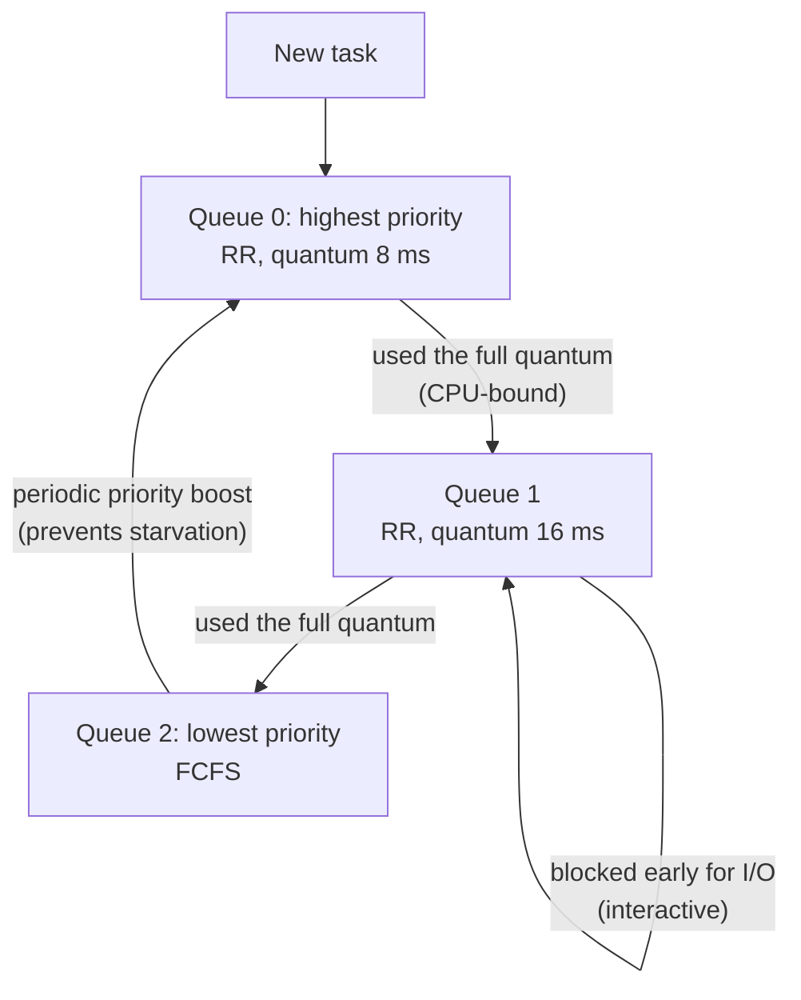

# 📘 CPU Scheduling

With more runnable tasks than CPU cores, the scheduler decides who runs next and for how long.
This page covers the classic algorithms with worked examples (a favorite of written tests and interviews), then how real schedulers like Linux's work.
All example numbers were computed with a small simulation script.

## Table of Contents

1. [Terms and Criteria](#1-terms-and-criteria)
2. [Preemptive vs Non-Preemptive](#2-preemptive-vs-non-preemptive)
3. [The Example Workload](#3-the-example-workload)
4. [FCFS](#4-fcfs)
5. [SJF and SRTF](#5-sjf-and-srtf)
6. [Round Robin](#6-round-robin)
7. [Priority Scheduling](#7-priority-scheduling)
8. [Multilevel Queues and MLFQ](#8-multilevel-queues-and-mlfq)
9. [Comparison](#9-comparison)
10. [Multiprocessor Scheduling](#10-multiprocessor-scheduling)
11. [How Linux Schedules](#11-how-linux-schedules)
12. [Questions](#12-questions)

---

## 1. Terms and Criteria

| Term | Definition |
| --- | --- |
| **Arrival time** | When the process becomes ready |
| **Burst time** | CPU time it needs |
| **Completion time** | When it finishes |
| **Turnaround time** | Completion - arrival |
| **Waiting time** | Turnaround - burst (time spent ready but not running) |
| **Response time** | First run - arrival |
| **Throughput** | Processes completed per unit time |
| **CPU utilization** | Fraction of time the CPU is busy |

Goals conflict: batch systems maximize **throughput**, interactive systems minimize **response time**, and every system wants **fairness** and no **starvation**.

Processes alternate between **CPU bursts** and **I/O bursts**.
**CPU-bound** tasks have long bursts (video encoding); **I/O-bound** tasks have short bursts (editors, web servers).
Good schedulers favor I/O-bound tasks briefly so devices stay busy and the system feels responsive.

---

## 2. Preemptive vs Non-Preemptive

| | Non-preemptive | Preemptive |
| --- | --- | --- |
| When the scheduler runs | Only when the running task blocks or exits | Also on timer interrupts and when a higher priority task arrives |
| Responsiveness | Poor, one long job blocks everyone | Good |
| Complexity | Simple | Needs synchronization for shared data (a task can be interrupted anywhere) |
| Examples | FCFS, SJF | SRTF, round robin, all modern OS schedulers |

The **dispatcher** performs the actual switch; **dispatch latency** is the time it takes.

---

## 3. The Example Workload

All examples below use this set of processes (times in ms).

| Process | Arrival | Burst |
| --- | --- | --- |
| P1 | 0 | 8 |
| P2 | 1 | 4 |
| P3 | 2 | 9 |
| P4 | 3 | 5 |

---

## 4. FCFS

**First come, first served**: run in arrival order, no preemption.

```text
| P1        | P2    | P3           | P4      |
0           8       12             21        26
```

| Process | Completion | Turnaround | Waiting |
| --- | --- | --- | --- |
| P1 | 8 | 8 | 0 |
| P2 | 12 | 11 | 7 |
| P3 | 21 | 19 | 10 |
| P4 | 26 | 23 | 18 |
| **Average** | | **15.25** | **8.75** |

Simple and fair in order, but suffers the **convoy effect**: short jobs wait behind one long job, like cars behind a truck.

---

## 5. SJF and SRTF

**Shortest job first** (non-preemptive): when the CPU frees up, pick the ready job with the shortest burst.

At time 0 only P1 is ready, so it runs to completion.
At 8, P2 (4) is shortest, then P4 (5), then P3 (9).

```text
| P1        | P2    | P4      | P3           |
0           8       12        17             26
```

| Process | Completion | Turnaround | Waiting |
| --- | --- | --- | --- |
| P1 | 8 | 8 | 0 |
| P2 | 12 | 11 | 7 |
| P3 | 26 | 24 | 15 |
| P4 | 17 | 14 | 9 |
| **Average** | | **14.25** | **7.75** |

**Shortest remaining time first** (preemptive SJF): whenever a job arrives, run whichever has the least remaining time.

At 1, P2 arrives with 4 < P1's remaining 7, so P2 preempts P1.

```text
| P1 | P2    | P4      | P1          | P3           |
0    1       5         10            17             26
```

| Process | Completion | Turnaround | Waiting |
| --- | --- | --- | --- |
| P1 | 17 | 17 | 9 |
| P2 | 5 | 4 | 0 |
| P3 | 26 | 24 | 15 |
| P4 | 10 | 7 | 2 |
| **Average** | | **13.0** | **6.5** |

SRTF gives the **minimum average waiting time** of any algorithm, provably.
Two problems:

1. The OS does not know burst times in advance, so it **predicts** them with an exponential average of past bursts: `next = a * last_actual + (1 - a) * last_prediction`.
2. Long jobs can **starve** if short ones keep arriving.

---

## 6. Round Robin

Each process gets a **time quantum**; when it expires, the process goes to the back of the ready queue.
Convention: processes that arrive during a quantum join the queue **before** the preempted process.

With quantum 4:

```text
| P1    | P2    | P3    | P4    | P1    | P3    | P4 | P3 |
0       4       8       12      16      20      24   25   26
```

| Process | Completion | Turnaround | Waiting |
| --- | --- | --- | --- |
| P1 | 20 | 20 | 12 |
| P2 | 8 | 7 | 3 |
| P3 | 26 | 24 | 15 |
| P4 | 25 | 22 | 17 |
| **Average** | | **18.25** | **11.75** |

Round robin has worse average waiting time here but much better **response time**: every process starts within 12 ms, and no one starves.

Choosing the quantum:

| Quantum | Effect |
| --- | --- |
| Very large | Degenerates into FCFS |
| Very small | Great responsiveness, but context switch overhead dominates |
| Rule of thumb | About 80 percent of CPU bursts should finish within one quantum; typical values 1 to 100 ms |

---

## 7. Priority Scheduling

Each process has a priority; the highest runs first (preemptive or not).
SJF is priority scheduling where priority is the inverse of burst length.

| Problem | Solution |
| --- | --- |
| **Starvation**: low priority tasks never run | **Aging**: gradually raise the priority of tasks that have waited long |
| **Priority inversion**: a high priority task waits on a lock held by a low priority task, while a medium priority task keeps the low one from running | **Priority inheritance**: the lock holder temporarily inherits the waiter's priority |

Priority inversion famously reset the **Mars Pathfinder** lander repeatedly in 1997, and was fixed remotely by enabling priority inheritance on a mutex in VxWorks.

---

## 8. Multilevel Queues and MLFQ

**Multilevel queue**: separate ready queues by class (system, interactive, batch), each with its own algorithm, and a rule between queues (strict priority or time slices).

**Multilevel feedback queue (MLFQ)** lets processes move between queues based on behavior, so the scheduler learns which tasks are interactive without being told.



MLFQ rules:

1. Higher queue always runs first; round robin within a queue.
2. New tasks start at the top.
3. Using up the time allotment at a level moves the task down (count total time at a level, not per burst, so tasks cannot game it by yielding just before the quantum ends).
4. Periodically boost everyone to the top, so CPU-bound tasks do not starve and tasks that became interactive recover.

Windows and classic Unix schedulers were MLFQ variants.

---

## 9. Comparison

| Algorithm | Preemptive | Avg waiting (example) | Starvation | Best for |
| --- | --- | --- | --- | --- |
| FCFS | No | 8.75 | No | Batch, simplicity |
| SJF | No | 7.75 | Yes | Batch with known lengths |
| SRTF | Yes | 6.5 (optimal) | Yes | Theory baseline |
| Round robin (q=4) | Yes | 11.75 | No | Time sharing, response time |
| Priority | Either | Depends | Yes, without aging | Mixed importance |
| MLFQ | Yes | Adaptive | No, with boosts | General purpose OS |

---

## 10. Multiprocessor Scheduling

| Concept | Meaning |
| --- | --- |
| **Per-CPU run queues** | Each core has its own queue to avoid a global lock; Linux does this |
| **Load balancing** | Periodically migrate tasks from busy to idle cores (push and pull migration) |
| **Processor affinity** | Keep a task on the same core to reuse warm caches; soft by default, hard with `taskset` / `sched_setaffinity` |
| **NUMA awareness** | Prefer the core near the memory a task uses; remote memory access is slower |
| **SMT / hyper-threading** | Two hardware threads share one core's execution units; schedulers prefer idle physical cores first |
| **Heterogeneous cores** | Performance and efficiency cores (Apple silicon, Intel P and E cores, ARM big.LITTLE); schedulers use hints (Intel Thread Director) to place tasks |
| **Gang scheduling** | Run cooperating threads at the same time on different cores |

---

## 11. How Linux Schedules

Linux has **scheduling classes**, checked in priority order:

| Class | Policies | Use |
| --- | --- | --- |
| **Stop / deadline** | `SCHED_DEADLINE` (earliest deadline first with runtime budgets) | Hard periodic real-time work |
| **Real-time** | `SCHED_FIFO`, `SCHED_RR` (static priority 1 to 99) | Audio, control loops; a runaway FIFO task can freeze a core |
| **Fair** | `SCHED_NORMAL` (`SCHED_OTHER`), `SCHED_BATCH`, `SCHED_IDLE` | Almost everything |
| **sched_ext** | Scheduling policies written as eBPF programs (merged in 6.12) | Experimentation, workload-specific schedulers |

### CFS and EEVDF

From 2007 to 2023, the fair class used **CFS** (Completely Fair Scheduler):

- Each task has a **virtual runtime** (`vruntime`): actual CPU time, scaled by weight.
- Pick the task with the smallest `vruntime`, kept in a red-black tree (O(log n) insert, O(1) pick of the leftmost).
- No fixed quantum: time slices come from a target latency divided among runnable tasks.
- A task that sleeps (I/O-bound) falls behind in `vruntime` and runs soon after waking, which makes it feel responsive.

Since **Linux 6.6 (2023)**, the fair class uses **EEVDF** (Earliest Eligible Virtual Deadline First).
It keeps the fairness idea but gives each task a virtual deadline, so latency-sensitive tasks can request shorter slices and get scheduled sooner, with fewer heuristics than CFS.

### Nice values and weights

- `nice` ranges from -20 (highest priority) to 19 (lowest); default 0.
- Each step is about a **10 percent** change in CPU share (weight ratio about 1.25).
- `nice -n 10 ./backup.sh`, `renice -n 5 -p 1234`; only root can lower the nice value.

### Containers and CPU limits

**cgroups** control CPU for groups of tasks:

| Setting | Meaning | Kubernetes mapping |
| --- | --- | --- |
| `cpu.weight` (shares) | Relative share when there is contention | CPU **requests** |
| `cpu.max` (quota / period) | Hard cap, e.g. 50 ms per 100 ms = half a core | CPU **limits** |

The quota is enforced per 100 ms period, so a multi-threaded app with a 1-core limit can burn its quota in 25 ms on 4 threads and then be **throttled** for 75 ms.
This causes mysterious latency spikes; many teams set CPU requests but no CPU limits for latency-sensitive services, and watch `nr_throttled` in `cpu.stat`.
Runtimes must also respect container limits when sizing thread pools (the JVM and Go runtime detect cgroup limits; Go 1.25 made `GOMAXPROCS` container-aware by default).

---

## 12. Questions

| Question | Short answer |
| --- | --- |
| Turnaround vs waiting vs response time? | Completion - arrival; turnaround - burst; first run - arrival |
| Which algorithm minimizes average waiting time? | SRTF (preemptive SJF) |
| Why is SJF hard in practice? | Burst length unknown; predict with exponential averaging |
| What is the convoy effect? | Short jobs stuck behind a long one in FCFS |
| How do you pick an RR quantum? | Large enough that most bursts fit, small enough for responsiveness; too small wastes time switching |
| Starvation and its fix? | Low priority never runs; aging or periodic boosts |
| What is priority inversion? | High waits on low holding a lock while medium runs; priority inheritance |
| How does MLFQ learn task types? | Demote tasks that use full quanta, keep ones that block early, boost periodically |
| How does Linux CFS pick the next task? | Smallest vruntime from a red-black tree; replaced by EEVDF in 6.6 |
| What does `nice` do? | Changes the weight, about 10 percent CPU share per step |
| Why do containers get throttled with idle CPUs on the host? | cgroup CPU quota per period is exhausted, regardless of host idle time |

Next: [Synchronization and Deadlocks](/docs/operating-systems/synchronization-and-deadlocks).
