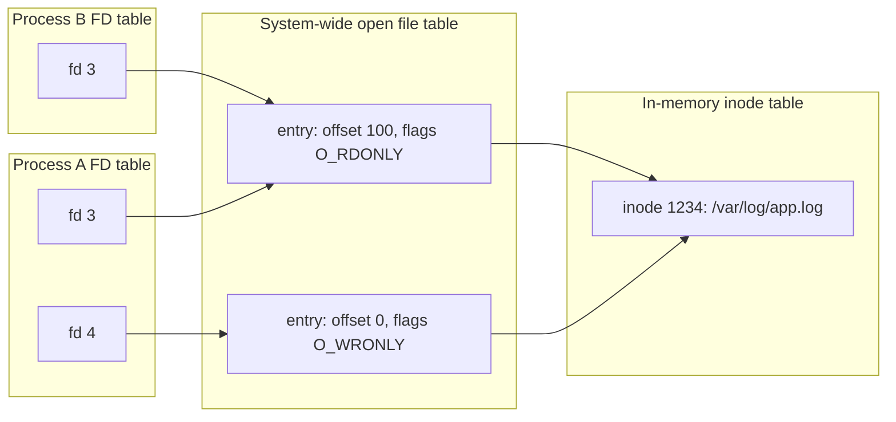
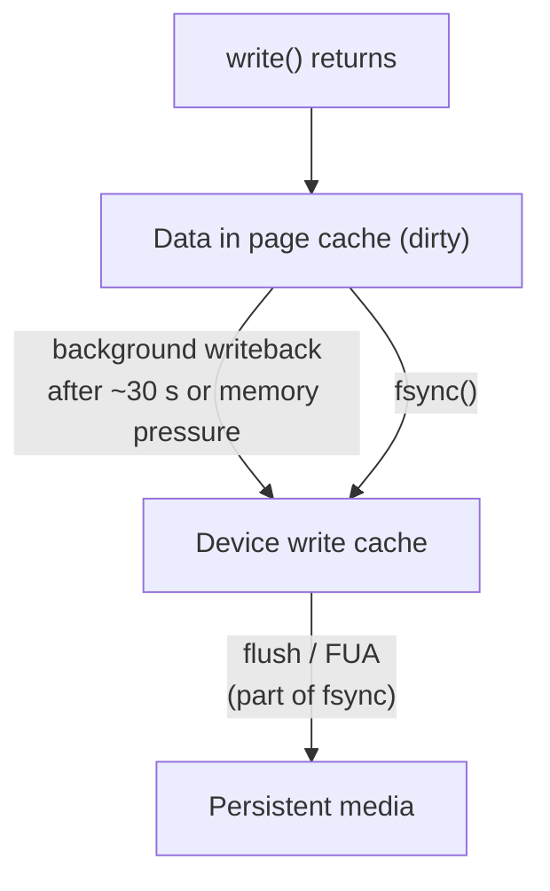

# 📘 File Systems and Storage

A file system turns a device full of numbered blocks into named files and directories that survive crashes.
This page covers how that works, why "write returned successfully" does not mean "the data is on disk", and how storage hardware shapes the design.

## Table of Contents

1. [Files and Directories](#1-files-and-directories)
2. [File Descriptors](#2-file-descriptors)
3. [Inodes](#3-inodes)
4. [Hard Links and Soft Links](#4-hard-links-and-soft-links)
5. [On-Disk Layout and Allocation](#5-on-disk-layout-and-allocation)
6. [Crash Consistency: Journaling and Copy-on-Write](#6-crash-consistency-journaling-and-copy-on-write)
7. [The VFS and Common File Systems](#7-the-vfs-and-common-file-systems)
8. [The Page Cache and Durability](#8-the-page-cache-and-durability)
9. [Storage Hardware](#9-storage-hardware)
10. [Disk Scheduling](#10-disk-scheduling)
11. [RAID](#11-raid)
12. [Questions](#12-questions)

---

## 1. Files and Directories

A **file** is a named sequence of bytes plus metadata.
The OS does not care about the format; that is the application's job.

| Unix file type | `ls -l` prefix |
| --- | --- |
| Regular file | `-` |
| Directory | `d` |
| Symbolic link | `l` |
| Character device (terminal, `/dev/null`) | `c` |
| Block device (disk) | `b` |
| Named pipe (FIFO) | `p` |
| Unix domain socket | `s` |

A **directory** is a special file that maps names to inode numbers.
Unix uses a single tree rooted at `/`, and other file systems are **mounted** onto directories in it.

| Path | Contents |
| --- | --- |
| `/etc` | Configuration |
| `/var` | Variable data: logs, spool, databases |
| `/tmp` | Temporary files, often RAM-backed (tmpfs) |
| `/proc`, `/sys` | Virtual file systems exposing kernel and process state |
| `/dev` | Device files |
| `/home`, `/root` | User directories |
| `/usr`, `/bin`, `/lib` | Programs and libraries |

### Permissions

```text
-rwxr-x---  1 alice devs  4096 Sep 24 10:00 deploy.sh
 |  |  |
 |  |  +-- others: no access
 |  +----- group: read, execute
 +-------- owner: read, write, execute
```

Octal: r = 4, w = 2, x = 1, so `rwxr-x---` = `750`.
For directories, `x` means "may enter or traverse", and `r` means "may list names".
Special bits: **setuid** (run as the file owner, like `passwd`), **setgid**, and **sticky** (in `/tmp`, only the owner can delete their files).
`umask` sets default permissions for new files; ACLs and capabilities add finer control.

---

## 2. File Descriptors

A **file descriptor** (FD) is a small integer that a process uses to refer to an open file, socket, pipe, or device.

| FD | Default |
| --- | --- |
| 0 | stdin |
| 1 | stdout |
| 2 | stderr |

The kernel keeps three levels of tables:



- The **open file entry** holds the current offset and flags.
- After `fork`, parent and child share open file entries, so they share the offset.
- `dup2(fd, 1)` makes FD 1 point to the same entry as `fd`; this is how shells implement `>` redirection.
- Each process has an FD limit (`ulimit -n`, often 1,024 soft by default); servers with many connections must raise it, or they fail with `EMFILE: Too many open files`.
- `lsof -p <pid>` or `ls -l /proc/<pid>/fd` lists a process's open FDs.

---

## 3. Inodes

An **inode** stores everything about a file **except its name**.

| Inode field | Example |
| --- | --- |
| Type and permissions | Regular file, `0644` |
| Owner and group | UID 1000, GID 1000 |
| Size | 12,345 bytes |
| Timestamps | atime (access), mtime (content modified), ctime (inode changed); some FSes add birth time |
| Link count | Number of directory entries pointing here |
| Block pointers or extents | Where the data lives |

```bash
stat notes.txt          # show inode number and metadata
ls -i                   # inode numbers
df -i                   # inode usage; a disk can be "full" with free space if inodes run out
```

Classic ext2/ext3 block pointers: 12 direct pointers, then single, double, and triple indirect blocks.
With 4 KB blocks and 4-byte pointers, one indirect block holds 1,024 pointers, so single indirect covers 4 MB, double 4 GB, and triple 4 TB.
Modern ext4 and XFS use **extents** instead: (start block, length) ranges, which describe large contiguous files compactly.

Deleting a file removes a directory entry and decrements the link count.
The data is freed only when the link count reaches zero **and** no process has the file open.
That is why deleting a huge log file that a process still writes to does not free space; `lsof +L1` finds such deleted-but-open files.

---

## 4. Hard Links and Soft Links

| | Hard link | Soft (symbolic) link |
| --- | --- | --- |
| What it is | Another directory entry for the same inode | A small file containing a path |
| Command | `ln target link` | `ln -s target link` |
| Same inode number | Yes | No |
| Survives deleting the original name | Yes, data stays | No, becomes dangling |
| Across file systems | No | Yes |
| To directories | No (would allow cycles) | Yes |

Symlinks are used for version switching (`current -> releases/2026-09-24`) and atomic deploys (create a new symlink, then `rename` it over the old one).

---

## 5. On-Disk Layout and Allocation

A typical Unix file system layout:

```text
| boot block | superblock | inode bitmap | data bitmap | inode table | data blocks ... |
```

| Part | Holds |
| --- | --- |
| **Superblock** | FS type, size, block size, counts, state; replicated for safety |
| **Bitmaps** | Which inodes and blocks are free |
| **Inode table** | All inodes |
| **Data blocks** | File contents and directory entries |

ext4 groups these into **block groups** so a file's inode and data stay close together.

| Allocation method | How | Pros | Cons |
| --- | --- | --- | --- |
| **Contiguous** | One run of blocks | Fast sequential and random access | External fragmentation, files cannot grow |
| **Linked** | Each block points to the next | No fragmentation | Slow random access, one bad pointer loses the rest |
| **FAT** | The chain of links in a separate table | Simple, cacheable | Table size, still sequential walking (FAT32, exFAT on USB drives) |
| **Indexed** | Inode holds pointers to blocks | Good random access | Pointer overhead for small files |
| **Extents** | Inode holds (start, length) ranges | Compact and fast for large files | Fragmented files need many extents |

---

## 6. Crash Consistency: Journaling and Copy-on-Write

Appending a block to a file updates several structures: the data block, the inode, and the data bitmap.
A crash between those writes leaves the file system inconsistent (a block marked used but owned by nobody, or an inode pointing at garbage).

| Approach | How | Example |
| --- | --- | --- |
| **fsck** | Scan everything after a crash and repair | ext2; slow on large disks |
| **Journaling** | Write intended changes to a log first, then apply them; replay the log after a crash | ext4, XFS, NTFS |
| **Copy-on-write** | Never overwrite in place; write new blocks, then atomically switch a root pointer | ZFS, Btrfs, APFS |
| **Log-structured** | The whole FS is an append-only log | F2FS for flash; the same idea as LSM trees in databases |

Journaling modes in ext4:

| Mode | Journals | Trade-off |
| --- | --- | --- |
| `journal` | Metadata and data | Safest, slowest (data written twice) |
| `ordered` (default) | Metadata; data written before its metadata commits | Good balance |
| `writeback` | Metadata only | Fastest, files may contain stale data after a crash |

This is the same **write-ahead logging** idea databases use; see [Database Internals](/docs/databases/database-internals).

---

## 7. The VFS and Common File Systems

The **Virtual File System** layer gives one API (`open`, `read`, `write`, `stat`) over many file system implementations, including virtual ones like `/proc`, network ones like NFS, and FUSE file systems in user space.

| File system | Where | Notes |
| --- | --- | --- |
| **ext4** | Linux default for many distros | Journaling, extents, mature |
| **XFS** | RHEL default, large servers | Excellent parallel I/O and large files |
| **Btrfs** | Fedora, openSUSE default, Synology | CoW, snapshots, checksums, compression |
| **ZFS** | FreeBSD, storage servers, Proxmox | CoW, end-to-end checksums, snapshots, built-in RAID (RAID-Z), send/receive replication |
| **APFS** | macOS, iOS | CoW, snapshots, clones, encryption, SSD optimized |
| **NTFS** | Windows | Journaling, ACLs; ReFS for resilient servers |
| **FAT32 / exFAT** | USB drives, SD cards | Portable, no permissions or journaling; FAT32 caps files at 4 GB |
| **tmpfs** | `/tmp`, `/dev/shm` | Lives in RAM (and swap) |
| **overlayfs** | Container images | Stacks read-only image layers with a writable top layer |
| **NFS, SMB** | Network shares | Remote file access; locking and caching semantics differ from local |

Checksums matter: hard drives and SSDs occasionally return silently corrupted data (**bit rot**), and only checksumming file systems like ZFS and Btrfs detect and, with redundancy, repair it.

---

## 8. The Page Cache and Durability

Reads and writes go through the **page cache** in RAM.



- `write()` returning success means the data is in the kernel's memory, **not** on disk.
- A power loss before writeback loses it.
- `fsync(fd)` blocks until the file's data and metadata reach stable storage, including flushing the device's own write cache.
- `fdatasync` skips non-essential metadata like timestamps.
- `O_DIRECT` bypasses the page cache (databases with their own buffer pools use it).
- `O_SYNC` makes every write synchronous.

### Writing a file safely

```c
// Atomic file replacement
int fd = open("config.json.tmp", O_WRONLY | O_CREAT | O_TRUNC, 0644);
write(fd, data, len);
fsync(fd);                                   // data is durable
close(fd);
rename("config.json.tmp", "config.json");   // atomic on POSIX file systems
int dir = open(".", O_RDONLY);
fsync(dir);                                  // make the rename itself durable
close(dir);
```

Readers see either the old or the new file, never a partial one.
Skipping the directory `fsync` can lose the rename after a crash.

Durability is expensive: an `fsync` costs from tens of microseconds on enterprise NVMe with power-loss protection to many milliseconds on consumer drives and HDDs.
Databases amortize it with **group commit** (one fsync for many transactions).

A famous lesson: in 2018 PostgreSQL discovered that after a failed `fsync` Linux may drop the dirty pages and report success on a retry, so the data is silently lost.
PostgreSQL now panics and recovers from its WAL on fsync failure (**"fsyncgate"**).

---

## 9. Storage Hardware

| | HDD | SATA SSD | NVMe SSD |
| --- | --- | --- | --- |
| How | Spinning platters, moving head | Flash over a SATA interface | Flash directly on PCIe |
| Random read latency | 5 to 10 ms (seek + rotation) | About 100 microseconds | 10 to 100 microseconds |
| Random IOPS | 100 to 200 | Tens of thousands | Hundreds of thousands to millions |
| Sequential throughput | 150 to 280 MB/s | About 550 MB/s | 3 to 14 GB/s (PCIe 4 and 5) |
| Queues | 1 | 1 queue, 32 commands | Up to 64K queues, 64K commands each |
| Cost per TB | Lowest | Medium | Medium, falling |
| Best for | Archives, bulk capacity | Legacy systems | Everything performance sensitive |

HDD access time = **seek time + rotational latency + transfer time**.
At 7,200 RPM a rotation takes 8.3 ms, so average rotational latency is about 4.2 ms.

Flash quirks the OS and databases care about:

| Quirk | Consequence |
| --- | --- |
| Cannot overwrite in place; must erase large blocks first | The **flash translation layer** (FTL) remaps writes, like a log-structured FS inside the drive |
| Limited program/erase cycles | **Wear leveling**; endurance rated in drive writes per day (DWPD) or TBW |
| **Write amplification** | One logical write may cause several physical ones; keep free space, use TRIM |
| **TRIM / discard** | Tells the drive which blocks are free so garbage collection is efficient |
| Garbage collection pauses | Tail latency spikes under sustained writes |

The Linux block layer uses the multi-queue design (`blk-mq`) to match NVMe's parallel queues.

---

## 10. Disk Scheduling

For HDDs, the order of requests determines how far the head moves.
Example: head at cylinder 53, queue `98, 183, 37, 122, 14, 124, 65, 67`, disk cylinders 0 to 199.

| Algorithm | Order served | Head movement |
| --- | --- | --- |
| **FCFS** | 98, 183, 37, 122, 14, 124, 65, 67 | 640 |
| **SSTF** (shortest seek first) | 65, 67, 37, 14, 98, 122, 124, 183 | 236 |
| **SCAN** (elevator, moving toward 0 first) | 37, 14, (to 0), 65, 67, 98, 122, 124, 183 | 236 (53 to 0, then 0 to 183) |
| **C-SCAN** (moving toward 199, jump back) | 65, 67, 98, 122, 124, 183, (to 199, return to 0), 14, 37 | 382 counting the return (183 without it) |
| **LOOK / C-LOOK** | Like SCAN / C-SCAN but turn at the last request instead of the disk end | Less than SCAN |

SSTF can starve far requests; SCAN and C-SCAN give more uniform wait times.

Linux I/O schedulers today:

| Scheduler | Use |
| --- | --- |
| `none` | NVMe: the device handles parallelism and ordering |
| `mq-deadline` | SATA SSDs and HDDs: bounds latency, prevents starvation |
| `bfq` | Desktops with slow disks: fairness and interactivity |
| `kyber` | Fast devices with latency targets |

Check with `cat /sys/block/nvme0n1/queue/scheduler`.

---

## 11. RAID

**RAID** combines disks for performance, redundancy, or both.

| Level | Layout | Usable capacity (n disks) | Survives | Notes |
| --- | --- | --- | --- | --- |
| **RAID 0** | Striping | n | Nothing | Fast, any disk failure loses everything |
| **RAID 1** | Mirroring | n / 2 (for pairs) | One disk per mirror | Fast reads, simple |
| **RAID 5** | Striping + distributed parity | n - 1 | 1 disk | Slow small writes (read-modify-write), long risky rebuilds on large disks |
| **RAID 6** | Striping + double parity | n - 2 | 2 disks | Safer for large arrays |
| **RAID 10** | Mirrored pairs, striped | n / 2 | One disk per pair | Best performance plus redundancy, databases love it |

Parity uses XOR: if `P = A xor B xor C`, then any lost block equals the XOR of the others.

**RAID is not a backup.**
It protects against disk failure, not against deletion, corruption, ransomware, or losing the whole machine.
Cloud block storage (EBS, Persistent Disk) is replicated behind the scenes; object storage (S3) uses **erasure coding**, a generalization of parity across many machines.

---

## 12. Questions

| Question | Short answer |
| --- | --- |
| What is an inode? | Metadata and block locations of a file, everything except the name |
| Hard link vs soft link? | Another name for the same inode vs a file containing a path |
| Why can a disk be full with free space? | Out of inodes, or deleted files still held open |
| What is a file descriptor? | Per-process integer handle to an open file entry |
| Does `write()` mean data is on disk? | No, only in the page cache until writeback or `fsync` |
| How do you write a file atomically? | Write temp, fsync, rename over the target, fsync the directory |
| What is journaling? | Log intended metadata changes before applying them, replay after a crash |
| Journaling vs copy-on-write? | Log then apply in place vs never overwrite, switch a root pointer |
| HDD vs SSD for random I/O? | Milliseconds vs microseconds; seek and rotation vs no moving parts |
| What is write amplification? | Flash writing more physically than logically because of erase blocks and GC |
| SSTF vs SCAN? | Nearest request first (starvation) vs elevator sweep (fair) |
| RAID 5 vs RAID 10? | Parity, capacity efficient, slow writes vs mirrored stripes, fast, half capacity |
| Is RAID a backup? | No |

Next: [I/O and Linux Internals](/docs/operating-systems/io-and-linux-internals).
