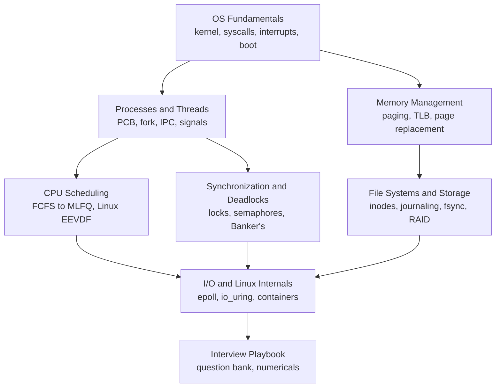

Start here for OS prep, from "what is a process" to "why is my container throttled when the host is idle".
Each topic covers the classic theory that campus interviews and written tests ask about, then connects it to what you see on a real Linux machine.
All numerical examples (scheduling, page replacement, Banker's algorithm, disk scheduling) were computed with a script, and recent kernel changes (EEVDF scheduler, sched_ext, MGLRU, io_uring, cgroups v2) are included where they matter.

<SectionHub
  path="operating-systems"
  levels={{
    "os-fundamentals": "Beginner",
    "processes-and-threads": "Beginner to mid",
    "cpu-scheduling": "Beginner to mid",
    "synchronization-and-deadlocks": "Mid to advanced",
    "memory-management": "Mid to advanced",
    "file-systems-and-storage": "Mid",
    "io-and-linux-internals": "Advanced",
    "os-interview-playbook": "All levels"
  }}
/>

## Reading Path

## Pick Your Level

| You are | Read in this order |
| --- | --- |
| New to operating systems | [Fundamentals](/docs/operating-systems/os-fundamentals), [Processes and Threads](/docs/operating-systems/processes-and-threads), [CPU Scheduling](/docs/operating-systems/cpu-scheduling) |
| Preparing for campus or a written test | Add [Synchronization](/docs/operating-systems/synchronization-and-deadlocks), [Memory](/docs/operating-systems/memory-management), and the numerical recipes in the [Playbook](/docs/operating-systems/os-interview-playbook) |
| Preparing for senior backend or infra | Add [File Systems](/docs/operating-systems/file-systems-and-storage), [I/O and Linux Internals](/docs/operating-systems/io-and-linux-internals) |
| One week left | The [Interview Playbook](/docs/operating-systems/os-interview-playbook) study plan |

## Related Sections

- [Computer Fundamentals](/docs/computer-fundamentals) covers the hardware the OS manages: CPU, caches, and the memory hierarchy.
- [Networking](/docs/networking) covers sockets from the protocol side.
- [Java](/docs/java) and [System Design LLD](/docs/system-design/lld) apply these concurrency ideas in application code.
