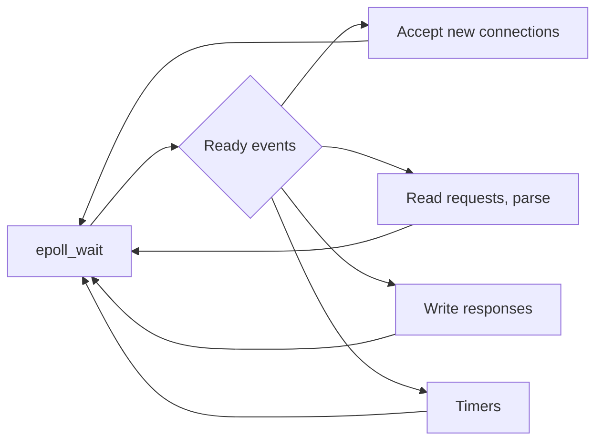
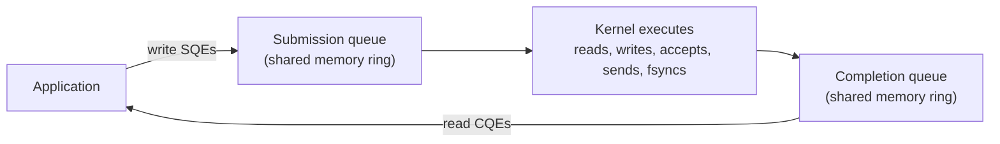
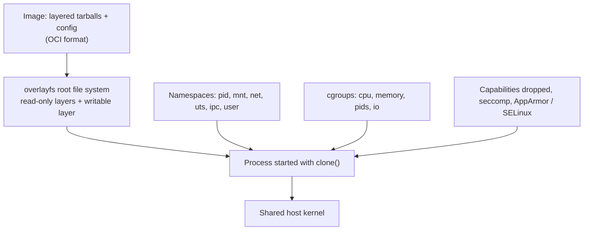

# 📘 I/O and Linux Internals

This page connects OS theory to the systems you run every day.
It explains how one Node.js or nginx process handles tens of thousands of connections, and how a Docker container is just a normal Linux process with a few kernel features switched on.

## Table of Contents

1. [I/O Models](#1-io-models)
2. [I/O Multiplexing: select, poll, epoll](#2-io-multiplexing-select-poll-epoll)
3. [The C10K Problem and Event Loops](#3-the-c10k-problem-and-event-loops)
4. [io_uring](#4-io_uring)
5. [Zero-Copy](#5-zero-copy)
6. [Namespaces](#6-namespaces)
7. [cgroups](#7-cgroups)
8. [Capabilities, seccomp, and LSMs](#8-capabilities-seccomp-and-lsms)
9. [What a Container Really Is](#9-what-a-container-really-is)
10. [eBPF](#10-ebpf)
11. [Linux Toolbox](#11-linux-toolbox)
12. [Questions](#12-questions)

---

## 1. I/O Models

The five classic Unix I/O models (from Stevens' *Unix Network Programming*):

| Model | Waiting for data | Copying data to the app | Example |
| --- | --- | --- | --- |
| **Blocking** | Thread blocks | Thread blocks | Default `read()` on a socket |
| **Non-blocking** | Returns `EAGAIN` immediately; app retries | Thread blocks briefly | `O_NONBLOCK` sockets |
| **I/O multiplexing** | Block on `select` / `epoll` for many FDs at once | Then read the ready ones | nginx, Redis, Node.js |
| **Signal-driven** | Kernel sends `SIGIO` when ready | App reads | Rare |
| **Asynchronous** | Kernel does both and notifies on completion | Kernel copies | `io_uring`, Windows IOCP, POSIX AIO |

**Synchronous vs asynchronous** is about whether the app does the copy step.
**Blocking vs non-blocking** is about whether a call waits.
Readiness-based APIs (epoll) say "you can read now without blocking"; completion-based APIs (io_uring, IOCP) say "your read is done, here is the data".

---

## 2. I/O Multiplexing: select, poll, epoll

| API | How it works | Cost per call | Limits |
| --- | --- | --- | --- |
| **`select`** | Pass bitmaps of FDs; kernel scans all | O(n) | 1,024 FDs (`FD_SETSIZE`), bitmaps rebuilt each call |
| **`poll`** | Pass an array of FDs | O(n) | No hard limit, still scans all |
| **`epoll`** (Linux) | Register FDs once; kernel keeps a ready list | O(ready FDs) | Scales to millions |
| **`kqueue`** (BSD, macOS) | Similar to epoll, also handles files, signals, timers | O(ready) | |
| **IOCP** (Windows) | Completion ports, completion based | O(completed) | |

```c
int ep = epoll_create1(0);
struct epoll_event ev = { .events = EPOLLIN, .data.fd = listen_fd };
epoll_ctl(ep, EPOLL_CTL_ADD, listen_fd, &ev);

struct epoll_event events[64];
for (;;) {
    int n = epoll_wait(ep, events, 64, -1);        // sleep until something is ready
    for (int i = 0; i < n; i++) {
        if (events[i].data.fd == listen_fd) {
            int c = accept4(listen_fd, NULL, NULL, SOCK_NONBLOCK);
            struct epoll_event cev = { .events = EPOLLIN, .data.fd = c };
            epoll_ctl(ep, EPOLL_CTL_ADD, c, &cev);
        } else {
            handle_readable(events[i].data.fd);    // read until EAGAIN
        }
    }
}
```

| Trigger mode | Behavior | Rule |
| --- | --- | --- |
| **Level-triggered** (default) | Reports an FD as long as it is ready | Forgiving; can read partially |
| **Edge-triggered** (`EPOLLET`) | Reports only on the change to ready | Must read until `EAGAIN`, or you will never be notified again |

`EPOLLEXCLUSIVE` and `SO_REUSEPORT` spread accepts across worker processes without the **thundering herd** (all workers waking for one connection).

---

## 3. The C10K Problem and Event Loops

Around 1999 the question was how to serve **10,000 concurrent connections** on one machine.
Thread-per-connection needed 10,000 threads, each with a stack (often 1 to 8 MB reserved) and context-switch costs.

| Model | How | Examples | Weakness |
| --- | --- | --- | --- |
| **Thread per connection** | Blocking I/O, one thread each | Classic Apache prefork, Tomcat BIO | Memory and switching at high concurrency |
| **Thread pool + blocking I/O** | Bounded threads | Most Java servers | Pool exhaustion under slow requests |
| **Event loop** | One thread, non-blocking I/O, epoll | Node.js, nginx, Redis, Netty | One CPU-heavy task blocks everyone |
| **Event loop per core** | N loops, `SO_REUSEPORT` | nginx workers, Envoy, Seastar | Load imbalance between loops |
| **M:N green threads** | Blocking-style code, runtime uses epoll underneath | Go, Java virtual threads, Erlang | Runtime complexity hidden from you |



**Node.js**: libuv runs the event loop on epoll / kqueue / IOCP.
Network I/O is truly non-blocking; file system operations, DNS `lookup`, and crypto run on a **thread pool** (4 threads by default, `UV_THREADPOOL_SIZE`) because regular file I/O cannot be made non-blocking with epoll.
See [Advanced JavaScript](/docs/javascript/adv-js) for the event loop phases.

Today C10M (ten million) is the benchmark, reached with kernel bypass (DPDK), io_uring, or careful epoll tuning.

---

## 4. io_uring

**io_uring** (Linux 5.1, 2019) is a completion-based async I/O interface built on two ring buffers shared between the application and the kernel.



| Advantage | Detail |
| --- | --- |
| **Fewer system calls** | Batch many operations per `io_uring_enter`, or none at all with kernel-side polling (SQPOLL) |
| **Truly async file I/O** | Unlike epoll, works for regular files |
| **Wide coverage** | Network, files, `openat`, `statx`, timeouts, linked operations |
| **Registered buffers and files** | Skip per-operation setup |

Used by high-performance databases and storage engines (ScyllaDB via Seastar, TigerBeetle, PostgreSQL 18's new `io_method = io_uring` option), Rust runtimes (tokio-uring, glommio), and QEMU.
Because of a history of security bugs, some environments (Google production, ChromeOS, Android apps, many container runtimes' default seccomp profiles) restrict or disable it.

---

## 5. Zero-Copy

Sending a file over a socket the naive way copies data four times and makes two system calls per chunk:

```text
read():  disk -> page cache (DMA) -> user buffer (CPU copy)
write(): user buffer -> socket buffer (CPU copy) -> NIC (DMA)
```

| Technique | Effect |
| --- | --- |
| **`sendfile(out_fd, in_fd, ...)`** | Page cache to socket inside the kernel; no user-space copy. nginx `sendfile on`, Kafka consumers, Java `FileChannel.transferTo` |
| **`splice` / `tee`** | Move data between FDs through a pipe without user copies |
| **`mmap` + `write`** | One fewer copy, but page fault overhead |
| **`MSG_ZEROCOPY`** | Send from user memory without copying, notification when the buffer is reusable |
| **Kernel TLS (kTLS)** | Kernel or NIC encrypts, so `sendfile` works even for HTTPS (Netflix serves video this way) |
| **Kernel bypass** (DPDK, RDMA, AF_XDP) | NIC to user space directly, for extreme packet rates |

Kafka's throughput story is largely sequential disk I/O, the page cache, batching, and `sendfile`.

---

## 6. Namespaces

**Namespaces** give a process its own view of a global resource.

| Namespace | Isolates | Effect inside a container |
| --- | --- | --- |
| **PID** | Process IDs | App sees itself as PID 1, cannot see host processes |
| **Mount** | Mount points | Its own root file system |
| **Network** | Interfaces, IPs, routes, ports, iptables | Own `eth0`, can bind port 80 independently |
| **UTS** | Hostname | Own hostname |
| **IPC** | System V IPC, POSIX message queues | Separate shared memory |
| **User** | UID and GID mappings | Root inside maps to an unprivileged user outside (rootless containers) |
| **Cgroup** | View of the cgroup tree | Sees its own cgroup as the root |
| **Time** | Monotonic and boot clocks | Useful for checkpoint and restore |

```bash
sudo unshare --pid --fork --mount-proc --uts --net bash   # a crude "container"
hostname sandbox; ps aux                                   # only a few processes visible
lsns                                                       # list namespaces
nsenter -t <pid> -n ip addr                                # run a command in another process's net namespace
```

---

## 7. cgroups

**Control groups** limit and account for the resources a group of processes may use.
**cgroups v2** (a single unified hierarchy) is the default on current distributions and Kubernetes.

| Controller | Key files | Controls |
| --- | --- | --- |
| **cpu** | `cpu.max`, `cpu.weight`, `cpu.stat` | Quota and relative share, throttling stats |
| **memory** | `memory.max`, `memory.high`, `memory.current`, `memory.events` | Hard limit (OOM kill), soft throttling, OOM counts |
| **io** | `io.max`, `io.weight` | Disk bandwidth and IOPS |
| **pids** | `pids.max` | Max processes (stops fork bombs) |
| **cpuset** | `cpuset.cpus`, `cpuset.mems` | Pin to cores and NUMA nodes |

```bash
cat /sys/fs/cgroup/<group>/memory.max
cat /sys/fs/cgroup/<group>/cpu.stat     # nr_throttled, throttled_usec
systemd-cgls                            # tree of cgroups
systemd-cgtop                           # live usage per cgroup
```

Namespaces decide **what a process can see**; cgroups decide **how much it can use**.

---

## 8. Capabilities, seccomp, and LSMs

| Mechanism | Purpose | Example |
| --- | --- | --- |
| **Capabilities** | Split root's power into about 40 pieces | `CAP_NET_BIND_SERVICE` to bind port 80 without full root; Docker drops most by default |
| **seccomp-bpf** | Filter which system calls a process may make | Docker's default profile blocks dozens of rarely needed syscalls |
| **LSMs** | Mandatory access control policies | SELinux (RHEL), AppArmor (Ubuntu), Landlock (unprivileged sandboxing) |
| **`no_new_privs`** | Children cannot gain privileges via setuid | Set by container runtimes |

---

## 9. What a Container Really Is



A container is **an ordinary process** that:

1. Runs in new **namespaces** (its own view of PIDs, mounts, network, hostname).
2. Is placed in a **cgroup** with resource limits.
3. Has a root file system built from image layers with **overlayfs** (the old `chroot` idea, done with `pivot_root`).
4. Has reduced privileges via **capabilities**, **seccomp**, and an **LSM** profile.

The stack: Docker or Kubernetes (via CRI) call **containerd** or **CRI-O**, which call an OCI runtime like **runc** (or **crun**, or **gVisor** / **Kata Containers** for stronger isolation) to make the kernel calls.

Consequences worth knowing:

- `ps` on the host shows container processes; they are not hidden inside a VM.
- A kernel exploit in one container can compromise the host, which is why multi-tenant platforms use gVisor, Kata, or Firecracker microVMs.
- The container sees the host's total CPU and memory in `/proc/cpuinfo` and `/proc/meminfo` unless tools like LXCFS are used, so runtimes must read cgroup limits to size themselves.
- PID 1 inside the container must handle signals and reap zombies (see [Processes and Threads](/docs/operating-systems/processes-and-threads)).

---

## 10. eBPF

**eBPF** lets you load small, verified programs into the kernel and attach them to events: system calls, function entries, network packets, tracepoints.
The verifier guarantees they terminate and cannot crash the kernel.

| Use | Tools |
| --- | --- |
| **Observability** | bpftrace, BCC tools (`execsnoop`, `opensnoop`, `biolatency`, `tcplife`), Pixie, Parca |
| **Networking** | Cilium (Kubernetes networking and kube-proxy replacement), Katran load balancer, XDP packet filtering |
| **Security** | Falco, Tetragon runtime detection |
| **Scheduling** | `sched_ext` custom CPU schedulers |
| **Profiling** | Continuous CPU profiling with low overhead |

```bash
sudo bpftrace -e 'tracepoint:syscalls:sys_enter_openat { printf("%s %s\n", comm, str(args->filename)); }'
```

---

## 11. Linux Toolbox

### Processes and CPU

| Command | Shows |
| --- | --- |
| `top`, `htop` | Live processes, CPU, memory, load |
| `ps aux`, `ps -eLf` | Processes, threads |
| `pstree -p` | Process tree |
| `uptime` | Load averages (1, 5, 15 min) |
| `vmstat 1` | Run queue (`r`), blocked (`b`), swapping, context switches, CPU split |
| `mpstat -P ALL 1` | Per-core usage |
| `pidstat 1` | Per-process CPU, I/O, context switches |
| `perf top`, `perf record -g` | CPU profiling, flame graphs |
| `strace -f -p <pid>` | System calls of a running process |
| `ltrace` | Library calls |
| `kill -TERM <pid>`, `pkill`, `killall` | Send signals |
| `nice`, `renice`, `taskset`, `chrt` | Priority, affinity, real-time policy |

### Memory and disk

| Command | Shows |
| --- | --- |
| `free -h` | Memory including page cache and `available` |
| `smem`, `pmap -x <pid>` | Per-process memory (PSS, mappings) |
| `df -h`, `df -i` | Space and inodes per file system |
| `du -sh *` | Space per directory |
| `iostat -xz 1` | Per-device utilization, latency (`await`), queue depth |
| `iotop` | Per-process disk I/O |
| `lsblk`, `blkid`, `mount` | Block devices and mounts |
| `lsof`, `lsof +L1` | Open files, deleted-but-open files |
| `dmesg -T` | Kernel log: OOM kills, disk errors, hardware issues |

### Useful `/proc` and `/sys` files

| Path | Contents |
| --- | --- |
| `/proc/<pid>/status` | State, memory, threads, capabilities |
| `/proc/<pid>/maps`, `smaps` | Memory mappings |
| `/proc/<pid>/fd/` | Open file descriptors |
| `/proc/<pid>/limits` | Resource limits |
| `/proc/loadavg`, `/proc/meminfo`, `/proc/cpuinfo` | System-wide stats |
| `/proc/pressure/{cpu,memory,io}` | Pressure stall information |
| `/proc/sys/` | Tunables, set with `sysctl` |
| `/sys/fs/cgroup/` | cgroup hierarchy |

### The 60-second performance checklist

Adapted from Brendan Gregg's well-known checklist, run in order on a slow Linux box:

```bash
uptime                 # load trend
dmesg -T | tail        # OOM kills, errors
vmstat 1               # run queue, swapping, CPU split
mpstat -P ALL 1        # one hot core?
pidstat 1              # which process
iostat -xz 1           # disk latency and saturation
free -m                # memory and page cache
sar -n DEV 1           # network throughput
sar -n TCP,ETCP 1      # connections and retransmits
top                    # overview
```

Think in **USE**: for every resource, check **U**tilization, **S**aturation (queueing), and **E**rrors.

---

## 12. Questions

| Question | Short answer |
| --- | --- |
| Blocking vs non-blocking vs async I/O? | Wait vs return EAGAIN vs kernel completes and notifies |
| select vs poll vs epoll? | Scan bitmap (1,024 limit) vs scan array vs kernel-maintained ready list, O(ready) |
| Level vs edge triggered? | Report while ready vs only on change; edge needs read until EAGAIN |
| How does Node.js handle concurrency with one thread? | Event loop on epoll for sockets, thread pool for files, DNS, crypto |
| What is io_uring? | Shared submission and completion rings for batched, truly async I/O |
| What is zero-copy? | Avoid user-space copies, e.g. `sendfile` from page cache to socket |
| Namespaces vs cgroups? | What a process can see vs how much it can use |
| What is a container? | A process with namespaces, cgroups, an overlay root FS, and reduced privileges on a shared kernel |
| Container vs VM security? | Shared kernel vs separate kernel; microVMs and gVisor bridge the gap |
| What is eBPF? | Verified programs running in the kernel on events, for tracing, networking, security |
| High load average but idle CPU? | Tasks in uninterruptible I/O wait (`D` state) |
| How do you find what a process is doing? | `strace`, `perf`, `/proc/<pid>`, `lsof` |

Next: [OS Interview Playbook](/docs/operating-systems/os-interview-playbook).
