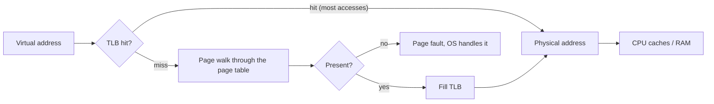
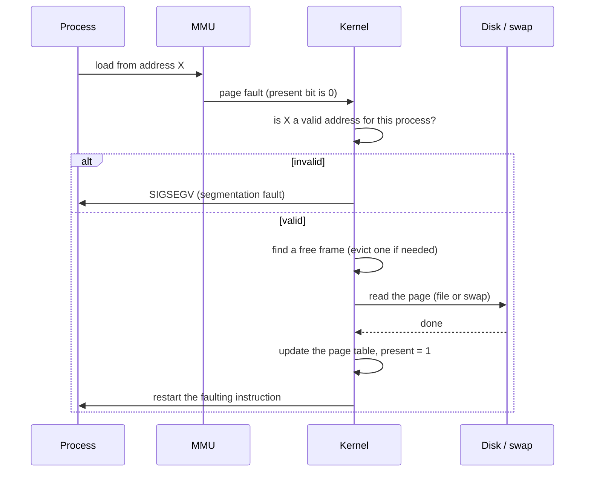

# 📘 Memory Management

Every process believes it owns a huge, private, contiguous memory.
In reality it shares a limited amount of RAM with everything else.
This page explains how the OS and hardware create that illusion, and what happens when it breaks down.
The worked counts for page replacement and translation were checked with a script.

## Table of Contents

1. [Why Virtual Memory](#1-why-virtual-memory)
2. [Contiguous Allocation and Fragmentation](#2-contiguous-allocation-and-fragmentation)
3. [Segmentation](#3-segmentation)
4. [Paging](#4-paging)
5. [Page Tables](#5-page-tables)
6. [The TLB](#6-the-tlb)
7. [Demand Paging and Page Faults](#7-demand-paging-and-page-faults)
8. [Page Replacement](#8-page-replacement)
9. [Thrashing and the Working Set](#9-thrashing-and-the-working-set)
10. [Memory in Practice on Linux](#10-memory-in-practice-on-linux)
11. [Heap Allocation](#11-heap-allocation)
12. [Questions](#12-questions)

---

## 1. Why Virtual Memory

Programs use **virtual addresses**.
The **MMU** (memory management unit) in the CPU translates each one to a **physical address** on every access, using tables the OS maintains.

| Benefit | How |
| --- | --- |
| **Isolation** | Each process has its own mappings; it cannot even name another process's memory |
| **Simplicity** | Every process can be linked to start at the same addresses |
| **Overcommit** | Total virtual memory can exceed RAM; rarely used pages live on disk or are never allocated |
| **Sharing** | The same physical page can appear in many processes (shared libraries, copy-on-write after `fork`) |
| **Protection** | Per-page permissions: read, write, execute, user or kernel only |
| **Memory-mapped files** | Map a file into memory and let the OS page it in and out |

---

## 2. Contiguous Allocation and Fragmentation

Early systems gave each process one contiguous block of physical memory.

| Placement strategy | Picks | Note |
| --- | --- | --- |
| **First fit** | First hole big enough | Fast, generally good |
| **Best fit** | Smallest hole big enough | Leaves tiny useless holes |
| **Worst fit** | Largest hole | Leaves big holes, usually worst in practice |
| **Next fit** | First fit, starting from the last position | Spreads allocations |

| Fragmentation | What is wasted | Where it happens | Fix |
| --- | --- | --- | --- |
| **External** | Free memory split into holes too small to use, though the total is enough | Variable-size allocation (segments, heaps) | **Compaction** (move things together) or paging |
| **Internal** | Unused space inside an allocated block | Fixed-size allocation (pages, size classes) | Smaller blocks, size classes |

Paging trades external fragmentation (eliminated) for a little internal fragmentation (half a page per region on average).

---

## 3. Segmentation

**Segmentation** splits a program into logical variable-size segments (code, data, stack, heap), each with a base and a limit.
An address is `(segment, offset)`; the hardware checks `offset < limit` and adds the base.

| Pros | Cons |
| --- | --- |
| Matches the program's logical structure | External fragmentation |
| Per-segment protection and sharing | Segments must fit contiguously |

x86-64 has essentially abandoned segmentation (flat segments), except `FS` and `GS` registers used for thread-local storage.
Modern systems use **paging**.

---

## 4. Paging

Virtual memory is split into fixed-size **pages**, physical memory into **frames** of the same size (4 KB by default on x86-64; ARM64 can use 4, 16, or 64 KB; Apple silicon uses 16 KB).

A virtual address splits into a **page number** and an **offset**:

```text
32-bit address, 4 KB pages (2^12):
| page number (20 bits) | offset (12 bits) |
```

The page table maps page number to frame number; the offset is unchanged.

### Worked example

32-bit virtual addresses, 4 KB pages, and the page table says page `0x403` lives in frame `0x2F`.
Translate virtual address `0x00403ABC`.

1. Offset = low 12 bits = `0xABC`.
2. Page number = remaining high bits = `0x00403` = page 1027.
3. Page table lookup: page `0x403` -> frame `0x2F`.
4. Physical address = frame followed by offset = `0x2F` then `ABC` = **`0x0002FABC`**.

### Page table size

32-bit addresses with 4 KB pages give 2^20 pages.
With 4-byte entries, one flat page table is 2^20 x 4 B = **4 MB per process**, mostly describing unused memory.
64-bit address spaces make flat tables impossible, which is why page tables are hierarchical.

---

## 5. Page Tables

### Multi-level paging

x86-64 uses a **4-level** radix tree for 48-bit virtual addresses (256 TB):

```text
| 9 bits PML4 | 9 bits PDPT | 9 bits PD | 9 bits PT | 12 bits offset |
```

Each level is a 4 KB page holding 512 entries of 8 bytes.
Only the parts of the tree that are actually used get allocated, so a small process needs only a few pages of page tables.
Newer CPUs support **5-level paging** (57-bit addresses, 128 PB) for huge-memory servers.

The cost: a TLB miss needs up to 4 memory reads (a **page walk**) before the real access.

### Page table entry bits

| Bit | Meaning |
| --- | --- |
| **Present** | Page is in RAM; if 0, access causes a page fault |
| **Frame number** | Physical location |
| **Read/Write** | Writable or read-only (copy-on-write uses read-only) |
| **User/Supervisor** | User mode may access it or not |
| **NX (no-execute)** | Data pages cannot run as code, blocking many exploits |
| **Accessed** | Set by hardware on use; used by replacement algorithms |
| **Dirty** | Set on write; dirty pages must be written back before eviction |

Other designs: **inverted page tables** (one entry per physical frame, searched with a hash; used by some PowerPC and IA-64 systems) and **hashed page tables**.

---

## 6. The TLB

The **translation lookaside buffer** is a small, fast cache of recent page-to-frame translations inside the CPU (tens to a few thousand entries).



**Effective access time** example: TLB lookup 20 ns, memory access 100 ns, hit ratio 80 percent, one-level page table.

- Hit: 20 + 100 = 120 ns.
- Miss: 20 + 100 (page table) + 100 (data) = 220 ns.
- EAT = 0.8 x 120 + 0.2 x 220 = **140 ns**.

With a 99 percent hit ratio, EAT = 0.99 x 120 + 0.01 x 220 = 121 ns, which is why TLB hit rates near 99 percent are essential.

TLB facts:

- A context switch to another process would invalidate the TLB, but **ASID / PCID** tags let entries from several address spaces coexist.
- Changing a mapping on one core requires a **TLB shootdown** (inter-processor interrupts to other cores), which is expensive.
- **Huge pages** (2 MB or 1 GB on x86-64) cover far more memory per TLB entry, which helps databases and JVMs with large heaps.

---

## 7. Demand Paging and Page Faults

With **demand paging**, a page is loaded only when first accessed.
Access to a non-present page causes a **page fault**:



| Fault type | Cause | Cost |
| --- | --- | --- |
| **Minor (soft)** | Page is in RAM but not mapped yet (first touch of zeroed memory, page cache hit, copy-on-write) | Microseconds |
| **Major (hard)** | Page must be read from disk | About 100 microseconds on NVMe, milliseconds on HDD |
| **Invalid** | Address not mapped or permission denied | Segfault |

Effective access time with page faults shows why they must be rare: with a 100 ns memory access and a 10 ms fault on HDD, one fault per 100,000 accesses doubles average access time.

`ps -o min_flt,maj_flt -p <pid>` or `/usr/bin/time -v` shows fault counts.

---

## 8. Page Replacement

When RAM is full, the OS must evict a page to make room.
Clean pages can simply be dropped; dirty pages must be written back first.

Reference string: `7 0 1 2 0 3 0 4 2 3 0 3 2 1 2 0 1 7 0 1` with 3 frames.

| Algorithm | Evicts | Page faults |
| --- | --- | --- |
| **FIFO** | The oldest loaded page | **15** |
| **LRU** | The least recently used page | **12** |
| **Optimal (Belady's MIN)** | The page used furthest in the future | **9** |

Optimal is impossible in practice (it needs the future) but is the benchmark.

LRU trace for the first steps (frames shown after each reference, F = fault):

| Ref | 7 | 0 | 1 | 2 | 0 | 3 | 0 | 4 |
| --- | --- | --- | --- | --- | --- | --- | --- | --- |
| Frames | 7 | 7 0 | 7 0 1 | 2 0 1 | 2 0 1 | 2 0 3 | 2 0 3 | 4 0 3 |
| Fault | F | F | F | F | | F | | F |

At reference `2`, page 7 is the least recently used, so it is evicted; at `3`, page 1 is; at `4`, page 2 is.

### Belady's anomaly

With FIFO, **adding frames can increase faults**.
Reference string `1 2 3 4 1 2 5 1 2 3 4 5`: FIFO causes **9** faults with 3 frames and **10** with 4.
LRU and Optimal are **stack algorithms** and never show this anomaly.

### Approximating LRU

Exact LRU needs updating a timestamp on every memory access, which is too expensive.
Real systems approximate it with the hardware **accessed bit**:

| Algorithm | Idea |
| --- | --- |
| **Second chance (Clock)** | Pages in a circle with a hand; if the accessed bit is 1, clear it and move on; evict the first page with 0 |
| **Enhanced clock** | Consider (accessed, dirty) pairs; prefer clean, unused pages |
| **LFU / MFU** | Count uses; rarely good alone |
| **Linux** | Active and inactive LRU lists; since 6.1, **multi-gen LRU (MGLRU)** tracks several generations for better decisions |

---

## 9. Thrashing and the Working Set

**Thrashing**: the system spends more time paging than doing work, because the active pages of running processes do not fit in RAM.
CPU utilization drops, an old-style scheduler sees an idle CPU, admits more processes, and makes it worse.


- **Locality of reference**: programs use a small set of pages at any time (temporal and spatial locality).
- **Working set**: the pages a process used in the last window of time; if the sum of working sets exceeds RAM, thrashing follows.
- **Page fault frequency control**: give a process more frames if its fault rate is high, take some away if low.
- Real-world fixes: add RAM, run fewer things, reduce memory use, or let the OOM killer act.

---

## 10. Memory in Practice on Linux

### Reading `free -h`

```text
               total   used   free   shared  buff/cache  available
Mem:            31Gi   9.8Gi  1.2Gi  0.4Gi   20Gi        21Gi
Swap:          8.0Gi   0.1Gi  7.9Gi
```

- Low `free` is normal: Linux uses spare RAM for the **page cache** (file data) and gives it back on demand.
- **`available`** is the number to watch: memory usable without swapping.
- "Linux ate my RAM" is not a problem; unused RAM is wasted RAM.

### Process memory numbers

| Metric | Meaning |
| --- | --- |
| **VSZ / VIRT** | Total virtual address space reserved; often huge and mostly meaningless |
| **RSS / RES** | Physical memory currently mapped, including shared pages counted in each process |
| **PSS** | Proportional: shared pages divided among sharers; best for summing |
| **USS** | Pages unique to this process: what you would free by killing it |

### Swap, overcommit, and OOM

| Concept | Detail |
| --- | --- |
| **Swap** | Disk area for evicted anonymous pages; `vm.swappiness` controls the preference for swapping vs dropping page cache |
| **zram / zswap** | Compressed swap in RAM; default on many desktops, Android, and ChromeOS |
| **Overcommit** | `malloc` succeeds even if RAM is not available, since pages are allocated on first touch (`vm.overcommit_memory`) |
| **OOM killer** | When memory truly runs out, the kernel kills the process with the highest `oom_score` (tunable via `oom_score_adj`) |
| **cgroup memory limits** | Containers get `memory.max`; exceeding it triggers an OOM kill inside the cgroup; Kubernetes reports `OOMKilled` (exit code 137 = 128 + SIGKILL) |
| **PSI** | Pressure stall information (`/proc/pressure/memory`) shows time lost waiting on memory; `systemd-oomd` acts on it |

### Huge pages

| Type | Detail |
| --- | --- |
| **Explicit huge pages** (hugetlbfs) | Reserved up front; used by databases (Oracle, PostgreSQL `huge_pages`), DPDK |
| **Transparent huge pages (THP)** | Kernel promotes memory to 2 MB pages automatically; can cause latency spikes during compaction, so Redis and some databases recommend `madvise` mode or disabling it |

### `mmap`

`mmap` maps a file (or anonymous memory) into the address space.
Reads become page faults served from the page cache, and the OS handles caching and write-back.
Used by databases (LMDB, older MongoDB engine), loaders for shared libraries, and fast file readers.
Downsides for databases: little control over eviction and I/O errors arrive as signals, which is why most databases manage their own buffer pool instead.

---

## 11. Heap Allocation

`malloc` and `free` manage the heap in user space, asking the kernel for memory in big chunks (`brk` for the main heap, `mmap` for large allocations, 128 KB and up by default in glibc).

| Technique | Idea |
| --- | --- |
| **Free lists** | Linked lists of free blocks; first fit or best fit |
| **Size classes / segregated lists** | Separate lists per size to reduce fragmentation and search time |
| **Buddy system** | Blocks are powers of two; split and merge with a "buddy"; used by the Linux page allocator |
| **Slab allocator** | Caches of pre-initialized objects of one type; used by the Linux kernel (SLUB) |
| **Thread caches / arenas** | Per-thread pools avoid lock contention (tcmalloc, jemalloc, mimalloc) |

Common memory bugs and tools:

| Bug | Tool |
| --- | --- |
| Leak (never freed) | Valgrind, LeakSanitizer, heap profilers |
| Use after free, double free | AddressSanitizer |
| Buffer overflow | AddressSanitizer, stack canaries, NX, ASLR |
| Fragmentation growth in long-running servers | Switch to jemalloc or mimalloc, monitor RSS vs live heap |

Garbage-collected runtimes (JVM, Go, .NET, V8) sit on top of the same OS mechanisms; see [Compilers and Program Execution](/docs/computer-fundamentals/compilers-and-program-execution) for GC.

---

## 12. Questions

| Question | Short answer |
| --- | --- |
| Why virtual memory? | Isolation, overcommit, sharing, protection, simpler linking |
| Paging vs segmentation? | Fixed-size pages, no external fragmentation vs logical variable-size segments |
| Internal vs external fragmentation? | Waste inside allocated blocks vs unusable holes between them |
| How is a virtual address translated? | Page number via TLB or page walk to frame, append offset |
| Why multi-level page tables? | Flat tables are too large; only allocate used parts of the tree |
| What is a TLB and why does it matter? | Translation cache; misses cost a page walk; hit rate near 99 percent needed |
| What happens on a page fault? | Validate, find a frame, load from disk or zero, update the table, restart the instruction |
| Minor vs major fault? | Page in RAM but unmapped vs must be read from disk |
| FIFO vs LRU vs Optimal? | Oldest vs least recently used vs used furthest in the future |
| What is Belady's anomaly? | More frames causing more faults under FIFO |
| What is thrashing? | Working sets exceed RAM, time spent paging instead of computing |
| Why does Linux show little free memory? | Page cache uses spare RAM; look at `available` |
| What does exit code 137 mean in Kubernetes? | Killed by SIGKILL, usually the OOM killer on a memory limit |

Next: [File Systems and Storage](/docs/operating-systems/file-systems-and-storage).
