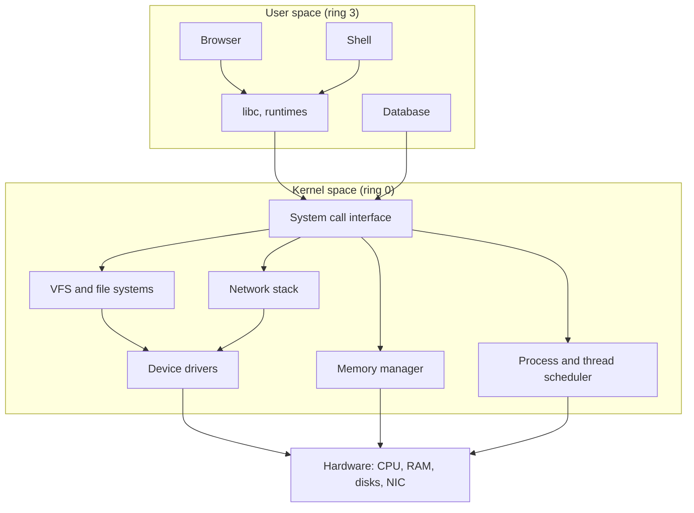
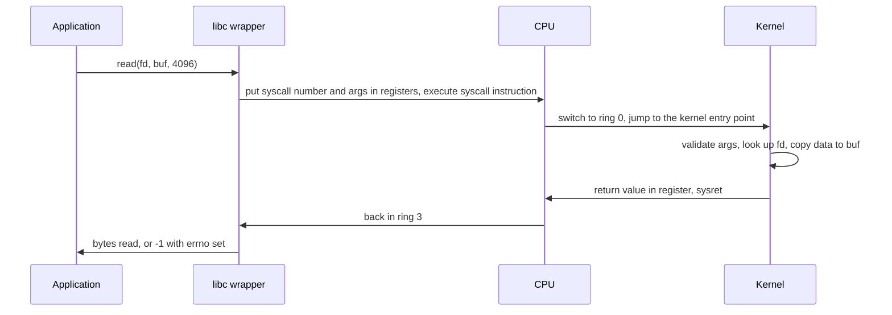
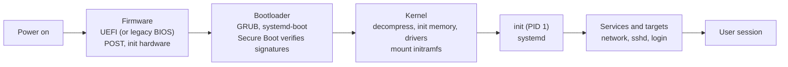

# 📘 OS Fundamentals

This page is the foundation for the whole Operating Systems section.
It explains what an operating system is for, how the CPU keeps applications from breaking each other, and how a program asks the kernel for help.

## Table of Contents

1. [What an Operating System Does](#1-what-an-operating-system-does)
2. [Kernel Space and User Space](#2-kernel-space-and-user-space)
3. [System Calls](#3-system-calls)
4. [Interrupts, Exceptions, and Traps](#4-interrupts-exceptions-and-traps)
5. [Kernel Architectures](#5-kernel-architectures)
6. [The Boot Process](#6-the-boot-process)
7. [Types of Operating Systems](#7-types-of-operating-systems)
8. [Virtualization and Containers](#8-virtualization-and-containers)
9. [The OS Landscape](#9-the-os-landscape)
10. [Beginner Questions](#10-beginner-questions)

---

## 1. What an Operating System Does

An **operating system** sits between hardware and applications.
It has two jobs:

1. **Resource manager**: share CPU time, memory, disks, and devices among many programs fairly and safely.
2. **Abstraction provider**: give programs simple interfaces (processes, files, sockets) instead of raw hardware.

| Abstraction | Hides | Covered in |
| --- | --- | --- |
| **Process** | A CPU shared with hundreds of other programs | [Processes and Threads](/docs/operating-systems/processes-and-threads) |
| **Thread** | Multiple cores and interleaved execution | [Processes and Threads](/docs/operating-systems/processes-and-threads) |
| **Virtual memory** | Limited, fragmented physical RAM | [Memory Management](/docs/operating-systems/memory-management) |
| **File** | Disk blocks, SSD pages, device details | [File Systems and Storage](/docs/operating-systems/file-systems-and-storage) |
| **Socket** | Network cards and protocols | [I/O and Linux Internals](/docs/operating-systems/io-and-linux-internals) |
| **File descriptor** | "Everything is a file" handle for all of the above on Unix | [I/O and Linux Internals](/docs/operating-systems/io-and-linux-internals) |

Goals that pull against each other: **efficiency** (use hardware well), **fairness**, **isolation and security**, **responsiveness**, and **simplicity** for programmers.

---

## 2. Kernel Space and User Space

The **kernel** is the core of the OS that runs with full hardware privilege.
Everything else runs in **user space** with restricted privilege.

The CPU enforces this with **privilege modes**:

| Architecture | Most privileged | Least privileged |
| --- | --- | --- |
| x86-64 | Ring 0 (kernel) | Ring 3 (user); rings 1 and 2 unused |
| ARM64 | EL1 (kernel), EL2 (hypervisor), EL3 (firmware) | EL0 (user) |
| RISC-V | M-mode (machine), S-mode (supervisor) | U-mode (user) |

In user mode, the CPU refuses privileged instructions (disable interrupts, change page tables, talk to devices directly).
Trying one causes a fault, and the kernel usually kills the process.

Why the split matters:

- A buggy application cannot crash the machine or read another process's memory.
- The kernel can enforce permissions (who can open which file).
- Crossing the boundary costs time, so high-performance systems try to cross it less often (batching, `io_uring`, kernel bypass like DPDK).

---

## 3. System Calls

A **system call** is how a user program asks the kernel to do something privileged.

| Category | Linux examples |
| --- | --- |
| **Process control** | `fork`, `execve`, `exit`, `wait4`, `clone`, `kill` |
| **File management** | `open`, `read`, `write`, `close`, `lseek`, `stat`, `fsync` |
| **Device management** | `ioctl`, `mmap` |
| **Information** | `getpid`, `uname`, `clock_gettime` |
| **Communication** | `pipe`, `socket`, `connect`, `sendmsg`, `shmget`, `mmap` |
| **Memory** | `brk`, `mmap`, `munmap`, `mprotect` |
| **Protection** | `chmod`, `setuid`, `seccomp` |

Facts to remember:

- A system call costs roughly **100 ns to a few microseconds**, much more than a function call, and more since Spectre and Meltdown mitigations.
- Some calls avoid the switch: Linux maps a small shared library called the **vDSO** into every process so `clock_gettime` and `gettimeofday` run in user space.
- `strace -c ./program` counts system calls; it is the fastest way to see what a program is really doing.
- **Library call vs system call**: `printf` is a library function that buffers and eventually calls `write`.

---

## 4. Interrupts, Exceptions, and Traps

Control reaches the kernel in three ways.

| Event | Source | Timing | Example |
| --- | --- | --- | --- |
| **Hardware interrupt** | Device | Asynchronous | NIC received a packet, disk finished, timer tick |
| **Exception (fault)** | The current instruction | Synchronous, unintentional | Page fault, divide by zero, invalid opcode |
| **Trap** | The current instruction | Synchronous, intentional | `syscall` instruction, breakpoint (`int3`) |

The CPU looks up a handler in the **interrupt vector table** (IDT on x86), saves the current state, and switches to kernel mode.

Linux splits interrupt handling in two:

- **Top half** (the hard IRQ handler): runs immediately with interrupts disabled, does the minimum (acknowledge the device, grab the data).
- **Bottom half** (softirqs, tasklets, workqueues): does the rest later with interrupts enabled.

The **timer interrupt** is what makes **preemptive multitasking** possible: even a program stuck in `while (true) {}` gets interrupted so the scheduler can run someone else.

**Polling vs interrupts**: at very high packet rates, interrupts per packet overwhelm the CPU, so network drivers switch to polling (Linux NAPI) under load.

**DMA** (direct memory access) lets devices copy data to RAM without the CPU; the CPU only gets an interrupt when the transfer is done.

---

## 5. Kernel Architectures

| Architecture | Idea | Pros | Cons | Examples |
| --- | --- | --- | --- | --- |
| **Monolithic** | All services (drivers, FS, network) in kernel space | Fast (function calls, no IPC) | One bad driver crashes everything, large attack surface | Linux, BSDs |
| **Microkernel** | Kernel does only IPC, scheduling, basic memory; the rest are user-space servers | Isolation, reliability, verifiable | IPC overhead | seL4, QNX, MINIX 3, Fuchsia (Zircon) |
| **Hybrid** | Microkernel structure, but many services run in kernel space for speed | Balance | Complexity | Windows NT, macOS XNU (Mach + BSD) |
| **Exokernel / unikernel** | Minimal kernel, app links its own OS library | Tiny, fast boot | Single app, niche | MirageOS, Unikraft |

Linux is monolithic but **modular**: drivers load at runtime as kernel modules (`lsmod`, `modprobe`).
It also gains microkernel-like safety through **eBPF**, which lets verified programs run inside the kernel safely, and Rust is now accepted for new drivers.

---

## 6. The Boot Process

| Stage | Detail |
| --- | --- |
| **Firmware** | UEFI replaced BIOS; runs self-tests, finds a boot device, reads the EFI system partition (GPT disks) |
| **Secure Boot** | Firmware only runs bootloaders and kernels signed by trusted keys |
| **Bootloader** | Loads the kernel image and the **initramfs** (a small temporary root file system with drivers needed to mount the real root) |
| **Kernel** | Sets up page tables, scheduler, drivers, mounts the root FS, starts PID 1 |
| **init / systemd** | Starts services in parallel based on dependencies; PID 1 also adopts orphaned processes |

---

## 7. Types of Operating Systems

| Type | Goal | Example |
| --- | --- | --- |
| **Batch** | Run queued jobs without interaction | Early mainframes, HPC job schedulers (Slurm) |
| **Multiprogramming** | Keep the CPU busy by switching when a job waits for I/O | The idea behind every modern OS |
| **Time-sharing / multitasking** | Rapid switching so many users feel they own the machine | Unix, all desktop OSes |
| **Real-time (RTOS)** | Guaranteed deadlines | FreeRTOS, Zephyr, QNX, VxWorks; Linux has `PREEMPT_RT` merged since 6.12 |
| **Distributed** | Many machines appear as one | Research systems; Kubernetes is the practical cousin |
| **Embedded** | Small, fixed-function devices | Routers, appliances, cars |
| **Mobile** | Battery, touch, sandboxed apps | Android (Linux kernel), iOS (XNU) |

**Hard real-time**: missing a deadline is a failure (airbag, pacemaker).
**Soft real-time**: missing a deadline degrades quality (video playback, audio).

---

## 8. Virtualization and Containers

| | Virtual machine | Container |
| --- | --- | --- |
| Isolation boundary | Hypervisor, separate kernel per VM | Shared host kernel, isolated with namespaces and cgroups |
| Startup | Seconds to minutes | Milliseconds to seconds |
| Overhead | Higher (full guest OS) | Near native |
| Security isolation | Strong | Weaker (kernel bugs are shared); hardened by seccomp, user namespaces, gVisor, Kata |
| Image size | GBs | MBs |
| Example | KVM, VMware, Hyper-V, Xen, Firecracker microVMs | Docker, containerd, Podman |

**Hypervisor types**:

- **Type 1 (bare metal)**: runs directly on hardware (KVM, which turns Linux into a hypervisor, ESXi, Hyper-V, Xen); clouds use these.
- **Type 2 (hosted)**: runs on a host OS (VirtualBox, VMware Workstation, Parallels).

Hardware support (Intel VT-x, AMD-V, ARM virtualization extensions) and nested page tables (EPT, NPT) made virtualization nearly native speed.

**Firecracker microVMs** (behind AWS Lambda and Fargate) combine VM-grade isolation with container-like startup of about 125 ms.

Containers are covered in depth in [I/O and Linux Internals](/docs/operating-systems/io-and-linux-internals).

---

## 9. The OS Landscape

| OS | Kernel | Notes |
| --- | --- | --- |
| **Linux** | Monolithic, modular | Runs almost all servers, clouds, Android, supercomputers; distributions: Ubuntu, Debian, RHEL, Fedora, Alpine, Amazon Linux |
| **Windows** | Hybrid (NT) | Desktops, enterprise, gaming; WSL2 runs a real Linux kernel in a lightweight VM |
| **macOS / iOS** | Hybrid (XNU: Mach + BSD) | Apple silicon (ARM64), APFS file system |
| **FreeBSD / OpenBSD** | Monolithic | Netflix CDN, networking appliances, security focus |
| **Android** | Linux kernel + ART runtime | Most smartphones |

**POSIX** is the standard API (processes, files, signals, threads) that Unix-like systems share, which is why the same C code compiles on Linux and macOS.

---

## 10. Beginner Questions

| Question | Short answer |
| --- | --- |
| What is an operating system? | Software that manages hardware resources and provides abstractions like processes, files, and sockets |
| What is a kernel? | The privileged core of the OS that runs in kernel mode |
| Kernel mode vs user mode? | Full hardware access vs restricted; enforced by the CPU |
| What is a system call? | A controlled entry into the kernel to request a privileged service |
| Interrupt vs exception vs trap? | Async from a device vs sync error from an instruction vs sync intentional (syscall) |
| Monolithic vs microkernel? | All services in the kernel for speed vs minimal kernel with user-space servers for isolation |
| What happens when you power on a computer? | Firmware, bootloader, kernel, init, services |
| VM vs container? | Separate kernel per VM vs shared kernel with namespaces and cgroups |
| What is preemptive multitasking? | The timer interrupt lets the OS take the CPU away from a running task |
| What is POSIX? | The standard Unix API so programs are portable |

Next: [Processes and Threads](/docs/operating-systems/processes-and-threads).
