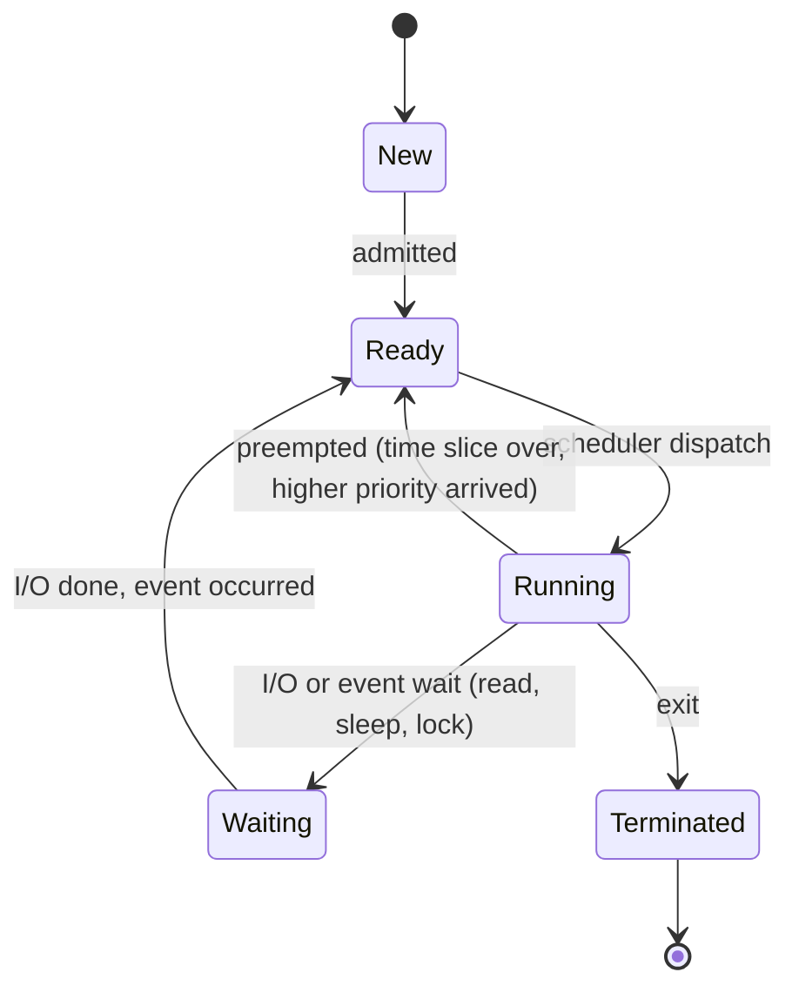
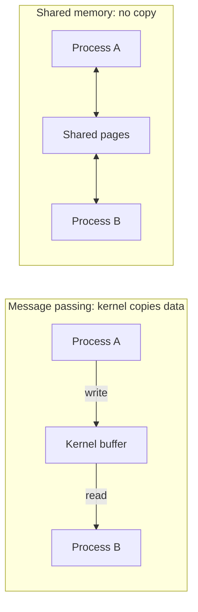

# 📘 Processes and Threads

A **process** is a program in execution.
A **thread** is a unit of execution inside a process.
This page covers how the OS represents them, how it switches between them, how they are created, and how they talk to each other.

## Table of Contents

1. [Program vs Process](#1-program-vs-process)
2. [Process Memory Layout](#2-process-memory-layout)
3. [The Process Control Block](#3-the-process-control-block)
4. [Process States](#4-process-states)
5. [Context Switching](#5-context-switching)
6. [Creating Processes: fork and exec](#6-creating-processes-fork-and-exec)
7. [Zombies, Orphans, and Daemons](#7-zombies-orphans-and-daemons)
8. [Threads](#8-threads)
9. [Threading Models](#9-threading-models)
10. [Green Threads, Coroutines, and Virtual Threads](#10-green-threads-coroutines-and-virtual-threads)
11. [Inter-Process Communication](#11-inter-process-communication)
12. [Questions](#12-questions)

---

## 1. Program vs Process

| Program | Process |
| --- | --- |
| Passive file on disk (an ELF, Mach-O, or PE executable) | Active instance with state |
| One copy | Many processes can run the same program |
| No resources | Owns memory, open files, CPU state, a PID |

Running `python` twice gives two processes from one program, each with its own memory.

---

## 2. Process Memory Layout

Each process sees its own **virtual address space**.

```text
High addresses
+---------------------------+
| Kernel space              |  mapped but inaccessible from user mode
+---------------------------+
| Stack                     |  grows down; locals, return addresses, one per thread
|            |              |
|            v              |
|                           |
| Memory-mapped region      |  shared libraries, mmap'd files, thread stacks
|                           |
|            ^              |
|            |              |
| Heap                      |  grows up; malloc / new
+---------------------------+
| BSS                       |  uninitialized globals (zeroed)
| Data                      |  initialized globals and statics
| Text (code)               |  read-only, executable, shareable
+---------------------------+
Low addresses
```

| Segment | Contents | Notes |
| --- | --- | --- |
| **Text** | Machine code | Read and execute only; shared between processes running the same binary |
| **Data** | `int count = 5;` at global scope | Loaded from the executable |
| **BSS** | `static int buf[1024];` | Zero-filled at load time, takes no space in the file |
| **Heap** | Dynamic allocations | Managed by `malloc` via `brk` and `mmap` |
| **Stack** | Call frames | Default 8 MB for the main thread on Linux (`ulimit -s`); overflow causes a segfault |

**ASLR** (address space layout randomization) places these at random offsets each run to make exploits harder.

See it live: `cat /proc/<pid>/maps` on Linux or `vmmap <pid>` on macOS.

---

## 3. The Process Control Block

The kernel tracks each process in a **PCB** (on Linux, `struct task_struct`).

| Field | Purpose |
| --- | --- |
| PID, parent PID | Identity and family tree |
| State | Running, ready, blocked, and so on |
| Saved CPU context | Program counter, stack pointer, general registers, flags |
| Scheduling info | Priority, nice value, time used, policy |
| Memory info | Page table pointer, memory map |
| Open files | File descriptor table |
| Credentials | UID, GID, capabilities |
| Signals | Pending and blocked signals, handlers |
| Accounting | CPU time, start time, resource limits |

On Linux, threads are also `task_struct`s that share the memory map and file table; the kernel schedules **tasks**, not processes.

---

## 4. Process States



| State | Linux `ps` code |
| --- | --- |
| Running or runnable | `R` |
| Interruptible sleep (waiting, can be woken by signals) | `S` |
| Uninterruptible sleep (usually disk or NFS I/O) | `D` (cannot be killed until the I/O returns) |
| Stopped (Ctrl+Z, debugger) | `T` |
| Zombie | `Z` |

Load average on Linux counts tasks in `R` **and** `D`, so a high load with idle CPUs often means processes stuck on I/O.

---

## 5. Context Switching

A **context switch** saves the state of the running task and restores another.

1. Timer interrupt or blocking system call enters the kernel.
2. Save registers, program counter, and stack pointer into the current task's PCB.
3. Scheduler picks the next task.
4. If it belongs to a different process, switch the page table (update `CR3` on x86).
5. Restore the next task's registers and return to user mode.

| Cost | Detail |
| --- | --- |
| **Direct** | A few microseconds on modern hardware |
| **Indirect** (usually bigger) | Cold CPU caches, TLB flushes on process switches (mitigated with PCID / ASID tags), branch predictor state |
| **Thread vs process switch** | Threads in the same process share the address space, so no page table change: cheaper |

Too many switches (thousands of threads, heavy lock contention) waste CPU; check `vmstat 1` (`cs` column) or `pidstat -w`.

**Mode switch vs context switch**: a system call switches user to kernel mode in the **same** task; a context switch changes **which** task runs.

---

## 6. Creating Processes: fork and exec

Unix separates creation into two steps.

```c
pid_t pid = fork();              // duplicate the calling process
if (pid == 0) {
    // child: replace the program image
    execlp("ls", "ls", "-l", NULL);
    perror("exec failed");       // only reached if exec fails
    _exit(1);
} else if (pid > 0) {
    int status;
    waitpid(pid, &status, 0);    // parent waits and reaps the child
} else {
    perror("fork failed");
}
```

| Call | Effect |
| --- | --- |
| `fork()` | Creates a child that is a copy of the parent; returns 0 in the child and the child's PID in the parent |
| `exec*()` | Replaces the current program with a new one; same PID, open FDs kept unless close-on-exec |
| `wait()` / `waitpid()` | Parent collects the child's exit status |
| `exit()` | Terminates, flushing stdio buffers |
| `vfork()`, `posix_spawn()`, `clone()` | Faster or more flexible variants; `clone` creates threads and containers on Linux |

**Copy-on-write**: `fork` does not copy memory.
Parent and child share pages marked read-only; a page is copied only when one of them writes to it.
This makes `fork` fast, and is why Redis can snapshot a large dataset with `fork` (only pages modified during the snapshot get copied).

Classic puzzle:

```c
fork(); fork(); fork();
printf("hi\n");   // prints 8 times: 2^3 processes
```

Why split fork and exec?
The child can adjust its environment between the two (redirect file descriptors, change directory, drop privileges), which is exactly how a shell implements `ls > out.txt`.

---

## 7. Zombies, Orphans, and Daemons

| Term | What it is | Fix or role |
| --- | --- | --- |
| **Zombie** | Child exited but the parent has not called `wait`; only its PCB entry and exit status remain | Parent must `wait`, or handle `SIGCHLD`; killing the parent lets init reap it |
| **Orphan** | Parent exited while child still runs | Re-parented to PID 1 (or a subreaper), which reaps it |
| **Daemon** | Background service without a controlling terminal | Managed by systemd today |

Zombies use no memory or CPU, but each holds a PID; enough of them can exhaust the PID limit.
In containers, your app often runs as PID 1 and must reap zombies itself, which is why tiny init processes like `tini` (or `docker run --init`) exist.

---

## 8. Threads

A **thread** has its own **stack, registers, and program counter**, and shares everything else with other threads in the process.

| Shared by threads of a process | Private to each thread |
| --- | --- |
| Code, heap, globals | Stack |
| Open files, sockets | Registers, program counter |
| Signal handlers | Thread ID |
| Working directory, user ID | Signal mask, `errno`, thread-local storage |

| | Process | Thread |
| --- | --- | --- |
| Memory | Isolated | Shared |
| Creation cost | Higher | Lower |
| Context switch | Higher (page table change) | Lower |
| Communication | IPC needed | Shared memory, needs synchronization |
| Failure | Crash contained | One thread crashing (segfault) kills the whole process |
| Use | Isolation: browser tabs, worker processes, microservices | Parallelism inside one program, shared state |

Chrome uses **processes** per site for security and crash isolation; a database like PostgreSQL uses a process per connection, while MySQL uses a thread per connection.

Why use threads:

- Use multiple cores for CPU-bound work.
- Keep a UI or server responsive while one thread blocks on I/O.
- Share large in-memory data without copying.

**Amdahl's law**: if a fraction `p` of work can be parallelized, the max speedup on `n` cores is `1 / ((1 - p) + p / n)`.
With 90 percent parallel code, even infinite cores cap at 10x.

---

## 9. Threading Models

| Model | Mapping | Pros | Cons |
| --- | --- | --- | --- |
| **Many-to-one** | Many user threads on one kernel thread | Cheap switching in user space | One blocking call blocks all; no multi-core |
| **One-to-one** | Each user thread is a kernel thread | True parallelism, simple | Kernel threads cost memory (stack) and creation time |
| **Many-to-many (M:N)** | Many user threads multiplexed over a pool of kernel threads | Cheap and parallel | Complex runtime scheduler |

Linux pthreads, Windows threads, and Java platform threads use **one-to-one**.
Go goroutines, Java virtual threads, and Erlang processes use **M:N** inside their runtimes.

---

## 10. Green Threads, Coroutines, and Virtual Threads

| Concept | Scheduling | Examples |
| --- | --- | --- |
| **Kernel thread** | Preemptive, by the OS | pthreads, Java platform threads |
| **Green thread / user thread** | By a runtime, not the kernel | Early Java, Go goroutines, Java virtual threads |
| **Coroutine** | Cooperative, yields at explicit points | Python `async`/`await`, Kotlin coroutines, JavaScript async functions |
| **Fiber** | Cooperative user-level thread with its own stack | Windows fibers, Ruby fibers |

**Go goroutines** start with a small stack (a few KB) that grows as needed, and the Go scheduler multiplexes them across OS threads (`GOMAXPROCS`), so millions of goroutines are practical.

**Java virtual threads** (Java 21) let blocking-style code scale like async code: a virtual thread unmounts from its carrier platform thread when it blocks on I/O.
Java 24 removed the main pinning problem with `synchronized` blocks.

**Event loops** (Node.js, nginx, Redis) use a single thread plus non-blocking I/O instead of many threads; see [I/O and Linux Internals](/docs/operating-systems/io-and-linux-internals).

---

## 11. Inter-Process Communication

Processes are isolated by design, so the OS provides explicit channels.

| Mechanism | Direction | Scope | Speed | Notes |
| --- | --- | --- | --- | --- |
| **Anonymous pipe** | One way | Related processes | Fast | Kernel buffer (64 KB on Linux); writer blocks when full |
| **Named pipe (FIFO)** | One way | Any process on the host | Fast | Appears as a file (`mkfifo`) |
| **Unix domain socket** | Two way | Same host | Very fast | Can pass file descriptors and credentials; used by Docker, PostgreSQL, systemd |
| **TCP/UDP socket** | Two way | Across machines | Slower | Universal |
| **Shared memory** | Both | Same host | Fastest (no copying) | Needs synchronization (semaphores, futexes); `shm_open`, `mmap` |
| **Message queue** | Messages | Same host | Medium | POSIX `mq_open`, System V `msgget` |
| **Signals** | Notification only | Same host | Fast | Tiny payload (a number) |
| **Memory-mapped files** | Both | Same host | Fast | Shared through the page cache |



**Message passing** is simpler and safer; **shared memory** is faster but you must synchronize.

### Signals

| Signal | Number | Default | Catchable |
| --- | --- | --- | --- |
| `SIGINT` | 2 | Terminate (Ctrl+C) | Yes |
| `SIGTERM` | 15 | Terminate (polite stop, what `kill` and Kubernetes send first) | Yes |
| `SIGKILL` | 9 | Terminate immediately | **No** |
| `SIGSTOP` | 19 | Stop | **No** |
| `SIGHUP` | 1 | Terminate; often used to reload config | Yes |
| `SIGSEGV` | 11 | Core dump on invalid memory access | Yes (rarely wise) |
| `SIGCHLD` | 17 | Ignore; child changed state | Yes |
| `SIGPIPE` | 13 | Terminate; wrote to a pipe or socket with no reader | Yes (servers ignore it) |
| `SIGUSR1`, `SIGUSR2` | 10, 12 | Terminate | Yes, app-defined |

Graceful shutdown pattern: handle `SIGTERM`, stop accepting new work, finish in-flight work within a deadline, exit.
Kubernetes waits `terminationGracePeriodSeconds` (30 by default) before sending `SIGKILL`.

Signal handlers run asynchronously and may interrupt anything, so only **async-signal-safe** functions may be called in them (not `malloc` or `printf`); the usual trick is to set a flag or write to a self-pipe.

---

## 12. Questions

| Question | Short answer |
| --- | --- |
| Process vs thread? | Own address space vs shared address space with private stack and registers |
| What does a PCB hold? | PID, state, saved registers, scheduling info, memory map, open files, credentials |
| Explain process states. | New, ready, running, waiting, terminated, with transitions |
| What is a context switch and its cost? | Save and restore task state; direct microseconds plus cache and TLB effects |
| How does fork work? | Duplicates the process with copy-on-write; returns 0 to child, PID to parent |
| Why fork then exec? | Child can set up FDs and environment before loading the new program |
| Zombie vs orphan? | Exited but not reaped vs parent died, adopted by init |
| User vs kernel threads? | Runtime-scheduled vs OS-scheduled; threading models 1:1, M:1, M:N |
| Fastest IPC? | Shared memory, but needs synchronization |
| SIGTERM vs SIGKILL? | Catchable request vs uncatchable immediate kill |
| Why can one thread crash a whole process? | Threads share the address space; a fatal signal like SIGSEGV kills the process |
| How many times does `fork(); fork();` print? | Four processes, so four times |

Next: [CPU Scheduling](/docs/operating-systems/cpu-scheduling).
