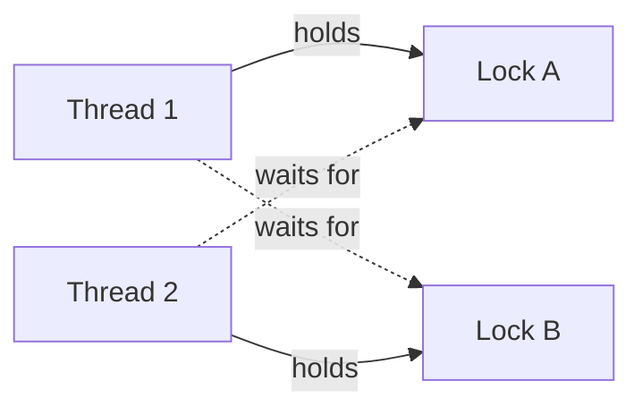

# 📘 Synchronization and Deadlocks

When threads or processes share data, the order of their operations becomes unpredictable.
This page covers the tools that make shared data safe, the classic problems used to teach them, and deadlock, the most common way those tools go wrong.
For language-level APIs see [Java Concurrency and JVM](/docs/java/java-concurrency-jvm) and [Concurrency in LLD](/docs/system-design/lld/concurrency-in-lld).

## Table of Contents

1. [Race Conditions](#1-race-conditions)
2. [The Critical Section Problem](#2-the-critical-section-problem)
3. [Hardware Support](#3-hardware-support)
4. [Spinlocks and Mutexes](#4-spinlocks-and-mutexes)
5. [Semaphores](#5-semaphores)
6. [Monitors and Condition Variables](#6-monitors-and-condition-variables)
7. [Read-Write Locks and Other Tools](#7-read-write-locks-and-other-tools)
8. [Classic Problems](#8-classic-problems)
9. [Memory Ordering](#9-memory-ordering)
10. [Deadlock](#10-deadlock)
11. [Handling Deadlock](#11-handling-deadlock)
12. [The Banker's Algorithm](#12-the-bankers-algorithm)
13. [Livelock and Starvation](#13-livelock-and-starvation)
14. [Questions](#14-questions)

---

## 1. Race Conditions

A **race condition** is when the result depends on the timing of threads.

```c
int counter = 0;          // shared
void *work(void *arg) {
    for (int i = 0; i < 1000000; i++)
        counter++;        // not atomic
    return NULL;
}
// Two threads: expected 2000000, typical results like 1134582
```

`counter++` is three machine steps: **load** into a register, **add** 1, **store** back.

| Time | Thread A | Thread B | counter in memory |
| --- | --- | --- | --- |
| 1 | load 5 | | 5 |
| 2 | | load 5 | 5 |
| 3 | add, store 6 | | 6 |
| 4 | | add, store 6 | 6 (one increment lost) |

A **data race** specifically means two threads access the same memory concurrently, at least one writes, and there is no synchronization.
In C, C++, and Rust (unsafe) it is undefined behavior; in Java and Go it gives unpredictable results.

Race detectors: ThreadSanitizer (`-fsanitize=thread`), `go test -race`, Helgrind.

---

## 2. The Critical Section Problem

A **critical section** is code that accesses shared state and must not run in two threads at once.

A correct solution guarantees:

| Property | Meaning |
| --- | --- |
| **Mutual exclusion** | At most one thread inside at a time |
| **Progress** | If no one is inside, a thread that wants in can get in (no pointless blocking) |
| **Bounded waiting** | A thread waiting to enter will get in after a bounded number of others |

**Peterson's algorithm** solves it for two threads with only loads and stores:

```c
bool flag[2] = {false, false};
int turn;

void lock(int i) {          // i is 0 or 1
    int j = 1 - i;
    flag[i] = true;         // I want in
    turn = j;               // but you go first if you want
    while (flag[j] && turn == j) { /* spin */ }
}
void unlock(int i) { flag[i] = false; }
```

It is a great teaching example but **fails on modern CPUs** without memory barriers, because hardware and compilers reorder the stores and loads (see [Memory Ordering](#9-memory-ordering)).
Real locks use atomic instructions.

---

## 3. Hardware Support

Modern CPUs provide **atomic read-modify-write** instructions.

| Instruction | Semantics |
| --- | --- |
| **Test-and-set** | Set a flag to true and return its old value, atomically |
| **Compare-and-swap (CAS)** | If `*addr == expected`, write `new`; return whether it happened (x86 `LOCK CMPXCHG`) |
| **Fetch-and-add** | Add and return the old value (x86 `LOCK XADD`) |
| **Load-linked / store-conditional** | ARM and RISC-V: the store fails if anyone wrote the address since the load |

```c
// Lock-free increment with CAS
void increment(atomic_int *c) {
    int old = atomic_load(c);
    while (!atomic_compare_exchange_weak(c, &old, old + 1)) {
        // old now holds the current value; retry
    }
}
```

**Lock-free** algorithms built on CAS never block, but must handle the **ABA problem**: a value changes from A to B and back to A, so CAS wrongly succeeds.
Fixes: version counters (tagged pointers), hazard pointers, or garbage-collected languages.

---

## 4. Spinlocks and Mutexes

| | Spinlock | Mutex (sleeping lock) |
| --- | --- | --- |
| While waiting | Loops, burning CPU | Sleeps; the OS runs someone else |
| Best when | Critical section is tiny and the holder is running on another core | Critical section may be long or may block |
| Cost | No context switch | Context switch if contended |
| Used in | Kernels (interrupt handlers cannot sleep), very short sections | Almost all application code |
| On a single core | Pointless (the holder cannot run while you spin) | Fine |

```c
// A minimal test-and-set spinlock
atomic_flag lock = ATOMIC_FLAG_INIT;
void acquire(void) { while (atomic_flag_test_and_set(&lock)) { /* spin, maybe pause */ } }
void release(void) { atomic_flag_clear(&lock); }
```

Real mutexes are **hybrid**: spin briefly, then sleep.
On Linux they use a **futex** (fast userspace mutex): the uncontended path is a single atomic instruction in user space, and the kernel is involved only when a thread actually needs to sleep or wake another.

Mutex rules:

- The thread that locks must unlock (ownership), unlike a semaphore.
- A **recursive (reentrant) mutex** lets the owner lock again; Java's `synchronized` and `ReentrantLock` are reentrant.
- Keep critical sections short; never do I/O or call unknown code while holding a lock.

---

## 5. Semaphores

A **semaphore** (Dijkstra, 1965) is an integer with two atomic operations.

| Operation | Also called | Effect |
| --- | --- | --- |
| `wait(S)` | P, down, acquire | If S > 0, decrement; otherwise block until it is |
| `signal(S)` | V, up, release | Increment and wake one waiter |

| Type | Initial value | Use |
| --- | --- | --- |
| **Binary semaphore** | 1 | Mutual exclusion (but without ownership) |
| **Counting semaphore** | N | Limit concurrent access to N resources: connection pools, rate limiting |
| **Signaling semaphore** | 0 | One thread waits for an event another posts |

**Mutex vs binary semaphore**: a mutex has an owner and only the owner may unlock; a semaphore can be signaled by any thread, which makes it suitable for signaling between threads but easier to misuse for locking.
Mutexes also support priority inheritance; semaphores usually do not.

---

## 6. Monitors and Condition Variables

A **monitor** bundles shared data with the lock that protects it, so only one thread is active inside at a time.
Java objects with `synchronized` methods are monitors.

A **condition variable** lets a thread wait inside a monitor until some condition becomes true.

```c
pthread_mutex_lock(&m);
while (queue_is_empty(&q))          // always a loop, never an if
    pthread_cond_wait(&not_empty, &m);   // atomically releases m and sleeps; reacquires on wake
item = dequeue(&q);
pthread_mutex_unlock(&m);
```

Why `while` and not `if`:

1. **Spurious wakeups** are allowed by the spec.
2. Another thread may take the item between the signal and this thread reacquiring the lock (**Mesa semantics**, which almost all real systems use; Hoare semantics hand the lock directly but are rare).

`signal` wakes one waiter, `broadcast` (Java `notifyAll`) wakes all.

---

## 7. Read-Write Locks and Other Tools

| Tool | Behavior | Use |
| --- | --- | --- |
| **Read-write lock** | Many readers or one writer | Read-heavy data; watch for writer starvation |
| **Barrier** | All N threads wait until every one arrives | Phased parallel algorithms |
| **Latch / countdown** | Wait until a count reaches zero, one-shot | Wait for N tasks to finish |
| **RCU** (read-copy-update) | Readers take no lock; writers copy, update, swap a pointer, and free the old version after all readers finish | Linux kernel routing tables and other read-mostly data |
| **Seqlock** | Readers retry if a writer changed the sequence number during the read | Kernel time-keeping |
| **Atomics** | Single-variable operations without locks | Counters, flags, lock-free structures |
| **Thread-local storage** | Each thread has its own copy | Avoid sharing entirely |

The best synchronization is **none**: immutable data, message passing (Go channels, actors), or partitioning data so each thread owns its own part.

---

## 8. Classic Problems

### Producer-consumer (bounded buffer)

```c
semaphore empty = N;   // free slots
semaphore full  = 0;   // filled slots
mutex     m;

void producer(item x) {
    wait(empty);        // wait for a free slot
    lock(m);  put(x);  unlock(m);
    signal(full);       // one more item
}

item consumer(void) {
    wait(full);         // wait for an item
    lock(m);  item x = take();  unlock(m);
    signal(empty);      // one more free slot
    return x;
}
```

Order matters: calling `lock(m)` before `wait(empty)` in the producer deadlocks when the buffer is full, because the consumer can never get the mutex to free a slot.

This is the pattern behind every blocking queue, pipe, and thread pool work queue.

### Readers-writers

Many readers may read at once; a writer needs exclusive access.

| Variant | Priority | Risk |
| --- | --- | --- |
| First readers-writers | Readers | Writers starve under constant reads |
| Second readers-writers | Writers | Readers starve under constant writes |
| Fair | Arrival order | Lower throughput |

### Dining philosophers

Five philosophers, five forks, each needs both neighbors' forks to eat.
If everyone picks up the left fork at once, everyone waits forever for the right one: **deadlock**.

Solutions:

- **Resource ordering**: number the forks and always pick up the lower number first (breaks circular wait); this is the general fix for lock ordering in real code.
- Allow at most four philosophers to sit at once (a counting semaphore of 4).
- Pick up both forks atomically, or only if both are free.
- An asymmetric rule: odd philosophers pick left first, even pick right first.

---

## 9. Memory Ordering

Compilers and CPUs **reorder** memory operations for speed, as long as a single thread cannot tell the difference.
Other threads can.

```c
// Thread 1                 // Thread 2
data = 42;                  while (!ready) {}
ready = true;               print(data);   // may print 0 without proper ordering
```

| Concept | Meaning |
| --- | --- |
| **Sequential consistency** | All threads see operations in one global order consistent with program order; easiest to reason about, slowest |
| **Acquire** | No later reads or writes move before this load (lock acquire) |
| **Release** | No earlier reads or writes move after this store (lock release) |
| **Memory barrier / fence** | Explicit ordering point |
| **x86 (TSO)** | Strong model: only store-then-load can be reordered |
| **ARM, RISC-V** | Weak models: many reorderings allowed, so missing barriers show up as real bugs |

Locks, atomics, `volatile` in Java, and channels all include the right barriers.
The **happens-before** relationship in the Java and C++ memory models defines when one thread's write is guaranteed visible to another.
Rule for application code: always use proper synchronization primitives and never invent your own flags without atomics.

---

## 10. Deadlock

A **deadlock** is a set of tasks each waiting for a resource held by another in the set, so none can proceed.



**Coffman conditions**, all four must hold at once:

| Condition | Meaning | Break it by |
| --- | --- | --- |
| **Mutual exclusion** | Resource held by one task at a time | Sharable resources (read-only data, lock-free structures) |
| **Hold and wait** | Holding one resource while waiting for another | Acquire everything at once, or release before requesting more |
| **No preemption** | Resources cannot be forcibly taken | Timeouts, `tryLock`, roll back and retry |
| **Circular wait** | A cycle in the wait-for graph | **Global lock ordering** (most practical) |

A **resource allocation graph** shows tasks and resources; with one instance per resource, a **cycle means deadlock**.
With multiple instances, a cycle means deadlock is possible but not certain.

---

## 11. Handling Deadlock

| Strategy | Idea | Used where |
| --- | --- | --- |
| **Prevention** | Design so one Coffman condition can never hold | Lock ordering in application code, the common real-world choice |
| **Avoidance** | Check each request and grant it only if the system stays in a safe state | Banker's algorithm; needs max demands in advance, rare in practice |
| **Detection and recovery** | Let deadlocks happen, find cycles, kill or roll back a victim | Databases (PostgreSQL checks after `deadlock_timeout`, aborts one transaction) |
| **Ignore** (ostrich algorithm) | Assume it is rare, reboot if it happens | General-purpose OSes for user resources |

Practical checklist for application code:

- Always acquire locks in a documented global order (for example by account ID when transferring between accounts).
- Hold locks for as short a time as possible and never across network calls.
- Use `tryLock` with a timeout where ordering is impossible.
- Prefer higher-level constructs (concurrent collections, queues, actors).
- Diagnose with thread dumps: `jstack`, `kill -3` on the JVM, `gdb thread apply all bt`, or Go's `SIGQUIT` goroutine dump.

---

## 12. The Banker's Algorithm

Five processes and three resource types (A, B, C), with 10, 5, and 7 total instances.

| Process | Allocation (A B C) | Max (A B C) | Need = Max - Allocation |
| --- | --- | --- | --- |
| P0 | 0 1 0 | 7 5 3 | 7 4 3 |
| P1 | 2 0 0 | 3 2 2 | 1 2 2 |
| P2 | 3 0 2 | 9 0 2 | 6 0 0 |
| P3 | 2 1 1 | 2 2 2 | 0 1 1 |
| P4 | 0 0 2 | 4 3 3 | 4 3 1 |

Available = (3, 3, 2).

**Safety check**: repeatedly find a process whose Need fits in Work, pretend it finishes, and return its allocation.

| Step | Pick | Need fits Work? | Work after release |
| --- | --- | --- | --- |
| Start | | | 3 3 2 |
| 1 | P1 | 1 2 2 <= 3 3 2 | 5 3 2 |
| 2 | P3 | 0 1 1 <= 5 3 2 | 7 4 3 |
| 3 | P0 | 7 4 3 <= 7 4 3 | 7 5 3 |
| 4 | P2 | 6 0 0 <= 7 5 3 | 10 5 5 |
| 5 | P4 | 4 3 1 <= 10 5 5 | 10 5 7 |

Safe sequence: **P1, P3, P0, P2, P4** (other safe orders exist).
A request is granted only if, after pretending to grant it, the state is still safe.

**Safe vs unsafe**: an unsafe state is not necessarily deadlocked, but the OS can no longer guarantee avoiding one.

---

## 13. Livelock and Starvation

| Problem | What happens | Example | Fix |
| --- | --- | --- | --- |
| **Deadlock** | Everyone blocked, nothing changes | Two threads each hold one lock | Lock ordering |
| **Livelock** | Everyone active, no progress | Two people stepping aside in a corridor in sync; two threads that both back off and retry in lockstep | Randomized backoff |
| **Starvation** | Some task never gets the resource | Writer starved by constant readers | Fair locks, aging |

Ethernet's randomized exponential backoff after collisions is a textbook livelock prevention.

---

## 14. Questions

| Question | Short answer |
| --- | --- |
| What is a race condition? | Outcome depends on thread timing; `counter++` is load, add, store |
| Three requirements for a critical section solution? | Mutual exclusion, progress, bounded waiting |
| Mutex vs semaphore? | Owned lock for exclusion vs counter for N resources or signaling |
| Spinlock vs mutex? | Busy wait for tiny sections on multi-core vs sleep; hybrids spin then sleep |
| What is a futex? | Lock whose uncontended path stays in user space; kernel only for sleeping |
| Why use `while` around a condition wait? | Spurious wakeups and Mesa semantics |
| What is CAS and the ABA problem? | Atomic compare-and-swap; value changes and changes back, fooling CAS |
| Four deadlock conditions? | Mutual exclusion, hold and wait, no preemption, circular wait |
| Most practical deadlock prevention? | Global lock ordering |
| Deadlock prevention vs avoidance? | Make a condition impossible vs check each request for a safe state |
| Deadlock vs livelock? | Blocked forever vs busy but no progress |
| Explain producer-consumer with semaphores. | `empty = N`, `full = 0`, mutex; wait on slots before the mutex |

Next: [Memory Management](/docs/operating-systems/memory-management).
