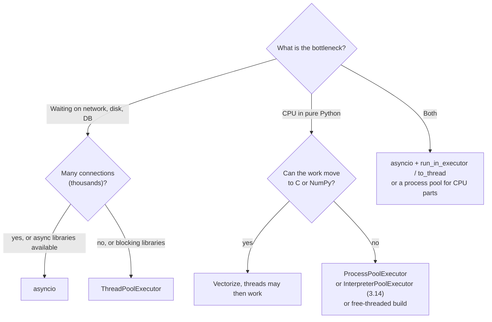
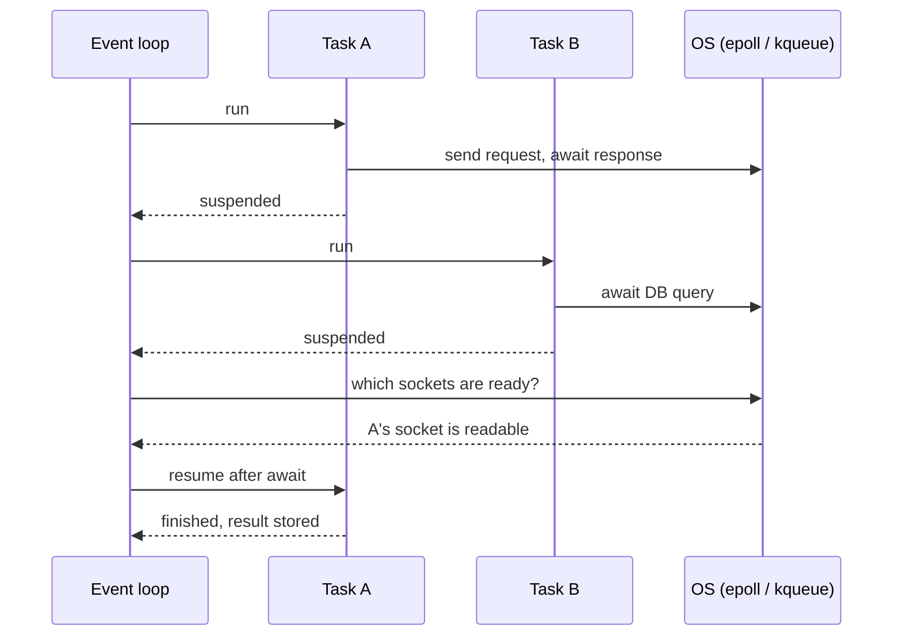

# 📘 Concurrency and asyncio

"How do you make this Python code handle 10,000 requests?" is a standard backend interview question.
The answer depends on whether the work is **I/O-bound** or **CPU-bound**, and on the GIL.
This page covers every concurrency tool in the standard library, then goes deep on `asyncio`, which powers FastAPI, aiohttp, and most modern Python network services.
Read the [GIL section](/docs/python/python-internals#8-the-gil) first if it is new to you, and see [Processes and Threads](/docs/operating-systems/processes-and-threads) for the OS view.

## Table of Contents

1. [Concurrency vs Parallelism](#1-concurrency-vs-parallelism)
2. [Choosing a Model](#2-choosing-a-model)
3. [threading](#3-threading)
4. [Synchronization Primitives](#4-synchronization-primitives)
5. [multiprocessing](#5-multiprocessing)
6. [concurrent.futures](#6-concurrentfutures)
7. [asyncio: The Mental Model](#7-asyncio-the-mental-model)
8. [Coroutines, Tasks, and Awaitables](#8-coroutines-tasks-and-awaitables)
9. [Running Things Concurrently](#9-running-things-concurrently)
10. [Timeouts and Cancellation](#10-timeouts-and-cancellation)
11. [Blocking Code in Async Programs](#11-blocking-code-in-async-programs)
12. [asyncio Patterns](#12-asyncio-patterns)
13. [Common Pitfalls](#13-common-pitfalls)
14. [Questions](#14-questions)

---

## 1. Concurrency vs Parallelism

- **Concurrency:** structuring a program to make progress on many tasks by interleaving them (one cook juggling several pans).
- **Parallelism:** literally running tasks at the same instant on multiple cores (several cooks).

Threads and `asyncio` give concurrency.
Processes, subinterpreters, and the free-threaded build give parallelism for Python bytecode.

---

## 2. Choosing a Model



| | Threads | Processes | asyncio |
| --- | --- | --- | --- |
| Scheduling | Preemptive (OS) | Preemptive (OS) | **Cooperative** (at every `await`) |
| Parallel Python bytecode | No (default build) | Yes | No |
| Memory per unit | ~ MBs of stack (virtual) | Full interpreter, tens of MB | ~ KBs per task |
| Practical scale | Hundreds | Number of cores | Tens of thousands |
| Shared state | Shared, needs locks | Separate, must serialize (pickle) | Shared, but switches only at `await` |
| Works with blocking libraries | Yes | Yes | **No**, blocks the whole loop |
| Best for | Blocking I/O, simple parallel I/O | CPU-bound work | High-concurrency network I/O |

---

## 3. threading

```python
import threading

def download(url: str) -> None:
    ...

threads = [threading.Thread(target=download, args=(u,), daemon=True) for u in urls]
for t in threads:
    t.start()
for t in threads:
    t.join()
```

- `daemon=True` threads are killed abruptly when the main thread exits; non-daemon threads keep the process alive.
- Threads cannot be killed from outside; stop them cooperatively with a `threading.Event` they check.
- Unhandled exceptions in a thread are printed and swallowed (see `threading.excepthook`); results must be passed back explicitly, which is why executors are usually nicer.
- `threading.local()` gives each thread its own attributes (per-thread DB connections).

### 3.1 Race conditions still happen

```python
count = 0

def inc():
    global count
    for _ in range(1_000_000):
        count += 1          # LOAD, ADD, STORE: not atomic

# With 4 threads the result can be less than 4,000,000.
```

On recent CPython versions this example often prints the right number because thread switches rarely land inside that sequence, which makes the bug **worse**: it hides in tests and appears under load or on the free-threaded build.
Protect shared read-modify-write with a lock:

```python
lock = threading.Lock()
with lock:
    count += 1
```

---

## 4. Synchronization Primitives

| Primitive | Use |
| --- | --- |
| `Lock` | Mutual exclusion; always use `with lock:` |
| `RLock` | Re-entrant: the same thread can acquire it again (recursive code) |
| `Semaphore(n)` / `BoundedSemaphore` | Limit concurrency to n (connection pools, rate limits) |
| `Event` | One-shot signal: `set()`, `wait()`, `is_set()` |
| `Condition` | Wait for a predicate; always wait in a `while` loop |
| `Barrier(n)` | n threads wait for each other |
| `queue.Queue` | **Thread-safe** FIFO; the default way to hand work between threads |

Producer and consumer with a queue:

```python
import queue, threading

q: queue.Queue[str | None] = queue.Queue(maxsize=100)   # bounded = backpressure

def producer():
    for item in source():
        q.put(item)          # blocks when full
    q.put(None)              # sentinel

def consumer():
    while (item := q.get()) is not None:
        handle(item)
        q.task_done()
```

`queue.Queue.shutdown()` (3.13) is an alternative to sentinels.
Deadlock rules from the [OS notes](/docs/operating-systems/synchronization-and-deadlocks) apply: acquire locks in a fixed global order and keep critical sections short.

---

## 5. multiprocessing

Each worker is a separate OS process with its own interpreter and GIL, so CPU-bound Python runs in parallel.

```python
from multiprocessing import Pool

def crunch(n: int) -> int:
    return sum(i * i for i in range(n))

if __name__ == "__main__":             # required with spawn / forkserver
    with Pool() as pool:               # defaults to os.process_cpu_count() workers
        results = pool.map(crunch, [10**6] * 8, chunksize=2)
```

### 5.1 Start methods

| Method | How | Default on |
| --- | --- | --- |
| `spawn` | Fresh interpreter, re-imports the main module | macOS, Windows |
| `forkserver` | Forks from a clean server process | **Linux since 3.14** |
| `fork` | Copies the parent with `fork()` | Linux before 3.14 |

`fork` is fast but unsafe when the parent has threads (a lock held by another thread is copied in the locked state), which is why 3.14 moved the Linux default to `forkserver`.

### 5.2 Costs and sharing

- Arguments and results are **pickled** across process boundaries, so lambdas, open sockets, and locks cannot be sent, and big data is expensive to move.
- Share big arrays with `multiprocessing.shared_memory` or memory-mapped files instead of pickling them.
- `Manager()` offers proxied shared dicts and lists, convenient but slow.
- Use `chunksize` for many small tasks to cut IPC overhead.

---

## 6. concurrent.futures

A single high-level API over threads, processes, and (3.14) interpreters.

```python
from concurrent.futures import ThreadPoolExecutor, ProcessPoolExecutor, as_completed

with ThreadPoolExecutor(max_workers=20) as pool:
    futures = {pool.submit(fetch, url): url for url in urls}
    for fut in as_completed(futures):          # in completion order
        url = futures[fut]
        try:
            print(url, len(fut.result()))
        except Exception as e:
            print(url, "failed:", e)

with ProcessPoolExecutor() as pool:
    results = list(pool.map(crunch, inputs))    # in input order
```

| Method | Returns |
| --- | --- |
| `submit(fn, *args)` | A `Future`: `result(timeout)`, `exception()`, `done()`, `cancel()`, `add_done_callback()` |
| `map(fn, iterable)` | Results in input order; raises the first exception when you reach it |
| `as_completed(futures)` | Futures as they finish |
| `wait(futures, return_when=FIRST_COMPLETED)` | Sets of done and pending futures |

---

## 7. asyncio: The Mental Model

`asyncio` runs many coroutines on **one thread** with an **event loop**.
A coroutine runs until it hits an `await` on something not ready yet, then **yields control** back to the loop, which runs another ready task.
The loop uses the OS readiness APIs (`epoll`, `kqueue`, IOCP) to learn when sockets are ready.



Two rules follow:

1. **Switches happen only at `await`.** Code between awaits runs without interruption, so many races disappear, but state can still change across an `await`.
2. **Anything that blocks without awaiting freezes every task**: `time.sleep`, `requests.get`, a CPU-heavy loop, a synchronous DB driver.

See [I/O and Linux Internals](/docs/operating-systems/io-and-linux-internals) for how epoll works underneath.

---

## 8. Coroutines, Tasks, and Awaitables

```python
import asyncio

async def fetch(n: int) -> int:        # calling fetch(1) creates a coroutine object; nothing runs yet
    await asyncio.sleep(1)
    return n

async def main() -> None:
    result = await fetch(1)            # run it and wait
    task = asyncio.create_task(fetch(2))   # schedule it to run concurrently
    ...                                # do other work
    print(await task)

asyncio.run(main())                    # create a loop, run main, close the loop
```

| Term | Meaning |
| --- | --- |
| **Coroutine function** | Defined with `async def` |
| **Coroutine object** | What calling it returns; does nothing until awaited or wrapped in a task |
| **Task** | A coroutine scheduled on the loop, running concurrently; a subclass of `Future` |
| **Future** | Low-level placeholder for a result that will arrive later |
| **Awaitable** | Anything usable with `await`: coroutines, tasks, futures, objects with `__await__` |

`await coro()` runs sequentially.
Concurrency only happens when you create tasks (`create_task`, `TaskGroup`, `gather`).

```python
# 3 seconds: sequential
a = await fetch(1); b = await fetch(2); c = await fetch(3)

# 1 second: concurrent
a, b, c = await asyncio.gather(fetch(1), fetch(2), fetch(3))
```

Keep a reference to tasks you create; the loop holds only weak references, so a fire-and-forget task with no reference can be garbage collected mid-flight.

---

## 9. Running Things Concurrently

### 9.1 `TaskGroup` (3.11+), the default choice

```python
async def main():
    async with asyncio.TaskGroup() as tg:
        t1 = tg.create_task(fetch(1))
        t2 = tg.create_task(fetch(2))
    # all tasks are done here
    print(t1.result(), t2.result())
```

This is **structured concurrency**: if any task fails, the others are cancelled, and all errors are raised together as an `ExceptionGroup` (handle with `except*`).
No task outlives the block.

### 9.2 `gather`

```python
results = await asyncio.gather(*coros)                          # results in input order
results = await asyncio.gather(*coros, return_exceptions=True)  # exceptions returned as values
```

Without `return_exceptions`, the first exception propagates but **the other tasks keep running**, which is why `TaskGroup` is safer.

### 9.3 Others

| Tool | Use |
| --- | --- |
| `asyncio.as_completed(aws)` | Process results as they finish (async-iterable since 3.13) |
| `asyncio.wait(tasks, return_when=FIRST_COMPLETED)` | Low-level control over done and pending sets |
| `asyncio.Queue` | Producer and consumer between tasks (not thread-safe) |
| `asyncio.Semaphore(n)` | Cap concurrency, for example 50 outbound requests at once |
| `asyncio.Lock`, `Event`, `Condition` | Async versions of the threading primitives |

---

## 10. Timeouts and Cancellation

```python
async def main():
    try:
        async with asyncio.timeout(2):          # 3.11+
            await slow_call()
    except TimeoutError:
        print("gave up")

    result = await asyncio.wait_for(slow_call(), timeout=2)   # older equivalent
```

**Cancellation** works by throwing `asyncio.CancelledError` into the task at its current `await`.

```python
async def worker():
    try:
        while True:
            await do_unit_of_work()
    except asyncio.CancelledError:
        await cleanup()
        raise                       # always re-raise, or cancellation silently fails

task = asyncio.create_task(worker())
task.cancel()
```

- `CancelledError` inherits from `BaseException` (since 3.8), so `except Exception` does not swallow it.
- Use `asyncio.shield(aw)` to protect an operation that must finish (like a commit) from outer cancellation.

---

## 11. Blocking Code in Async Programs

Blocking calls must be moved off the event loop thread.

```python
import asyncio, time

async def bad():
    time.sleep(1)                              # blocks EVERY task for 1 second

async def good():
    await asyncio.sleep(1)                     # yields to the loop

async def call_blocking_library():
    data = await asyncio.to_thread(requests.get, url)          # 3.9+, default thread pool

async def cpu_work():
    loop = asyncio.get_running_loop()
    with ProcessPoolExecutor() as pool:
        return await loop.run_in_executor(pool, crunch, 10**7)
```

| Blocking | Async alternative |
| --- | --- |
| `requests` | `httpx.AsyncClient`, `aiohttp` |
| `psycopg2`, `pymysql` | `asyncpg`, `psycopg` 3 async, SQLAlchemy async |
| `redis` sync client | `redis.asyncio` |
| `time.sleep` | `asyncio.sleep` |
| `open().read()` on slow disks | `asyncio.to_thread`, `aiofiles` |

Debug a stalling loop with `asyncio.run(main(), debug=True)` (logs callbacks slower than 100 ms) and, on 3.14, inspect a live process with `python -m asyncio ps PID` or `pstree PID`.

---

## 12. asyncio Patterns

### 12.1 Bounded concurrency with a semaphore

```python
import asyncio, httpx

async def fetch_all(urls: list[str], limit: int = 50) -> list[int]:
    sem = asyncio.Semaphore(limit)
    async with httpx.AsyncClient(timeout=10) as client:
        async def one(url: str) -> int:
            async with sem:
                r = await client.get(url)
                return r.status_code
        async with asyncio.TaskGroup() as tg:
            tasks = [tg.create_task(one(u)) for u in urls]
    return [t.result() for t in tasks]
```

### 12.2 Worker pool with a queue

```python
async def worker(name: str, q: asyncio.Queue) -> None:
    while True:
        job = await q.get()
        try:
            await process(job)
        finally:
            q.task_done()

async def main(jobs):
    q: asyncio.Queue = asyncio.Queue(maxsize=1000)
    workers = [asyncio.create_task(worker(f"w{i}", q)) for i in range(10)]
    for job in jobs:
        await q.put(job)
    await q.join()               # wait until every job is processed
    for w in workers:
        w.cancel()
    await asyncio.gather(*workers, return_exceptions=True)
```

### 12.3 Async iterators and context managers

```python
async def stream_rows(conn):
    async with conn.transaction():               # __aenter__ / __aexit__
        async for row in conn.cursor("SELECT ..."):   # __aiter__ / __anext__
            yield row                            # async generator

rows = [r async for r in stream_rows(conn)]      # async comprehension
```

### 12.4 Graceful shutdown

Handle `SIGTERM`, stop accepting new work, let in-flight tasks finish within a deadline, then cancel the rest.
Frameworks (Uvicorn, Gunicorn) do this for you with lifespan events.

---

## 13. Common Pitfalls

- **Calling a coroutine without `await`**: nothing runs, and you get "coroutine was never awaited".
- **Blocking the loop** with sync I/O or CPU work.
- **Awaiting in a loop** when you meant concurrency (`for u in urls: await fetch(u)` is sequential).
- **Unbounded `gather`** over 100,000 coroutines: exhausts sockets and memory; add a semaphore or a worker pool.
- **Swallowing `CancelledError`**.
- **Losing task references** for fire-and-forget tasks.
- **Sharing an `asyncio` object across threads or loops**; use `asyncio.run_coroutine_threadsafe` to submit from another thread.
- **Using `multiprocessing` without the `__main__` guard** on macOS and Windows.
- **Assuming the GIL makes compound operations atomic**.

---

## 14. Questions

**Q: Threads vs processes vs asyncio in Python?**
Threads for blocking I/O at modest scale, processes for CPU-bound Python, asyncio for many concurrent network operations with async libraries.

**Q: Why don't threads speed up CPU-bound Python?**
In the default build the GIL lets only one thread run bytecode at a time; use processes, subinterpreters, native code, or the free-threaded build.

**Q: What is the event loop?**
A single-threaded scheduler that runs ready tasks, suspends them at `await`, and uses epoll or kqueue to resume them when their I/O is ready.

**Q: Coroutine vs task?**
A coroutine object is an unstarted computation; a task wraps it and schedules it on the loop to run concurrently.

**Q: `gather` vs `TaskGroup`?**
`TaskGroup` cancels siblings on failure and raises an `ExceptionGroup`, giving structured concurrency; `gather` leaves other tasks running unless you manage them.

**Q: What happens if you call `time.sleep` inside a coroutine?**
The whole event loop thread blocks, so every other task stalls.

**Q: How do you call a blocking library from async code?**
`await asyncio.to_thread(fn, ...)` or `loop.run_in_executor` with a thread or process pool.

**Q: How does task cancellation work?**
`task.cancel()` raises `CancelledError` at the task's current await; the task may clean up but should re-raise.

**Q: What changed with multiprocessing start methods in 3.14?**
Linux now defaults to `forkserver` instead of `fork`, avoiding deadlocks from forking a multi-threaded parent.

**Q: How do you limit an async crawler to 50 concurrent requests?**
An `asyncio.Semaphore(50)` around each request, or a fixed pool of 50 worker tasks reading from an `asyncio.Queue`.
