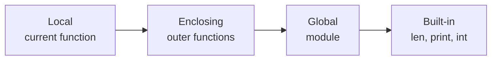
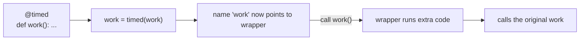
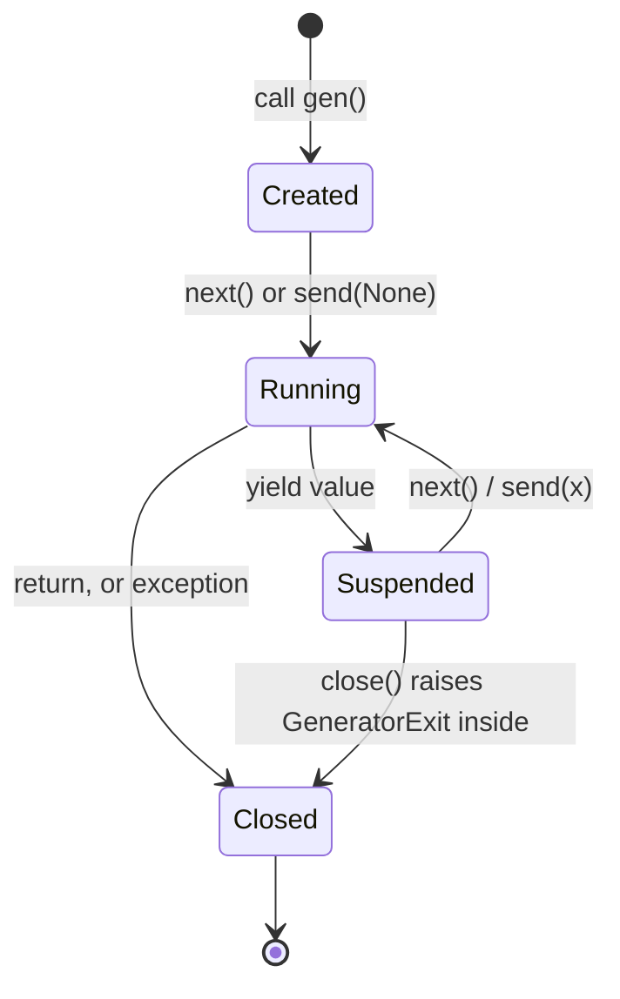

# 📘 Functions, Closures, Decorators, and Generators

Functions in Python are ordinary objects: you can pass them, return them, store them, and attach attributes to them.
That one fact powers closures, decorators, callbacks, and most of the "magic" in frameworks like Flask, FastAPI, and pytest.
This page also covers the iteration protocol, generators, and context managers, which are the other half of idiomatic Python.

## Table of Contents

1. [Parameters and Arguments](#1-parameters-and-arguments)
2. [Scope: The LEGB Rule](#2-scope-the-legb-rule)
3. [First-Class Functions and Lambdas](#3-first-class-functions-and-lambdas)
4. [Closures](#4-closures)
5. [Decorators](#5-decorators)
6. [Iterables and Iterators](#6-iterables-and-iterators)
7. [Generators](#7-generators)
8. [Context Managers](#8-context-managers)
9. [functools Toolkit](#9-functools-toolkit)
10. [Common Pitfalls](#10-common-pitfalls)
11. [Questions](#11-questions)

---

## 1. Parameters and Arguments

The full signature grammar, in order:

```python
def f(pos_only, /, normal, *args, kw_only, **kwargs): ...
```

| Kind | Syntax | Caller passes |
| --- | --- | --- |
| **Positional-only** (3.8+) | Before `/` | Position only; the name is private to the function |
| **Positional or keyword** | Between `/` and `*` | Either way |
| **Var-positional** | `*args` | Extra positionals, collected into a **tuple** |
| **Keyword-only** | After `*` or `*args` | Name only |
| **Var-keyword** | `**kwargs` | Extra keywords, collected into a **dict** |

```python
def f(a, b=2, /, c=3, *args, d, e=5, **kw):
    return a, b, c, args, d, e, kw

f(1, d=4)                      # (1, 2, 3, (), 4, 5, {})
f(1, 2, 3, 4, 5, d=6, z=7)     # (1, 2, 3, (4, 5), 6, 5, {'z': 7})
f(a=1, d=2)                    # TypeError: missing required positional argument 'a'
```

Why the markers exist:

- `/` lets a library rename a parameter without breaking callers, and lets `**kwargs` accept a key with the same name.
- A bare `*` forces clarity at the call site: `connect(host, timeout=5, retries=3)` instead of `connect(host, 5, 3)`.

### 1.1 Unpacking at the call site

```python
args = (1, 2)
opts = {"sep": "-", "end": "\n"}
print(*args, **opts)           # 1-2

def wrapper(*args, **kwargs):  # forward everything unchanged
    return target(*args, **kwargs)
```

### 1.2 Return values

A function without `return` returns `None`.
Returning multiple values returns one tuple: `return lo, hi`.

---

## 2. Scope: The LEGB Rule

Name lookup goes **L**ocal, **E**nclosing function, **G**lobal (module), **B**uilt-in.



Scope is decided at **compile time**: any assignment to a name in a function body makes that name local for the entire body.

```python
count = 0

def bump():
    global count        # rebind the module-level name
    count += 1

def make():
    total = 0
    def add(x):
        nonlocal total  # rebind the enclosing function's name
        total += x
        return total
    return add
```

- `global` and `nonlocal` are only needed to **rebind**; mutating (`items.append(x)`) needs neither.
- Only functions, classes, modules, and comprehensions create scopes; `if`, `for`, `while`, and `with` do not.
- A `for` loop variable is still defined after the loop ends.

---

## 3. First-Class Functions and Lambdas

```python
def shout(s): return s.upper()

ops = {"up": shout, "low": str.lower}
ops["up"]("hi")                        # 'HI'
list(map(shout, ["a", "b"]))           # ['A', 'B']
sorted(words, key=len)
```

A **lambda** is an anonymous single-expression function.
Use it for short `key=` functions; assign a `def` when it needs a name or more than one expression.

```python
pairs.sort(key=lambda p: p[1])
```

Functions carry metadata: `__name__`, `__doc__`, `__defaults__`, `__annotations__`, `__code__`, and `__closure__`.

---

## 4. Closures

A **closure** is a function that remembers variables from the scope where it was defined, even after that scope has returned.

```python
def counter():
    n = 0
    def inc():
        nonlocal n
        n += 1
        return n
    return inc

c = counter()
c(); c()                          # 2
c.__closure__[0].cell_contents    # 2, stored in a "cell" object
```

CPython stores captured variables in **cell** objects shared by the outer and inner functions.
Closures capture **variables, not values**, which is the root of the late-binding loop bug:

```python
handlers = [lambda: i for i in range(3)]
[h() for h in handlers]           # [2, 2, 2]

handlers = [lambda i=i: i for i in range(3)]   # capture the value via a default
from functools import partial
handlers = [partial(print, i) for i in range(3)]
```

Closures are a lightweight alternative to a class with one method (a counter, a rate limiter, a memoizer).

---

## 5. Decorators

A decorator is a callable that takes a function and returns a replacement.
`@deco` above a `def` is just syntax for `f = deco(f)`.



### 5.1 Basic decorator

```python
import functools, time

def timed(fn):
    @functools.wraps(fn)                  # copy __name__, __doc__, __wrapped__
    def wrapper(*args, **kwargs):
        start = time.perf_counter()
        try:
            return fn(*args, **kwargs)
        finally:
            print(f"{fn.__name__} took {time.perf_counter() - start:.3f}s")
    return wrapper

@timed
def work(n): return sum(range(n))
```

Without `functools.wraps`, `work.__name__` becomes `"wrapper"`, which breaks logging, debugging, and tools that introspect signatures.

### 5.2 Decorator with arguments

Three levels: the factory takes arguments and returns the real decorator.

```python
def retry(times: int = 3, exceptions: tuple = (Exception,)):
    def decorator(fn):
        @functools.wraps(fn)
        def wrapper(*args, **kwargs):
            for attempt in range(1, times + 1):
                try:
                    return fn(*args, **kwargs)
                except exceptions:
                    if attempt == times:
                        raise
        return wrapper
    return decorator

@retry(times=5, exceptions=(TimeoutError,))
def fetch(url): ...
```

### 5.3 Stacking order

```python
@a
@b
def f(): ...
# same as f = a(b(f)): b wraps first, a is outermost and runs first on each call
```

### 5.4 Class-based and class decorators

```python
class CountCalls:
    def __init__(self, fn):
        functools.update_wrapper(self, fn)
        self.fn, self.calls = fn, 0

    def __call__(self, *args, **kwargs):
        self.calls += 1
        return self.fn(*args, **kwargs)

def register(cls):                  # a decorator applied to a class
    REGISTRY[cls.__name__] = cls
    return cls
```

A class-based decorator on a **method** needs `__get__` to bind `self`, so function-based decorators are simpler for methods.

### 5.5 Where you see decorators

| Decorator | Purpose |
| --- | --- |
| `@property`, `@staticmethod`, `@classmethod` | Descriptors that change attribute access |
| `@functools.cache`, `@lru_cache` | Memoization |
| `@dataclass` | Generate `__init__`, `__repr__`, `__eq__` |
| `@contextlib.contextmanager` | Build a context manager from a generator |
| `@app.get("/users")` | Route registration in FastAPI and Flask |
| `@pytest.fixture`, `@pytest.mark.parametrize` | Test wiring |
| `@typing.override` (3.12) | Mark an intended override for type checkers |

---

## 6. Iterables and Iterators

| | Iterable | Iterator |
| --- | --- | --- |
| Protocol | `__iter__` returns an iterator | `__next__` returns the next item or raises `StopIteration`; `__iter__` returns `self` |
| Examples | `list`, `str`, `dict`, `range`, files | `iter(list)`, generators, `map`, `zip`, `enumerate`, files |
| Reusable | Yes, each `iter()` starts fresh | **No**, single pass |

A `for` loop is roughly:

```python
it = iter(obj)
while True:
    try:
        x = next(it)
    except StopIteration:
        break
    body(x)
```

```python
it = iter([1, 2, 3])
list(it)       # [1, 2, 3]
list(it)       # [], exhausted
```

The same trap applies to `map`, `zip`, `filter`, and generator objects: iterate them twice and the second pass is empty.
`range` is an iterable (a lazy sequence), not an iterator, so it can be looped many times and supports `len` and `in` in O(1).

---

## 7. Generators

A function containing `yield` returns a **generator object** when called.
The body runs lazily: each `next()` resumes until the next `yield`, keeping local state in a suspended frame.

```python
def read_lines(path):
    with open(path, encoding="utf-8") as f:
        for line in f:
            yield line.rstrip("\n")

def only_errors(lines):
    return (l for l in lines if "ERROR" in l)

for line in only_errors(read_lines("app.log")):   # streams, constant memory
    print(line)
```

Why generators matter:

- **Memory:** process a 50 GB file one line at a time.
- **Pipelines:** chain lazy stages like Unix pipes.
- **Infinite sequences:** `itertools.count()` or a `while True` generator.

### 7.1 Generator lifecycle



### 7.2 `send`, `return`, and `yield from`

```python
def gen():
    x = yield 1          # yield produces 1; send() delivers x
    print("got", x)
    yield 2
    return "done"        # becomes StopIteration.value

g = gen()
next(g)                  # 1
g.send("hi")             # prints "got hi", returns 2
next(g)                  # StopIteration('done')

def outer():
    result = yield from inner()   # delegate, and receive inner's return value
    yield result
```

`yield from` forwards `next`, `send`, `throw`, and `close` to the sub-generator.
It was the basis of coroutines before `async` and `await`, which now use the same suspended-frame machinery.

---

## 8. Context Managers

A context manager defines setup and guaranteed teardown around a block via `__enter__` and `__exit__`.

```python
class Timer:
    def __enter__(self):
        self.start = time.perf_counter()
        return self                       # bound by "as"

    def __exit__(self, exc_type, exc, tb):
        self.elapsed = time.perf_counter() - self.start
        return False                      # True would swallow the exception

with Timer() as t:
    work()
print(t.elapsed)
```

The generator shortcut:

```python
from contextlib import contextmanager

@contextmanager
def transaction(conn):
    tx = conn.begin()
    try:
        yield tx          # the with-block body runs here
        tx.commit()
    except Exception:
        tx.rollback()
        raise
```

Useful `contextlib` tools:

| Tool | Use |
| --- | --- |
| `suppress(FileNotFoundError)` | Ignore a specific exception |
| `ExitStack` | Enter a dynamic number of context managers |
| `closing(obj)` | Call `obj.close()` at the end |
| `redirect_stdout(buf)` | Capture prints |
| `chdir(path)` (3.11) | Temporarily change directory |
| `asynccontextmanager` | Same idea for `async with` |

Multiple managers in one statement can be parenthesized across lines since 3.10:

```python
with (
    open("in.txt") as src,
    open("out.txt", "w") as dst,
):
    dst.write(src.read())
```

---

## 9. functools Toolkit

| Tool | What it does |
| --- | --- |
| `cache` (3.9) | Unbounded memoization; same as `lru_cache(maxsize=None)` |
| `lru_cache(maxsize=128)` | Bounded memoization with LRU eviction; `.cache_info()`, `.cache_clear()` |
| `cached_property` | Compute once per instance, store in the instance `__dict__` |
| `partial(fn, *args, **kw)` | Pre-fill arguments |
| `reduce(fn, it, init)` | Fold a sequence into one value |
| `wraps`, `update_wrapper` | Preserve metadata in decorators |
| `singledispatch` | Overload a function on the type of its first argument |
| `total_ordering` | Fill in `<=`, `>`, `>=` from `__eq__` and `__lt__` |
| `cmp_to_key` | Adapt an old-style comparator for `sorted` |

```python
from functools import cache, singledispatch, partial, reduce

@cache
def fib(n: int) -> int:
    return n if n < 2 else fib(n - 1) + fib(n - 2)

@singledispatch
def render(obj) -> str:
    return str(obj)

@render.register
def _(obj: list) -> str:
    return ", ".join(map(render, obj))

base2 = partial(int, base=2)
base2("1010")                                  # 10
reduce(lambda a, b: a * b, [1, 2, 3, 4])       # 24
```

Caching caveats:

- Arguments must be hashable (no lists or dicts).
- `lru_cache` on a **method** holds a strong reference to `self`, which keeps instances alive; prefer `cached_property` or a per-instance cache.
- Caches are shared across threads; the cache itself is thread-safe, but the wrapped function may run more than once for the same key.

---

## 10. Common Pitfalls

- **Mutable defaults** are shared across calls; default to `None`.
- **Late binding** in closures and lambdas inside loops; bind with a default argument or `partial`.
- **Forgetting `functools.wraps`** in decorators.
- **Consuming an iterator twice**, for example checking `x in gen` and then looping over `gen`.
- **Returning inside `finally`** swallows exceptions (a `SyntaxWarning` since 3.14).
- **Recursion depth**: default limit 1000; Python has no tail-call optimization, so convert deep recursion to loops.
- **Shadowing built-ins** such as `list`, `id`, `type`, `input`, or `sum` with variable names.

---

## 11. Questions

**Q: What are `*args` and `**kwargs`?**
They collect extra positional arguments into a tuple and extra keyword arguments into a dict, and the same syntax unpacks them at a call site.

**Q: What do `/` and `*` mean in a signature?**
Parameters before `/` are positional-only; parameters after `*` are keyword-only.

**Q: Explain the LEGB rule.**
Names resolve in Local, Enclosing, Global, then Built-in scope, and assignment anywhere in a function makes a name local unless declared `global` or `nonlocal`.

**Q: What is a closure?**
An inner function that keeps references to variables of its enclosing scope after that scope returns, stored in cell objects.

**Q: Write a decorator that takes arguments.**
A factory that returns a decorator that returns a wrapper, with `functools.wraps` on the wrapper (see section 5.2).

**Q: Iterator vs iterable?**
An iterable produces a fresh iterator via `__iter__`; an iterator produces values via `__next__` and is exhausted after one pass.

**Q: Why use a generator?**
It produces values lazily with constant memory and keeps its state between yields, which suits streams, pipelines, and infinite sequences.

**Q: What does `yield from` do?**
It delegates to a sub-generator, forwarding `send` and `throw`, and evaluates to the sub-generator's return value.

**Q: How does `with` work?**
It calls `__enter__`, runs the block, and always calls `__exit__` with exception details; returning `True` from `__exit__` suppresses the exception.

**Q: `lru_cache` vs `cache` vs `cached_property`?**
`lru_cache` is bounded, `cache` is unbounded, and `cached_property` caches one computed attribute per instance.
