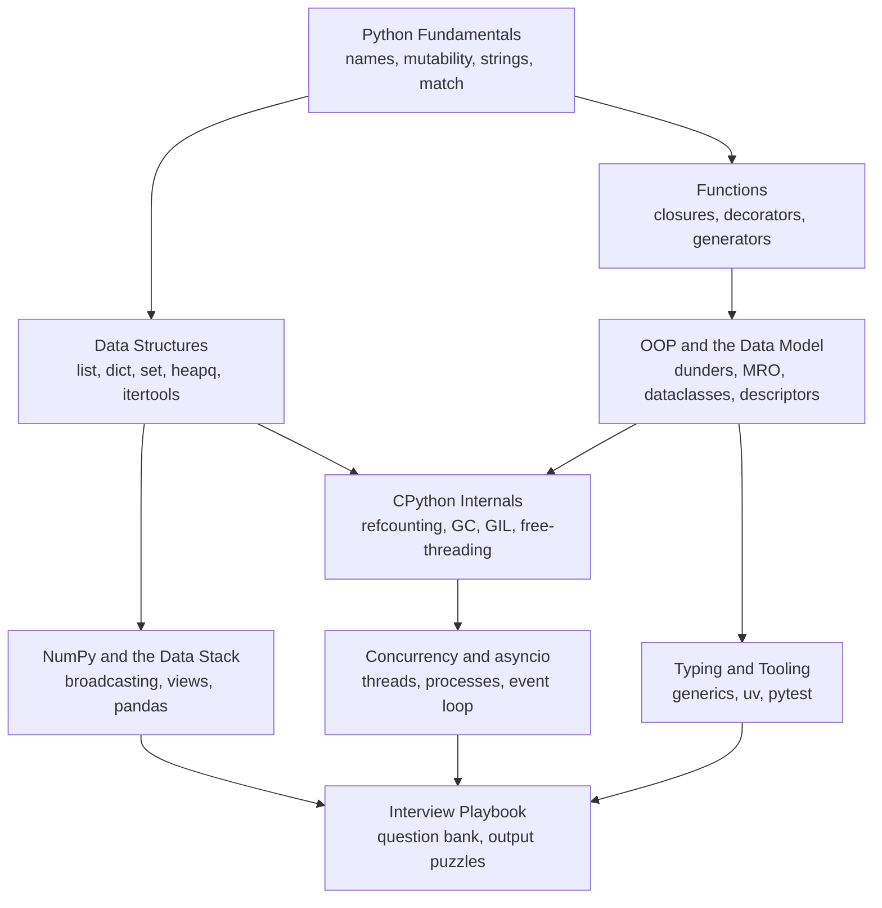

Start here for Python prep, from "why did my default list keep growing" to "why is my FastAPI service stalling with idle CPUs".
Each page teaches the language the way interviews probe it: what the code does, why CPython behaves that way, and what to use in production.
Every predict-the-output answer and internals fact was checked on CPython 3.14, and recent changes (free-threaded builds, the JIT, t-strings, deferred annotations, subinterpreters, uv) are included where they matter.

<SectionHub
  path="python"
  levels={{
    "python-fundamentals": "Beginner",
    "python-data-structures": "Beginner to mid",
    "functions-and-functional-python": "Mid",
    "python-oop": "Mid to advanced",
    "python-internals": "Advanced",
    "concurrency-and-asyncio": "Mid to advanced",
    "numpy-and-data-stack": "Mid",
    "typing-tooling-and-modern-python": "Mid",
    "python-interview-playbook": "All levels"
  }}
/>

## Reading Path

## Pick Your Level

| You are | Read in this order |
| --- | --- |
| New to Python or coming from another language | [Fundamentals](/docs/python/python-fundamentals), [Data Structures](/docs/python/python-data-structures), [Functions](/docs/python/functions-and-functional-python) |
| Using Python for DSA rounds | [Data Structures](/docs/python/python-data-structures) and its DSA templates, then the output puzzles in the [Playbook](/docs/python/python-interview-playbook) |
| Preparing for a backend role | Add [OOP](/docs/python/python-oop), [Concurrency and asyncio](/docs/python/concurrency-and-asyncio), and [Typing and Tooling](/docs/python/typing-tooling-and-modern-python) |
| Preparing for a data or ML role | Add [OOP](/docs/python/python-oop) and [NumPy and the Data Stack](/docs/python/numpy-and-data-stack) |
| Preparing for senior or platform roles | Add [CPython Internals](/docs/python/python-internals) |
| One week left | The [Interview Playbook](/docs/python/python-interview-playbook) study plan |

## Related Sections

- [DSA](/docs/dsa) covers the patterns; this section covers the Python tools to implement them.
- [OOPS](/docs/oops) covers language-neutral principles and design patterns.
- [Java](/docs/java) is useful for contrasting typing, concurrency, and memory models.
- [Operating Systems](/docs/operating-systems) explains the threads, processes, and epoll underneath Python concurrency.
- [Backend](/docs/backend) covers building the services these tools run in.
