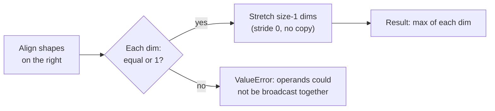

# 📘 NumPy and the Data Stack

NumPy is the foundation of scientific and data Python: pandas, scikit-learn, SciPy, PyTorch, and JAX all speak its array model.
Interviews for data, ML, and backend roles test whether you can think in **whole arrays** instead of loops, predict shapes under broadcasting, and know when an operation returns a **view** or a **copy**.
Every output on this page was checked with NumPy 2.5, pandas 3.0, and Polars 1.44 on CPython 3.14.

## Table of Contents

1. [Why NumPy Is Fast](#1-why-numpy-is-fast)
2. [The ndarray Memory Model](#2-the-ndarray-memory-model)
3. [Creating Arrays](#3-creating-arrays)
4. [dtypes and Type Promotion](#4-dtypes-and-type-promotion)
5. [Vectorization and ufuncs](#5-vectorization-and-ufuncs)
6. [Broadcasting](#6-broadcasting)
7. [Indexing: Basic, Boolean, and Fancy](#7-indexing-basic-boolean-and-fancy)
8. [Views vs Copies](#8-views-vs-copies)
9. [Axes and Reductions](#9-axes-and-reductions)
10. [Reshaping, Stacking, and Linear Algebra](#10-reshaping-stacking-and-linear-algebra)
11. [Random Numbers](#11-random-numbers)
12. [Performance and Memory](#12-performance-and-memory)
13. [pandas Essentials](#13-pandas-essentials)
14. [Polars, Numba, and Friends](#14-polars-numba-and-friends)
15. [Predict the Output](#15-predict-the-output)
16. [Questions](#16-questions)

---

## 1. Why NumPy Is Fast

A Python list of a million ints is a million pointers to a million separate int objects.
A NumPy array of a million `int64` values is **one contiguous 8 MB buffer** of raw machine integers plus a small header.

| | Python `list` of 1M ints | `np.arange(1_000_000)` |
| --- | --- | --- |
| Memory (measured) | About 36 MB (pointers plus int objects) | 8 MB |
| Element type | Any object, checked at every operation | One fixed `dtype` |
| Loop runs in | The bytecode interpreter | Compiled C, often SIMD |
| `x * x` then sum, measured | About 20 ms (generator expression) | About 0.35 ms, roughly 60x faster |

Timings vary by machine, but a 10x to 100x gap is typical.
The speed comes from three things: no per-element type dispatch, no per-element object allocation, and cache-friendly contiguous memory (see [Memory Hierarchy and Caches](/docs/computer-fundamentals/memory-hierarchy-and-caches)).
NumPy also **releases the GIL** inside most heavy operations, so threads can run NumPy work in parallel.

---

## 2. The ndarray Memory Model

An `ndarray` is a **header** describing how to interpret a raw **data buffer**.

```python
import numpy as np

a = np.arange(12).reshape(3, 4)
a.shape       # (3, 4)
a.ndim        # 2
a.size        # 12
a.dtype       # int64
a.itemsize    # 8 bytes per element
a.nbytes      # 96
a.strides     # (32, 8): bytes to step for the next row, next column
```

```text
header                                  data buffer (one contiguous block)
+--------------------+
| dtype   int64      |                 [ 0 | 1 | 2 | 3 | 4 | 5 | 6 | 7 | 8 | 9 | 10 | 11 ]
| shape   (3, 4)     |                   ^               ^
| strides (32, 8)    |---- data ptr -----+               +-- row 1 starts 32 bytes later
| base    (owner)    |
+--------------------+
```

**Strides** are the key idea.
The element `a[i, j]` lives at `data + i * 32 + j * 8`.
Many operations just build a new header over the same buffer by changing shape, strides, or the starting offset:

- `a.T` (transpose) swaps the strides to `(8, 32)`; no data moves.
- `a[:, ::2]` doubles the column stride; no data moves.
- `a.reshape(4, 3)` recomputes strides on a contiguous buffer; no data moves.

That is why these operations are O(1), and also why they return **views** that share memory.

**Memory order:** NumPy defaults to **C order** (row-major: the last index changes fastest).
Fortran order (`order="F"`) is column-major.
Iterating along the contiguous direction is faster because it uses whole cache lines.

---

## 3. Creating Arrays

| Call | Result |
| --- | --- |
| `np.array([1, 2, 3])` | From a Python sequence (copies) |
| `np.zeros((2, 3))`, `np.ones(5)`, `np.full((2, 2), 7)` | Filled arrays (float64 by default for zeros and ones) |
| `np.empty((1000,))` | **Uninitialized** memory, fast but contains garbage until you write it |
| `np.arange(0, 1, 0.25)` | `[0, 0.25, 0.5, 0.75]`, stop is exclusive |
| `np.linspace(0, 1, 5)` | `[0, 0.25, 0.5, 0.75, 1]`, count-based and stop is inclusive |
| `np.eye(3)`, `np.identity(3)` | Identity matrix |
| `np.zeros_like(a)` | Same shape and dtype as `a` |
| `np.asarray(x)` | Convert without copying if `x` is already a suitable array |
| `np.fromiter(gen, dtype=float)` | Build from an iterator without an intermediate list |

Use `linspace` rather than `arange` with float steps: floating-point rounding can make `arange` include or drop the last point unexpectedly.

---

## 4. dtypes and Type Promotion

| Kind | dtypes |
| --- | --- |
| Boolean | `bool` |
| Signed ints | `int8`, `int16`, `int32`, `int64` |
| Unsigned ints | `uint8` (images), `uint16`, `uint32`, `uint64` |
| Floats | `float16`, `float32` (ML, GPUs), `float64` (default) |
| Complex | `complex64`, `complex128` |
| Strings | `<U21` fixed-width Unicode, `StringDType` (variable width, NumPy 2) |
| Time | `datetime64`, `timedelta64` |
| Anything | `object` (pointers to Python objects, loses all speed) |

An array has exactly **one** dtype, so mixed input is upcast:

```python
np.array([1, 2.5]).dtype      # float64
np.array([1, "a"])            # array(['1', 'a'], dtype='<U21'), everything became a string
```

**Fixed-width integers overflow silently** (wrap around), unlike Python ints:

```python
x = np.array([127], dtype=np.int8)
x + 1                          # array([-128], dtype=int8)
np.array([1], np.int8) + 300   # OverflowError: Python integer 300 out of bounds for int8
```

### 4.1 NumPy 2 promotion rules (NEP 50)

NumPy 2 changed promotion so that **Python scalars are "weak"**: they adopt the array's dtype instead of upcasting it.
NumPy scalars and arrays are "strong".

```python
(np.float32(3) + 3.0).dtype                  # float32 (NumPy 1.x gave float64)
(np.array([1], np.int8) + np.int64(1)).dtype # int64
np.float32(0.1) == 0.1                       # True, because 0.1 is converted to float32 first
repr(np.float64(1.5))                        # 'np.float64(1.5)' (NumPy 2 repr shows the type)
```

Division always produces floats: `np.array([1, 2, 3]) / 2` is `float64`, while `// 2` keeps `int64`.

In-place operations cannot silently change dtype:

```python
xi = np.arange(4)
xi += 1.5    # UFuncTypeError: Cannot cast ufunc 'add' output from float64 to int64
```

---

## 5. Vectorization and ufuncs

**Vectorization** means expressing work as operations on whole arrays, so the loop runs in C.
A **ufunc** (universal function) is a compiled elementwise function: `np.add`, `np.multiply`, `np.exp`, `np.sqrt`, `np.maximum`, comparisons, and so on.

```python
prices = np.array([10.0, 20.0, 30.0])
qty = np.array([1, 0, 3])

revenue = prices * qty                 # elementwise, no loop
total = revenue.sum()                  # 100.0
discounted = np.where(qty > 2, prices * 0.9, prices)   # vectorized if/else
clipped = np.clip(prices, 12, 25)      # [12., 20., 25.]
```

Converting loop code:

```python
# loop: slow
out = []
for p, q in zip(prices, qty):
    out.append(p * q if q > 0 else 0.0)

# vectorized
out = np.where(qty > 0, prices * qty, 0.0)
```

Useful vectorized building blocks:

| Need | Tool |
| --- | --- |
| Elementwise if/else | `np.where(cond, a, b)`, `np.select(conds, choices)` |
| Running totals, differences | `np.cumsum`, `np.diff` |
| Index of min / max | `np.argmin`, `np.argmax` |
| Sort order, top-k | `np.argsort`, `np.partition` (O(n) selection) |
| Distinct values and counts | `np.unique(x, return_counts=True)` |
| Bin values | `np.digitize`, `np.histogram`, `np.bincount` |
| Membership | `np.isin(a, values)` |
| Write into an existing buffer | `np.add(a, b, out=a)` |

`np.vectorize` is **not** real vectorization: it is a convenience wrapper that still calls your Python function once per element.

---

## 6. Broadcasting

Broadcasting lets arrays of different shapes combine **without copying data**.
Compare shapes **from the right**; two dimensions are compatible if they are **equal or one of them is 1**.
Missing leading dimensions are treated as 1.

```text
A      (3, 4)          A      (3, 4)          A      (3, 1)
B         (4,)         B      (3,)            B         (4,)
-----------            -----------            -----------
result (3, 4)  ok      4 vs 3  ERROR          result (3, 4)  ok
```



```python
np.ones((3, 4)) + np.ones(4)          # shape (3, 4): the row is added to every row
np.ones((3, 4)) + np.ones(3)          # ValueError: shapes (3,4) (3,)

col = np.arange(3)[:, None]           # shape (3, 1); None is np.newaxis
row = np.arange(4)                    # shape (4,)
(col + row).shape                     # (3, 4), an "outer" operation
```

Common uses:

```python
# Center each column (subtract column means)
X = X - X.mean(axis=0)                           # (n, d) - (d,)

# Normalize each row to sum to 1
P = M / M.sum(axis=1, keepdims=True)             # (n, d) / (n, 1)

# All pairwise distances between n points and m points
d = np.sqrt(((A[:, None, :] - B[None, :, :]) ** 2).sum(axis=-1))   # (n, m)
```

`keepdims=True` keeps the reduced axis as size 1, which makes the result broadcast back correctly.
Watch memory: the pairwise example creates an `(n, m, d)` temporary.

---

## 7. Indexing: Basic, Boolean, and Fancy

```python
a = np.arange(12).reshape(3, 4)
# [[ 0  1  2  3]
#  [ 4  5  6  7]
#  [ 8  9 10 11]]

a[1, 2]          # 6  (one index per axis, not a[1][2] which makes an intermediate)
a[1]             # row 1
a[:, 1]          # column 1, shape (3,)
a[:, 1:2]        # column 1, shape (3, 1): slicing keeps the dimension
a[::-1]          # rows reversed
a[..., -1]       # last column; ... means "all remaining axes"
```

| Kind | Example | Returns |
| --- | --- | --- |
| **Basic** (ints, slices, `...`, `None`) | `a[1:, ::2]` | A **view** |
| **Boolean mask** | `a[a > 5]` | A **copy**, flattened to 1-D |
| **Fancy** (integer arrays or lists) | `a[[0, 2]]`, `a[[0, 1], [1, 0]]` | A **copy** |

```python
a[a > 5]                              # [ 6  7  8  9 10 11]
a[(a > 2) & (a < 6)]                  # use & | ~ with parentheses, not and / or / not
a[[0, 2]]                             # rows 0 and 2
np.array([[1, 2], [3, 4]])[[0, 1], [1, 0]]   # [2 3]: picks (0,1) and (1,0) pairwise

v = np.arange(5)
v[v > 2] = 0                          # assignment through a mask modifies v in place: [0 1 2 0 0]
```

`and` and `or` fail on arrays because Python asks for a single truth value:

```python
if np.array([1, 2]): ...
# ValueError: The truth value of an array with more than one element is ambiguous. Use a.any() or a.all()
```

---

## 8. Views vs Copies

This is the most common NumPy interview trap.

| Operation | Result |
| --- | --- |
| Basic slicing `a[1:3]`, `a[:, ::2]` | View |
| `a.T`, `a.reshape(...)` (when possible), `a.view(dtype)`, `a.ravel()` (when possible) | View |
| Boolean mask, fancy indexing | Copy |
| `a.copy()`, `a.flatten()`, `np.array(a)` | Copy |
| Arithmetic `a + 1` | New array |

```python
a = np.arange(12).reshape(3, 4)
b = a[:, 1:3]            # view
b[0, 0] = 99
a[0]                     # [ 0 99  2  3], the original changed
np.shares_memory(a, b)   # True

c = a[[0, 2]]            # fancy index: copy
c[0, 0] = -1
a[0, 0]                  # 0, unchanged

r = np.arange(6)
r.reshape(2, 3)[0, 0] = 100
r[0]                     # 100, reshape returned a view
```

How to reason about it:

- If NumPy can describe the result with new shape, strides, and offset over the same buffer, it returns a **view**.
- If the selected elements do not form a regular stride pattern (arbitrary index lists, masks), it must **copy**.
- `np.shares_memory(x, y)` answers the question definitively; `x.base` points to the array that owns the memory, but it can be a chain of views, so compare with `shares_memory`.

**Why it matters:** a view of a huge array keeps the whole buffer alive.
If you keep a small slice of a 2 GB array, call `.copy()` so the big one can be freed.

---

## 9. Axes and Reductions

`axis=k` means "**collapse** dimension k".

```python
a = np.arange(12).reshape(3, 4)
a.sum()                  # 66, everything
a.sum(axis=0)            # [12 15 18 21], collapse rows: one value per column
a.sum(axis=1)            # [ 6 22 38], collapse columns: one value per row
a.mean(axis=0)           # [4. 5. 6. 7.]
a.sum(axis=1, keepdims=True).shape   # (3, 1)
```

```text
            axis=1 (across columns) --->
          +----+----+----+----+
axis=0    |  0 |  1 |  2 |  3 |  ->  sum(axis=1) =  6
(down     |  4 |  5 |  6 |  7 |  ->                22
 rows)    |  8 |  9 | 10 | 11 |  ->                38
   |      +----+----+----+----+
   v        12   15   18   21     <- sum(axis=0)
```

Reductions: `sum`, `mean`, `std`, `var`, `min`, `max`, `argmin`, `argmax`, `any`, `all`, `prod`, `cumsum`, `median`, `percentile`.

**Missing values:** `NaN` propagates through arithmetic.

```python
np.nan == np.nan                  # False; use np.isnan
np.array([1, np.nan]).sum()       # nan
np.nansum([1, np.nan])            # 1.0 (also nanmean, nanmax, ...)
```

---

## 10. Reshaping, Stacking, and Linear Algebra

```python
x = np.arange(6)
x.reshape(2, 3)          # -1 lets NumPy infer one dimension: x.reshape(2, -1)
x.reshape(3, 2).T
x[:, None]               # (6, 1) column vector; same as x.reshape(-1, 1)
np.expand_dims(x, 0)     # (1, 6)
m.squeeze()              # drop size-1 axes
m.ravel()                # flatten, view if possible
m.flatten()              # flatten, always a copy
np.swapaxes(t, 0, 1); np.moveaxis(t, -1, 0)

np.concatenate([a, b], axis=0)   # join along an existing axis
np.stack([a, b])                 # join along a NEW axis: two (2,) arrays -> (2, 2)
np.vstack([a, b]); np.hstack([a, b])
np.split(x, 3)
```

Growing an array inside a loop with `np.append` or `concatenate` is O(n^2) because each call copies everything.
Collect pieces in a Python list and concatenate once, or preallocate with `np.empty` and fill.

### 10.1 `*` vs `@`

```python
A = np.array([[1, 2], [3, 4]])
A * A          # elementwise: [[ 1  4] [ 9 16]]
A @ A          # matrix product (np.matmul)
np.dot([1, 2], [3, 4])      # 11, inner product
np.einsum("ij,ij->i", X, Y) # row-wise dot products, explicit index notation
```

`np.linalg` has `inv`, `solve`, `det`, `eig`, `svd`, `norm`, `lstsq`, and `qr`.
Prefer `np.linalg.solve(A, b)` over `inv(A) @ b`: it is faster and numerically more stable.
Matrix products call an optimized **BLAS** library (OpenBLAS, Accelerate, or MKL), which is multi-threaded on its own.

---

## 11. Random Numbers

Use the **Generator** API; the legacy `np.random.seed` and `np.random.rand` global state is discouraged.

```python
rng = np.random.default_rng(42)       # seeded, reproducible
rng.integers(0, 10, size=3)           # [0 7 6]
rng.random(2)                          # uniform floats in [0, 1)
rng.normal(loc=0, scale=1, size=(2, 3))
rng.choice(items, size=5, replace=False)
rng.shuffle(arr)                       # in place
rng.permutation(10)
```

- Pass a `Generator` into functions instead of relying on global state; tests become reproducible.
- For parallel workers, derive independent streams with `rng.spawn(n)` (or `SeedSequence.spawn`) instead of seeding each worker with `seed + i`.
- `np.random` is not for security; use the `secrets` module for tokens.

---

## 12. Performance and Memory

| Tip | Why |
| --- | --- |
| Vectorize, avoid Python loops over elements | Loops pay interpreter cost per element |
| Pick the smallest dtype that is correct (`float32`, `int32`, `uint8`) | Halves memory and bandwidth; watch overflow and precision |
| Use in-place ops and `out=` (`a *= 2`, `np.add(a, b, out=a)`) | Avoids allocating temporaries |
| Beware large temporaries in chained expressions | `a * b + c` allocates intermediates; `numexpr` or Numba can fuse them |
| Keep data contiguous for hot loops (`np.ascontiguousarray`) | Strided access wastes cache lines |
| Reduce along the contiguous axis when you can | Better memory access pattern |
| Do not build arrays with repeated `np.append` | Quadratic copying |
| Avoid `dtype=object` | Every element is a Python object again |
| Use `np.memmap` or chunking for data larger than RAM | Loads pages on demand |
| Let BLAS use cores for matrix math, and set thread counts (`OMP_NUM_THREADS`) when also using process pools | Avoid oversubscription |

Measure with `%timeit` in IPython or the `timeit` module, and profile memory with `tracemalloc` or memray (see [CPython Internals](/docs/python/python-internals#12-profiling-and-debugging-tools)).

---

## 13. pandas Essentials

pandas adds **labeled** 1-D (`Series`) and 2-D (`DataFrame`) tables on top of NumPy-style columns.
Each column has one dtype; the row labels are the **index**.

```python
import pandas as pd

df = pd.DataFrame({
    "city": ["A", "B", "A", "C"],
    "sales": [10, 20, 30, None],
    "qty": [1, 2, 3, 4],
})

df.dtypes                     # city: str, sales: float64 (None became NaN), qty: int64
df.isna().sum()               # missing values per column
df[df.qty > 1]                # boolean filtering
df.loc[0:1, "city"]           # label-based, END INCLUSIVE: rows 0 and 1
df.iloc[0:1]                  # position-based, end exclusive: row 0 only
df.groupby("city")["sales"].sum()    # A 40.0, B 20.0, C 0.0 (NaN skipped)
df.assign(revenue=df.sales * df.qty)
df.sort_values("sales", ascending=False).head(3)
pd.merge(orders, users, on="user_id", how="left", validate="many_to_one")
```

### 13.1 pandas 3 changes you should know

| Change | Effect |
| --- | --- |
| **Copy-on-Write** is always on | Any derived DataFrame behaves like a copy; modifying `sub = df[mask]; sub["x"] = 0` never changes `df`, and the old `SettingWithCopyWarning` is gone |
| Dedicated **string dtype** by default | Text columns are `str` instead of `object` (backed by PyArrow when installed) |
| To modify the original | `df.loc[mask, "col"] = value` in one step |

### 13.2 Traps

- **Index alignment:** arithmetic aligns on labels, not positions, so mismatched indexes produce `NaN`.

  ```python
  s = pd.Series([1, 2, 3], index=["a", "b", "c"])
  t = pd.Series([10, 20], index=["b", "c"])
  s + t          # a NaN, b 12.0, c 23.0
  ```

- **Integer columns with missing values** become `float64` unless you use nullable dtypes (`Int64`).
- **Join explosions:** merging on a key duplicated on both sides multiplies rows (two by two gives four); pass `validate=`.
- **Row-wise loops are slow.** Measured on 100,000 rows:

  | Approach | Time |
  | --- | --- |
  | `df["x"] * 2` (vectorized) | about 0.04 ms |
  | `df["x"].apply(lambda v: v * 2)` | about 10 ms |
  | `itertuples()` loop | about 15 ms |
  | `iterrows()` loop | about 580 ms |

- **Chained indexing** such as `df["a"][0] = 1` does nothing useful under Copy-on-Write; use `df.loc[0, "a"] = 1`.

---

## 14. Polars, Numba, and Friends

| Tool | What it is | Reach for it when |
| --- | --- | --- |
| **Polars** | Rust DataFrame library on Apache Arrow, multi-threaded, with a lazy query optimizer | Large tables, speed, and expressions you want planned and parallelized |
| **DuckDB** | In-process analytical SQL engine that queries DataFrames, Parquet, and CSV directly | You think in SQL or data exceeds memory |
| **PyArrow** | Columnar memory format and Parquet I/O | Interchange between tools, zero-copy |
| **Numba** | JIT compiler for numeric Python functions (`@njit`) | Loops that cannot be vectorized (recurrences, custom kernels) |
| **Cython** | Compile typed Python-like code to C extensions | Long-lived performance-critical libraries |
| **JAX**, **PyTorch**, **CuPy** | NumPy-like arrays on GPUs, with autodiff (JAX, PyTorch) | ML and large numeric workloads |
| **SciPy** | Algorithms on top of NumPy: sparse matrices, optimization, stats, signal | Anything beyond basic linear algebra |

```python
import polars as pl

df = pl.DataFrame({"city": ["A", "B", "A"], "sales": [10, 20, 30]})
(
    df.lazy()                                    # build a query plan
      .filter(pl.col("sales") > 10)
      .group_by("city")
      .agg(pl.col("sales").sum())
      .collect()                                 # optimize and run in parallel
)
```

```python
from numba import njit

@njit
def ewma(x, alpha):                              # a recurrence: hard to vectorize
    out = np.empty_like(x)
    out[0] = x[0]
    for i in range(1, len(x)):
        out[i] = alpha * x[i] + (1 - alpha) * out[i - 1]
    return out
```

**pandas vs Polars in one line:** pandas has the biggest ecosystem and index-based API; Polars has no index, a stricter expression API, and is usually much faster on large data thanks to multi-threading and query optimization.

---

## 15. Predict the Output

| # | Code | Output | Why |
| --- | --- | --- | --- |
| 1 | `a = np.arange(6); b = a[1:3]; b[0] = 9; print(a)` | `[0 9 2 3 4 5]` | Slices are views |
| 2 | `a = np.arange(6); b = a[[1, 2]]; b[0] = 9; print(a)` | `[0 1 2 3 4 5]` | Fancy indexing copies |
| 3 | `print((np.ones((3, 1)) + np.ones(4)).shape)` | `(3, 4)` | Broadcasting |
| 4 | `np.ones((3, 4)) + np.ones(3)` | `ValueError` | Trailing dims 4 and 3 differ |
| 5 | `print(np.array([127], dtype=np.int8) + 1)` | `[-128]` | Fixed-width overflow wraps |
| 6 | `print(np.array([1, 2, 3]) / 2)` | `[0.5 1.  1.5]` | True division gives float64 |
| 7 | `print(np.array([1, "a"]).dtype)` | `<U21` | Mixed input upcasts to string |
| 8 | `print(np.nan == np.nan)` | `False` | IEEE 754 NaN is not equal to itself |
| 9 | `print(np.arange(12).reshape(3, 4).sum(axis=0))` | `[12 15 18 21]` | `axis=0` collapses rows |
| 10 | `if np.array([1, 2]): pass` | `ValueError` | Ambiguous truth value, use `any` / `all` |
| 11 | `print(np.array([[1, 2], [3, 4]]) * np.array([[1, 2], [3, 4]]))` | `[[ 1  4] [ 9 16]]` | `*` is elementwise; `@` is matrix product |
| 12 | `print((np.float32(3) + 3.0).dtype)` | `float32` | NumPy 2: Python scalars are weak |
| 13 | `x = np.arange(4); x += 1.5` | `UFuncTypeError` | In-place cannot change int to float |
| 14 | `print(np.arange(0, 1, 0.25), len(np.linspace(0, 1, 5)))` | `[0.   0.25 0.5  0.75] 5` | `arange` excludes stop, `linspace` includes it |
| 15 | `s = pd.Series([1, 2], index=["a", "b"]); print((s + pd.Series([10], index=["b"])).tolist())` | `[nan, 12.0]` | Index alignment |

---

## 16. Questions

**Q: Why is NumPy faster than Python lists?**
Contiguous typed buffers, loops in compiled C with SIMD, no per-element objects or type dispatch, and the GIL released during heavy work.

**Q: What are strides?**
The number of bytes to step in memory to move one position along each axis; changing them lets transposes, slices, and reshapes be views without copying.

**Q: Explain broadcasting.**
Shapes are compared from the right; each dimension must be equal or 1, size-1 dimensions are stretched virtually with stride 0, and missing leading dimensions count as 1.

**Q: When does NumPy return a view and when a copy?**
Basic slicing, transpose, and most reshapes return views; boolean masks, fancy indexing, `copy`, and `flatten` return copies; check with `np.shares_memory`.

**Q: What does `axis=0` mean?**
The operation collapses the first dimension, so on a 2-D array you get one result per column.

**Q: Is `np.vectorize` fast?**
No; it still calls the Python function per element and is only a convenience.

**Q: How do you handle NaN in NumPy?**
Test with `np.isnan`, since `nan != nan`, and use `nansum`, `nanmean`, and similar functions to ignore missing values.

**Q: What changed in NumPy 2 type promotion?**
NEP 50 made Python scalars weak, so `float32_array + 3.0` stays `float32`, and out-of-range Python ints raise instead of wrapping.

**Q: How do you get reproducible random numbers?**
Create `np.random.default_rng(seed)` and pass the Generator around; spawn child generators for parallel workers.

**Q: `loc` vs `iloc` in pandas?**
`loc` selects by label with inclusive slice ends; `iloc` selects by integer position with exclusive ends.

**Q: What is Copy-on-Write in pandas 3?**
Every derived object behaves as an independent copy, with the actual copy deferred until one side is modified, so chained assignment never changes the parent and you use `df.loc[...] = value` instead.

**Q: A pandas job is slow. What do you check first?**
Row-wise `apply` or `iterrows` loops to replace with vectorized column operations, `object` dtypes, oversized dtypes, and exploding joins; then consider Polars or DuckDB for large data.
