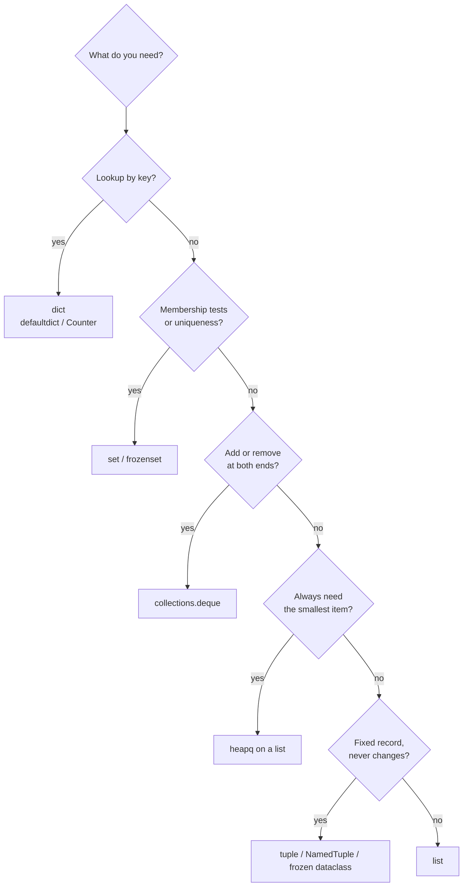

# 📘 Data Structures and the Standard Library

Picking the right built-in is most of Python performance.
This page covers how `list`, `dict`, `set`, and `tuple` work inside CPython, their Big-O costs, and the standard library tools (`collections`, `heapq`, `bisect`, `itertools`) you reach for in DSA rounds.
Size and ordering facts were checked on CPython 3.14.

## Table of Contents

1. [Choosing a Collection](#1-choosing-a-collection)
2. [list: A Dynamic Array](#2-list-a-dynamic-array)
3. [tuple and Named Tuples](#3-tuple-and-named-tuples)
4. [dict: A Compact Hash Table](#4-dict-a-compact-hash-table)
5. [set and frozenset](#5-set-and-frozenset)
6. [Time Complexity Cheat Sheet](#6-time-complexity-cheat-sheet)
7. [Comprehensions and Generator Expressions](#7-comprehensions-and-generator-expressions)
8. [Sorting](#8-sorting)
9. [The collections Module](#9-the-collections-module)
10. [heapq: Priority Queues](#10-heapq-priority-queues)
11. [bisect: Binary Search on Sorted Lists](#11-bisect-binary-search-on-sorted-lists)
12. [itertools and functools Essentials](#12-itertools-and-functools-essentials)
13. [DSA Templates in Python](#13-dsa-templates-in-python)
14. [Questions](#14-questions)

---

## 1. Choosing a Collection



---

## 2. list: A Dynamic Array

A `list` is a contiguous array of **pointers** to objects, not an array of the objects themselves.
That is why a list can hold mixed types, and why a list of a million small ints uses far more memory than an `array.array` or NumPy array.

```text
list object
+-----------+
| ob_size 3 |      ob_item (heap array of PyObject*)
| allocated 4 ---> [ ptr | ptr | ptr | spare ]
+-----------+         |     |     |
                      v     v     v
                     int   str   list
```

### 2.1 Over-allocation

When `append` runs out of room, CPython grows the array by roughly **12.5 percent plus a small constant**, so appends are **amortized O(1)**.
On 3.14 an empty list is 56 bytes, and capacity grows at lengths 1, 5, 9, 17, 25, 33, and so on.

### 2.2 Costs that surprise people

| Operation | Cost | Why |
| --- | --- | --- |
| `xs.append(x)`, `xs.pop()` | O(1) amortized | Works at the end |
| `xs.insert(0, x)`, `xs.pop(0)` | **O(n)** | Shifts every pointer; use `deque` |
| `x in xs` | O(n) | Linear scan; use a `set` for repeated checks |
| `xs[i]` | O(1) | Pointer arithmetic |
| `xs[a:b]` | O(b - a) | Copies the slice |
| `xs.sort()` | O(n log n) | Timsort (Powersort merge policy since 3.11) |
| `len(xs)` | O(1) | Stored in the header |

```python
nums.sort()            # in place, returns None
new = sorted(nums)     # new list, works on any iterable
nums.reverse()         # in place
rev = nums[::-1]       # copy
```

A common bug is `nums = nums.sort()`, which sets `nums` to `None`.

---

## 3. tuple and Named Tuples

Tuples are immutable, slightly smaller than lists (no over-allocation), hashable when their items are, and used for fixed records, dict keys, and multiple return values.

```python
point = (3, 4)
single = (1,)          # the comma makes the tuple, not the parentheses
x, y = point           # unpacking
```

For readable records:

```python
from typing import NamedTuple

class Point(NamedTuple):
    x: float
    y: float = 0.0

p = Point(3, 4)
p.x, p[0]              # attribute and index access
p._replace(x=10)       # returns a new tuple
```

Use a **dataclass** instead when you need mutability, methods with more logic, or no tuple behavior (a `NamedTuple` compares equal to a plain tuple with the same values).

---

## 4. dict: A Compact Hash Table

Since CPython 3.6 the dict is split into two arrays: a small sparse **index table** and a dense **entries array** in insertion order.
Insertion order is a **language guarantee since 3.7**.

```text
indices:  [ -, 1, -, 0, -, -, 2, - ]      (sparse, small ints)
entries:  [ (hash, "b", 2),               (dense, insertion order)
            (hash, "a", 1),
            (hash, "c", 3) ]
```

- **Lookup:** hash the key, probe the index table (open addressing with a perturbed probe sequence), compare hash then `==`.
- **Resize:** when about two thirds full, the table grows and entries are reinserted, so inserts are amortized O(1).
- **Worst case:** O(n) if many keys collide; string hashing is randomized per process (`PYTHONHASHSEED`) to stop collision attacks.

### 4.1 Key rules

Keys must be hashable, and **equal keys must have equal hashes**.
Because `1 == 1.0 == True` and they hash the same, they are the same key:

```python
{1: "a", 1.0: "b", True: "c"}      # {1: 'c'}, first key object kept, last value wins
```

### 4.2 Everyday API

```python
d = {"a": 1}
d.get("z", 0)                       # default instead of KeyError
d.setdefault("tags", []).append("x")
d.pop("a", None)                    # remove with a default
d |= {"b": 2}                       # in-place merge (3.9+)
for k, v in d.items(): ...
dict.fromkeys("abca")               # {'a': None, 'b': None, 'c': None}, dedupe preserving order
list(dict.fromkeys(items))          # order-preserving unique list
```

`d.keys()`, `d.values()`, and `d.items()` are live **views**, and `keys()` and `items()` support set operations: `d1.keys() & d2.keys()`.

---

## 5. set and frozenset

A `set` is a hash table of keys without values, giving average O(1) `add`, `remove`, and `in`.
Sets are **unordered**: never depend on iteration order.
`frozenset` is the immutable, hashable version, usable as a dict key or a member of another set.

```python
a, b = {1, 2, 3}, {3, 4}
a | b      # union {1, 2, 3, 4}
a & b      # intersection {3}
a - b      # difference {1, 2}
a ^ b      # symmetric difference {1, 2, 4}
a <= b     # subset test
empty = set()   # {} is an empty DICT
```

`s.remove(x)` raises `KeyError` if missing; `s.discard(x)` does not.

---

## 6. Time Complexity Cheat Sheet

Average case for CPython.

| Operation | list | dict | set | deque |
| --- | --- | --- | --- | --- |
| Index `x[i]` | O(1) | n/a | n/a | O(n) (O(1) at ends) |
| Append / push right | O(1)* | O(1)* | O(1)* | O(1) |
| Pop right | O(1) | O(1) `popitem` | O(1) `pop` (arbitrary) | O(1) |
| Insert / pop left | O(n) | n/a | n/a | **O(1)** |
| Membership `in` | O(n) | **O(1)** | **O(1)** | O(n) |
| Delete by key / value | O(n) | O(1) | O(1) | O(n) |
| Iterate | O(n) | O(n) | O(n) | O(n) |
| Copy | O(n) | O(n) | O(n) | O(n) |
| Sort | O(n log n) | n/a | n/a | n/a |

\* amortized.
`heapq.heappush` and `heappop` are O(log n), `heapify` is O(n), and `bisect` search is O(log n) but `insort` is O(n) because of the shift.

---

## 7. Comprehensions and Generator Expressions

```python
squares = [x * x for x in range(10) if x % 2 == 0]
index = {name: i for i, name in enumerate(names)}
unique_lengths = {len(w) for w in words}
flat = [cell for row in grid for cell in row]        # loops read left to right
total = sum(x * x for x in range(10**6))              # generator: constant memory
```

| | List comprehension | Generator expression |
| --- | --- | --- |
| Syntax | `[...]` | `(...)` |
| Evaluation | Eager, builds the whole list | Lazy, yields one item at a time |
| Memory | O(n) | O(1) |
| Reusable | Yes | **No**, exhausted after one pass |

Comprehensions have their own scope, so the loop variable does not leak.
Since 3.12 (PEP 709) list, dict, and set comprehensions are **inlined**, which removed the hidden function call and made them faster.

Prefer a plain loop when the comprehension needs side effects or more than two `for` clauses.

---

## 8. Sorting

Python's sort is **stable** (equal keys keep their original order), which lets you sort by multiple keys in passes or with tuples.

```python
people.sort(key=lambda p: (p.age, p.name))            # age, then name
people.sort(key=lambda p: (-p.score, p.name))         # score descending, name ascending
from operator import itemgetter, attrgetter
rows.sort(key=itemgetter(1))                          # faster than a lambda
people.sort(key=attrgetter("age"))
words.sort(key=str.casefold)
```

For a custom comparison you cannot express as a key, use `functools.cmp_to_key`:

```python
from functools import cmp_to_key
# Largest number from digits: compare "a+b" vs "b+a"
nums = sorted(map(str, nums), key=cmp_to_key(lambda a, b: (b + a > a + b) - (b + a < a + b)))
```

---

## 9. The collections Module

| Type | Use it for |
| --- | --- |
| `deque` | Queues, BFS, sliding windows; O(1) at both ends; `deque(maxlen=k)` keeps the last k |
| `defaultdict` | Grouping without `setdefault`: `defaultdict(list)` |
| `Counter` | Frequencies, top-k, multiset math |
| `OrderedDict` | `move_to_end` and `popitem(last=False)`, handy for an LRU cache |
| `ChainMap` | Layered lookups (CLI args over env over defaults) |
| `namedtuple` | Lightweight record (prefer `typing.NamedTuple`) |

```python
from collections import deque, defaultdict, Counter, OrderedDict

q = deque([1, 2]); q.appendleft(0); q.popleft(); q.rotate(1)

graph = defaultdict(list)
for u, v in edges:
    graph[u].append(v)

c = Counter("mississippi")
c.most_common(2)              # [('i', 4), ('s', 4)]
c["z"]                        # 0, missing keys count as zero
Counter(a=3, b=1) - Counter(a=1, b=2)   # Counter({'a': 2}), drops non-positive

class LRU:
    def __init__(self, cap: int) -> None:
        self.cap, self.data = cap, OrderedDict()

    def get(self, key):
        if key not in self.data:
            return -1
        self.data.move_to_end(key)
        return self.data[key]

    def put(self, key, value) -> None:
        self.data[key] = value
        self.data.move_to_end(key)
        if len(self.data) > self.cap:
            self.data.popitem(last=False)
```

`defaultdict` only calls the factory on `d[key]` access, not on `d.get(key)` or `key in d`.

---

## 10. heapq: Priority Queues

`heapq` turns a plain list into a **binary min-heap** in place.

```python
import heapq

h = []
heapq.heappush(h, (priority, counter, item))   # counter breaks ties so items never get compared
prio, _, item = heapq.heappop(h)

heapq.heapify(nums)                    # O(n)
heapq.nlargest(3, nums)                # O(n log k)
heapq.nsmallest(3, rows, key=len)
heapq.heappushpop(h, x)                # push then pop, faster than two calls
```

**Max-heap:** before 3.14, push negated values (`-x`).
Python 3.14 added public max-heap functions: `heapify_max`, `heappush_max`, `heappop_max`, `heapreplace_max`, and `heappushpop_max`.

**Top-k pattern:** keep a min-heap of size k; if a new item beats `h[0]`, `heapreplace`.
Cost O(n log k) time and O(k) space.

For thread-safe producer and consumer queues use `queue.PriorityQueue`, and for async code `asyncio.PriorityQueue`.

---

## 11. bisect: Binary Search on Sorted Lists

```python
import bisect

a = [1, 2, 2, 3]
bisect.bisect_left(a, 2)      # 1, first index where 2 could go (first >= 2)
bisect.bisect_right(a, 2)     # 3, after the last 2 (first > 2)
bisect.insort(a, 2)           # keeps a sorted; O(n) because of shifting

i = bisect.bisect_left(a, x)
found = i < len(a) and a[i] == x

bisect.bisect_left(records, 30, key=lambda r: r.age)   # key= since 3.10
```

`bisect_left` answers "lower bound" and `bisect_right` answers "upper bound", matching C++ `lower_bound` and `upper_bound`.
The LIS in O(n log n) is `bisect_left` on a "tails" list.

---

## 12. itertools and functools Essentials

| Tool | Example | Result |
| --- | --- | --- |
| `accumulate` | `accumulate([1, 2, 3, 4])` | `1, 3, 6, 10` (prefix sums) |
| `pairwise` (3.10) | `pairwise([1, 2, 3])` | `(1, 2), (2, 3)` |
| `batched` (3.12) | `batched("abcdefg", 3)` | `('a','b','c'), ('d','e','f'), ('g',)` |
| `groupby` | `groupby("aabbbca")` | Runs of **consecutive** equal keys: `a, b, c, a` |
| `chain` | `chain(a, b)`, `chain.from_iterable(lists)` | Concatenate iterables lazily |
| `product` | `product("ab", repeat=2)` | `aa ab ba bb` |
| `permutations` | `permutations([1, 2, 3], 2)` | Ordered arrangements |
| `combinations` | `combinations([1, 2, 3], 2)` | Unordered subsets |
| `islice` | `islice(gen, 10)` | Slice any iterator |
| `count`, `cycle`, `repeat` | `count(1)` | Infinite iterators |
| `zip_longest` | `zip_longest(a, b, fillvalue=0)` | Pad the shorter input |

`groupby` only groups adjacent items, so sort by the same key first when you want global groups.

From `functools`: `cache` and `lru_cache` for memoization, `reduce`, `partial`, `cmp_to_key`, and `cached_property`.
Those are covered on the [Functions page](/docs/python/functions-and-functional-python).

---

## 13. DSA Templates in Python

```python
# BFS on a grid
from collections import deque
def bfs(grid, start):
    rows, cols = len(grid), len(grid[0])
    seen, q = {start}, deque([(start, 0)])
    while q:
        (r, c), dist = q.popleft()
        for dr, dc in ((1, 0), (-1, 0), (0, 1), (0, -1)):
            nr, nc = r + dr, c + dc
            if 0 <= nr < rows and 0 <= nc < cols and grid[nr][nc] != "#" and (nr, nc) not in seen:
                seen.add((nr, nc))
                q.append(((nr, nc), dist + 1))

# Dijkstra
import heapq
def dijkstra(adj, src):
    dist = {src: 0}
    h = [(0, src)]
    while h:
        d, u = heapq.heappop(h)
        if d > dist.get(u, float("inf")):
            continue                           # stale entry
        for v, w in adj[u]:
            nd = d + w
            if nd < dist.get(v, float("inf")):
                dist[v] = nd
                heapq.heappush(h, (nd, v))
    return dist

# Memoized DP
from functools import cache
@cache
def ways(n: int) -> int:
    return 1 if n <= 1 else ways(n - 1) + ways(n - 2)

# Union-Find with path compression
parent = list(range(n))
def find(x):
    while parent[x] != x:
        parent[x] = parent[parent[x]]
        x = parent[x]
    return x
```

Interview survival tips:

- The default recursion limit is 1000 (`sys.setrecursionlimit`), so deep DFS on large inputs should be iterative.
- `float("inf")` and `math.inf` are the usual infinities.
- Reading large input fast: `sys.stdin.buffer.read().split()`.
- Strings are immutable, so build with a list and `"".join`.
- `x // 2` for integer midpoint; Python ints never overflow, so `(lo + hi) // 2` is safe.

See the [DSA section](/docs/dsa) for the patterns themselves.

---

## 14. Questions

**Q: How is a Python list implemented?**
A dynamic array of object pointers with over-allocation, so append is amortized O(1) but insert or pop at the front is O(n).

**Q: How does a dict work and why is it ordered?**
An open-addressing hash table split into a sparse index array and a dense entries array; entries are appended in insertion order, which became a language guarantee in 3.7.

**Q: What makes an object usable as a dict key?**
It must be hashable (`__hash__` stable for its lifetime) and consistent with `__eq__`, so equal objects hash equally.

**Q: When do you use a `deque` over a `list`?**
When you add or remove at the left end, as in BFS queues, because `deque` does it in O(1) and `list` in O(n).

**Q: How do you build a max-heap?**
Push negated keys into `heapq`, or on 3.14+ use `heappush_max` and `heappop_max`.

**Q: List comprehension vs generator expression?**
The list builds everything eagerly; the generator is lazy, uses constant memory, and can be consumed once.

**Q: Is Python's sort stable?**
Yes, Timsort is stable, which is what makes multi-key sorting with tuples or multiple passes work.

**Q: Why does `groupby` return the same key twice?**
It only groups consecutive items; sort by the key first.
