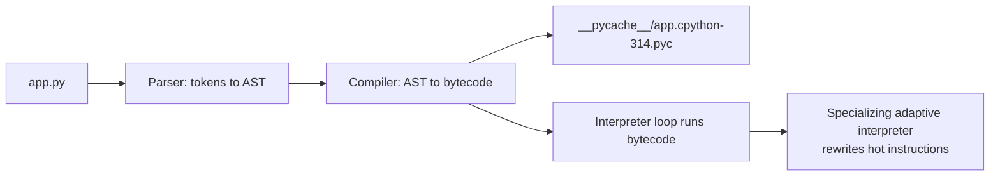

# 📘 Python Fundamentals

Python is a dynamically typed, strongly typed, garbage-collected language where **everything is an object**.
This page covers the mental model (names point to objects), the built-in types you use every day, control flow, exceptions, and the idioms that make code look like Python instead of translated Java.
Examples target Python 3.12 to 3.14 and were run on CPython 3.14.

## Table of Contents

1. [How Python Runs](#1-how-python-runs)
2. [Names, Objects, and References](#2-names-objects-and-references)
3. [Mutable vs Immutable](#3-mutable-vs-immutable)
4. [Numbers](#4-numbers)
5. [Strings and Bytes](#5-strings-and-bytes)
6. [Truthiness and Comparisons](#6-truthiness-and-comparisons)
7. [Control Flow](#7-control-flow)
8. [Structural Pattern Matching](#8-structural-pattern-matching)
9. [Exceptions](#9-exceptions)
10. [Modules, Packages, and Imports](#10-modules-packages-and-imports)
11. [Pythonic Idioms](#11-pythonic-idioms)
12. [Common Pitfalls](#12-common-pitfalls)
13. [Questions](#13-questions)

---

## 1. How Python Runs

"Python" is a language specification.
**CPython** is the reference implementation written in C, and it is what `python3` means on almost every machine.
Other implementations exist: **PyPy** (JIT compiled, often much faster for pure Python loops), **MicroPython** (microcontrollers), **GraalPy** and **Jython** (JVM).

CPython compiles source to **bytecode**, caches it in `__pycache__/*.pyc`, and runs it on a stack-based virtual machine.
There is no separate compile step you run by hand, and errors like `NameError` only appear when that line executes.



```bash
python3 app.py              # run a script
python3 -m http.server      # run a module as a script (uses sys.path, not a file path)
python3 -c "print(2 ** 10)" # run a one-liner
python3 -i app.py           # run, then drop into the REPL with its globals
```

| Term | Meaning |
| --- | --- |
| **Dynamically typed** | Types belong to objects, not variables; a name can point to an `int` and later to a `str` |
| **Strongly typed** | No silent coercion between unrelated types: `"1" + 1` raises `TypeError` |
| **Interpreted** | Bytecode runs in a VM; CPython 3.11+ specializes hot bytecode, and 3.13+ has an experimental JIT |
| **Garbage collected** | Reference counting frees most objects immediately, a cycle collector handles the rest |

### 1.1 The `__name__ == "__main__"` guard

```python
def main() -> None:
    print("running")

if __name__ == "__main__":
    main()
```

When a file is run directly, its module `__name__` is `"__main__"`.
When it is imported, `__name__` is the module name, so the guard stops side effects on import.
It is also required for `multiprocessing` with the `spawn` start method (default on macOS and Windows), because child processes re-import the main module.

---

## 2. Names, Objects, and References

A variable in Python is a **name bound to an object**, not a box holding a value.
Assignment never copies data; it binds another name to the same object.

```python
a = [1, 2, 3]
b = a          # b and a name the SAME list
b.append(4)
print(a)       # [1, 2, 3, 4]

b = [9]        # rebinding b does not touch a
print(a)       # [1, 2, 3, 4]
```

Every object has an **identity** (`id(obj)`, its address in CPython), a **type** (`type(obj)`), and a **value**.

| Operator | Compares | Use for |
| --- | --- | --- |
| `==` | Values, via `__eq__` | Almost everything |
| `is` | Identity, same object | `None`, `True`, `False`, sentinels |

```python
x = None
if x is None:      # correct and fastest
    ...
```

### 2.1 Pass by object reference

Python passes **references to objects by value** (sometimes called "pass by assignment" or "call by sharing").
A function can mutate a mutable argument, but rebinding the parameter never affects the caller.

```python
def mutate(lst):
    lst.append(99)     # caller sees this

def rebind(lst):
    lst = [0]          # local name only, caller does not see this

nums = [1]
mutate(nums)
rebind(nums)
print(nums)            # [1, 99]
```

### 2.2 Shallow vs deep copy

```python
import copy

grid = [[0, 0], [0, 0]]
shallow = grid.copy()          # also list(grid), grid[:], copy.copy(grid)
deep = copy.deepcopy(grid)

grid[0][0] = 1
print(shallow[0][0])           # 1, inner lists are shared
print(deep[0][0])              # 0, fully independent
```

A **shallow copy** creates a new outer container that references the same inner objects.
A **deep copy** recursively copies everything and handles cycles with a memo dict.

---

## 3. Mutable vs Immutable

| Immutable | Mutable |
| --- | --- |
| `int`, `float`, `complex`, `bool` | `list` |
| `str`, `bytes` | `bytearray` |
| `tuple`, `frozenset` | `dict`, `set` |
| `None`, `range` | Most user-defined class instances |

Immutable means the object's value cannot change after creation.
"Changing" an immutable value creates a new object and rebinds the name.

```python
s = "hi"
print(id(s))
s += "!"          # builds a new string, rebinds s
print(id(s))      # different id
```

**Hashability:** only objects whose hash never changes can be dict keys or set members.
All immutable built-ins are hashable, **except a tuple that contains a mutable object**.

```python
hash((1, 2))        # fine
hash((1, [2]))      # TypeError: unhashable type: 'list'
```

The classic trap: a tuple is immutable, but the list inside it is not.

```python
t = ([1],)
t[0].append(2)      # works: t is now ([1, 2],)
t[0] += [3]         # raises TypeError AND the list is still extended to [1, 2, 3]
```

`t[0] += [3]` runs `list.__iadd__` (which mutates in place and succeeds), then tries `t[0] = result` (which fails because tuples do not support item assignment).

---

## 4. Numbers

| Type | Notes |
| --- | --- |
| `int` | **Arbitrary precision**, never overflows; `2 ** 1000` just works |
| `float` | IEEE 754 double (about 15 to 17 significant digits) |
| `complex` | `3 + 4j` |
| `decimal.Decimal` | Exact base-10 arithmetic, use for money |
| `fractions.Fraction` | Exact rationals |
| `bool` | Subclass of `int`: `True == 1`, `True + True == 2` |

```python
0.1 + 0.2 == 0.3               # False, binary floating point
import math
math.isclose(0.1 + 0.2, 0.3)   # True

from decimal import Decimal
Decimal("0.1") + Decimal("0.2") == Decimal("0.3")   # True, pass strings not floats
```

### 4.1 Division and rounding

| Expression | Result | Why |
| --- | --- | --- |
| `7 / 2` | `3.5` | True division always returns `float` |
| `7 // 2` | `3` | Floor division |
| `-7 // 2` | `-4` | Floors toward negative infinity, not toward zero |
| `-7 % 2` | `1` | Result has the sign of the divisor, so `(a // b) * b + a % b == a` |
| `int(-3.5)` | `-3` | Truncates toward zero |
| `round(2.5)` | `2` | **Banker's rounding**: ties go to the even neighbor |
| `round(3.5)` | `4` | Even neighbor again |
| `divmod(17, 5)` | `(3, 2)` | Quotient and remainder at once |

Other useful facts:

- `1_000_000` is valid; underscores are visual separators.
- `0b1010`, `0o17`, `0xFF` are binary, octal, and hex literals.
- `float("inf")`, `float("nan")`, and `nan != nan` is `True`.
- `int("42")`, `int("ff", 16)`, `bin(10)`, `hex(255)` convert between bases.
- Converting very long strings to `int` is capped at 4300 digits by default to prevent denial of service (`sys.set_int_max_str_digits`).

---

## 5. Strings and Bytes

`str` is an immutable sequence of **Unicode code points**.
`bytes` is an immutable sequence of integers 0 to 255.
You convert with `encode` and `decode`, and UTF-8 is the default.

```python
s = "café"
b = s.encode()        # b'caf\xc3\xa9', 5 bytes
b.decode()            # 'café'
len(s), len(b)        # (4, 5)
```

### 5.1 Slicing

`seq[start:stop:step]`, where `stop` is exclusive and out-of-range slices never raise.

```python
s = "hello"
s[1:3]     # 'el'
s[-3:]     # 'llo'
s[::-1]    # 'olleh'
s[10:]     # '' (no IndexError for slices)
s[10]      # IndexError
```

### 5.2 Formatting

f-strings are the default choice; they are evaluated at runtime and are the fastest formatting option.

```python
name, price, n = "tea", 3.14159, 1000000
f"{name!r:>8}"        # "   'tea'"  (repr, right aligned in 8)
f"{price:.2f}"        # '3.14'
f"{n:,}"              # '1,000,000'
f"{n=}"               # 'n=1000000' (3.8+, great for debugging)
f"{0.25:.0%}"         # '25%'
```

Python 3.12 (PEP 701) lets f-strings reuse the same quote type inside, nest arbitrarily, and span lines.
Python 3.14 adds **template strings** (`t"..."`, PEP 750), which produce a `Template` object instead of a `str`, so a library can escape interpolated values safely (SQL, HTML, shell).

```python
from string.templatelib import Template
user = "<script>"
tpl = t"<p>{user}</p>"
isinstance(tpl, Template)   # True: tpl.strings and tpl.interpolations are exposed for safe rendering
```

### 5.3 Must-know string methods

| Method | Example |
| --- | --- |
| `split`, `rsplit` | `"a,b,,c".split(",")` gives `['a', 'b', '', 'c']`; `" a  b ".split()` gives `['a', 'b']` |
| `join` | `", ".join(["a", "b"])`, called on the separator |
| `strip`, `lstrip`, `rstrip` | Remove characters from the ends (a set of chars, not a prefix) |
| `removeprefix`, `removesuffix` | 3.9+, remove an exact prefix or suffix |
| `startswith`, `endswith` | Accept a tuple: `path.endswith((".py", ".pyi"))` |
| `find` vs `index` | `find` returns -1, `index` raises `ValueError` |
| `replace`, `count` | Non-overlapping |
| `isdigit`, `isalpha`, `isalnum`, `isspace` | Character class checks |
| `lower`, `upper`, `casefold` | `casefold` is for case-insensitive comparison |

**Performance:** building a string with `+=` in a loop is quadratic in general, so collect parts in a list and `"".join(parts)`.
CPython sometimes optimizes `+=` in place when the string has a single reference, but do not rely on it.

---

## 6. Truthiness and Comparisons

These are **falsy**: `None`, `False`, `0`, `0.0`, `0j`, `""`, `b""`, `[]`, `()`, `{}`, `set()`, `range(0)`, and any object whose `__bool__` returns `False` or whose `__len__` returns 0.
Everything else is truthy, including `"0"`, `"False"`, and `[0]`.

```python
items = []
if not items:          # idiomatic empty check
    print("empty")
```

### 6.1 `and` / `or` return operands, not booleans

```python
"" or "default"        # 'default'
[] and 1 / 0           # [] (short circuit, the division never runs)
0 or None              # None
x = config.get("port") or 8080   # careful: port 0 would be replaced too
```

### 6.2 Chained comparisons

```python
0 < x < 10             # means (0 < x) and (x < 10), x evaluated once
a == b == c
1 < 3 > 2              # True, legal but confusing
```

### 6.3 Comparing different types

Python 3 refuses to order unrelated types: `1 < "2"` raises `TypeError`.
Equality between unrelated types is simply `False`.
Sequences compare **lexicographically**: `(1, 2, 3) < (1, 3)` is `True`, which is why tuples make good sort keys.

---

## 7. Control Flow

```python
for i, item in enumerate(items, start=1):     # index and value
    ...

for name, score in zip(names, scores, strict=True):   # 3.10+: error if lengths differ
    ...

while queue:
    node = queue.pop()
```

### 7.1 `else` on loops

A loop's `else` runs when the loop finishes **without `break`**.
It reads like "no break", which makes search loops clean.

```python
for n in range(2, 10):
    for d in range(2, n):
        if n % d == 0:
            break
    else:
        print(n, "is prime")
```

### 7.2 The walrus operator `:=` (3.8+)

Assigns inside an expression.

```python
while (line := f.readline()):
    process(line)

if (m := re.match(r"(\d+)", text)):
    print(m.group(1))
```

### 7.3 Conditional expression

```python
label = "even" if n % 2 == 0 else "odd"
```

---

## 8. Structural Pattern Matching

`match` (3.10+) is **not** a C-style switch.
It destructures values by shape, type, and content.

```python
def handle(event):
    match event:
        case {"type": "click", "pos": (x, y)}:
            return f"click at {x},{y}"
        case {"type": "key", "key": str(k)} if k.isalpha():   # guard
            return f"letter {k}"
        case [first, *rest]:
            return f"list starting with {first}"
        case Point(x=0, y=0):
            return "origin"
        case int() | float() as num:
            return f"number {num}"
        case _:
            return "unknown"
```

| Pattern | Matches |
| --- | --- |
| `42`, `"ok"`, `None` | Literal equality (`None`, `True`, `False` use `is`) |
| `name` (bare) | **Anything**, and binds it; a bare name is a capture, not a comparison |
| `Color.RED` | Dotted names compare by value |
| `[a, b, *rest]` | Sequences (not `str` or `bytes`) |
| `{"k": v, **rest}` | Mappings; extra keys are allowed |
| `Point(x=0)` | `isinstance` check plus attribute match |
| `p1 \| p2` | Alternatives |
| `case ... if cond` | Guard |

The trap: `case RED:` where `RED` is a plain variable **captures** everything and shadows it.
Use dotted names (`Color.RED`) or literals for constants.

---

## 9. Exceptions

```python
try:
    value = int(raw)
except ValueError as e:
    log.warning("bad input %r: %s", raw, e)
    value = 0
except (TypeError, KeyError):
    raise
else:
    print("runs only if no exception")
finally:
    print("always runs, even after return or break")
```

### 9.1 Hierarchy that matters

```text
BaseException
 ├── SystemExit, KeyboardInterrupt, GeneratorExit   (do not catch casually)
 ├── BaseExceptionGroup
 └── Exception
      ├── ArithmeticError  (ZeroDivisionError, OverflowError)
      ├── LookupError      (KeyError, IndexError)
      ├── ValueError       (UnicodeError)
      ├── TypeError, NameError (UnboundLocalError), AttributeError
      ├── OSError          (FileNotFoundError, PermissionError, TimeoutError, ConnectionError)
      ├── RuntimeError     (RecursionError, NotImplementedError)
      ├── StopIteration, StopAsyncIteration
      └── ExceptionGroup
```

- Catch `Exception`, never bare `except:` (it swallows `KeyboardInterrupt` and `SystemExit`).
- Catch the narrowest exception you can actually handle.

### 9.2 Chaining

```python
try:
    cfg = json.loads(text)
except json.JSONDecodeError as e:
    raise ConfigError("invalid config") from e     # sets __cause__, shows both tracebacks
```

`raise ... from None` hides the original context when it is noise.

### 9.3 Custom exceptions

```python
class AppError(Exception):
    """Base for this package, so callers can catch everything we raise."""

class NotFound(AppError):
    def __init__(self, key: str) -> None:
        super().__init__(f"{key!r} not found")
        self.key = key
```

### 9.4 Exception groups (3.11+)

`ExceptionGroup` carries several exceptions at once, typically from concurrent tasks (`asyncio.TaskGroup`).
`except*` handles matching members and re-raises the rest.

```python
try:
    async with asyncio.TaskGroup() as tg:
        tg.create_task(fetch(a))
        tg.create_task(fetch(b))
except* TimeoutError as eg:
    print("timeouts:", eg.exceptions)
```

Python 3.11 also added `e.add_note("context")` to attach extra lines to a traceback.
Python 3.14 (PEP 758) allows `except TimeoutError, ConnectionError:` without parentheses when there is no `as`.

### 9.5 `finally` and `return`

A `return` inside `finally` overrides the `try` block's return value and silently swallows exceptions.
Python 3.14 (PEP 765) emits a `SyntaxWarning` for `return`, `break`, or `continue` that leaves a `finally` block.

### 9.6 EAFP vs LBYL

Python style prefers **EAFP** ("easier to ask forgiveness than permission"):

```python
# LBYL: racy if another thread or process changes things between check and use
if key in cache:
    value = cache[key]

# EAFP
try:
    value = cache[key]
except KeyError:
    value = compute(key)
```

---

## 10. Modules, Packages, and Imports

- A **module** is a `.py` file.
- A **package** is a directory of modules, normally with `__init__.py` (without it you get a namespace package).
- `import x` executes `x` **once**, caches it in `sys.modules`, and binds the name; later imports reuse the cache.

```python
import json                        # bind module
from pathlib import Path           # bind one name
from . import utils                # relative import inside a package
import numpy as np                 # alias
```

**How an import is resolved:** check `sys.modules`, then search `sys.path` (the script's directory, `PYTHONPATH`, the standard library, then `site-packages`), then load and execute the module.

| Problem | Cause | Fix |
| --- | --- | --- |
| Circular import `ImportError` | `a` imports `b`, which imports a name from half-initialized `a` | Move shared code to a third module, import inside the function, or import the module instead of the name |
| Your `random.py` shadows the stdlib | Script directory comes first on `sys.path` | Rename your file |
| Relative import fails when running a file | Running `python pkg/mod.py` gives no package context | Run `python -m pkg.mod` |

`from module import *` imports names listed in `__all__`, or all names not starting with `_`.
Avoid it outside the REPL.

---

## 11. Pythonic Idioms

```python
a, b = b, a                          # swap
first, *middle, last = [1, 2, 3, 4]  # extended unpacking
total = sum(x * x for x in nums)     # generator expression, no temp list
squares = {x: x * x for x in range(5)}
if any(n < 0 for n in nums): ...
if all(s.isdigit() for s in parts): ...
with open(path, encoding="utf-8") as f:   # always close files, always set encoding
    for line in f: ...
counts = collections.Counter(words)
by_len = sorted(words, key=len, reverse=True)
merged = defaults | overrides        # dict union (3.9+)
value = d.get(key, default)
for k, v in d.items(): ...
```

| Instead of | Write |
| --- | --- |
| `for i in range(len(xs)): xs[i]` | `for x in xs` or `enumerate(xs)` |
| `if len(xs) == 0` | `if not xs` |
| `if x == None` | `if x is None` |
| `type(x) == int` | `isinstance(x, int)` |
| Manual index loops over two lists | `zip(a, b, strict=True)` |
| `try: f = open(...) finally: f.close()` | `with open(...) as f` |
| `dict.has_key(k)` (Python 2) | `k in d` |

---

## 12. Common Pitfalls

**Mutable default arguments.**
Defaults are evaluated **once**, when the `def` runs, and shared across calls.

```python
def add(x, bucket=[]):         # bug
    bucket.append(x)
    return bucket

add(1); add(2)                 # [1, 2], the same list both times

def add(x, bucket=None):       # fix
    if bucket is None:
        bucket = []
    bucket.append(x)
    return bucket
```

**List multiplication with nested lists.**

```python
grid = [[0] * 3] * 3           # three references to ONE inner list
grid[0][0] = 1                 # [[1, 0, 0], [1, 0, 0], [1, 0, 0]]
grid = [[0] * 3 for _ in range(3)]   # fix
```

**Late-binding closures.**

```python
fns = [lambda: i for i in range(3)]
[f() for f in fns]             # [2, 2, 2], every lambda reads i when called
fns = [lambda i=i: i for i in range(3)]   # [0, 1, 2], bind at definition time
```

**`UnboundLocalError`.**
Assigning to a name anywhere in a function makes it local for the **whole** function body.

```python
x = 10
def f():
    print(x)    # UnboundLocalError: x is local because of the next line
    x = 5
```

Use `global x` or `nonlocal x` if you really mean to rebind the outer name.

**Modifying a collection while iterating it.**
Removing from a list while looping skips elements, and changing a dict's size during iteration raises `RuntimeError`.
Iterate over a copy (`for x in xs[:]`) or build a new collection.

**`is` for value comparison.**
`a is b` may be `True` for small ints (-5 to 256) and some strings because CPython caches them, and `False` for equal larger values.
Never use `is` to compare numbers or strings.

---

## 13. Questions

**Q: Is Python compiled or interpreted?**
Both: CPython compiles source to bytecode and interprets the bytecode, with a specializing interpreter since 3.11 and an optional JIT since 3.13.

**Q: Is Python pass by value or pass by reference?**
Neither exactly: it passes object references by value, so a function can mutate a mutable argument but cannot rebind the caller's variable.

**Q: Difference between `==` and `is`?**
`==` compares values via `__eq__`; `is` compares identity and is only right for singletons like `None`.

**Q: Why is a list not hashable but a tuple is?**
A hash must not change during the object's lifetime; a list's contents (and so its hash) could change, so lists are unhashable; a tuple is hashable only if all its items are.

**Q: What does `-7 // 2` return and why?**
`-4`, because floor division rounds toward negative infinity.

**Q: What is the output of `round(2.5)`?**
`2`, because Python uses round-half-to-even.

**Q: What is the mutable default argument problem?**
Default values are created once at function definition, so a mutable default is shared across calls; use `None` and create inside.

**Q: What does `for ... else` do?**
The `else` runs if the loop was not ended by `break`.

**Q: Why use `with` for files?**
The context manager guarantees the file is closed even if an exception occurs.

**Q: What is EAFP?**
Trying the operation and handling the exception, instead of checking first; it avoids race conditions and is often faster when failures are rare.

**Q: What is a `match` statement's biggest gotcha?**
A bare name in a `case` captures rather than compares, so constants must be dotted names or literals.
