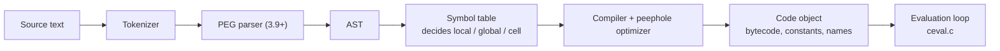
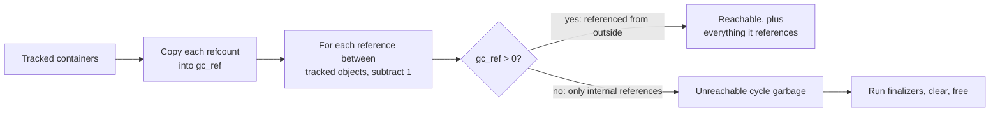
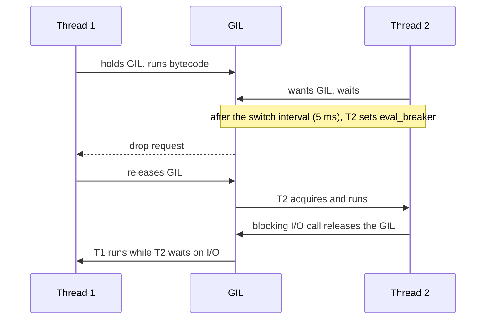

# 📘 CPython Internals and Performance

Senior Python interviews rarely stop at syntax.
They ask why Python is slow, what the GIL actually protects, how memory is freed, and what changed with free-threading and the JIT.
This page answers those from the CPython implementation, with version notes up to 3.14 and what is coming in 3.15.

## Table of Contents

1. [The Object Model](#1-the-object-model)
2. [From Source to Bytecode](#2-from-source-to-bytecode)
3. [The Specializing Interpreter and the JIT](#3-the-specializing-interpreter-and-the-jit)
4. [Reference Counting](#4-reference-counting)
5. [The Garbage Collector](#5-the-garbage-collector)
6. [Memory Allocation](#6-memory-allocation)
7. [Caching and Interning](#7-caching-and-interning)
8. [The GIL](#8-the-gil)
9. [Free-Threaded Python](#9-free-threaded-python)
10. [Subinterpreters](#10-subinterpreters)
11. [Why Python Is Slow and How to Make It Fast](#11-why-python-is-slow-and-how-to-make-it-fast)
12. [Profiling and Debugging Tools](#12-profiling-and-debugging-tools)
13. [Version Timeline](#13-version-timeline)
14. [Questions](#14-questions)

---

## 1. The Object Model

Every value in CPython is a heap-allocated C struct that starts with a `PyObject` header.

```text
PyObject (every object)          PyVarObject (list, tuple, int, str...)
+----------------------+         +----------------------+
| ob_refcnt            |         | ob_refcnt            |
| ob_type  ------------+--> type | ob_type              |
+----------------------+         | ob_size              |
| ...type-specific data|         | ...items / digits    |
+----------------------+         +----------------------+
```

- `ob_refcnt` counts references; when it hits 0 the object is freed.
- `ob_type` points to the type object, which holds the method table (`tp_hash`, `tp_call`, `tp_as_number`...).
- Even an `int` is a full object: on 64-bit CPython 3.14, `sys.getsizeof(1)` is 28 bytes.

This is the core reason Python is memory-hungry and slower than C: `a + b` must follow two pointers, check types, dispatch through a slot, and allocate a new result object.

---

## 2. From Source to Bytecode



Inspect every stage from Python:

```python
import ast, dis

print(ast.dump(ast.parse("x + 1"), indent=2))

def add(a, b):
    return a + b

dis.dis(add)
#   RESUME                 0
#   LOAD_FAST_BORROW_LOAD_FAST_BORROW (a, b)
#   BINARY_OP              0 (+)
#   RETURN_VALUE
```

- The VM is **stack-based**: instructions push and pop values on a per-frame evaluation stack.
- The symbol table decides at compile time whether each name is local (fast array slot), global (dict lookup), or a closure cell, which is why `UnboundLocalError` exists.
- Local variable access is an array index, while global and built-in access is a dict lookup, so hot loops are faster inside functions than at module level.

---

## 3. The Specializing Interpreter and the JIT

### 3.1 Specializing adaptive interpreter (3.11+, PEP 659)

After an instruction runs a few times, CPython **rewrites it in place** into a specialized version for the types it has seen, with a cheap guard that falls back if types change.

```python
def total(n):
    t = 0
    for i in range(n):
        t += i
    return t

total(1000); total(1000)
dis.dis(total, adaptive=True)
#   FOR_ITER_RANGE          (generic FOR_ITER specialized for range)
#   BINARY_OP_ADD_INT       (generic BINARY_OP specialized for int + int)
#   LOAD_GLOBAL_BUILTIN     (range, cached lookup)
```

This, plus cheaper frames and **zero-cost exceptions** (no setup cost for `try` when nothing is raised), made 3.11 about 25 percent faster on average than 3.10.
The practical lesson: code with **stable types** runs faster, because specializations stick.

### 3.2 The JIT (3.13+, PEP 744)

CPython has an experimental **copy-and-patch JIT**: hot traces of specialized bytecode are converted to micro-ops, optimized, and stitched together from precompiled machine code templates.

- 3.13: build-time option `--enable-experimental-jit`, off by default.
- 3.14: included in the official Windows and macOS installers, still off by default; enable with `PYTHON_JIT=1`.
- Gains so far are modest (single-digit percent on many benchmarks); it is foundation work for later releases.

For big speedups on pure Python loops today, **PyPy** (a tracing JIT) is still much faster, at the cost of slower C extension support.

---

## 4. Reference Counting

Every new reference increments `ob_refcnt`; every dropped reference decrements it.
At zero, the object is **freed immediately** and its `__del__` (if any) runs.

```python
import sys

x = []
sys.getrefcount(x)    # at least 2: the name x plus the temporary argument reference
y = x                 # +1
del y                 # -1 (del removes a NAME, not the object)
```

| Pros | Cons |
| --- | --- |
| Deterministic, immediate cleanup (files close when the last reference goes) | Every assignment touches memory, hurting caches and multi-core scaling |
| Simple, low pause times | **Cannot free reference cycles** |
| | Refcount updates are why the GIL existed |

**Immortal objects (3.12, PEP 683):** `None`, `True`, `False`, small ints, and some interned strings have a fixed, huge refcount that is never changed.
This avoids cache-line writes on the most shared objects and is a prerequisite for free-threading and subinterpreters.

### 4.1 Weak references

A weak reference does not increase the refcount, so it does not keep the object alive.

```python
import weakref

class Node: ...
n = Node()
r = weakref.ref(n)
del n
r()        # None, the object is gone
```

Use `weakref.WeakValueDictionary` for caches and observer lists that must not leak objects.

---

## 5. The Garbage Collector

Reference counting cannot free a cycle: `a.other = b; b.other = a` keeps both counts above zero forever.
The `gc` module adds a **cycle detector** that only tracks **container** objects (lists, dicts, instances, and so on; ints and strings cannot form cycles).



- **Generational:** most objects die young, so new objects are scanned often and survivors less often.
- **3.14 incremental GC:** there are now two generations, young and old, and the old generation is collected in increments alongside young collections, which cuts worst-case pause times on large heaps.
- Threshold: `gc.get_threshold()` returns `(2000, 10, 0)` on 3.14.
- Since 3.4 (PEP 442), cycles containing `__del__` methods are collected safely.

```python
import gc
gc.collect()          # force a full collection, returns number of unreachable objects
gc.disable()          # some servers disable or tune GC and collect at safe points
gc.freeze()           # move everything to a permanent generation before fork, to keep copy-on-write pages shared
```

**Memory leaks in Python** are usually not GC bugs but live references: growing global caches, unbounded `lru_cache`, closures or callbacks holding big objects, or tracebacks stored with their frames.
Diagnose with `tracemalloc`, `gc.get_referrers`, or tools like `memray`.

---

## 6. Memory Allocation

CPython has a layered allocator:

| Layer | Handles |
| --- | --- |
| Object-specific free lists | Reuse recently freed `float`, `tuple`, `list`, frame objects |
| **pymalloc** | Small objects of 512 bytes or less: **arenas** (1 MiB) split into **pools** (16 KiB) split into fixed-size **blocks** |
| System `malloc` | Anything larger |
| **mimalloc** | Used by the free-threaded build (thread-safe, per-thread heaps) |

Consequences you can observe:

- Freed small-object memory goes back to pymalloc, not always to the OS, so process RSS can stay high after a spike.
- Many small objects are expensive: a list of 1,000 ints costs about 8 KB of pointers **plus** 28 bytes per int object; `array.array("i", ...)` stores raw 4-byte values instead.
- `PYTHONMALLOC=malloc` switches to the system allocator, useful with Valgrind or AddressSanitizer.

---

## 7. Caching and Interning

| Optimization | Detail |
| --- | --- |
| **Small int cache** | Ints -5 to 256 are preallocated singletons |
| **String interning** | Identifier-like string constants and names are interned automatically; `sys.intern(s)` forces it |
| **Empty singletons** | `()`, `""`, `b""`, and `frozenset()` are shared |
| **Constant folding** | `24 * 60 * 60` becomes `86400` at compile time |

```python
a = 256; b = 256
a is b                          # True, cached
x = int("1000"); y = int("1000")
x is y                          # False, separate objects
```

Interning makes dict lookups on attribute names fast (pointer comparison first), and `sys.intern` can save memory when you hold millions of repeated strings.
None of this is a language guarantee, so **never use `is` to compare values**.

---

## 8. The GIL

The **Global Interpreter Lock** is a mutex in the standard CPython build that allows only **one thread to execute Python bytecode at a time** per interpreter.

**Why it exists:** reference counts and interpreter internals are not thread-safe; one big lock made the single-threaded case fast and C extensions easy to write.

**How threads take turns:**



- `sys.getswitchinterval()` is 0.005 seconds by default.
- The GIL is **released during blocking I/O** (`socket.recv`, file reads, `time.sleep`) and by many C extensions during heavy work (NumPy, hashlib on large inputs, zlib, most database drivers).

| Workload | Threads help? | Use instead |
| --- | --- | --- |
| I/O-bound (HTTP calls, DB queries) | **Yes**, GIL released while waiting | Threads or `asyncio` |
| CPU-bound pure Python | **No**, only one thread runs bytecode | `multiprocessing`, `ProcessPoolExecutor`, subinterpreters, free-threaded build, or native code |
| CPU-bound in NumPy or C extensions | Often yes | Threads, if the library releases the GIL |

**The GIL does not make your code thread-safe.**
It protects the interpreter's internals, not your invariants: `counter += 1` is several bytecodes, and a thread switch can happen between the load and the store.
Single operations on built-ins like `list.append` or `dict[key] = value` happen to be atomic in CPython, but compound read-modify-write logic still needs a `threading.Lock`.

---

## 9. Free-Threaded Python

PEP 703 makes the GIL optional through a separate build, usually installed as `python3.14t`.

| Release | Status |
| --- | --- |
| 3.13 (Oct 2024) | Experimental free-threaded build |
| 3.14 (Oct 2025) | **Officially supported** (PEP 779), still a separate opt-in build, not the default |
| Future | Default only after the ecosystem and performance are ready |

How it works without the GIL:

- **Biased reference counting:** the owning thread updates a local refcount without atomics; other threads use a shared atomic count.
- **Immortalization and deferred refcounting** for heavily shared objects like functions, code objects, and types.
- **Per-object locks** inside built-in containers so `list` and `dict` stay internally consistent.
- **mimalloc** allocator and a stop-the-world GC.

```bash
python3.14t -c "import sys; print(sys._is_gil_enabled())"   # False
PYTHON_GIL=1 python3.14t app.py                             # force the GIL back on
```

Trade-offs to mention:

- Single-threaded code is somewhat slower on the free-threaded build (roughly 5 to 10 percent on 3.14, down from much more on 3.13).
- C extensions must be rebuilt and declare support; importing one that does not re-enables the GIL with a warning.
- Your own code needs real locking now, because races that the GIL made rare become common.

---

## 10. Subinterpreters

A process can run several isolated interpreters, and since 3.12 (PEP 684) each can have **its own GIL**.
Python 3.14 exposes this in the standard library (PEP 734):

```python
from concurrent.futures import InterpreterPoolExecutor

with InterpreterPoolExecutor(max_workers=4) as pool:
    results = list(pool.map(cpu_heavy, chunks))
```

| | Threads | Subinterpreters | Processes |
| --- | --- | --- | --- |
| Parallel CPU (default build) | No | **Yes** | Yes |
| Shared memory | Everything | Nothing by default; data is copied or shared via special channels | Nothing by default |
| Startup cost | Tiny | Small | Largest |
| Isolation | None | Module state isolated | Full OS isolation |

---

## 11. Why Python Is Slow and How to Make It Fast

Why: dynamic typing forces type checks on every operation, every value is a boxed heap object, attribute and global lookups go through dicts, function calls build frames, and (in the default build) one thread runs bytecode at a time.

Optimization ladder, cheapest first:

1. **Measure first**: profile, do not guess.
2. **Better algorithm and data structure**: a `set` lookup instead of a list scan beats every micro-optimization.
3. **Push loops into C**: built-ins (`sum`, `min`, `sorted`, `str.join`, `collections.Counter`), comprehensions, and `itertools` run their loops in C.
4. **Avoid repeated work**: hoist invariants out of loops, cache with `functools.cache`, bind hot attribute lookups to locals in very tight loops.
5. **Vectorize** numeric work with NumPy, pandas, or Polars (see [NumPy and the Data Stack](/docs/python/numpy-and-data-stack)).
6. **Concurrency** that fits the workload (see [Concurrency and asyncio](/docs/python/concurrency-and-asyncio)).
7. **Compile**: Cython, mypyc, Numba for numeric loops, or a Rust extension via PyO3 and maturin.
8. **Different runtime**: PyPy for long-running pure Python.

```python
# slow: repeated string concatenation and a Python-level loop
out = ""
for w in words:
    out += w.upper() + " "

# fast: loop in C, one allocation for the result
out = " ".join(w.upper() for w in words)
```

---

## 12. Profiling and Debugging Tools

| Tool | Use |
| --- | --- |
| `python -m timeit "expr"` / `timeit` | Micro-benchmarks, repeated and warmed |
| `python -m cProfile -s cumtime app.py` | Deterministic function-level profile |
| `py-spy top --pid N`, `py-spy record` | Sampling profiler, attaches to a live process, flame graphs |
| `scalene` | CPU, memory, and GPU line-level profiling |
| `tracemalloc` | Where memory was allocated, snapshot diffs |
| `memray` | Native and Python allocation tracking, flame graphs |
| `faulthandler` | Dump tracebacks on segfaults or with `faulthandler.dump_traceback_later` for hangs |
| `python -X importtime` | Slow import analysis |
| `python -m pdb -p PID` (3.14) | Attach the debugger to a running process (PEP 768) |
| `breakpoint()` | Drop into pdb at a line |

```python
import tracemalloc
tracemalloc.start()
run_workload()
top = tracemalloc.take_snapshot().statistics("lineno")[:5]
for stat in top:
    print(stat)
```

---

## 13. Version Timeline

| Version | Released | Headline internals and language changes |
| --- | --- | --- |
| 3.8 | 2019 | Walrus `:=`, positional-only `/`, f-string `=` |
| 3.9 | 2020 | PEG parser, dict union, `list[int]` in annotations |
| 3.10 | 2021 | `match`, `X \| Y` unions, better error messages |
| 3.11 | 2022 | Specializing interpreter (about 25 percent faster), exception groups, `tomllib` |
| 3.12 | 2023 | PEP 695 generics syntax, f-string grammar (PEP 701), per-interpreter GIL, immortal objects, inlined comprehensions |
| 3.13 | 2024 | Experimental free-threading and JIT, new REPL, dead batteries removed (PEP 594) |
| 3.14 | 2025 | Free-threading supported, t-strings, deferred annotations (PEP 649), `concurrent.interpreters`, incremental GC, `compression.zstd`, remote debugger attach |
| 3.15 | Due October 2026 | Explicit lazy imports (PEP 810), UTF-8 mode by default (PEP 686), a sampling profiler in the stdlib |

Versions get about five years of support; 3.9 reached end of life in October 2025, so 3.10 is the oldest supported release.

---

## 14. Questions

**Q: What is the GIL and why does CPython have it?**
A lock allowing one thread to run bytecode at a time; it made reference counting and C extensions simple and single-threaded code fast.

**Q: Does the GIL make Python code thread-safe?**
No; it protects interpreter internals, but compound operations like `x += 1` can interleave, so shared state still needs locks.

**Q: How is memory managed in CPython?**
Reference counting frees most objects immediately, a generational (incremental since 3.14) cycle collector frees reference cycles, and pymalloc serves small allocations from pooled arenas.

**Q: Why can reference counting not handle cycles?**
Objects in a cycle reference each other, so their counts never reach zero even when nothing outside refers to them.

**Q: What is free-threaded Python?**
A CPython build without the GIL (experimental in 3.13, supported in 3.14) using biased reference counting, per-object locks, and mimalloc, trading some single-thread speed for true parallel threads.

**Q: Why is `a is b` True for 256 but maybe False for 1000?**
CPython caches ints from -5 to 256; larger ints are separate objects unless the compiler happened to share a constant.

**Q: What made Python 3.11 faster?**
The specializing adaptive interpreter, cheaper frames and function calls, and zero-cost exception handling.

**Q: Why is code faster inside a function than at module level?**
Locals are array slots accessed by index, while module-level names are dict lookups.

**Q: How would you find a memory leak in a Python service?**
Compare `tracemalloc` snapshots over time or use memray, then trace growing objects back with `gc.get_referrers`; common causes are unbounded caches and lingering references.
