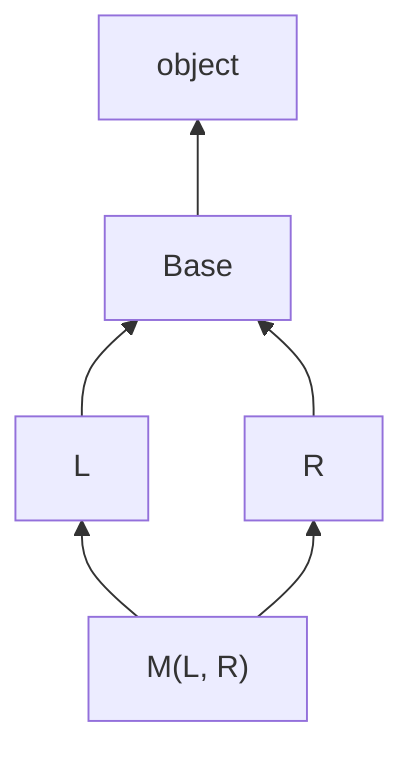
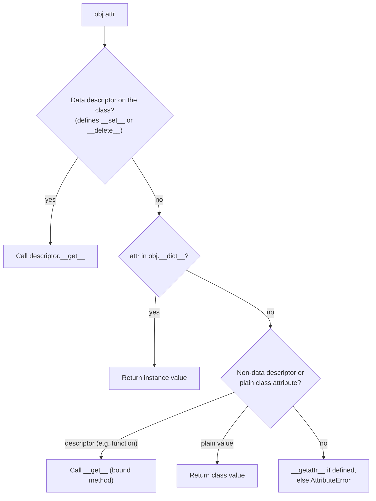

# 📘 OOP and the Data Model

Python OOP looks simple (no access modifiers, no interfaces keyword, no overloading) but the **data model** underneath is what makes `len(x)`, `x[i]`, `with x`, and `for a in x` work on your own classes.
This page covers classes the way interviewers probe them: attribute lookup, `super()` and the MRO, dunder methods, dataclasses, descriptors, and metaclasses.
For language-neutral principles see [OOPS](/docs/oops).

## Table of Contents

1. [Classes and Instances](#1-classes-and-instances)
2. [Class vs Instance Attributes](#2-class-vs-instance-attributes)
3. [Instance, Class, and Static Methods](#3-instance-class-and-static-methods)
4. [Encapsulation and Properties](#4-encapsulation-and-properties)
5. [Dunder Methods and the Data Model](#5-dunder-methods-and-the-data-model)
6. [Inheritance, super, and the MRO](#6-inheritance-super-and-the-mro)
7. [Abstract Base Classes and Protocols](#7-abstract-base-classes-and-protocols)
8. [Dataclasses](#8-dataclasses)
9. [slots](#9-slots)
10. [Descriptors and Attribute Lookup](#10-descriptors-and-attribute-lookup)
11. [Metaclasses and Class Creation](#11-metaclasses-and-class-creation)
12. [Enums](#12-enums)
13. [Design Patterns the Python Way](#13-design-patterns-the-python-way)
14. [Questions](#14-questions)

---

## 1. Classes and Instances

```python
class Account:
    bank = "Acme"                       # class attribute, shared

    def __init__(self, owner: str, balance: float = 0) -> None:
        self.owner = owner              # instance attributes
        self.balance = balance

    def deposit(self, amount: float) -> None:
        self.balance += amount

    def __repr__(self) -> str:
        return f"Account({self.owner!r}, {self.balance})"

acct = Account("ana")
acct.deposit(10)                        # same as Account.deposit(acct, 10)
```

- `self` is not a keyword; it is the explicit first parameter that receives the instance.
- `__init__` **initializes** an already-created object; `__new__` **creates** it.
- Instances store attributes in a per-object `__dict__` (unless `__slots__` is used).

### 1.1 `__new__` vs `__init__`

| | `__new__(cls, ...)` | `__init__(self, ...)` |
| --- | --- | --- |
| Kind | Static method (implicitly) | Instance method |
| Job | Allocate and return the instance | Set up the instance |
| Returns | The new object | Must return `None` |
| Override when | Subclassing immutables (`int`, `str`, `tuple`), singletons, caching instances | Almost always |

```python
class Celsius(float):
    def __new__(cls, value):
        if value < -273.15:
            raise ValueError("below absolute zero")
        return super().__new__(cls, value)
```

---

## 2. Class vs Instance Attributes

Attribute lookup on an instance checks the instance `__dict__` first, then the class, then its bases along the MRO.
Assignment through an instance always writes to the **instance**.

```python
class Team:
    members = []                 # BUG: one list shared by every instance

a, b = Team(), Team()
a.members.append("x")
b.members                        # ['x']

class Team:
    def __init__(self):
        self.members = []        # fix: per-instance
```

Class attributes are fine for constants and counters accessed through the class (`Team.count += 1`).

---

## 3. Instance, Class, and Static Methods

| | Instance method | `@classmethod` | `@staticmethod` |
| --- | --- | --- | --- |
| First argument | `self` | `cls` | none |
| Can access | Instance and class | Class (and subclass) | Only its arguments |
| Typical use | Behavior | **Alternative constructors**, factory methods | Utility that belongs in the namespace |

```python
from datetime import date

class Person:
    def __init__(self, name: str, born: int) -> None:
        self.name, self.born = name, born

    @classmethod
    def from_string(cls, s: str) -> "Person":     # works for subclasses too
        name, year = s.split(",")
        return cls(name, int(year))

    @staticmethod
    def is_adult(age: int) -> bool:
        return age >= 18
```

---

## 4. Encapsulation and Properties

Python has **no private members**, only conventions:

| Name | Meaning |
| --- | --- |
| `name` | Public |
| `_name` | "Internal, do not touch"; skipped by `from m import *` |
| `__name` | **Name mangling** to `_ClassName__name`, to avoid clashes in subclasses, not for security |
| `__name__` | Reserved for the language (dunder) |

```python
class Q:
    def __init__(self): self.__secret = 1

Q().__dict__        # {'_Q__secret': 1}
```

### 4.1 `@property`

Start with a plain attribute.
When you later need validation or computation, turn it into a property without changing callers.
This is why Python code does not need Java-style getters and setters.

```python
class Temperature:
    def __init__(self, celsius: float) -> None:
        self.celsius = celsius            # goes through the setter

    @property
    def celsius(self) -> float:
        return self._celsius

    @celsius.setter
    def celsius(self, value: float) -> None:
        if value < -273.15:
            raise ValueError("below absolute zero")
        self._celsius = value

    @property
    def fahrenheit(self) -> float:        # read-only, computed
        return self._celsius * 9 / 5 + 32
```

---

## 5. Dunder Methods and the Data Model

Built-in functions and operators call "dunder" (double underscore) methods on the type.
Implementing them makes your class behave like a built-in.

| You write | Python calls |
| --- | --- |
| `repr(x)`, REPL display | `__repr__` (unambiguous, for developers) |
| `str(x)`, `print(x)`, f-strings | `__str__` (falls back to `__repr__`) |
| `x == y`, `x < y` | `__eq__`, `__lt__` (return `NotImplemented` for unknown types) |
| `hash(x)`, dict key | `__hash__` |
| `bool(x)` | `__bool__`, else `__len__` |
| `len(x)` | `__len__` |
| `x[k]`, `x[k] = v`, `del x[k]` | `__getitem__`, `__setitem__`, `__delitem__` |
| `k in x` | `__contains__`, else iterates |
| `for a in x` | `__iter__`, else `__getitem__` with 0, 1, 2... |
| `x + y` | `x.__add__(y)`, then `y.__radd__(x)` if that returns `NotImplemented` |
| `x += y` | `__iadd__`, else falls back to `__add__` and rebinds |
| `x(...)` | `__call__` |
| `with x` | `__enter__`, `__exit__` |
| `x.attr` missing | `__getattr__` (only called when normal lookup fails) |
| every `x.attr` | `__getattribute__` (rarely overridden) |

```python
class Vector:
    def __init__(self, x: float, y: float) -> None:
        self.x, self.y = x, y

    def __repr__(self) -> str:
        return f"Vector({self.x}, {self.y})"

    def __eq__(self, other: object) -> bool:
        if not isinstance(other, Vector):
            return NotImplemented
        return (self.x, self.y) == (other.x, other.y)

    def __hash__(self) -> int:
        return hash((self.x, self.y))

    def __add__(self, other: "Vector") -> "Vector":
        return Vector(self.x + other.x, self.y + other.y)

    def __radd__(self, other):            # lets sum([...]) start from 0
        return self if other == 0 else self + other

    def __abs__(self) -> float:
        return (self.x ** 2 + self.y ** 2) ** 0.5

    def __bool__(self) -> bool:
        return bool(abs(self))
```

### 5.1 The `__eq__` and `__hash__` rule

If you define `__eq__` without `__hash__`, Python sets `__hash__ = None`, making instances **unhashable**.
That is deliberate: default hashing is by identity, which would break the rule "equal objects must have equal hashes".
Only hash immutable state; if a hashed field changes after insertion, the object gets lost inside dicts and sets.

### 5.2 `__repr__` vs `__str__`

`__repr__` should be unambiguous and ideally valid Python that recreates the object.
`__str__` is the readable form for end users.
Always write `__repr__`; add `__str__` only if a different user-facing form is needed.

---

## 6. Inheritance, super, and the MRO

```python
class Animal:
    def __init__(self, name: str) -> None:
        self.name = name

    def speak(self) -> str:
        raise NotImplementedError

class Dog(Animal):
    def __init__(self, name: str, breed: str) -> None:
        super().__init__(name)
        self.breed = breed

    def speak(self) -> str:
        return "Woof"
```

Python supports **multiple inheritance**.
The **Method Resolution Order** (MRO) is computed with the **C3 linearization** algorithm: children before parents, and the left-to-right order of bases is preserved.

```python
class Base:
    def __init__(self): print("Base"); super().__init__()
class L(Base):
    def __init__(self): print("L"); super().__init__()
class R(Base):
    def __init__(self): print("R"); super().__init__()
class M(L, R):
    def __init__(self): print("M"); super().__init__()

M()                    # prints M, L, R, Base
M.__mro__              # (M, L, R, Base, object)
```



**`super()` means "next class in the MRO of the instance", not "my parent".**
In the example, `L`'s `super()` calls `R`, a class `L` knows nothing about.
This is **cooperative multiple inheritance**: every class in the chain must call `super()` and accept `**kwargs` it does not use, so arguments flow through.

If C3 cannot find a consistent order, class creation fails:

```python
class X: pass
class Y(X): pass
class Z(X, Y): pass    # TypeError: Cannot create a consistent method resolution order
```

### 6.1 Mixins

A mixin is a small class that adds one behavior and is not meant to stand alone.

```python
class JsonMixin:
    def to_json(self) -> str:
        return json.dumps(self.__dict__)

class User(JsonMixin, BaseModel): ...
```

Put mixins **left** of the main base so their methods win in the MRO.

### 6.2 `isinstance` vs `type`

`isinstance(x, Base)` respects inheritance and ABC registration; `type(x) is Base` does not.
Prefer `isinstance`, and prefer duck typing over either when you can.

---

## 7. Abstract Base Classes and Protocols

### 7.1 ABCs: nominal typing

```python
from abc import ABC, abstractmethod

class Shape(ABC):
    @abstractmethod
    def area(self) -> float: ...

    def describe(self) -> str:                 # concrete methods are allowed
        return f"{type(self).__name__} with area {self.area():.2f}"

Shape()    # TypeError: Can't instantiate abstract class Shape without an implementation for abstract method 'area'
```

`collections.abc` provides ABCs like `Iterable`, `Sequence`, `Mapping`, and `MutableMapping`.
Subclassing `MutableMapping` and implementing five methods gives you `get`, `pop`, `update`, `items`, and the rest for free.

### 7.2 Protocols: structural typing

`typing.Protocol` (3.8+) describes what an object must **have**, not what it must **inherit**.
It is static duck typing: any class with matching methods satisfies the protocol.

```python
from typing import Protocol, runtime_checkable

@runtime_checkable
class SupportsClose(Protocol):
    def close(self) -> None: ...

def shutdown(resources: list[SupportsClose]) -> None:
    for r in resources:
        r.close()

isinstance(open("f.txt"), SupportsClose)   # True, checks method names only
```

| | ABC | Protocol |
| --- | --- | --- |
| Relationship | Must inherit (or `register`) | Structural match |
| Checked | At instantiation (missing abstract methods) | By type checkers; at runtime only with `@runtime_checkable` |
| Best for | Your own class hierarchies with shared code | Accepting third-party objects, dependency injection |

---

## 8. Dataclasses

`@dataclass` generates `__init__`, `__repr__`, and `__eq__` from annotated fields.

```python
from dataclasses import dataclass, field, asdict, replace

@dataclass(frozen=True, slots=True, order=True)
class Point:
    x: int
    y: int = 0
    tags: list[str] = field(default_factory=list, compare=False)

    def __post_init__(self) -> None:          # validation after __init__
        if self.x < 0:
            raise ValueError("x must be >= 0")

p = Point(1)
p                        # Point(x=1, y=0, tags=[])
p < Point(2)             # True (order=True compares field tuples)
replace(p, y=5)          # new instance
asdict(p)                # {'x': 1, 'y': 0, 'tags': []}
p.x = 3                  # FrozenInstanceError
```

| Option | Effect |
| --- | --- |
| `frozen=True` | Immutable and hashable |
| `slots=True` (3.10) | Generates `__slots__`: less memory, faster access |
| `kw_only=True` (3.10) | All fields keyword-only |
| `order=True` | Generate `<`, `<=`, `>`, `>=` |
| `field(default_factory=list)` | Mutable defaults (a bare `[]` default raises `ValueError`) |
| `field(repr=False, compare=False)` | Exclude from repr or comparisons |

| Choose | When |
| --- | --- |
| `dataclass` | Plain data holders in your own code |
| `NamedTuple` | Immutable records that should also behave like tuples |
| `TypedDict` | Typing dict-shaped data such as JSON |
| **Pydantic** / `attrs` | Validation and parsing of untrusted input (APIs, config) |

---

## 9. slots

By default every instance has a `__dict__`.
`__slots__` replaces it with fixed storage for the listed attributes.

```python
class Pixel:
    __slots__ = ("x", "y", "color")

    def __init__(self, x, y, color):
        self.x, self.y, self.color = x, y, color

p = Pixel(1, 2, "red")
p.alpha = 1       # AttributeError: 'Pixel' object has no attribute 'alpha' and no __dict__ ...
```

- **Pros:** noticeably less memory per instance (matters for millions of objects), slightly faster attribute access, typos raise errors.
- **Cons:** no dynamic attributes, subclasses need their own `__slots__` to keep the benefit, and multiple inheritance with slotted bases is restricted.

---

## 10. Descriptors and Attribute Lookup

A **descriptor** is any object defining `__get__`, `__set__`, or `__delete__`, stored as a **class** attribute.
`property`, `classmethod`, `staticmethod`, `__slots__` members, and even plain functions (which become bound methods) are descriptors.

```python
class Positive:
    def __set_name__(self, owner, name):       # 3.6+: learns its attribute name
        self.private = "_" + name

    def __get__(self, obj, objtype=None):
        if obj is None:
            return self                         # accessed on the class
        return getattr(obj, self.private)

    def __set__(self, obj, value):
        if value < 0:
            raise ValueError("must be positive")
        setattr(obj, self.private, value)

class Order:
    qty = Positive()
    price = Positive()

    def __init__(self, qty, price):
        self.qty, self.price = qty, price       # both validated
```

### 10.1 Attribute lookup order for `obj.attr`



That ordering explains why a `property` (data descriptor) cannot be shadowed by an instance attribute, but a method (non-data descriptor) can, and why `cached_property` works by writing into the instance `__dict__`.

---

## 11. Metaclasses and Class Creation

Classes are objects too, and their type is `type`.

```python
type(42)        # <class 'int'>
type(int)       # <class 'type'>
type(type)      # <class 'type'>

Dog = type("Dog", (Animal,), {"speak": lambda self: "Woof"})   # a class built at runtime
```

A **metaclass** is the class of a class; it controls how the class object is created.
Frameworks use them (Django models, older ORMs, `enum.Enum`, `abc.ABCMeta`), but you rarely need one.

Simpler hooks cover most needs:

| Hook | Use |
| --- | --- |
| Class decorator | Modify or register a class after creation |
| `__init_subclass__` (3.6) | Run code whenever a subclass is defined (plugin registries, validation) |
| `__set_name__` | Let descriptors learn their attribute name |
| `__class_getitem__` | Support `MyClass[int]` generic syntax |

```python
class Plugin:
    registry: dict[str, type] = {}

    def __init_subclass__(cls, /, name: str = "", **kwargs):
        super().__init_subclass__(**kwargs)
        Plugin.registry[name or cls.__name__] = cls

class CsvExporter(Plugin, name="csv"): ...

Plugin.registry     # {'csv': <class 'CsvExporter'>}
```

> "Metaclasses are deeper magic than 99% of users should ever worry about."
> Tim Peters

---

## 12. Enums

```python
from enum import Enum, IntEnum, StrEnum, Flag, auto

class Status(Enum):
    ACTIVE = "active"
    BANNED = "banned"

Status("active")          # Status.ACTIVE, lookup by value
Status["ACTIVE"]          # lookup by name
Status.ACTIVE.value       # 'active'

class Color(StrEnum):     # 3.11+: members are real strings
    RED = auto()          # 'red'

Color.RED == "red"        # True

class Perm(Flag):
    READ = auto(); WRITE = auto(); EXEC = auto()

rw = Perm.READ | Perm.WRITE
Perm.WRITE in rw          # True
```

Members are singletons, so compare with `is` or `==`.
Enums work well with `match`: `case Status.ACTIVE:` compares by value because it is a dotted name.

---

## 13. Design Patterns the Python Way

Many classic patterns shrink in Python because functions and modules are first-class.

| Pattern | Python idiom |
| --- | --- |
| **Singleton** | A module-level instance (modules are imported once) |
| **Strategy** | Pass a function, or a dict of functions |
| **Factory** | `@classmethod` constructors or a registry via `__init_subclass__` |
| **Decorator** | `@decorator` functions, or wrapping objects with `__getattr__` delegation |
| **Iterator** | Generators |
| **Observer** | A list of callbacks |
| **Command** | Callables, `functools.partial` |
| **Template method** | ABC with abstract hooks |
| **Context / resource management** | Context managers |

See [LLD](/docs/system-design/lld) for full design exercises.

---

## 14. Questions

**Q: `__new__` vs `__init__`?**
`__new__` creates and returns the instance and is needed for subclassing immutables or controlling instance creation; `__init__` initializes the already-created instance.

**Q: How does `super()` work with multiple inheritance?**
It calls the next class in the instance's MRO (computed by C3 linearization), which enables cooperative calls through every class exactly once.

**Q: What is the MRO of a diamond?**
`D(B, C)` with `B(A)` and `C(A)` gives `D, B, C, A, object`.

**Q: Does Python have private variables?**
No; `_name` is a convention and `__name` triggers name mangling to avoid subclass clashes, but both remain accessible.

**Q: Why does defining `__eq__` make my object unhashable?**
Python sets `__hash__` to `None` so equal objects cannot end up with different identity-based hashes; define `__hash__` from the same immutable fields.

**Q: ABC vs Protocol?**
ABCs require inheritance and enforce abstract methods at instantiation; Protocols are structural and check shape, mainly for static type checkers.

**Q: What does `@dataclass` generate, and what does `frozen=True` add?**
`__init__`, `__repr__`, and `__eq__`; `frozen=True` blocks attribute assignment and adds `__hash__`.

**Q: What are `__slots__` for?**
They remove the per-instance `__dict__`, saving memory and preventing new attributes.

**Q: What is a descriptor?**
An object with `__get__`, `__set__`, or `__delete__` stored on a class that customizes attribute access; `property` and methods are descriptors.

**Q: What is a metaclass and when would you use one?**
The class of a class, controlling class creation; prefer class decorators or `__init_subclass__`, and reserve metaclasses for framework-level needs.

**Q: `classmethod` vs `staticmethod`?**
A classmethod receives the class and suits alternative constructors that also work for subclasses; a staticmethod receives nothing implicit.
