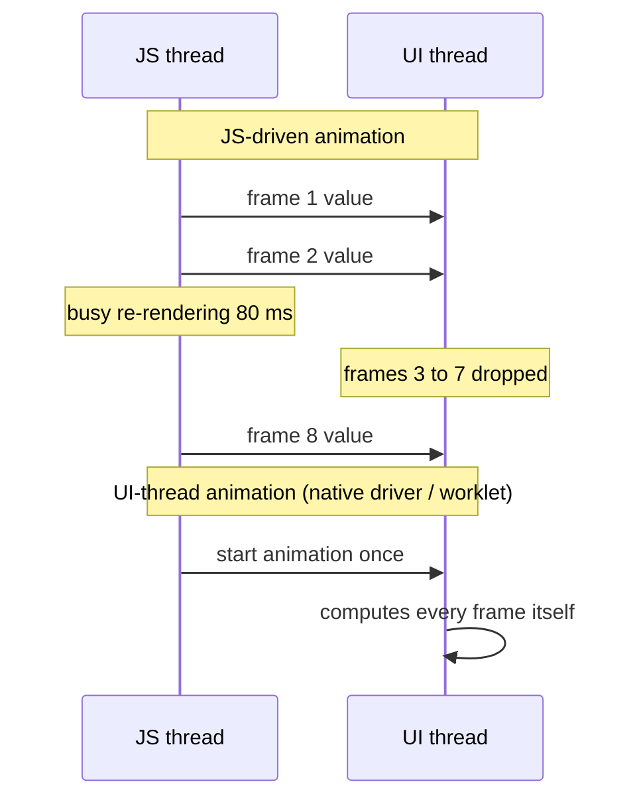
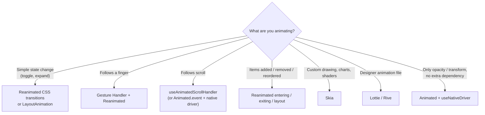

# 📘 Animations and Gestures

Smooth motion is where RN apps either feel native or feel like a web view.
The rule behind everything on this page: **an animation frame must not wait for the JS thread**.
If each frame needs JS to compute a value and send it to native, any busy moment on the JS thread (a re-render, JSON parsing, a network response) drops frames.
So production animations run on the **UI thread**, using the native driver or Reanimated worklets.

## Table of Contents

1. [Why Animations Jank](#1-why-animations-jank)
2. [Animated API](#2-animated-api)
3. [The Native Driver](#3-the-native-driver)
4. [LayoutAnimation](#4-layoutanimation)
5. [Reanimated](#5-reanimated)
6. [Gesture Handler](#6-gesture-handler)
7. [Gestures plus Reanimated](#7-gestures-plus-reanimated)
8. [Scroll-Driven Animations](#8-scroll-driven-animations)
9. [Layout, Entering, and Exiting Animations](#9-layout-entering-and-exiting-animations)
10. [Skia, Lottie, and Other Tools](#10-skia-lottie-and-other-tools)
11. [Choosing a Tool](#11-choosing-a-tool)
12. [Debugging Janky Motion](#12-debugging-janky-motion)
13. [Questions](#13-questions)

---

## 1. Why Animations Jank



- Frame budget: 16.7 ms at 60 Hz, 8.3 ms at 120 Hz.
- JS-driven animations (`setState` per frame, or `Animated` without the native driver) depend on the JS thread being free every frame.
- UI-thread animations keep running even while JS is blocked.
- Gesture-driven motion (dragging, swiping) has the same problem: if the touch event goes to JS and back, the view lags behind the finger.

---

## 2. Animated API

`Animated` ships with React Native.

```tsx
import { Animated, Easing } from 'react-native';

function FadeIn({ children }) {
  const opacity = useRef(new Animated.Value(0)).current;

  useEffect(() => {
    Animated.timing(opacity, {
      toValue: 1,
      duration: 300,
      easing: Easing.out(Easing.cubic),
      useNativeDriver: true,
    }).start();
  }, [opacity]);

  return <Animated.View style={{ opacity }}>{children}</Animated.View>;
}
```

| API | Use |
| --- | --- |
| `Animated.timing` | Duration plus easing |
| `Animated.spring` | Physics-based, natural feel |
| `Animated.decay` | Momentum (fling) |
| `parallel`, `sequence`, `stagger`, `loop` | Compose animations |
| `value.interpolate({ inputRange, outputRange })` | Map one value to another (scroll offset to header height) |
| `Animated.event` | Bind scroll or gesture values directly to an animated value |

---

## 3. The Native Driver

`useNativeDriver: true` sends the whole animation description to native once, and native computes every frame.

- Works only for **non-layout properties**: `opacity` and `transform` (translate, scale, rotate).
- Does **not** work for `width`, `height`, `top`, `margin`, `flex`, or most colors, because those require layout.
- Animate size changes with `transform: scale` or Reanimated layout animations instead of animating `height` directly.
- With `Animated.event` and `useNativeDriver: true`, scroll-linked effects run fully natively:

```tsx
const scrollY = useRef(new Animated.Value(0)).current;

<Animated.ScrollView
  onScroll={Animated.event([{ nativeEvent: { contentOffset: { y: scrollY } } }], { useNativeDriver: true })}
  scrollEventThrottle={16}
/>

const headerTranslate = scrollY.interpolate({ inputRange: [0, 100], outputRange: [0, -100], extrapolate: 'clamp' });
```

---

## 4. LayoutAnimation

```tsx
import { LayoutAnimation } from 'react-native';

function toggle() {
  LayoutAnimation.configureNext(LayoutAnimation.Presets.easeInEaseOut);
  setExpanded((e) => !e);        // the next layout change animates automatically
}
```

- Animates the **next layout pass** natively: views that move, resize, appear, or disappear.
- Zero setup and runs natively, good for accordions and list insertions.
- Little control: it applies to everything that changes in that commit, and cannot be interrupted or driven by gestures.

---

## 5. Reanimated

**React Native Reanimated** is the standard animation library.
Its core idea: write animation logic in JavaScript functions called **worklets** that run on the UI thread.

```tsx
import Animated, {
  useSharedValue,
  useAnimatedStyle,
  withSpring,
  withTiming,
  interpolate,
} from 'react-native-reanimated';

function Card() {
  const pressed = useSharedValue(0);

  const style = useAnimatedStyle(() => ({            // runs on the UI thread
    transform: [{ scale: interpolate(pressed.value, [0, 1], [1, 0.96]) }],
    opacity: withTiming(pressed.value ? 0.8 : 1),
  }));

  return (
    <Pressable
      onPressIn={() => (pressed.value = withSpring(1))}
      onPressOut={() => (pressed.value = withSpring(0))}
    >
      <Animated.View style={[styles.card, style]} />
    </Pressable>
  );
}
```

| Concept | Meaning |
| --- | --- |
| **Shared value** (`useSharedValue`) | A value readable and writable from both JS and UI threads; changing `.value` does **not** re-render React |
| **Worklet** | A function the Babel plugin copies to the UI runtime (marked with `'worklet'` or inferred inside Reanimated hooks) |
| `useAnimatedStyle` | Worklet that maps shared values to styles, re-evaluated on the UI thread when they change |
| `useDerivedValue` | Computed shared value |
| `withTiming`, `withSpring`, `withDecay`, `withSequence`, `withRepeat`, `withDelay` | Animation builders |
| `runOnJS(fn)` / `scheduleOnRN` | Call back into the JS thread from a worklet (update React state, navigate) |
| `runOnUI(fn)` / `scheduleOnUI` | Run a worklet on the UI thread from JS |
| `useAnimatedReaction` | React to shared value changes on the UI thread |

Important behaviors:

- Reanimated can animate **layout properties** (width, height, margins) as well, because it updates them directly through Fabric on the UI thread.
- Reading `.value` on the JS thread during render is a sync cross-thread read: avoid it in render; read in callbacks.
- Worklets capture variables from the closure by **copying** them to the UI runtime; captured React state is a snapshot, not live.
- **Reanimated 4** requires the New Architecture, moved the worklet runtime into a separate `react-native-worklets` package, and added **CSS-style animations and transitions**:

```tsx
<Animated.View
  style={{
    width: expanded ? 240 : 120,
    transitionProperty: 'width',
    transitionDuration: 300,
    transitionTimingFunction: 'ease-in-out',
  }}
/>
```

CSS-style transitions are ideal for simple state-driven changes; shared values and worklets remain the tool for gesture and scroll-driven motion.

---

## 6. Gesture Handler

**React Native Gesture Handler** recognizes gestures natively on the UI thread, using the platform gesture systems.

```tsx
import { Gesture, GestureDetector, GestureHandlerRootView } from 'react-native-gesture-handler';

// Wrap the app once at the root.
<GestureHandlerRootView style={{ flex: 1 }}>
  <App />
</GestureHandlerRootView>
```

| Gesture | Use |
| --- | --- |
| `Gesture.Tap()` | Taps, double taps (`numberOfTaps(2)`) |
| `Gesture.Pan()` | Dragging, swiping, bottom sheets |
| `Gesture.Pinch()`, `Gesture.Rotation()` | Zoom and rotate images |
| `Gesture.LongPress()` | Context actions |
| `Gesture.Fling()` | Quick directional swipe |
| `Gesture.Simultaneous`, `Exclusive`, `Race` | Compose gestures (pinch and pan together, double tap before single tap) |

Why not the built-in `PanResponder`: it runs on the JS thread, so it lags under load and cannot coordinate with native scroll views as well.

---

## 7. Gestures plus Reanimated

The standard "drag a card" example, fully on the UI thread:

```tsx
function DraggableCard() {
  const x = useSharedValue(0);
  const y = useSharedValue(0);
  const start = useSharedValue({ x: 0, y: 0 });

  const pan = Gesture.Pan()
    .onBegin(() => {
      start.value = { x: x.value, y: y.value };
    })
    .onUpdate((e) => {
      x.value = start.value.x + e.translationX;     // follows the finger with zero JS involvement
      y.value = start.value.y + e.translationY;
    })
    .onEnd((e) => {
      if (Math.abs(e.velocityX) > 800) {
        x.value = withDecay({ velocity: e.velocityX });
        runOnJS(onDismiss)();                         // back to React for state changes
      } else {
        x.value = withSpring(0);
        y.value = withSpring(0);
      }
    });

  const style = useAnimatedStyle(() => ({
    transform: [{ translateX: x.value }, { translateY: y.value }],
  }));

  return (
    <GestureDetector gesture={pan}>
      <Animated.View style={[styles.card, style]} />
    </GestureDetector>
  );
}
```

- Gesture callbacks are worklets when Reanimated is installed, so the view tracks the finger even if JS is frozen.
- Use **velocity** at release to decide between snapping back and completing (swipe to dismiss, bottom sheet snap points).
- Springs carry the gesture velocity, which makes motion feel physically continuous.

---

## 8. Scroll-Driven Animations

```tsx
const scrollY = useSharedValue(0);
const onScroll = useAnimatedScrollHandler((e) => {
  scrollY.value = e.contentOffset.y;
});

const headerStyle = useAnimatedStyle(() => ({
  height: interpolate(scrollY.value, [0, 120], [200, 80], Extrapolation.CLAMP),
  opacity: interpolate(scrollY.value, [0, 120], [1, 0.9], Extrapolation.CLAMP),
}));

<Animated.FlatList onScroll={onScroll} scrollEventThrottle={16} ... />
```

- Collapsing headers, parallax images, sticky tabs, and progress bars all follow this pattern.
- `useScrollViewOffset` and `useAnimatedRef` plus `scrollTo` let worklets read and drive scroll positions.

---

## 9. Layout, Entering, and Exiting Animations

```tsx
import Animated, { FadeIn, FadeOut, LinearTransition } from 'react-native-reanimated';

{items.map((item) => (
  <Animated.View
    key={item.id}
    entering={FadeIn.duration(200)}
    exiting={FadeOut}
    layout={LinearTransition.springify()}       // siblings slide into new positions
  >
    <Row item={item} />
  </Animated.View>
))}
```

- `entering` and `exiting` animate mount and unmount (React normally removes a view instantly).
- `layout` animates position and size changes caused by layout updates.
- **Shared element transitions** (an image flying from a list into a detail screen) are available in Reanimated, behind a feature flag in recent versions, and through native stack integrations.

---

## 10. Skia, Lottie, and Other Tools

| Tool | Use |
| --- | --- |
| **React Native Skia** (`@shopify/react-native-skia`) | 2D drawing with Google's Skia: charts, custom shapes, shaders, blur, image filters; animates with Reanimated shared values |
| **Lottie** (`lottie-react-native`) | Designer-made After Effects animations exported as JSON (onboarding, success states) |
| **Rive** | Interactive, state-machine driven vector animations |
| `react-native-svg` | Static or animated SVG, simpler than Skia for icons and basic charts |
| Moti | Declarative, Framer Motion style API on top of Reanimated |
| Haptics (`expo-haptics`) | Pair motion with tactile feedback on key interactions |

---

## 11. Choosing a Tool



---

## 12. Debugging Janky Motion

| Symptom | Likely cause | Fix |
| --- | --- | --- |
| Animation stutters when data loads | JS-driven animation competing with renders | Native driver or Reanimated |
| Dragged view lags behind the finger | Gesture events processed on JS (`PanResponder`) | Gesture Handler with worklet callbacks |
| Smooth in release, janky in dev | Dev mode overhead | Always judge performance in release builds |
| Smooth on iPhone, janky on Android | Overdraw, heavy shadows, large images, too many views | Flatten views, reduce shadows and transparency, resize images |
| Reanimated animation re-renders component | Using React state per frame | Keep per-frame values in shared values |
| Animated `height` is slow | Layout on every frame | Use `transform: scale`, or Reanimated layout animations |

Use the performance monitor overlay (UI and JS FPS) in the dev menu and the platform profilers (Xcode Instruments, Android Studio profiler, Perfetto) to confirm which thread is dropping frames.

---

## 13. Questions

**Q: Why should animations use the native driver or Reanimated?**
They compute frames on the UI thread, so animations stay smooth even when the JS thread is busy with renders or data processing.

**Q: What can the Animated native driver not animate?**
Layout properties like width, height, padding, margins, and positions.
It supports opacity and transforms (and a few others), because those do not require relayout.

**Q: What is a worklet?**
A JavaScript function that Reanimated's Babel plugin extracts and runs on a separate UI-thread JS runtime, so it can read and write shared values every frame without the JS thread.

**Q: How does a shared value differ from React state?**
Changing a shared value updates animated styles on the UI thread without re-rendering the component; React state changes trigger a render on the JS thread.

**Q: How would you build swipe-to-delete?**
A pan gesture from Gesture Handler updates a `translateX` shared value; on release, check translation and velocity, then either spring back or animate off-screen with `withTiming` and call `runOnJS` to remove the item, with a layout animation so the rows below slide up.

**Q: How do you build a collapsing header?**
Track scroll offset in a shared value with `useAnimatedScrollHandler`, then interpolate header height, opacity, and title scale in `useAnimatedStyle` with clamping.
