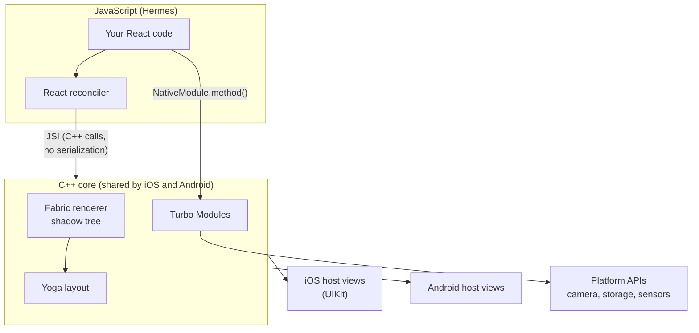
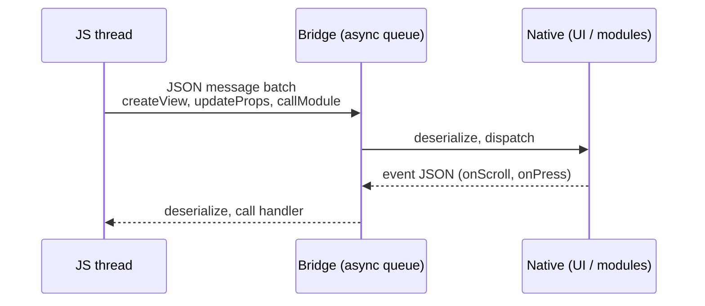
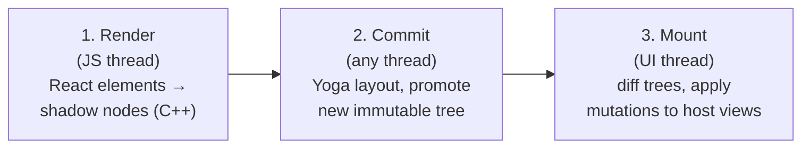
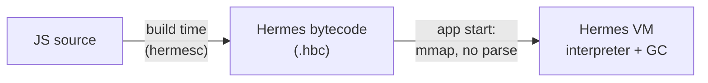
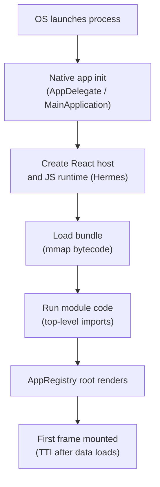

# 📘 Architecture and Internals

"Explain the React Native architecture" is the most common mid and senior RN interview question.
A strong answer covers the threads, what the old bridge did and why it was slow, what JSI, Fabric, and Turbo Modules replaced it with, and what that means for real apps.
The New Architecture has been the default since React Native 0.76 (October 2024), and since 0.82 it is the **only** architecture: the legacy bridge can no longer be enabled.
You still need to know the bridge, because interviewers use it to check whether you understand why the new design exists.

## Table of Contents

1. [The Big Picture](#1-the-big-picture)
2. [Threads](#2-threads)
3. [The Legacy Bridge](#3-the-legacy-bridge)
4. [The New Architecture](#4-the-new-architecture)
5. [JSI](#5-jsi)
6. [Fabric: The Renderer](#6-fabric-the-renderer)
7. [Turbo Modules and Codegen](#7-turbo-modules-and-codegen)
8. [Bridgeless Mode](#8-bridgeless-mode)
9. [Yoga Layout](#9-yoga-layout)
10. [Hermes](#10-hermes)
11. [App Startup](#11-app-startup)
12. [Concurrent React on Mobile](#12-concurrent-react-on-mobile)
13. [Old vs New Summary](#13-old-vs-new-summary)
14. [Questions](#14-questions)

---

## 1. The Big Picture



Three layers:

1. **JavaScript:** your app, React, and libraries, running in Hermes.
2. **C++ core:** the renderer (Fabric), layout (Yoga), and module system, shared across platforms.
3. **Platform:** UIKit views and Objective-C / Swift on iOS, Android views and Java / Kotlin on Android.

---

## 2. Threads

| Thread | Runs | Blocked means |
| --- | --- | --- |
| **UI (main) thread** | Native view creation and updates, touch handling, native animations, scrolling | The whole app freezes, including native scrolling |
| **JS thread** | Your React code, reconciliation, event handlers, business logic | Taps and JS-driven updates lag, but native scroll still works |
| **Background threads** | Layout (Yoga) and shadow tree work in Fabric, native module work, image decoding | Usually invisible, can delay commits |

- At 60 Hz each frame has about **16.7 ms**; at 120 Hz (ProMotion and many Android phones) about **8.3 ms**.
- A JS task longer than one frame drops frames for anything JS drives (JS animations, responses to taps).
- That is why animations should run on the UI thread (native driver or Reanimated worklets) and why heavy computation belongs in native code or off the critical path.

---

## 3. The Legacy Bridge



How it worked (RN before the New Architecture):

- JS and native could only communicate by **serializing messages to JSON** and sending them asynchronously over a queue.
- Every native module was **initialized eagerly at startup**, even modules the user never touched.
- Layout ran on a separate "shadow" thread, and UI updates were batched and sent across the bridge.

Problems:

| Problem | Effect |
| --- | --- |
| Serialization cost | Large payloads (lists, images metadata, scroll events) cost real CPU |
| Async only | JS could not synchronously read a value (layout measurements, a stored setting) |
| Bridge congestion | Fast scroll events plus JS updates flooded the queue: blank cells, laggy gestures |
| Eager module init | Slower startup in apps with many modules |
| No type safety | JS and native contracts drifted; mismatches crashed at runtime |
| Single priority | Could not support React's concurrent rendering and interruptible updates |

---

## 4. The New Architecture

The New Architecture is four pieces that replace the bridge:

| Piece | Replaces | Key idea |
| --- | --- | --- |
| **JSI** (JavaScript Interface) | JSON bridge | JS holds references to C++ objects and calls their methods directly |
| **Fabric** | Old UI manager / renderer | C++ renderer with an immutable shadow tree, sync and concurrent rendering |
| **Turbo Modules** | Old native modules | Lazy-loaded, JSI-based, typed native modules |
| **Codegen** | Hand-written glue | Generates C++ / Obj-C / Java interfaces from typed JS specs |

Plus **Bridgeless mode**, which removes the bridge entirely, and the **event loop model**, which aligns RN's task and microtask ordering with the web.

---

## 5. JSI

JSI is a lightweight C++ API that the JS engine implements.
It lets C++ expose **host objects** and **host functions** to JavaScript.

```cpp
// Sketch: exposing a synchronous C++ function to JS.
auto multiply = jsi::Function::createFromHostFunction(
    runtime, jsi::PropNameID::forAscii(runtime, "multiply"), 2,
    [](jsi::Runtime& rt, const jsi::Value&, const jsi::Value* args, size_t) {
      return jsi::Value(args[0].asNumber() * args[1].asNumber());
    });
runtime.global().setProperty(runtime, "multiply", multiply);
```

What this enables:

- **Synchronous calls** when needed (read a cached value, measure a view) with no JSON.
- **Shared memory**: pass `ArrayBuffer`s and object references, not copies.
- **Engine independence**: anything implementing JSI (Hermes, JavaScriptCore, V8) works.
- Libraries built on JSI: Reanimated, MMKV, VisionCamera frame processors, Skia, Nitro Modules.

The trade-off is that sync calls on the JS thread can block it, so long work must still be async.

---

## 6. Fabric: The Renderer

Fabric moves rendering logic into shared C++ and splits it into three phases.



1. **Render:** React reconciles and creates **shadow nodes** in C++ through JSI (one per host component).
   The shadow tree is **immutable**: an update clones the changed nodes and shares the rest.
2. **Commit:** Yoga computes layout on the new tree, and the tree becomes the "next" tree.
   Multiple trees can exist at once, which is what makes concurrent rendering possible.
3. **Mount:** the renderer diffs the new tree against the mounted one and applies the minimal **mutations** (create, update, insert, remove views) on the UI thread.

Benefits:

- **Synchronous layout and measurement**: `measure` and `onLayout` can resolve within the same frame, so tooltips and popovers no longer flash in the wrong place.
- **Concurrent React**: `startTransition`, `useDeferredValue`, and Suspense work properly because rendering can be interrupted and multiple tree versions coexist.
- **View flattening**: views that only affect layout (no background, no events) are removed from the native hierarchy, reducing memory and draw cost.
- **Shared C++ logic**: one implementation for both platforms, fewer platform-specific bugs.
- **Thread safety by immutability**: any thread can read a committed tree.

---

## 7. Turbo Modules and Codegen

```ts
// specs/NativeDeviceInfo.ts: the typed contract Codegen reads.
import type { TurboModule } from 'react-native';
import { TurboModuleRegistry } from 'react-native';

export interface Spec extends TurboModule {
  getBatteryLevel(): Promise<number>;    // async
  getModel(): string;                    // sync, returns immediately
  addListener(eventName: string): void;
  removeListeners(count: number): void;
}

export default TurboModuleRegistry.getEnforcing<Spec>('DeviceInfo');
```

- **Lazy loading:** a module is created the first time JS accesses it, not at startup.
- **Typed contract:** Codegen generates native interfaces (Obj-C++ protocols, Java abstract classes, C++ headers) from the spec, so the native implementation must match the JS types at **compile time**.
- **Sync or async:** methods returning a `Promise` are async; plain return types are synchronous through JSI.
- **C++ Turbo Modules:** write once in C++ and share across iOS and Android.
- The same Codegen flow generates props and commands for **Fabric native components**.

See [Native Modules and Platform APIs](/docs/react-native/native-modules-and-platform) for full examples and the Expo Modules alternative.

---

## 8. Bridgeless Mode

- Removes the bridge object and its infrastructure entirely; JS and native talk only through JSI.
- Error handling, timers, and global events were reimplemented without the bridge.
- An **interop layer** lets most libraries written for the old architecture run unchanged on the new one, which is how the ecosystem migrated.
- The **event loop** follows the web model: run a macrotask, drain microtasks, then update rendering.
  This makes `useLayoutEffect` behave as on the web (measure and update before the user sees the frame).

### 8.1 Timeline to remember

| Version | Change |
| --- | --- |
| 0.68 (2022) | New Architecture available as opt-in |
| 0.74 (2024) | Bridgeless on by default when the New Architecture is enabled |
| **0.76 (Oct 2024)** | **New Architecture on by default** for all apps |
| 0.80 (2025) | Legacy architecture frozen: no more fixes or features |
| **0.82 (late 2025)** | **New Architecture only**; the legacy flag is ignored |

---

## 9. Yoga Layout

- **Yoga** is a C++ implementation of Flexbox used by RN on every platform (and by other frameworks).
- It runs during the commit phase, off the UI thread, and produces absolute frames for each shadow node.
- Recent versions made it more web-compliant: `gap`, `position: static`, `display: contents`, `boxSizing`, and percentage values in more places.
- **Text** is the expensive part: text nodes call into platform text measurement to know their size, so large amounts of text re-layout cost real time.

---

## 10. Hermes

Hermes is the JavaScript engine Meta built for React Native, and the default engine since 0.70.



| Property | Effect |
| --- | --- |
| **Ahead-of-time compilation to bytecode** | No parsing or compiling JS at startup, so time-to-interactive drops |
| **Memory-mapped bytecode** | Only touched pages load into memory, which helps low-end devices |
| **Hades garbage collector** | Mostly concurrent GC with short pauses |
| **No JIT by default** | Predictable memory and startup; relies on precompilation instead |
| **Debugging over Chrome DevTools Protocol** | Powers React Native DevTools |

- JavaScriptCore is no longer bundled with RN; it moved to a community-maintained package for apps that still need it.
- **Hermes V1** (the next-generation engine, with better ES feature support and performance) arrived as an opt-in in 0.82, and **Static Hermes** is Meta's work on compiling typed JS to native code.
- Hermes supports most modern JavaScript; check the docs for any rare feature gaps before relying on them.

---

## 11. App Startup



Where startup time goes and how to cut it:

| Phase | Optimization |
| --- | --- |
| Native init | Avoid heavy work in `AppDelegate` / `Application.onCreate`, lazy-init SDKs |
| Bundle load | Hermes bytecode (default), smaller bundle |
| Module execution | **Inline requires** / lazy imports, avoid side effects at module top level |
| First render | Render a light shell first, defer offscreen screens and tabs |
| Data | Cache last-known data (MMKV, SQLite) and render it before the network returns |

Turbo Modules being lazy is itself a startup improvement over the bridge.

---

## 12. Concurrent React on Mobile

Because Fabric supports multiple tree versions, React 18 and 19 features work on RN:

```tsx
const [query, setQuery] = useState('');
const deferredQuery = useDeferredValue(query);   // typing stays responsive

<TextInput value={query} onChangeText={setQuery} />
<Results query={deferredQuery} />                // heavy list re-renders at lower priority
```

- `startTransition` / `useTransition` mark updates as interruptible.
- Suspense for data and code splitting works with Fabric.
- Automatic batching applies to all updates, including those in promises and native event handlers.
- React 19.2 features such as `<Activity>` (keeping hidden UI mounted with low priority) and `useEffectEvent` reached RN in 0.83.
- The **React Compiler** works on RN and removes most manual `useMemo` / `useCallback` work (see [Performance and Debugging](/docs/react-native/performance-and-debugging)).

---

## 13. Old vs New Summary

| Concern | Legacy architecture | New Architecture |
| --- | --- | --- |
| JS to native | Async JSON over the bridge | Direct C++ calls through JSI |
| Sync calls | Not possible (except hacks) | Supported |
| Native modules | Eager init, untyped | Lazy Turbo Modules, Codegen-typed |
| Renderer | Platform-specific UI manager | Fabric, shared C++, immutable trees |
| Layout reads | Async, often a frame late | Synchronous measurement |
| Concurrent React | Not supported | Supported |
| Engine coupling | Tied to the bridge | Any JSI engine |
| Status | Removed in 0.82 | Default since 0.76, only option since 0.82 |

---

## 14. Questions

**Q: Explain the React Native architecture.**
JS runs in Hermes on the JS thread.
React reconciles and, through JSI, builds an immutable C++ shadow tree in Fabric.
Yoga lays it out, and the mount phase applies the diff to native views on the UI thread.
Native capabilities are exposed as lazy, Codegen-typed Turbo Modules, all without a bridge.

**Q: What was wrong with the bridge?**
Everything crossed as asynchronous JSON, so it serialized large payloads, could not do sync reads, congested under fast events like scrolling, initialized all modules at startup, and could not support concurrent rendering.

**Q: What is JSI?**
A C++ interface implemented by the JS engine that lets JS hold references to C++ host objects and call host functions directly, synchronously if needed, with no serialization.

**Q: Why is the shadow tree immutable in Fabric?**
Immutability makes trees safe to read from any thread and lets React prepare a new tree while the old one is still mounted.
Updates clone only changed nodes and share the rest, so it stays cheap.

**Q: What does Codegen do?**
It reads typed TypeScript or Flow specs for modules and components and generates the native interfaces and C++ glue, so mismatches between JS and native are compile errors instead of runtime crashes.

**Q: Why does Hermes improve startup?**
JS is compiled to bytecode at build time and memory-mapped at launch, so there is no parse or compile step and only used pages are loaded.

**Q: The app scrolls smoothly but buttons respond slowly. What is happening?**
The UI thread is free (native scroll works) but the JS thread is busy.
Profile JS for long tasks: expensive renders, large JSON parsing, synchronous storage, or work in event handlers.

**Q: Will old libraries work on the New Architecture?**
Most do, through the interop layer.
Libraries that relied on bridge internals or the legacy UI manager need updates; check the React Native Directory for New Architecture support before adopting a library.
