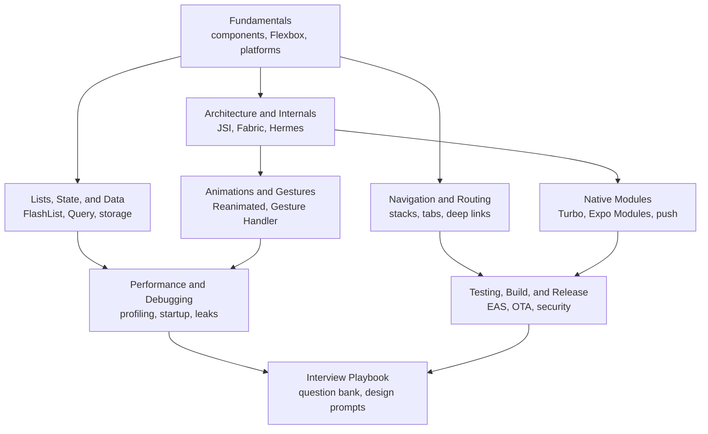

Start here for React Native prep, from "why does my text overflow the row" to "why does the feed drop frames on a budget Android phone".
Each page teaches mobile the way interviews probe it: what the code does, which thread it runs on, and what to use in production.
Everything reflects the current platform: the New Architecture is the only architecture, Hermes is the default engine, Expo is the recommended framework, and React Native DevTools replaced Flipper.

<SectionHub
  path="react-native"
  levels={{
    "react-native-fundamentals": "Beginner",
    "architecture-and-internals": "Mid to advanced",
    "navigation-and-routing": "Beginner to mid",
    "lists-state-and-data": "Mid",
    "animations-and-gestures": "Mid to advanced",
    "native-modules-and-platform": "Advanced",
    "performance-and-debugging": "Mid to advanced",
    "testing-build-and-release": "Mid",
    "react-native-interview-playbook": "All levels"
  }}
/>

## Reading Path

## Pick Your Level

| You are | Read in this order |
| --- | --- |
| A React web developer new to mobile | [Fundamentals](/docs/react-native/react-native-fundamentals), [Navigation](/docs/react-native/navigation-and-routing), [Lists, State, and Data](/docs/react-native/lists-state-and-data) |
| Preparing for a mid-level RN role | Add [Animations and Gestures](/docs/react-native/animations-and-gestures), [Performance](/docs/react-native/performance-and-debugging), and [Testing and Release](/docs/react-native/testing-build-and-release) |
| Preparing for senior or platform roles | Add [Architecture and Internals](/docs/react-native/architecture-and-internals) and [Native Modules](/docs/react-native/native-modules-and-platform) |
| One week left | The [Interview Playbook](/docs/react-native/react-native-interview-playbook) study plan |

## Related Sections

- [React](/docs/react) covers hooks, rendering, and patterns that apply unchanged in React Native.
- [JavaScript](/docs/javascript) and [TypeScript](/docs/typescript) cover the language your app is written in.
- [Redux](/docs/redux) covers Redux Toolkit and RTK Query, a common RN state stack.
- [Server-Driven UI](/docs/sdui) covers config-driven screens, a popular pattern in large RN apps.
- [Frontend System Design](/docs/system-design/hld/frontend-system-design) covers the client architecture framework used in mobile design rounds.
