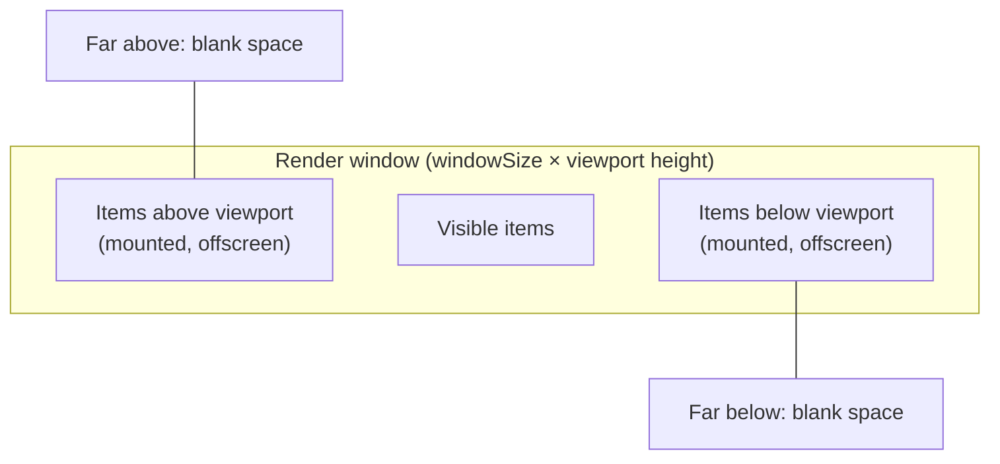
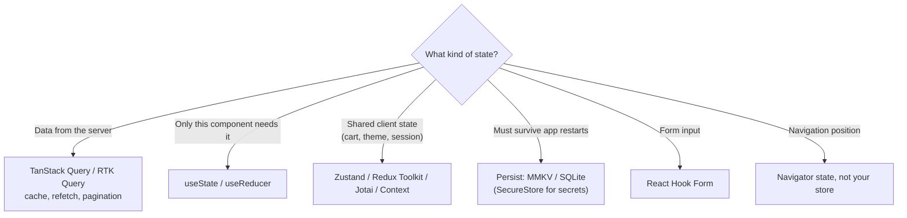
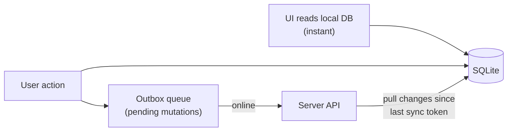

# 📘 Lists, State, and Data

Most apps are lists of things fetched from a server, cached on the device, and edited offline.
This page covers how to render long lists without dropping frames, where each kind of state should live, how to talk to APIs, and how to store data on the device safely.
State management concepts are the same as on the web; see [Redux](/docs/redux) for Redux Toolkit and RTK Query in depth.

## Table of Contents

1. [ScrollView vs Virtualized Lists](#1-scrollview-vs-virtualized-lists)
2. [FlatList](#2-flatlist)
3. [Tuning FlatList](#3-tuning-flatlist)
4. [FlashList and Recycling](#4-flashlist-and-recycling)
5. [Pagination, Refresh, and Empty States](#5-pagination-refresh-and-empty-states)
6. [Where State Lives](#6-where-state-lives)
7. [Server State with TanStack Query](#7-server-state-with-tanstack-query)
8. [Networking](#8-networking)
9. [Local Storage Options](#9-local-storage-options)
10. [Offline-First](#10-offline-first)
11. [App Lifecycle and Background State](#11-app-lifecycle-and-background-state)
12. [Questions](#12-questions)

---

## 1. ScrollView vs Virtualized Lists

| | `ScrollView` | `FlatList` / `SectionList` | FlashList / Legend List |
| --- | --- | --- | --- |
| Renders | **All children** immediately | Only a window around the viewport | Only visible items, **recycles** views |
| Memory | Grows with item count | Bounded, but mounts and unmounts cells | Bounded, reuses cells |
| Good for | Short, fixed content (a settings page, a form) | Long or unbounded data | Long feeds, heavy cells, low-end devices |

Rule of thumb: more than a screen or two of repeated items means use a virtualized list.

---

## 2. FlatList

```tsx
<FlatList
  data={posts}
  keyExtractor={(item) => item.id}
  renderItem={({ item }) => <PostRow post={item} onPress={openPost} />}
  ItemSeparatorComponent={Separator}
  ListHeaderComponent={<Header />}
  ListEmptyComponent={<EmptyState />}
  ListFooterComponent={isFetchingNextPage ? <ActivityIndicator /> : null}
  onEndReached={fetchNextPage}
  onEndReachedThreshold={0.5}
  refreshing={isRefetching}
  onRefresh={refetch}
/>
```

How virtualization works:



- Only items inside the render window are mounted; the rest are replaced by spacer views.
- When the user scrolls faster than JS can render new items, they see **blank areas**, which is the classic FlatList complaint.
- `keyExtractor` must return stable, unique keys; index keys break when items are inserted or removed.
- `SectionList` adds grouped data with sticky section headers.
- Never nest a vertical `FlatList` inside a vertical `ScrollView`: virtualization breaks because the outer view renders everything.
  Use `ListHeaderComponent` / `ListFooterComponent` instead.

---

## 3. Tuning FlatList

| Prop | Effect | Default |
| --- | --- | --- |
| `getItemLayout` | Skips measuring, enables instant `scrollToIndex` | none |
| `initialNumToRender` | Items rendered in the first batch | 10 |
| `maxToRenderPerBatch` | Items rendered per incremental batch | 10 |
| `windowSize` | Render window in viewport heights (21 = 10 above, 10 below, 1 visible) | 21 |
| `updateCellsBatchingPeriod` | Delay between batches (ms) | 50 |
| `removeClippedSubviews` | Detach offscreen native views (can glitch on iOS) | true on Android |

```tsx
const ITEM_HEIGHT = 72;

const renderItem = useCallback(({ item }) => <Row item={item} />, []);
const getItemLayout = useCallback(
  (_: unknown, index: number) => ({ length: ITEM_HEIGHT, offset: ITEM_HEIGHT * index, index }),
  [],
);

<FlatList data={data} renderItem={renderItem} getItemLayout={getItemLayout} windowSize={7} />;

const Row = memo(function Row({ item }: { item: Item }) { ... });
```

Checklist for smooth lists:

1. **Memoize rows** (`React.memo`) and keep `renderItem` stable, so unrelated state changes do not re-render every row.
2. Keep rows **cheap**: few nested views, no heavy computation, no anonymous inline styles creating new objects.
3. Use cached, correctly sized images (`expo-image`), not full-resolution images scaled down.
4. Lower `windowSize` to save memory on huge lists, raise it if blank areas appear.
5. Provide `getItemLayout` for fixed-height rows.
6. Use `extraData` when rows depend on state outside `data` (for example a selected ID).

---

## 4. FlashList and Recycling

**FlashList** (by Shopify) recycles native cell views like `UITableView` / `RecyclerView` instead of unmounting and mounting components.

```tsx
import { FlashList } from '@shopify/flash-list';

<FlashList
  data={posts}
  renderItem={({ item }) => <PostRow post={item} />}
  keyExtractor={(item) => item.id}
  getItemType={(item) => item.type}         // separate recycle pools for 'image' vs 'text' rows
/>
```

- A cell scrolled offscreen is **reused** with new props for an item scrolling in, so React updates props instead of creating a new tree.
- Much lower blank-area rate and memory on long feeds.
- FlashList v2 is built for the New Architecture and no longer needs size estimates, because Fabric allows synchronous measurement.
- **Recycling gotcha:** local state inside a row (`useState`) survives recycling and leaks into the next item.
  Keep row state in the data or reset it when the item ID changes.
- **Legend List** is another high-performance list in pure JS with similar goals (recycling, chat-style lists, bidirectional scrolling).

---

## 5. Pagination, Refresh, and Empty States

```tsx
const { data, fetchNextPage, hasNextPage, isFetchingNextPage, refetch, isRefetching } =
  useInfiniteQuery({
    queryKey: ['feed'],
    queryFn: ({ pageParam }) => api.feed({ cursor: pageParam }),
    initialPageParam: null as string | null,
    getNextPageParam: (last) => last.nextCursor ?? undefined,
  });

const items = useMemo(() => data?.pages.flatMap((p) => p.items) ?? [], [data]);

<FlashList
  data={items}
  renderItem={renderItem}
  onEndReached={() => hasNextPage && !isFetchingNextPage && fetchNextPage()}
  onEndReachedThreshold={0.5}
  refreshing={isRefetching}
  onRefresh={refetch}
/>
```

- Prefer **cursor pagination** over offset pagination; feeds change while the user scrolls, and offsets skip or duplicate items.
- `onEndReached` can fire multiple times; guard with `isFetchingNextPage`.
- Design all four states: loading (skeletons), empty, error with retry, and loaded.
- Chat and messages use an inverted list (`inverted` or `maintainVisibleContentPosition`) so new items appear at the bottom without jumping.

---

## 6. Where State Lives



| Tool | Strength | Watch out for |
| --- | --- | --- |
| `useState`, `useReducer` | Simple, local | Prop drilling when shared widely |
| Context | Built in, good for rarely changing values (theme, auth user) | Every consumer re-renders on change |
| **Zustand** | Tiny, selector-based subscriptions, works outside React | Keep stores small and focused |
| **Redux Toolkit** | Structure, devtools, middleware, large teams | More ceremony |
| Jotai | Atomic state, fine-grained updates | Many atoms to organize |
| **TanStack Query / RTK Query** | Server cache: dedupe, retries, refetch, pagination | Do not copy server data into a client store |
| Legend State, MobX | Fine-grained observables, built-in persistence and sync (Legend) | Different mental model |

The main interview point: **separate server state from client state**.
Most "global state" in apps is really cached server data, and a query library manages it better than a hand-written store.

---

## 7. Server State with TanStack Query

Mobile-specific setup that interviewers like to hear about:

```tsx
import NetInfo from '@react-native-community/netinfo';
import { AppState, Platform } from 'react-native';
import { focusManager, onlineManager, QueryClient } from '@tanstack/react-query';

// Refetch when the app returns to the foreground (there is no window focus on mobile).
AppState.addEventListener('change', (status) => {
  if (Platform.OS !== 'web') focusManager.setFocused(status === 'active');
});

// Pause queries and mutations while offline, resume when connectivity returns.
onlineManager.setEventListener((setOnline) =>
  NetInfo.addEventListener((state) => setOnline(!!state.isConnected)),
);

const queryClient = new QueryClient({
  defaultOptions: { queries: { staleTime: 60_000, retry: 2 } },
});
```

- **Persist the cache** (`persistQueryClient` with an MMKV or AsyncStorage persister) so the app shows the last data instantly on cold start.
- **Optimistic updates** for likes, toggles, and reorder: update the cache in `onMutate`, roll back in `onError`, invalidate in `onSettled`.
- Mutations made offline can be paused and resumed when the network returns.

---

## 8. Networking

- `fetch` and `XMLHttpRequest` are available (implemented natively); Axios works on top of them.
- **WebSockets** are built in; server-sent events and streaming responses need care (use `expo/fetch` or a library for streaming bodies).
- There is **no CORS** in a native app, because there is no browser origin.
  CORS still matters for React Native Web.
- **Cookies** are handled by the native HTTP stack and are less predictable than on the web; most mobile APIs use **bearer tokens** instead.
- Android blocks cleartext HTTP by default; use HTTPS, or allow `localhost` only in debug builds.
- iOS App Transport Security also requires HTTPS.

Token handling pattern:

```ts
// Access token in memory, refresh token in SecureStore.
api.interceptors.response.use(undefined, async (error) => {
  if (error.response?.status === 401 && !error.config._retry) {
    error.config._retry = true;
    const token = await refreshOnce();          // dedupe concurrent refreshes with a shared promise
    error.config.headers.Authorization = `Bearer ${token}`;
    return api(error.config);
  }
  throw error;
});
```

- Dedupe refreshes: if five requests get 401 together, only one refresh call should run.
- On refresh failure, clear credentials and route to sign-in through auth state.
- Mobile networks are slow and flaky: set timeouts, retry idempotent requests with backoff, and show offline UI using NetInfo.

---

## 9. Local Storage Options

| Storage | Type | Sync / async | Use for | Not for |
| --- | --- | --- | --- | --- |
| **AsyncStorage** | Key-value, strings | Async | Small, simple settings; legacy code | Large data, secrets, hot paths |
| **MMKV** (`react-native-mmkv`) | Key-value, memory-mapped, JSI | **Sync**, very fast | Settings, feature flags, persisted stores and query caches | Secrets (unless encrypted), relational data |
| **expo-secure-store** / Keychain | Encrypted key-value (iOS Keychain, Android Keystore) | Async | **Tokens, credentials** | Large values |
| **expo-sqlite**, op-sqlite | Relational SQL | Async (sync available) | Large or relational data, search, offline data | Simple flags |
| ORMs on SQLite (Drizzle, WatermelonDB) | Typed queries, observable models, sync | Async | Offline-first apps with large datasets | Tiny apps |
| File system (`expo-file-system`) | Files | Async | Downloads, images, exports | Structured queries |

- **Never store tokens in AsyncStorage or plain MMKV**: they are unencrypted files that can be read on rooted or jailbroken devices and from backups.
- Keychain entries on iOS can **survive app uninstall**; clear them on first launch after reinstall if needed.
- MMKV being synchronous makes it ideal for persisting Zustand or Redux state with no loading flash.

```ts
import { createMMKV } from 'react-native-mmkv';
import { create } from 'zustand';
import { persist, createJSONStorage } from 'zustand/middleware';

const storage = createMMKV();
const mmkvStorage = {
  getItem: (k: string) => storage.getString(k) ?? null,
  setItem: (k: string, v: string) => storage.set(k, v),
  removeItem: (k: string) => storage.remove(k),
};

export const useSettings = create(
  persist<{ theme: 'light' | 'dark'; setTheme: (t: 'light' | 'dark') => void }>(
    (set) => ({ theme: 'light', setTheme: (theme) => set({ theme }) }),
    { name: 'settings', storage: createJSONStorage(() => mmkvStorage) },
  ),
);
```

---

## 10. Offline-First



Principles:

- **Local database is the source of truth for the UI**; the network syncs in the background.
- Queue writes in an **outbox** with stable client-generated IDs (UUIDs) so retries are idempotent.
- Pull changes incrementally using a server cursor or `updated_at` timestamp.
- Decide a **conflict strategy**: last write wins, field-level merge, server wins, or CRDTs for collaborative data.
- Show sync status and pending changes; never silently drop failed writes.
- Sync engines that help: WatermelonDB sync, PowerSync, ElectricSQL, Replicache-style approaches, Legend State sync, or Firebase / Supabase offline support.

See [Data Modeling Patterns](/docs/databases/data-modeling-patterns) for schema design and [Distributed Systems](/docs/system-design/hld/distributed-systems) for sync and consistency trade-offs.

---

## 11. App Lifecycle and Background State

| `AppState` | Meaning |
| --- | --- |
| `active` | In the foreground and receiving events |
| `inactive` | iOS only: transitioning, incoming call, control center |
| `background` | Not visible; JS may be suspended at any time |

```tsx
useEffect(() => {
  const sub = AppState.addEventListener('change', (next) => {
    if (next === 'background') saveDraft();         // persist before the OS can kill the app
    if (next === 'active') queryClient.invalidateQueries({ queryKey: ['inbox'] });
  });
  return () => sub.remove();
}, []);
```

- The OS can **kill a backgrounded app without warning** to reclaim memory.
  Persist anything the user would hate to lose when the app goes to the background.
- JS timers do not run reliably in the background.
  Use `expo-background-task` (scheduled background work) or push notifications for server-triggered updates.
- Hide sensitive screens in the app switcher snapshot (blur or overlay on `inactive` / `background`).

---

## 12. Questions

**Q: ScrollView vs FlatList?**
ScrollView renders every child up front, so it suits short content.
FlatList virtualizes: it renders a window around the viewport and replaces the rest with spacers, keeping memory and render time bounded for long lists.

**Q: Why does a FlatList show blank areas during fast scrolling?**
Items are rendered by JS in batches; if the user scrolls past the render window faster than JS can render, there is nothing mounted yet.
Fix with cheaper memoized rows, `getItemLayout`, tuned `windowSize`, or a recycling list like FlashList.

**Q: How does FlashList differ from FlatList?**
FlashList recycles cell components across items instead of unmounting and mounting them, like native recycler views.
It reduces blank areas and memory, but row-local state can leak between items.

**Q: Where would you store an auth token?**
In encrypted storage: iOS Keychain and Android Keystore through `expo-secure-store` or `react-native-keychain`.
Keep the access token in memory and the refresh token in secure storage.

**Q: AsyncStorage vs MMKV?**
AsyncStorage is async and slower; MMKV is a synchronous, memory-mapped store accessed via JSI and is much faster, which allows reading persisted state during the first render.
Neither is for secrets unless encryption is configured.

**Q: How do you design an offline-first app?**
Render from a local database, record writes in an outbox with client IDs, sync in the background with retries and incremental pulls, define conflict resolution, and surface sync status in the UI.

**Q: How do you refetch data when the app returns to the foreground?**
Listen to `AppState` changes and connect them to the query library's focus manager, or invalidate specific queries when the state becomes `active`.
