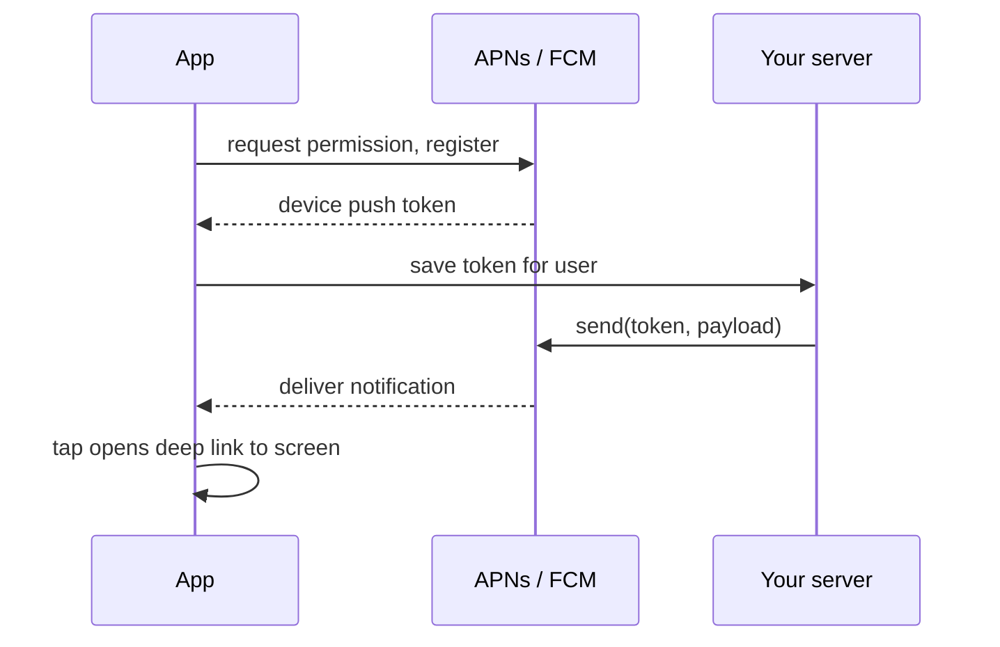

# 📘 Native Modules and Platform APIs

Sooner or later an app needs something JavaScript cannot do: a vendor SDK, a platform API with no library, a hot path that must be fast, or a native UI component.
This page covers how to bridge to native code today (the New Architecture way), the Expo alternatives that make it easier, and the platform features every app eventually needs: permissions, push notifications, and background work.
Read [Architecture and Internals](/docs/react-native/architecture-and-internals) first for JSI, Turbo Modules, and Fabric.

## Table of Contents

1. [When You Need Native Code](#1-when-you-need-native-code)
2. [Options for Writing Native Code](#2-options-for-writing-native-code)
3. [Turbo Module Step by Step](#3-turbo-module-step-by-step)
4. [Expo Modules API](#4-expo-modules-api)
5. [Native UI Components](#5-native-ui-components)
6. [Events from Native to JS](#6-events-from-native-to-js)
7. [Config Plugins and Continuous Native Generation](#7-config-plugins-and-continuous-native-generation)
8. [Permissions](#8-permissions)
9. [Push Notifications](#9-push-notifications)
10. [Background Work](#10-background-work)
11. [Brownfield Apps](#11-brownfield-apps)
12. [Choosing Third-Party Libraries](#12-choosing-third-party-libraries)
13. [Questions](#13-questions)

---

## 1. When You Need Native Code

- A **platform API** with no maintained library (a new iOS framework, an Android system service).
- A **vendor SDK** that only ships native binaries (payments, analytics, video calling, identity verification).
- **Performance-critical work**: image processing, crypto, audio, large data parsing.
- A **native UI view** (maps, video players, platform pickers, a custom chart view).
- Deep OS integration: widgets, App Clips, share extensions, watch apps, Live Activities.
  Extensions are separate native targets; they cannot run your RN JS directly but can share data through app groups.

Before writing native code, check the React Native Directory and the Expo SDK: most common needs (camera, location, file system, haptics, biometrics, notifications, contacts) already have maintained packages.

---

## 2. Options for Writing Native Code

| Option | Language | Best for |
| --- | --- | --- |
| **Expo Modules API** | Swift and Kotlin with a declarative DSL | Most app-level and library modules; least boilerplate; works in any RN app |
| **Turbo Modules** (core) | Obj-C++ / Swift on iOS, Kotlin / Java on Android, or pure C++ | Libraries that want zero dependencies, or code that follows core RN exactly |
| **C++ Turbo Modules** | C++ | Shared logic on both platforms, performance-sensitive code |
| **Nitro Modules** | Swift, Kotlin, or C++ with generated JSI bindings | Very high call performance, typed objects passed across JSI |
| **Fabric native components** | Platform view code plus Codegen spec | Native UI views |

All of these sit on JSI in the New Architecture.
The old "Native Modules" API (`RCT_EXPORT_METHOD`, `ReactContextBaseJavaModule`) still runs through the interop layer, but new code should not use it.

---

## 3. Turbo Module Step by Step

### 3.1 Write the spec

```ts
// specs/NativeLocalStorage.ts
import type { TurboModule } from 'react-native';
import { TurboModuleRegistry } from 'react-native';

export interface Spec extends TurboModule {
  setItem(value: string, key: string): void;
  getItem(key: string): string | null;
  removeItem(key: string): void;
  clear(): Promise<void>;
}

export default TurboModuleRegistry.getEnforcing<Spec>('NativeLocalStorage');
```

### 3.2 Configure Codegen

```json
// package.json
"codegenConfig": {
  "name": "NativeLocalStorageSpec",
  "type": "modules",
  "jsSrcsDir": "specs",
  "android": { "javaPackageName": "com.myapp.storage" }
}
```

Codegen runs during the native build (`pod install` on iOS, Gradle on Android) and generates the native interface the implementation must satisfy.

### 3.3 Implement on Android (Kotlin)

```kotlin
class NativeLocalStorageModule(reactContext: ReactApplicationContext) :
    NativeLocalStorageSpec(reactContext) {

  private val prefs = reactContext.getSharedPreferences("app", Context.MODE_PRIVATE)

  override fun getName() = NAME
  override fun setItem(value: String, key: String) { prefs.edit().putString(key, value).apply() }
  override fun getItem(key: String): String? = prefs.getString(key, null)
  override fun removeItem(key: String) { prefs.edit().remove(key).apply() }
  override fun clear(promise: Promise) { prefs.edit().clear().apply(); promise.resolve(null) }

  companion object { const val NAME = "NativeLocalStorage" }
}
```

Register it with a `BaseReactPackage` that returns the module and its info.

### 3.4 Implement on iOS (Objective-C++)

```objc
// RCTNativeLocalStorage.mm
@interface RCTNativeLocalStorage : NSObject <NativeLocalStorageSpec>
@end

@implementation RCTNativeLocalStorage
RCT_EXPORT_MODULE(NativeLocalStorage)

- (std::shared_ptr<facebook::react::TurboModule>)getTurboModule:
    (const facebook::react::ObjCTurboModule::InitParams &)params {
  return std::make_shared<facebook::react::NativeLocalStorageSpecJSI>(params);
}

- (NSString *)getItem:(NSString *)key {
  return [[NSUserDefaults standardUserDefaults] stringForKey:key];
}
// setItem, removeItem, clear...
@end
```

### 3.5 Use it from JS

```ts
import NativeLocalStorage from './specs/NativeLocalStorage';

NativeLocalStorage.setItem('dark', 'theme');
const theme = NativeLocalStorage.getItem('theme');   // synchronous through JSI
```

Rules for native module design:

- Keep the API **small and coarse-grained**: one call that does a whole job beats many tiny calls.
- Use **sync** methods only for fast work (microseconds); anything with I/O should return a `Promise`.
- Run heavy native work on a background queue or thread; never block the UI thread.
- Validate inputs on the native side as well; the JS bundle can be tampered with.

---

## 4. Expo Modules API

```swift
// ios/BatteryModule.swift
import ExpoModulesCore

public class BatteryModule: Module {
  public func definition() -> ModuleDefinition {
    Name("Battery")

    Function("isLowPowerMode") {
      ProcessInfo.processInfo.isLowPowerModeEnabled
    }

    AsyncFunction("getLevelAsync") { () -> Float in
      UIDevice.current.isBatteryMonitoringEnabled = true
      return UIDevice.current.batteryLevel
    }

    Events("onLowPowerModeChange")
  }
}
```

```kotlin
// android/.../BatteryModule.kt
class BatteryModule : Module() {
  override fun definition() = ModuleDefinition {
    Name("Battery")
    Function("isLowPowerMode") {
      val pm = appContext.reactContext!!.getSystemService(Context.POWER_SERVICE) as PowerManager
      pm.isPowerSaveMode
    }
    AsyncFunction("getLevelAsync") { /* BatteryManager */ }
    Events("onLowPowerModeChange")
  }
}
```

```ts
import { requireNativeModule } from 'expo-modules-core';
const Battery = requireNativeModule('Battery');
```

- Create one with `npx create-expo-module --local` inside an app.
- Swift and Kotlin only, with automatic type conversion, events, views, and lifecycle hooks.
- Works in **bare React Native apps too**, not just Expo apps.
- The Expo SDK itself (camera, file system, notifications) is built on it.

---

## 5. Native UI Components

```ts
// specs/MapViewNativeComponent.ts
import type { ViewProps } from 'react-native';
import type { Double, DirectEventHandler } from 'react-native/Libraries/Types/CodegenTypes';
import codegenNativeComponent from 'react-native/Libraries/Utilities/codegenNativeComponent';

type RegionChangeEvent = { latitude: Double; longitude: Double };

interface NativeProps extends ViewProps {
  latitude: Double;
  longitude: Double;
  onRegionChange?: DirectEventHandler<RegionChangeEvent>;
}

export default codegenNativeComponent<NativeProps>('MapView');
```

- Codegen generates the props, event emitters, and view manager interfaces; you implement the view on each platform.
- **Commands** (imperative calls like `animateToRegion`) are declared with `codegenNativeCommands`.
- Native views participate in Yoga layout like any other view; give them a size.
- With the Expo Modules API, a `View(...)` block in the module definition declares a native view with props and events.

---

## 6. Events from Native to JS

| Need | Mechanism |
| --- | --- |
| Return a single result | Return a value (sync) or resolve a `Promise` |
| Stream of events (sensor updates, download progress) | Event emitter in the spec (`EventEmitter<T>` in Turbo Modules), `Events(...)` in Expo Modules |
| Component events | `DirectEventHandler` / `BubblingEventHandler` props on native components |
| High-frequency data (camera frames, audio buffers) | JSI host objects or worklets (VisionCamera frame processors), not events |

Always remove listeners on unmount, and stop the native producer when the last listener is removed to save battery.

---

## 7. Config Plugins and Continuous Native Generation

With **Continuous Native Generation (CNG)**, `ios/` and `android/` are build outputs generated from `app.json` by `npx expo prebuild`, not hand-edited source.

```ts
// app.config.ts
export default {
  name: 'MyApp',
  ios: { bundleIdentifier: 'com.example.myapp', infoPlist: { NSCameraUsageDescription: 'Scan receipts' } },
  android: { package: 'com.example.myapp', permissions: ['CAMERA'] },
  plugins: [
    'expo-camera',
    ['expo-build-properties', { android: { minSdkVersion: 24 } }],
    './plugins/withCustomGradle',
  ],
};
```

```js
// plugins/withCustomGradle.js: a tiny config plugin
const { withAppBuildGradle } = require('expo/config-plugins');

module.exports = (config) =>
  withAppBuildGradle(config, (cfg) => {
    cfg.modResults.contents += '\n// custom gradle tweak\n';
    return cfg;
  });
```

Why it matters:

- **Upgrades** become "bump versions and regenerate" instead of merging native template diffs.
- Native config is **declarative and reviewable** in one file.
- Libraries ship their own config plugins (permissions, manifest entries, Info.plist keys), so installing them needs no manual native steps.
- Do not edit generated native folders by hand; anything not captured in config is lost on the next prebuild.

---

## 8. Permissions

```ts
import * as Location from 'expo-location';

async function getLocation() {
  const { status, canAskAgain } = await Location.requestForegroundPermissionsAsync();
  if (status !== 'granted') {
    if (!canAskAgain) showOpenSettingsPrompt();      // Linking.openSettings()
    return null;
  }
  return Location.getCurrentPositionAsync({});
}
```

| Rule | Why |
| --- | --- |
| Declare usage strings and manifest entries | iOS rejects apps (and crashes at runtime) without `NS...UsageDescription`; Android needs manifest permissions |
| Ask **in context**, after explaining the benefit | iOS only shows the system prompt once; a denied prompt usually stays denied |
| Handle denied and "don't ask again" | Offer a path to Settings, keep the app usable without the permission |
| Request the minimum | Approximate location, "while using", photo picker instead of full library access |
| Re-check on resume | Users can revoke permissions in Settings at any time |

Platform specifics: Android 13+ needs a runtime permission for notifications; iOS has App Tracking Transparency for cross-app tracking; both platforms offer limited photo access.

---

## 9. Push Notifications



- iOS uses **APNs**, Android uses **FCM**.
  `expo-notifications` with the Expo push service, or Firebase Messaging (`@react-native-firebase/messaging`), wrap both.
- **Tokens change**: refresh and re-register on app start and on token change events; delete tokens on logout.
- **Notification vs data messages**: notification payloads are displayed by the OS even if the app is killed; data-only messages wake the app for background processing and are throttled by both OSes.
- Handle three states: foreground (show in-app UI or a banner via a handler), background (OS shows it), and **cold start from a tap** (read the initial notification and deep link to the right screen).
- Android needs **notification channels** (importance, sound) created before showing notifications.
- Rich notifications (images, actions) need a Notification Service Extension on iOS.
- Server side: send in batches, handle invalid-token responses by deleting tokens, and respect user preferences and quiet hours.

---

## 10. Background Work

Mobile OSes aggressively limit background execution to save battery.

| Need | Approach |
| --- | --- |
| Periodic sync (best effort) | `expo-background-task` (iOS `BGTaskScheduler`, Android WorkManager) |
| Finish an upload after backgrounding | Native background upload sessions (`URLSession` background config, WorkManager) |
| Server wants to update the app | Silent / data push notification |
| Location tracking | Background location mode, justified to App Review |
| Audio playback | Background audio mode |
| Long-running work on Android | Foreground service with a visible notification |

- The OS decides **when** periodic tasks run (if at all); never rely on exact timing.
- JS in the background is limited; keep background tasks short, idempotent, and resumable.

---

## 11. Brownfield Apps

Brownfield means adding React Native to an existing native app (or the reverse).

- Embed an RN root view (a `ReactRootView` / `RCTRootView` style surface hosted by a React host) inside a native screen.
- Share navigation carefully: usually native owns the top-level navigation and RN owns whole features (a settings area, a checkout flow).
- Communicate through native modules and events, with a typed contract.
- Tools such as Expo's brownfield support and Callstack's brownfield tooling package RN as an iOS framework or Android AAR for native teams.
- Main costs: app size (Hermes plus RN core), startup of the RN runtime (prewarm it), and two build systems.

---

## 12. Choosing Third-Party Libraries

| Check | Why |
| --- | --- |
| **New Architecture support** (React Native Directory shows it) | The legacy architecture is gone |
| Maintenance: recent releases, issue response | RN upgrades break unmaintained native code |
| Expo config plugin available | Install without touching native folders |
| Native binary size and permissions it adds | App size and App Review |
| Pure JS alternative available | No native rebuild, fewer upgrade problems |
| Licence | Commercial use |

Well-known, safe defaults: React Navigation / Expo Router, Reanimated, Gesture Handler, Screens, Safe Area Context, FlashList, `expo-image`, MMKV, TanStack Query, VisionCamera, Skia, and the Expo SDK packages.

---

## 13. Questions

**Q: How do you call native code from React Native?**
Define a typed spec, let Codegen generate the interfaces, implement them in Kotlin / Java and Obj-C++ / Swift (or C++), and call the module from JS through `TurboModuleRegistry`.
Or use the Expo Modules API to write the module in Swift and Kotlin with less boilerplate.

**Q: Turbo Modules vs Expo Modules?**
Both run on JSI in the New Architecture.
Turbo Modules are the core RN mechanism using Codegen specs; Expo Modules provide a Swift / Kotlin DSL with automatic type conversion, events, and views, and work in any RN app.

**Q: Sync vs async native methods: when to use which?**
Sync only for trivial, fast reads (a cached value, a constant), because the JS thread waits.
Anything with I/O, computation, or uncertain duration should be async and run off the UI thread.

**Q: What is Continuous Native Generation?**
Treating `ios/` and `android/` folders as generated output of `app.json` plus config plugins, regenerated by `expo prebuild`, which makes native config declarative and upgrades much easier.

**Q: How do push notifications work end to end?**
The app requests permission and registers with APNs or FCM to get a device token, sends it to your backend, and the backend sends messages to APNs / FCM, which deliver them.
On tap, the app reads the payload and deep links to the right screen, including from a cold start.

**Q: How do you handle a permanently denied permission?**
Detect it (`canAskAgain` false), explain why the feature needs it, offer a button that opens system Settings, and keep the rest of the app functional.
