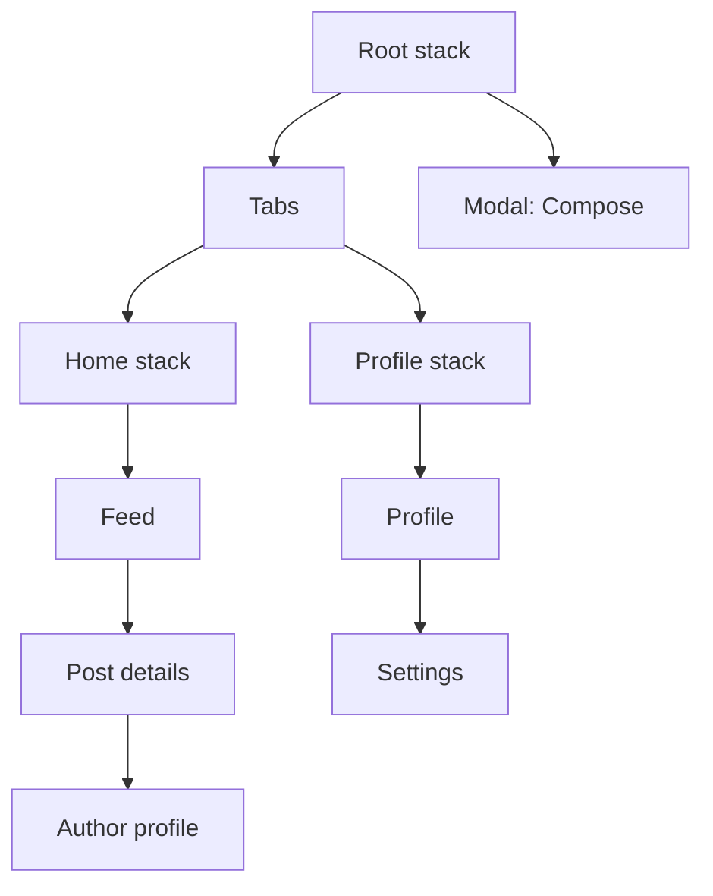
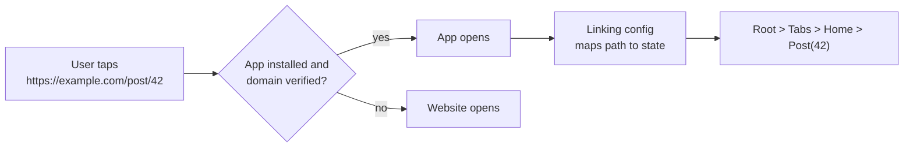

# 📘 Navigation and Routing

Mobile navigation is not URL-first like the web.
It is a **stack of screens** that stay mounted, with native transitions, swipe-back gestures, a hardware back button on Android, and tab bars that keep their own history.
Two libraries dominate: **React Navigation** (component and config based) and **Expo Router** (file-based routing built on top of React Navigation).
This page explains both, plus deep linking and auth flows, which interviewers love.

## Table of Contents

1. [Mobile Navigation Mental Model](#1-mobile-navigation-mental-model)
2. [React Navigation Basics](#2-react-navigation-basics)
3. [Navigator Types](#3-navigator-types)
4. [Params and Type Safety](#4-params-and-type-safety)
5. [Nesting Navigators](#5-nesting-navigators)
6. [Expo Router](#6-expo-router)
7. [Authentication Flows](#7-authentication-flows)
8. [Deep Links and Universal Links](#8-deep-links-and-universal-links)
9. [Modals, Sheets, and Back Handling](#9-modals-sheets-and-back-handling)
10. [Screen Lifecycle and Focus](#10-screen-lifecycle-and-focus)
11. [Navigation Performance](#11-navigation-performance)
12. [Questions](#12-questions)

---

## 1. Mobile Navigation Mental Model



| Web | Mobile |
| --- | --- |
| One history list, URL is the source of truth | Many histories: each stack and tab has its own |
| Navigating away unmounts the page | Previous screens in a stack **stay mounted** under the new one |
| Back is browser-provided | iOS swipe from the edge, Android system back, header back button |
| Transitions optional | Native push, modal, and fade transitions are expected |
| Deep link is just a URL | Deep links must map a URL to a whole nested navigation state |

The key consequence: screens stay mounted, so effects do not re-run when you come back to a screen.
Use focus events (section 10) for "refresh when visible".

---

## 2. React Navigation Basics

```tsx
import { NavigationContainer } from '@react-navigation/native';
import { createNativeStackNavigator } from '@react-navigation/native-stack';

type RootStackParamList = {
  Home: undefined;
  Details: { id: string };
};

const Stack = createNativeStackNavigator<RootStackParamList>();

export default function App() {
  return (
    <NavigationContainer>
      <Stack.Navigator initialRouteName="Home">
        <Stack.Screen name="Home" component={HomeScreen} />
        <Stack.Screen name="Details" component={DetailsScreen} options={{ title: 'Details' }} />
      </Stack.Navigator>
    </NavigationContainer>
  );
}

function HomeScreen({ navigation }) {
  return <Button title="Open" onPress={() => navigation.navigate('Details', { id: '42' })} />;
}
```

| Method | Behavior |
| --- | --- |
| `navigate(name, params)` | Go to the screen; if it already exists in the stack, go back to it (with new params) |
| `push(name, params)` | Always add a new instance (profile of a profile of a profile) |
| `goBack()` | Pop one screen |
| `pop(n)`, `popToTop()` | Pop several, or to the first screen |
| `replace(name)` | Swap the current screen (no back to it) |
| `reset(state)` | Replace the whole navigation state (after login or logout) |
| `setParams(params)` | Update the current screen's params |

React Navigation 7 also offers a **static API** (`createStaticNavigation`), where navigators are declared as config objects, enabling automatic TypeScript types and deep link configuration.

---

## 3. Navigator Types

| Navigator | Package | Use |
| --- | --- | --- |
| **Native stack** | `@react-navigation/native-stack` | Default choice: uses `UINavigationController` and Android fragments through `react-native-screens` |
| JS stack | `@react-navigation/stack` | Fully customizable transitions in JS, slightly less native feel |
| Bottom tabs | `@react-navigation/bottom-tabs` | Main app sections |
| Native bottom tabs | Native tab bar implementations | Platform tab bar behavior (for example iOS Liquid Glass styling) |
| Drawer | `@react-navigation/drawer` | Side menu, common on Android and tablets |
| Material top tabs | `@react-navigation/material-top-tabs` | Swipeable tabs |

**Native stack vs JS stack:**

- Native stack uses platform primitives, so transitions, large titles, and gestures match the OS and run on the UI thread.
- JS stack draws everything in JS with Reanimated / Animated, which allows any custom transition but can feel less native.
- Choose native stack unless you need a transition it cannot do.

`react-native-screens` is what makes each screen a real native container, which lets the OS detach invisible screens and save memory.

---

## 4. Params and Type Safety

```tsx
import type { NativeStackScreenProps } from '@react-navigation/native-stack';

type Props = NativeStackScreenProps<RootStackParamList, 'Details'>;

function DetailsScreen({ route, navigation }: Props) {
  const { id } = route.params;                  // typed as string
  const { data } = useQuery({ queryKey: ['item', id], queryFn: () => fetchItem(id) });
  ...
}

// Global typing so useNavigation() knows every route.
declare global {
  namespace ReactNavigation {
    interface RootParamList extends RootStackParamList {}
  }
}
```

Rules for params:

- Pass **IDs, not objects**.
  Params should be serializable (they become part of deep links and state persistence), and objects go stale when the data changes.
- Fetch or read the entity from a cache (TanStack Query, a store) on the destination screen.
- Never pass functions as params; use events, a store, or navigate back with params instead.

---

## 5. Nesting Navigators

```tsx
function HomeTabs() {
  return (
    <Tab.Navigator>
      <Tab.Screen name="Feed" component={FeedStack} />
      <Tab.Screen name="Profile" component={ProfileStack} />
    </Tab.Navigator>
  );
}

<Stack.Navigator>
  <Stack.Screen name="Main" component={HomeTabs} options={{ headerShown: false }} />
  <Stack.Screen name="Compose" component={Compose} options={{ presentation: 'modal' }} />
</Stack.Navigator>

// Navigate into a nested screen:
navigation.navigate('Main', { screen: 'Profile', params: { screen: 'Settings' } });
```

- Each navigator has its own history; `goBack` bubbles up to the parent if the current one cannot go back.
- Put **modals and full-screen flows above the tabs** in a root stack, so they cover the tab bar.
- Hide the tab bar on detail screens by placing those screens in the root stack, not by toggling `tabBarStyle`.
- Avoid deep nesting; every navigator adds headers, context, and re-render surface.

---

## 6. Expo Router

Expo Router turns the `app/` folder into routes, the way Next.js does on the web, and runs React Navigation underneath.

```text
app/
  _layout.tsx              # root layout: Stack
  (auth)/
    _layout.tsx
    sign-in.tsx            # /sign-in
  (tabs)/
    _layout.tsx            # Tabs
    index.tsx              # /
    profile.tsx            # /profile
  post/
    [id].tsx               # /post/123
  +not-found.tsx
```

```tsx
// app/_layout.tsx
import { Stack } from 'expo-router';

export default function RootLayout() {
  return (
    <Stack>
      <Stack.Screen name="(tabs)" options={{ headerShown: false }} />
      <Stack.Screen name="post/[id]" options={{ title: 'Post' }} />
    </Stack>
  );
}

// app/post/[id].tsx
import { useLocalSearchParams, Link, router } from 'expo-router';

export default function Post() {
  const { id } = useLocalSearchParams<{ id: string }>();
  return (
    <>
      <Text>Post {id}</Text>
      <Link href={{ pathname: '/post/[id]', params: { id: '7' } }}>Next</Link>
      <Button title="Back" onPress={() => router.back()} />
    </>
  );
}
```

| Concept | Meaning |
| --- | --- |
| `_layout.tsx` | Defines the navigator (Stack, Tabs, Drawer, Slot) for a folder |
| `(group)` | Groups routes without adding a URL segment (auth vs app) |
| `[param]`, `[...rest]` | Dynamic and catch-all segments |
| `+not-found.tsx` | Unmatched routes |
| `<Link href>` / `router.push` | Typed navigation by URL |
| **Typed routes** | Generated types make wrong `href`s a compile error |
| **Protected routes** | `Stack.Protected guard={isSignedIn}` hides routes unless a condition holds |
| API routes, web output | The same project can serve API routes and render to the web |

Why teams pick Expo Router:

- **Every screen has a URL** automatically, so deep links and universal links work with no extra config.
- The same routes work on web (React Native Web), with static or server rendering.
- Less boilerplate, consistent structure across the team.

Why some teams stay on plain React Navigation: very custom navigation trees, brownfield apps, or existing large codebases.

---

## 7. Authentication Flows

The recommended pattern: **render different screens based on auth state**, do not navigate imperatively after login.

```tsx
function RootNavigator() {
  const { status } = useAuth();                    // 'loading' | 'signedIn' | 'signedOut'
  if (status === 'loading') return <Splash />;     // read token from SecureStore first

  return (
    <Stack.Navigator>
      {status === 'signedIn' ? (
        <Stack.Screen name="App" component={AppTabs} options={{ headerShown: false }} />
      ) : (
        <>
          <Stack.Screen name="SignIn" component={SignIn} />
          <Stack.Screen name="SignUp" component={SignUp} />
        </>
      )}
    </Stack.Navigator>
  );
}
```

Why conditional screens:

- After logout, the user cannot press back into private screens because they no longer exist.
- No race between "token saved" and "navigate called".
- In Expo Router, use `Stack.Protected` or a redirect in the group layout to get the same result.

Keep the splash screen visible (`expo-splash-screen` `preventAutoHideAsync`) until the token check finishes, to avoid flashing the sign-in screen.

---

## 8. Deep Links and Universal Links

| Type | Example | Notes |
| --- | --- | --- |
| **Custom scheme** | `myapp://post/42` | Easy, but any app can claim the scheme, and it does nothing if the app is not installed |
| **Universal links (iOS) / App Links (Android)** | `https://example.com/post/42` | Verified by a file on your domain; opens the app if installed, the website otherwise |



Setup:

- **iOS:** host `/.well-known/apple-app-site-association` (JSON, served over HTTPS, no redirect) and add `applinks:example.com` to Associated Domains.
- **Android:** host `/.well-known/assetlinks.json` with your signing certificate SHA-256 and add an intent filter with `android:autoVerify="true"`.
- **React Navigation:** pass a `linking` config mapping paths to screens; Expo Router does it automatically from the file structure.

```tsx
const linking = {
  prefixes: ['myapp://', 'https://example.com'],
  config: {
    screens: {
      Main: { screens: { Feed: 'feed', Profile: 'u/:username' } },
      Post: 'post/:id',
    },
  },
};
<NavigationContainer linking={linking}>...</NavigationContainer>
```

Pitfalls:

- Deep links can open a screen **before auth is ready**: queue the link and handle it after sign-in.
- Treat link params as **untrusted input**: validate IDs, never perform actions (payments, deletes) from a link without confirmation.
- Cold start vs warm start: `Linking.getInitialURL()` for launch, the `url` event for links while running (React Navigation handles both).
- Deferred deep links (link survives app install) need a third-party service or your own attribution.

---

## 9. Modals, Sheets, and Back Handling

- `presentation: 'modal'` (or `formSheet`, `transparentModal`) on a stack screen gives native modal presentation.
- Bottom sheets: native `formSheet` with detents in the native stack, or libraries like `@gorhom/bottom-sheet`.
- Android back:

```tsx
useFocusEffect(
  useCallback(() => {
    const sub = BackHandler.addEventListener('hardwareBackPress', () => {
      if (hasUnsavedChanges) {
        confirmDiscard();
        return true;          // handled, do not go back
      }
      return false;           // default behavior
    });
    return () => sub.remove();
  }, [hasUnsavedChanges]),
);
```

- React Navigation's `usePreventRemove` intercepts every way of leaving a screen (back button, swipe, header back), which is better than handling only `BackHandler`.
- Android predictive back gestures animate a preview of the destination, so do not fight the system with custom back logic unless needed.

---

## 10. Screen Lifecycle and Focus

| Event | When |
| --- | --- |
| Mount (`useEffect` with `[]`) | First time the screen is pushed |
| `focus` / `useFocusEffect` | Every time the screen becomes visible (initial and on returning) |
| `blur` | Another screen covers it, or the user switches tabs |
| Unmount | Screen popped off the stack |
| `useIsFocused()` | Boolean, re-renders the screen on change |

```tsx
useFocusEffect(
  useCallback(() => {
    refetch();                                   // refresh when the user comes back
    const id = setInterval(poll, 10_000);
    return () => clearInterval(id);              // stop when hidden
  }, [refetch]),
);
```

- Pause expensive work (video, camera, polling, location) on blur; a mounted but hidden screen still consumes resources.
- TanStack Query can refetch on focus by wiring its `focusManager` to `AppState` and screen focus.

---

## 11. Navigation Performance

| Symptom | Fix |
| --- | --- |
| Slow push transition | Native stack, render a light skeleton first, defer heavy content until after the transition |
| Memory grows as user navigates | Use `push` sparingly, pop or `reset` long flows, `react-native-screens` freezes inactive screens |
| Tabs slow at startup | Tabs are lazy by default; keep them lazy |
| Every screen re-renders on navigation | Avoid putting navigation state in global context consumers, memoize heavy screens |
| Inactive screens still re-render on store updates | `react-freeze` (`freezeOnBlur` option) suspends rendering of hidden screens |

---

## 12. Questions

**Q: Why do screens stay mounted in a stack?**
So going back is instant and keeps scroll position and form state, matching native behavior.
The cost is memory and hidden re-renders, which `react-native-screens` and freezing reduce.

**Q: `navigate` vs `push`?**
`navigate` goes to an existing route with that name if it is in the stack; `push` always adds a new instance.

**Q: How do you implement login and logout navigation?**
Conditionally render auth screens or app screens based on auth state, with a splash screen while the stored token is read.
Logout updates state, and React Navigation removes the private screens automatically.

**Q: Custom scheme vs universal links?**
Custom schemes are unverified and only work when the app is installed.
Universal / App Links use HTTPS URLs verified by files on your domain, fall back to the website, and cannot be hijacked by other apps.

**Q: Why pass IDs instead of objects in params?**
Params must be serializable for deep linking and state restoration, and objects get stale.
The destination reads fresh data by ID from the cache or API.

**Q: When would you choose Expo Router over React Navigation?**
New apps, especially with web targets or heavy deep linking, benefit from file-based routes, automatic URLs, and typed routes.
Plain React Navigation fits brownfield apps or unusual navigation structures.

**Q: How do you refresh data when the user returns to a screen?**
`useFocusEffect` (or TanStack Query's focus refetch), because mount effects do not re-run when popping back.
