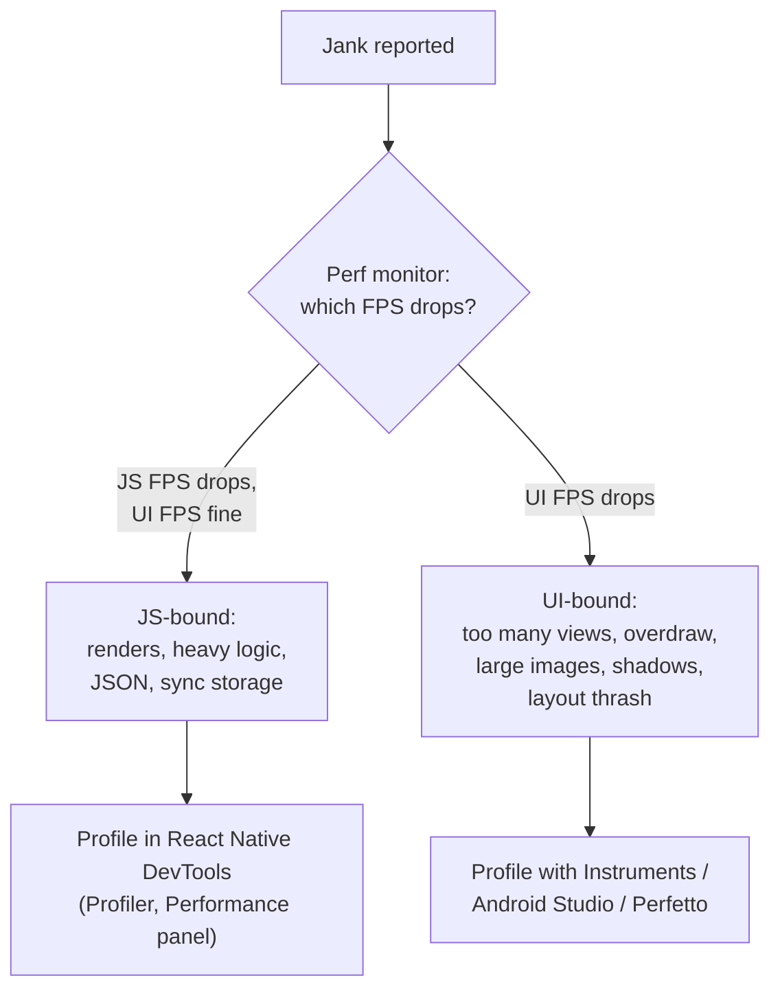
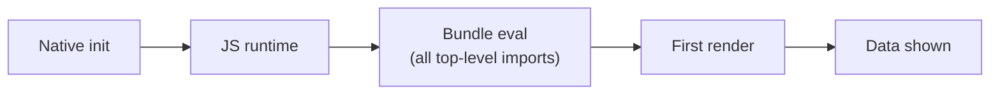

# 📘 Performance and Debugging

"Our app is slow, how would you fix it?" is the senior RN interview question.
The expected answer starts with **measuring** in a release build on a low-end device, then identifying which thread is the bottleneck, then applying targeted fixes.
This page is that process, plus the debugging tools you will use daily.

## Table of Contents

1. [Measure First](#1-measure-first)
2. [Which Thread Is Slow](#2-which-thread-is-slow)
3. [Re-renders](#3-re-renders)
4. [The React Compiler](#4-the-react-compiler)
5. [Lists and Images](#5-lists-and-images)
6. [Startup Time](#6-startup-time)
7. [Bundle and App Size](#7-bundle-and-app-size)
8. [Memory Leaks](#8-memory-leaks)
9. [Android-Specific Performance](#9-android-specific-performance)
10. [Debugging Tools](#10-debugging-tools)
11. [Crashes and Error Monitoring](#11-crashes-and-error-monitoring)
12. [Performance Checklist](#12-performance-checklist)
13. [Questions](#13-questions)

---

## 1. Measure First

- **Release builds only.**
  Development mode adds prop-type style checks, warnings, Fast Refresh, and unminified code; it can be several times slower.
- **Low-end Android device.**
  A three-year-old budget Android phone is where problems show; the iOS simulator on a laptop hides almost everything.
- Define metrics before optimizing:

| Metric | What it measures | Tooling |
| --- | --- | --- |
| **TTI / cold start** | Launch to usable first screen | Native markers, `react-native-performance`, Android vitals, Xcode Organizer |
| **FPS / frame drops** | Smoothness on JS and UI threads | Perf monitor overlay, Perfetto, Instruments |
| **Screen transition time** | Tap to next screen rendered | Custom markers, Flashlight |
| **Memory** | Peak and growth over a session | Xcode Memory Graph, Android Studio profiler |
| **App size** | Download and install size | Store reports, size analyzers |
| **ANR / crash rate** | Stability | Play Console, Sentry, Crashlytics |

**Flashlight** gives a Lighthouse-style performance score for Android apps and works well in CI to catch regressions.

---

## 2. Which Thread Is Slow



| JS thread problems | UI thread problems |
| --- | --- |
| Re-rendering large trees on every keystroke | Deep view hierarchies, many nested `View`s |
| Expensive computation in render | Overdraw: stacked opaque backgrounds, transparency |
| Parsing large JSON responses | Decoding large images on the main thread |
| Synchronous storage reads on hot paths | Many shadows (especially on Android) |
| Too many timers, intervals, listeners | Animations of layout properties |
| Logging (`console.log`) in hot loops in production | Text-heavy layouts re-measured often |

Strip `console.*` calls from release bundles with `babel-plugin-transform-remove-console` or a logger that no-ops in production.

---

## 3. Re-renders

Re-renders cost more on mobile because the JS thread is shared with all app logic and devices are slower.

Common causes and fixes:

| Cause | Fix |
| --- | --- |
| Parent state change re-renders all children | Move state down, split components, `React.memo` |
| New object, array, or function props each render | Stable references (`useMemo`, `useCallback`) or the React Compiler |
| Big Context value changes | Split contexts, or use a store with selectors (Zustand, Redux) |
| Subscribing to a whole store | Select the minimum: `useStore((s) => s.cart.count)` |
| Storing high-frequency values in state (scroll position, animation progress) | Shared values or refs instead of state |
| Hidden screens re-rendering | `freezeOnBlur` in React Navigation |

Find them with the **React DevTools Profiler** in React Native DevTools ("Highlight updates when components render", and "Why did this render?" in the flamegraph).

---

## 4. The React Compiler

The **React Compiler** is a Babel plugin that automatically memoizes components and hooks at build time.

- It analyzes code that follows the Rules of React and inserts fine-grained memoization, so most manual `useMemo`, `useCallback`, and `React.memo` become unnecessary.
- Supported on React Native and enabled by default in new Expo projects in recent SDKs.
- It **skips** components that break the Rules of React (mutating props, reading refs during render); the ESLint plugin reports these.
- It does not fix algorithmic problems, huge lists without virtualization, or slow native views.

```js
// babel.config.js (bare RN)
module.exports = {
  presets: ['module:@react-native/babel-preset'],
  plugins: ['babel-plugin-react-compiler'],   // must run first
};
```

Interview angle: "Do you still need `useCallback`?" Mostly no with the compiler, but you need to understand why it exists (reference equality for memoized children, effect dependencies) to debug the cases the compiler skips.

---

## 5. Lists and Images

Lists: see [Lists, State, and Data](/docs/react-native/lists-state-and-data#3-tuning-flatlist) for virtualization tuning, memoized rows, and FlashList.

Images are the most common cause of memory crashes:

| Problem | Fix |
| --- | --- |
| Downloading 4000 px images for 100 pt thumbnails | Request resized images from a CDN (width parameter matching layout times pixel ratio) |
| No caching | `expo-image` with memory and disk cache |
| Decoding many large images at once | Smaller images, `recyclingKey` / recycling lists, placeholders |
| GIFs and huge PNGs | WebP / AVIF, video for long animations |
| Layout jumps when images load | Fixed dimensions or `aspectRatio` with blurhash or thumbhash placeholders |

---

## 6. Startup Time



| Technique | Effect |
| --- | --- |
| Hermes bytecode (default) | No JS parse at startup |
| **Lazy imports / inline requires** | Only evaluate modules when first used (Metro supports `inlineRequires`) |
| Avoid top-level side effects | Do not initialize SDKs, read storage, or build large objects at import time |
| Defer non-critical SDKs | Init analytics and crash reporting after first frame (crash reporting as early as possible) |
| Lazy screens and tabs | Load code for screens the user has not opened yet on demand |
| Cache-first rendering | Show persisted data (MMKV, SQLite, persisted query cache) immediately |
| Keep the splash screen until ready | Avoid a blank flash, but do not hide slow startup behind a long splash |
| Native side | Avoid heavy work in `Application.onCreate` / `AppDelegate`; Android Baseline Profiles help native startup |
| Precompiled iOS builds | RN ships precompiled iOS dependencies, which speeds up **build** time (not runtime) |

Barrel files (`index.ts` re-exporting everything) can force the evaluation of whole libraries at startup; import from specific paths or rely on tree-shaking support in Metro and Expo.

---

## 7. Bundle and App Size

- Analyze the JS bundle with `react-native-bundle-visualizer` or Expo Atlas (`EXPO_ATLAS=1 npx expo start`).
- Replace heavy libraries: `moment` with `date-fns` or `Intl`, full `lodash` with per-method imports, large icon fonts with only the icons you use.
- Android: ship **App Bundles (AAB)** so Play delivers per-ABI and per-density splits; enable R8 minification and resource shrinking.
- iOS: App Thinning delivers per-device assets; strip unused architectures and debug symbols from the binary (upload dSYMs separately).
- Remote assets and fonts you rarely use instead of bundling everything.

---

## 8. Memory Leaks

| Leak | Fix |
| --- | --- |
| Listeners not removed (`AppState`, `Keyboard`, `Dimensions`, native emitters) | Return a cleanup that calls `.remove()` |
| Timers and intervals left running | Clear in cleanup, pause on blur |
| Stale closures holding large data | Avoid capturing big objects in long-lived callbacks |
| Unbounded caches (images, query cache, in-memory arrays) | Limits and `gcTime`; trim on memory warnings |
| Screens never popped (`push` loops) | Reset stacks after long flows |
| Native views (maps, video, camera) not released | Unmount or pause them when hidden |

Tools: Hermes heap snapshots and allocation timelines in React Native DevTools (Memory panel), Xcode Instruments (Leaks, Allocations), Android Studio Memory Profiler and LeakCanary for native leaks.

---

## 9. Android-Specific Performance

Android is usually the harder platform because of device diversity.

- **Overdraw**: enable "Debug GPU overdraw" in developer options; remove redundant backgrounds.
- **Shadows and elevation** are costly when stacked; use them sparingly in lists.
- **Text rendering** and custom fonts are slower; avoid re-measuring large text blocks.
- **ANRs** (App Not Responding) happen when the main thread is blocked for about 5 seconds; often caused by heavy native SDK work on startup or sync disk I/O.
- Test on **low-RAM devices** where the OS kills background apps and the app process often restarts.
- Use **Android vitals** in Play Console for real-world ANR, crash, and slow-frame rates.

---

## 10. Debugging Tools

| Tool | Use |
| --- | --- |
| **React Native DevTools** (press `j` in Metro) | Chrome DevTools-based debugger for Hermes: breakpoints, console, React Components and Profiler, memory, network and performance panels in recent versions |
| Dev menu (shake, `Cmd+D` / `Cmd+M`) | Reload, perf monitor overlay, element inspector |
| LogBox | In-app warnings and errors with stack traces |
| Expo dev tools plugins | Inspect React Query, storage, navigation state, network in the dev client |
| Reactotron | Inspect state, API calls, and logs |
| **Xcode** (Instruments, Memory Graph, View Debugger) | iOS native performance, leaks, native crashes |
| **Android Studio** (Logcat, Profiler, Layout Inspector) | Android native logs, CPU, memory |
| **Perfetto / systrace** | System-wide traces across JS, UI, and render threads on Android |
| Flipper | **Removed** from the RN template (0.74); replaced by React Native DevTools and Expo tools |
| Remote JS debugging in Chrome | **Removed**; it ran JS in Chrome's V8 instead of on the device and hid real performance |

Debugging native crashes: read `adb logcat` on Android and the Xcode console or crash logs on iOS; JS stack traces will not show native exceptions.

---

## 11. Crashes and Error Monitoring

```tsx
// Catch render errors per screen so one broken widget does not kill the app.
<ErrorBoundary fallback={<ErrorScreen onRetry={reset} />}>
  <Feed />
</ErrorBoundary>
```

- **JS errors**: error boundaries for render errors, a global handler for unhandled exceptions and promise rejections.
- **Native crashes**: need a native SDK (Sentry, Crashlytics, Bugsnag) that captures signals and exceptions on both platforms.
- **Source maps**: upload the Hermes source maps for each release (and dSYMs / ProGuard mappings) or stack traces are unreadable.
- Tag reports with the **app version and OTA update ID**, since one binary can run several JS bundles.
- Track **ANRs, app hangs, and slow and frozen frames**, not only crashes.

---

## 12. Performance Checklist

1. Profile release builds on a low-end Android device.
2. Identify the slow thread before changing code.
3. Virtualize long lists; memoize rows; prefer FlashList for heavy feeds.
4. Enable the React Compiler; split contexts; select narrowly from stores.
5. Run animations and gestures on the UI thread (Reanimated, Gesture Handler).
6. Size, cache, and compress images.
7. Lazy-load modules and screens; avoid top-level side effects.
8. Cache data locally for instant startup.
9. Remove `console.log` and dev-only code from release builds.
10. Monitor crashes, ANRs, startup, and slow frames in production, and alert on regressions.

---

## 13. Questions

**Q: The app is slow. Walk me through how you would fix it.**
Reproduce in a release build on a low-end device, define the metric (startup, scroll FPS, transition time), use the perf monitor to see whether JS or UI FPS drops, profile that thread (React DevTools Profiler and Hermes profiles for JS, Instruments / Android profiler / Perfetto for native), fix the top offender, measure again, and add a regression check.

**Q: How do you prevent unnecessary re-renders?**
Keep state close to where it is used, split contexts, subscribe to minimal store slices, keep props referentially stable (React Compiler or memo hooks), memoize expensive children, and keep per-frame values out of React state.

**Q: How do you improve cold start time?**
Hermes bytecode, lazy imports and inline requires, no work at module top level, deferred SDK initialization, lazy screens, cache-first rendering, and reducing native startup work.

**Q: Why should you not judge performance in development mode?**
Dev builds run extra checks, warnings, and unoptimized code, and include debugging overhead, so they are much slower and do not reflect what users see.

**Q: What replaced Flipper and Chrome remote debugging?**
React Native DevTools, which connects directly to Hermes on the device through the Chrome DevTools Protocol, so debugging reflects real runtime behavior.

**Q: How do you debug a crash that only happens in production?**
Use crash reporting with uploaded source maps and native symbols, check the app version and OTA update ID, read breadcrumbs, reproduce with a release build of the same bundle, and check native logs for native exceptions.
