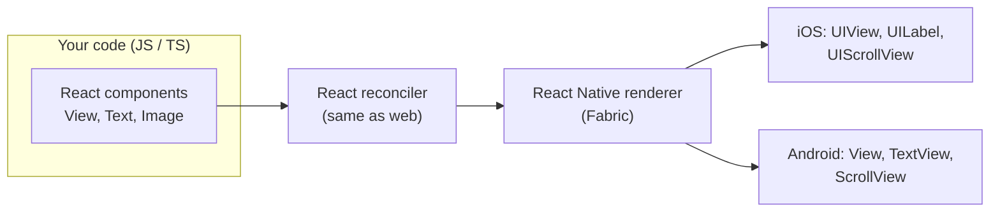

# 📘 React Native Fundamentals

React Native (RN) lets you write a mobile app in React and JavaScript or TypeScript, and renders **real native views** (`UIView` on iOS, `android.view.View` on Android), not a web view.
If you know React, you already know the component model, hooks, and state.
What changes is everything below the component: no DOM, no CSS cascade, different layout defaults, a different build and release pipeline, and two platforms with their own rules.
This page covers what a React developer has to unlearn and learn first.
Read [React Core Concepts](/docs/react/react-core-concepts) if hooks and reconciliation are new to you.

## Table of Contents

1. [What React Native Is](#1-what-react-native-is)
2. [React Native vs the Alternatives](#2-react-native-vs-the-alternatives)
3. [Expo vs Bare React Native](#3-expo-vs-bare-react-native)
4. [Project Anatomy](#4-project-anatomy)
5. [Core Components](#5-core-components)
6. [Styling](#6-styling)
7. [Layout with Flexbox](#7-layout-with-flexbox)
8. [Text, Images, and Touch](#8-text-images-and-touch)
9. [Platform-Specific Code](#9-platform-specific-code)
10. [Screens, Safe Areas, and Dimensions](#10-screens-safe-areas-and-dimensions)
11. [Keyboard and Forms](#11-keyboard-and-forms)
12. [Common Mistakes from Web Developers](#12-common-mistakes-from-web-developers)
13. [Questions](#13-questions)

---

## 1. What React Native Is



- **Same React:** components, props, state, hooks, context, Suspense, and transitions all work the same way.
- **Different host components:** instead of `div` and `span` you render `View` and `Text`, which RN maps to native views.
- **JavaScript runs in an engine embedded in the app**, which is **Hermes** by default.
  It is not a browser, so there is no `window.document`, no CSS, and no HTML.
- **"Learn once, write anywhere"**, not "write once, run anywhere": most code is shared, but platform differences are expected and handled explicitly.
- Meta, Microsoft, Shopify, Discord, Coinbase, and many others ship RN apps, and Microsoft maintains RN for Windows and macOS.

### 1.1 What you get and what you give up

| You get | You give up |
| --- | --- |
| One codebase for iOS and Android (often 85 to 95 percent shared) | Some native polish needs platform code |
| React skills and the npm ecosystem | Not every web library works (anything touching the DOM) |
| Native UI, native scrolling, native text input | A JS engine and bundle add startup and memory cost |
| Over-the-air updates of JS without store review | Two native build systems (Xcode and Gradle) to understand eventually |
| Fast refresh during development | Upgrades across RN versions can be real work |

---

## 2. React Native vs the Alternatives

| | React Native | Flutter | Native (Swift / Kotlin) | Web view / PWA (Capacitor, Ionic) |
| --- | --- | --- | --- | --- |
| Language | JS / TS | Dart | Swift, Kotlin | HTML, CSS, JS |
| UI | **Platform native views** | Own rendering engine (Impeller) draws every pixel | Platform native | DOM inside a web view |
| Look and feel | Native by default | Consistent across platforms, must imitate native | Native | Web-like |
| Code sharing with web | High (React, business logic, React Native Web) | Low | None | Very high |
| Performance ceiling | High, with native modules for hot paths | High | Highest | Lowest for complex UI |
| Over-the-air updates | Yes (JS bundle) | Limited | No | Yes |
| Hiring pool | Very large (React developers) | Medium | Separate iOS and Android teams | Very large |

How to answer "why React Native?" in an interview:

- Pick RN when the team knows React, you want shared logic with a web app, and the app is mostly forms, lists, feeds, and navigation.
- Pick native when the app is dominated by platform-specific features (advanced camera, AR, deep OS integration, watch apps) or extreme performance needs.
- Pick Flutter when pixel-identical custom UI across platforms matters more than native look, and the team is fine with Dart.
- Many companies mix: RN screens inside a native app (**brownfield**), or native modules inside an RN app.

---

## 3. Expo vs Bare React Native

The React Native docs recommend starting new apps with a **framework**, and Expo is that framework.
"Expo vs bare" used to be a big decision; today it mostly is not.

| | Expo (with dev builds and CNG) | Bare React Native (Community CLI) |
| --- | --- | --- |
| Create | `npx create-expo-app@latest` | `npx @react-native-community/cli init` |
| Native folders | Generated from `app.json` / `app.config.ts` by `npx expo prebuild` (Continuous Native Generation) | Committed and edited by hand |
| Custom native code | Yes, via **config plugins** and the Expo Modules API | Yes, directly |
| Routing | Expo Router (file-based) built in | Bring your own (usually React Navigation) |
| Build and deploy | EAS Build, Submit, Update (or local builds) | Xcode, Gradle, Fastlane, your own CI |
| Upgrades | Bump the SDK, regenerate native folders | Upgrade Helper diffs applied by hand |

- **Expo Go** is a sandbox app from the store that runs your JS with a fixed set of native modules.
  It is fine for learning, but real projects use a **development build**, which is your own app binary with your own native modules plus the Expo dev client.
- "Expo means you cannot write native code" is outdated.
  You can add any native library or write your own module; prebuild regenerates the `ios/` and `android/` folders from config so they never drift.
- Each **Expo SDK** pins a specific React Native version, and the libraries in it are tested together, which removes most upgrade pain.

---

## 4. Project Anatomy

```text
my-app/
  app/                 # Expo Router screens (file-based routes)
    _layout.tsx
    index.tsx
  components/
  assets/
  app.json             # Expo config: name, icons, permissions, plugins
  package.json
  metro.config.js      # bundler config
  babel.config.js
  ios/                 # generated (CNG) or hand-maintained (bare)
  android/
```

- **Metro** is the JS bundler.
  It serves the bundle to the app in development and produces a single bundle (Hermes bytecode in release) for production.
- **Fast Refresh** keeps component state across edits; editing a file that exports non-components triggers a full reload.
- `index.js` (or the Expo Router entry) calls `AppRegistry.registerComponent`, which is how native code finds the root component.
- **Native code changes** (new native library, permission, icon) require a **new binary build**; JS changes only need a reload.

---

## 5. Core Components

| RN component | Closest web equivalent | Notes |
| --- | --- | --- |
| `View` | `div` | The basic container, Flexbox by default |
| `Text` | `span` / `p` | **All text must be inside `Text`** |
| `Image` | `img` | Needs explicit size for network images |
| `TextInput` | `input`, `textarea` | Controlled or uncontrolled, `multiline` for textarea |
| `ScrollView` | Scrollable `div` | Renders **all** children at once |
| `FlatList`, `SectionList` | Virtualized list | Renders only what is near the viewport |
| `Pressable` | `button` | Modern touch handling with pressed state |
| `Modal` | Dialog | Native modal presentation |
| `Switch`, `ActivityIndicator` | Checkbox toggle, spinner | Native look per platform |
| `KeyboardAvoidingView` | None | Moves content when the keyboard opens |

```tsx
import { View, Text, Pressable, StyleSheet } from 'react-native';

export function Counter() {
  const [count, setCount] = useState(0);
  return (
    <View style={styles.row}>
      <Text style={styles.label}>Count: {count}</Text>
      <Pressable
        onPress={() => setCount((c) => c + 1)}
        style={({ pressed }) => [styles.button, pressed && styles.pressed]}
        accessibilityRole="button"
        hitSlop={8}
      >
        <Text style={styles.buttonText}>Add</Text>
      </Pressable>
    </View>
  );
}

const styles = StyleSheet.create({
  row: { flexDirection: 'row', alignItems: 'center', gap: 12, padding: 16 },
  label: { fontSize: 18 },
  button: { backgroundColor: '#2563eb', paddingHorizontal: 16, paddingVertical: 10, borderRadius: 8 },
  pressed: { opacity: 0.7 },
  buttonText: { color: 'white', fontWeight: '600' },
});
```

- `TouchableOpacity` and friends still work, but `Pressable` is the recommended API.
- `hitSlop` enlarges the touch target without changing layout; aim for about 44 by 44 points (iOS) or 48 by 48 dp (Android).

---

## 6. Styling

Styles are JavaScript objects, not CSS.

| Web CSS | React Native |
| --- | --- |
| Cascade and selectors | **None.** Each component gets its own `style` prop |
| Inheritance | Only text styles, and only from a parent `Text` to nested `Text` |
| Units: `px`, `rem`, `%`, `vh` | Unitless numbers are **density-independent pixels** (points / dp); percentages work for sizes |
| `kebab-case` | `camelCase` (`backgroundColor`) |
| `display: block` default | Every `View` is `display: flex` |
| Media queries | `useWindowDimensions()` and conditional styles |
| `:hover`, `:active` | `Pressable` state callback |

```tsx
// Arrays merge left to right, falsy entries are ignored.
<View style={[styles.card, isActive && styles.active, { marginTop: insets.top }]} />
```

- `StyleSheet.create` validates styles in development and gives a stable object; inline objects work too but create new references each render.
- Shadows differ by platform: iOS uses `shadowColor`, `shadowOffset`, `shadowOpacity`, `shadowRadius`, Android used `elevation`.
  The New Architecture added the web-style `boxShadow` and `filter` props that work on both.
- Popular styling options: plain `StyleSheet`, **NativeWind** (Tailwind classes compiled to RN styles), **Unistyles** (themes and breakpoints in C++), **Tamagui** (compiler-optimized design system).

---

## 7. Layout with Flexbox

RN uses **Yoga**, a C++ Flexbox engine shared by both platforms.
It is close to CSS Flexbox, with different defaults:

| Property | Web default | React Native default |
| --- | --- | --- |
| `flexDirection` | `row` | **`column`** |
| `alignContent` | `normal` / `stretch` | `flex-start` |
| `flexShrink` | `1` | **`0`** |
| `position` | `static` | **`relative`** (no `static` in older versions) |
| `box-sizing` | `content-box` | `border-box` |

```tsx
// Full-screen column: header, scrollable body, footer pinned at the bottom.
<View style={{ flex: 1 }}>
  <Header />
  <View style={{ flex: 1 }}>{/* takes the remaining space */}</View>
  <Footer />
</View>
```

- `flex: 1` on a child means "grow to fill the free space along the main axis".
  A screen root without `flex: 1` collapses to its content height, a very common bug.
- `gap`, `rowGap`, and `columnGap` are supported.
- `position: 'absolute'` positions relative to the parent, there is no `fixed`.
- Text does not wrap inside a row unless the `Text` (or its container) can shrink: add `flexShrink: 1` or `flex: 1` to the text.

---

## 8. Text, Images, and Touch

### 8.1 Text rules

- **Raw strings outside `<Text>` crash** with "Text strings must be rendered within a `<Text>` component".
  The classic trigger is `{count && <Badge />}` when `count` is `0`: the `0` is rendered as a raw string.
  Use `{count > 0 && <Badge />}` or a ternary.
- Nested `Text` inherits styles and lays out inline; a `View` inside `Text` is limited.
- `numberOfLines` with `ellipsizeMode` truncates.
- Respect the user's font scale: `allowFontScaling` is on by default, use `maxFontSizeMultiplier` to cap it instead of turning it off.
- Custom fonts are loaded with `expo-font` or linked as native assets; on Android, the `fontWeight` only works if a matching font file exists.

### 8.2 Images

```tsx
<Image source={require('./logo.png')} style={{ width: 120, height: 40 }} />           // bundled, size known
<Image source={{ uri: 'https://cdn.example.com/a.jpg' }} style={{ width: 300, height: 200 }} />  // network: must size
```

- Bundled images support `@2x` and `@3x` variants and are resolved by Metro at build time.
- Network images have no intrinsic size in layout; give width and height or `aspectRatio`.
- Production apps usually use **`expo-image`** (disk and memory caching, blurhash placeholders, transitions) or a cached image library instead of the core `Image`.
- SVGs need `react-native-svg` (and a transformer to import `.svg` files).

### 8.3 Touch

- Use `Pressable` for buttons, `onLongPress` for long presses.
- Complex gestures (swipe, pinch, drag) use **React Native Gesture Handler**, covered in [Animations and Gestures](/docs/react-native/animations-and-gestures).

---

## 9. Platform-Specific Code

```tsx
import { Platform } from 'react-native';

const styles = StyleSheet.create({
  card: {
    ...Platform.select({
      ios: { shadowColor: '#000', shadowOpacity: 0.1, shadowRadius: 8 },
      android: { elevation: 3 },
      default: {},
    }),
  },
});

if (Platform.OS === 'android' && Platform.Version >= 33) {
  // Android 13+ runtime notification permission
}
```

- **File extensions:** `Button.ios.tsx` and `Button.android.tsx` are picked automatically by Metro when you `import Button from './Button'`.
  `.native.tsx` vs `.web.tsx` splits native from React Native Web.
- Keep platform branches at the edges (a small component or hook), not scattered through business logic.

Behavior differences worth naming in interviews:

| Area | iOS | Android |
| --- | --- | --- |
| Back navigation | Swipe from the left edge | Hardware or gesture back, must be handled (`BackHandler`) |
| Permissions | Asked once, then only Settings can change | Can ask again; "don't ask again" state exists |
| Shadows | Shadow props | `elevation` (or `boxShadow` on the New Architecture) |
| Status bar and system bars | Always drawn over content | Edge-to-edge is now enforced on recent Android versions |
| Default fonts | San Francisco | Roboto |
| Push | APNs | FCM |

---

## 10. Screens, Safe Areas, and Dimensions

```tsx
import { useWindowDimensions } from 'react-native';
import { useSafeAreaInsets } from 'react-native-safe-area-context';

function Screen({ children }) {
  const { width } = useWindowDimensions();      // updates on rotation, split screen, foldables
  const insets = useSafeAreaInsets();           // notch, Dynamic Island, home indicator, system bars
  const columns = width >= 768 ? 3 : 1;
  return <View style={{ flex: 1, paddingTop: insets.top, paddingBottom: insets.bottom }}>{children}</View>;
}
```

- Prefer `useWindowDimensions()` over `Dimensions.get()`, which is a snapshot and does not re-render on change.
- Use **`react-native-safe-area-context`**.
  The built-in `SafeAreaView` was iOS-only and is deprecated.
- Android apps now render **edge-to-edge** (content behind the status and navigation bars), required by recent Android target SDKs, so safe area insets matter on Android too.
- Sizes are in points / dp; `PixelRatio.get()` gives the device scale when you need physical pixels.

---

## 11. Keyboard and Forms

```tsx
<KeyboardAvoidingView behavior={Platform.OS === 'ios' ? 'padding' : 'height'} style={{ flex: 1 }}>
  <ScrollView keyboardShouldPersistTaps="handled">
    <TextInput
      value={email}
      onChangeText={setEmail}
      placeholder="Email"
      keyboardType="email-address"
      autoCapitalize="none"
      autoComplete="email"
      textContentType="emailAddress"
      returnKeyType="next"
      onSubmitEditing={() => passwordRef.current?.focus()}
    />
  </ScrollView>
</KeyboardAvoidingView>
```

- `keyboardShouldPersistTaps="handled"` lets a tap on a button submit while the keyboard is open, instead of only dismissing the keyboard.
- `Keyboard.dismiss()` closes it; wrap the screen in a `Pressable` with `onPress={Keyboard.dismiss}` for tap-outside-to-dismiss.
- `KeyboardAvoidingView` is fiddly with headers and tabs; many teams use **`react-native-keyboard-controller`** for consistent behavior and keyboard-synced animations.
- `textContentType` (iOS) and `autoComplete` (Android) enable password managers and one-time-code autofill.
- Forms at scale: React Hook Form plus Zod works the same as on the web, using `Controller` for `TextInput`.

---

## 12. Common Mistakes from Web Developers

| Mistake | Fix |
| --- | --- |
| Using `div`, `span`, `onClick`, `className` | `View`, `Text`, `onPress`, `style` (or NativeWind) |
| Text outside `<Text>`, or `{0 && ...}` | Wrap all text, use explicit booleans |
| Screen root without `flex: 1` | Give the root container `flex: 1` |
| `ScrollView` with hundreds of items | `FlatList` or FlashList (virtualized) |
| Network image with no size | Set width and height or `aspectRatio` |
| Assuming `fetch` sends cookies like a browser | Store and send tokens explicitly |
| Secrets in the JS bundle | The bundle is readable; keep secrets on the server |
| Ignoring Android back button and edge-to-edge | Handle `BackHandler`, use safe area insets |
| Testing only on a high-end iPhone simulator | Test release builds on a low-end Android device |
| Debugging performance in development mode | Dev mode is much slower; profile release builds |

---

## 13. Questions

**Q: Does React Native use a web view?**
No.
Components render to real platform views; JavaScript runs in Hermes and talks to native code through JSI.
Web views exist only if you explicitly use `react-native-webview`.

**Q: What is the difference between React and React Native?**
React is the component and reconciliation library.
React DOM renders to the browser DOM; React Native renders to native views.
Hooks, state, and patterns are shared; host components, styling, layout defaults, and tooling differ.

**Q: Why is `flexDirection` `column` by default?**
Mobile screens are tall and most layouts stack vertically, so Yoga picks column, and `flexShrink` defaults to `0` to match older RN behavior.

**Q: Expo or React Native CLI for a new project?**
Expo with development builds, unless there is a specific reason not to.
It is the officially recommended framework, still allows any native code through config plugins and modules, and reduces upgrade and build work.

**Q: How do you write different code for iOS and Android?**
`Platform.OS` and `Platform.select` for small differences, `.ios.tsx` / `.android.tsx` files for larger ones, and native modules when the behavior lives in native code.

**Q: Why does `{items.length && <List />}` crash?**
When the length is `0`, React renders the number `0` as text outside a `Text` component, which RN rejects.
Use `items.length > 0 && ...`.
