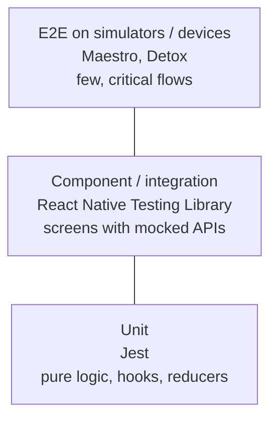
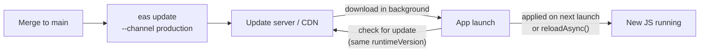
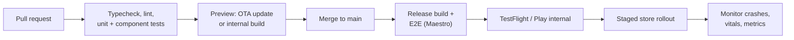

# 📘 Testing, Build, and Release

Shipping mobile is different from shipping web.
A web deploy reaches every user in seconds and can be rolled back instantly.
A mobile release goes through **store review**, users update on their own schedule, and old versions stay in the wild for months.
This page covers how to test, build, sign, release, and update RN apps safely, plus the security and accessibility basics that reviewers and interviewers check.

## Table of Contents

1. [Testing Pyramid](#1-testing-pyramid)
2. [Unit and Component Tests](#2-unit-and-component-tests)
3. [End-to-End Tests](#3-end-to-end-tests)
4. [Debug vs Release Builds](#4-debug-vs-release-builds)
5. [Signing](#5-signing)
6. [EAS Build and Submit](#6-eas-build-and-submit)
7. [Over-the-Air Updates](#7-over-the-air-updates)
8. [Versioning and Environments](#8-versioning-and-environments)
9. [CI/CD Pipeline](#9-cicd-pipeline)
10. [Store Review and Rollouts](#10-store-review-and-rollouts)
11. [Security](#11-security)
12. [Accessibility](#12-accessibility)
13. [Upgrading React Native](#13-upgrading-react-native)
14. [Questions](#14-questions)

---

## 1. Testing Pyramid



| Layer | Tool | Tests | Speed |
| --- | --- | --- | --- |
| Static | TypeScript, ESLint | Types, Rules of React, hooks rules | Instant |
| Unit | **Jest** | Utils, reducers, hooks, formatting, validation | Milliseconds |
| Component | **React Native Testing Library (RNTL)** | Rendering, user interactions, screen logic with mocked network (MSW) | Fast |
| E2E | **Maestro** or **Detox** | Login, checkout, onboarding on a real app binary | Minutes |
| Manual / beta | TestFlight, Play internal testing | Real devices, real networks | Days |

---

## 2. Unit and Component Tests

```tsx
import { render, screen, userEvent } from '@testing-library/react-native';

test('adds an item to the cart', async () => {
  const user = userEvent.setup();
  render(<ProductScreen product={product} />);

  await user.press(screen.getByRole('button', { name: 'Add to cart' }));

  expect(await screen.findByText('1 item in cart')).toBeOnTheScreen();
});
```

- RNTL renders components in Jest (no device) and queries them **the way users find them**: by role, label, and text, not by test IDs or implementation details.
- `jest-expo` or the `react-native` Jest preset configures transforms and mocks.
- **Mock native modules** that have no JS implementation (`jest.mock('react-native-mmkv')`, camera, location); most libraries ship Jest mocks.
- Mock the network at the HTTP level with **MSW**, so tests exercise your real data layer.
- Fake timers for debounce and animations; Reanimated provides test utilities.
- Avoid snapshot tests of whole screens: they break constantly and rarely catch real bugs.

---

## 3. End-to-End Tests

| | **Maestro** | **Detox** |
| --- | --- | --- |
| Test format | YAML flows | JavaScript / TypeScript with Jest |
| Approach | Black-box: drives the UI through accessibility, with automatic waiting | Gray-box: syncs with the app's JS thread, network, and animations to avoid flakiness |
| Setup | Very light, works on any built app | Needs native build config |
| Strength | Fast to write, readable, cloud runs | Deep synchronization, fine-grained control |

```yaml
# flows/login.yaml (Maestro)
appId: com.example.myapp
---
- launchApp:
    clearState: true
- tapOn: "Email"
- inputText: "test@example.com"
- tapOn: "Password"
- inputText: "correct-horse"
- tapOn: "Sign in"
- assertVisible: "Welcome back"
```

- Cover only **critical user journeys** with E2E: sign-up, login, purchase, core creation flow.
- Run against a **release-like build** with a seeded backend or mocked API server.
- Flakiness comes from timing, animations, network, and shared state; reset app state per test and avoid fixed sleeps.

---

## 4. Debug vs Release Builds

| | Debug | Release |
| --- | --- | --- |
| JS | Loaded from Metro over the network, unminified | Bundled into the app as Hermes bytecode, minified |
| Dev tools | Dev menu, LogBox, Fast Refresh, debugger | None |
| `__DEV__` | `true` | `false` |
| Performance | Much slower | Real performance |
| Native optimizations | Off | On (Swift / Clang optimizations, R8 on Android) |

Always test release builds before shipping: some bugs only exist there (minification issues, missing env variables, ProGuard / R8 stripping classes used via reflection, Hermes-specific behavior).

---

## 5. Signing

| | iOS | Android |
| --- | --- | --- |
| Identity | Apple Developer account, **certificates** (development, distribution) | **Upload key** (keystore) |
| App authorization | **Provisioning profiles** tie the app ID, certificate, and devices | Play App Signing: Google holds the app signing key |
| Store artifact | `.ipa` uploaded to App Store Connect | `.aab` uploaded to Play Console |
| Lose the key | Revoke and reissue certificates | With Play App Signing, request an upload key reset |

- Never commit keystores or certificates; store them in CI secrets or let **EAS manage credentials**.
- iOS **capabilities** (push, Sign in with Apple, associated domains, app groups) must be enabled on the App ID and present in the provisioning profile.

---

## 6. EAS Build and Submit

```json
// eas.json
{
  "build": {
    "development": { "developmentClient": true, "distribution": "internal" },
    "preview": { "distribution": "internal", "channel": "preview" },
    "production": { "channel": "production", "autoIncrement": true }
  },
  "submit": { "production": {} }
}
```

```bash
eas build --platform all --profile production
```

```bash
eas submit --platform ios --latest
```

- **EAS Build** compiles iOS and Android binaries in the cloud (no Mac needed for iOS builds), manages signing credentials, and caches dependencies.
- **Build profiles** define development builds (with dev client), internal preview builds for QA, and production builds.
- **EAS Submit** uploads to App Store Connect and Google Play.
- `eas build --local` or plain Xcode / Gradle with Fastlane are alternatives for teams that keep builds in-house.

---

## 7. Over-the-Air Updates

React Native can update the **JS bundle and assets** without a store release, because they are loaded at runtime.



| Can be updated OTA | Needs a new store build |
| --- | --- |
| JS / TS code, React components, styles | New native module or library with native code |
| Images and assets bundled with JS | Permission changes, Info.plist, AndroidManifest |
| Bug fixes in business logic | App icon, splash screen (native), entitlements |
| Copy and feature flags | RN or Expo SDK upgrade |

Key concepts:

- **Runtime version**: a fingerprint of the native layer.
  An update is only delivered to binaries with a matching runtime version, which prevents JS that expects a new native module from crashing an old binary.
  The `fingerprint` policy computes it automatically from native dependencies and config.
- **Channels and branches**: builds listen on a channel (`production`, `preview`); you point channels at branches of updates.
- **Rollouts and rollbacks**: release an update to a percentage of users, monitor crashes, roll back by republishing a previous update.
- **Store rules**: Apple allows downloaded interpreted code as long as it does not change the app's primary purpose or bypass review for new features; use OTA for fixes and incremental changes, not to ship a different app.
- **Microsoft CodePush / App Center was retired in March 2025**; EAS Update is the main hosted option, and self-hosted or other services also implement the Expo updates protocol.

Interview phrase: "OTA is for JS-only changes that are compatible with the installed native runtime, gated by runtime version, rolled out gradually with monitoring."

---

## 8. Versioning and Environments

| Field | iOS | Android | Purpose |
| --- | --- | --- | --- |
| User-facing version | `CFBundleShortVersionString` (1.4.0) | `versionName` (1.4.0) | Shown in the store |
| Build number | `CFBundleVersion` (412) | `versionCode` (412) | **Must increase** for every upload |

- Separate **bundle IDs** per environment (`com.example.app.dev`, `.staging`) so dev and prod builds can be installed side by side, with different icons.
- Environment variables are **inlined at build time** into the bundle: `EXPO_PUBLIC_*` variables in Expo, `react-native-config` in bare apps.
  Anything in the bundle is public, so no secrets.
- Feature flags (remote config) let you ship code dark and enable it without a release, which matters more on mobile because releases are slow.
- **Forced update**: have the app fetch a minimum supported version and block or prompt when the installed version is too old (for breaking API changes).

---

## 9. CI/CD Pipeline



- Use the **fingerprint** of native code to decide whether a change needs a new binary or can ship as an OTA update.
- Cache CocoaPods, Gradle, and node modules; iOS builds are the slowest step.
- Give PR reviewers a runnable preview (OTA update to a preview channel, or an internal build with a QR code).

---

## 10. Store Review and Rollouts

- **Apple App Review** typically takes about a day; common rejections are crashes, missing account deletion, login required without reason, unclear permission strings, broken links, and in-app purchase rule violations.
- **Google Play** review is usually faster but includes policy checks (data safety form, target SDK requirements, permissions).
- **Staged rollouts**: Play supports percentage rollouts and halting; App Store supports phased release over 7 days and pausing.
- Use **TestFlight** and **Play internal / closed testing** for betas.
- Digital goods sold in the app usually must use the platform's in-app purchase system (with regional exceptions); physical goods and services use normal payments.

---

## 11. Security

| Risk | Practice |
| --- | --- |
| **Secrets in the JS bundle** | The bundle can be extracted and read; keep API secrets on the server, proxy third-party calls |
| Token storage | Keychain / Keystore (`expo-secure-store`), never AsyncStorage |
| Man-in-the-middle | HTTPS only; certificate pinning for high-risk apps (banking), with a pin rotation plan |
| Deep link abuse | Validate params, require auth and confirmation for sensitive actions |
| Sensitive screens | Hide content in the app switcher, block screenshots where required (`FLAG_SECURE` on Android) |
| Rooted / jailbroken devices | Detection for high-risk apps, plus server-side checks; never trust the client |
| Device integrity | App Attest (iOS) and Play Integrity API (Android) to verify requests come from your genuine app |
| WebViews | Restrict origins, avoid exposing native bridges to untrusted content |
| Dependencies | Lockfiles, audit, avoid unmaintained native packages |
| Logging | No tokens or personal data in logs or crash reports |

The guiding rule: **the client is untrusted**.
All authorization, pricing, and validation decisions belong on the server.
See [Authentication and Security](/docs/backend/authentication-and-security) for the server side.

---

## 12. Accessibility

```tsx
<Pressable
  accessibilityRole="button"
  accessibilityLabel="Delete message"
  accessibilityHint="Removes this message permanently"
  accessibilityState={{ disabled: isDeleting }}
  onPress={onDelete}
>
  <TrashIcon />
</Pressable>
```

- Every interactive element needs a **role** and a **label**, especially icon-only buttons.
- Test with **VoiceOver** (iOS) and **TalkBack** (Android); they behave differently.
- Support **Dynamic Type / font scaling**: layouts must not break at large text sizes.
- Touch targets of at least 44 by 44 points (iOS) / 48 by 48 dp (Android).
- Respect **reduce motion** (`AccessibilityInfo.isReduceMotionEnabled`, Reanimated `ReduceMotion`).
- Sufficient color contrast; never rely on color alone.
- Group related elements (`accessible` on a container) so screen readers announce a card as one item.

---

## 13. Upgrading React Native

- RN ships a new minor version roughly every two months, and the community supports only the latest few.
- **Expo**: upgrade one SDK at a time (`npx expo install expo@^NN` then `npx expo install --fix`), regenerate native folders, read the changelog.
- **Bare**: use the **React Native Upgrade Helper** to see the template diff between versions and apply it manually.
- Upgrade **one minor version at a time** for large jumps, check that native libraries support the new version, and test release builds on both platforms.
- Recent upgrade themes: New Architecture migration, Android edge-to-edge enforcement and target SDK bumps, deprecations of deep imports from `react-native/Libraries/...` in favor of the public API.

---

## 14. Questions

**Q: How do you test a React Native app?**
TypeScript and ESLint for static checks, Jest for logic, React Native Testing Library for components and screens with mocked network, and a small set of Maestro or Detox E2E tests on release builds for critical flows, plus beta testing on real devices.

**Q: What can and cannot be shipped as an OTA update?**
JS code and bundled assets can, as long as they work with the installed native runtime.
Anything that changes native code, native config, permissions, or the RN / SDK version needs a new store build.
Runtime versions enforce this.

**Q: How do you roll back a bad release?**
For an OTA update, republish or roll back to the previous update on the channel, ideally after a staged rollout caught it early.
For a binary, halt the staged rollout and ship a fix; you cannot pull an installed version from users' devices, which is why remote kill switches and feature flags matter.

**Q: Where do you keep API keys in a mobile app?**
Anything shipped in the app is extractable, so real secrets stay on the server.
Public, restricted keys (for example a maps key restricted by bundle ID) can ship; private keys go behind your backend.

**Q: Detox vs Maestro?**
Detox is a gray-box JS framework that synchronizes with the app's internal state to reduce flakiness; Maestro is a black-box YAML tool that is very quick to write and runs on any build.
Both are fine for critical flows; pick by team preference and CI setup.

**Q: How do you handle a breaking API change when users run old app versions?**
Version the API and keep old versions working for a window, use feature flags, and implement a minimum supported version check that prompts or forces users to update.
