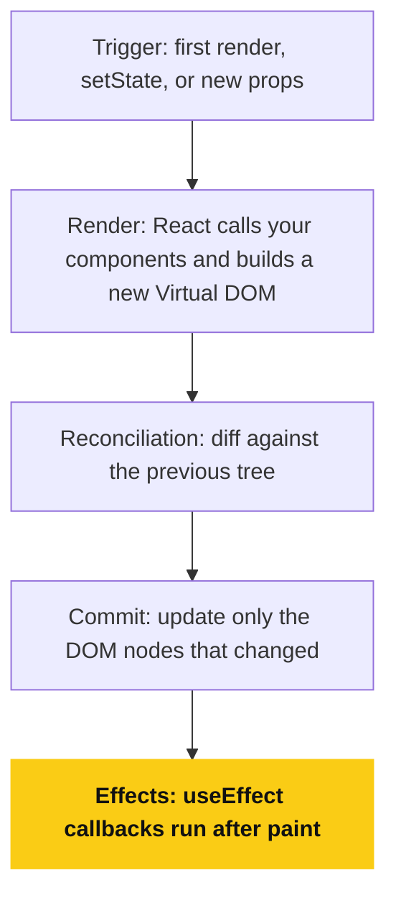
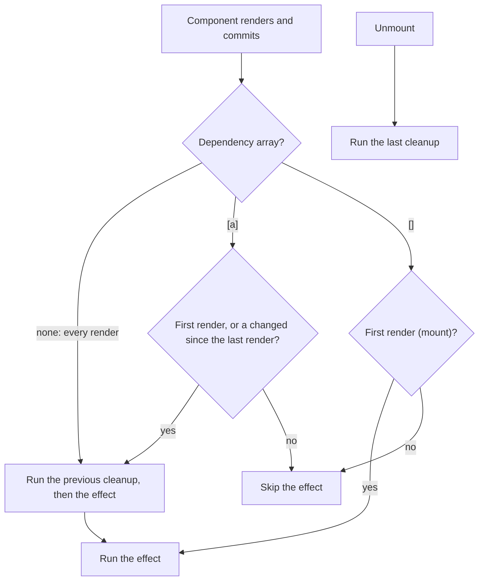
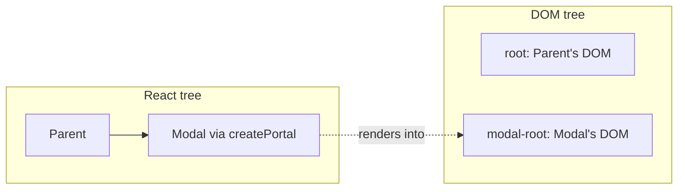
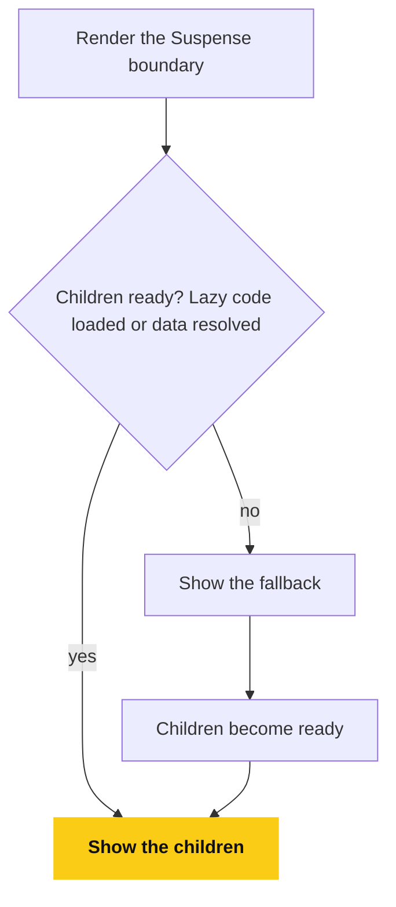
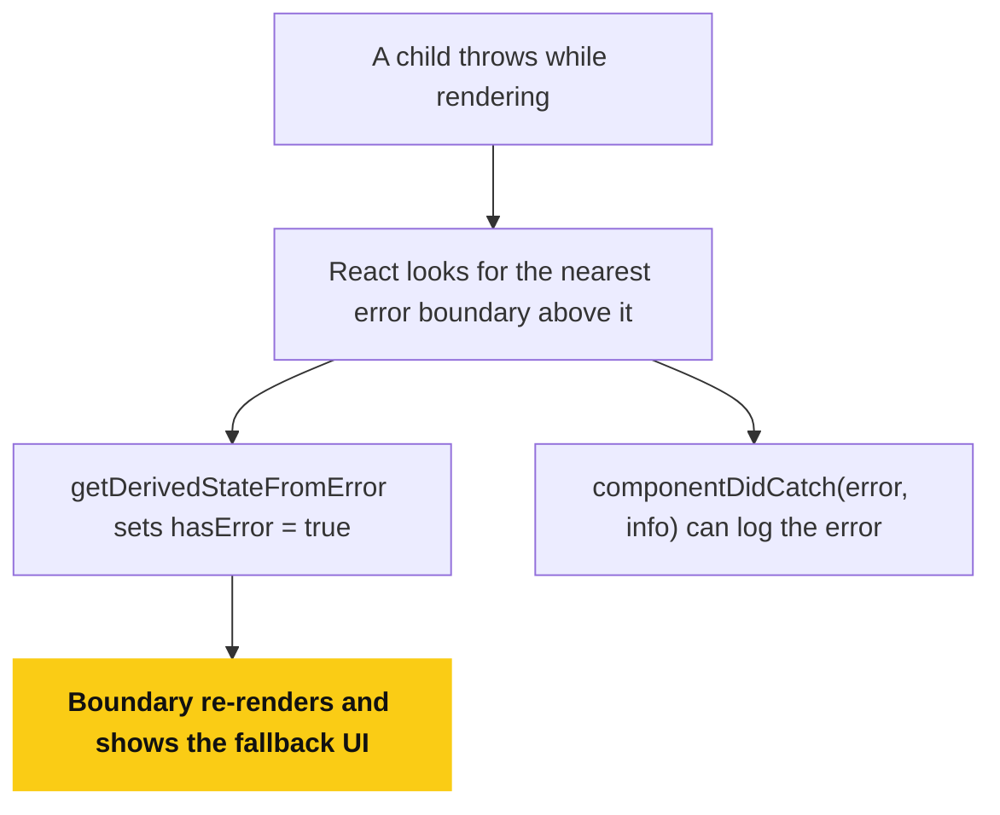
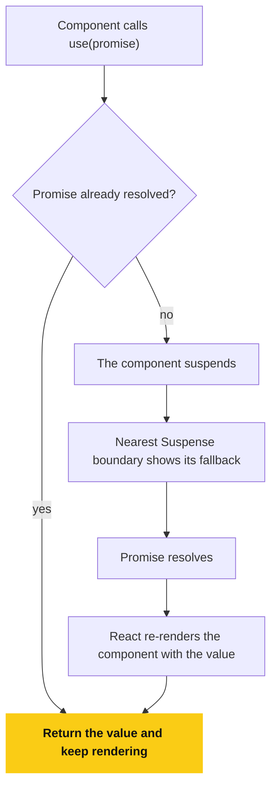
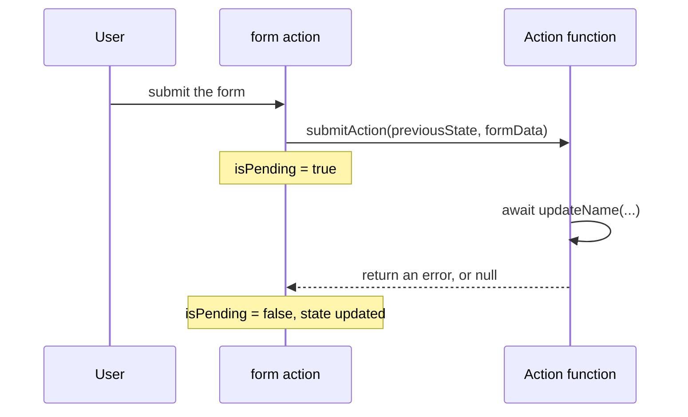

# React.js Core Concepts — Interview Explanation with Examples

This document summarizes core React concepts with short definitions and examples.

## Table of Contents

1. [Components](#1-components)
2. [JSX (JavaScript XML)](#2-jsx-javascript-xml)
3. [Curly Braces {} in JSX](#3-curly-braces--in-jsx)
4. [Fragments](#4-fragments)
5. [Props (Properties)](#5-props-properties)
6. [Children](#6-children)
7. [Keys](#7-keys)
8. [Rendering](#8-rendering)
9. [Event Handling](#9-event-handling)
10. [State](#10-state)
11. [Controlled Components](#11-controlled-components)
12. [Hooks](#12-hooks)
13. [Purity](#13-purity)
14. [Strict Mode](#14-strict-mode)
15. [Effects](#15-effects)
16. [Refs](#16-refs)
17. [Context](#17-context)
18. [Portals](#18-portals)
19. [Suspense](#19-suspense)
20. [Error Boundaries](#20-error-boundaries)
21. [use() (React 19)](#21-use-react-19)
22. [Actions (React 19)](#22-actions-react-19)
23. [ref as a Prop (React 19)](#23-ref-as-a-prop-react-19)

---

## 1. Components

Definition:
Components are the basic building blocks of a React application. Each component represents a reusable piece of UI.

Why it matters:
They improve reusability, separation of concerns, and maintainability.

Example:

```jsx
function Button() {
  return <button>Click Me</button>;
}

// Usage
<Button />;
```

---

## 2. JSX (JavaScript XML)

Definition:
JSX is a syntax extension for JavaScript that lets you write HTML-like markup inside JavaScript.

How it works:
JSX is compiled into `React.createElement()` calls.

Example:

```jsx
const element = <h1>Hello, React!</h1>;
// Transpiles to: React.createElement('h1', null, 'Hello, React!')
```

---

## 3. Curly Braces {} in JSX

Definition:
Curly braces embed dynamic JavaScript expressions in JSX.

Example:

```jsx
const name = "Sayan";
return <h1>Hello, {name}</h1>;

// Expressions
{
  2 + 2;
}
{
  isLoggedIn ? "Welcome" : "Login";
}
```

---

## 4. Fragments

Definition:
Fragments let you return multiple elements from a component without adding extra DOM nodes.

Example:

```jsx
return (
  <>
    <h1>Title</h1>
    <p>Description</p>
  </>
);
```

---

## 5. Props (Properties)

Definition:
Props pass data from a parent to a child component. They are read-only.

Example:

```jsx
function User({ name }) {
  return <p>Hello {name}</p>;
}

// Parent
<User name="Sayan" />;
```

---

## 6. Children

Definition:
`children` is a special prop used to pass nested JSX into a component.

Example:

```jsx
function Card({ children }) {
  return <div className="card">{children}</div>;
}

<Card>
  <h2>User Profile</h2>
</Card>;
```

---

## 7. Keys

Definition:
Keys help React identify changed, added, or removed items in a list.

Example:

```jsx
{
  users.map((user) => <li key={user.id}>{user.name}</li>);
}
```

Avoid using array indices as keys unless the list is static.

---

## 8. Rendering

Definition:
Rendering converts components into DOM elements. React uses a virtual DOM, diffing, and reconciliation.

Example:

```jsx
root.render(<App />);
```

Components re-render when their state or props change.

**Flowchart: Render and Commit**

Rendering is React calling your components, and only the difference is committed to the DOM.



---

## 9. Event Handling

Definition:
React uses camelCase event handlers and passes synthetic events.

Example:

```jsx
function ClickButton() {
  const handleClick = () => alert("Button clicked");
  return <button onClick={handleClick}>Click</button>;
}
```

---

## 10. State

Definition:
State stores dynamic data inside a component and triggers re-renders when updated.

Example:

```jsx
import { useState } from "react";

function Counter() {
  const [count, setCount] = useState(0);
  return <button onClick={() => setCount(count + 1)}>Count: {count}</button>;
}
```

---

## 11. Controlled Components

Definition:
Form elements whose values are controlled by React state.

Example:

```jsx
function Form() {
  const [email, setEmail] = useState("");
  return <input value={email} onChange={(e) => setEmail(e.target.value)} />;
}
```

---

## 12. Hooks

Definition:
Hooks let function components use state, lifecycle logic, and refs.

Common hooks: `useState`, `useEffect`, `useRef`.

Example:

```jsx
useEffect(() => {
  console.log("Component mounted");
}, []);
```

---

## 13. Purity

Definition:
React components should be pure: same props + state → same UI output. Avoid side effects during render.

Wrong:

```jsx
// Don't call this during render
const value = Math.random();
```

Right:

```jsx
useEffect(() => {
  fetchData();
}, []);
```

---

## 14. Strict Mode

Definition:
`React.StrictMode` is a development-only tool that detects unsafe patterns and side effects.

Example:

```jsx
<React.StrictMode>
  <App />
</React.StrictMode>
```

---

## 15. Effects

Definition:
Effects handle side effects like API calls, timers, and subscriptions.

Example:

```jsx
useEffect(() => {
  fetch("/api/data");
}, []);
```

**Flowchart: When an Effect Runs**

The dependency array decides whether the effect runs again, and cleanup always runs first.



---

## 16. Refs

Definition:
Refs provide direct access to DOM elements or component instances.

Example:

```jsx
const inputRef = useRef();
<input ref={inputRef} />
<button onClick={() => inputRef.current.focus()}>Focus Input</button>
```

---

## 17. Context

Definition:
Context shares data across the component tree without prop drilling.

Example:

```jsx
const ThemeContext = createContext("light");

<ThemeContext.Provider value="dark">
  <App />
</ThemeContext.Provider>;

const theme = useContext(ThemeContext);
```

---

## 18. Portals

Definition:
Portals render components outside the parent DOM hierarchy, useful for modals and overlays.

Example:

```jsx
ReactDOM.createPortal(<Modal />, document.getElementById("modal-root"));
```

**Flowchart: Portals**

The component stays in the same place in the React tree, but its DOM is rendered somewhere else.



---

## 19. Suspense

Definition:
`Suspense` handles loading states for lazy-loaded components or async data.

Example:

```jsx
<Suspense fallback={<Loading />}>
  <LazyComponent />
</Suspense>
```

**Flowchart: Suspense**

The boundary shows the fallback until every child underneath it is ready.



---

## 20. Error Boundaries

Definition:
Error boundaries catch JavaScript errors in child components and show a fallback UI.

Example:

```jsx
class ErrorBoundary extends React.Component {
  state = { hasError: false };

  static getDerivedStateFromError() {
    return { hasError: true };
  }

  render() {
    if (this.state.hasError) return <h1>Something went wrong</h1>;
    return this.props.children;
  }
}
```

**Flowchart: Error Boundary**

A render error in any child is caught by the nearest boundary above it.



---

## 21. use() (React 19)

Definition:
`use` reads a Promise or Context value during render. Unlike other hooks, it can be called conditionally or inside loops.

Example:

```jsx
function Comments({ commentsPromise }) {
  const comments = use(commentsPromise);
  return comments.map((c) => <p key={c.id}>{c.text}</p>);
}
```

**Flowchart: use() and Suspense**

`use()` suspends the component until the promise resolves.



---

## 22. Actions (React 19)

Definition:
An Action is any async function passed to `<form action={...}>`, a transition, or a new hook (`useActionState`, `useOptimistic`). React tracks its pending state, error, and result automatically.

Example:

```jsx
const [error, submitAction, isPending] = useActionState(async (prev, formData) => {
  const res = await updateName(formData.get("name"));
  return res.error ?? null;
}, null);

<form action={submitAction}>
  <input name="name" />
  <button disabled={isPending}>Save</button>
</form>;
```

**Sequence diagram: An Action Lifecycle**

React tracks pending, result, and error for you.



---

## 23. ref as a Prop (React 19)

Definition:
Function components can accept `ref` as a normal prop. `forwardRef` is no longer needed for new components.

Example:

```jsx
function Input({ placeholder, ref }) {
  return <input placeholder={placeholder} ref={ref} />;
}
```
