# React.js Complete Notes

> All examples use **modern React (hooks + functional components)**.

## Table of Contents

1. [What is React?](#what-is-react)
2. [Core Principles of React](#core-principles-of-react)
3. [Components](#1-components)
4. [JSX](#2-jsx)
5. [Props](#3-props)
6. [State](#4-state)
7. [useState Hook](#5-usestate-hook)
8. [Conditional Rendering](#6-conditional-rendering)
9. [Lists and Keys](#7-lists-and-keys)
10. [Event Handling](#8-event-handling)
11. [Controlled vs Uncontrolled Components](#9-controlled-vs-uncontrolled-components)
12. [Lifting State Up](#10-lifting-state-up)
13. [useEffect Hook](#11-useeffect-hook)
14. [useRef](#12-useref)
15. [useMemo](#13-usememo)
16. [useCallback](#14-usecallback)
17. [React.memo](#15-reactmemo)
18. [Context API](#16-context-api)
19. [Custom Hooks](#17-custom-hooks)
20. [Error Boundaries](#18-error-boundaries)
21. [Reconciliation & Virtual DOM](#19-reconciliation--virtual-dom)
22. [Rendering Behavior](#20-rendering-behavior-important-interview-topic)
23. [Strict Mode](#21-strict-mode)
24. [Forms & Validation Strategy](#22-forms--validation-strategy)
25. [Performance Optimization Summary](#23-performance-optimization-summary)
26. [Folder Structure](#24-folder-structure-senior-level)
27. [Common Interview Questions](#25-common-interview-questions)
28. [Anti-Patterns](#26-anti-patterns)
29. [React 19: Actions & New Hooks](#27-react-19-actions--new-hooks)
30. [React 19: Other Changes](#28-react-19-other-changes)
31. [React 19.2 Updates](#29-react-192-updates)

---

## What is React?

**React** is a JavaScript library for building **component-based, declarative, and efficient user interfaces**.

### Why React Exists

- DOM manipulation is slow and error-prone
- UI complexity grows with state
- React introduces **Virtual DOM**, **component abstraction**, and **unidirectional data flow**

---

## Core Principles of React

1. **Declarative UI**
2. **Component-Based Architecture**
3. **Unidirectional Data Flow**
4. **Virtual DOM Diffing**
5. **State-driven rendering**

---

## 1. Components

### What is a Component?

A **component** is a reusable, isolated piece of UI that can accept inputs (props) and manage its own state.

### Types of Components

- Functional Components (recommended)
- Class Components (legacy)

### Functional Component Example

```jsx
function Greeting({ name }) {
  return <h1>Hello, {name}</h1>;
}
```

### Why Functional Components?

- Simpler syntax
- Hooks support
- Better performance
- Easier testing

---

## 2. JSX

### What is JSX?

JSX is **syntactic sugar over `React.createElement`**.

```jsx
const el = <h1>Hello</h1>;
```

Equivalent:

```js
const el = React.createElement("h1", null, "Hello");
```

### JSX Rules

- Must return a **single parent**
- JavaScript expressions inside `{ }`
- Attributes use **camelCase**
- `className` instead of `class`

---

## 3. Props

### What are Props?

Props are **read-only inputs** passed from parent to child.

```jsx
function Button({ label }) {
  return <button>{label}</button>;
}
```

### Key Rules

- Immutable
- Flow from parent → child
- Used for configuration

### Interview Question

**Q:** Can child modify props?
**A:** No. Props are immutable.

---

## 4. State

### What is State?

State represents **mutable data** that affects rendering.

```jsx
const [count, setCount] = useState(0);
```

### State Update Rules

- State updates are **asynchronous**
- Never mutate state directly
- Triggers re-render

Incorrect:

```js
count++;
```

Correct:

```js
setCount((prev) => prev + 1);
```

**Flowchart: What Happens on setState**

The updater is queued, not applied immediately, so the variable in the current render never changes.
React batches queued updates and re-renders once.

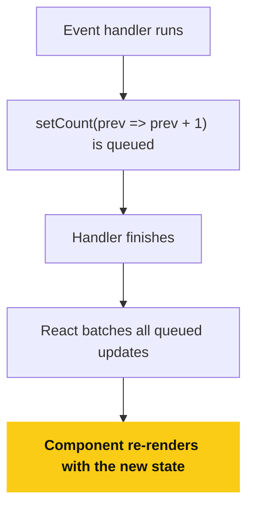

---

## 5. useState Hook

```jsx
const [value, setValue] = useState(initialValue);
```

### When to Use

- Form inputs
- Toggles
- Counters
- UI state

### Interview Tip

State updates may be **batched** for performance.

---

## 6. Conditional Rendering

```jsx
{
  isLoggedIn ? <Dashboard /> : <Login />;
}
```

```jsx
{
  items.length > 0 && <List />;
}
```

---

## 7. Lists and Keys

```jsx
items.map((item) => <li key={item.id}>{item.name}</li>);
```

### Why Keys Matter

- Helps React identify changes
- Improves reconciliation
- Prevents incorrect re-renders

### Interview Question

**Q:** Why not use index as key?
**A:** Causes bugs during reordering, insertion, deletion.

---

## 8. Event Handling

```jsx
<button onClick={handleClick}>Click</button>
```

```jsx
const handleClick = (e) => {
  e.preventDefault();
};
```

---

## 9. Controlled vs Uncontrolled Components

### Controlled Input

```jsx
<input value={value} onChange={(e) => setValue(e.target.value)} />
```

### Uncontrolled Input

```jsx
<input ref={inputRef} />
```

### Interview Insight

Controlled inputs give **predictable state** and validation control.

---

## 10. Lifting State Up

When **multiple components need the same state**, move it to the nearest common parent.

```jsx
function Parent() {
  const [value, setValue] = useState("");
  return <Child value={value} setValue={setValue} />;
}
```

---

## 11. useEffect Hook

### Purpose

Handles **side effects**:

- API calls
- Subscriptions
- Timers
- DOM manipulation

```jsx
useEffect(() => {
  fetchData();
}, []);
```

### Dependency Array Rules

| Dependency | Meaning              |
| ---------- | -------------------- |
| `[]`       | Run once (mount)     |
| `[a]`      | Run when `a` changes |
| No array   | Runs every render    |

### Cleanup

```jsx
useEffect(() => {
  const id = setInterval(() => {}, 1000);
  return () => clearInterval(id);
}, []);
```

**Flowchart: When an Effect Runs**

The dependency array decides whether the effect runs again, and cleanup always runs before the next run and on unmount.

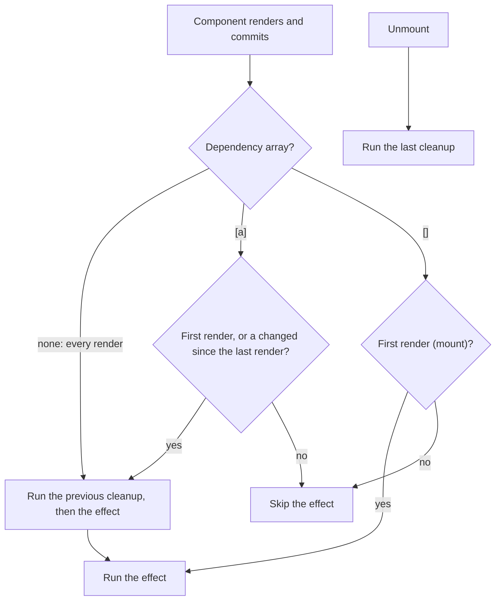

---

## 12. useRef

### Purpose

- Persist values without re-render
- Access DOM elements

```jsx
const inputRef = useRef(null);
inputRef.current.focus();
```

### Interview Question

**Q:** Difference between useRef and useState?
**A:** `useRef` does NOT trigger re-render.

---

## 13. useMemo

### Purpose

Memoize **expensive calculations**

```jsx
const result = useMemo(() => heavyCalc(a), [a]);
```

### Use When

- Expensive computations
- Prevent recalculation

---

## 14. useCallback

### Purpose

Memoize **functions**

```jsx
const handleClick = useCallback(() => {
  setCount((c) => c + 1);
}, []);
```

### Interview Insight

Used to prevent unnecessary re-renders in memoized children.

---

## 15. React.memo

```jsx
const Child = React.memo(function Child({ value }) {
  return <div>{value}</div>;
});
```

Prevents re-render unless props change.

**Flowchart: Does the Child Re-render?**

A parent re-render re-renders its children unless `React.memo` finds the props unchanged.
Props are compared by reference, which is why `useMemo` and `useCallback` keep object and function props stable.

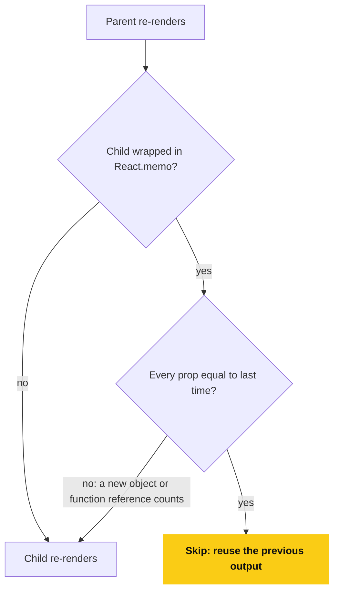

---

## 16. Context API

### Problem Solved

**Prop drilling**

```jsx
const ThemeContext = createContext();
```

```jsx
<ThemeContext.Provider value="dark">
```

```jsx
const theme = useContext(ThemeContext);
```

### Interview Question

**Q:** Context vs Redux?
**A:** Context for low-frequency global state, Redux for complex state logic.

**Flowchart: Context vs Prop Drilling**

The value skips every layer in between and goes straight to the consumers.

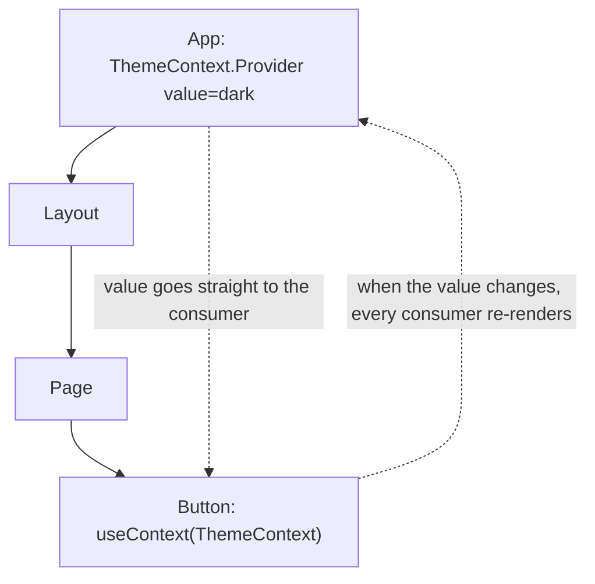

---

## 17. Custom Hooks

### Why?

- Reuse logic
- Cleaner components

```jsx
function useFetch(url) {
  const [data, setData] = useState(null);
  useEffect(() => {
    fetch(url)
      .then((r) => r.json())
      .then(setData);
  }, [url]);
  return data;
}
```

---

## 18. Error Boundaries

Only available in **class components**.

```jsx
componentDidCatch(error, info) {}
```

Used to catch runtime errors in UI.

**Flowchart: Error Boundary**

Only class components can be error boundaries.

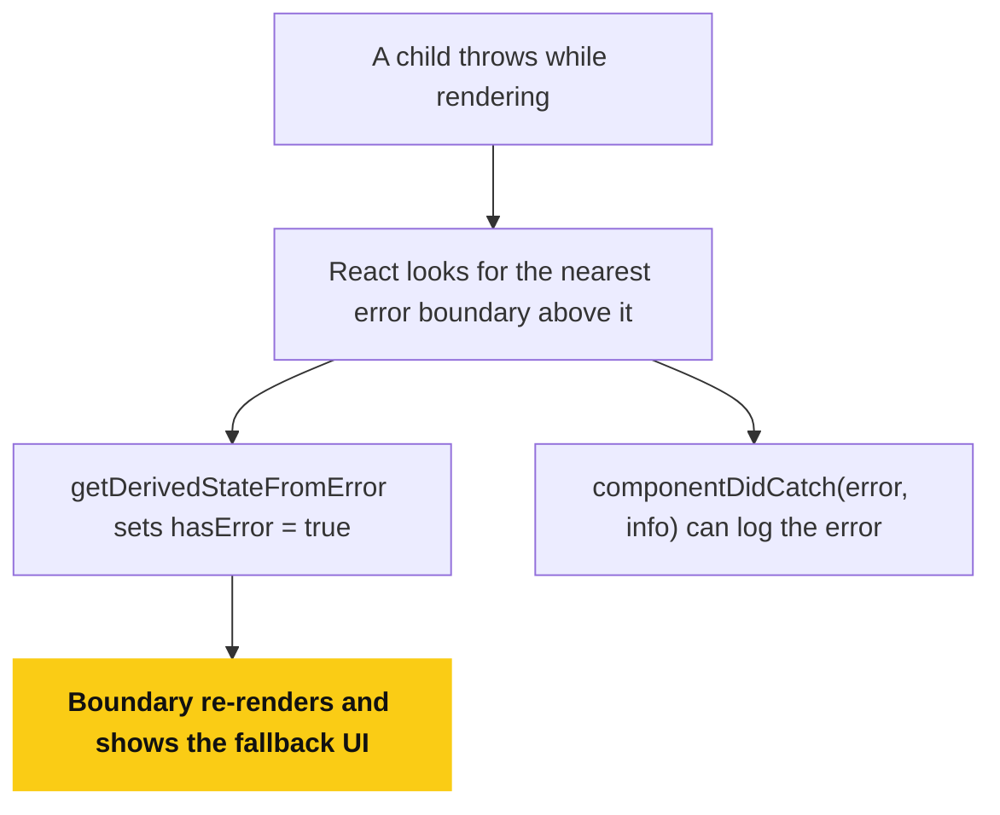

---

## 19. Reconciliation & Virtual DOM

### How React Updates UI

1. Creates Virtual DOM
2. Compares with previous tree (diffing)
3. Updates minimal DOM nodes

### Optimization Heuristics

- Same type → update
- Different type → replace

**Flowchart: Diffing Rule**

React compares the old and new element at each position, and the element type decides everything.

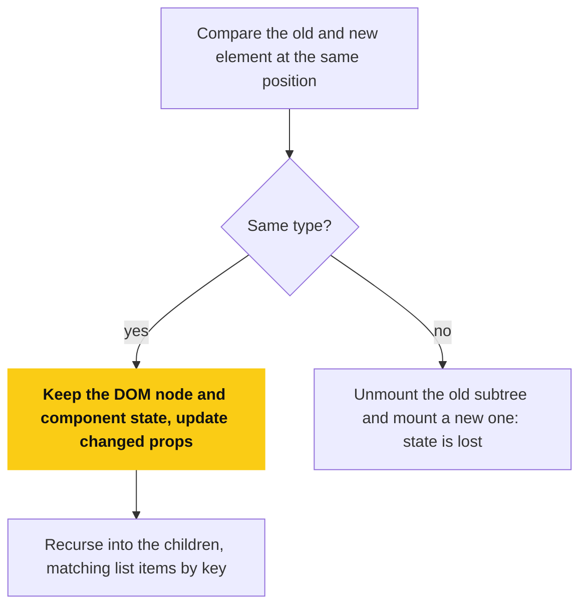

---

## 20. Rendering Behavior (Important Interview Topic)

- Parent re-render → children re-render
- Memoization can stop unnecessary renders
- State update triggers render, not mutation

**Flowchart: Render and Commit**

State updates trigger a render, and only the diff reaches the DOM.

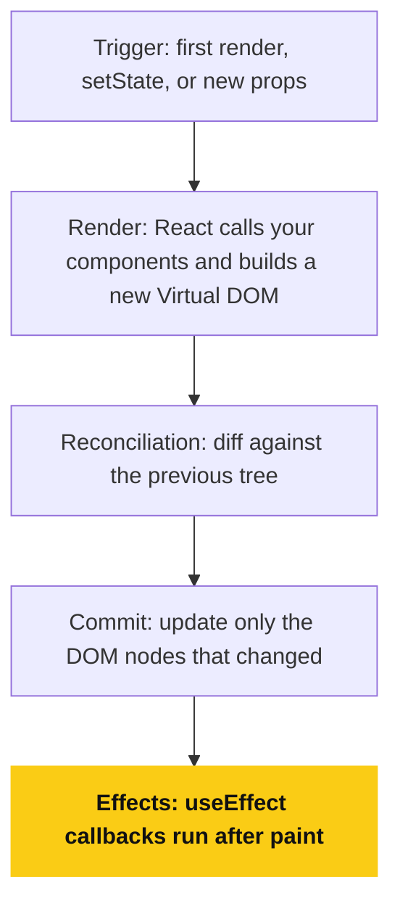

---

## 21. Strict Mode

```jsx
<React.StrictMode>
```

- Double-invokes lifecycle in dev
- Detects unsafe patterns

---

## 22. Forms & Validation Strategy

- Controlled inputs
- Field-level validation
- Disable submit based on validity

---

## 23. Performance Optimization Summary

- React.memo
- useCallback
- useMemo
- Avoid unnecessary state
- Normalize data
- Split components

---

## 24. Folder Structure (Senior-Level)

```
features/
  auth/
    components/
    hooks/
    api.ts
shared/
  components/
  hooks/
  utils/
```

---

## 25. Common Interview Questions

### Q: Why hooks must be called at top level?

- Ensures consistent hook order

### Q: How React batches state updates?

- Groups updates for performance

### Q: Why immutability matters?

- Enables change detection

### Q: Controlled vs uncontrolled?

- Predictability vs performance

---

## 26. Anti-Patterns

- Storing derived state
- Excessive context usage
- Index as key
- Overusing useEffect

---

## 27. React 19: Actions & New Hooks

React 19 (stable since December 2024) introduces **Actions**: functions that handle async transitions (pending state, errors, optimistic updates, form resets) automatically.

### useActionState

Manages the full lifecycle of a form action: pending state, returned value, and error.

```jsx
const [error, submitAction, isPending] = useActionState(
  async (previousState, formData) => {
    const result = await updateName(formData.get("name"));
    if (result.error) return result.error;
    return null;
  },
  null
);

<form action={submitAction}>
  <input name="name" />
  <button disabled={isPending}>Update</button>
  {error && <p>{error}</p>}
</form>;
```

**Sequence diagram: An Action Lifecycle**

React tracks pending, result, and error, so you do not write that state by hand.

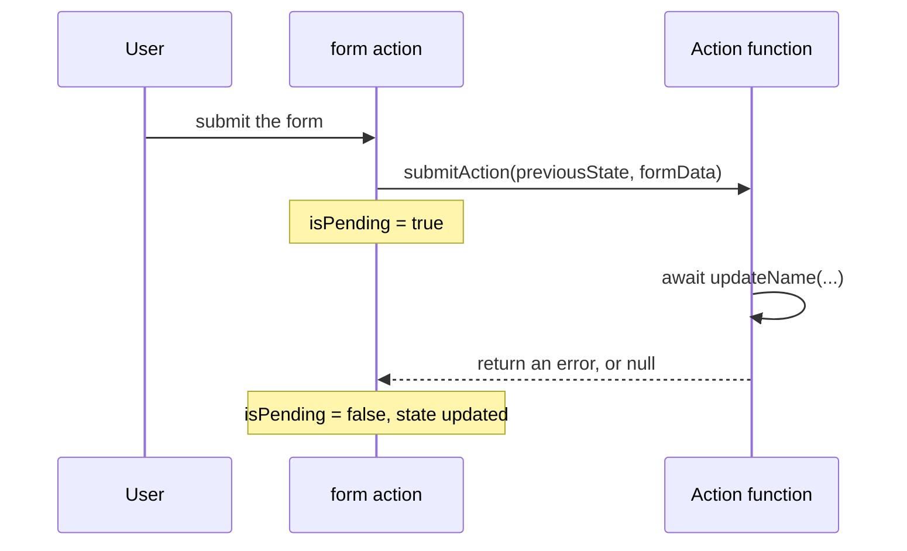

### useFormStatus

Lets a nested component read the parent `<form>` status without prop drilling.

```jsx
import { useFormStatus } from "react-dom";

function SubmitButton() {
  const { pending } = useFormStatus();
  return <button disabled={pending}>Submit</button>;
}
```

`useFormStatus` must be called from a component rendered **inside** the `<form>`.

### useOptimistic

Shows an optimistic value while an async action is in flight, then reconciles with the real result.

```jsx
const [optimisticName, setOptimisticName] = useOptimistic(name);

async function submitAction(formData) {
  const newName = formData.get("name");
  setOptimisticName(newName);
  const updated = await updateName(newName);
  setName(updated);
}
```

**Flowchart: Optimistic Update**

The UI updates immediately, and the real result replaces the guess when the action ends.

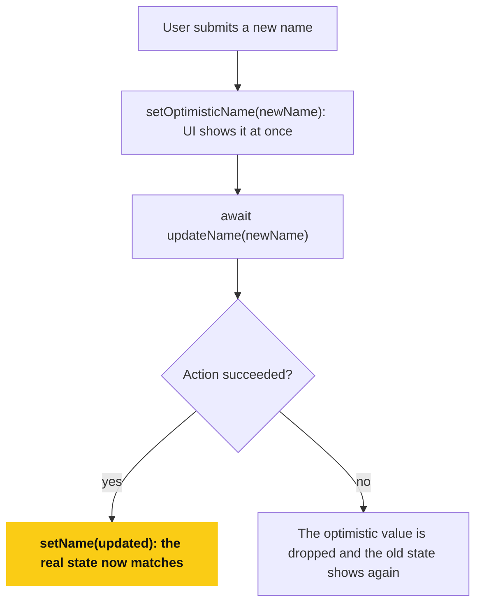

### use()

Reads the value of a resource (a Promise or a Context) during render. Unlike hooks, `use()` can be called conditionally and inside loops.

```jsx
import { use } from "react";

function Comments({ commentsPromise }) {
  const comments = use(commentsPromise);
  return comments.map((c) => <p key={c.id}>{c.text}</p>);
}
```

```jsx
function Button() {
  const theme = use(ThemeContext);
  return <button className={theme}>Click</button>;
}
```

**Flowchart: use() and Suspense**

`use()` suspends the component until the promise resolves, and the nearest Suspense boundary shows the fallback meanwhile.

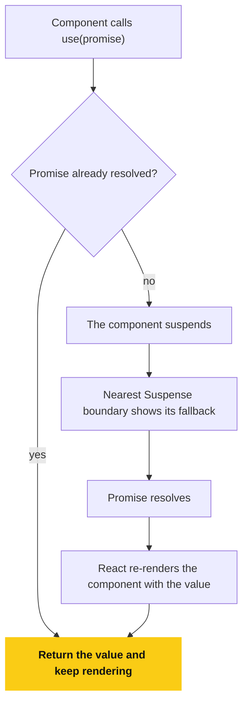

### Interview Question

**Q:** Why not just use `useEffect` + `useState` for form submissions?
**A:** Actions collapse pending/error/optimistic-state boilerplate into one hook, and integrate directly with `<form action={...}>` so React manages the transition.

---

## 28. React 19: Other Changes

### ref as a prop

Function components can now accept `ref` directly as a prop. `forwardRef` is no longer required for new code (it is still supported but deprecated).

```jsx
function Input({ placeholder, ref }) {
  return <input placeholder={placeholder} ref={ref} />;
}
```

### Context as a provider

`<Context>` can be rendered directly as a provider instead of `<Context.Provider>`.

```jsx
const ThemeContext = createContext("light");

<ThemeContext value="dark">
  <App />
</ThemeContext>;
```

### ref cleanup functions

A `ref` callback can now return a cleanup function, mirroring `useEffect`.

```jsx
<div
  ref={(node) => {
    console.log("attached", node);
    return () => console.log("detached", node);
  }}
/>
```

### Document metadata

`<title>`, `<meta>`, and `<link>` can be rendered directly inside any component. React hoists them into `<head>` automatically, including from Server Components.

```jsx
function Page() {
  return (
    <>
      <title>My Page</title>
      <meta name="description" content="..." />
      <h1>Content</h1>
    </>
  );
}
```

### Stylesheets, scripts, and preloading

`<link rel="stylesheet" precedence="...">` lets React manage stylesheet insertion order and dedupe. New resource APIs (`preload`, `preinit`, `prefetchDNS`, `preconnect`) from `react-dom` give explicit control over resource loading hints.

### Server Components & Server Actions

React Server Components (RSC) shipped as stable in React 19, alongside **Server Actions**: async functions marked `"use server"` that can be called directly from Client Components (typically wired through a framework like Next.js).

```jsx
"use server";

export async function createNote(formData) {
  await db.notes.create({ text: formData.get("text") });
}
```

### Error reporting hooks (react-dom)

`createRoot` and `hydrateRoot` accept `onCaughtError`, `onUncaughtError`, and `onRecoverableError` for centralized error reporting, replacing noisy duplicate console logs.

### Removed / deprecated APIs

| API                                              | Status                                        |
| ------------------------------------------------ | ---------------------------------------------- |
| `propTypes` / `defaultProps` on function components | Removed (use default parameters, TypeScript) |
| String refs                                      | Removed                                        |
| `react-dom/test-utils` (`act` re-export)         | Removed, import `act` from `react`             |
| Legacy Context (`contextTypes`/`getChildContext`) | Removed                                        |
| `ReactDOM.render` / `ReactDOM.hydrate`            | Removed, use `createRoot` / `hydrateRoot`       |
| `forwardRef`                                     | Deprecated, use `ref` as a prop                |

### Interview Question

**Q:** What is the difference between a Server Action and an API route?
**A:** A Server Action is a plain async function annotated `"use server"` that the framework turns into a network call automatically; no manual route, serialization, or fetch call needed.

---

## 29. React 19.2 Updates

Released October 2025, with patch releases continuing through 2026 (latest stable around v19.3 as of September 2026).

### `<Activity />`

Renders parts of a tree in a "hidden" state: unmounts effects and lowers priority while keeping DOM and component state alive, so it can be shown again instantly later. Useful for tab switching, pre-rendering off-screen routes, and back/forward navigation caches.

```jsx
import { unstable_Activity as Activity } from "react";

<Activity mode={isVisible ? "visible" : "hidden"}>
  <Sidebar />
</Activity>;
```

**Flowchart: Activity vs Conditional Rendering**

Hidden Activity keeps state and DOM alive, so showing it again is instant.

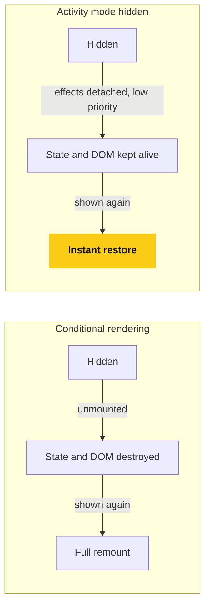

### useEffectEvent

Extracts non-reactive logic out of an Effect: the returned function always sees the latest props/state but never triggers the Effect to re-run, removing the need to over-list (or intentionally omit) dependencies.

```jsx
function ChatRoom({ roomId, theme }) {
  const onConnected = useEffectEvent(() => {
    showToast(`Connected, theme: ${theme}`);
  });

  useEffect(() => {
    const connection = createConnection(roomId);
    connection.on("connected", onConnected);
    return () => connection.disconnect();
  }, [roomId]);
}
```

**Flowchart: What useEffectEvent Changes**

Only reactive values in the dependency array re-run the Effect, and the Effect Event always reads the latest props and state.

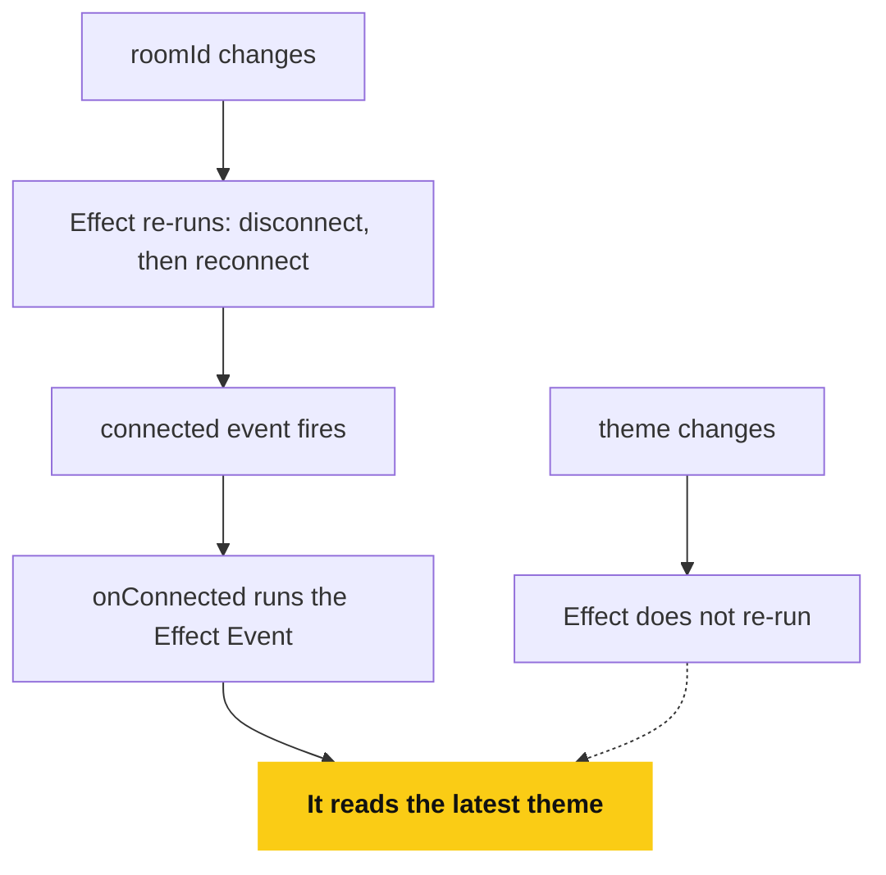

### cacheSignal

Pairs with `cache()` (React Server Components) to expose an `AbortSignal` that fires when the cached render lifetime ends, so in-flight fetches tied to that cache entry can be cancelled cleanly.

### Performance & SSR

- Partial pre-rendering and SSR batching improvements reduce time-to-first-byte for streamed responses.
- Default `useId` prefix changed from `:r:` (19.0) to `_r_` (19.2), aligning with upcoming View Transition support.
- A new **Performance Tracks** integration adds React-specific lanes to the browser Performance panel (component renders, Suspense, transitions).

### Interview Question

**Q:** How is `<Activity>` different from just conditionally rendering `{isVisible && <Sidebar />}`?
**A:** Conditional rendering unmounts the subtree (state and DOM are destroyed). `<Activity mode="hidden">` keeps state and DOM alive but deprioritizes and detaches effects, so re-showing it is instant instead of a full remount.
