# 📘 Software Development Life Cycle (SDLC)

## Table of Contents

1. [What Is SDLC](#1-what-is-sdlc)
2. [The Core Phases](#2-the-core-phases)
   - [Requirement Analysis](#21-requirement-analysis)
   - [Planning](#22-planning)
   - [Design](#23-design)
   - [Implementation](#24-implementation)
   - [Testing](#25-testing)
   - [Deployment](#26-deployment)
   - [Maintenance](#27-maintenance)
3. [SDLC Models](#3-sdlc-models)
   - [Waterfall Model](#31-waterfall-model)
   - [V-Model](#32-v-model)
   - [Iterative Model](#33-iterative-model)
   - [Spiral Model](#34-spiral-model)
   - [Agile Model](#35-agile-model)
   - [Scrum](#36-scrum)
   - [Kanban](#37-kanban)
4. [Comparing the Models](#4-comparing-the-models)
5. [DevOps and CI/CD in SDLC](#5-devops-and-cicd-in-sdlc)
6. [Testing Levels Across SDLC](#6-testing-levels-across-sdlc)
7. [Requirement Types: Functional vs Non-Functional](#7-requirement-types-functional-vs-non-functional)
8. [Common SDLC Documents](#8-common-sdlc-documents)
9. [Real-World Example Walkthrough](#9-real-world-example-walkthrough)
10. [Common Interview Questions](#10-common-interview-questions)
11. [One-Line Senior Summary](#11-one-line-senior-summary)

---

## 1. What Is SDLC

SDLC (Software Development Life Cycle) is a structured process used to plan, build, test, deliver, and maintain software.

It exists so that:

- Work is predictable and repeatable across teams
- Risk is caught early instead of after release
- Stakeholders, developers, and QA share a common process language

Every model (Waterfall, Agile, Spiral, etc.) is just a different arrangement of the same core phases below.

---

## 2. The Core Phases

**Flowchart: The Seven Phases**

Every model in section 3 is a different arrangement of these same phases.
The two loops are what differ between models: bugs found in testing go back to implementation, and new needs after release start the cycle again.

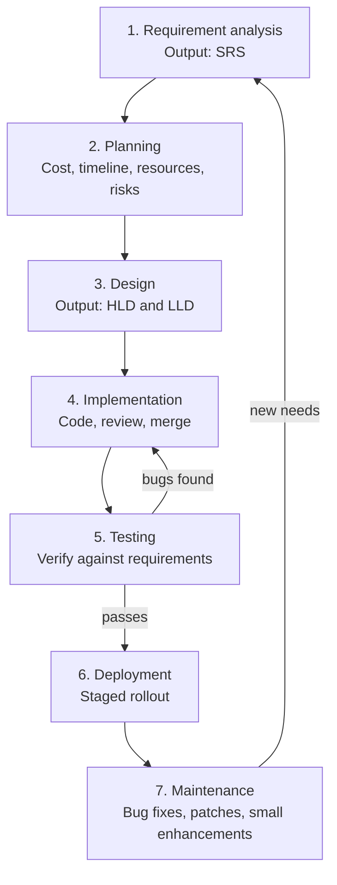

### 2.1 Requirement Analysis

Business analysts and stakeholders define **what** the system should do.

Example: For an e-commerce checkout feature, requirements gathered might be:

- Users can pay via card, UPI, or wallet.
- Order confirmation email must be sent within 30 seconds of payment success.
- System must support 10,000 concurrent checkouts.

Output: Software Requirement Specification (SRS) document.

### 2.2 Planning

Estimate cost, timeline, resources, and risks.

Example: A team estimates the checkout feature will take 3 sprints (6 weeks), needs 2 backend engineers, 1 frontend engineer, and flags a risk that the payment gateway sandbox has rate limits.

### 2.3 Design

Translate requirements into architecture.

- **High-Level Design (HLD):** system architecture, service boundaries, data flow diagrams.
- **Low-Level Design (LLD):** class diagrams, DB schema, API contracts, pseudocode.

Example HLD decision: use a separate `payment-service` microservice instead of embedding payment logic in the monolith, so it can scale and be audited independently.

Example LLD snippet (API contract):

```
POST /api/checkout
Request:  { cartId: string, paymentMethod: "card" | "upi" | "wallet" }
Response: { orderId: string, status: "confirmed" | "failed" }
```

### 2.4 Implementation

Developers write code against the design, following coding standards, doing code reviews, and committing to version control.

Example: Backend engineer implements `POST /api/checkout`, writes unit tests for payment validation, opens a PR, gets it reviewed, merges to `main`.

### 2.5 Testing

QA (and developers via automated tests) verify the system against requirements.

Example: Tester finds that submitting checkout twice quickly (double-click) creates two orders for the same cart — a race condition bug reported back to development.

### 2.6 Deployment

Release the software to production, often via a staged rollout.

Example: Feature is deployed behind a feature flag to 5% of users first (canary release), monitored for errors, then rolled out to 100%.

### 2.7 Maintenance

Fix bugs, patch security issues, and add small enhancements after release.

Example: A month after launch, a bug is found where UPI payments fail for amounts over ₹1,00,000 due to a gateway limit — hotfix is deployed.

---

## 3. SDLC Models

### 3.1 Waterfall Model

Strictly sequential: each phase must fully complete before the next starts.

**Flowchart: Waterfall**

Strictly one way: a phase must finish before the next starts, and there is no arrow back.

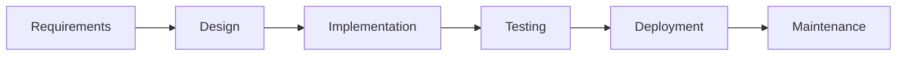

Example use case: building firmware for a medical device where requirements are fixed by regulation and cannot change mid-project.

Pros:

- Simple, easy to manage and document
- Works well when requirements are stable and well-understood

Cons:

- No working software until very late
- Costly to fix a requirement discovered wrong at the design stage
- Poor fit for projects with evolving requirements

### 3.2 V-Model

Extension of Waterfall where each development phase has a corresponding testing phase, forming a "V" shape.

**Flowchart: V-Model**

Read the top row left to right, then the bottom row right to left.
Each development phase is paired with a test level, and that test is written while the phase is being done.

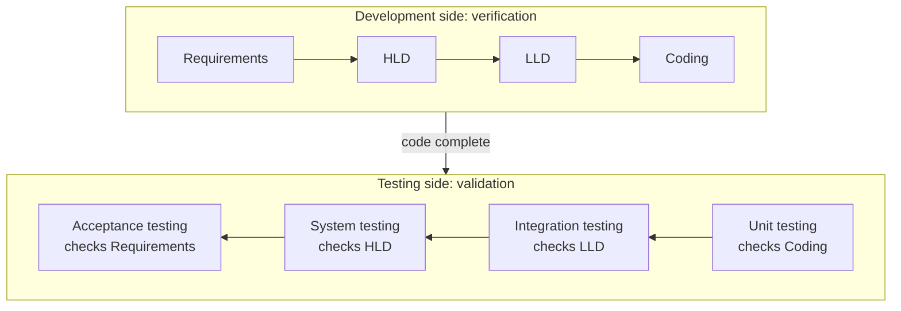

Example: Requirement "system must process 500 orders/min" maps directly to a performance test written during the requirement phase, executed at acceptance testing.

Best for: safety-critical or highly regulated systems (aerospace, banking core systems).

**Flowchart: Verification vs Validation**

Verification checks the product against the spec.
Validation checks the product against what the user actually needs.

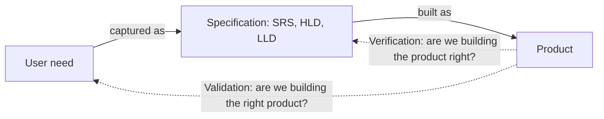

### 3.3 Iterative Model

Build the system in repeated cycles, each producing a working (if incomplete) version, refined over iterations.

Example: Iteration 1 builds login only, Iteration 2 adds product browsing, Iteration 3 adds checkout — each iteration is a usable, testable increment.

**Flowchart: Iterative Model**

Each pass through the loop ends with a usable, testable increment.
For example: iteration 1 is login, iteration 2 is product browsing, iteration 3 is checkout.

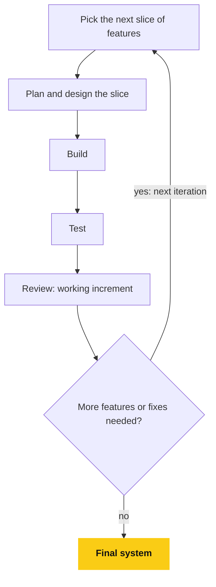

### 3.4 Spiral Model

Combines iterative development with explicit risk analysis at every loop of the spiral (Plan → Risk Analysis → Engineering → Evaluation).

Example: A fintech startup building a new trading engine spends the first spiral loop building a throwaway prototype just to test whether their matching algorithm can handle order bursts, before committing to full implementation.

Best for: large, high-risk, high-cost projects where unknowns need to be resolved early.

**Flowchart: Spiral Model**

Same four steps every loop, but the risk analysis step comes before any real engineering.
Each loop is wider and costlier than the last, so unknowns are settled while they are still cheap.

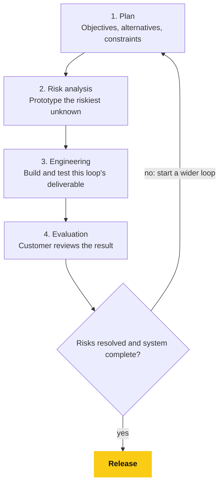

### 3.5 Agile Model

Iterative and incremental, delivering working software frequently (every 1-4 weeks) with close customer collaboration and adaptive planning, per the [Agile Manifesto](https://agilemanifesto.org/).

Core values:

- Individuals and interactions over processes and tools
- Working software over comprehensive documentation
- Customer collaboration over contract negotiation
- Responding to change over following a plan

Example: A product team ships a minimal "add to cart" feature in Sprint 1, gets real user feedback, then iterates to add saved-for-later and quantity discounts in Sprint 2 based on that feedback.

**Flowchart: Agile Feedback Loop**

The plan is expected to change: feedback from working software flows straight back into the backlog.

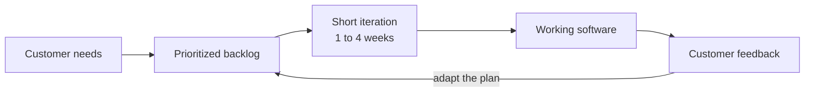

### 3.6 Scrum

A specific Agile framework organized into fixed-length **sprints** (usually 2 weeks), with defined roles and ceremonies.

Roles:

- **Product Owner** — owns the backlog, defines priority
- **Scrum Master** — removes blockers, facilitates process
- **Development Team** — builds the increment

Ceremonies:

- Sprint Planning
- Daily Standup
- Sprint Review (demo)
- Sprint Retrospective

Example: Team commits to 20 story points for a 2-week sprint, holds a 15-minute daily standup, demos the checkout feature to stakeholders at sprint review, then discusses in retro that code review turnaround was too slow.

**Flowchart: One Scrum Sprint**

The Product Owner decides what is on the backlog and in what order.
The Scrum Master does not steer the work, they remove what is blocking it.

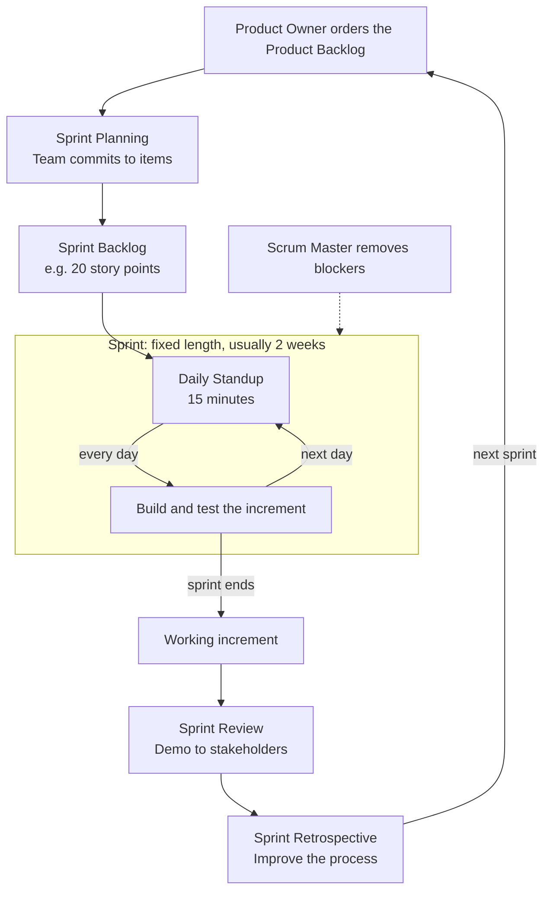

### 3.7 Kanban

A continuous-flow Agile method visualizing work on a board (`To Do → In Progress → Review → Done`) with **WIP limits** instead of fixed sprints.

**Flowchart: Kanban Pull Rule**

Work is pulled, never pushed: a card only enters In Progress if the WIP limit allows it.

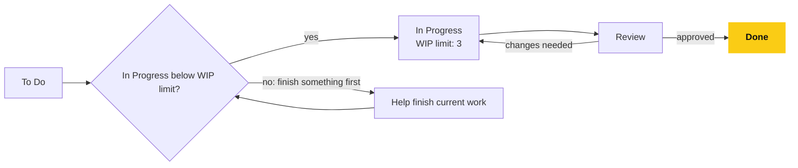

Example: A support/maintenance team uses Kanban instead of Scrum because incoming bugs arrive unpredictably; they cap "In Progress" at 3 items per engineer to avoid context-switching overload.

---

## 4. Comparing the Models

**Flowchart: Picking a Model**

The deciding questions are how stable the requirements are, how risky the project is, and how work arrives.

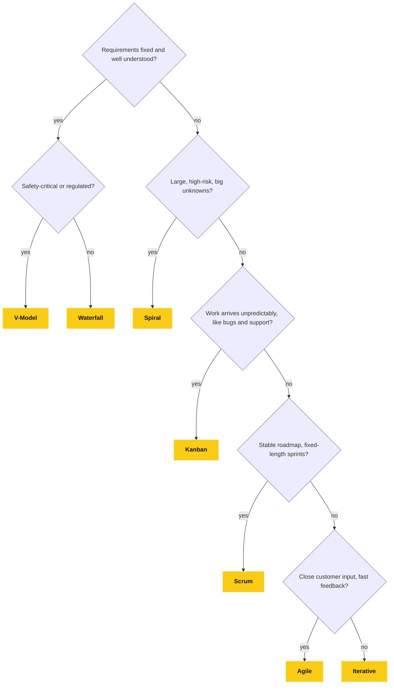

| Model      | Flexibility | Feedback Speed | Best For                                  |
|------------|-------------|-----------------|---------------------------------------------|
| Waterfall  | Low         | Very slow       | Fixed, well-understood requirements          |
| V-Model    | Low         | Slow            | Regulated, safety-critical systems           |
| Iterative  | Medium      | Medium          | Evolving requirements, incremental delivery  |
| Spiral     | Medium      | Medium          | Large, high-risk projects                    |
| Agile      | High        | Fast            | Changing requirements, close customer input  |
| Scrum      | High        | Fast (per sprint)| Product teams with a stable roadmap         |
| Kanban     | High        | Continuous      | Support/maintenance, unpredictable inflow    |

---

## 5. DevOps and CI/CD in SDLC

Modern SDLC folds Deployment and Maintenance into a continuous loop rather than one-time phases, using DevOps practices.

- **Continuous Integration (CI):** every merge triggers automated build + test, catching integration bugs early.
- **Continuous Delivery (CD):** every change that passes CI is automatically packaged and ready to deploy.
- **Continuous Deployment:** every change that passes CI is automatically deployed to production, no manual gate.

Example CI/CD pipeline for the checkout feature:

**Flowchart: CI/CD Pipeline**

Any failing stage sends the change back to the developer, so a broken build never reaches production.
Continuous Delivery keeps the manual approval gate.
Continuous Deployment removes it, so a passing change goes straight to production.

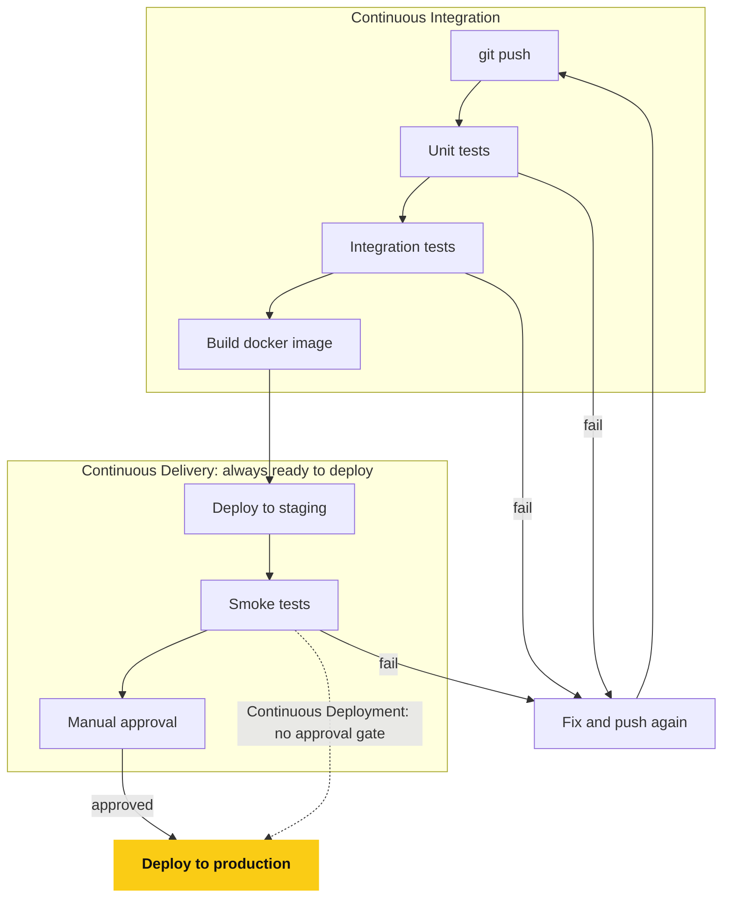

This shortens the feedback loop from "weeks" (Waterfall-style release trains) to "minutes" (a PR merge can be in production the same day).

---

## 6. Testing Levels Across SDLC

- **Unit Testing** — individual functions/classes in isolation (developer-owned).
- **Integration Testing** — multiple modules/services working together (e.g., checkout service talking to payment gateway).
- **System Testing** — the whole application end-to-end against requirements.
- **Acceptance Testing (UAT)** — validated by the client/business that it meets real needs.
- **Regression Testing** — re-running existing tests after a change to ensure nothing broke.

**Flowchart: Testing Levels**

The first four levels widen in scope.
Regression testing is not a level, it is a re-run of the existing tests at every level after any change.

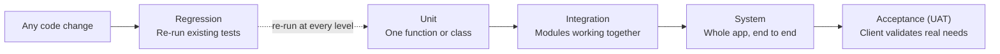

Example: after fixing the double-checkout race condition bug, the team adds a regression test that submits checkout twice concurrently and asserts only one order is created.

---

## 7. Requirement Types: Functional vs Non-Functional

- **Functional requirements** describe *what* the system does.
  Example: "User can filter products by price range."
- **Non-functional requirements** describe *how well* it does it — quality attributes.
  Example: "Search results must return in under 200ms at p95", "System must be available 99.9% of the time", "All PII must be encrypted at rest."

Interviewers often ask you to distinguish these because non-functional requirements are the ones most often forgotten until production incidents force attention to them.

---

## 8. Common SDLC Documents

- **SRS (Software Requirement Specification)** — what the system must do.
- **HLD (High-Level Design)** — architecture-level design.
- **LLD (Low-Level Design)** — class/API/schema-level design.
- **Test Plan** — scope, strategy, and cases for testing.
- **Release Notes** — what changed in a given deployment.

---

## 9. Real-World Example Walkthrough

A team builds a "wishlist" feature end-to-end using Scrum:

1. **Requirement Analysis:** PM writes user stories: "As a logged-in user, I can add/remove products from my wishlist."
2. **Planning:** Estimated at 5 story points, planned for Sprint 14.
3. **Design:** LLD adds a `wishlists` table (`user_id`, `product_id`, `created_at`) and two new endpoints, `POST /wishlist` and `DELETE /wishlist/:id`.
4. **Implementation:** Backend engineer builds the endpoints; frontend engineer adds a heart icon on the product card.
5. **Testing:** QA verifies adding a duplicate product doesn't create two rows; a unit test covers the same case.
6. **Deployment:** Shipped via CI/CD to production behind a feature flag, enabled for all users after 24 hours of clean monitoring.
7. **Maintenance:** Two weeks later, a bug is reported that removed items still show in a cached wishlist count — fixed by invalidating the cache on delete.

---

## 10. Common Interview Questions

- "Walk me through the SDLC phases for a feature you shipped recently." — answer using the 7-phase structure above with your own example.
- "Waterfall vs Agile — when would you pick one over the other?" — stability of requirements is the deciding factor.
- "What's the difference between verification and validation?" — verification asks "are we building the product right?" (matches spec); validation asks "are we building the right product?" (matches user need).
- "What's the difference between HLD and LLD?" — HLD is architecture/system-level, LLD is class/API/schema-level.
- "How does CI/CD change the traditional SDLC?" — it compresses deployment and part of testing into an automated, continuous loop instead of a discrete late-stage phase.

---

## 11. One-Line Senior Summary

> SDLC models are not competing philosophies, they're different risk-management strategies for the same underlying phases, pick the one that matches how well-known your requirements are and how fast you need feedback.
