# Server-Driven UI

Server-Driven UI (SDUI) changes who controls the composition of an app's UI.
A production-grade SDUI system is not "return JSON, render it" - it is a combination of a UI contract, a component registry, server-side composition, versioning, a fallback strategy, data orchestration, analytics, caching, and client rendering.

## Table of Contents

1. [What SDUI Actually Is](#1-what-sdui-actually-is)
2. [SDUI Is Not Remote Code Execution](#2-sdui-is-not-remote-code-execution)
3. [Mental Model: A UI Language](#3-mental-model-a-ui-language)
4. [Traditional UI vs SDUI](#4-traditional-ui-vs-sdui)
5. [Why Companies Use It](#5-why-companies-use-it)
6. [Core Architecture](#6-core-architecture)
7. [Component Registry](#7-component-registry)
8. [React Native Implementation](#8-react-native-implementation)
9. [Beyond Mobile: Web, Desktop, and Multi-Platform SDUI](#9-beyond-mobile-web-desktop-and-multi-platform-sdui)
10. [Versioning and Fallback](#10-versioning-and-fallback)
11. [Actions](#11-actions)
12. [What Should and Should Not Be Server-Driven](#12-what-should-and-should-not-be-server-driven)
13. [SDUI vs Adjacent Patterns](#13-sdui-vs-adjacent-patterns)
14. [Data vs UI, and Server Orchestration](#14-data-vs-ui-and-server-orchestration)
15. [Analytics, Caching, Offline, Performance](#15-analytics-caching-offline-performance)
16. [Security, Accessibility, Localization](#16-security-accessibility-localization)
17. [Design Tokens Over Arbitrary Styling](#17-design-tokens-over-arbitrary-styling)
18. [Testing and Observability](#18-testing-and-observability)
19. [Real-World References: Airbnb and Shopify](#19-real-world-references-airbnb-and-shopify)
20. [Maturity Levels](#20-maturity-levels)
21. [Pros and Cons](#21-pros-and-cons)
22. [Recommended Rollout](#22-recommended-rollout)
23. [The One Rule That Explains All of It](#23-the-one-rule-that-explains-all-of-it)

---

## 1. What SDUI Actually Is

In a conventional app, the backend returns raw data and the client's code decides the UI structure.

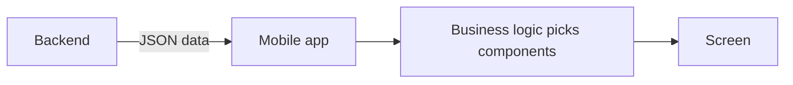

With SDUI, the backend returns a UI description plus data, and the client is a renderer over a closed vocabulary of components it already knows how to draw.

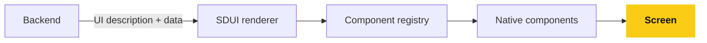

Example response:

```json
{
  "screen": "home",
  "components": [
    { "type": "hero", "props": { "title": "Summer Sale", "image": "https://cdn.example.com/banner.jpg" } },
    { "type": "product_carousel", "props": { "title": "Trending Products", "products": [] } },
    { "type": "category_grid", "props": { "columns": 2, "categories": [] } }
  ]
}
```

The client already knows what a `hero`, `product_carousel`, and `category_grid` are.
The server decides which ones appear, in what order, and with what data.

Airbnb's Ghost Platform is a large-scale production example: the backend controls screen layout, sections, data, and actions across web, iOS, and Android.
Shopify uses SDUI for the Shop app's Store Screen, where the server controls which sections appear per merchant.

## 2. SDUI Is Not Remote Code Execution

This is the most important distinction in the whole pattern.

Avoid sending executable code:

```json
{ "code": "return <View><Text>Hello</Text></View>" }
```

Send a declarative description instead:

```json
{ "type": "banner", "props": { "title": "20% OFF", "image": "...", "action": "navigate://sale" } }
```

**Flowchart: The Server and Client Boundary**

The server only sends a description, and the client maps it to code that already shipped in the app.
An executable code string is never accepted.

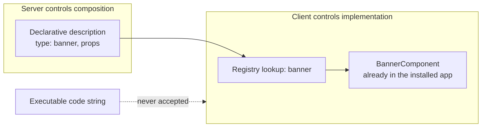

The client maps `"banner"` to an already-implemented `BannerComponent`.
**The server controls composition. The client controls implementation.** That boundary is the core architectural principle of SDUI.

## 3. Mental Model: A UI Language

Treat the backend as defining a small UI language, and the client as an interpreter that understands a fixed vocabulary:

```
SCREEN
 ├── HEADER
 ├── HERO
 ├── PRODUCT_CAROUSEL
 ├── PRODUCT_GRID
 ├── BANNER
 ├── TEXT
 ├── BUTTON
 └── SPACER
```

The client says "I understand `header`, `hero`, `product_carousel`."
The server says "for this user, construct the screen using these components, in this order."

## 4. Traditional UI vs SDUI

**Traditional**: changing the home screen layout means a code change, a PR, a build, QA, an app store release, and waiting for users to update.

**SDUI**: the server changes its response, the app fetches it, and the new layout appears - no native release required, as long as every component in the response already exists in the installed client.

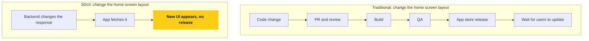

## 5. Why Companies Use It

- **Faster UI changes** - ship layout/content changes via server config instead of an app release. Shopify used this to let their team control store sections and experiment without the normal release cadence.
- **A/B testing** - the server can send Variant A or B compositions to different cohorts; the client doesn't need two hardcoded screens.
- **Personalization** - the server assembles the screen per user, location, device, subscription tier, purchase history, inventory, campaign, and time, instead of scattering `if (user.interest === ...)` branches through the client.
- **Multi-platform consistency** - a shared schema across iOS, Android, and web reduces drift between platform teams. Airbnb's Ghost Platform used one schema with reusable sections across all three. See [section 9](#9-beyond-mobile-web-desktop-and-multi-platform-sdui) for how this extends past mobile.
- **Note:** SDUI is about server-driven composition, not inherently cross-platform development - you can run SDUI purely inside a single React Native app without touching iOS/Android native code at all.

**Flowchart: How the Server Picks a Composition**

A/B testing and personalization are the same mechanism: the server chooses which composition to return for this request.

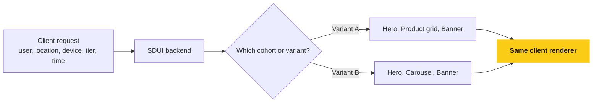

## 6. Core Architecture

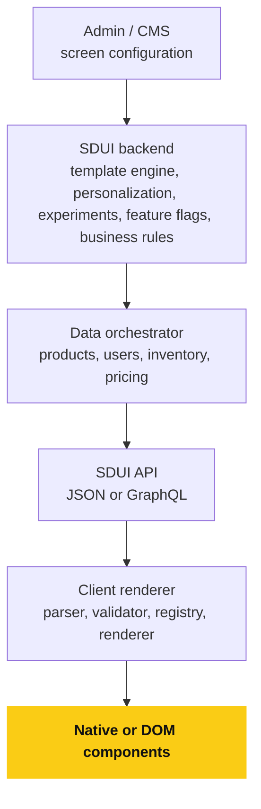

Shopify's documented implementation separates template processing, data loading, orchestration, and a GraphQL layer in essentially this shape.

## 7. Component Registry

The registry maps a `type` string to an actual component implementation.

```ts
const componentRegistry = {
  hero: Hero,
  banner: Banner,
  product_card: ProductCard,
  product_grid: ProductGrid,
  category_card: CategoryCard,
  button: Button,
  text: TextComponent,
};

function SDUIRenderer({ component }) {
  const Component = componentRegistry[component.type];
  if (!Component) return null;
  return <Component {...component.props} />;
}
```

**Flowchart: Registry Lookup**

An unknown `type` must be handled explicitly, otherwise the renderer would crash on it.

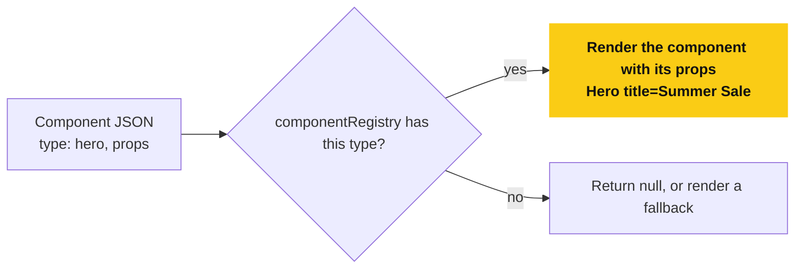

`{ "type": "hero", "props": { "title": "Summer Sale" } }` becomes `<Hero title="Summer Sale" />`.
This registry is the heart of the system, and it doubles as the executable version of your design system.

## 8. React Native Implementation

### 8.1 Suggested folder structure

```
src/
├── sdui/
│   ├── api/screenApi.ts
│   ├── schema/Screen.ts, Component.ts, Action.ts
│   ├── registry/componentRegistry.ts
│   ├── renderer/SDUIRenderer.tsx, ScreenRenderer.tsx
│   ├── actions/ActionDispatcher.ts
│   ├── fallback/UnknownComponent.tsx
│   └── analytics/SDUIAnalytics.ts
├── components/
│   ├── Hero/, Banner/, ProductCard/, ProductGrid/, ProductCarousel/, CategoryGrid/
└── screens/
```

Keep SDUI infrastructure separate from the UI components themselves.

### 8.2 Typed schema

```ts
type SDUIComponent = HeroComponent | BannerComponent | ProductGridComponent | ProductCarouselComponent;

interface HeroComponent {
  id: string;
  type: "hero";
  version: 1;
  props: { title: string; subtitle?: string; imageUrl?: string };
}

interface ProductGridComponent {
  id: string;
  type: "product_grid";
  version: 1;
  props: { columns: number; products: Product[] };
}
```

### 8.3 Runtime validation

TypeScript only validates at compile time; the server response arrives at runtime, so validate it (for example with Zod) before rendering:

```ts
const result = ScreenSchema.safeParse(response);
if (!result.success) {
  return <ErrorScreen />;
}
```

This matters because the server is effectively supplying executable UI instructions, even though they are declarative rather than code.

### 8.4 Client pipeline

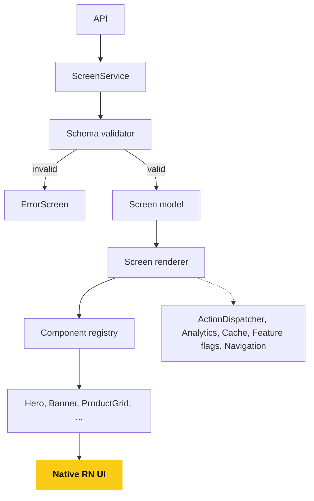

Alongside the renderer, wire up: `ActionDispatcher`, `Analytics`, `Cache`, `Feature Flags`, `Navigation`.

## 9. Beyond Mobile: Web, Desktop, and Multi-Platform SDUI

SDUI is not mobile-only.
It works for websites/web apps, mobile apps, desktop apps, and several platforms sharing one backend UI contract at once.
The core idea stays platform-independent: **the server decides the UI structure/composition; the client decides how to render it** - that holds whether the client is React Native, a browser, or a desktop shell.

### 9.1 On a website

A React/Next.js frontend consumes the exact same kind of contract:

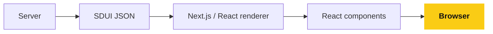

```json
{
  "screen": "homepage",
  "components": [
    { "type": "hero", "props": { "title": "Summer Sale" } },
    { "type": "product_grid", "props": { "columns": 4 } },
    { "type": "banner", "props": { "title": "20% Off" } }
  ]
}
```

```tsx
const componentRegistry = {
  hero: Hero,
  product_grid: ProductGrid,
  banner: Banner,
};
```

The browser renders `Hero -> Product Grid -> Banner`.
The server can later change that response to `Hero -> Flash Sale -> Featured Brands -> Product Grid` with no frontend deploy, as long as those components already exist in the registry - the same versioning/fallback rules from [section 10](#10-versioning-and-fallback) apply here too.

### 9.2 Across web, Android, and iOS at once

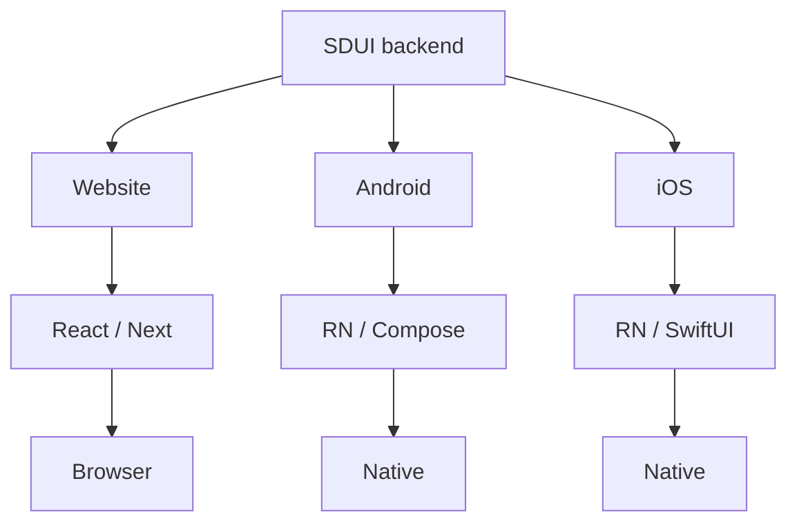

The server can send one conceptual structure, e.g. `{ "type": "product_grid", "products": [...] }`, and each client renders it according to its own layout rules:

| Platform | Rendering |
|---|---|
| Web | 4-column CSS Grid |
| Tablet | 3-column grid |
| Mobile | 2-column grid |

The UI **contract** is shared; the rendering **implementation** stays platform-specific.

### 9.3 SDUI vs SSR - not the same thing

**Server-Side Rendering (SSR)**: the server renders the actual page.

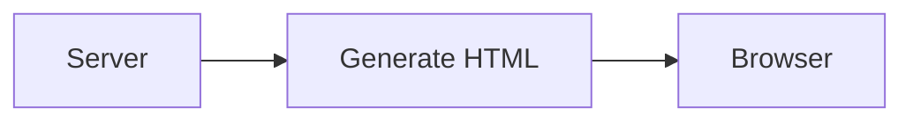

**Server-Driven UI (SDUI)**: the server tells the client what UI to construct, not necessarily finished HTML.

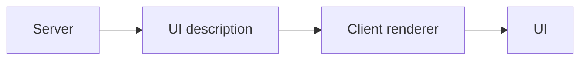

They combine well - Next.js can fetch the SDUI configuration server-side, build the React tree from it, and then SSR the resulting HTML:

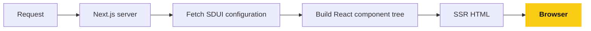

### 9.4 Applying this to one backend, two clients

For a marketplace with both a website and a React Native app, one SDUI API can drive both:

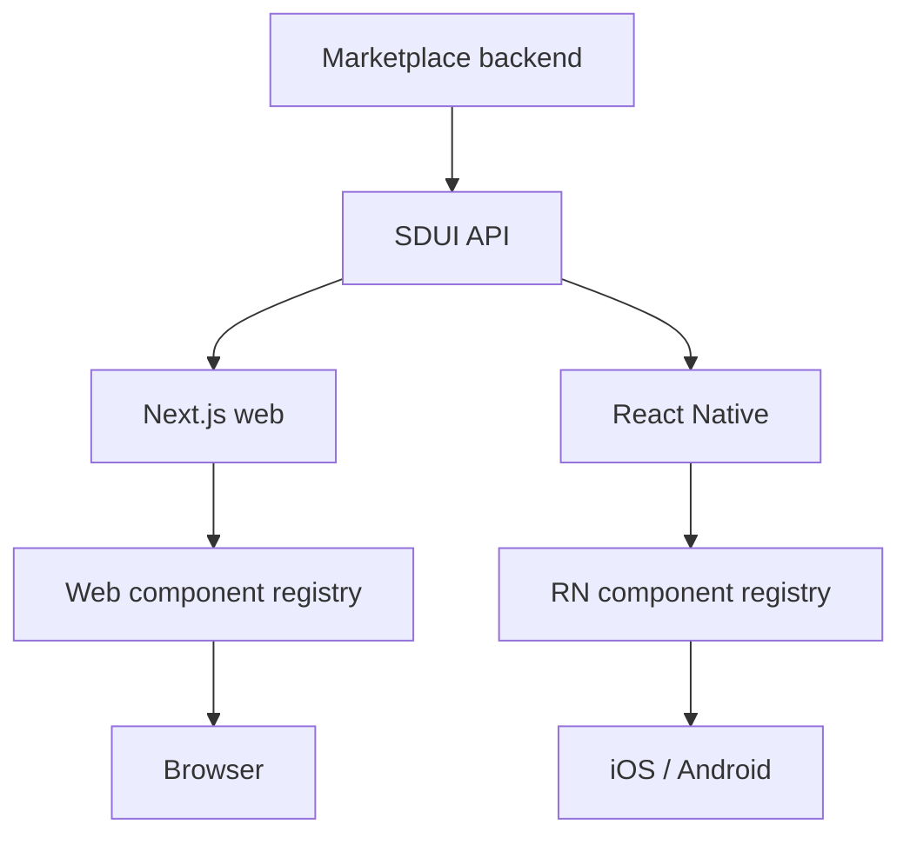

An admin panel that reorders `Homepage: Hero, Categories, Featured Brands, Flash Sale, Recommended Products, Newsletter` into a different order changes both surfaces from one configuration change.

### 9.5 Don't force one schema to control every pixel on every platform

Prefer a shared **product/section-level** contract over a shared **low-level** one - forcing web and mobile to behave pixel-identically is generally the wrong goal.

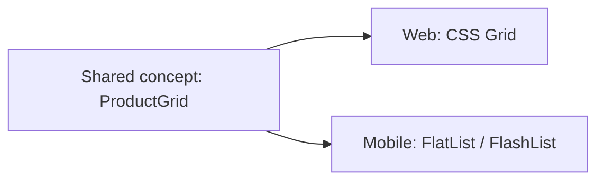

Each client owns the concrete rendering technique for a shared concept; that's a healthier split than one universal JSON schema dictating layout mechanics on every platform.

## 10. Versioning and Fallback

Installed binaries stay in the wild for a long time, so the contract needs two layers of versioning.

**Component versioning** - when `banner` gains new props, ship it as `banner:v2` and keep `banner:v1` registered, so old clients still work:

```
banner:v1 -> BannerV1
banner:v2 -> BannerV2
```

**Schema versioning** - version the whole response and let the client declare what it supports, e.g. `X-SDUI-Version: 3`, so the server can send a version-appropriate payload.

**Sequence diagram: Schema Version Negotiation**

The client declares what it supports, so the server never has to guess.

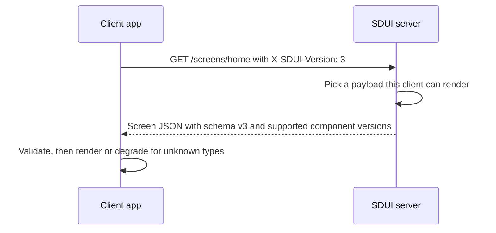

**Unknown components** - decide explicitly what happens when the client doesn't recognize a `type`:

- **Ignore** - unknown component simply doesn't render (fine for non-critical content).
- **Fallback** - render a generic substitute, or an explicit fallback the server provided:

```json
{
  "type": "new_component",
  "fallback": { "type": "text", "props": { "text": "Check out our latest products" } }
}
```

- **Require update** - for critical components, prompt the user to update the app.

**Flowchart: Unknown Component Decision**

Decide this per component up front, so an unrecognized type never crashes the screen.

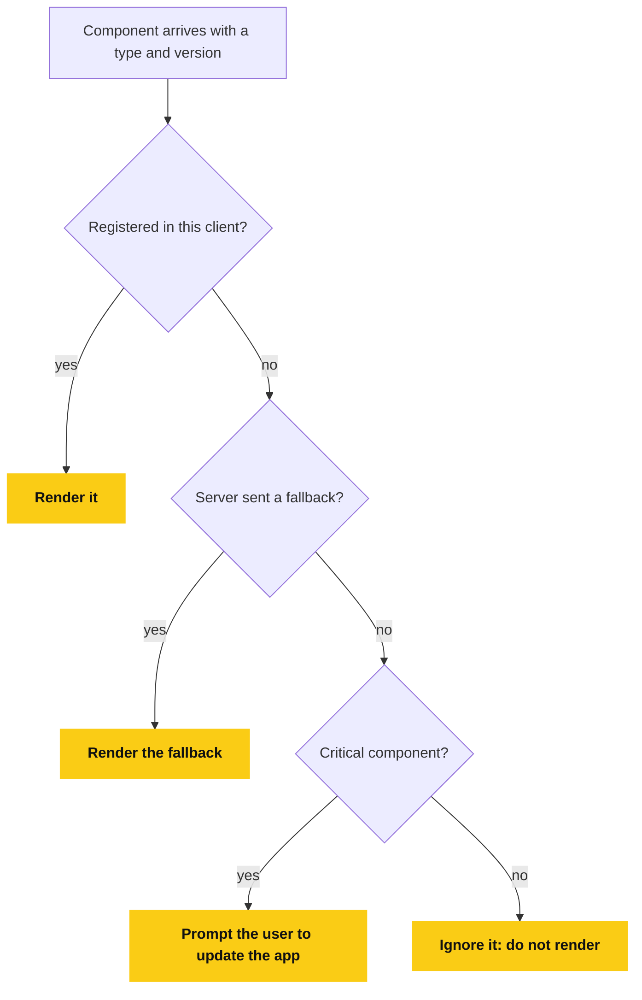

Production systems need explicit graceful-degradation behavior here rather than crashing on an unrecognized type.

## 11. Actions

The server can also describe what happens on interaction, not just what renders.

```json
{
  "type": "button",
  "props": { "title": "Shop Now" },
  "action": { "type": "navigate", "target": "/products" }
}
```

**Flowchart: Action Dispatch**

The payload only names an action type, and the client decides whether and how to run it.

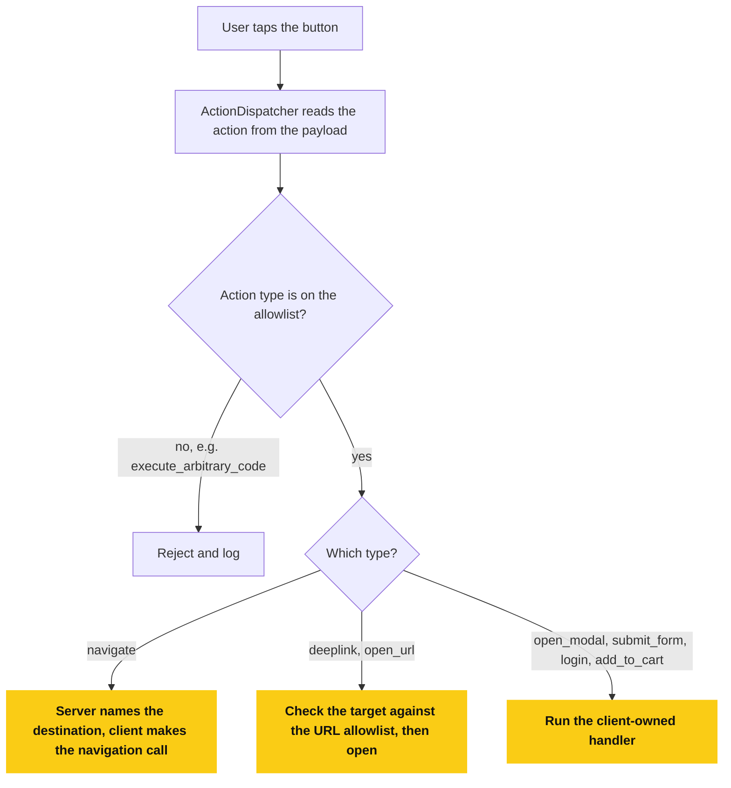

The client runs these through an `ActionDispatcher` against an **allowlist** of action types: `navigate`, `deeplink`, `open_url`, `open_modal`, `submit_form`, `login`, `add_to_cart` - never an `execute_arbitrary_code` action.
For navigation specifically, the server names the destination (`{ "screen": "product_detail", "id": "123" }`); the client owns the actual navigation call (`React Navigation` on mobile, the router on web).
Platform-specific rendering of the same intent is fine too - `{ "type": "action_sheet" }` can become a `UIAlertController` on iOS, a bottom sheet on Android, and a popover/modal on web; the schema expresses intent, not platform implementation.

## 12. What Should and Should Not Be Server-Driven

**Keep client-owned:** authentication internals, payment SDK integration, biometric auth, camera, Bluetooth, push notifications, native permissions, maps SDK, hardware interactions, complex animations, core business logic, security-sensitive flows.

**Good SDUI territory:** home screens, product listings, search results, recommendations, promotional surfaces, marketing banners, onboarding, content feeds, merchant/brand pages, category pages, experiments, personalized dashboards, campaign pages, dynamic forms.

**Flowchart: Should This Be Server-Driven?**

Ask the safety question first, then the interaction question, then the change-frequency question.

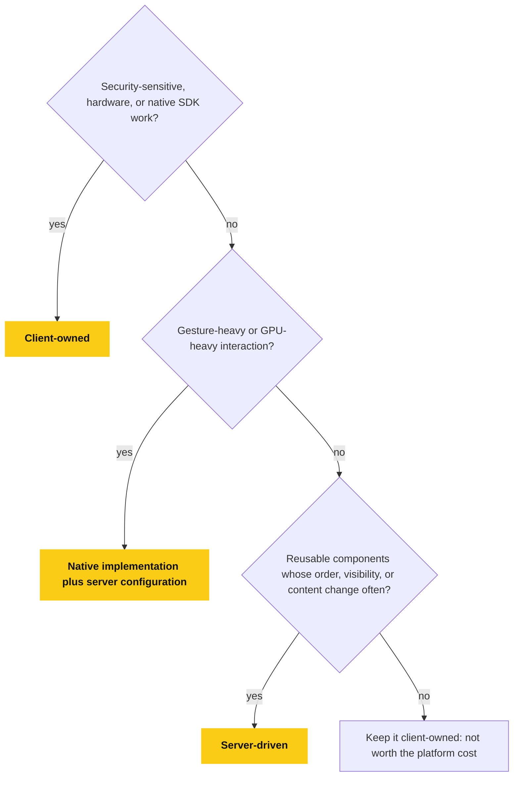

The ideal SDUI problem: *"we have many reusable UI components, and the business frequently needs to change their order, visibility, content, or composition without waiting for a release."*
A poor fit: a complex 3D/gesture-heavy editor driven by GPU state and device sensors - native implementation plus server-driven configuration is a better split there.

## 13. SDUI vs Adjacent Patterns

**Flowchart: SDUI or an Adjacent Pattern?**

Pick by what the server needs to control.
The patterns combine well, for example `CMS -> content -> SDUI backend -> UI composition -> client`.

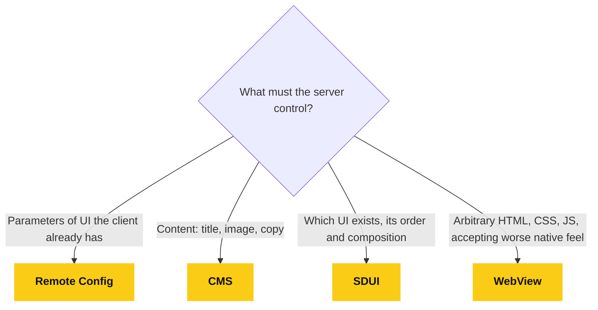

**Remote Config** - the client still contains the `if (showBanner) <Banner />` branch; the server only tweaks parameters. SDUI instead lets the server decide *which* UI exists, not just how it's parameterized. The two combine well.

**CMS** - a CMS manages content (title, image, copy); SDUI manages UI structure. A common pipeline is `CMS -> content -> SDUI backend -> UI composition -> client`.

**WebView** - a WebView ships arbitrary HTML/CSS/JS and gives more freedom but loses native scrolling, accessibility, and performance characteristics. SDUI keeps native/DOM rendering while still allowing server-driven composition.

**React Native itself** - RN is not SDUI. RN is `code -> React components -> native UI`. SDUI is `server JSON -> renderer -> components -> UI`. They compose: SDUI can be the content layer running inside an RN shell, or a Next.js shell on web.

## 14. Data vs UI, and Server Orchestration

Two valid response shapes:

- **UI + all data inline** - simplest, one round trip.
- **UI definition + data references** - `{ "type": "product_grid", "props": { "dataSource": "trending_products" } }`, client fetches the data source separately.

**Flowchart: Inline Data or Data Reference**

Inline data is one round trip.
A reference keeps the payload small for long lists.

```mermaid
flowchart TD
  A["Screen response"] --> B{"Where does the list data live?"}
  B -->|"Inline: simplest, one round trip"| C["props.products = [ ... ]"]
  B -->|"Reference: long lists"| D["props.dataSource = trending_products"]
  D --> E["Client fetches the data separately, paginated"]
```

Airbnb's Ghost Platform combines section descriptions with the exact data needed to render them, with the backend handling orchestration across services:

```mermaid
flowchart LR
  R["Home request"] --> O["SDUI orchestrator"]
  O --> U["User"]
  O --> P["Products"]
  O --> Rc["Recommendations"]
  O --> Cm["CMS"]
  O --> E["Experiments"]
  U --> C["Compose UI"]
  P --> C
  Rc --> C
  Cm --> C
  E --> C
  C --> Resp["Response"]:::done

  classDef done fill:#facc15,stroke:#facc15,color:#111111,font-weight:bold
```

REST or GraphQL both work as the transport; the contract matters more than the protocol.
For long lists, don't inline thousands of items in one payload - send an initial page plus pagination or a data reference.

## 15. Analytics, Caching, Offline, Performance

**Analytics** - attach tracking metadata per component so impressions/clicks are handled by the SDUI infrastructure instead of being hand-wired per screen:

```json
{ "id": "hero_1", "type": "hero", "analytics": { "impression": "home_hero_impression", "click": "home_hero_click" } }
```

**Caching** - cache the last successful SDUI response locally, render it immediately on launch, then fetch and swap in fresh content. For non-personalized screens, cache aggressively at the CDN; personalized/experiment-dependent responses need the cache key to incorporate user segment, experiment, and location, or you get cache fragmentation.

**Flowchart: Cache, Refresh, and Fallback**

Render what you have immediately, refresh in the background, and never leave the user on a blank screen.

```mermaid
flowchart TD
  A["App launch"] --> B{"Cached SDUI response?"}
  B -->|yes| C["Render the cached screen immediately"]
  B -->|no| D["Fetch from the API"]
  C --> D
  D --> E{"Fetch OK and JSON valid?"}
  E -->|yes| F["Swap in fresh content and update the cache"]:::done
  E -->|no| G{"A cached screen is on display?"}
  G -->|yes| H["Keep showing it"]
  G -->|no| I["Show the native fallback screen"]:::done

  classDef done fill:#facc15,stroke:#facc15,color:#111111,font-weight:bold
```

**Offline / failure** - keep a native fallback screen for when the API fails, the JSON is invalid, or the schema is incompatible, so the user never sees a blank screen.

**Performance** - naive SDUI adds network + JSON parsing + validation + tree construction on top of rendering. Optimize payload size, avoid deep nesting, virtualize long lists, prefetch, and paginate rather than inlining huge datasets.

## 16. Security, Accessibility, Localization

**Security** - the server response now influences what renders, what's tappable, and where navigation goes. Never trust arbitrary URLs (allowlist them), never allow arbitrary native actions (registry-only), never treat JSON as a code transport, validate on both sides, and only return data the requesting user is authorized to see.

**Flowchart: Layers of Trust**

The response is data, not code, and every layer can reject it.

```mermaid
flowchart TD
  A["Server response"] --> B["Validate the schema on the client"]
  B --> C["Components: registry only"]
  C --> D["Actions: allowlist only"]
  D --> E["URLs: allowlist only"]
  E --> F["Data: only what this user may see, enforced on the server"]
  F --> G["Render"]:::done
  B -.->|fails| X["Reject and fall back safely"]
  C -.->|fails| X
  D -.->|fails| X
  E -.->|fails| X

  classDef done fill:#facc15,stroke:#facc15,color:#111111,font-weight:bold
```

**Accessibility** - this stays a client responsibility. Components in the registry must already implement labels, roles, focus behavior, font scaling, contrast, and touch targets; the server only supplies content and composition.

**Localization** - either send resolved strings (`"title": "Summer Sale"`) or keys (`"titleKey": "home.summer_sale"`) for client-side resolution. Airbnb's Ghost Platform sends section data already translated, localized, and formatted before the client consumes it.

## 17. Design Tokens Over Arbitrary Styling

Avoid exposing raw style properties in the payload:

```json
{ "padding": 17, "margin": 23, "borderRadius": 9, "fontSize": 19 }
```

Use design tokens the client resolves instead:

```json
{ "spacing": "medium", "radius": "large", "textStyle": "heading2" }
```

**Flowchart: Design Tokens**

The payload names a token and the client theme decides the actual value for each platform.

```mermaid
flowchart LR
  P["Payload tokens<br/>spacing: medium, radius: large, textStyle: heading2"] --> T["Client theme resolves tokens"]
  T --> W["Web: CSS values"]
  T --> M["Mobile: native values"]
  X["Raw styles<br/>padding: 17, fontSize: 19"] -.->|"avoid: a remote CSS engine by accident"| T
```

If the backend team starts specifying padding, margin, shadows, and font sizes per component, that's a sign you've built a remote CSS engine by accident - prefer predefined layouts and components over arbitrary styling. Same logic applies to layout primitives (`stack`, `grid`, `carousel`): keep the layout language bounded, not infinitely composable.

## 18. Testing and Observability

**Test layers:** client unit tests (JSON -> component), schema tests (response matches contract), snapshot tests (tree -> UI), integration tests (API -> renderer -> screen), contract tests (backend vs client expectations), and compatibility tests across app-version x schema-version combinations.

**Flowchart: Test Layers**

Each layer catches a different kind of break, from the contract down to real app-version combinations.

```mermaid
flowchart TD
  A["Schema tests<br/>response matches the contract"] --> B["Contract tests<br/>backend vs client expectations"]
  B --> C["Client unit tests<br/>JSON to component"]
  C --> D["Snapshot tests<br/>tree to UI"]
  D --> E["Integration tests<br/>API to renderer to screen"]
  E --> F["Compatibility tests<br/>app version x schema version"]:::done

  classDef done fill:#facc15,stroke:#facc15,color:#111111,font-weight:bold
```

**Version compatibility matrix example:**

| App | Supported SDUI |
|---|---|
| 1.0 | v1 |
| 1.5 | v1-v2 |
| 2.0 | v1-v3 |
| 3.0 | v1-v4 |

**Observability** - log `screen`, `schemaVersion`, `component`, `componentVersion`, `clientVersion`, and `platform` on every render/failure, so an error like `Unknown component: recommendation_carousel:v3` is immediately traceable to which client and server version produced it.

## 19. Real-World References: Airbnb and Shopify

**Airbnb - Ghost Platform.** A standardized GraphQL schema shared across web, iOS, and Android, built from three primitives: **screens**, **sections**, and **actions**. Sections are cohesive, reusable groups (not single-pixel-level components), and the same schema drives strongly-typed generated models on every platform.

**Flowchart: Airbnb Ghost Platform**

One shared GraphQL schema drives typed models on every platform.

```mermaid
flowchart TD
  G["Shared GraphQL schema"] --> Sc["Screens"]
  Sc --> Se["Sections<br/>cohesive, reusable groups"]
  Se --> Ac["Actions"]
  G --> W["Web: generated typed models"]
  G --> I["iOS: generated typed models"]
  G --> A["Android: generated typed models"]
```

**Shopify - Shop app Store Screen.** Previously fully client-composed; re-architected around template processing, data loading, a GraphQL layer, and orchestration, so the server controls which sections, products, and collections appear per merchant - without a client release per merchant change.

**Flowchart: Shopify Store Screen**

The server decides which sections, products, and collections appear for each merchant, with no client release per merchant change.

```mermaid
flowchart LR
  T["Template processing"] --> D["Data loading"] --> G["GraphQL layer"] --> O["Orchestration"] --> S["Sections chosen per merchant"]:::done

  classDef done fill:#facc15,stroke:#facc15,color:#111111,font-weight:bold
```

## 20. Maturity Levels

| Level | Capability |
|---|---|
| 0 | Remote config (`showBanner = true`) |
| 1 | Server-driven content |
| 2 | Server-driven sections (hero, products, categories) |
| 3 | Server-driven layouts (grid, carousel, stack, tabs) |
| 4 | Server-driven actions (navigation, deeplinks, modals, forms) |
| 5 | Personalization + experiments (segments, A/B, feature flags) |
| 6 | Full platform (CMS, template engine, schema registry, versioning, analytics, orchestration, observability) |

**Flowchart: Maturity Ladder**

Each level adds server control on top of the one below it.

```mermaid
flowchart TD
  L0["Level 0: Remote config"] --> L1["Level 1: Server-driven content"]
  L1 --> L2["Level 2: Server-driven sections"]
  L2 --> L3["Level 3: Server-driven layouts"]
  L3 --> L4["Level 4: Server-driven actions"]
  L4 --> L5["Level 5: Personalization and experiments"]
  L5 --> L6["Level 6: Full platform"]:::done

  classDef done fill:#facc15,stroke:#facc15,color:#111111,font-weight:bold
```

Most teams don't need level 6 on day one.

## 21. Pros and Cons

| Benefit | Why it matters |
|---|---|
| Faster UI changes | Server deploy instead of a release |
| A/B testing | Layout varies by cohort without two hardcoded screens |
| Personalization | Different composition per user |
| Cross-platform consistency | One shared UI contract across web, iOS, Android |
| Reusability | Components appear anywhere in the tree |
| Rollback | Revert via server config, no re-release |
| CMS integration | Non-engineers can control composition |

| Cost | Why it matters |
|---|---|
| Complexity | You're building a UI platform, not a JSON parser |
| Versioning | Old clients stay installed for a long time |
| Debugging | UI behavior is now distributed across server + client |
| Network dependency | UI structure itself depends on connectivity |
| Performance | Parsing/validation overhead per screen |
| Testing | Many more app-version x schema-version combinations |
| Security | Server now controls executable actions |
| Backend complexity | Orchestration across services can become substantial |

## 22. Recommended Rollout

Don't start with "everything is SDUI." Start with a hybrid app shell and move suitable surfaces into SDUI incrementally:

```mermaid
flowchart TD
  APP["App"] --> S["Native / app shell<br/>Auth, navigation, native APIs"]
  APP --> U["SDUI surfaces<br/>Hero, Products, Promo, ..."]
```

Phased path: **1)** home page sections, **2)** product/category pages, **3)** promotions, **4)** personalization, **5)** experiments, **6)** CMS / visual page builder.
This delivers value without immediately standing up a full platform.

**Flowchart: Phased Rollout**

Each phase delivers value on its own, so you never have to stand up the full platform first.

```mermaid
flowchart TD
  P1["1. Home page sections"] --> P2["2. Product and category pages"]
  P2 --> P3["3. Promotions"]
  P3 --> P4["4. Personalization"]
  P4 --> P5["5. Experiments"]
  P5 --> P6["6. CMS or visual page builder"]
```

For a marketplace specifically, this pattern is a strong fit for brand/store pages - a `brand_store` template with a `sections[]` array lets each brand get a different hero/collections/products/story layout on both the website and the app, with zero client releases per brand change, mirroring Shopify's documented Store Screen use case.

## 23. The One Rule That Explains All of It

> **The server can only ask an already-installed client to render capabilities that client actually contains.**

This single constraint explains almost every SDUI design decision: component/schema versioning, fallback strategy, the component registry, schema negotiation, and why a hybrid (shell + SDUI) architecture is usually the right call over "SDUI everywhere" - on mobile, web, or desktop alike.

Introducing a genuinely new component (e.g. `ai_workout_planner`) still requires: implement it on each target client, register its type, ship a release/deploy, wait for adoption, *then* the server can start returning it.
SDUI reduces releases for **composition and content** changes; it does not eliminate releases for new **capabilities**.

**Flowchart: Which Changes Need a Release**

Composition and content changes are server-only.
A genuinely new capability still needs a client release first.

```mermaid
flowchart TD
  A["Requested change"] --> B{"Uses only components that installed clients already contain?"}
  B -->|"yes: composition or content"| S["Change the server response<br/>No release needed"]:::done
  B -->|"no: a new capability"| C["Implement it on each target client"]
  C --> D["Register its type"]
  D --> E["Ship a release or deploy"]
  E --> F["Wait for adoption"]
  F --> G["Server can now return it"]:::done

  classDef done fill:#facc15,stroke:#facc15,color:#111111,font-weight:bold
```

**Boundary to hold onto:** server decides *what*, *where*, *when*, *who*, and *which variant*. Client decides *how*.
