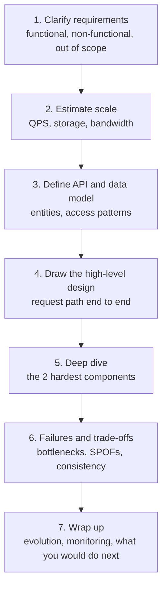
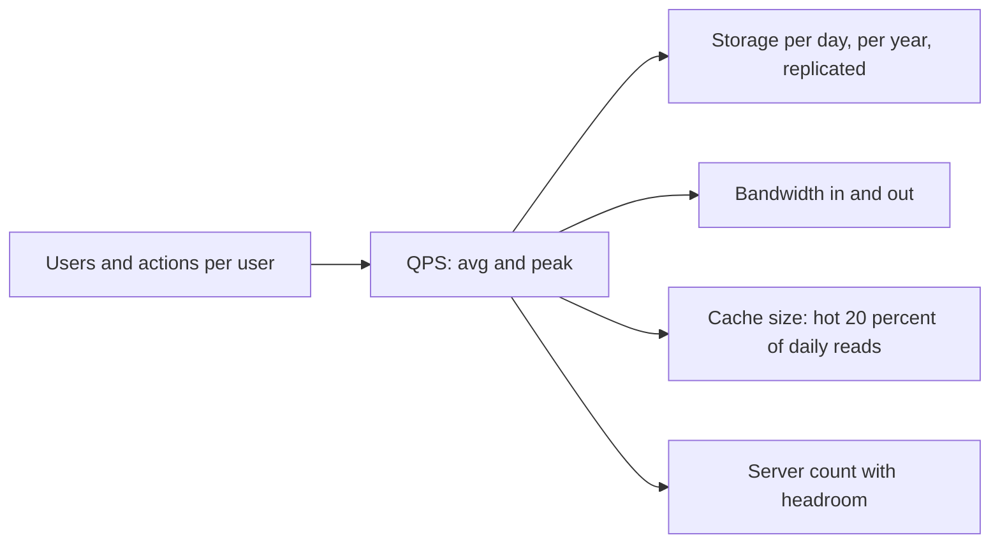
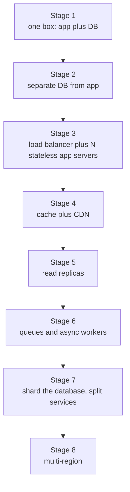
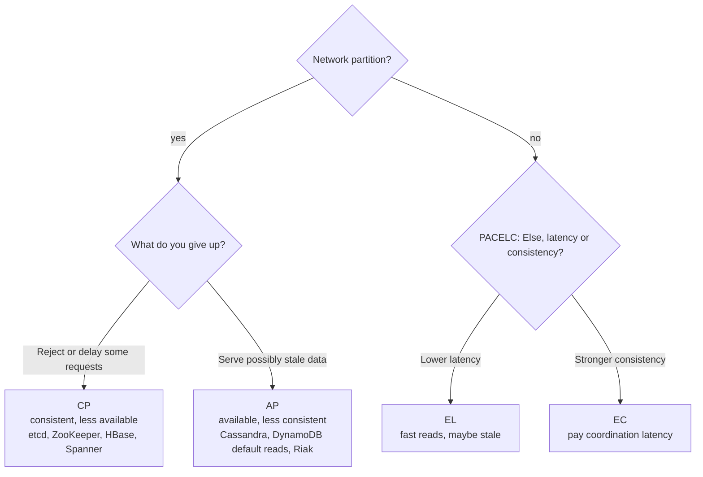
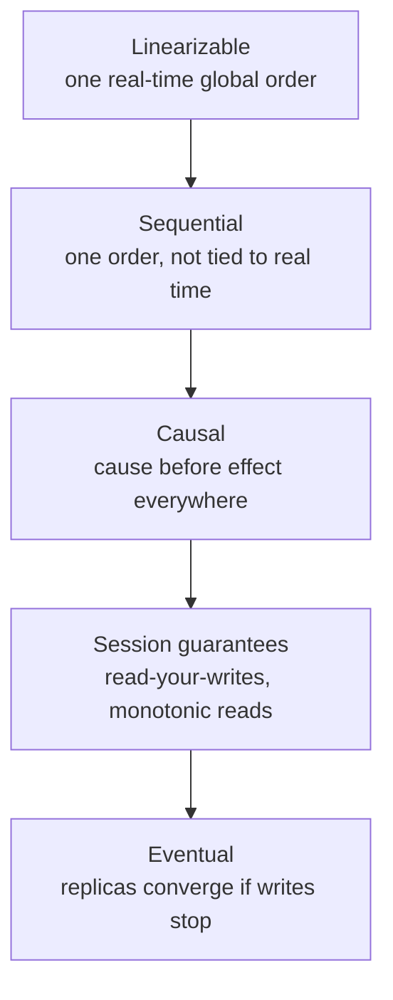

# 📘 System Design Fundamentals

This page is the shared base for both HLD and LLD.
It teaches how to approach a design problem, how to size a system with quick math, and the vocabulary every later page assumes: scalability, availability, latency, consistency.
If you only have an hour, read sections 2, 4 and 8.

## Table of Contents

1. [What System Design Is](#1-what-system-design-is)
2. [The Seven-Step Framework](#2-the-seven-step-framework)
3. [Requirements](#3-requirements)
4. [Back-of-Envelope Estimation](#4-back-of-envelope-estimation)
5. [Scaling Stages](#5-scaling-stages)
6. [Availability and Reliability](#6-availability-and-reliability)
7. [Latency, Throughput and Percentiles](#7-latency-throughput-and-percentiles)
8. [CAP and PACELC](#8-cap-and-pacelc)
9. [Consistency Models](#9-consistency-models)
10. [Core Trade-offs](#10-core-trade-offs)
11. [Beginner Questions](#11-beginner-questions)
12. [Cheat Sheet](#12-cheat-sheet)

---

## 1. What System Design Is

System design is choosing components, data flows and failure behavior so a product meets its requirements at a given scale, cost and reliability.
There is no single right answer.
There are answers that fit the requirements and answers that do not.

Two flavors appear in interviews:

| Flavor | Question shape | You are graded on |
| --- | --- | --- |
| **HLD** (High-Level Design) | "Design Twitter", "Design a URL shortener" | Requirements, estimates, components, data model, scaling, trade-offs |
| **LLD** (Low-Level Design) | "Design a parking lot", "Design an LRU cache" | Classes, interfaces, patterns, extensibility, working code |

A third flavor is growing fast: **AI system design** (LLM serving, RAG, agents).
It is HLD with new components, covered in [AI System Design](/docs/system-design/hld/ai-system-design).

What interviewers actually score, regardless of flavor:

- **Problem framing:** do you ask before you build?
- **Structure:** do you move through the problem in an order you can defend?
- **Depth:** can you go one level deeper on at least two components?
- **Trade-offs:** do you name what you give up with every choice?
- **Failure thinking:** what breaks, and what does the user see when it does?
- **Communication:** can the interviewer follow and steer you?

---

## 2. The Seven-Step Framework

Use the same skeleton every time.
It keeps you from jumping to boxes and arrows before you know what the system must do.



| Step | Time in a 45 min interview | What good looks like |
| --- | --- | --- |
| 1. Requirements | 5 min | 3 to 5 functional requirements, 3 to 5 non-functional with numbers, explicit non-goals |
| 2. Estimates | 3 to 5 min | Two or three numbers that drive a design decision, not a full spreadsheet |
| 3. API and data | 5 min | Endpoints with verbs and payload shape, tables or documents with keys and indexes |
| 4. High-level design | 10 min | One diagram, one happy path traced end to end |
| 5. Deep dive | 12 min | Two components, with alternatives and reasons |
| 6. Failures | 5 min | What if X dies, what if traffic doubles, what if the region fails |
| 7. Wrap up | 2 min | Metrics, rollout, future scaling |

Rules of thumb:

- Say your assumption out loud, then write it down.
- Start with a design that works for one server, then remove the bottlenecks one at a time.
- Do not name a technology until you can say what property you need from it.
- Prefer boring technology (Postgres, Redis, Kafka, S3) unless a requirement rules it out.
- End every component with "and what happens when it fails".

---

## 3. Requirements

### 3.1 Functional Requirements

What the system does, phrased as user actions.
Keep them to a short list you can finish.

Example, URL shortener:

1. Given a long URL, return a short URL.
2. Given a short URL, redirect to the long URL.
3. Optional: custom alias, expiry, click analytics.

Say what is out of scope.
"I will skip user accounts and abuse detection unless you want them."

### 3.2 Non-Functional Requirements

How well the system does it.
These drive the architecture far more than the features.

| Quality | Question to ask | Typical numbers |
| --- | --- | --- |
| **Scale** | How many users, requests per second, data size? | 100M DAU, 10k QPS, 50 TB |
| **Latency** | What is the target for reads and writes? | p99 under 200 ms for reads |
| **Availability** | What downtime is acceptable? | 99.9% or 99.99% |
| **Consistency** | Can users see stale data? For how long? | Eventual for a feed, strong for payments |
| **Durability** | Can we ever lose data? | 11 nines for object storage, zero loss for payments |
| **Read to write ratio** | Which side dominates? | 100:1 for a URL shortener |
| **Security and privacy** | Who can see what? | PII, regional data residency |
| **Cost** | Is there a budget? | Right-size, do not go multi-region for a hobby app |

A useful trick: for each requirement ask "what would break my design if this were 10x?"

### 3.3 Identify the Core Access Patterns

Before drawing a database, list the queries.
The data model follows the queries, not the other way round.

| Access pattern | Frequency | Consequence |
| --- | --- | --- |
| Get by primary key | Very high | Key-value store or indexed table |
| List a user's items, newest first | High | Index on (user_id, created_at) |
| Full text search | Medium | Search engine, not `LIKE '%x%'` |
| Aggregate over a time window | Low, heavy | Column store or stream processing |
| Range scan | Medium | Ordered storage (B-tree, LSM with sorted keys) |

---

## 4. Back-of-Envelope Estimation

The goal is not accuracy.
The goal is to know whether you need one machine or one thousand, and whether the bottleneck is CPU, memory, disk or network.

### 4.1 Powers of Two and Time

| Power | Approx value | Name |
| --- | --- | --- |
| 2^10 | 1 thousand | 1 KB |
| 2^20 | 1 million | 1 MB |
| 2^30 | 1 billion | 1 GB |
| 2^40 | 1 trillion | 1 TB |
| 2^50 | 1 quadrillion | 1 PB |

| Time | Seconds |
| --- | --- |
| 1 day | 86,400 (round to 100,000) |
| 1 month | about 2.6 million |
| 1 year | about 31.5 million |

Shortcuts:

- 1 million requests per day is about 12 requests per second.
- 100 million per day is about 1,200 per second.
- 1 billion per day is about 12,000 per second.
- Peak traffic is commonly 2x to 5x the average. Use 3x unless told otherwise.

### 4.2 Latency Numbers

Exact values drift with hardware, but the orders of magnitude are stable.
These are rounded, modern-ish figures.

| Operation | Approx time |
| --- | --- |
| L1 cache reference | 1 ns |
| Main memory reference | 100 ns |
| Compress 1 KB | a few microseconds |
| Send 1 KB over a 1 Gbps network | about 10 microseconds |
| SSD random read (NVMe) | 20 to 100 microseconds |
| Read 1 MB sequentially from memory | tens of microseconds |
| Round trip inside a datacenter | 0.3 to 1 ms |
| Read 1 MB sequentially from SSD | about 0.3 to 1 ms |
| HDD seek | about 10 ms |
| Round trip same continent (for example US east to west) | 60 to 80 ms |
| Round trip across oceans | 100 to 200 ms |

Take-aways that shape designs:

- Memory is roughly 1000x faster than SSD, and SSD roughly 100x faster than a cross-region call.
- A network call is expensive compared to a function call, so chatty microservices add up.
- Sequential disk access is far cheaper than random access. This is why logs (Kafka, LSM trees) are fast.
- Cross-region round trips dominate any synchronous multi-region design.

### 4.3 Worked Example: Photo Sharing App

**Assumptions**

- 100 million daily active users.
- Each user uploads 0.1 photos per day and views 50 photos per day.
- Average uploaded photo 2 MB, average thumbnail served 200 KB.
- Keep photos forever, replication factor 3.

**Write path**

```text
Uploads per day  = 100M x 0.1        = 10M
Upload QPS avg   = 10M / 86,400      = about 116
Upload QPS peak  = 116 x 3           = about 350
```

**Read path**

```text
Views per day    = 100M x 50         = 5 billion
View QPS avg     = 5B / 86,400       = about 58,000
View QPS peak    = 58k x 3           = about 175,000
Read:write ratio = 5B : 10M          = 500 : 1
```

**Storage**

```text
New data per day = 10M x 2 MB        = 20 TB
Per year         = 20 TB x 365       = 7.3 PB
With 3 replicas  = about 22 PB per year
```

**Bandwidth (egress)**

```text
5B views x 200 KB = 1 PB per day
1 PB / 86,400 s   = about 11.6 GB/s = about 93 Gbps average
```

**Decisions the numbers force**

- Reads outnumber writes 500 to 1, so cache aggressively and serve images from a CDN. The origin cannot carry 93 Gbps cheaply.
- Storage is petabytes per year, so use object storage (S3 class) with tiering, not a database.
- 350 write QPS is small. The upload path is not the hard part. Metadata and feed generation are.
- Metadata (photo id, owner, URL) is tiny compared to blobs. Keep it in a database and the blobs in object storage.

### 4.4 Server Count

```text
Peak QPS               = 175,000
One app server handles = 5,000 QPS of simple requests (assume)
Servers needed         = 175,000 / 5,000 = 35
Add N+2 redundancy     = about 40 to 50 servers
```

If the estimate says 3 servers, do not draw a 200 node cluster.
If it says 3,000, sharding and a serious cache tier are unavoidable.

### 4.5 Estimation Template



Common mistakes:

- Forgetting the peak factor.
- Forgetting replication in storage numbers.
- Doing 10 minutes of arithmetic that does not change any decision.
- Mixing bits and bytes. Network is quoted in bits per second, storage in bytes.

---

## 5. Scaling Stages

Most real systems, and most good interview answers, grow through the same stages.
Name the stage you are at and what triggers the next one.



| Stage | Trigger to move on | What you add |
| --- | --- | --- |
| 1 to 2 | DB and app fight for CPU and memory | Separate hosts |
| 2 to 3 | One app server saturates or is a single point of failure | Load balancer, stateless services, shared session store |
| 3 to 4 | DB reads dominate, latency grows | Redis or Memcached, CDN for static assets |
| 4 to 5 | Read QPS exceeds one primary | Read replicas, accept replication lag |
| 5 to 6 | Slow work blocks requests (email, video, reports) | Message queue, workers, retries |
| 6 to 7 | Write volume or data size exceeds one DB node | Sharding, service decomposition |
| 7 to 8 | Global users, regional outages, compliance | Multi-region, geo routing, data residency |

### 5.1 Vertical vs Horizontal Scaling

| | Vertical (scale up) | Horizontal (scale out) |
| --- | --- | --- |
| How | Bigger machine | More machines |
| Simplicity | Very simple | Needs load balancing, distributed state |
| Ceiling | Hardware limit, price curve gets steep | Practically unbounded |
| Failure | Single point of failure | Survives node loss |
| When | First, until it hurts | When one box cannot cope or must be redundant |

A single modern database server with NVMe and hundreds of GB of RAM handles far more than people assume.
Do not shard early.
Scale up, add replicas and caching first, and shard when writes or data size force it.

### 5.2 Stateless vs Stateful

A **stateless** service keeps no per-user state between requests, so any instance can serve any request.
That makes scaling out and replacing instances trivial.

To make a service stateless:

- Store sessions in a shared store (Redis) or in a signed token (JWT).
- Store uploads in object storage, not on local disk.
- Keep caches that must be consistent outside the process, or accept per-instance staleness.

State does not disappear.
It moves to the data tier, which is where you concentrate the hard problems: replication, sharding, consistency.

---

## 6. Availability and Reliability

### 6.1 Definitions

| Term | Meaning |
| --- | --- |
| **Reliability** | The system does the correct thing |
| **Availability** | The fraction of time the system is up and serving |
| **Durability** | Stored data is not lost |
| **Fault** | A component deviates from spec |
| **Failure** | The system as a whole stops meeting its spec |
| **Fault tolerance** | Faults do not become failures |

### 6.2 The Nines

| Availability | Downtime per year | Per month | Per day |
| --- | --- | --- | --- |
| 99% (two nines) | 3.65 days | 7.3 hours | 14.4 minutes |
| 99.9% (three nines) | 8.76 hours | 43.8 minutes | 1.44 minutes |
| 99.99% (four nines) | 52.6 minutes | 4.4 minutes | 8.6 seconds |
| 99.999% (five nines) | 5.26 minutes | 26 seconds | 0.86 seconds |

Every extra nine costs roughly an order of magnitude more effort.
Ask what the business needs.
An internal report tool does not need five nines.

### 6.3 Availability Math

Components in **series** (all must work):

```text
A_total = A1 x A2 x A3
Three services at 99.9% each = 0.999^3 = 99.7%
```

Components in **parallel** (any one is enough):

```text
A_total = 1 - (1 - A)^n
Two replicas at 99.9% each = 1 - 0.001^2 = 99.9999%
```

Consequences:

- A long synchronous call chain lowers availability. Ten services at 99.9% give about 99.0%.
- Redundancy raises availability only if failures are independent. Two replicas in one rack, one AZ or one region share fate.
- The load balancer, DNS and any shared dependency become the new ceiling.

### 6.4 SLI, SLO, SLA

| Term | What it is | Example |
| --- | --- | --- |
| **SLI** (indicator) | A measured signal | Fraction of requests under 300 ms and non-5xx |
| **SLO** (objective) | Internal target for an SLI | 99.9% over 30 days |
| **SLA** (agreement) | A contract with penalties | 99.5% or you get credits |
| **Error budget** | 100% minus the SLO | 0.1% of requests may fail, spend it on releases |

Details and burn-rate alerting are in [Reliability and Operations](/docs/system-design/hld/reliability-and-operations).

### 6.5 Redundancy Patterns

| Pattern | How it works | Trade-off |
| --- | --- | --- |
| **Active-passive** | Standby takes over on failure | Failover time, idle capacity, untested standby risk |
| **Active-active** | All nodes serve traffic | Better utilization, needs conflict handling for shared state |
| **N+1 / N+2** | Capacity for N plus spares | Cost of spares |
| **Multi-AZ** | Spread across availability zones in one region | Protects against datacenter loss, not regional loss |
| **Multi-region** | Spread across regions | Cross-region latency, consistency and cost |

---

## 7. Latency, Throughput and Percentiles

**Latency** is how long one request takes.
**Throughput** is how many requests per unit time the system completes.
They are related but not the same: batching raises throughput and often raises latency.

### 7.1 Use Percentiles, Not Averages

An average hides the slow tail.
Users experience the tail.

| Percentile | Meaning |
| --- | --- |
| p50 | Median, half of requests are faster |
| p95 | 1 in 20 requests is slower |
| p99 | 1 in 100 is slower |
| p99.9 | 1 in 1000 is slower |

### 7.2 Tail Latency at Scale

If a page needs 100 backend calls and each has a 1% chance of being slow, the chance that at least one is slow is 1 - 0.99^100, about 63%.
Fan-out amplifies the tail.

Mitigations:

- Timeouts and deadlines that propagate down the call chain.
- Hedged requests: send a second request after the p95 time and use the first response.
- Cap fan-out, cache, or precompute.
- Load shedding and bulkheads so one slow dependency does not drain shared threads.

### 7.3 Little's Law

```text
L = lambda x W
L      = average number of requests in the system
lambda = arrival rate (requests per second)
W      = average time each request spends in the system
```

If 1,000 requests per second each take 200 ms, about 200 requests are in flight at any time.
Size thread pools and connection pools with this, and note that when W grows during an incident, L grows too, which is how overload spirals.

---

## 8. CAP and PACELC

### 8.1 CAP

In a distributed data store, when a **network partition** occurs, you must choose between:

- **Consistency (C):** every read sees the latest write (linearizability), or returns an error.
- **Availability (A):** every request to a live node gets a non-error response, possibly stale.

Partitions are not optional in a real network, so the real choice is CP or AP **during a partition**.
Outside a partition you can have both.



Common misunderstandings:

- CAP does not say "pick two of three" in normal operation.
- It is a statement about behavior **during** a partition, and about linearizability specifically.
- Many systems are tunable per request (for example Cassandra quorum levels, DynamoDB strongly consistent reads).
- "CA" is not a real category for a system that spans a network.

### 8.2 PACELC

PACELC extends CAP: if there is a **P**artition, choose **A** or **C**; **E**lse, choose **L**atency or **C**onsistency.
It captures that even without partitions, replication forces a trade-off between latency and consistency.

| System | During partition | Else |
| --- | --- | --- |
| DynamoDB (default), Cassandra, Riak | PA | EL |
| Spanner, CockroachDB, etcd | PC | EC |
| MongoDB (default settings) | PA-ish | EC |
| PNUTS | PC | EL |

Use the table as a rough guide.
Behavior depends on configuration, so say "it depends on the read and write concern" if asked.

### 8.3 Picking C or A by Domain

| Domain | Lean | Reason |
| --- | --- | --- |
| Bank balance, inventory at checkout, seat booking | Consistency | Wrong answers cost money or trust |
| Social feed, like counts, view counts | Availability | Slightly stale is fine |
| Shopping cart (Dynamo paper) | Availability | Never block adding to cart, merge later |
| Leader election, config, locks | Consistency | Two leaders is a disaster |
| Search results, recommendations | Availability | Freshness is best effort |

---

## 9. Consistency Models

From strongest to weakest.



| Model | Guarantee | Example failure without it |
| --- | --- | --- |
| **Linearizable** | Once a write returns, all later reads see it, as if there were one copy | Two users both grab the last seat |
| **Sequential** | All processes see operations in the same order | Different replicas apply writes in different orders |
| **Causal** | If A caused B, everyone sees A before B | A reply appears before the comment it replies to |
| **Read-your-writes** | You see your own updates | You post, refresh, and your post is missing |
| **Monotonic reads** | You never see time go backwards | You see a new value, then an older value on the next refresh |
| **Eventual** | If updates stop, all replicas agree | Replicas disagree for a while |

### 9.1 Making Read-Your-Writes Work with Replicas

- Route the user's reads to the primary for a short window after they write.
- Track the write's log position and only read from replicas that have caught up.
- Pin the session to one replica so reads are at least monotonic.

### 9.2 ACID and BASE

| | ACID | BASE |
| --- | --- | --- |
| Stands for | Atomicity, Consistency, Isolation, Durability | Basically Available, Soft state, Eventually consistent |
| Typical stores | PostgreSQL, MySQL, Spanner, CockroachDB | Cassandra, DynamoDB, many caches |
| Good for | Money, orders, inventory | Feeds, counters, telemetry |

Note that the "C" in ACID (application invariants) is not the "C" in CAP (linearizability).
Isolation levels and their anomalies are in [Distributed Systems](/docs/system-design/hld/distributed-systems).

---

## 10. Core Trade-offs

Almost every design decision is one of these.
Name the trade-off aloud when you make the choice.

| Trade-off | Option A | Option B | Rule of thumb |
| --- | --- | --- | --- |
| Latency vs consistency | Read from any replica | Read from the leader | Stale is fine for feeds, not for balances |
| Latency vs throughput | Batch | Send immediately | Batch for background work, not user paths |
| Availability vs consistency | Serve stale | Return errors | Decide per feature |
| Read cost vs write cost | Precompute (fan-out on write) | Compute on read | Pick by read to write ratio |
| Space vs time | Denormalize, cache, index | Compute each time | Spend space to save latency |
| Simplicity vs scale | Monolith, one DB | Microservices, sharding | Start simple, split when forced |
| Push vs pull | Server pushes updates | Client polls | Push for real time, pull for simplicity |
| Sync vs async | Caller waits | Queue and return | Async when work is slow or can be retried |
| Strong schema vs flexibility | SQL, fixed schema | Document store | Default to SQL unless access patterns say otherwise |
| Build vs buy | Custom | Managed service | Buy commodity, build differentiators |

---

## 11. Beginner Questions

**Q1. What is the difference between scalability and performance?**
Performance is how fast the system is for one request or at a given load.
Scalability is how well it keeps its performance as load grows when you add resources.
A system can be fast for one user and not scale, or scale but be slow per request.

**Q2. Vertical or horizontal scaling first?**
Vertical first, because it is the simplest and modern machines are large.
Move to horizontal for redundancy or when one machine cannot cope.
Design the app tier stateless from day one so horizontal scaling stays cheap.

**Q3. Why is availability of chained services lower than each service?**
Availability multiplies in series.
Three 99.9% services in a synchronous chain give about 99.7%.
Reduce chain length, add caching or fallbacks, and make non-critical calls optional.

**Q4. What does "eventually consistent" mean, and when is it acceptable?**
If writes stop, all replicas converge to the same value, but reads in the meantime may be stale.
Acceptable where staleness is harmless and availability or latency matters more: feeds, counters, recommendations, search.

**Q5. Explain CAP in two sentences.**
When a network partition happens, a distributed store must choose between rejecting some requests to stay consistent or answering with possibly stale data to stay available.
When there is no partition it can offer both, though PACELC says it still trades latency against consistency.

**Q6. Why use percentiles instead of the average?**
The average hides the slow tail that real users hit, especially with fan-out where one slow call slows the whole page.
p95, p99 and p99.9 describe user experience better and drive SLOs.

**Q7. How do you decide the number of servers?**
Estimate peak QPS, measure or assume per-server capacity, divide, then add headroom for failures and deploys, typically N+2.
Validate with load tests.

**Q8. What is a single point of failure and how do you remove one?**
Any component whose failure takes the system down.
Add redundancy (replicas, multiple AZs), remove shared fate (independent failure domains), and test failover regularly.
Watch for hidden ones: DNS, the load balancer, a config service, a shared database.

**Q9. Why is state the hard part of scaling?**
Stateless services scale by cloning.
State must be replicated, partitioned and kept consistent, which is where CAP, replication lag and sharding complexity live.

**Q10. What do you clarify first in any design question?**
Users and scale, the read to write ratio, latency and availability targets, consistency needs, what is in and out of scope.
Then write the numbers down and let them steer the design.

---

## 12. Cheat Sheet

```text
1 day = 86,400 s ~ 10^5 s        1M/day ~ 12 QPS        peak ~ 3x average
1 KB ~ 10^3   1 MB ~ 10^6   1 GB ~ 10^9   1 TB ~ 10^12   1 PB ~ 10^15 (bytes)
memory 100 ns | SSD 100 us | DC round trip 0.5 ms | cross-continent 100 ms
99.9% = 8.8 h/yr | 99.99% = 53 min/yr | 99.999% = 5 min/yr
series: multiply | parallel: 1 - (1-A)^n
Little: L = lambda x W
CAP: during a partition pick C or A. PACELC: else pick L or C.
```

Next: [Building Blocks](/docs/system-design/hld/building-blocks) for the HLD components, or [LLD Fundamentals](/docs/system-design/lld/lld-fundamentals) for the class-design side.
