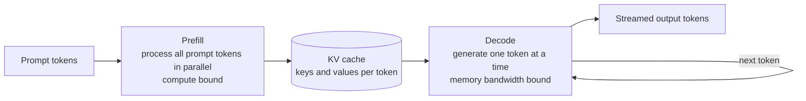
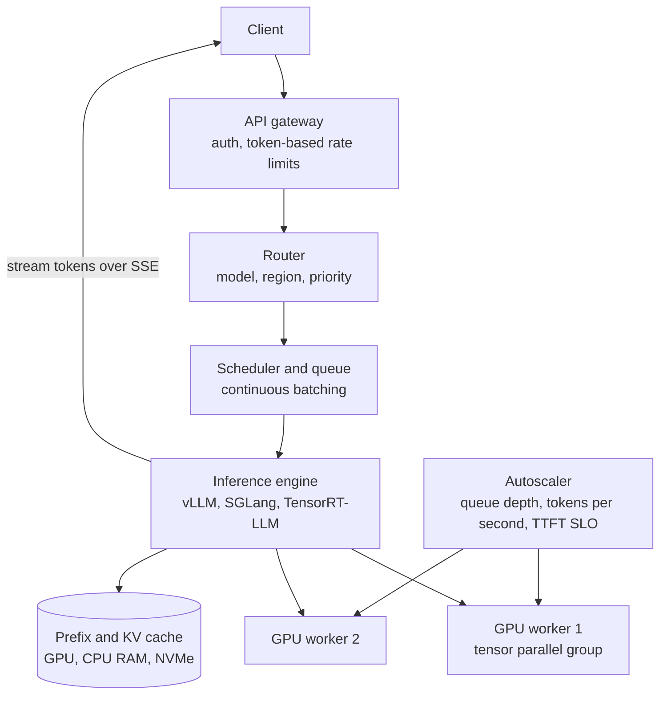
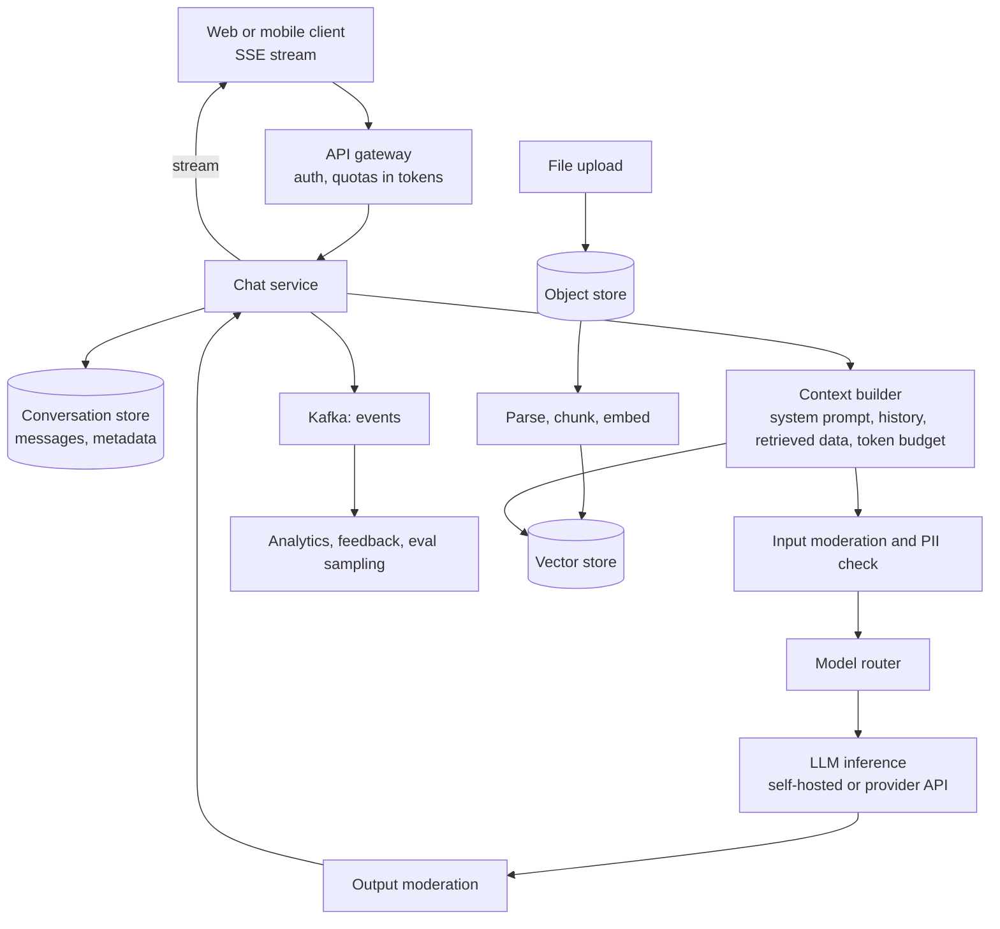
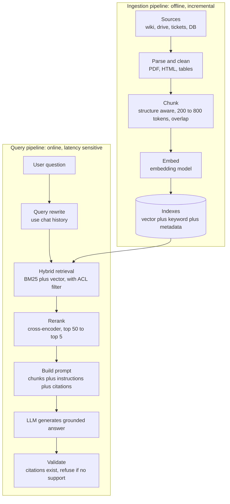
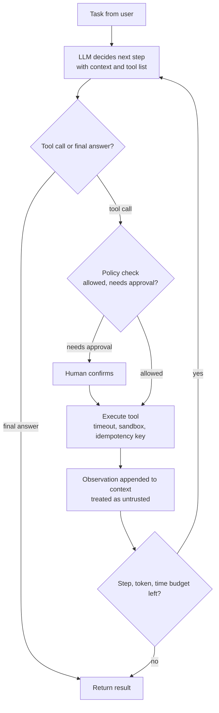
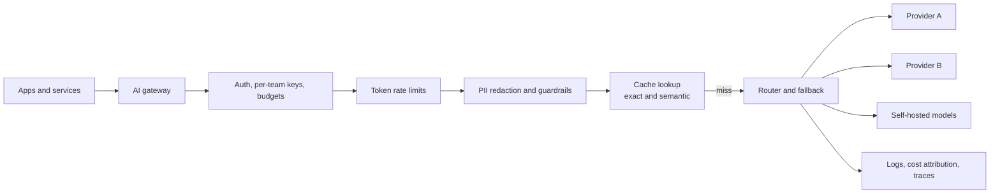

# 📘 AI System Design: LLMs, RAG and Agents

By 2026 AI components appear in ordinary system design interviews.
The bar reported by interview-prep sources is: integrate an LLM the way you would integrate a cache or a queue.
That means knowing where embeddings live, what an LLM call costs in latency and money on the hot path, and what the fallback is when the model is down.
Interviewers also grade **cost per request** and **operations** (observability, rollback, on-call) explicitly.

This page gives the vocabulary, the serving architecture, and worked designs.
Model names and prices change quickly, so numbers here are illustrative and the reasoning is what to reuse.

## Table of Contents

1. [What Is Different About AI Systems](#1-what-is-different-about-ai-systems)
2. [LLM Concepts a System Designer Needs](#2-llm-concepts-a-system-designer-needs)
3. [LLM Inference Serving](#3-llm-inference-serving)
4. [Design: A ChatGPT-Style Assistant](#4-design-a-chatgpt-style-assistant)
5. [Design: RAG Over Private Documents](#5-design-rag-over-private-documents)
6. [Design: Agents and Tool Use](#6-design-agents-and-tool-use)
7. [AI Gateway and Semantic Caching](#7-ai-gateway-and-semantic-caching)
8. [Evaluation and Observability](#8-evaluation-and-observability)
9. [Reliability and Cost](#9-reliability-and-cost)
10. [Practice Prompts](#10-practice-prompts)
11. [Questions and Answers](#11-questions-and-answers)
12. [Sources](#12-sources)

---

## 1. What Is Different About AI Systems

| Classic component | LLM equivalent | What changes |
| --- | --- | --- |
| Request takes milliseconds | Request takes seconds, streamed token by token | Streaming (SSE), timeouts, cancellation, long-lived connections |
| Cost is mostly fixed infrastructure | Cost scales per token | Budgets, quotas in tokens, caching for savings |
| Deterministic output | Non-deterministic, can be wrong or unsafe | Evaluation, guardrails, human review, fallbacks |
| Unit tests | Evals on datasets | Golden sets, LLM judges, regression gates |
| CPU autoscaling | GPU scarcity, slow model load | Queue-based autoscaling, warm pools, batch scheduling |
| Trusted input | Input can contain instructions (prompt injection) | Treat all retrieved text and tool output as untrusted |
| Database lookup | Semantic (embedding) lookup | Vector indexes, hybrid search, reranking |

A useful mental model: an LLM is a **slow, expensive, probabilistic, stateless function** called over the network.
You wrap it with caches, queues, retries, validators and observability like any flaky dependency, and you add evaluation because its correctness is statistical.

---

## 2. LLM Concepts a System Designer Needs

### 2.1 Tokens and Context

- Text is split into **tokens** (roughly 3 to 4 characters, or three quarters of an English word).
- The **context window** is the maximum tokens of input plus output the model can handle in one call.
- Providers bill per token, typically separate prices for **input** and **output**, with output costing several times more.
- Everything the model should know must be in the prompt: system instructions, conversation history, retrieved documents, tool results. Assembling the prompt within a token budget is a core design task.

### 2.2 Two Phases of Inference



| Metric | Meaning | Driven by |
| --- | --- | --- |
| **TTFT** (time to first token) | Delay before the first output token | Queueing plus prefill, grows with prompt length |
| **TPOT or ITL** (time per output token) | Gap between tokens, the streaming speed | Decode speed, batch size, GPU memory bandwidth |
| **Throughput** | Tokens per second across all requests | Batching efficiency |
| **End-to-end latency** | TTFT plus tokens times TPOT | Output length dominates |

Because decode is memory-bandwidth bound (each new token needs the model weights read from GPU memory), batching many requests together is the main way to raise throughput.

### 2.3 The KV Cache

For each token in the context, the model stores key and value vectors for every layer so it never recomputes them.

```text
KV bytes per token = 2 (K and V) x layers x kv_heads x head_dim x bytes_per_value

Illustrative 70B-class model with grouped-query attention, fp16:
2 x 80 layers x 8 kv heads x 128 dim x 2 bytes = 327,680 bytes, about 320 KB per token
An 8,000 token conversation therefore holds about 2.6 GB of KV cache
```

GPU memory holds model weights plus KV caches of all in-flight requests, so **KV cache memory limits concurrency**.
This is why long contexts are expensive and why KV cache management is the center of modern serving engines.

### 2.4 Model Choice Levers

| Lever | Effect |
| --- | --- |
| Smaller model | Cheaper and faster, weaker on hard tasks |
| Quantization (FP8, INT8, INT4) | Less memory, more throughput, small quality loss |
| Mixture-of-experts | Large total parameters, fewer active per token |
| Fine-tuning | Better on a narrow task or style, adds an ML lifecycle |
| Prompting and RAG | No training, uses context, cheapest to iterate |
| Reasoning modes | More output (thinking) tokens for harder problems, more latency and cost |

Default order of attack: better prompt, then retrieval, then a better or smaller model routed per task, then fine-tuning last.

---

## 3. LLM Inference Serving

If you host models yourself (or reason about how providers do), this is the architecture.

### 3.1 Request Path



### 3.2 Techniques Behind Modern Engines

| Technique | Problem it solves | How |
| --- | --- | --- |
| **Continuous batching** | Static batches waste GPU while waiting for the longest request | Scheduler adds and removes requests at every decode step, so finished ones free their slot immediately |
| **PagedAttention** | KV cache pre-allocation wastes memory through fragmentation | Store KV in fixed-size blocks mapped via a per-sequence block table, like virtual memory paging |
| **Prefix caching** (RadixAttention in SGLang, automatic prefix caching in vLLM) | Many requests share the same system prompt or documents | Reuse KV blocks of an identical prefix, saving prefill compute |
| **Chunked prefill** | A long prompt monopolizes the GPU and stalls decoding of others | Split prefill into chunks interleaved with decode steps |
| **Speculative decoding** | Decode is sequential | A small draft model proposes several tokens, the big model verifies them in one pass |
| **Quantization** | Weights and KV take memory and bandwidth | Lower precision formats |
| **Tensor, pipeline and expert parallelism** | Model does not fit on one GPU | Split layers or matrices across GPUs, MoE routes tokens to experts |
| **Disaggregated prefill and decode** | Prefill (compute bound) and decode (bandwidth bound) fight for the same GPUs | Separate pools tuned for each, transfer KV between them |
| **KV cache offload** | GPU memory too small for many long sessions | Spill to CPU RAM or NVMe, restore on reuse |

### 3.3 Operational Points

- **Autoscale on queue depth, in-flight tokens and TTFT**, not CPU. GPU nodes are scarce and slow to start because weights are tens to hundreds of GB, so keep warm capacity and cache weights on local disk.
- **Multi-tenancy:** rate limit in **tokens per minute** as well as requests, use priority classes (interactive above batch), and fair queuing so one tenant cannot starve others.
- **Stream** responses. Users tolerate a long answer if the first token arrives quickly. Design for client disconnects (cancel generation to free GPU).
- **Batch workloads** (bulk classification, document extraction) go through an offline queue on cheaper or idle capacity, often with provider batch APIs at a discount.
- **Routing:** cheap model for easy requests, larger model for hard ones, based on a classifier or a cascade with confidence.
- **Failure:** GPU node loss aborts in-flight requests. Retry idempotently from the start (generation is not resumable) or return partial output with an error marker.

---

## 4. Design: A ChatGPT-Style Assistant

### 4.1 Requirements and Numbers

- Multi-turn chat with streaming, history, file upload, safety filtering, model selection.
- Assume 10M DAU, 5 conversations per day, average 3 turns each.
- Latency: first token under 1.5 s (p95), then a smooth stream.

```text
Requests = 10M x 5 x 3 = 150M turns per day = about 1,700 per second average, 5,000 peak
Tokens per turn (illustrative): 1,500 input (system prompt plus history) and 300 output
Daily tokens = 150M x 1,800 = 270B tokens per day. Token cost, not servers, is the main line item.
```

### 4.2 Architecture



### 4.3 Deep Dive

- **Conversation storage:** append-only messages keyed by `(conversation_id, seq)`. Wide-column or a sharded SQL table. Users list conversations by recency, so index `(user_id, updated_at)`.
- **Context building:** the window is finite, so decide what to include: system prompt, the last N turns, a **rolling summary** of older turns, retrieved chunks, tool results. Count tokens with the model's tokenizer. Put stable content first so **provider prompt caching** and prefix caching hit.
- **Streaming:** the chat service proxies SSE from the model to the client. Persist the assistant message when the stream ends (or incrementally), and handle a client that reconnects mid-stream by resuming from stored partial output.
- **Safety layers:** input checks (policy, PII), output checks, and system-prompt hardening. Run the moderator in parallel with generation where you can and cut the stream if it flags. Keep prompt injection in mind for uploaded files.
- **Model router:** send simple requests to a small fast model and hard ones to a larger model. Expose a user choice for premium tiers.
- **Rate limits and quotas:** per user and per tenant, in tokens per minute and per day, with a cheap pre-check using an estimate of input tokens and reservation of a max output budget, then a true-up after completion.
- **Fallbacks:** if the primary model or region is down, fail over to another provider or a smaller model, with a banner. Timeouts on time to first token as well as total time.
- **Feedback loop:** thumbs up or down, regenerate clicks, and edits are signals stored for evaluation and later tuning. Sample conversations for review with privacy controls.
- **Privacy:** retention policies, opt-out from training, encryption, regional storage, redaction in logs.

### 4.4 Trade-offs

Context length (quality) vs cost and latency, larger model vs responsiveness, aggressive caching vs personalization correctness, and safety filtering strictness vs false positives.

---

## 5. Design: RAG Over Private Documents

**Retrieval-Augmented Generation** fetches relevant documents at question time and gives them to the model, so answers are grounded in your data and can cite sources.
Typical asks: "chat with our docs", enterprise search, customer support bots.

### 5.1 Two Pipelines



### 5.2 Ingestion Decisions

| Decision | Guidance |
| --- | --- |
| **Parsing** | Quality of text extraction (tables, headings, scanned PDFs with OCR) decides everything downstream. Keep structure (headings, page numbers, source URL). |
| **Chunking** | Split on document structure (sections, paragraphs), target a few hundred tokens with small overlap, attach a title path as context. Too large loses precision, too small loses meaning. |
| **Metadata** | Store source, author, date, tenant, ACL groups, doc type. Enables filtering, freshness and citations. |
| **Embedding model** | Choose by retrieval quality on your data, language support, dimension (memory), and cost. Changing the model means re-embedding everything, so version your index. |
| **Freshness** | Incremental updates via change data capture or webhooks, and **delete propagation**. Stale or deleted documents in the index are a correctness and security bug. |

### 5.3 Vector Search Basics

Embeddings map text to vectors so that similar meaning gives nearby vectors.
Finding the exact nearest neighbors is too slow at scale, so indexes use **approximate nearest neighbor (ANN)** search.

| Index | Idea | Trade-off |
| --- | --- | --- |
| **HNSW** | Layered proximity graph, greedy search | High recall and speed, memory heavy, the common default |
| **IVF** | Cluster vectors, search only nearby clusters | Less memory, needs tuning of probes |
| **PQ or quantization** | Compress vectors (int8, binary, product quantization) | 4 to 32 times less memory, small recall loss, often followed by rescoring |
| **DiskANN style** | Graph on SSD with compressed in-memory data | Billions of vectors on cheaper hardware |

```text
Memory for 10M chunks x 1024 dimensions x 4 bytes (float32) = about 41 GB before index overhead
int8 quantization = about 10 GB, binary = about 1.3 GB (with rescoring on full vectors on disk)
```

Where to store: **pgvector** inside Postgres for up to millions or tens of millions of vectors with transactional simplicity, dedicated engines (Qdrant, Milvus, Weaviate, Pinecone) for larger scale and richer filtering, Elasticsearch or OpenSearch when you already run them and want hybrid search in one place.

### 5.4 Retrieval Quality Techniques

Most RAG failures are retrieval and ingestion failures, not generation failures.
Fix them in this order:

1. **Evaluation set first.** A few hundred real questions with expected source chunks.
2. **Hybrid search:** run keyword search (BM25) and vector search in parallel and fuse the rankings. Keywords catch exact terms (error codes, names, SKUs) that embeddings miss. Fusion by **Reciprocal Rank Fusion** is simple and robust.
3. **Reranking:** retrieve 30 to 100 candidates cheaply, rescore with a cross-encoder that reads query and passage together, keep the top 3 to 8.
4. **Metadata filters and ACL trimming:** filter by tenant and permissions **inside the retrieval query**, never after generation. A user must never receive text they cannot access.
5. **Query rewriting:** resolve pronouns from chat history, expand acronyms, decompose multi-part questions.
6. **Better chunking and contextual headers.**

```js
// runnable
// Reciprocal Rank Fusion: score(d) = sum over rankings of 1 / (k + rank)
function rrf(rankings, k = 60) {
  const scores = new Map();
  for (const list of rankings) {
    list.forEach((id, i) => scores.set(id, (scores.get(id) || 0) + 1 / (k + i + 1)));
  }
  return [...scores.entries()].sort((a, b) => b[1] - a[1]).map(([id]) => id);
}

const keywordResults = ['d3', 'd1', 'd7', 'd2'];   // BM25 order
const vectorResults  = ['d1', 'd9', 'd3', 'd4'];   // embedding order
console.log(rrf([keywordResults, vectorResults])); // d1 and d3 rise: both lists like them
```

### 5.5 Generation Stage

- Instruct the model to answer **only from the provided context**, cite chunk ids, and say "I do not know" when the context lacks the answer.
- Pass chunks with source labels, ordered by relevance (models attend less to the middle of very long contexts).
- Validate: citations must refer to real retrieved chunks, optionally run an entailment or LLM check for unsupported claims.
- Cache: exact-match cache for repeated questions, embedding cache for queries, and prefix caching for the system prompt.

### 5.6 Scaling and Operations

| Concern | Approach |
| --- | --- |
| Millions of documents | Sharded vector index, async ingestion workers on a queue, backpressure |
| Multi-tenant isolation | Per-tenant namespaces or filters, per-tenant encryption keys for strict cases |
| Latency budget | Rewrite 200 ms, retrieval 100 ms, rerank 150 ms, LLM first token 700 ms, keep parallel steps parallel |
| Index versioning | Build a new index for a new embedding model, dual-read, cut over, delete old |
| Observability | Log query, retrieved ids, scores, prompt size, answer, feedback, per-stage latency |
| Evaluation | Retrieval recall at k and MRR, answer faithfulness, answer relevance, and human spot checks |

### 5.7 Trade-offs

Larger chunks and more context raise recall and cost, reranking adds latency but is usually the highest-value quality upgrade, and fine-grained ACLs complicate the index.
Long-context models reduce but do not remove the need for retrieval: cost, latency and attention quality still favor sending only what matters.

---

## 6. Design: Agents and Tool Use

An **agent** is an LLM in a loop that can call tools to act on the world: search, read files, call APIs, run code.

### 6.1 The Loop



### 6.2 Tool Interface: MCP

The **Model Context Protocol (MCP)** is an open standard (introduced in 2024) for connecting models to tools and data.
A host application runs MCP clients that talk to MCP servers over JSON-RPC (locally over stdio, remotely over HTTP).
Servers expose **tools** (functions the model can call), **resources** (data it can read) and **prompts** (templates).
It has become a common integration layer across agent frameworks, which means a single tool server can be reused across clients, and also that a tool server is a security boundary you must review.

### 6.3 Design Concerns

| Concern | Guidance |
| --- | --- |
| **Least privilege** | Give each agent only the tools and scopes its task needs. Separate read-only tools from write tools. Use short-lived, per-user credentials, never a shared admin key. |
| **Side effects** | Require confirmation for irreversible actions (payments, deletes, external emails). Use idempotency keys so a retried tool call does not repeat the action. |
| **Prompt injection** | Retrieved pages, emails, tickets and tool results can contain instructions. Treat them as data, not commands. Keep untrusted text out of the system role, strip or flag instructions, restrict what tools can be called after reading untrusted content, and monitor for exfiltration patterns. Indirect injection through tool output is the dominant attack on tool-connected agents. |
| **Budgets** | Cap steps, tokens, wall time and dollars per task. Detect loops (same tool call repeated). |
| **State and memory** | Short-term memory is the context, summarize as it grows. Long-term memory is a store (database or vector index) the agent reads and writes through tools. |
| **Long-running tasks** | Use a durable execution engine (Temporal, Step Functions) so a crash resumes instead of restarting, with checkpoints after each tool result. |
| **Sandboxing** | Run generated code in isolated containers or microVMs without network or secrets by default, with CPU, memory and time limits. |
| **Observability** | Trace every step: prompt, tool call, arguments, result, latency, cost. Agent bugs are only debuggable from traces. |
| **Reliability** | Compounding error: ten steps at 95% each succeed about 60% of the time. Keep loops short, validate tool outputs, add verification steps, prefer deterministic workflows for known processes and agents for open-ended ones. |

### 6.4 Workflow or Agent?

Use a fixed **workflow** (code decides the steps, the LLM fills in specific steps) when the process is known.
Use an **agent** (LLM decides the steps) when the path is unpredictable.
Workflows are cheaper, faster, easier to test and to secure.
Most production value comes from workflows with a few LLM steps.

### 6.5 Multi-Agent Patterns

Orchestrator with specialist workers, planner and executor, reviewer and generator.
Each hop adds latency, cost and failure modes, so justify multi-agent designs with a measured quality gain.

---

## 7. AI Gateway and Semantic Caching

An **AI gateway** is the single entry point between your applications and model providers, like an API gateway specialized for LLMs.



Responsibilities:

- **Key management** so application code never holds provider keys, plus per-team and per-feature budgets.
- **Routing and fallback** across models and providers on errors, timeouts, and cost policy.
- **Token-aware rate limiting** and quota enforcement.
- **Retries** with backoff for 429 and 5xx (respect provider retry hints), with a circuit breaker per provider.
- **Guardrails:** PII redaction, prompt and output policy checks, schema validation of structured output.
- **Observability and cost attribution** by team, feature and user.
- **Prompt management:** versioned prompts, rollout and rollback without redeploying apps.

### 7.1 Caching Layers

| Cache | Key | Hit condition | Risk |
| --- | --- | --- | --- |
| **Exact match** | Hash of full prompt and parameters | Identical request | Low hit rate, safe |
| **Provider prompt caching** | Prompt **prefix** | Identical leading tokens, discounted price | Put stable content first, variable content last |
| **Semantic cache** | Embedding of the query | Nearest cached query above a similarity threshold | Wrong answers for near-duplicate but different questions, personalization leaks |
| **Retrieval and embedding cache** | Query text | Same query again | Staleness |

Semantic caching suits FAQ-like traffic.
Scope it by tenant and by user context, keep a high threshold, and avoid it for personalized or time-sensitive answers.

---

## 8. Evaluation and Observability

You cannot manage what you do not measure, and LLM output is non-deterministic.

### 8.1 Offline Evaluation

- Build a **golden dataset** of real inputs with expected outputs or grading rubrics, grown from production failures.
- Score with exact checks where possible (schema valid, tool called correctly, citation present), **LLM-as-judge** for open text, and human review for calibration.
- Judges are biased (favoring longer answers, their own family of model, first position). Calibrate them against human labels and randomize order.
- Run the suite in CI. **Any change to a prompt, model, retrieval setting or tool** should pass evals before release.

### 8.2 Online Evaluation and Monitoring

| Signal | Examples |
| --- | --- |
| Quality | Thumbs, regenerate rate, edits accepted, task success, escalation to human |
| Retrieval | Empty retrievals, low similarity scores, citation click-through |
| Safety | Moderation flags, refusals, injection detections |
| Performance | TTFT, TPOT, error and timeout rates, queue depth |
| Cost | Tokens per request, cost per conversation, cache hit ratio |
| Drift | Input distribution shifts, provider model updates, degrading eval scores |

Release safely: **shadow** a new model on real traffic without showing answers, then **canary** it to a small percentage with automatic rollback on metric regressions.

### 8.3 Traces

One trace per request with spans for retrieval, rerank, each LLM call, each tool call.
OpenTelemetry has emerging conventions for generative AI spans.
Log prompts and outputs carefully, with redaction and retention limits, because they contain user data.

---

## 9. Reliability and Cost

### 9.1 Failure Modes and Responses

| Failure | Response |
| --- | --- |
| Provider outage or 5xx | Circuit breaker, failover to second provider or smaller model |
| Rate limited (429) | Backoff with jitter, queue, priority shedding, spread across keys and regions |
| Slow generation | Timeout on TTFT and total, stream partial, cancel and retry on another route |
| Malformed structured output | Constrained decoding or JSON schema mode, validate, one repair retry |
| Hallucination | Grounding, citations, verification step, "I do not know" behavior, human escalation for high stakes |
| Retrieval returns nothing | Say so, ask a clarifying question, or fall back to a non-RAG answer with a caveat |
| Vector DB down | Fall back to keyword search |
| Whole AI feature down | Graceful degradation to the non-AI experience |

### 9.2 Cost Model

```text
cost per request = input_tokens x input_price + output_tokens x output_price   (minus cache discounts)

Illustrative prices: 1 dollar per million input tokens, 4 dollars per million output tokens
Traffic: 1M requests per day, 2,000 input tokens, 400 output tokens each
Input  = 2B tokens per day  x 1 / 1M = 2,000 dollars per day
Output = 0.4B tokens per day x 4 / 1M = 1,600 dollars per day
Total  = 3,600 dollars per day, about 108,000 dollars per month
If 60 percent of input is a cacheable prefix billed at a 90 percent discount: input drops to about 920 dollars per day
```

Cost levers, roughly in order of payoff:

1. Shorter prompts (trim history, fewer and better chunks).
2. Prompt and prefix caching, semantic caching for repeated queries.
3. Route easy work to smaller models, use a cascade.
4. Limit output length and use structured output.
5. Batch offline work on discounted batch APIs.
6. Self-host open-weight models when volume is high and steady enough to keep GPUs busy (compare utilization, ops cost and staffing, not only token price).
7. Quantization and better serving efficiency (batching, prefix caching) if self-hosted.

### 9.3 Latency Budget Example (RAG chat, p95 target 2 s to first token)

| Stage | Budget |
| --- | --- |
| Gateway, auth, limits | 30 ms |
| Query rewrite (small model) | 200 ms |
| Embedding plus hybrid retrieval | 120 ms |
| Rerank | 150 ms |
| Prompt build | 20 ms |
| LLM queue plus prefill to first token | 800 ms |
| Safety checks (parallel with generation) | 0 to 100 ms added |
| Total to first token | about 1.4 s, leaving margin |

---

## 10. Practice Prompts

Use the [seven-step framework](/docs/system-design/fundamentals) for each.

| Prompt | Things to cover |
| --- | --- |
| **Customer support chatbot on a third-party LLM** | RAG over help center and tickets, handoff to a human, PII, escalation, evaluation, cost per conversation |
| **Enterprise search with per-user permissions** | ACL trimming in retrieval, incremental ingestion, delete propagation, hybrid search, freshness |
| **Design an LLM inference platform** | Batching, KV cache, autoscaling, multi-tenant fairness, priority, GPU scheduling |
| **AI coding assistant** | Context retrieval from a repo (code index), latency for completions vs chat, privacy, tool use, sandbox |
| **AI agent that acts for a user (book travel, file expenses)** | Least privilege, confirmations, idempotent tools, prompt injection, durable workflow, audit log |
| **Bulk document extraction pipeline (10M PDFs)** | Queue, batch API, schema validation, retries, cost, human review sampling, evals |
| **Content moderation pipeline** | Cheap classifier first, LLM for borderline, latency tiers, appeals, human queue |
| **Semantic search for e-commerce** | Hybrid search, embeddings for products, reranking with business signals, cold start |
| **Prioritize and allocate GPUs across teams** | Quotas, preemption, queues, fairness, bin packing, utilization metrics |

---

## 11. Questions and Answers

**Q1. Why is LLM serving harder to scale than a normal web service?**
Requests are long, stateful (KV cache) and GPU bound, capacity is scarce and slow to add, cost is per token, and utilization depends on batching.
Autoscale on queue and token metrics and use continuous batching.

**Q2. What is continuous batching and why does it matter?**
Instead of waiting for a whole batch to finish, the scheduler swaps requests in and out at every generation step, so GPUs stay busy and short requests are not held hostage by long ones.

**Q3. Your RAG bot gives wrong answers. Where do you look first?**
Retrieval: were the right chunks retrieved? Check chunking, parsing, hybrid search, reranking and filters.
Then the prompt and grounding instructions, then the model.
Add an eval set so you can measure changes.

**Q4. How do you stop a user from seeing documents they should not?**
Store ACL metadata with each chunk, apply the user's identity as a filter inside the retrieval query (security trimming), propagate permission and delete changes to the index, and never let the model see unauthorized text.

**Q5. How do you defend against prompt injection?**
No single fix.
Treat retrieved and tool content as untrusted data, least privilege tools, confirmation for risky actions, isolate untrusted content from instructions, output and egress monitoring, and red-team tests.

**Q6. Semantic cache or exact cache?**
Exact and provider prefix caching are safe and cheap wins.
Semantic caching helps repetitive FAQ traffic and needs tenant scoping, a high threshold and exclusion of personalized queries.

**Q7. How would you cut the bill by half?**
Measure tokens per feature first.
Trim prompts, add prefix caching, route easy traffic to a smaller model, cap output, batch offline work, and consider self-hosting only if utilization justifies it.

**Q8. How do you roll out a new model?**
Run the eval suite, shadow on live traffic, canary with automatic rollback on quality, latency and cost metrics, then ramp.

**Q9. When do you fine-tune instead of using RAG?**
Fine-tune for style, format, or narrow skills the base model lacks.
Use RAG for knowledge that changes or must be cited or access-controlled.
They combine well.

**Q10. What is the difference between a workflow and an agent, and which do you choose?**
A workflow follows steps you coded, an agent lets the model choose steps.
Prefer workflows for known processes because they are cheaper, faster and safer, and use agents for open-ended tasks with strict budgets and permissions.

**Q11. How do you handle the LLM provider being down?**
Timeouts and retries with backoff, a circuit breaker, failover to another provider or smaller model through the gateway, cached or non-AI fallback, and a status banner.

**Q12. How large a context should you send?**
As small as achieves the quality target.
Cost and latency grow with tokens and models can miss information buried in long contexts, so retrieve, rerank and trim.

---

## 12. Sources

- [vLLM: Anatomy of a High-Throughput LLM Inference System](https://vllm.ai/blog/2025-09-05-anatomy-of-vllm) for continuous batching, PagedAttention, prefix caching and chunked prefill.
- [vLLM project](https://github.com/vllm-project/vllm) and its documentation for serving features.
- [Model Context Protocol](https://modelcontextprotocol.io/) for the tool and resource protocol.
- [LLM System Design guide (System Design Handbook)](https://www.systemdesignhandbook.com/guides/llm-system-design/) and [Aced (formerly Exponent) system design guide](https://www.tryexponent.com/blog/system-design-interview-guide) for how interview expectations have shifted toward AI and cost awareness.

Next: [Frontend System Design](/docs/system-design/hld/frontend-system-design) or [Reliability and Operations](/docs/system-design/hld/reliability-and-operations).
