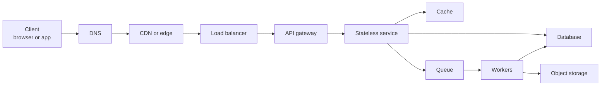
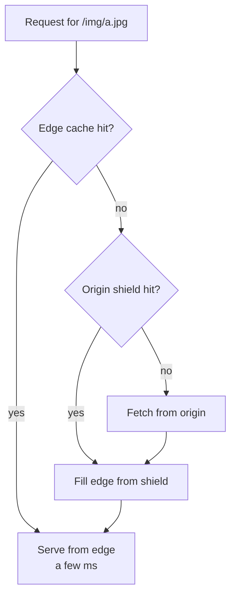
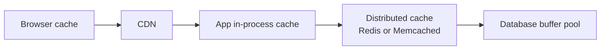
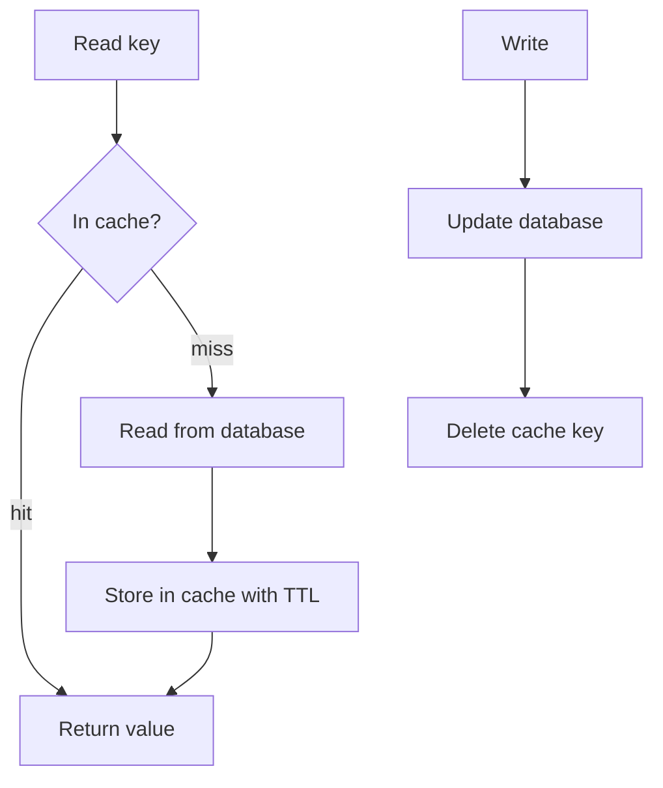
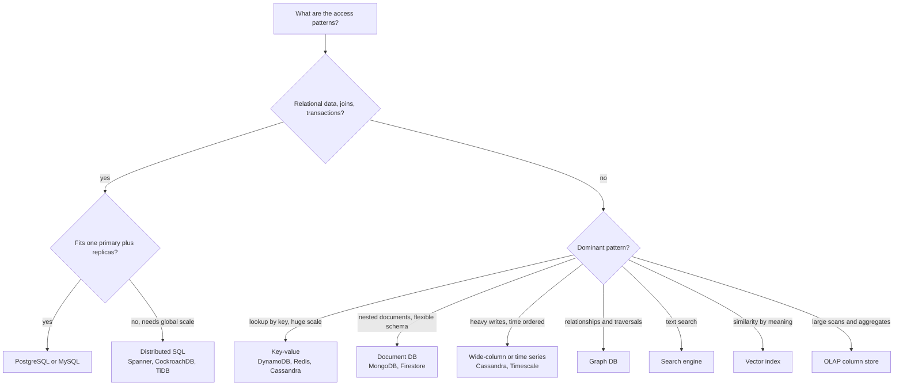
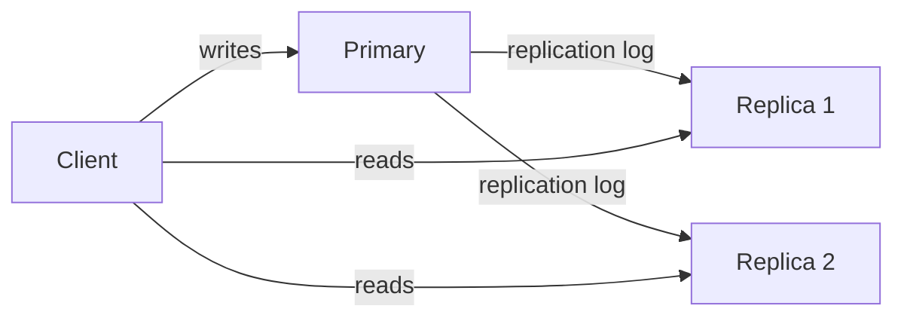
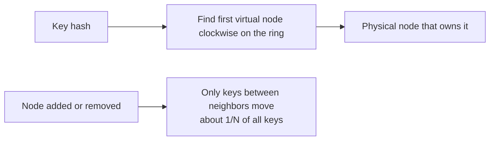
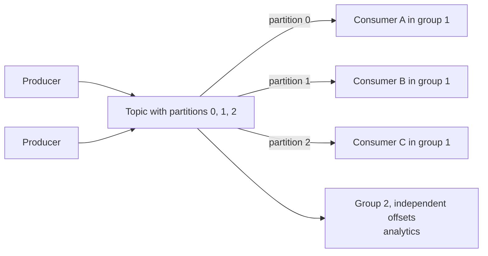
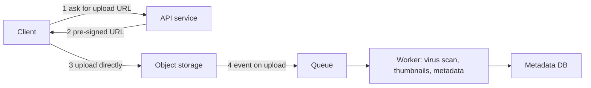

# 📘 HLD Building Blocks

Every system design answer is a composition of a small set of parts.
This page explains each part: what it is for, how it works, its failure modes, and when to choose it.
It is written from beginner level up, and each section ends with the trade-off an interviewer will probe.

## Table of Contents

1. [The Request Path](#1-the-request-path)
2. [DNS](#2-dns)
3. [CDN](#3-cdn)
4. [Load Balancers](#4-load-balancers)
5. [API Gateway, Reverse Proxy, Service Mesh](#5-api-gateway-reverse-proxy-service-mesh)
6. [Caching](#6-caching)
7. [Databases](#7-databases)
8. [Indexing and Storage Engines](#8-indexing-and-storage-engines)
9. [Replication](#9-replication)
10. [Sharding and Consistent Hashing](#10-sharding-and-consistent-hashing)
11. [Queues and Streams](#11-queues-and-streams)
12. [Object Storage](#12-object-storage)
13. [Search](#13-search)
14. [Real-Time Communication](#14-real-time-communication)
15. [APIs and Protocols](#15-apis-and-protocols)
16. [Choosing the Right Block](#16-choosing-the-right-block)
17. [Questions and Answers](#17-questions-and-answers)

---

## 1. The Request Path

Trace one request end to end.
Most designs are variations on this path.



At every hop ask: what does this add (latency, failure mode, cost) and what does it buy (scale, safety, speed)?

---

## 2. DNS

DNS maps names to IP addresses.
It is the first dependency of almost every request, which makes it a hidden single point of failure.

| Record | Purpose |
| --- | --- |
| A / AAAA | Name to IPv4 / IPv6 address |
| CNAME | Alias to another name |
| NS | Which servers are authoritative for a zone |
| MX | Mail servers |
| TXT | Arbitrary text, used for domain verification, SPF |

**TTL** controls how long resolvers cache an answer.
Short TTL gives fast failover and more DNS load.
Long TTL is cheap and slow to change.

**DNS-based traffic steering** (Route 53, Cloudflare, NS1) offers:

- **Weighted:** send 5% of traffic to a canary.
- **Latency-based:** send users to the closest healthy region.
- **Geolocation:** send by country, for compliance.
- **Failover:** health checks flip to a standby.

**Anycast** announces the same IP from many locations, and the network routes each client to the nearest one.
CDNs and public DNS use it.

Trade-off: DNS failover is bounded by TTLs and by resolvers that ignore them.
Use it for coarse regional failover, not for per-request routing.
The October 2025 AWS incident began with an empty DNS record for a regional service endpoint, a reminder that DNS is code you depend on.
See [Reliability and Operations](/docs/system-design/hld/reliability-and-operations).

---

## 3. CDN

A CDN caches content at edge locations close to users.
It cuts latency, offloads the origin, and absorbs traffic spikes and some attacks.



| Aspect | Options |
| --- | --- |
| **Pull CDN** | Edge fetches from origin on first miss. Simple, the default. |
| **Push CDN** | You upload content ahead of time. Good for large, rarely changing files. |
| **Cache key** | URL plus chosen headers or query params. A bad key (including a session cookie) destroys hit rate. |
| **Freshness** | `Cache-Control: max-age`, `s-maxage` for shared caches, `ETag` and `Last-Modified` for revalidation, `stale-while-revalidate` to serve stale while refreshing |
| **Invalidation** | Purge by URL or tag. Better: version the URL (`app.3f9a1c.js`) and cache forever. |
| **Protection** | Signed URLs and cookies for private media, WAF, DDoS mitigation |
| **Edge compute** | Run code at the edge for redirects, auth checks, A/B routing, personalization |

Static assets are the obvious win.
Also cache API responses that are the same for many users (product pages, public feeds) with short TTLs.

Trade-off: caching dynamic or personalized content risks serving one user's data to another.
Vary on the right headers and never cache responses that carry `Set-Cookie` or private data without care.

---

## 4. Load Balancers

A load balancer spreads requests across servers, removes unhealthy ones, and gives clients one stable address.

| Layer | Works on | Typical use | Examples |
| --- | --- | --- | --- |
| **L4** | TCP or UDP connections | Very fast, protocol agnostic, TLS passthrough | AWS NLB, HAProxy TCP mode |
| **L7** | HTTP requests | Route by path or header, TLS termination, retries, auth | AWS ALB, NGINX, Envoy, HAProxy |

### 4.1 Algorithms

| Algorithm | How | Good for | Watch out |
| --- | --- | --- | --- |
| Round robin | Rotate through servers | Equal servers, similar requests | Ignores load |
| Weighted round robin | More traffic to bigger servers | Mixed hardware, canaries | Static weights |
| Least connections | Send to the server with fewest active connections | Long-lived or uneven requests | Needs connection tracking |
| Least response time | Prefer fast servers | Heterogeneous backends | Can herd onto one node |
| IP hash | Hash client IP | Cheap stickiness | Uneven with NAT, breaks on resize |
| Consistent hash | Hash a key onto a ring | Cache locality, sharded backends | More complex |
| Power of two choices | Pick 2 at random, use the less loaded | Large fleets, cheap and near optimal | Needs a load signal |

### 4.2 Operational Details

- **Health checks:** active (probe an endpoint) and passive (watch errors). Separate liveness (restart me) from readiness (send me traffic).
- **Connection draining:** stop new requests, let in-flight ones finish before removal on deploys.
- **Sticky sessions:** pin a user to a server via cookie. Avoid by making services stateless. If unavoidable, plan for the server dying.
- **TLS termination:** decrypt at the LB, then re-encrypt to backends if zero-trust requires it.
- **The LB is a SPOF:** run a pair with a virtual IP, or use a managed multi-AZ LB, or anycast.
- **Global load balancing:** DNS or anycast picks a region, a regional LB picks a server.

---

## 5. API Gateway, Reverse Proxy, Service Mesh

| Component | Sits where | Responsibilities |
| --- | --- | --- |
| **Reverse proxy** | In front of servers | TLS, compression, caching, routing (NGINX, Envoy) |
| **API gateway** | Edge of your platform | Authentication, rate limiting, routing to services, request or response shaping, API keys, usage plans |
| **BFF** (backend for frontend) | Per client type | Aggregates several services into one response tailored to web or mobile |
| **Service mesh** | Between services | mTLS, retries, timeouts, circuit breaking, traffic splitting, telemetry, done by sidecars or node agents (Istio, Linkerd) |

Guidance:

- Put cross-cutting concerns (auth, throttling, logging) in the gateway so services stay small.
- Do not put business logic in the gateway.
- A mesh helps when you have many services and want uniform policy. It adds operational weight, so skip it for a handful of services.

---

## 6. Caching

A cache stores the result of expensive work so the next request is cheap.
It is the highest leverage tool for read-heavy systems, and the biggest source of subtle bugs.

### 6.1 Where to Cache



Closer to the user is faster and harder to invalidate.

### 6.2 Read and Write Patterns

| Pattern | Read path | Write path | Pros | Cons |
| --- | --- | --- | --- | --- |
| **Cache-aside** | App checks cache, on miss loads DB and fills cache | App writes DB, then deletes the cache key | Simple, only hot data cached | Miss penalty, race conditions |
| **Read-through** | Cache loads from DB on miss | Same as above | Cleaner app code | Cache library must know the DB |
| **Write-through** | Reads from cache | Write to cache and DB together, synchronously | Cache always fresh | Slower writes, caches cold data |
| **Write-behind** | Reads from cache | Write to cache, flush to DB asynchronously | Fast writes, batching | Data loss window if cache dies |
| **Refresh-ahead** | Cache refreshes hot keys before expiry | n/a | No miss latency on hot keys | Wasted refreshes |



For writes, **delete** the key instead of updating it.
Updating races with concurrent readers and writers and can leave stale values.
Even with delete, a slow reader can repopulate an old value.
A short TTL is the safety net.

### 6.3 Eviction

| Policy | Evicts | Note |
| --- | --- | --- |
| LRU | Least recently used | Good default, scan-vulnerable |
| LFU | Least frequently used | Better for stable hot sets |
| FIFO | Oldest | Simple, rarely best |
| TTL | Expired entries | Always combine with a policy |
| W-TinyLFU | Frequency sketch plus window | Used by Caffeine, high hit rate |

An LRU cache is a classic LLD problem, see [Machine Coding 1](/docs/system-design/lld/machine-coding-problems-1).

### 6.4 The Classic Cache Problems

| Problem | What happens | Fixes |
| --- | --- | --- |
| **Stampede** (thundering herd, dogpile) | A hot key expires and thousands of requests hit the DB at once | Single-flight (one loader per key), locks with short TTL, refresh-ahead, stale-while-revalidate |
| **Penetration** | Requests for keys that do not exist bypass the cache every time | Cache negative results with short TTL, Bloom filter in front |
| **Avalanche** | Many keys expire together, or the cache tier dies | Add jitter to TTLs, replicate the cache, protect the DB with rate limits and circuit breakers |
| **Hot key** | One key gets a huge share of traffic and overloads one shard | Local in-process cache, replicate hot keys, key suffix sharding |
| **Stale data** | Cache disagrees with the DB | Short TTL, delete on write, event-driven invalidation from CDC |
| **Cold start** | Empty cache after deploy or failure | Warm up, gradual traffic shift |

```js
// single-flight sketch: one DB load per key at a time
const inflight = new Map();

async function getUser(id) {
  const key = `user:${id}`;
  const hit = await cache.get(key);
  if (hit) return hit;

  if (!inflight.has(key)) {
    const p = db.loadUser(id)
      .then(async (u) => { await cache.set(key, u, { ttl: 60 + Math.random() * 30 }); return u; })
      .finally(() => inflight.delete(key));
    inflight.set(key, p);
  }
  return inflight.get(key);
}
```

### 6.5 Redis, Valkey, Memcached

| | Redis / Valkey | Memcached |
| --- | --- | --- |
| Data types | Strings, hashes, lists, sets, sorted sets, streams, bitmaps, HyperLogLog | Strings only |
| Persistence | Optional (RDB, AOF) | None |
| Replication and clustering | Yes (primary-replica, Redis Cluster with 16,384 hash slots) | Client-side sharding |
| Extras | Pub/sub, Lua scripts, transactions, geo, atomic counters | Simple, multi-threaded, very fast |

Licensing note (2024 to 2025):

- In March 2024 Redis moved from BSD to source-available licenses (RSAL and SSPL) starting with 7.4.
- The Linux Foundation forked the last BSD release as **Valkey**, backed by AWS, Google, Oracle and others. Managed services from cloud providers now offer Valkey.
- In May 2025 Redis 8 added the AGPLv3 open source license as an option.
- For interviews the API is the same for what you need. Say "Redis or Valkey" and move on. In a real project, check the license against your use.

---

## 7. Databases

Start with a relational database.
Move away only when a requirement forces you to.

### 7.1 SQL vs NoSQL

| | Relational (SQL) | NoSQL |
| --- | --- | --- |
| Schema | Fixed, enforced | Flexible or schemaless |
| Joins | Native | Limited or none, denormalize |
| Transactions | Full ACID, multi-row | Often single item or limited scope |
| Scaling | Vertical, replicas, then sharding (harder) | Horizontal by design |
| Query flexibility | High, ad hoc SQL | Best for known access patterns |
| Examples | PostgreSQL, MySQL | DynamoDB, Cassandra, MongoDB, Redis |

### 7.2 The NoSQL Families

| Family | Model | Strengths | Examples | Use for |
| --- | --- | --- | --- | --- |
| Key-value | key to blob | Fastest, simplest, scales out | Redis, DynamoDB, Riak | Sessions, caches, carts, profiles by id |
| Document | key to JSON document | Flexible schema, nested data | MongoDB, Firestore, Couchbase | Catalogs, content, user-generated data |
| Wide-column | row key, column families, sorted | Massive write throughput, time ordered | Cassandra, HBase, Bigtable, ScyllaDB | Time series, messaging, activity logs |
| Graph | nodes and edges | Traversals and relationships | Neo4j, Neptune | Social graph, fraud rings, recommendations |
| Time-series | timestamped points | Compression, downsampling, retention | InfluxDB, TimescaleDB, Prometheus | Metrics, IoT |
| Search | inverted index | Full text, facets, ranking | Elasticsearch, OpenSearch | Search boxes, log search |
| Vector | embeddings and ANN index | Similarity search | pgvector, Pinecone, Qdrant, Milvus | Semantic search, RAG, see [AI System Design](/docs/system-design/hld/ai-system-design) |
| Column store (OLAP) | column-oriented files | Fast scans and aggregates | BigQuery, Snowflake, ClickHouse, Redshift | Analytics, reporting |

### 7.3 NewSQL and Distributed SQL

Systems that give SQL and transactions across many nodes, and often across regions.

| System | Notes |
| --- | --- |
| Google Spanner | Paxos-replicated shards, TrueTime clocks, externally consistent (strict serializable) transactions |
| CockroachDB | Postgres-compatible, Raft per range, serializable isolation by default |
| YugabyteDB, TiDB | Distributed SQL with Postgres or MySQL compatible layers |
| Amazon Aurora DSQL | Serverless, active-active multi-region, optimistic concurrency control. Check its documented isolation level (snapshot-style) before assuming serializable |

Trade-off: cross-shard and cross-region transactions cost coordination latency.
Keep transactions inside one shard or region where you can.

### 7.4 Choosing a Database



A common production shape is **polyglot persistence**: Postgres as the source of truth, Redis for hot reads, a search index and an analytics store fed from the primary by change data capture.
Keep one system as the source of truth and treat the others as derived.

### 7.5 IDs

- **Auto-increment:** compact, ordered, but a single writer and it leaks volume.
- **UUIDv4:** random, no coordination, but poor for B-tree insert locality.
- **UUIDv7 (RFC 9562):** 48-bit millisecond timestamp plus random bits, time ordered, no coordination. PostgreSQL 18 added a native `uuidv7()`.
- **Snowflake style:** 64-bit integer with timestamp, machine id and sequence. Half the size of a UUID, needs worker id management and clock care. Design in [Classic Designs](/docs/system-design/hld/classic-designs).

---

## 8. Indexing and Storage Engines

### 8.1 Indexes

An index is a separate structure that makes lookups fast at the cost of write time and space.

| Index | Use |
| --- | --- |
| B-tree | Default, equality and range, ordered |
| Hash | Equality only |
| Composite | Multi-column, follows the **leftmost prefix rule** |
| Covering | Contains all columns a query needs, no table lookup |
| Partial | Index only rows matching a condition |
| Inverted | Full text, term to document list |
| Geospatial | Geohash, R-tree, S2 or H3 cells |

A composite index on `(user_id, created_at)` serves "this user's newest items" but not "all items by date".
Every index slows writes, so add only the ones your access patterns need.

### 8.2 B-Tree vs LSM Tree

| | B-tree | LSM tree |
| --- | --- | --- |
| Write path | Update pages in place, random writes | Append to a log and memtable, flush sorted files, compact in the background |
| Reads | One or few page reads | May check several files, mitigated by Bloom filters |
| Write throughput | Good | Excellent, sequential I/O |
| Space and write amplification | Lower write amp, some fragmentation | Compaction write amplification |
| Used by | PostgreSQL, MySQL InnoDB, most SQL | Cassandra, RocksDB, LevelDB, HBase, ScyllaDB |

Rule of thumb: read-heavy with rich queries suggests B-tree, write-heavy and append-like suggests LSM.

---

## 9. Replication

Copy data to multiple nodes for availability, read scaling and locality.



| Model | How | Pros | Cons |
| --- | --- | --- | --- |
| **Leader-follower** | One writer, many readers | Simple, no write conflicts | Leader is the write bottleneck, failover complexity |
| **Multi-leader** | Several writers, usually one per region | Local writes in each region | Write conflicts need resolution |
| **Leaderless** | Any node takes writes, quorum reads and writes | No failover, high availability | Conflicts, read repair, tuning W and R |

**Sync vs async** replication:

- Synchronous: the write is acknowledged after followers have it. No data loss on leader failure, slower, and a stuck follower can block writes.
- Asynchronous: acknowledged immediately. Fast, but the last writes can be lost on failover, and reads from followers can be stale.
- Semi-synchronous: wait for one follower, a common compromise.

**Replication lag anomalies** and fixes:

| Anomaly | Fix |
| --- | --- |
| Post, then not visible on refresh | Read-your-writes routing to the primary for a window |
| Value goes backward between refreshes | Pin a user to one replica |
| Reply visible before the question | Causal consistency, or same partition for related data |

Deep dive on quorums, failover, split brain and consensus is in [Distributed Systems](/docs/system-design/hld/distributed-systems).

---

## 10. Sharding and Consistent Hashing

Sharding (partitioning) splits data across nodes so no node holds it all.
Do it when a single primary cannot handle the data size or write rate, not before.

### 10.1 Strategies

| Strategy | How | Pros | Cons |
| --- | --- | --- | --- |
| **Range** | Key ranges per shard (A to F, G to M) | Efficient range scans | Hot spots (recent timestamps, popular ranges) |
| **Hash** | `hash(key) mod N` | Even distribution | No range scans, resharding moves almost everything with plain mod |
| **Consistent hashing** | Keys and nodes on a ring | Adding or removing a node moves only about 1/N of keys | More machinery |
| **Directory** | Lookup table key to shard | Flexible | Lookup service is a dependency |
| **Geo** | By user region | Latency, residency | Uneven, cross-region queries |

### 10.2 Choosing a Shard Key

A good shard key has high cardinality, spreads load evenly, and matches the main query so most queries hit one shard.

| Candidate | Problem |
| --- | --- |
| `country` | Few values, very uneven |
| `created_at` | All new writes hit one shard |
| `user_id` | Usually good for user-centric data. Celebrity users still create hot spots |
| `tenant_id` | Good for SaaS, one huge tenant can dominate |

Cross-shard queries and transactions are expensive.
Design so the common path touches one shard, and accept scatter-gather for the rare ones.

### 10.3 Consistent Hashing

Place nodes on a ring by hashing.
A key goes to the first node clockwise from its hash.
**Virtual nodes** give each physical node many positions on the ring, which smooths the distribution and lets heavier machines take more.



```js
// runnable
const crypto = require('crypto');

class HashRing {
  constructor(vnodes = 100) {
    this.vnodes = vnodes;
    this.ring = []; // sorted by hash: { hash, node }
  }
  static hash(key) {
    return crypto.createHash('md5').update(key).digest().readUInt32BE(0);
  }
  addNode(node) {
    for (let i = 0; i < this.vnodes; i++) {
      this.ring.push({ hash: HashRing.hash(`${node}#${i}`), node });
    }
    this.ring.sort((a, b) => a.hash - b.hash);
  }
  removeNode(node) {
    this.ring = this.ring.filter((e) => e.node !== node);
  }
  getNode(key) {
    if (this.ring.length === 0) return null;
    const h = HashRing.hash(key);
    let lo = 0, hi = this.ring.length;
    while (lo < hi) {
      const mid = (lo + hi) >> 1;
      if (this.ring[mid].hash < h) lo = mid + 1; else hi = mid;
    }
    return this.ring[lo % this.ring.length].node;
  }
}

const ring = new HashRing(100);
['A', 'B', 'C', 'D'].forEach((n) => ring.addNode(n));
const keys = Array.from({ length: 20000 }, (_, i) => `key-${i}`);
const before = new Map(keys.map((k) => [k, ring.getNode(k)]));
ring.addNode('E');
const moved = keys.filter((k) => before.get(k) !== ring.getNode(k)).length;
console.log('moved fraction after adding 5th node:', (moved / keys.length).toFixed(3));
// expect about 0.2 (1/5), where mod-N hashing would move about 0.8
```

Used by Dynamo-style stores (Cassandra, Riak), memcached client libraries, and CDN and load balancer routing.
Redis Cluster uses a related idea: 16,384 fixed hash slots assigned to nodes.

### 10.4 Resharding and Hot Shards

- Start with more logical shards than physical nodes so you can move shards whole.
- Move data in the background with dual writes or a change log, then flip routing.
- A hot key needs a targeted fix: local cache, key splitting (`key#0` to `key#9`), or dedicated capacity.

---

## 11. Queues and Streams

Asynchronous messaging decouples producers from consumers, absorbs spikes, and lets slow work happen off the request path.

| | Message queue | Log or stream |
| --- | --- | --- |
| Examples | SQS, RabbitMQ, ActiveMQ | Kafka, Pulsar, Kinesis, Redpanda |
| Model | Broker holds messages until acknowledged, then deletes | Append-only partitioned log, consumers track offsets |
| Replay | Generally no | Yes, within retention |
| Ordering | Per queue, FIFO variants | Per partition |
| Consumers | Competing consumers on one queue | Consumer groups, many independent groups can read the same data |
| Best for | Task distribution, job queues | Event streaming, CDC, analytics, event sourcing |



### 11.1 Delivery Semantics

| Guarantee | Meaning | Reality |
| --- | --- | --- |
| At most once | Never redelivered, may be lost | Fire and forget |
| At least once | Never lost, may be duplicated | The practical default |
| Exactly once | Processed once | Achieved as **at-least-once delivery plus idempotent processing**, or transactions within a system like Kafka |

Design consumers to be **idempotent**: dedupe by message id, or make the operation naturally repeatable (set, not increment).

### 11.2 Key Concepts

- **Partition key:** decides ordering and parallelism. Messages with the same key go to the same partition and stay ordered. Choose a key with enough cardinality to spread load.
- **Consumer group:** partitions are divided among the consumers in a group. Max parallelism equals the partition count.
- **Offset commit:** commit after processing for at-least-once. Commit before for at-most-once.
- **Dead-letter queue:** park messages that fail repeatedly, with the error, so they do not block the queue.
- **Retries:** exponential backoff with jitter, separate retry topics or delay queues.
- **Backpressure:** bounded queues and consumer lag alerts. An unbounded queue hides overload until it explodes.
- **Poison message:** one bad message that fails forever, handle with DLQ.
- **Compacted topics:** keep only the latest value per key, useful for changelogs and state.

Recent Kafka changes worth knowing (Kafka 4.0, March 2025):

- ZooKeeper is gone. Metadata is managed by **KRaft**, Kafka's built-in Raft quorum, which is now the only mode.
- The new consumer group protocol (KIP-848) reduces rebalance disruption.
- **Share groups** (KIP-932, "Queues for Kafka") add queue-like consumption with per-message acknowledgment. At the time of the 4.0 release this was early access, so verify the status of your Kafka version before relying on it.

Trade-off: queues add latency, operational cost and eventual consistency.
Do not queue work the user is waiting on unless it is slow or must be retried.

---

## 12. Object Storage

Object stores (Amazon S3, Google Cloud Storage, Azure Blob) hold large immutable blobs by key, cheaply and durably.

- **Model:** a flat namespace of buckets and keys. "Folders" are just key prefixes.
- **Durability:** designed for about 11 nines by replicating or erasure coding across zones.
- **Consistency:** Amazon S3 has offered strong read-after-write consistency for all operations since December 2020. Conditional writes (for example put-if-absent) were added in 2024, which enables lock-free coordination patterns on top of S3.
- **Cost tiers:** hot, infrequent access, archive. Use lifecycle rules to move data down.
- **Large uploads:** multipart upload with resumable parts, done directly from the client with **pre-signed URLs** so bytes never pass through your servers.
- **Serving:** put a CDN in front, use signed URLs for private content.

Pattern: store blobs in object storage, keep **metadata** (owner, key, size, checksum, permissions) in a database.
Never store large blobs in the OLTP database.



---

## 13. Search

Full text search needs an **inverted index**: for each term, the list of documents containing it.

- **Analysis:** tokenize, lowercase, stem, remove stop words, at index time and query time.
- **Ranking:** TF-IDF and BM25 for text relevance, plus signals like recency and popularity.
- **Engines:** Elasticsearch, OpenSearch, Solr (all Lucene based), plus Typesense, Meilisearch. Postgres full text search suffices for small cases.
- **Shards and replicas:** an index is split into shards, and queries scatter to all shards and gather the top results.
- **Near real time:** new documents become searchable after a refresh, about one second by default in Elasticsearch.
- **Sync:** the search index is a **derived** store. Feed it from the primary DB by change data capture or an outbox, and be able to rebuild it from scratch.

Do not use a search engine as the system of record.
Hybrid search that combines keywords with vector similarity is covered in [AI System Design](/docs/system-design/hld/ai-system-design).

---

## 14. Real-Time Communication

| Technique | How | Latency | Cost | Use when |
| --- | --- | --- | --- | --- |
| **Short polling** | Client asks every few seconds | Up to the interval | Wasteful | Simple, low frequency |
| **Long polling** | Server holds the request until data or timeout | Low | One open request per client | Fallback, simple infra |
| **Server-Sent Events (SSE)** | One long HTTP response, server streams events | Low | Cheap, one direction, auto reconnect | Feeds, notifications, LLM token streaming |
| **WebSocket** | Persistent full-duplex TCP connection | Lowest | Stateful connections to manage | Chat, games, collaboration |
| **WebTransport / gRPC streaming** | Streams over HTTP/3 or HTTP/2 | Low | Newer, needs support | Service to service streaming, advanced clients |
| **Push notifications** | APNs and FCM deliver to devices when the app is closed | Seconds | Provider dependent | Re-engagement, alerts |

Scaling persistent connections:

- Connections are stateful, so a gateway tier holds them, and you need a **connection registry** (user id to gateway id) in a fast store.
- One server can hold from tens of thousands to a few hundred thousand idle connections. Memory and file descriptors are the limits.
- Use heartbeats, reconnect with exponential backoff and jitter, and resume from the last event id.
- Fan out messages to gateways through a pub/sub layer (Redis pub/sub, Kafka, NATS).

---

## 15. APIs and Protocols

### 15.1 API Styles

| | REST | GraphQL | gRPC |
| --- | --- | --- | --- |
| Transport | HTTP/1.1 or HTTP/2, JSON | HTTP, JSON | HTTP/2, Protocol Buffers |
| Shape | Resources and verbs | One endpoint, client picks fields | RPC methods, strongly typed, codegen |
| Strengths | Simple, cacheable, ubiquitous | No over or under fetching, one round trip | Fast, streaming, contracts |
| Weaknesses | Multiple round trips, over-fetching | Caching harder, N+1 and query cost risks | Browser support needs a proxy, less human readable |
| Best for | Public APIs | Client-driven UIs with varied needs | Internal service to service |

### 15.2 HTTP Versions

- **HTTP/1.1:** one request at a time per connection, head-of-line blocking.
- **HTTP/2:** multiplexed streams over one TCP connection, header compression. TCP-level head-of-line blocking remains.
- **HTTP/3:** runs over QUIC on UDP, per-stream loss recovery, faster handshakes, connection migration for mobile networks. Widely supported by CDNs and browsers.

### 15.3 Pagination

| Type | How | Problem |
| --- | --- | --- |
| Offset and limit | `?offset=1000&limit=20` | Slow at depth, results shift when data changes |
| **Cursor (keyset)** | `?after=<last_id>` with `WHERE id > last ORDER BY id` | Cannot jump to page N, but fast and stable |

Use cursor pagination for feeds and large datasets.

### 15.4 Idempotency

An operation is idempotent if repeating it has the same effect as doing it once.
Clients retry, networks duplicate, so every write that matters needs a defense.

- `GET`, `PUT`, `DELETE` are idempotent by definition. `POST` is not.
- For `POST`, send an **Idempotency-Key** header. The server stores the key with the result and returns the stored result on a repeat.
- Flow and pitfalls are in [Distributed Systems](/docs/system-design/hld/distributed-systems).

### 15.5 Other API Concerns

- **Versioning:** URL (`/v2/`), header, or additive changes only. Prefer additive and deprecate slowly.
- **Rate limiting and quotas:** return 429 with `Retry-After`. Design in [Classic Designs](/docs/system-design/hld/classic-designs).
- **Errors:** consistent shape, machine readable code, correlation id.
- **Auth:** OAuth 2.0 and OpenID Connect for delegated access, API keys for server to server, short-lived tokens.

---

## 16. Choosing the Right Block

| Need | Reach for |
| --- | --- |
| Lower read latency, protect the DB | Cache (Redis or Valkey), CDN for static and public content |
| More read capacity | Read replicas, caching |
| More write capacity or data size | Sharding, or a natively distributed store |
| Slow or retryable background work | Queue plus workers |
| Event log, replay, many consumers | Kafka or similar stream |
| Big files | Object storage plus CDN, pre-signed upload |
| Text search | Search engine fed from the primary DB |
| Real-time updates to clients | WebSocket or SSE with a pub/sub backplane |
| Uniqueness or leader election | Consensus store (etcd, ZooKeeper) or DB constraint |
| Money or inventory correctness | Relational DB with transactions and idempotency keys |
| Traffic spikes | Autoscaling, queues, rate limits, load shedding |

---

## 17. Questions and Answers

**Q1. How does a CDN decide what to cache and for how long?**
By cache key (URL plus selected headers) and by response headers such as `Cache-Control`, `s-maxage` and `ETag`.
For assets, use content-hashed file names with a long max-age so invalidation is never needed.

**Q2. L4 or L7 load balancer?**
L7 when you need to route by path or host, terminate TLS, or inspect headers.
L4 for raw throughput, non-HTTP protocols, or as the first tier in front of L7 proxies.

**Q3. Why is `hash(key) mod N` a bad sharding scheme?**
Changing N remaps almost every key, causing a mass data migration and cache miss storm.
Consistent hashing, or a fixed number of logical shards mapped to nodes, moves only about 1/N of keys.

**Q4. How do you keep cache and database consistent?**
You cannot make them perfectly consistent without heavy coordination.
Use cache-aside with delete on write, a TTL as a safety net, and for critical keys event-driven invalidation from the database change log.

**Q5. When would you pick Cassandra or DynamoDB over PostgreSQL?**
When the access patterns are known key lookups, the write volume or data size exceeds a single primary, and you need multi-node availability, and you can accept limited joins and transactions.
Otherwise start with Postgres.

**Q6. Kafka or SQS?**
SQS (or RabbitMQ) for simple task queues with managed operation and per-message acknowledgment.
Kafka for high-throughput event streams, replay, multiple independent consumers, and stream processing.

**Q7. How do you get exactly-once processing?**
Deliver at least once and make the consumer idempotent with a dedupe key or a natural upsert.
Within Kafka, transactions plus idempotent producers give exactly-once for read-process-write between topics.

**Q8. WebSocket or SSE?**
SSE for server to client streams (notifications, LLM tokens), it works over plain HTTP and reconnects itself.
WebSocket when the client also sends frequently, such as chat and collaborative editing.

**Q9. How would you serve a 5 GB video upload?**
Pre-signed multipart upload straight to object storage, resumable per part.
An event triggers a processing pipeline, and metadata goes in a database.

**Q10. What happens to your design if the cache cluster dies?**
Traffic falls through to the database.
Protect it with circuit breakers, rate limits and load shedding, replicate the cache across zones, and keep a small in-process cache for the hottest keys.

Next: [Classic Designs](/docs/system-design/hld/classic-designs) puts these blocks to work, and [Distributed Systems](/docs/system-design/hld/distributed-systems) goes under the hood.
