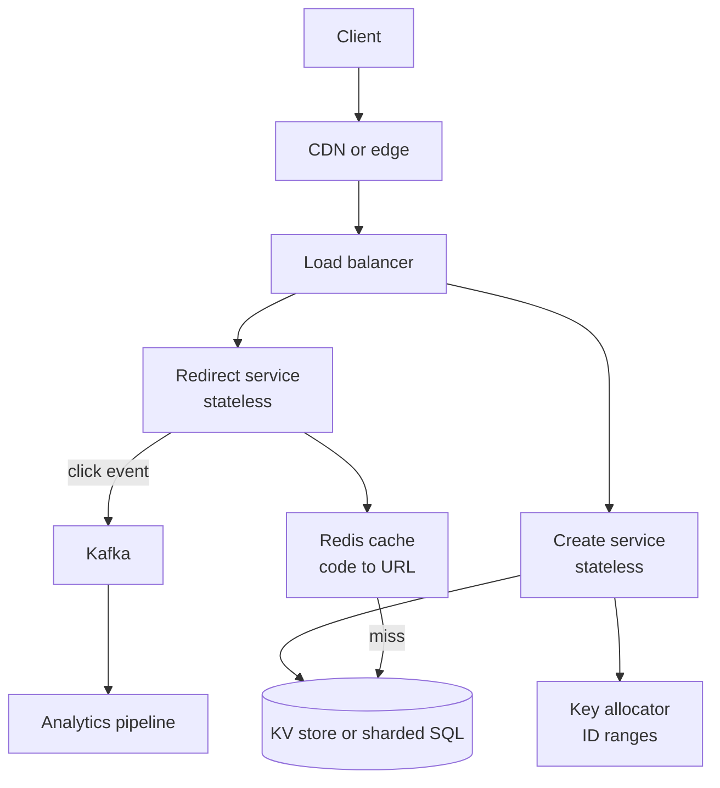
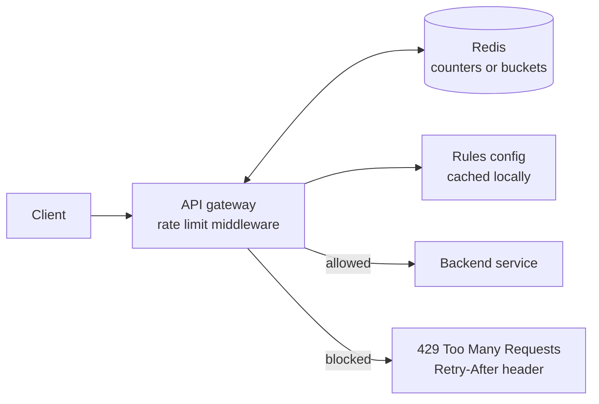
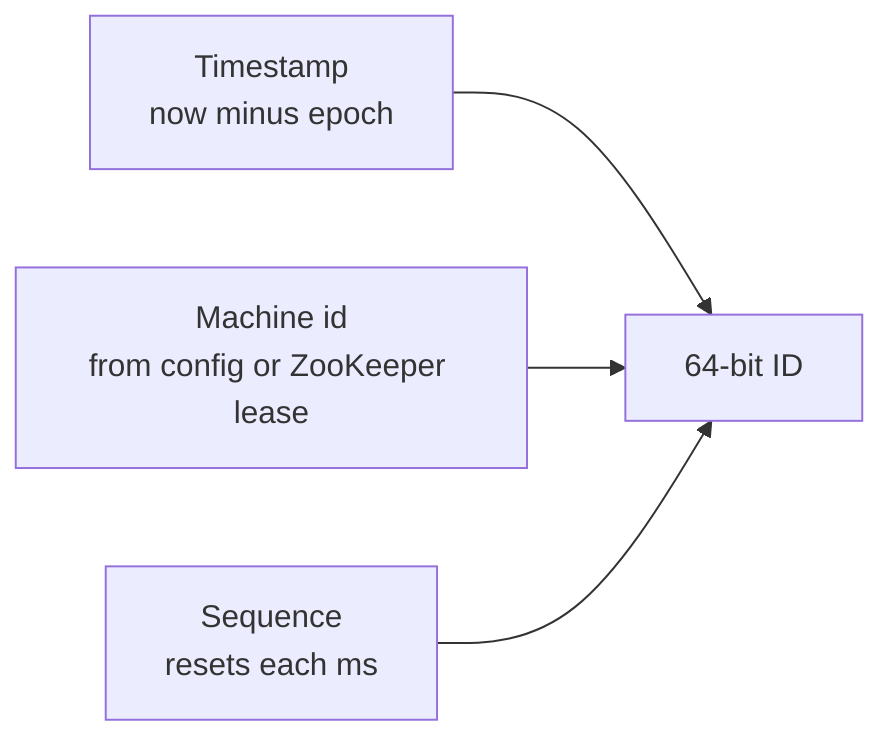
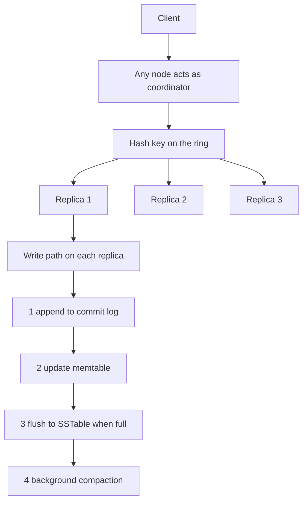
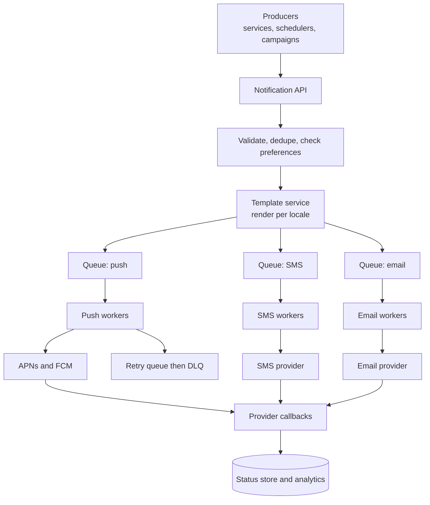
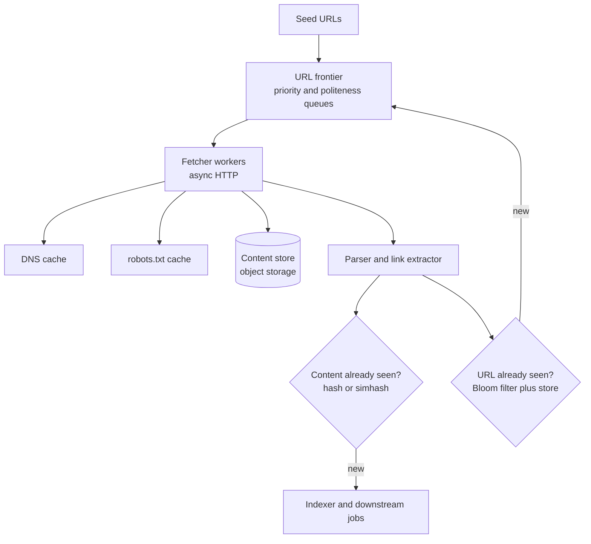
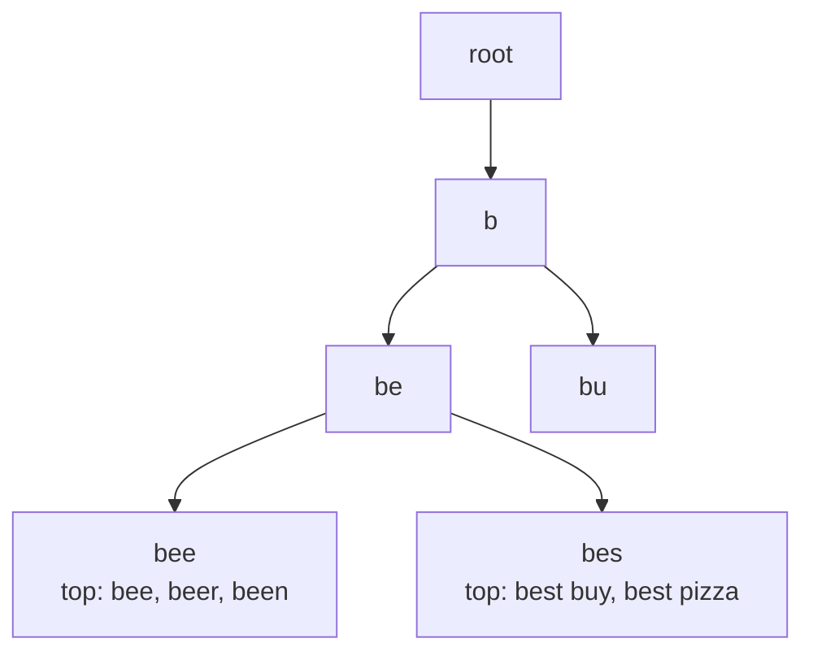
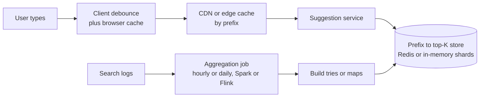
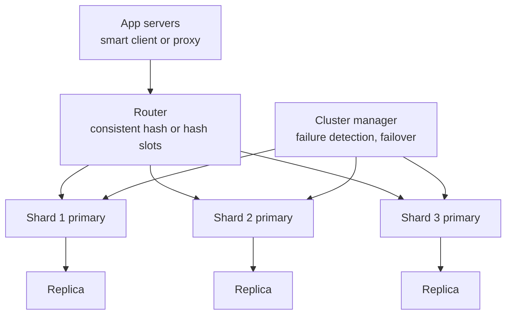

# 📘 Classic HLD Designs

These eight problems are the standard warm-up set.
Each one teaches a reusable idea: key generation, throttling, ordering IDs, partitioning and replication, fan-out, deduplication, precomputation, and caching.
Every design follows the same template so you can rehearse it.

**Template:** requirements, estimates, API, data model, architecture, deep dive, trade-offs and follow-ups.

## Table of Contents

1. [URL Shortener](#1-url-shortener)
2. [Rate Limiter](#2-rate-limiter)
3. [Unique ID Generator](#3-unique-id-generator)
4. [Distributed Key-Value Store](#4-distributed-key-value-store)
5. [Notification System](#5-notification-system)
6. [Web Crawler](#6-web-crawler)
7. [Typeahead and Autocomplete](#7-typeahead-and-autocomplete)
8. [Distributed Cache](#8-distributed-cache)
9. [What These Designs Teach](#9-what-these-designs-teach)

---

## 1. URL Shortener

Turn a long URL into a short one and redirect on access, like bit.ly.

### 1.1 Requirements

**Functional**

- Create a short URL from a long URL, optionally with a custom alias and an expiry.
- Redirect a short URL to the original.
- Optional: click analytics.

**Non-functional**

- Redirect latency low (p99 under 100 ms).
- High availability, since a dead link is a visible failure.
- Short codes should be unguessable enough not to leak private links.
- Read-heavy, about 100 reads per write.

### 1.2 Estimates

```text
New URLs         = 100M per month  -> about 40 writes per second
Redirects        = 100 x writes    -> about 4,000 per second, peak 12,000
5 years of URLs  = 100M x 60       = 6 billion records
Record size      = about 500 bytes -> 3 TB total (fits a sharded KV store)
Code length      = 62^7 = 3.5 trillion combinations, 7 characters is plenty
```

### 1.3 API

```text
POST /v1/urls
  body: { "longUrl": "https://...", "alias": "my-link", "expiresAt": "2027-01-01T00:00:00Z" }
  201:  { "shortUrl": "https://sho.rt/aZ3x9Kq" }

GET /{code}
  301 or 302 with Location: <longUrl>
  404 if unknown, 410 if expired
```

### 1.4 Data Model

| Field | Type | Note |
| --- | --- | --- |
| code (PK) | string(7) | The short code |
| long_url | string | Original URL |
| owner_id | id | Optional |
| created_at, expires_at | timestamp | TTL support |

Access pattern is a single key lookup, so a key-value store (DynamoDB, Cassandra) or a sharded SQL table by `code` both fit.

### 1.5 Architecture



### 1.6 Deep Dive: Generating the Code

| Approach | How | Pros | Cons |
| --- | --- | --- | --- |
| **Hash and truncate** | MD5 or SHA of the URL, take 7 chars | No coordination | Collisions, needs check and retry |
| **Random plus uniqueness check** | Random 7 chars, insert with unique constraint, retry on conflict | Unguessable, simple | Retries as the space fills |
| **Counter plus base62** | Global counter encoded in base62 | No collisions, short | Predictable, needs a distributed counter |
| **Key generation service** | Pre-generate unused keys in a table, hand out batches | Fast, no runtime collision | Extra component to run |

Recommended: **counter ranges**.
A small coordination service (DB row, etcd, ZooKeeper) hands each app server a block of, say, 100,000 numbers.
The server encodes numbers in base62 locally without a network call per URL.
If it crashes, the unused part of the block is simply lost, which does not matter with a space of trillions.
To avoid sequential, guessable codes, run the number through a reversible permutation (a Feistel network or multiplication by a large odd number modulo 62^7) before encoding.

```js
// runnable
const ALPHABET = '0123456789ABCDEFGHIJKLMNOPQRSTUVWXYZabcdefghijklmnopqrstuvwxyz';

function encode(n) {
  let x = BigInt(n);
  if (x === 0n) return '0';
  let s = '';
  while (x > 0n) {
    s = ALPHABET[Number(x % 62n)] + s;
    x /= 62n;
  }
  return s;
}

function decode(s) {
  let x = 0n;
  for (const c of s) x = x * 62n + BigInt(ALPHABET.indexOf(c));
  return x;
}

console.log(encode(125));                 // "21"  (2 x 62 + 1)
console.log(encode(62n ** 7n - 1n));      // "zzzzzzz", the largest 7 character code
console.log(decode(encode(987654321n)) === 987654321n); // true
```

### 1.7 Deep Dive: Redirect Path

- Check the cache first. With a skewed popularity distribution, caching the hottest 20% of daily codes serves most traffic.
- **301 vs 302:** a 301 (permanent) lets browsers and CDNs cache the redirect, cutting load, but you lose click counts and cannot change the target. A 302 or 307 sends every click through you, which analytics needs. Most shorteners use 302 or 307.
- Cache negative results briefly to absorb scans of random codes.
- Do analytics asynchronously: emit an event, never block the redirect on it.

### 1.8 Trade-offs and Follow-ups

- **Custom aliases:** check availability with the same unique constraint.
- **Expiry:** store `expires_at`, check on read, and delete in the background (TTL feature or a sweeper).
- **Abuse:** check submitted URLs against malware and phishing lists, rate limit creation per user or IP.
- **Same long URL twice:** return the same code (needs a reverse index) or a new one. Either is fine, state your choice.
- **Multi-region:** replicate the KV store, and serve redirects from the nearest region.

---

## 2. Rate Limiter

Limit how many requests a client can make in a time window, and return 429 when exceeded.

### 2.1 Requirements

- Limit by user, API key, IP or endpoint, with configurable rules.
- Very low overhead, a few milliseconds at most.
- Works across many servers (distributed).
- Clear feedback: HTTP 429, `Retry-After`, and `RateLimit` headers.
- Decide what happens if the limiter fails: fail open (allow) or fail closed (block).

### 2.2 Where to Put It

| Place | Pros | Cons |
| --- | --- | --- |
| Client side | Cheap | Easily bypassed, never rely on it |
| **API gateway or middleware** | One place, protects all services | Coarse rules only |
| Sidecar or in the service | Fine-grained rules, per endpoint | Every service must include it |
| CDN or edge | Blocks abuse before it reaches you | Limited state and rules |

Common answer: a gateway or middleware layer backed by a shared Redis, plus service-level limits for expensive endpoints.

### 2.3 Architecture



### 2.4 Algorithm: Token Bucket

Each key owns a bucket with capacity `b` (the burst) refilled at `r` tokens per second.
A request removes one token, or is rejected if empty.
It allows short bursts while enforcing an average rate, and uses O(1) memory per key.
Other algorithms and their trade-offs are in [Distributed Systems](/docs/system-design/hld/distributed-systems).

```js
// runnable
class TokenBucket {
  constructor(capacity, refillPerSec, clock = () => Date.now()) {
    this.capacity = capacity;
    this.refillPerSec = refillPerSec;
    this.clock = clock;
    this.tokens = capacity;
    this.last = clock();
  }
  allow(cost = 1) {
    const now = this.clock();
    const elapsedSec = (now - this.last) / 1000;
    this.tokens = Math.min(this.capacity, this.tokens + elapsedSec * this.refillPerSec);
    this.last = now;
    if (this.tokens >= cost) {
      this.tokens -= cost;
      return true;
    }
    return false;
  }
}

class RateLimiter {
  constructor(capacity, refillPerSec, clock) {
    Object.assign(this, { capacity, refillPerSec, clock });
    this.buckets = new Map();
  }
  allow(key) {
    if (!this.buckets.has(key)) {
      this.buckets.set(key, new TokenBucket(this.capacity, this.refillPerSec, this.clock));
    }
    return this.buckets.get(key).allow();
  }
}

let t = 0;
const limiter = new RateLimiter(3, 1, () => t);   // burst 3, refill 1 per second
console.log([1, 2, 3, 4].map(() => limiter.allow('alice')));  // true true true false
t += 2000;                                                    // 2 seconds pass
console.log([1, 2, 3].map(() => limiter.allow('alice')));     // true true false
console.log(limiter.allow('bob'));                            // true, separate bucket
```

### 2.5 Deep Dive: Doing It Atomically in Redis

Read-modify-write from many servers races.
Run the whole check-and-update as a **Lua script**, which Redis executes atomically.

```text
-- KEYS[1] bucket key
-- ARGV: capacity, refill_per_sec, cost
local now = redis.call('TIME')
local now_ms = now[1] * 1000 + math.floor(now[2] / 1000)
local d = redis.call('HMGET', KEYS[1], 'tokens', 'ts')
local capacity = tonumber(ARGV[1])
local tokens = tonumber(d[1]) or capacity
local ts = tonumber(d[2]) or now_ms
tokens = math.min(capacity, tokens + math.max(0, now_ms - ts) / 1000 * tonumber(ARGV[2]))
local allowed = 0
if tokens >= tonumber(ARGV[3]) then tokens = tokens - tonumber(ARGV[3]); allowed = 1 end
redis.call('HSET', KEYS[1], 'tokens', tokens, 'ts', now_ms)
redis.call('PEXPIRE', KEYS[1], math.ceil(capacity / tonumber(ARGV[2]) * 2000))
return allowed
```

Using the Redis server clock avoids skew between app servers.
The key expires when the bucket would be full anyway, so idle keys cost nothing.

### 2.6 Trade-offs and Follow-ups

- **Fail open or closed:** for a public API protecting a database, fail closed for expensive routes and open for cheap ones. Say which and why.
- **Hot keys:** one abusive IP is one Redis key. Shard by key across a Redis cluster.
- **Latency:** an extra Redis round trip per request. Reduce by local approximate counters synced every few hundred milliseconds when exactness is not needed.
- **Multi-region:** per-region limits with a fraction of the global quota, or a globally replicated counter if you accept the latency.
- **Tiers:** free vs paid plans, per-endpoint costs (a search costs 5 tokens), and separate limits for bursts and daily quotas.
- **Response headers:** `Retry-After` on 429, and the `RateLimit-Limit`, `RateLimit-Remaining`, `RateLimit-Reset` style headers.

---

## 3. Unique ID Generator

Generate IDs that are unique across many machines, roughly time ordered, and fit in 64 bits.

### 3.1 Requirements

- Globally unique, no central bottleneck.
- Sortable by time (helps database indexes and pagination).
- 64 bits if possible.
- Thousands of IDs per second per node, tens of thousands overall.

### 3.2 Options

| Approach | Unique | Ordered | Size | Notes |
| --- | --- | --- | --- | --- |
| DB auto-increment | Yes | Yes | 64 bit | Single writer, scale limit, leaks volume |
| Ticket server (Flickr) | Yes | Yes | 64 bit | Central service, SPOF unless run in pairs with odd and even ranges |
| UUIDv4 | Yes | No | 128 bit | No coordination, hurts B-tree locality |
| **UUIDv7 (RFC 9562)** | Yes | Yes (ms) | 128 bit | Standard, no coordination, index friendly |
| **Snowflake** | Yes | Yes (ms) | 64 bit | Needs machine ids and clock care |
| ULID | Yes | Yes (ms) | 128 bit | Sortable string form |

If 128 bits and a standard are acceptable, UUIDv7 is the simplest good answer today.
The classic interview answer is Snowflake, because of the 64-bit requirement.

### 3.3 Snowflake Layout

```text
| 1 bit sign | 41 bits timestamp (ms since custom epoch) | 10 bits machine id | 12 bits sequence |

41 bits of milliseconds  = about 69 years
10 bits of machine id    = 1,024 nodes
12 bits of sequence      = 4,096 ids per millisecond per node
```



```js
// runnable
class Snowflake {
  constructor(machineId, epoch = 1700000000000n) {
    if (machineId < 0 || machineId > 1023) throw new Error('machineId must be 0..1023');
    this.machineId = BigInt(machineId);
    this.epoch = epoch;
    this.lastMs = -1n;
    this.seq = 0n;
  }
  nextId(now = BigInt(Date.now())) {
    if (now < this.lastMs) throw new Error('clock moved backwards, refuse to generate');
    if (now === this.lastMs) {
      this.seq = (this.seq + 1n) & 4095n;
      if (this.seq === 0n) {                 // 4096 ids used in this ms, wait for the next
        while (now <= this.lastMs) now = BigInt(Date.now());
      }
    } else {
      this.seq = 0n;
    }
    this.lastMs = now;
    return ((now - this.epoch) << 22n) | (this.machineId << 12n) | this.seq;
  }
}

const gen = new Snowflake(7);
const ids = Array.from({ length: 10000 }, () => gen.nextId());
console.log('unique:', new Set(ids).size === ids.length);
console.log('increasing:', ids.every((v, i) => i === 0 || v > ids[i - 1]));
console.log('machine id bits:', (ids[0] >> 12n) & 1023n);
```

### 3.4 Deep Dive: The Hard Parts

- **Machine id assignment:** from static config, or a lease in ZooKeeper or etcd when the fleet is dynamic (containers). Two nodes with the same id will collide.
- **Clock going backwards (NTP step):** refuse to issue IDs until the clock catches up, or wait, or use a logical high-water mark. Never issue from a smaller timestamp.
- **Restart within the same millisecond:** persist the last timestamp or wait out a safe window on startup.
- **Ordering is approximate across nodes:** IDs from different nodes in the same millisecond order by machine id, not causality. If you need causal order, use per-entity sequence numbers or a log.
- **Leakage:** IDs reveal creation time and rough volume. Do not use them as secrets.

---

## 4. Distributed Key-Value Store

Design a Dynamo-style store: `put(key, value)` and `get(key)`, highly available, scalable, tunably consistent.

### 4.1 Requirements

- Small values (KBs), billions of keys.
- Always writable (availability over consistency).
- Horizontal scale, low latency, automatic recovery from node failure.
- Tunable consistency.

### 4.2 Building Blocks

| Concern | Technique |
| --- | --- |
| Partitioning | Consistent hashing with virtual nodes |
| Replication | Each key stored on N nodes, the next N distinct physical nodes clockwise (the preference list) |
| Consistency | Quorum: W acks on write, R responses on read, W plus R greater than N gives overlap |
| Conflicts | Vector clocks plus client merge, or last write wins |
| Failure detection | Gossip protocol for membership |
| Temporary failure | Sloppy quorum and hinted handoff |
| Permanent failure | Anti-entropy with Merkle trees |
| Local storage | LSM tree: commit log, memtable, immutable SSTables, Bloom filters, compaction |

### 4.3 Architecture



### 4.4 Write and Read Paths

**Write (N=3, W=2)**

1. Client contacts any node. That node becomes coordinator for this request (or routes to the owner).
2. Coordinator finds the 3 replicas on the ring and sends the write to all.
3. Each replica appends to its commit log, updates its memtable, and acks.
4. After 2 acks, the coordinator returns success. The third replica catches up asynchronously.
5. If a replica is down, another node stores the write with a **hint** and forwards it later.

**Read (R=2)**

1. Coordinator asks the replicas, waits for 2 responses.
2. If versions differ, return the newest by vector clock, or return siblings if concurrent.
3. **Read repair:** write the winning version back to stale replicas.

On a replica the read checks the memtable, then SSTables from newest to oldest, using Bloom filters to skip files that cannot contain the key.

### 4.5 Trade-offs and Follow-ups

- **Consistency knobs:** `W=1,R=1` is fastest and eventual, `W=2,R=2` at N=3 gives overlap, `W=N` makes writes fail if any replica is down.
- **Conflicts:** LWW is simple and loses data. Vector clocks preserve conflicts and push merge logic to the application, as in the Dynamo shopping cart.
- **Membership:** gossip avoids a central coordinator but converges eventually. Some modern systems use a consensus service for metadata (Kafka now uses KRaft for this reason).
- **Hot keys and large values:** cache hot keys, split large values, or store blobs in object storage with a pointer here.
- **Compare with:** DynamoDB, Cassandra, Riak, ScyllaDB.

---

## 5. Notification System

Send push, SMS and email notifications to millions of users reliably, without spamming them.

### 5.1 Requirements

- Channels: mobile push (APNs, FCM), SMS, email, in-app.
- Triggered events (order shipped), scheduled, and bulk campaigns.
- Respect user preferences, quiet hours and opt-outs.
- Soft real time: seconds. At least once delivery, no duplicates from the user's point of view.
- High volume: for example 10 million notifications per day, with spikes far higher.

### 5.2 Architecture



### 5.3 Deep Dive

- **Separate queue and workers per channel** so a slow SMS provider cannot delay push. Add priority tiers: OTP and security messages get a fast lane, marketing goes on a low-priority queue that can be throttled.
- **Idempotency and dedupe:** each notification has an id. Workers record sent ids (short TTL) so retries after a timeout do not double send. Providers rarely guarantee this for you.
- **User preferences:** a service or cached table of channel opt-ins, quiet hours, frequency caps. Check before enqueue. Legal opt-outs (unsubscribe, STOP) must be honored immediately.
- **Retries:** exponential backoff with jitter, a maximum attempts count, then a dead-letter queue and alerting. Distinguish permanent errors (invalid token, delete it) from transient ones.
- **Device tokens:** store per user and device, refresh on app start, remove on APNs or FCM "unregistered" responses.
- **Rate limiting:** per user (no more than N marketing pushes a day), and toward providers to respect their quotas.
- **Bulk campaigns:** fan-out in batches from a segment query into the queue. Spread the send over time to avoid thundering the provider and your own backend when users all open the app at once.
- **Scheduling:** a delayed job store (time-bucketed table or delay queue) polled by schedulers, see [Large-Scale Designs](/docs/system-design/hld/large-scale-designs) for the job scheduler.
- **Observability:** sent, delivered, opened, failed per channel, provider latency and error rate. Have a kill switch per campaign.

### 5.4 Trade-offs

- At-least-once with dedupe is realistic. Exactly-once across an external provider is not.
- Ordering across notifications is usually unnecessary, drop it to gain parallelism.
- Provider failover (two SMS vendors) improves availability, at the cost of complexity and duplicate risk.

---

## 6. Web Crawler

Fetch billions of pages, extract links, store content, and avoid overloading sites.

### 6.1 Requirements and Estimates

- Crawl 1 billion pages per month, respect `robots.txt`, be polite, avoid duplicates, be extensible to new content types.

```text
1B pages / 30 days / 86,400 s = about 400 pages per second
Average page 100 KB           = about 100 TB per month raw
```

Fetching is I/O bound, so a few hundred machines with asynchronous I/O cover it.

### 6.2 Architecture



### 6.3 Deep Dive

**URL frontier**

- **Priority:** front queues ranked by importance (PageRank-like score, change frequency, site quality).
- **Politeness:** back queues, one per host, so only one fetcher talks to a host at a time, with a delay between requests (respect `Crawl-delay` and adapt to response time).
- A mapping from host to back queue ensures the same worker always handles the same host, which also keeps the DNS and robots.txt caches hot.

**Deduplication**

- **URL level:** normalize (lowercase host, remove fragments, sort query params, resolve relative links), then check a **Bloom filter** in memory backed by a persistent set. False positives skip a few pages, which is acceptable.
- **Content level:** hash the body for exact duplicates, and **simhash** or MinHash for near duplicates (mirrors, boilerplate variations).

**Traps and failures**

- Infinite depth (calendars, session IDs in URLs): cap depth, cap URLs per host, detect repeating path patterns.
- Timeouts and slow hosts: aggressive timeouts, skip and retry later with backoff.
- Robots and legal: fetch and cache `robots.txt` per host, honor disallow rules and noindex.
- **Freshness:** recrawl frequency by observed change rate, using conditional requests (`If-Modified-Since`, `ETag`).
- **JavaScript-rendered pages:** a headless-browser tier, used selectively because it is 10 to 100 times more expensive.
- **Distribution:** partition the frontier by host hash, so each fetcher owns a set of hosts. Use a queue or a sharded database for the frontier.

### 6.4 Trade-offs

- BFS gives broad coverage, priority-driven crawling finds valuable pages first.
- Exactness of dedupe vs memory: Bloom filter is tiny and approximate, a full store is exact and large.
- Politeness caps per-host throughput, so total speed comes from breadth across many hosts.

---

## 7. Typeahead and Autocomplete

Suggest the top completions as a user types a query prefix.

### 7.1 Requirements and Estimates

- Suggest top 5 to 10 completions per prefix, ranked by popularity (and optionally personalization and freshness).
- Very fast: under 100 ms end to end, ideally under 50.
- Read-heavy: every keystroke is a request.

```text
10M DAU x 10 searches x about 5 keystroke requests = 500M requests per day
= about 6,000 QPS average, 20,000 at peak
Distinct query strings: hundreds of millions, top-K per prefix keeps it small
```

### 7.2 Data Structure

A **trie** stores queries by prefix.
Storing the **top-K completions at every node** makes lookup O(length of prefix) with no subtree walk.



In production the trie is often flattened into a **key-value map: prefix to list of top-K suggestions**.
It is simple to shard, cache and serve.

### 7.3 Architecture



### 7.4 Deep Dive

- **Offline build:** stream search logs into an aggregator that counts queries per window with decay for recency. Rebuild the prefix map periodically and swap it in atomically. Real-time trending queries can be merged from a small fast-updating side store.
- **Do not update the trie on every query.** Writes are frequent and the ranking barely changes per query.
- **Sharding:** by prefix range (a to c, d to f) or by hash of the first N characters. Skew is a problem (the prefix "s" is hot), so shard by data volume with a directory.
- **Caching:** results for popular short prefixes are identical for all users, so cache at the browser, CDN and service. Set `Cache-Control` for a few minutes.
- **Client side:** debounce keystrokes (wait 100 to 200 ms), cancel stale requests, send only after 1 to 2 characters, and prefetch.
- **Filtering:** remove offensive, private and legal-risk suggestions before publishing the map.
- **Personalization:** blend a global list with the user's recent searches from a small per-user store, ranked client side or in a thin service.
- **Typos and multi-language:** edit distance (fuzzy match), n-gram indexes, normalization of case and accents.

### 7.5 Trade-offs

Freshness vs cost (rebuild cadence), accuracy vs latency (precomputed top-K vs computing on the fly), and personalization vs cacheability (personalized results cannot be shared in the CDN).

---

## 8. Distributed Cache

Design a cache cluster like a managed Redis or Memcached tier.

### 8.1 Requirements

- Get and set by key with sub-millisecond latency, millions of operations per second across the cluster.
- Scale by adding nodes, survive node failures, evict when full, support TTL.

### 8.2 Architecture



### 8.3 Deep Dive

- **Partitioning:** consistent hashing on the client, or fixed hash slots (Redis Cluster uses 16,384) that map to nodes, so resharding moves slots not individual keys. A proxy layer (Envoy, twemproxy) hides topology from clients.
- **Replication:** each shard has a primary and one or more replicas. Replication is asynchronous, so a failover can lose the last writes. That is acceptable for a cache, and a reason not to use a cache as a system of record.
- **Eviction:** LRU or LFU approximations (sample a few keys and evict the worst, as Redis does) rather than exact global structures. Set `maxmemory` and a policy.
- **Hot keys:** detect by sampling, replicate or locally cache them, or append a random suffix to spread across shards.
- **Consistency with the database:** cache-aside with delete on write plus TTL, see [Building Blocks](/docs/system-design/hld/building-blocks).
- **Failure of a shard:** requests fall to the database, so protect it (circuit breaker, request coalescing, rate limits). Warm the replacement gradually.
- **Memory efficiency:** compact encodings, compress large values, keep values small, use TTL jitter.
- **Multi-tenant limits:** per-tenant memory quota and rate limits so one client cannot evict everyone else.

### 8.4 Trade-offs

Client-side routing is faster and needs smart clients, while a proxy centralizes logic and adds a hop.
Persistence (snapshots, append-only log) speeds recovery, at the price of I/O and complexity.

---

## 9. What These Designs Teach

| Design | The reusable idea |
| --- | --- |
| URL shortener | Key generation, read-heavy caching, 301 vs 302 |
| Rate limiter | Token bucket, atomic shared counters, fail open or closed |
| ID generator | Time-ordered IDs, clock skew, coordination-free uniqueness |
| Key-value store | Consistent hashing, quorums, LSM storage, gossip |
| Notification system | Queues per channel, dedupe, retries, preferences |
| Web crawler | Frontier, politeness, Bloom filters, dedupe |
| Typeahead | Precomputation, top-K per prefix, edge caching |
| Distributed cache | Sharding, hot keys, eviction, protecting the database |

Quick self-test questions:

1. Why is a 302 redirect preferred for a shortener that shows analytics?
2. Why must the token bucket update be atomic, and how do you make it atomic in Redis?
3. What breaks if two Snowflake nodes share a machine id?
4. With N=5, what W and R give read-your-writes, and what do you lose?
5. How does a crawler avoid hammering one host with 1,000 URLs in the queue?
6. Why not update the typeahead trie on every search?

Next: [Large-Scale Designs](/docs/system-design/hld/large-scale-designs) for feeds, chat, video, payments and more.
