# 📘 Distributed Systems for System Design

This is the advanced page.
It explains why distributed systems are hard and gives you the standard tools: logical clocks, quorums, consensus, sagas, idempotency, and resilience patterns.
These ideas separate a senior answer ("we use Kafka and Redis") from a strong one ("here is how it behaves when the network partitions").

## Table of Contents

1. [Why Distributed Systems Are Hard](#1-why-distributed-systems-are-hard)
2. [Time and Ordering](#2-time-and-ordering)
3. [Replication in Depth](#3-replication-in-depth)
4. [Consensus and Raft](#4-consensus-and-raft)
5. [Locks, Leases and Fencing](#5-locks-leases-and-fencing)
6. [Isolation Levels and Anomalies](#6-isolation-levels-and-anomalies)
7. [Distributed Transactions](#7-distributed-transactions)
8. [Idempotency and Exactly-Once](#8-idempotency-and-exactly-once)
9. [Rate Limiting Algorithms](#9-rate-limiting-algorithms)
10. [Resilience Patterns](#10-resilience-patterns)
11. [Event-Driven Architecture](#11-event-driven-architecture)
12. [Multi-Region Design](#12-multi-region-design)
13. [Blast Radius: Cells and Shuffle Sharding](#13-blast-radius-cells-and-shuffle-sharding)
14. [Monolith or Microservices](#14-monolith-or-microservices)
15. [Advanced Questions](#15-advanced-questions)

---

## 1. Why Distributed Systems Are Hard

On one machine, a function call either returns or crashes.
Across machines you get a third outcome: **you do not know**.

The classic false assumptions (the fallacies of distributed computing):

1. The network is reliable.
2. Latency is zero.
3. Bandwidth is infinite.
4. The network is secure.
5. Topology does not change.
6. There is one administrator.
7. Transport cost is zero.
8. The network is homogeneous.

Three sources of trouble to keep in mind for every design:

| Source | Example | Design consequence |
| --- | --- | --- |
| **Unreliable network** | Packet lost, delayed, duplicated, reordered | Timeouts, retries, idempotency |
| **Unreliable clocks** | Two servers disagree on "now" by tens of ms or more, clocks can jump | Never order events by wall clock alone |
| **Partial failure and pauses** | A node stalls for seconds in a GC pause or VM freeze, then continues as if nothing happened | Leases need fencing, timeouts cannot prove death |

Failure detection is guesswork: a timeout only means "no response yet".
So systems run on **suspicion**, and must stay correct when suspicion is wrong.

---

## 2. Time and Ordering

### 2.1 Physical Clocks

- **Wall clock:** can jump forward or backward (NTP correction, leap seconds, manual change). Fine for timestamps in logs, dangerous for ordering and expiry.
- **Monotonic clock:** only moves forward on one machine. Use it for measuring durations and timeouts. Meaningless across machines.
- **Clock skew** between machines of milliseconds to hundreds of milliseconds is normal without special hardware.

Last-write-wins by wall clock can silently drop a newer write when a node's clock runs behind.

### 2.2 Logical Clocks

**Lamport clock:** one counter per process.

- On a local event, increment.
- On send, attach the counter.
- On receive, set counter to `max(local, received) + 1`.

If event A happened before B, then `L(A) < L(B)`.
The reverse is not true, so Lamport clocks give a consistent order but cannot detect concurrency.

**Vector clock:** one counter per process, a vector.
Two versions are **concurrent** if neither vector dominates the other.
Dynamo-style stores use this to detect conflicting writes and hand both versions back to the client to merge.

```js
// runnable
function compare(a, b) {
  const keys = new Set([...Object.keys(a), ...Object.keys(b)]);
  let less = false, greater = false;
  for (const k of keys) {
    const x = a[k] || 0, y = b[k] || 0;
    if (x < y) less = true;
    if (x > y) greater = true;
  }
  if (less && greater) return 'concurrent';
  if (less) return 'before';
  if (greater) return 'after';
  return 'equal';
}

console.log(compare({ A: 1 }, { A: 2 }));                 // before
console.log(compare({ A: 2, B: 1 }, { A: 1, B: 2 }));     // concurrent: real conflict
console.log(compare({ A: 2, B: 2 }, { A: 1, B: 2 }));     // after
```

**Hybrid logical clock (HLC):** combines physical time and a logical counter, giving timestamps close to real time that still respect causality. Used by CockroachDB and others.

**TrueTime (Spanner):** clock APIs return an interval `[earliest, latest]` with bounded uncertainty (GPS and atomic clocks).
A transaction waits out the uncertainty ("commit wait") before making its timestamp visible, which yields external consistency.

### 2.3 What to Say in an Interview

"I do not trust wall clocks for ordering across machines.
I would use a per-partition sequence number or a log offset for ordering, and version numbers or vector clocks where concurrent writes must be detected."

---

## 3. Replication in Depth

### 3.1 Leader Failover

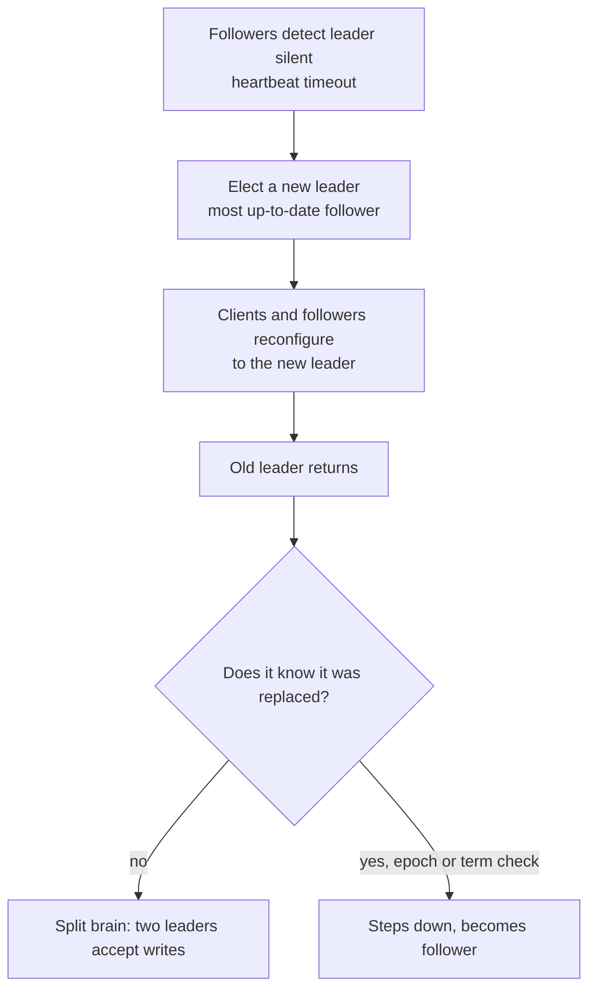

Failover hazards:

- **Lost writes:** with async replication, the new leader may lack the old leader's last writes.
- **Split brain:** two nodes believe they are leader. Prevent with an **epoch (term) number** and a majority requirement, and **fence** the old leader (reject its writes at the storage layer).
- **Timeout tuning:** too short causes flapping and needless failovers under load, too long extends downtime.

### 3.2 Quorums

With `N` replicas, a write must reach `W` replicas and a read must ask `R` replicas.
If `W + R > N`, every read set overlaps every write set, so a read sees at least one up-to-date copy.

| N | W | R | Behavior |
| --- | --- | --- | --- |
| 3 | 2 | 2 | Balanced, tolerates 1 node down for reads and writes |
| 3 | 3 | 1 | Fast reads, writes need all nodes |
| 3 | 1 | 3 | Fast writes, reads need all nodes |
| 3 | 1 | 1 | Fastest, eventual consistency only |

Caveats: quorum overlap does not equal linearizability by itself (concurrent writes, sloppy quorums, clock issues).
Cassandra and DynamoDB expose these knobs per request.

Related mechanisms:

- **Sloppy quorum and hinted handoff:** if a home node is down, write to another node with a hint, then hand the data back when the home node returns. Improves availability, weakens consistency.
- **Read repair:** on a quorum read, if replicas disagree, write the newest version back to the stale ones.
- **Anti-entropy with Merkle trees:** replicas compare hash trees to find and sync differing ranges cheaply.
- **Gossip:** nodes periodically exchange membership and health state with random peers. Scales to thousands of nodes, converges in O(log n) rounds.

### 3.3 Conflict Resolution

| Strategy | How | Drawback |
| --- | --- | --- |
| Last write wins (LWW) | Highest timestamp wins | Silent data loss, clock dependent |
| Vector clocks plus client merge | Keep siblings, app merges | Application complexity |
| **CRDTs** | Data types whose merge is commutative, associative, idempotent | Limited types, metadata overhead |
| Application rules | Domain merge (union of cart items) | Custom code |

CRDT examples: G-Counter (per node counters, merge by max, value is the sum), PN-Counter (two G-Counters), OR-Set (add and remove with unique tags), LWW-Register.
Used in Redis Enterprise active-active, Riak, and many collaborative editors.

---

## 4. Consensus and Raft

**Consensus** lets a group of nodes agree on a value (or a sequence of values, a log) even when some nodes crash and messages are delayed.
It is the foundation of leader election, configuration stores, and strongly consistent replicated databases.

Where it is used:

| System | Consensus role |
| --- | --- |
| etcd, Consul | Cluster state and coordination (Raft) |
| Kafka (KRaft) | Cluster metadata, replacing ZooKeeper |
| CockroachDB, TiDB | One Raft group per data range |
| Spanner | Paxos group per shard |
| ZooKeeper | ZAB protocol for coordination |

### 4.1 Raft in One Page

Raft splits consensus into three parts: leader election, log replication, safety.

- Nodes are **followers**, **candidates** or a **leader**.
- Time is divided into **terms**. Each term has at most one leader.
- A follower that hears nothing from a leader for a randomized **election timeout** (typically 150 to 300 ms) becomes a candidate, increments the term, and asks for votes.
- A candidate needs votes from a **majority**. Each node votes once per term.
- The leader takes client writes, appends them to its log, replicates to followers, and **commits** an entry once a majority has stored it.
- A candidate can only win if its log is at least as up to date as a majority, so committed entries are never lost.

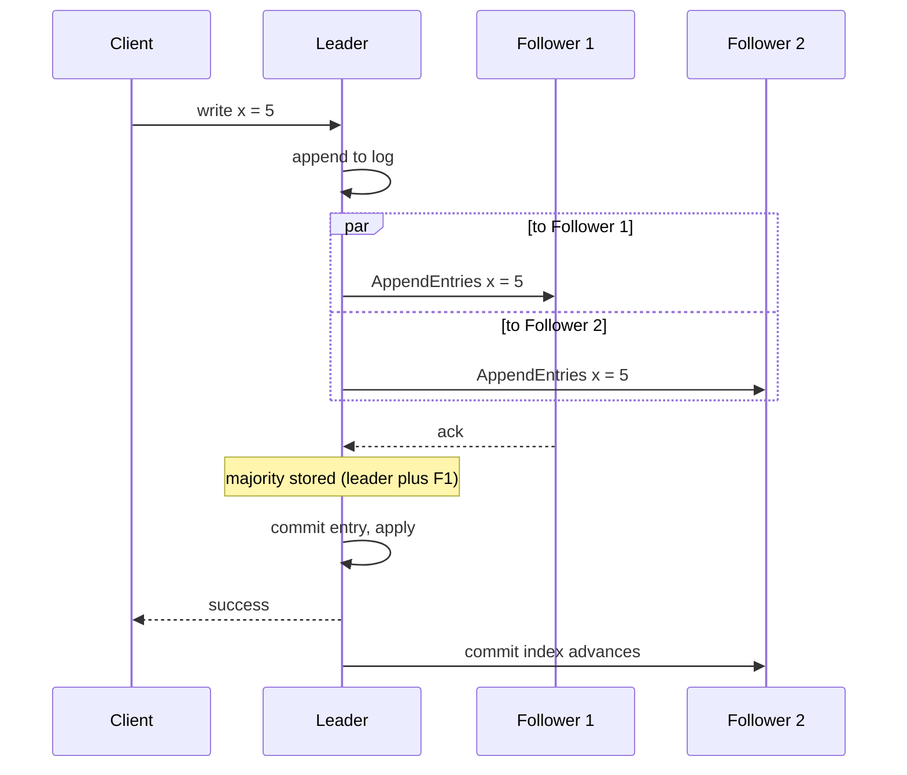

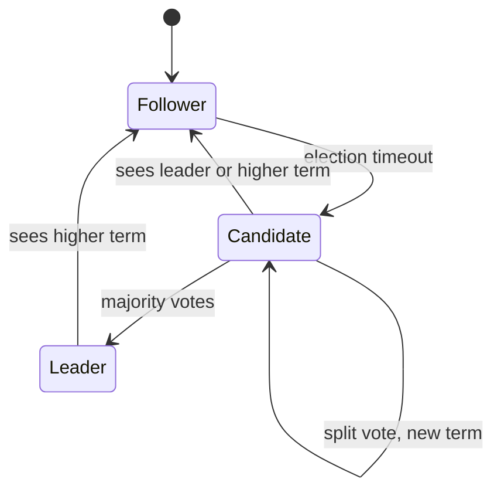

### 4.2 Cluster Sizes

| Nodes | Majority | Failures tolerated |
| --- | --- | --- |
| 1 | 1 | 0 |
| 3 | 2 | 1 |
| 4 | 3 | 1 (no better than 3) |
| 5 | 3 | 2 |
| 7 | 4 | 3 |

Use odd sizes, usually 3 or 5.
More nodes means more fault tolerance and slower writes (more acks), so consensus groups stay small and hold small, critical data.
To scale, shard the data into many small groups.

### 4.3 Interview Points

- Consensus gives **linearizable** writes through the leader, at the cost of a round trip to a majority and unavailability without a majority.
- Reads from a follower can be stale. Linearizable reads need the leader (with a read index or lease) or a log round.
- Cross-region Raft groups pay cross-region latency on every write, so place the leader near writers.
- Raft tolerates crashes, not malicious (Byzantine) nodes.
- FLP result: in a fully asynchronous network no deterministic protocol guarantees consensus. Practical systems use timeouts to make progress.

---

## 5. Locks, Leases and Fencing

A distributed lock protects a resource from concurrent modification by multiple processes.
The trap: a client can pause after acquiring the lock.

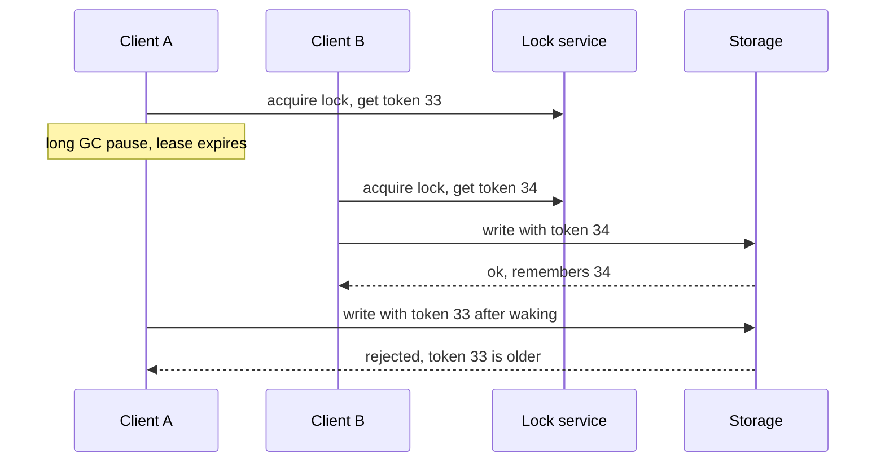

- A **lease** is a lock with an expiry, so a crashed holder does not block forever.
- A **fencing token** is a monotonically increasing number issued with each lock grant. The storage layer rejects writes with an older token. This makes correctness independent of timing assumptions.
- Redis-based locks (`SET key value NX PX ttl`) are fine for efficiency (avoid duplicate work), risky for correctness. Redlock is debated for this reason. Use a consensus-backed store (etcd, ZooKeeper) or database constraints when correctness matters.
- Best of all: avoid the lock. Use idempotent operations, optimistic concurrency (version column with compare-and-set), or a single writer per key through partitioning.

```text
UPDATE seats SET holder = 'u1', version = version + 1
WHERE seat_id = 42 AND version = 7;   -- 0 rows updated means someone else won
```

---

## 6. Isolation Levels and Anomalies

Isolation defines what concurrent transactions can observe of each other.

| Anomaly | Meaning |
| --- | --- |
| **Dirty read** | Read data another transaction has not committed |
| **Non-repeatable read** | Same row read twice, different values |
| **Phantom** | Same query twice returns a different set of rows |
| **Lost update** | Two read-modify-write cycles, one overwrites the other |
| **Write skew** | Two transactions read overlapping data and write different rows, jointly violating an invariant (two on-call doctors both go off duty) |

| Level | Dirty read | Non-repeatable read | Phantom | Lost update | Write skew |
| --- | --- | --- | --- | --- | --- |
| Read uncommitted | possible | possible | possible | possible | possible |
| Read committed (default in PostgreSQL, Oracle) | prevented | possible | possible | possible | possible |
| Snapshot isolation (PostgreSQL "repeatable read", MySQL InnoDB repeatable read behaves similarly but differs in details) | prevented | prevented | mostly prevented | often prevented | **possible** |
| Serializable | prevented | prevented | prevented | prevented | prevented |

Notes:

- Names differ across databases. Read the documentation of your database, do not trust the label.
- Snapshot isolation is popular because readers do not block writers, but it allows write skew.
- **Serializable** can be implemented by actual serial execution, two-phase locking, or serializable snapshot isolation (SSI, used by PostgreSQL). It costs throughput or aborts and retries.
- Fixes for lost update: atomic increment (`SET n = n + 1`), `SELECT ... FOR UPDATE`, compare-and-set with a version.

---

## 7. Distributed Transactions

When one business action spans several databases or services, you cannot rely on a local transaction.

### 7.1 Two-Phase Commit (2PC)

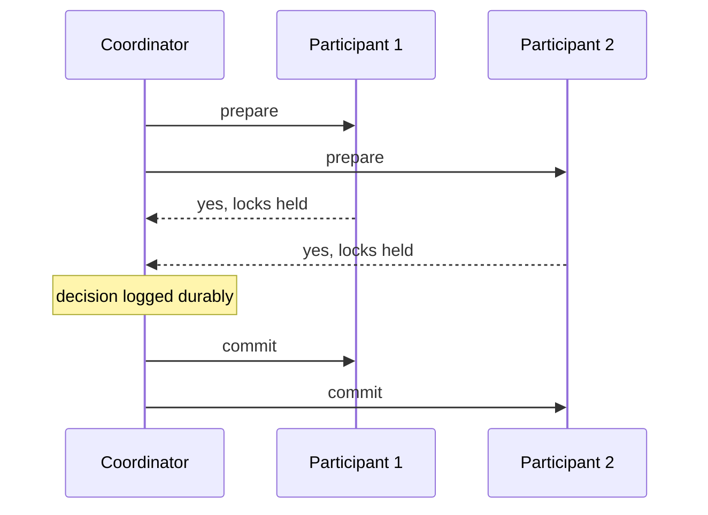

- Phase 1 (prepare): each participant durably promises it can commit and holds its locks.
- Phase 2 (commit or abort): the coordinator decides and tells everyone.
- **Blocking problem:** if the coordinator dies after prepare, participants hold locks until it recovers.
- Works well inside one database engine or with a replicated coordinator (Spanner runs 2PC across Paxos groups). Rarely used across independent microservices.

### 7.2 Sagas

A **saga** is a sequence of local transactions. If one step fails, run **compensating transactions** to undo earlier steps.
There is no isolation between steps, so intermediate states are visible.

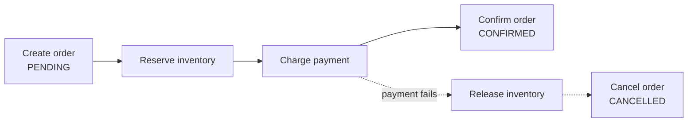

| Style | How | Pros | Cons |
| --- | --- | --- | --- |
| **Orchestration** | A central saga coordinator tells each service what to do next | Clear flow, easy to monitor and change | Coordinator is more logic to own |
| **Choreography** | Services react to each other's events | No central point, loose coupling | Flow hard to see, cyclic dependencies |

Design rules:

- Every step needs a compensation and both must be **idempotent**.
- Some steps cannot be undone (sending an email), so order them last or make them the "pivot".
- Track saga state durably. Use a workflow engine (Temporal, AWS Step Functions) instead of hand-rolling for complex flows.
- Use semantic locks and status fields (`PENDING`) to hide intermediate state from users.

### 7.3 Transactional Outbox

Problem: "update my DB and publish an event" is two writes to two systems, and one can succeed without the other (the dual write problem).

Solution: write the event to an **outbox table in the same DB transaction** as the state change.
A relay (polling publisher, or CDC such as Debezium reading the DB log) publishes rows to the broker.
Delivery is at least once, so consumers must be idempotent.

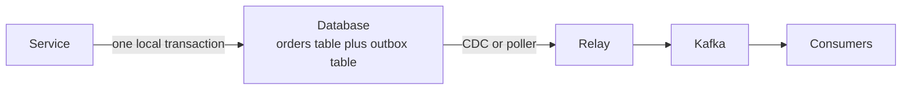

The mirror image, the **inbox** pattern, stores processed message ids to dedupe on the consumer side.

### 7.4 Other Options

- **TCC (try, confirm, cancel):** reserve resources in try, finalize in confirm, release in cancel. Common in payments and booking.
- **Avoid the problem:** keep data that must change together in one service or one shard.
- **Distributed SQL:** let Spanner or CockroachDB coordinate across ranges, and stay within one region where possible.

---

## 8. Idempotency and Exactly-Once

You cannot get exactly-once delivery over an unreliable network.
You get **at-least-once delivery plus idempotent handling**, which has the same effect.

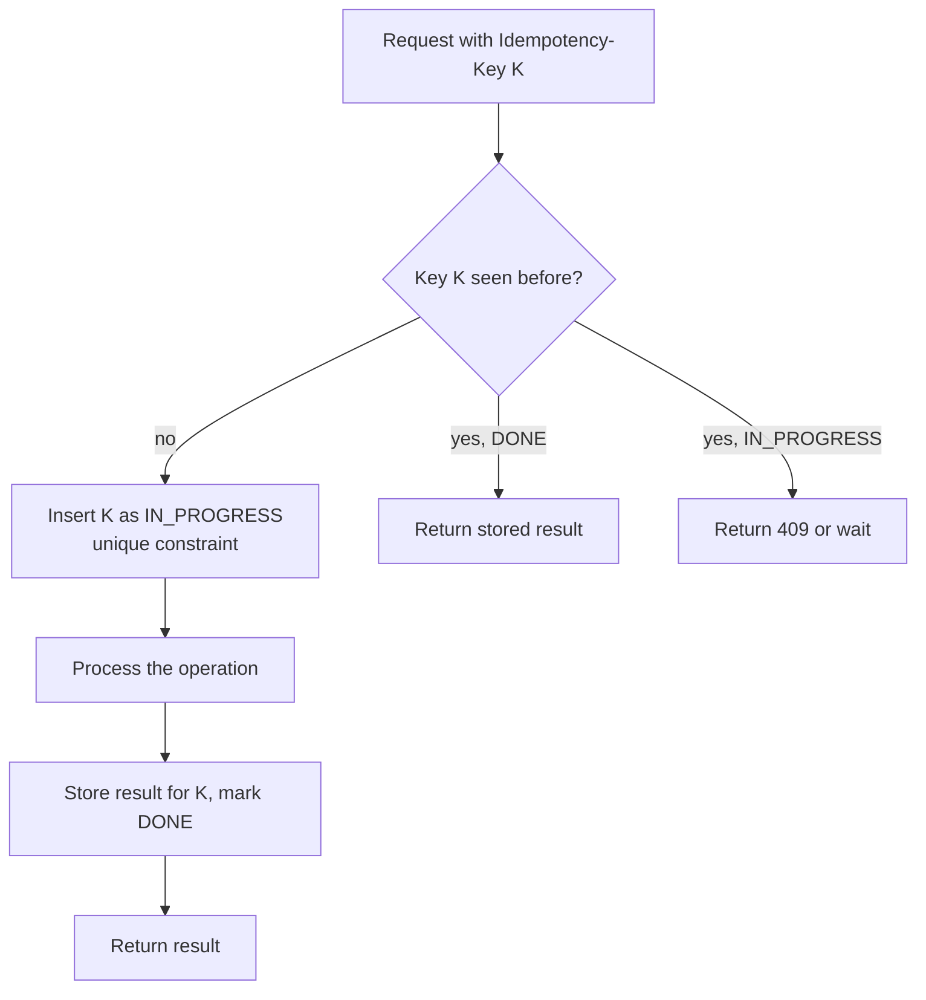

Rules:

- The client generates the key (UUID) once per logical operation and reuses it on every retry.
- Insert the key and the effect **atomically** (same transaction) or the dedupe can be bypassed.
- Store the response so a retry returns the same answer.
- Expire keys after a window (for example 24 hours), and scope them per user.
- A unique constraint on a natural key (order id and payment attempt) is the cheapest idempotency.

Naturally idempotent designs beat dedupe tables: `SET balance = 100` is idempotent, `SET balance = balance + 10` is not.

---

## 9. Rate Limiting Algorithms

Rate limiting protects a service from overload, abuse and noisy neighbors.
The full design is in [Classic Designs](/docs/system-design/hld/classic-designs). The algorithms:

| Algorithm | How | Bursts | Memory | Accuracy |
| --- | --- | --- | --- | --- |
| **Token bucket** | Bucket refills at rate r up to capacity b, each request takes a token | Allows bursts up to b | O(1) per key | Good |
| **Leaky bucket** | Requests enter a queue drained at a fixed rate | Smooths to constant rate | O(queue) | Good |
| **Fixed window** | Counter per time window | Up to 2x at window edges | O(1) | Poor at edges |
| **Sliding window log** | Store timestamps of recent requests | Exact | O(requests) | Exact |
| **Sliding window counter** | Weighted sum of current and previous window counts | Small error | O(1) | Very good approximation |

Sliding window counter formula:

```text
estimate = current_count + previous_count x (1 - fraction_of_current_window_elapsed)
```

Distributed limiting needs a shared counter, usually Redis with an atomic script, or local limiters with periodic sync when a small error is acceptable.

---

## 10. Resilience Patterns

Assume every dependency will be slow or broken.
These patterns keep one failure from becoming an outage.

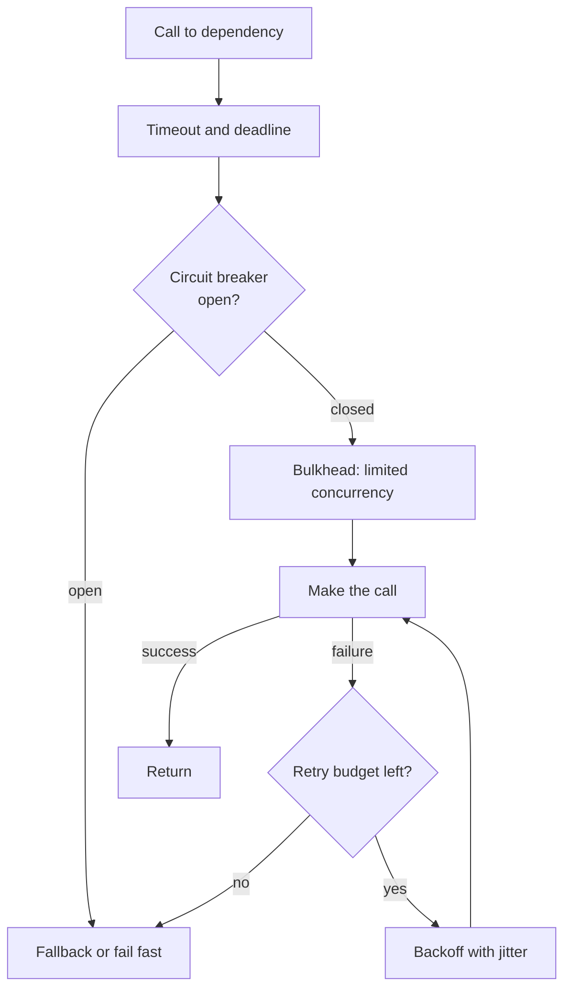

### 10.1 Timeouts and Deadlines

- Every network call needs a timeout. The default in many libraries is infinite.
- Propagate a **deadline** down the call chain so downstream work stops when the caller has given up.
- Set timeouts from observed latency, for example a bit above the p99.

### 10.2 Retries

- Retry only **idempotent** operations, and only on retryable errors (timeouts, 503), not on 400s.
- Use **exponential backoff with jitter** so retries do not synchronize.
- Use a **retry budget** (for example retries at most 10% of requests) and retry at one layer only. Retries multiply across layers: 3 retries at each of 3 layers is 27 calls.

```js
// runnable
async function retry(fn, { retries = 5, baseMs = 100, capMs = 5000 } = {}) {
  for (let attempt = 0; ; attempt++) {
    try {
      return await fn(attempt);
    } catch (err) {
      if (attempt >= retries) throw err;
      const ceiling = Math.min(capMs, baseMs * 2 ** attempt);
      const delay = Math.random() * ceiling; // full jitter
      await new Promise((r) => setTimeout(r, delay));
    }
  }
}

let calls = 0;
retry(async () => {
  calls++;
  if (calls < 3) throw new Error('flaky');
  return 'ok';
}, { baseMs: 10 }).then((v) => console.log(v, 'after', calls, 'calls'));
```

### 10.3 Circuit Breaker

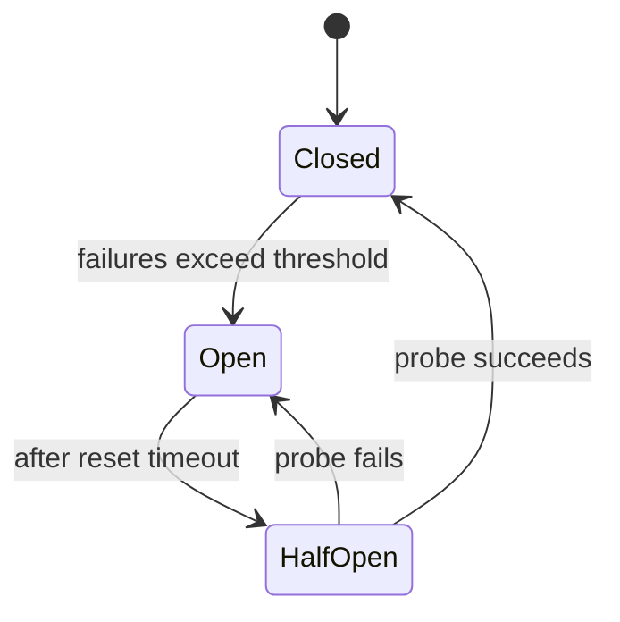

While open, calls fail immediately, giving the dependency room to recover and freeing your threads.
In half-open, let a small number of probe requests through.

```js
// runnable
class CircuitBreaker {
  constructor({ failureThreshold = 3, resetMs = 200 } = {}) {
    Object.assign(this, { failureThreshold, resetMs, state: 'CLOSED', failures: 0, openedAt: 0 });
  }
  async call(fn) {
    if (this.state === 'OPEN') {
      if (Date.now() - this.openedAt < this.resetMs) throw new Error('circuit open');
      this.state = 'HALF_OPEN';
    }
    try {
      const result = await fn();
      this.state = 'CLOSED';
      this.failures = 0;
      return result;
    } catch (e) {
      this.failures++;
      if (this.state === 'HALF_OPEN' || this.failures >= this.failureThreshold) {
        this.state = 'OPEN';
        this.openedAt = Date.now();
      }
      throw e;
    }
  }
}

(async () => {
  const cb = new CircuitBreaker();
  const boom = async () => { throw new Error('down'); };
  for (let i = 0; i < 5; i++) {
    await cb.call(boom).catch((e) => console.log(i, cb.state, e.message));
  }
  await new Promise((r) => setTimeout(r, 250));
  console.log('after reset', await cb.call(async () => 'recovered'), cb.state);
})();
```

A production version limits half-open probes to one at a time and tracks a failure rate over a window instead of a raw count.

### 10.4 Other Patterns

| Pattern | Purpose |
| --- | --- |
| **Bulkhead** | Separate thread or connection pools per dependency so one slow dependency cannot drain everything |
| **Load shedding** | When overloaded, reject low priority work early (return 503) to protect goodput |
| **Backpressure** | Signal upstream to slow down (bounded queues, credit-based flow control, HTTP 429) |
| **Graceful degradation** | Serve a reduced experience (cached data, no recommendations) instead of an error |
| **Hedged requests** | Send a duplicate after the p95 latency, use whichever answers first, to cut tail latency |
| **Health checks and outlier ejection** | Remove sick instances from rotation automatically |
| **Rate limiting and quotas** | Protect shared resources from any single caller |
| **Timeouts plus jitter on cron and caches** | Avoid synchronized spikes |

### 10.5 Metastable Failures

A system can get stuck in a bad state even after the trigger is gone.
Example: a brief slowdown makes clients time out and retry, the retries add load, the extra load keeps the system slow, and it never recovers.

Defenses: retry budgets, load shedding, circuit breakers, capacity headroom, and the ability to shut off retry sources and ramp traffic slowly.
The October 2025 AWS incident recovery (a backlog and congestive collapse while re-establishing state) is a real example, see [Reliability and Operations](/docs/system-design/hld/reliability-and-operations).

---

## 11. Event-Driven Architecture

| Concept | Idea | Use |
| --- | --- | --- |
| **Event notification** | "Something happened", small message, consumers fetch details | Loose coupling |
| **Event-carried state transfer** | Event contains the data consumers need | Fewer synchronous calls |
| **Event sourcing** | Store the sequence of events as the source of truth, derive state by replay | Audit, time travel, rebuilding views |
| **CQRS** | Separate write model from read models | Different scaling and shape for reads and writes |
| **CDC** (change data capture) | Stream the database log as events | Sync search, cache, analytics without dual writes |

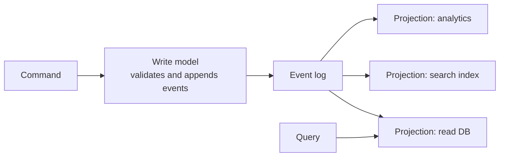

Costs of event sourcing and CQRS: eventual consistency between write and read sides, schema evolution of events, replay time (use snapshots), and more moving parts.
Use them where audit and replay are real requirements, not by default.

### 11.1 Stream Processing

- **Windows:** tumbling (fixed, no overlap), sliding (overlapping), session (gap based).
- **Event time vs processing time:** use event time, with **watermarks** to decide when a window is complete, and handle **late data** with allowed lateness or side outputs.
- **State:** stream processors (Flink, Kafka Streams) keep local state with checkpoints for recovery.
- **Batch vs stream:** Lambda architecture runs both and merges. Kappa uses only streaming and reprocesses by replaying the log. Modern stacks usually favor a single streaming path plus a lakehouse for history.

---

## 12. Multi-Region Design

Reasons: lower latency for global users, survive a regional outage, data residency.
Cost: complexity, consistency trade-offs, money.
For most products, **multi-AZ in one region plus tested backups and a DR plan** is the right starting point.

| Strategy | RTO | RPO | Cost | Notes |
| --- | --- | --- | --- | --- |
| **Backup and restore** | Hours | Hours | Lowest | Cold, restore into another region |
| **Pilot light** | Tens of minutes | Minutes | Low | Core data replicated, compute scaled to zero |
| **Warm standby** | Minutes | Seconds to minutes | Medium | Reduced-size copy always running |
| **Active-active** | Near zero | Near zero | Highest | Every region serves traffic |

RTO is how long you can be down.
RPO is how much data you can lose.

Active-active data options:

| Approach | How | Trade-off |
| --- | --- | --- |
| **Home region per user** | Each user has one write region, others read replicas | Simple, users far from home pay latency |
| **Multi-leader with conflict resolution** | Writes anywhere, merge later | LWW or CRDTs, possible anomalies |
| **Global consensus database** | Spanner, CockroachDB, DSQL | Strong consistency, cross-region commit latency |
| **Global tables** (DynamoDB, Cosmos DB) | Async multi-region replication | Eventually consistent across regions, LWW conflicts |

Other multi-region issues: DNS or anycast failover time, cache and queue replication, secrets and config replication, data residency laws (GDPR), and **testing failover regularly**, because an untested failover is a hope, not a plan.

---

## 13. Blast Radius: Cells and Shuffle Sharding

**Cell-based architecture:** split the system into many independent, identical cells, each serving a subset of customers.
A bad deploy or overload affects one cell, not everyone.
A thin routing layer maps a customer to a cell.

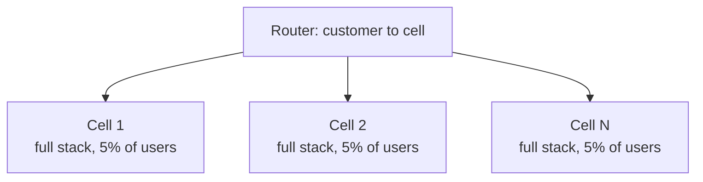

**Shuffle sharding:** assign each customer a small random subset of workers (say 2 of 8).
One noisy or poisonous customer can only hurt the workers in its subset, and it is unlikely that another customer shares the same subset.

Related principles:

- **Fail small:** roll out changes, including config and data files, gradually with health gates. Cloudflare's November 2025 incident (an oversized generated feature file crashed the proxy fleet) led to a public "fail small" resilience plan.
- **Static stability:** the data plane keeps working when the control plane is down, because it does not need to call it to serve requests.
- **Separate control and data planes.**
- **Limit shared dependencies**, since each one is a shared fate link.

---

## 14. Monolith or Microservices

| | Monolith (modular) | Microservices |
| --- | --- | --- |
| Deploy | One unit | Independent per service |
| Team scaling | Hard beyond dozens of engineers in one codebase | Teams own services |
| Complexity | In the code | In the network, operations, data consistency |
| Latency | In-process calls | Network calls, tail latency |
| Transactions | Local ACID | Sagas, eventual consistency |
| Debugging | Simple | Needs tracing and good observability |
| Good default for | Startups, small teams, unclear boundaries | Large orgs, clear domains, differing scaling needs |

Guidance:

- Start with a **modular monolith** with clear boundaries, split out a service when a boundary is stable and there is a real reason (scaling profile, team ownership, isolation, different tech).
- **Each service owns its data.** A shared database between services is a distributed monolith.
- Symptoms of a distributed monolith: services that must deploy together, chatty synchronous chains, shared tables.
- **Service discovery:** DNS, a registry (Consul, Eureka), or the platform (Kubernetes Services).
- Communicate synchronously for queries needing an immediate answer, asynchronously via events for everything else.

---

## 15. Advanced Questions

**Q1. Your primary fails and a replica is promoted. What can go wrong?**
Async replication can lose the last acknowledged writes.
The old primary may come back believing it is leader (split brain), so use epochs and fencing.
Clients with stale connections keep writing to the old node, and downstream caches and replicas may need resync.

**Q2. How do you generate a strictly ordered sequence across a cluster?**
A single sequencer (leader with a consensus-replicated counter), or a per-partition log offset.
Global total order is a scaling bottleneck, so ask whether per-key order is enough.

**Q3. How does Raft ensure committed entries are not lost?**
An entry is committed once a majority stores it, and a candidate needs a majority vote and an up-to-date log, so any new leader contains all committed entries.

**Q4. 2PC or saga for an order across payment, inventory and shipping?**
Saga with orchestration and idempotent compensations.
2PC across independent services couples availability and holds locks while waiting on a coordinator.

**Q5. How do you make "charge the card and record the order" reliable?**
Idempotency key on the charge, order in a `PENDING` state, transactional outbox for the events, a reconciliation job comparing the PSP and your ledger, and retries with backoff.

**Q6. Why can retries make an outage worse?**
They multiply load exactly when the system is weakest, and layered retries amplify.
Use a retry budget, backoff with jitter, circuit breakers, and shed load.

**Q7. What is the difference between a lock and a lease, and why fencing?**
A lease expires automatically, so a crashed holder cannot block others.
A paused holder can wake up after expiry and still act, so the resource must reject stale holders with a fencing token.

**Q8. How would you design for a regional outage?**
Multi-AZ as the baseline, cross-region replicated data at the RPO you need, a warm standby or active-active tier, health-checked DNS failover, runbooks, and regular game days.

**Q9. Explain write skew with an example and a fix.**
Two on-call doctors each check "at least one other is on call" and then both go off duty, so nobody is on call.
Fix with serializable isolation, a locking read on the shared rows, or a constraint or materialized conflict row that both transactions must update.

**Q10. When do CRDTs fit?**
Collaborative and offline-first data with concurrent edits where a deterministic merge is acceptable: counters, sets, text editing, presence.
Not for invariants needing coordination such as "balance never negative".

**Q11. How do you avoid a hot partition in Kafka or DynamoDB?**
Pick a higher cardinality key, add a salt suffix for hot keys and merge at read time, pre-split, use adaptive capacity, and cache reads.

**Q12. What is the difference between availability and durability?**
Availability is whether you can read and write right now.
Durability is whether acknowledged data survives failures.
A system can be down but durable.

**Q13. How do you keep a search index or cache consistent with the primary DB without dual writes?**
Write once to the DB, capture the change log (CDC or outbox), and update derived stores from it idempotently.
Include a rebuild path.

**Q14. What is backpressure and where do you apply it?**
A mechanism for slow consumers to make fast producers slow down instead of buffering without limit.
Apply at bounded queues, HTTP (429, 503 with Retry-After), stream protocols with credits, and in autoscaling signals.

**Q15. How do you reason about a design's failure modes in an interview?**
Walk the request path and ask for each component: what if it is slow, what if it is down, what if it returns wrong data, what if it is overloaded, and what does the user see.
Then add timeouts, retries, fallbacks, and monitoring where the answers are bad.

Next: [Reliability and Operations](/docs/system-design/hld/reliability-and-operations) turns these ideas into practice with real outages.
