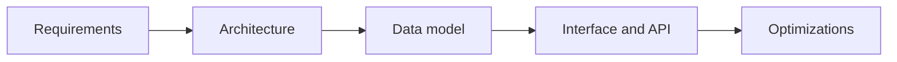
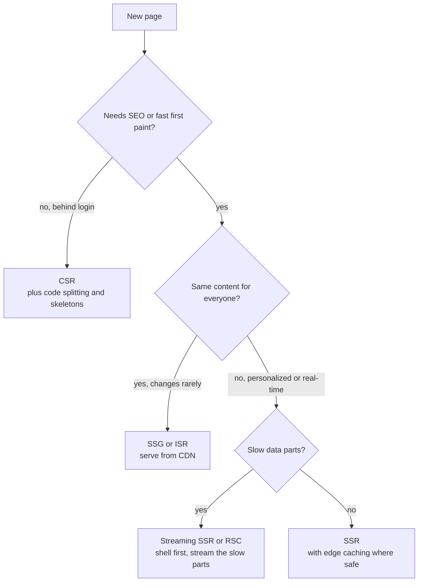
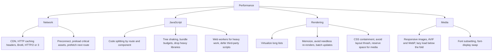
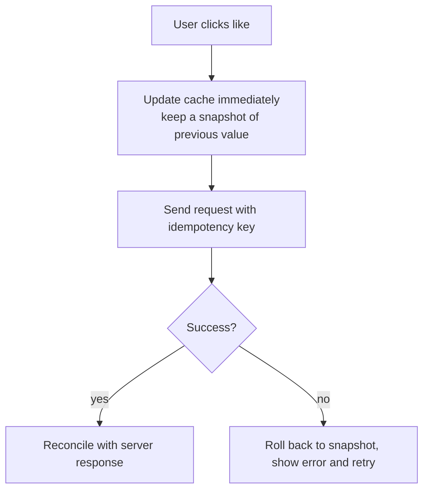
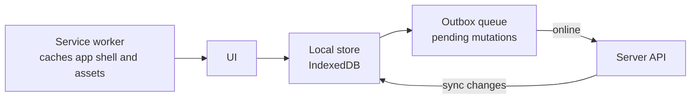
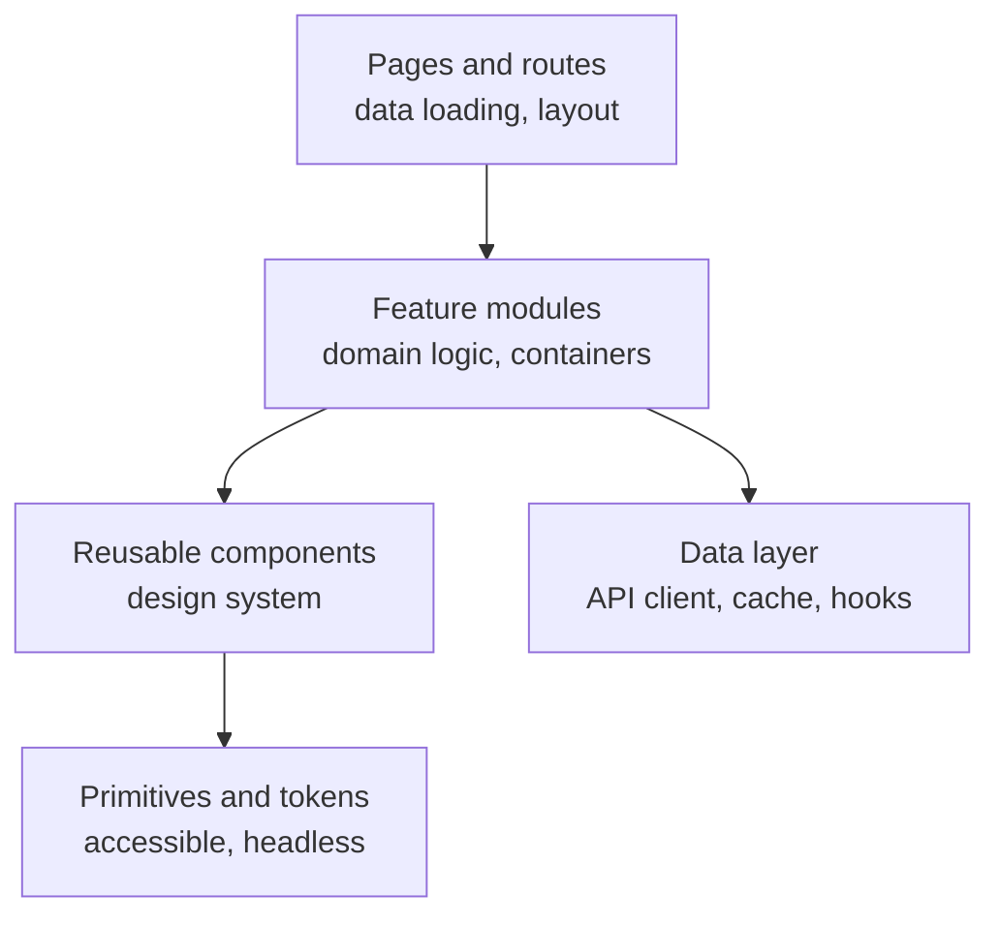
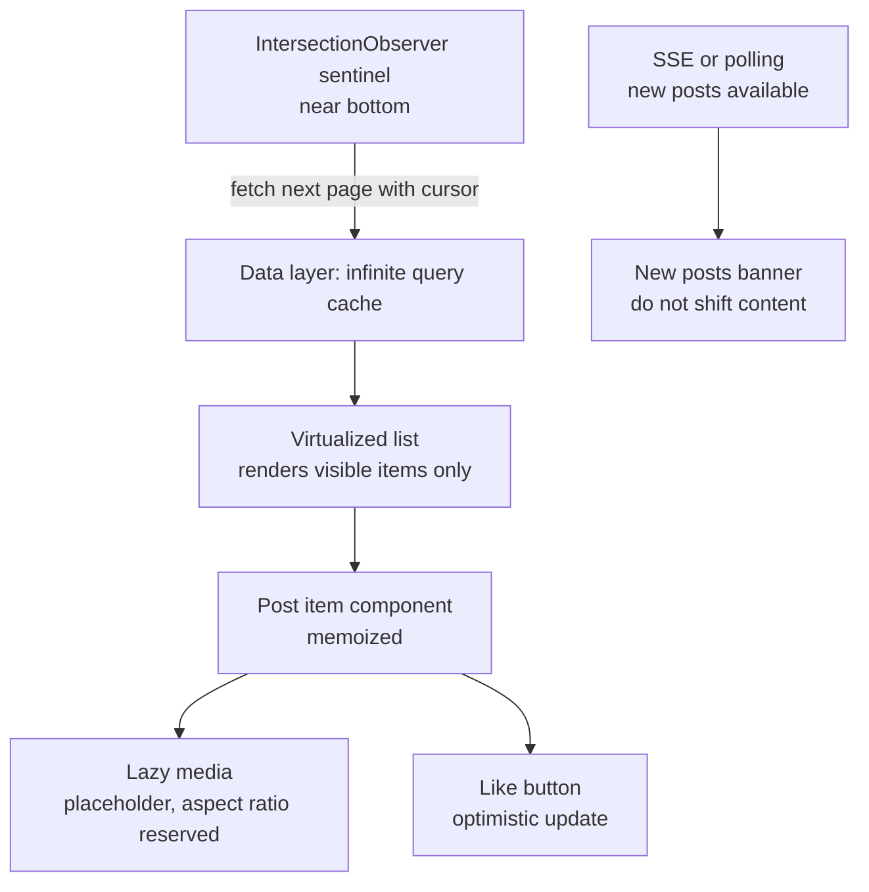
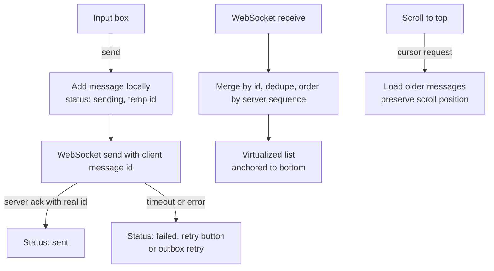

# 📘 Frontend System Design

Frontend system design asks you to design a client application or a UI component at scale: what renders where, how data flows, how it stays fast, and how it behaves on bad networks and slow devices.
The server side is usually a black box with an API you negotiate.
The interesting parts are rendering, state, performance, resilience and accessibility.

This page connects to your existing notes on [React](/docs/react), [Redux and RTK Query](/docs/redux), [JavaScript](/docs/javascript), and [Server-Driven UI](/docs/sdui).

## Table of Contents

1. [The RADIO Framework](#1-the-radio-framework)
2. [Rendering Strategies](#2-rendering-strategies)
3. [Performance and Core Web Vitals](#3-performance-and-core-web-vitals)
4. [Data Fetching and State](#4-data-fetching-and-state)
5. [Real-Time and Offline](#5-real-time-and-offline)
6. [Component and Application Architecture](#6-component-and-application-architecture)
7. [Micro-Frontends](#7-micro-frontends)
8. [Security](#8-security)
9. [Accessibility and Internationalization](#9-accessibility-and-internationalization)
10. [Observability and Release](#10-observability-and-release)
11. [Design: News Feed UI](#11-design-news-feed-ui)
12. [Design: Typeahead Component](#12-design-typeahead-component)
13. [Design: Chat UI](#13-design-chat-ui)
14. [Design: Real-Time Dashboard](#14-design-real-time-dashboard)
15. [Questions and Answers](#15-questions-and-answers)

---

## 1. The RADIO Framework

A structure for frontend interviews.

| Letter | Step | What you cover |
| --- | --- | --- |
| **R** | Requirements | Features, devices, browsers, offline, accessibility, i18n, SEO, scale of users and data |
| **A** | Architecture | Components, rendering strategy, state ownership, routing, data flow, module boundaries |
| **D** | Data model | Entities, normalized client store, what is server state vs UI state, cache shape |
| **I** | Interface (API) | Endpoints, pagination, error contract, real-time channel, component props and events |
| **O** | Optimizations | Performance, network, rendering, accessibility, security, observability |



Clarifying questions worth asking: which browsers and devices, is SEO needed (public pages) or is it behind login, expected data volume per screen, real-time needs, offline needs, and how the design system and analytics are provided.

---

## 2. Rendering Strategies

Where and when HTML is produced is the biggest architectural choice.

| Strategy | HTML produced | Good for | Watch out |
| --- | --- | --- | --- |
| **CSR** (client-side rendering) | In the browser after JS loads | Logged-in apps and dashboards | Slow first paint, SEO needs care, JS bundle cost |
| **SSR** (server-side rendering) | On the server per request | Personalized pages needing SEO and fast first paint | Server cost, TTFB, hydration cost |
| **SSG** (static generation) | At build time | Docs, marketing, blogs | Rebuilds for changes, not for personalized data |
| **ISR** (incremental static regeneration) | Static, regenerated in the background after a TTL or on demand | Catalogs, content that changes sometimes | Staleness window |
| **Streaming SSR** | Server flushes HTML in chunks with Suspense boundaries | Pages with slow data parts | Complexity, error handling per boundary |
| **React Server Components (RSC)** | Server components render on the server and send a serialized tree, client components hydrate | Less client JS, data access next to components | New mental model, boundary rules, caching semantics |
| **Islands** (Astro and similar) | Static HTML with small interactive islands | Content-heavy sites | Cross-island state |
| **Partial prerendering** | Static shell served instantly, dynamic holes streamed | Mixed static and dynamic pages | Framework-specific |



**Hydration** attaches event handlers to server-rendered HTML.
It costs CPU on the client, so ship less JavaScript: server components, selective or lazy hydration, and islands all attack this.

---

## 3. Performance and Core Web Vitals

### 3.1 The Metrics

Google's Core Web Vitals measure real user experience.

| Metric | Measures | Good threshold |
| --- | --- | --- |
| **LCP** (Largest Contentful Paint) | Loading: when the main content appears | 2.5 s or less |
| **INP** (Interaction to Next Paint) | Responsiveness of all interactions (replaced FID as a Core Web Vital in March 2024) | 200 ms or less |
| **CLS** (Cumulative Layout Shift) | Visual stability | 0.1 or less |

Also track TTFB, FCP, and long tasks (main thread blocked over 50 ms).
Measure at the 75th percentile of real user data (field data), and use lab tools (Lighthouse) to diagnose.

### 3.2 Techniques by Layer



| Problem | Fix |
| --- | --- |
| Slow LCP | Serve the LCP image from the CDN in an efficient format, preload it, give it high fetch priority, avoid lazy loading it, cut render-blocking CSS and JS, SSR or SSG the shell |
| Poor INP | Break up long tasks, yield to the main thread, debounce handlers, move work to a worker, reduce re-render scope, use transitions for non-urgent updates |
| Layout shift | Set width and height or aspect ratio on media, reserve space for ads and embeds, avoid inserting content above existing content, load fonts without layout jumps |
| Huge bundle | Analyze the bundle, split by route, lazy load below-the-fold widgets, replace heavy dependencies, budget in CI |
| Long lists | Windowing (render only visible rows, for example react-window or TanStack Virtual) |
| Repeat visits | Immutable hashed assets with `Cache-Control: max-age=31536000, immutable`, service worker for offline shell |
| Slow API | Cache and dedupe requests, prefetch on hover or route intent, paginate, request only needed fields |

Rule: measure first, fix the biggest bottleneck, verify with field data.

### 3.3 Caching Layers

Browser HTTP cache, service worker cache, CDN, client data cache (RTK Query, TanStack Query), in-memory memoization.
Use **content-hashed filenames** so assets can cache forever and deploys invalidate by changing the URL.
HTML should be short-lived or revalidated, so users get new asset URLs.

---

## 4. Data Fetching and State

### 4.1 Server State vs Client State

| | Server state | Client (UI) state |
| --- | --- | --- |
| Examples | User profile, posts, orders | Modal open, form draft, selected tab |
| Owner | The server, the client holds a cache | The client |
| Needs | Caching, invalidation, dedupe, retries, refetch, background sync | Simple local state |
| Tools | RTK Query, TanStack Query, SWR, Apollo | `useState`, `useReducer`, context, Zustand, Redux slices |

Mixing the two in one global store is a common source of bugs.
Use a server-state library for remote data and keep the UI store small.
See [RTK Query](/docs/redux/rtk-rq) for cache tags, invalidation and optimistic updates.

### 4.2 Fetching Patterns

- **Stale-while-revalidate:** show cached data immediately, refetch in the background, update on change.
- **Request deduplication:** two components asking for the same key share one request.
- **Cancellation:** abort outdated requests (search box) with `AbortController`.
- **Prefetching:** on hover, on route intent, or predicted next page.
- **Parallel vs waterfall:** start independent requests together. Waterfalls (fetch A, then B inside A's render) add latency. Hoist data needs to the route level.
- **Retries:** with backoff for idempotent requests, show inline retry UI.
- **Pagination:** prefer **cursor pagination** for feeds. Offset breaks when data shifts between pages. Support infinite scroll with an intersection observer sentinel.
- **Normalization:** store entities by id and reference them, so an update in one place updates all views.

### 4.3 Optimistic Updates

Update the UI immediately, send the request, and roll back on failure.



Use for low-risk, high-success actions (likes, toggles, reordering).
Avoid for payments and destructive actions, where you should wait for confirmation.

### 4.4 State Placement Checklist

1. Can it be derived from other state? Then compute it.
2. Is it used only by one component? Local state.
3. Shared by a subtree? Lift up or context.
4. Remote data? Server-state cache.
5. Must survive reloads or share across tabs? URL, localStorage, IndexedDB.
6. Truly app-wide UI state? A small global store.

The URL is state too: filters, page, sort and selected item belong in the URL so links and back button work.

---

## 5. Real-Time and Offline

### 5.1 Choosing a Transport

| Need | Use |
| --- | --- |
| Rare updates | Polling with backoff, or refetch on focus |
| Server to client stream (notifications, live scores, LLM tokens) | **SSE** (auto reconnect, works over HTTP) |
| Two-way, low latency (chat, games, collaboration) | **WebSocket** |
| Device offline or app closed | Push notifications |

Client-side concerns:

- **Reconnect** with exponential backoff and jitter, and **resume** from the last event id so no updates are missed.
- **Heartbeats** to detect dead connections.
- **Ordering and dedupe** by sequence number or id.
- **Backpressure:** batch and throttle UI updates (for example apply messages once per animation frame) so a burst does not freeze the page.
- **Multi-tab:** share one connection using `BroadcastChannel` or a `SharedWorker`.

### 5.2 Offline-First



- **Service worker** caches the app shell and static assets (cache-first) and API GETs (stale-while-revalidate).
- **IndexedDB** stores data. The UI reads from local storage, the network syncs behind it.
- **Outbox of mutations** replays when online with idempotency keys.
- **Conflict resolution:** last write wins, per-field merge, or CRDTs for collaborative data.
- Show sync status (saved, saving, offline, failed) clearly.

---

## 6. Component and Application Architecture

### 6.1 Layers



- **Design system:** tokens (color, spacing, type), primitives, and documented components with accessibility built in. One source of truth across apps.
- **Composition over configuration:** small components composed by children and slots beat components with 30 props.
- **Headless components:** logic and accessibility without styles (Radix, React Aria, Headless UI) so teams can theme freely.
- **Colocation:** keep component, styles, tests and hooks together, group by feature not by file type.
- **Error boundaries:** contain failures to a widget, show a fallback, report the error.
- **Suspense and skeletons:** structure loading states so layout does not jump.
- **Monorepo:** shared packages for design system, API client, config, with a build cache (Turborepo, Nx).
- **Feature flags:** decouple deploy from release, enable gradual rollout and experiments.

### 6.2 API Design From the Frontend

- Return exactly what a screen needs, or use a **BFF** or GraphQL to aggregate.
- Consistent error contract: HTTP status, machine-readable code, human message, field errors for forms.
- Cursor pagination with `nextCursor`, ETags for conditional requests.
- Server-driven UI is the extreme case: the server sends the component tree and the client renders it from a registry. Trade-offs and versioning are covered in [Server-Driven UI](/docs/sdui).

---

## 7. Micro-Frontends

Split a large frontend into independently built and deployed pieces owned by different teams.

| Approach | How | Notes |
| --- | --- | --- |
| **Build-time packages** | Teams publish npm packages, one app composes them | Simple, deploy coupling |
| **Module Federation** | Runtime loading of remote modules from other builds | Independent deploys, shared dependency versions are tricky |
| **iframes** | Each piece in an iframe | Strong isolation, poor UX for routing, sizing, a11y |
| **Web Components** | Custom elements as boundaries | Framework agnostic, styling and SSR caveats |
| **Edge or server composition** | Server stitches fragments | Good for SEO, infra needed |

Use when many teams must ship independently in one product.
Costs: duplicate dependencies and larger bundles, inconsistent UX, cross-app state and routing, harder testing and performance.
For fewer than several teams, a well-structured monorepo is usually better.

---

## 8. Security

| Threat | Defense |
| --- | --- |
| **XSS** (injected script) | Escape output (frameworks do by default, avoid `dangerouslySetInnerHTML`), sanitize any user HTML, strict **Content Security Policy**, Trusted Types |
| **CSRF** | `SameSite` cookies (Lax or Strict), anti-CSRF tokens for cookie-authenticated mutations, check `Origin` |
| **Token theft** | Prefer `HttpOnly; Secure; SameSite` cookies for session tokens over `localStorage`. Short-lived access tokens, refresh rotation |
| **Clickjacking** | `frame-ancestors` in CSP or `X-Frame-Options` |
| **CORS misconfig** | Allow specific origins, never reflect arbitrary origins with credentials |
| **Supply chain** | Lock dependencies, audit, subresource integrity for third-party scripts, minimize third-party JS |
| **Sensitive data** | Do not put secrets in the bundle, avoid PII in URLs and logs, clear on logout |
| **Open redirects** | Validate redirect targets |

---

## 9. Accessibility and Internationalization

**Accessibility (a11y)**

- Use semantic HTML (`button`, `nav`, `main`, headings, labels) before ARIA.
- Everything operable by keyboard, visible focus, logical tab order, no keyboard traps.
- Manage focus on route changes and in modals and menus. Announce dynamic changes with live regions.
- Sufficient color contrast (WCAG AA), do not rely on color alone, respect `prefers-reduced-motion`.
- Text alternatives for images, captions for video, accessible names for controls.
- Test with a screen reader and keyboard, plus automated checks (axe).

**Internationalization (i18n)**

- Externalize strings, use ICU message format for plurals and gender.
- Format dates, numbers and currency with `Intl`.
- Support right-to-left layouts with logical CSS properties (`margin-inline-start`).
- Expect text expansion (German is longer), avoid fixed widths.
- Load locale bundles on demand.

---

## 10. Observability and Release

- **Real user monitoring (RUM):** Core Web Vitals, route timings, resource timing, from real devices at p75 and p95.
- **Error tracking:** capture exceptions and unhandled rejections with source maps, release version, user and route context, sample and deduplicate.
- **Analytics:** events with a schema and versioning, batched, respecting consent.
- **Logging network failures** and slow requests with correlation ids that match backend traces.
- **Release:** feature flags, canary by percentage, automatic rollback on error or vitals regression, source maps uploaded privately.
- **Testing:** unit and component tests, contract tests against the API, end-to-end tests on critical flows, visual regression, performance budgets in CI.

---

## 11. Design: News Feed UI

**Requirements:** infinite scroll of posts with text, images and video, like and comment, smooth on low-end phones, new posts banner.



Key decisions:

- **Cursor pagination** with page size around 10 to 20, prefetch the next page before the sentinel is reached.
- **Virtualization** keeps DOM size constant, needs stable item heights or measured heights (dynamic size measurement, reserve space for images with aspect ratio).
- **Media:** lazy load images and video, autoplay muted only when in view (IntersectionObserver), pause when out of view, use responsive sources and blur-up placeholders.
- **Optimistic like** with rollback and idempotent request.
- **New posts:** show a "new posts" button, never insert above the scroll position.
- **Scroll restoration:** keep the list cache and scroll offset when navigating to a post and back.
- **Skeletons** for first load, an error item with retry for failed pages.
- **Performance:** memoize items, avoid inline object props, batch state updates, use `content-visibility` for offscreen sections.
- **Accessibility:** a `feed` landmark, keyboard navigation between posts, announce loaded items, an option to load more with a button for screen reader users.

---

## 12. Design: Typeahead Component

**Requirements:** a search box with suggestions, keyboard navigation, fast, accessible, reusable.

Server side design is in [Classic Designs](/docs/system-design/hld/classic-designs).
Client side:

- **Debounce** input (100 to 300 ms) and start after 1 to 2 characters.
- **Cancel** stale requests so old responses cannot overwrite newer ones (race conditions).
- **Cache** results per prefix in memory, optionally persist recents.
- **Keyboard:** arrow keys move, Enter selects, Escape closes, Home and End.
- **ARIA combobox pattern:** `role="combobox"` on the input, `aria-expanded`, `aria-controls` the listbox, `aria-activedescendant` for the highlighted option, live region announcing the result count.
- **Highlight** the matching part, escape user input before highlighting (XSS).
- **States:** loading, empty, error, offline.
- **Controlled and uncontrolled APIs, async data source abstraction, custom render for options.**

```js
// runnable
function debounce(fn, ms) {
  let t;
  return (...args) => {
    clearTimeout(t);
    t = setTimeout(() => fn(...args), ms);
  };
}

function createTypeahead(fetchSuggestions, onResult) {
  let controller = null;
  const cache = new Map();
  return debounce(async (query) => {
    if (cache.has(query)) return onResult(query, cache.get(query));
    controller?.abort();                       // cancel the stale request
    controller = new AbortController();
    try {
      const data = await fetchSuggestions(query, controller.signal);
      cache.set(query, data);
      onResult(query, data);
    } catch (e) {
      if (e.name !== 'AbortError') throw e;
    }
  }, 50);
}

// fake network: shorter queries answer slower, to provoke out-of-order responses
const fakeFetch = (q, signal) => new Promise((resolve, reject) => {
  const id = setTimeout(() => resolve([`${q} result`]), 200 - q.length * 40);
  signal.addEventListener('abort', () => {
    clearTimeout(id);
    reject(Object.assign(new Error('aborted'), { name: 'AbortError' }));
  });
});

const type = createTypeahead(fakeFetch, (q, r) => console.log('render', q, r));
type('a');
setTimeout(() => type('ab'), 70);
setTimeout(() => type('abc'), 140);   // only "abc" should render
```

---

## 13. Design: Chat UI

**Requirements:** message list, send with instant feedback, real-time incoming messages, typing indicator, unread counts, history pagination, works on flaky networks.



Key decisions:

- **Client-generated message ids** for optimistic send and dedupe, server assigns the canonical order.
- **Reconnect and resume:** on reconnect fetch messages after the last known sequence to fill gaps.
- **Scroll behavior:** stay pinned to the bottom for new messages only if the user is already at the bottom, otherwise show a "new messages" pill. When prepending history, keep the visible message stable (adjust scroll offset).
- **Virtualization** for long threads, with variable heights and reverse-anchored scrolling.
- **Typing indicator and presence:** ephemeral, throttled, expire on timeout.
- **Unread counts and read receipts:** derived from last-read pointer per conversation, updated when the message enters the viewport while the tab is focused.
- **Multi-tab:** one shared connection, sync state with `BroadcastChannel`.
- **Rich content:** sanitize message HTML or use a safe renderer, link previews fetched by the server.
- **Offline:** outbox in IndexedDB, retry on reconnect with idempotency by client id.

---

## 14. Design: Real-Time Dashboard

**Requirements:** many charts and tables updating live, hundreds of updates per second, stays responsive.

- **Transport:** WebSocket or SSE with server-side aggregation. Send deltas, not full snapshots. Subscribe only to the widgets on screen.
- **Update batching:** collect incoming messages in a buffer and flush to state once per animation frame or per 250 to 1000 ms. Humans cannot read 100 updates per second, so render at a human rate.
- **Data structure:** keep a bounded ring buffer per series (last N points), downsample for display (for example largest-triangle-three-buckets).
- **Rendering:** canvas or WebGL for dense charts, SVG for small ones. Avoid re-rendering the whole tree, isolate each widget with its own subscription.
- **Heavy work in a Web Worker** (parsing, aggregation), and transfer data with transferable objects.
- **Backpressure:** if the client falls behind, drop intermediate frames and keep the latest.
- **Resilience:** show data staleness, last updated time, connection state, and gracefully degrade to polling.
- **Layout persistence:** save user dashboards server side, restore quickly.
- **Time:** display in the user's time zone, keep timestamps as UTC internally.

---

## 15. Questions and Answers

**Q1. CSR, SSR or SSG for an e-commerce product page?**
SSG or ISR for catalog pages so the CDN serves them, SSR or streaming for personalized parts (price, stock, recommendations), and client fetch for cart and account.
The reason is SEO plus fast LCP plus freshness where it matters.

**Q2. How would you reduce a 2 MB JavaScript bundle?**
Analyze it, split by route, lazy load below-the-fold and rare widgets, replace or drop heavy libraries, tree shake, defer third-party scripts, and enforce a budget in CI.

**Q3. How do you avoid layout shift?**
Reserve space (dimensions or aspect ratio) for images, embeds and ads, do not inject content above visible content, load fonts with a matching fallback metrics strategy.

**Q4. INP is high. What do you do?**
Profile long tasks, split or defer work, debounce or throttle handlers, reduce re-render scope, move computation to a worker, use transitions for non-urgent updates, and check third-party scripts.

**Q5. How do you handle race conditions in fetching?**
Cancel stale requests with `AbortController`, ignore responses that do not match the latest request id, or use a query library that keys results and handles this.

**Q6. Where should you store the auth token?**
Prefer an `HttpOnly`, `Secure`, `SameSite` cookie so scripts cannot read it, with CSRF protection.
`localStorage` is readable by any injected script, so an XSS bug exposes it.

**Q7. How do you make optimistic updates safe?**
Snapshot previous state, apply the change, send with an idempotency key, roll back on failure, reconcile with the server response, and avoid it for irreversible actions.

**Q8. Design infinite scroll with 100,000 items.**
Cursor pagination, an intersection observer to fetch, and a virtualized list so the DOM stays small.
Reserve item heights, preserve scroll on navigation, and cap what you keep in memory.

**Q9. Micro-frontends: yes or no?**
Only when many teams need independent deploys and the cost of shared-dependency and UX inconsistency is acceptable.
Otherwise a modular monolith frontend in a monorepo is simpler and faster.

**Q10. How do you keep a real-time UI from freezing under load?**
Batch updates to a frame or a fixed interval, keep bounded buffers, downsample for display, render only visible widgets, and offload work to a worker.

**Q11. What is hydration and why is it a problem?**
It attaches event handlers and state to server-rendered HTML by re-running components in the browser.
On big pages it costs main-thread time and delays interactivity, so reduce JS with server components, islands, lazy or selective hydration.

**Q12. How would you test and release a frontend safely?**
Unit and component tests, contract tests, end-to-end on critical paths, visual regression, performance budgets, then feature flags, a canary rollout and automatic rollback on error rate or vitals regression.

Next: [Reliability and Operations](/docs/system-design/hld/reliability-and-operations).
