# 📘 Large-Scale HLD Designs

These designs combine the building blocks and the distributed-systems ideas from earlier pages.
Each one has a hard core: a fan-out trade-off, ordering, contention, geo indexing, exactly-once effects.
Learn the core, and the rest of the design follows.

Each section gives requirements, key numbers, a diagram, the deep dive, and trade-offs.
Assumptions are stated so you can change them.

## Table of Contents

1. [News Feed](#1-news-feed)
2. [Chat System](#2-chat-system)
3. [Video Streaming](#3-video-streaming)
4. [Ride Hailing and Proximity Search](#4-ride-hailing-and-proximity-search)
5. [File Sync and Storage](#5-file-sync-and-storage)
6. [Ticket Booking](#6-ticket-booking)
7. [Payment System](#7-payment-system)
8. [Ad Click Aggregation](#8-ad-click-aggregation)
9. [Distributed Job Scheduler](#9-distributed-job-scheduler)
10. [Leaderboard and Top-K](#10-leaderboard-and-top-k)
11. [Collaborative Editing](#11-collaborative-editing)
12. [Monitoring and Metrics System](#12-monitoring-and-metrics-system)
13. [Pattern Map](#13-pattern-map)

---

## 1. News Feed

Design the home timeline of a social network: posts from people you follow, ranked, fast.

### 1.1 Requirements and Numbers

- Post text and media, follow users, view a home feed, infinite scroll.
- Feed load under 500 ms, eventual consistency is fine (a post may show a few seconds late).
- Assume 200M DAU, 10 feed opens per user per day, 100 average followers, 5% of users post daily.

```text
Feed reads  = 200M x 10 = 2B per day = about 23,000 QPS average, 70,000 peak
Posts       = 200M x 5% x ~2 = about 20M per day = about 230 QPS
Read to write is about 100 : 1, so optimize for reads
```

### 1.2 Fan-out Strategies

| Strategy | On post | On feed read | Pros | Cons |
| --- | --- | --- | --- | --- |
| **Fan-out on write (push)** | Insert post id into every follower's feed cache | Read one precomputed list | Very fast reads | Huge write amplification for celebrities, wasted for inactive users |
| **Fan-out on read (pull)** | Store post once | Fetch recent posts of everyone you follow and merge | Cheap writes, always fresh | Slow reads, expensive for users following many accounts |
| **Hybrid** | Push for normal users, skip celebrities | Merge precomputed list with celebrity posts fetched live | Balanced | More logic |

Use the **hybrid**: push for accounts under a follower threshold (for example 100,000), pull for celebrities at read time, and only push to recently active followers.

### 1.3 Architecture

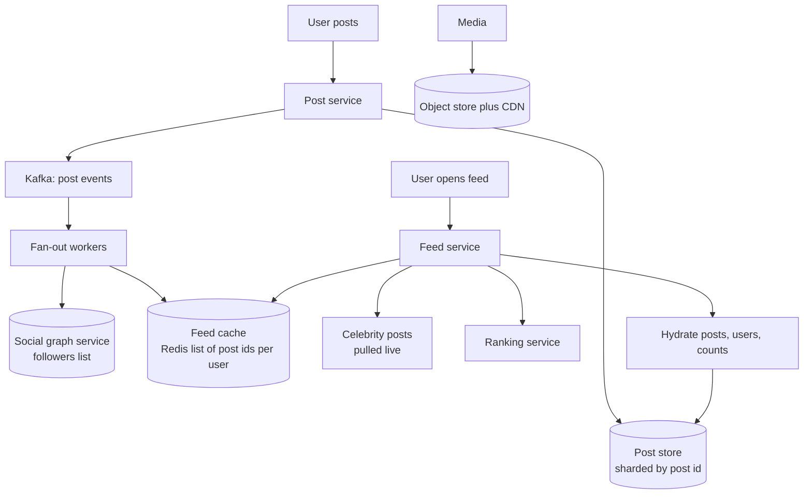

### 1.4 Deep Dive

- **Feed cache:** per user, a capped list of post ids (say the latest 800), not full posts. Full objects are hydrated from a post cache or store. Ids are tiny, so the cache stays cheap.
- **Ranking:** chronological is simple. Ranked feeds use candidate generation (recent posts, follows, recommendations), a lightweight model to score, filters (blocked, seen, policy), then diversification. Keep this a separate service with a time budget and a chronological fallback.
- **Pagination:** cursor based on post id or score, never offsets, because the feed changes between requests.
- **Counters (likes, views):** approximate, aggregate asynchronously, cache heavily. Do not update a row per like.
- **Social graph:** follower and following lists in a graph-shaped store or sharded tables, cached, with separate indexes for both directions.
- **Deletes and edits:** mark posts deleted and filter at hydrate time, since removing ids from millions of feed lists is too costly.
- **Cold users:** users who have not opened the app in weeks get their feed built on demand, not pushed to.
- **Media:** upload direct to object storage, transcode asynchronously, serve from a CDN.

### 1.5 Trade-offs

Freshness vs cost (push vs pull), personalization quality vs latency, and storage of precomputed feeds vs recompute.
The hard question interviewers ask: "What happens when a user with 50 million followers posts?" Answer: skip push, pull at read time, and rate-limit fan-out workers.

---

## 2. Chat System

Design WhatsApp or Messenger style chat: one-to-one and group, online and offline delivery, receipts, media.

### 2.1 Requirements and Numbers

- 1:1 and group chat (up to a few hundred members), text and media, delivered, read receipts, online presence, multi-device.
- Messages delivered in order per conversation and never lost.
- Assume 500M DAU, 40 messages per user per day.

```text
Messages = 500M x 40 = 20B per day = about 230,000 per second average
Message size about 100 bytes text -> 2 TB per day of text, plus media in object storage
Concurrent connections: hundreds of millions, so a large gateway fleet
```

### 2.2 Architecture

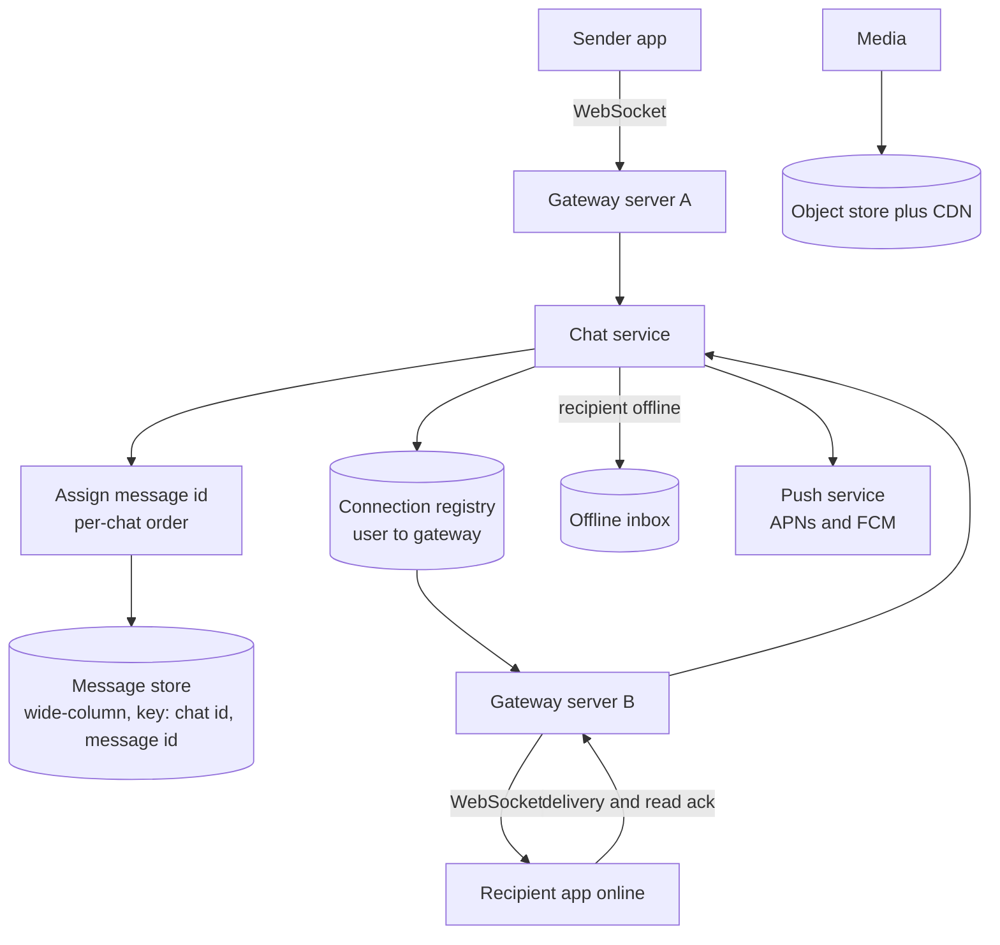

### 2.3 Message Flow

1. Sender's app sends the message over its WebSocket to a **gateway**.
2. The **chat service** assigns a monotonically increasing id (per conversation, or a time-ordered id like a Snowflake), persists the message, then acks "sent" to the sender.
3. It looks up the recipient's gateway in the **connection registry** (Redis, user id to gateway id, with a TTL refreshed by heartbeats).
4. Online: route to that gateway, push over the socket, wait for a delivery ack.
5. Offline: keep in the offline inbox and send a push notification. On reconnect the client syncs everything after its last known message id.
6. Read receipts flow back the same way, as small events.

### 2.4 Deep Dive

- **Ordering:** guarantee order within a conversation, not globally. Give each conversation a single ordering point (a partition owner) or a per-chat sequence number.
- **Reliability:** at-least-once delivery with client-side dedupe by message id. The client resends until it gets the server ack, the server dedupes by client-generated id.
- **Storage:** append-heavy, read by conversation and recency. A wide-column store keyed by `(chat_id, message_id)` fits (Cassandra, HBase, ScyllaDB). Keep recent messages hot.
- **Groups:** for small groups, fan out on write to each member's inbox. For very large groups or channels, publish to a pub/sub topic and let members pull, like the celebrity case in the feed.
- **Presence:** heartbeat every few seconds refreshes a key with a short TTL. Broadcasting presence changes to every contact is expensive, so fetch presence lazily when a chat is open.
- **Multi-device:** every device has its own connection and sync cursor.
- **End-to-end encryption:** with the Signal protocol the server stores and routes ciphertext and cannot read it. Keys are exchanged via prekeys, group messaging uses sender keys. This limits server-side features (search, moderation) and needs client-side backups.
- **Media:** upload to object storage first, send the message with a reference and thumbnail, download on demand.
- **Gateway scaling:** each server holds 100k or more idle connections. On a gateway crash clients reconnect (with backoff and jitter, to avoid a reconnect storm) and resync.

### 2.5 Trade-offs

WebSocket persistent connections give low latency but make the gateway tier stateful.
Global ordering is unnecessary and expensive.
Delivery guarantees rely on acks and client retries, not on the network.

---

## 3. Video Streaming

Design YouTube or Netflix: upload, process, stream to any device at the best quality the network allows.

### 3.1 Requirements and Numbers

- Upload videos, watch with fast start and few stalls on varying bandwidth, search and recommendations.
- Assume 1M uploads per day, average 5 minutes, 200M viewers per day.

```text
Raw upload about 300 MB each -> 300 TB per day ingest
Transcoded ladder (many resolutions and codecs) multiplies storage 3x to 5x
Streaming egress dominates: petabytes per day, so the CDN is the cost center
```

### 3.2 Upload and Processing

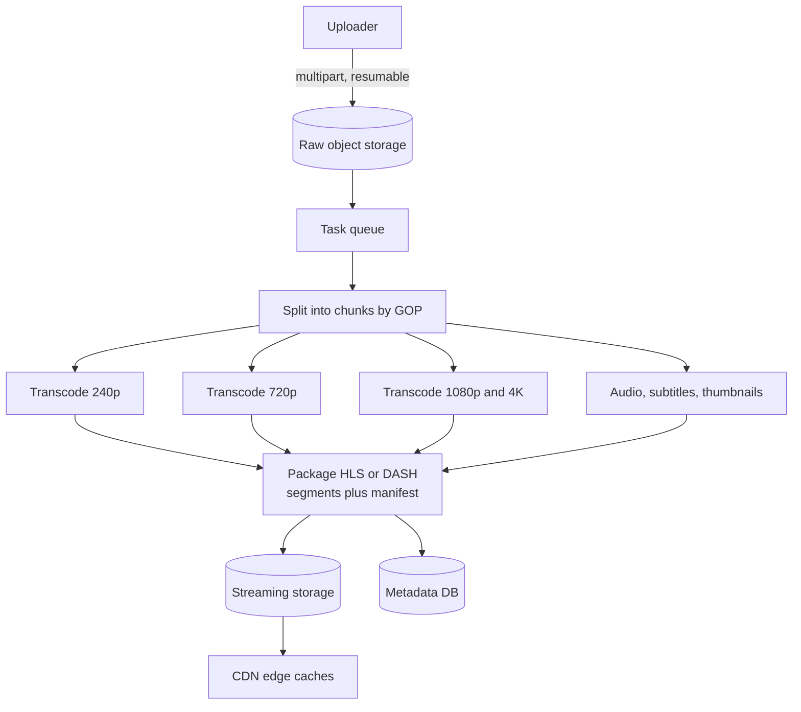

- Transcoding is a **DAG of parallel tasks** on a worker pool. Splitting the video into chunks and encoding them in parallel cuts latency from hours to minutes.
- Produce a **bitrate ladder**: multiple resolutions and bitrates, often multiple codecs (H.264 for compatibility, VP9 and AV1 for efficiency).
- Use per-title or per-shot encoding to save bits on simple content, a technique Netflix popularized.
- Add content moderation, copyright fingerprinting and thumbnails in the same pipeline.

### 3.3 Playback

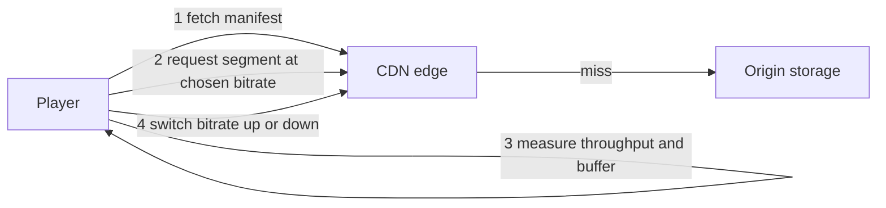

- **Adaptive bitrate (ABR):** video is cut into 2 to 10 second segments at every quality level. The player measures throughput and buffer health and picks the next segment's quality. Protocols: HLS and MPEG-DASH over plain HTTP, so the whole CDN machinery applies.
- **CDN strategy:** popular content is cached at edges, the long tail comes from regional caches or origin. Netflix places its own caching appliances (Open Connect) inside ISP networks and fills them with popular titles during off-peak hours.
- **Fast start:** start at a low quality, ramp up, prefetch the next segments.
- **Metadata and search:** titles, tags and permissions in a database, search in a search index.
- **Views and likes:** log events to Kafka, aggregate asynchronously, cache the counts.
- **Recommendations:** offline model training plus online candidate retrieval and ranking, a separate large system.
- **DRM and access control:** signed URLs or tokens, encrypted segments with license servers for premium content.

### 3.4 Trade-offs

Storage cost (more renditions) vs playback quality and compatibility.
CDN cost is the biggest lever, so cache hit ratio and peering matter more than app-server design.
Live streaming adds tight latency limits (low-latency HLS, WebRTC) and no time to pre-transcode.

---

## 4. Ride Hailing and Proximity Search

Design Uber or Lyft: riders request rides, the system matches nearby drivers, tracks the trip.

### 4.1 Requirements and Numbers

- Rider requests a trip, sees nearby drivers and an ETA, gets matched, tracks the driver live, pays.
- Drivers send location continuously, accept or reject offers.
- Assume 1M drivers online, location update every 4 seconds.

```text
Location writes = 1M / 4 s = 250,000 per second
Ride requests   = maybe 1,000 per second peak (much smaller, but latency sensitive)
Location data is ephemeral: keep only the latest position in memory
```

### 4.2 Geo Indexing

You need "drivers within 2 km of this point" fast.

| Method | Idea | Note |
| --- | --- | --- |
| **Geohash** | Encode lat and lon into a string, shared prefix means nearby | Simple, works in any KV or SQL, edge effects need neighbor cells |
| **Quadtree** | Recursively split space into four when a cell is crowded | Adapts to density, in-memory structure |
| **S2 or H3** | Hierarchical cells (S2 on a sphere, H3 hexagons from Uber) | Uniform neighbors, good for surge pricing and analytics |
| **Grid cells** | Fixed size grid, cell id to set of drivers | Simplest, uneven density |

Query: find the cell of the rider, read that cell and its neighbors, filter by exact distance, sort.

### 4.3 Architecture

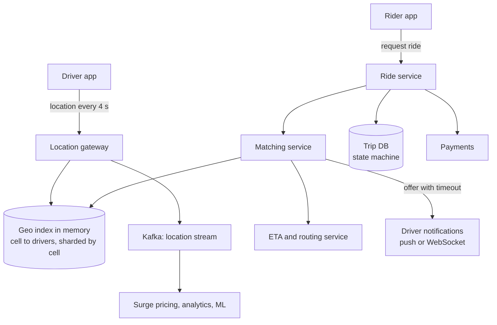

### 4.4 Deep Dive

- **Location store:** keep only the latest position per driver in an in-memory geo index (Redis GEO, or custom shards keyed by cell). History goes to Kafka and cold storage for analytics. At 250k writes per second this is why you do not write positions to a relational database.
- **Sharding by geography:** partition by region or cell, so a nearby-driver query touches one or a few shards.
- **Matching:** get candidates near the pickup, rank by ETA (road network distance, not straight line), offer to the best driver with a 10 to 15 second timeout, then the next. Batch matching over a short window across many riders gives better global assignments than greedy first come.
- **Consistency of assignment:** a driver must get at most one trip. Use an atomic compare-and-set on the driver's state (available to offered to assigned) in a single owner or store with conditional writes.
- **Trip state machine:** requested, matched, driver en route, arrived, in progress, completed, paid, with cancellation edges. Persist every transition and make handlers idempotent.
- **ETA and routing:** road graph with precomputed shortcuts (contraction hierarchies) plus live traffic from probe data. Cache ETAs by cell pairs for the list view.
- **Surge pricing:** compute demand and supply per cell over a sliding window and adjust price multipliers with smoothing.
- **Real-time updates to rider:** the driver's location is pushed over WebSocket or SSE, throttled and smoothed on the client.

### 4.5 Trade-offs

Location precision vs update cost, greedy vs batched matching, in-memory speed vs durability (location can be rebuilt from the next update, trips cannot).

---

## 5. File Sync and Storage

Design Dropbox or Google Drive: upload, sync across devices, share, version.

### 5.1 Requirements and Numbers

- Upload and download files (up to several GB), automatic sync across devices, sharing, version history, offline edits.
- Assume 500M users, 100M daily active, 15 GB average stored.

```text
Total logical data = 500M x 15 GB = 7.5 EB, so deduplication and tiering are essential
```

### 5.2 Architecture

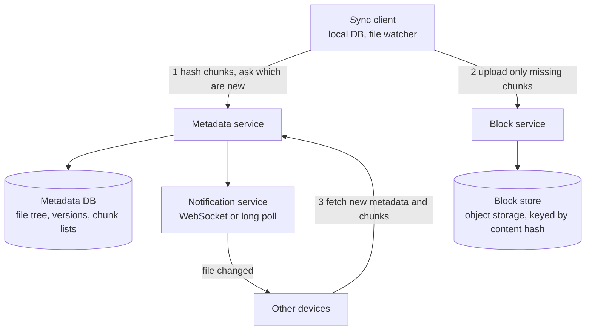

### 5.3 Deep Dive

- **Chunking:** split files into blocks (commonly around 4 MB), hash each (SHA-256), store blocks by hash. Content-defined chunking (rolling hash) keeps chunk boundaries stable when bytes are inserted, so an edit changes only nearby chunks.
- **Deduplication:** identical blocks are stored once across all users, subject to security considerations (cross-user dedupe leaks whether a file exists, so some systems dedupe per user or per account).
- **Delta sync:** only changed chunks travel, saving bandwidth on large files.
- **Metadata vs blocks:** metadata (tree, names, versions, permissions, chunk lists) lives in a strongly consistent database sharded by user or namespace. Blocks are immutable objects in cheap storage.
- **Sync protocol:** the client keeps a local database and a cursor. The server sends a notification, the client pulls changes after its cursor. Uploads are resumable per chunk.
- **Conflicts:** two devices edit the same file offline. Detect by version mismatch, keep both (a "conflicted copy") or merge if the type allows.
- **Sharing and permissions:** ACLs on folders, inherited, checked in the metadata service.
- **Versioning and trash:** a version is a new chunk list, old chunks remain until garbage collected (reference counting or mark and sweep).
- **Tiering:** hot to cold storage by access, erasure coding for durability at lower cost than triple replication.

### 5.4 Trade-offs

Strong consistency for metadata vs high availability for blocks.
Dedupe saves storage and adds hashing cost and privacy considerations.
Small chunks dedupe better and bloat metadata, large chunks the reverse.

---

## 6. Ticket Booking

Design BookMyShow or Ticketmaster: users pick seats, pay, and nobody gets double booked, even during a flash sale.

### 6.1 Requirements and Numbers

- Search events, view seat map, hold seats, pay, receive tickets. Strong correctness on inventory. Handle a sale where 1M users hit 50,000 seats.

The hard part is not average load, it is **contention on a few rows** and a **traffic spike**.

### 6.2 Booking Flow

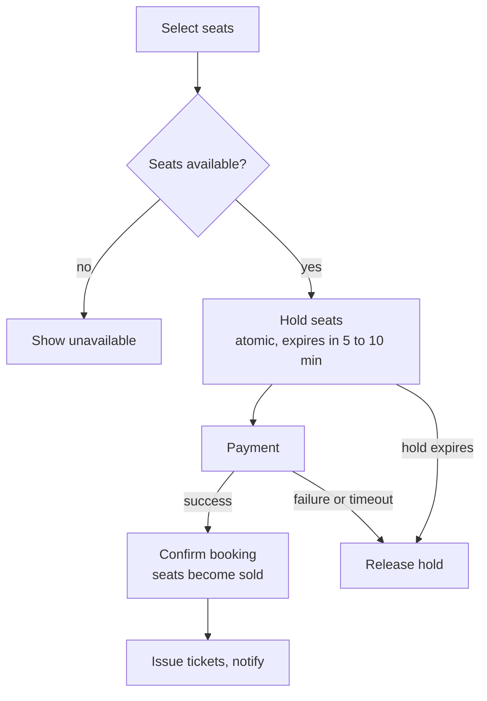

### 6.3 Deep Dive

- **Prevent double booking:** the source of truth is one strongly consistent database. Options:
  - Row-level state with **compare-and-set**: `UPDATE seats SET status='HELD', held_by=?, hold_expires_at=? WHERE seat_id=? AND (status='AVAILABLE' OR hold_expires_at < now())`. If 0 rows update, someone else won.
  - A unique constraint on `(event_id, seat_id)` in the confirmed bookings table as the last line of defense.
  - `SELECT ... FOR UPDATE SKIP LOCKED` for "give me any N free seats" flows.
- **Holds with TTL:** the hold must expire automatically. Store `hold_expires_at` and treat expired holds as available at read time, and sweep in the background. A Redis key with TTL can speed the hold check, but the database stays the truth.
- **Payment and idempotency:** the payment step uses an idempotency key. If payment succeeds but the confirm call fails, a reconciliation job reads the payment state and confirms or refunds.
- **Flash-sale load:** a **virtual waiting room**. Users get a queue position, and the system admits them at a rate the backend can handle. Rate limit per user, pre-scale, and serve the seat map from a cache (slightly stale is fine) while the hold call is authoritative.
- **Read path:** event and seat-map data is cacheable, heavy on CDN and edge caches. Only the hold and confirm calls need the strongly consistent path.
- **Bots:** CAPTCHA, device signals, per-account limits, purchase caps.
- **Fairness and UX:** show "someone else selected this" quickly and let users pick alternatives. Release holds on browser close where possible.

### 6.4 Trade-offs

Pessimistic locks are simple and can queue up under contention.
Optimistic CAS scales better with retries.
Hold duration balances user convenience against inventory locked by abandoners.

---

## 7. Payment System

Design the backend that takes a payment through a provider (PSP such as Stripe or Adyen), records it, and never double charges or loses money.

### 7.1 Requirements

- Charge a customer, support refunds, handle provider failures and webhooks, keep an auditable ledger, reconcile with the PSP.
- Correctness and auditability over speed. Availability still matters, but no incorrect state.
- Compliance: never handle raw card numbers if you can avoid it (PCI DSS). Use the PSP's hosted fields or tokenization.

### 7.2 Architecture

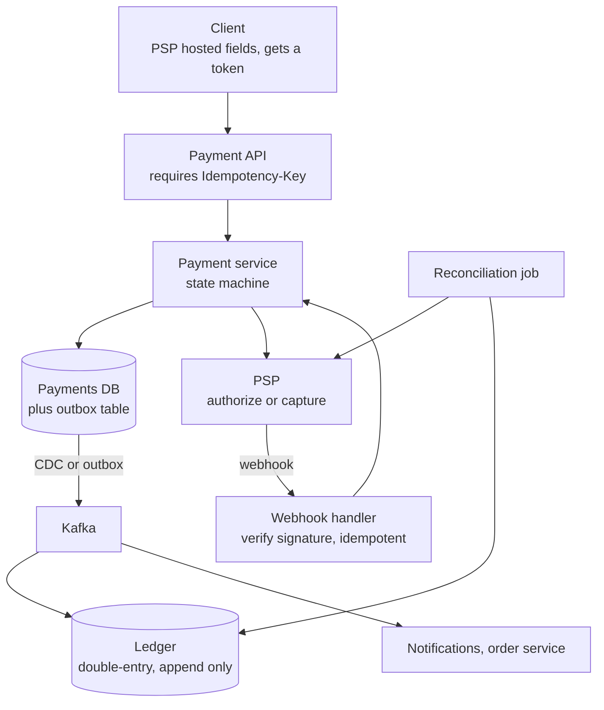

### 7.3 Deep Dive

- **State machine:** created, requires action, authorized, captured, settled, failed, refunded, chargeback. Only allowed transitions are accepted, each stored with a timestamp.
- **Idempotency:** the client sends an idempotency key per payment intent. The server stores the key with the result in the same transaction as the state change. Repeats return the stored result. Pass an idempotency key to the PSP too.
- **The unknown outcome:** the PSP call times out. Do not assume failure. Mark the payment `UNKNOWN`, then query the PSP (by your reference) or wait for the webhook, and resolve. Never blindly retry a charge without an idempotency key.
- **Webhooks:** verify the signature, respond fast, process asynchronously, and expect duplicates and out-of-order delivery. Make handlers idempotent and state-machine aware.
- **Double-entry ledger:** every movement is two entries, a debit and a credit, that sum to zero. Entries are immutable, corrections are new entries. Balances are derived or maintained and checked. Store money as integer minor units (cents) plus currency, never floats.
- **Consistency:** the payments DB is relational with strong transactions (serializable or careful row locking). Use the transactional outbox so state change and event are atomic, see [Distributed Systems](/docs/system-design/hld/distributed-systems).
- **Reconciliation:** a daily (or more frequent) job compares your records with the PSP's settlement reports and flags mismatches. This is the safety net for everything above.
- **Fraud and risk:** asynchronous scoring, rules, 3-D Secure challenges where required, velocity limits.
- **Retries and refunds:** retry with backoff for transient errors only. Refunds are separate operations with their own idempotency.

### 7.4 Trade-offs

Synchronous confirmation gives immediate user feedback and makes you depend on PSP latency.
Async flows with webhooks are more robust and need good state handling.
Building your own ledger costs effort and gives control, buying a ledger product speeds delivery.

---

## 8. Ad Click Aggregation

Count ad clicks in near real time and serve queries like "clicks per ad per minute for the last hour" and "top 100 ads".

### 8.1 Requirements and Numbers

- Ingest click events, aggregate per ad per minute, query by time range and filters, correct under duplicates and late data. The numbers must be accurate because they drive billing.

```text
1B clicks per day = about 12,000 per second average, 5x at peak = 60,000 per second
Event size about 100 bytes -> 100 GB per day raw
```

### 8.2 Architecture

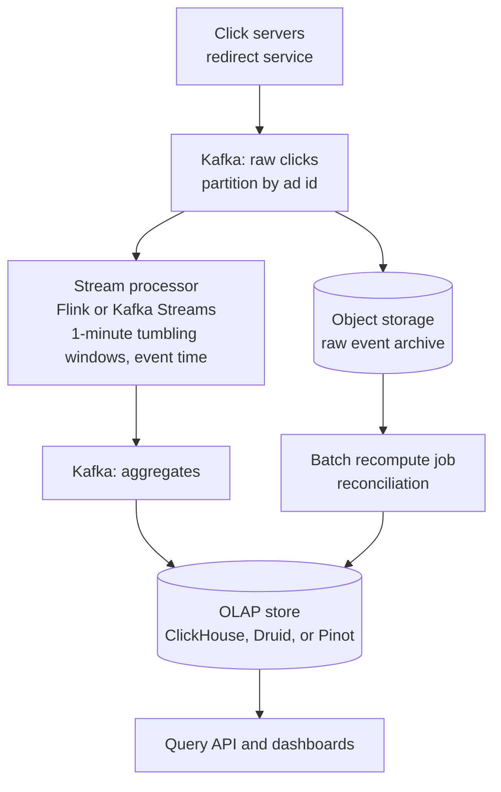

### 8.3 Deep Dive

- **Windows and time:** aggregate by **event time** with **watermarks**. A watermark says "no more events older than T are expected", so the window closes. Late events beyond the allowed lateness go to a correction path.
- **Exactly-once effect:** clicks carry a unique id. Dedupe inside the processor (state keyed by click id with TTL), use checkpointed state, and write to the sink idempotently (upsert by ad id and window). This yields effectively once results on top of at-least-once delivery.
- **Hot ads (skew):** one viral ad overloads one partition. Salt the key (`adId#0..N`), pre-aggregate partially, then merge.
- **Lambda-style reconciliation:** the raw log in object storage lets you recompute exact totals in batch and overwrite streaming results. Streaming gives speed, batch gives correctness.
- **Storage and queries:** an OLAP column store handles fast aggregations over time ranges. Keep fine-grained data (1 minute) for a few days, roll up to hourly and daily for older ranges.
- **Top-K:** maintain per-window counters, use a heap over counts, or approximate with count-min sketch plus a heap for very large cardinality.
- **Fraud and bots:** filter invalid traffic before billing aggregation, keep both raw and filtered counts.
- **Backfill and schema change:** replay from Kafka retention or from the archive.

### 8.4 Trade-offs

Latency vs completeness (how long to wait for late data), exact vs approximate counting (HyperLogLog for unique users), and cost of keeping raw data.

---

## 9. Distributed Job Scheduler

Run jobs at a scheduled time or on a cron schedule, across many workers, reliably.

### 9.1 Requirements and Numbers

- Submit one-time, delayed and recurring jobs. Run at (or shortly after) the scheduled time. Retry on failure. Scale to tens of millions of jobs per day. No job lost, duplicates tolerated (at-least-once).

```text
10M jobs per day = about 115 per second average, but schedules cluster at the top of the minute or hour
```

### 9.2 Architecture

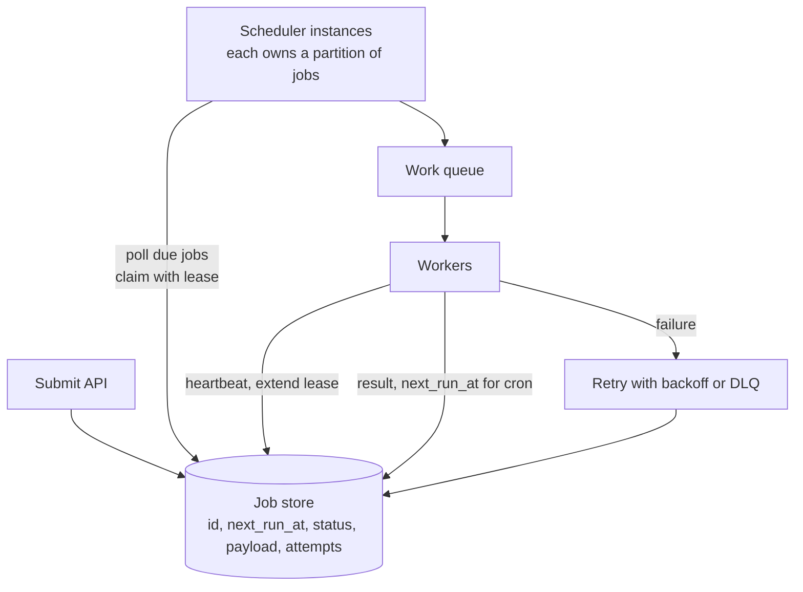

### 9.3 Deep Dive

- **Finding due jobs:** an index on `(status, next_run_at)`. The scheduler runs `SELECT ... WHERE status='PENDING' AND next_run_at <= now() ORDER BY next_run_at LIMIT n FOR UPDATE SKIP LOCKED`, marks them `RUNNING` with a lease expiry, and enqueues them. `SKIP LOCKED` lets many schedulers poll without blocking each other.
- **Scaling the store:** partition jobs by `hash(job_id)` or by time bucket. Each scheduler instance owns partitions, coordinated by leases or a consensus store.
- **Alternatives to polling:** Redis sorted set scored by run time (`ZRANGEBYSCORE`), a delay queue (SQS delay is limited to 15 minutes), a hierarchical timing wheel in memory for high volume, or a workflow engine (Temporal).
- **Leases and heartbeats:** a worker claims a job with a lease and heartbeats. If the lease expires, another worker takes over, so a crashed worker's job is retried. Because the first worker may still be alive (a pause), execution is **at-least-once**, and jobs must be idempotent. Fencing tokens protect side effects.
- **Retries:** exponential backoff with jitter, a max attempt count, then a dead-letter state.
- **Recurring jobs:** compute the next run time after each run (from the schedule, not from the completion time, to avoid drift) and insert the next occurrence. Beware of missed runs after downtime: choose to skip or catch up.
- **Thundering herd at :00:** add jitter to schedules where exact time is not needed, and spread load across partitions.
- **Priorities and fairness:** separate queues by priority, per-tenant concurrency limits.
- **Dependencies (DAGs):** a workflow layer that releases a job when its upstream jobs succeed (Airflow, Temporal).

### 9.4 Trade-offs

Polling is simple and adds latency of the poll interval, timing wheels and in-memory schedulers are faster and need recovery logic.
Exactly-once execution is not achievable, so design for idempotency.

---

## 10. Leaderboard and Top-K

Show the top players and any player's rank, in real time, for millions of users.

### 10.1 Requirements

- Update a score, get top 100, get my rank and neighbors, daily and weekly boards. Latency in milliseconds. 100M users, 5,000 updates per second.

### 10.2 Design

The natural tool is a Redis **sorted set**: members ordered by score, all operations O(log n).

```text
ZADD board:daily 2500 user:42          set or update a score
ZINCRBY board:daily 50 user:42         add points
ZREVRANGE board:daily 0 99 WITHSCORES  top 100
ZREVRANK board:daily user:42           my rank (0 based)
ZREVRANGE board:daily 40 60            players around a rank
```

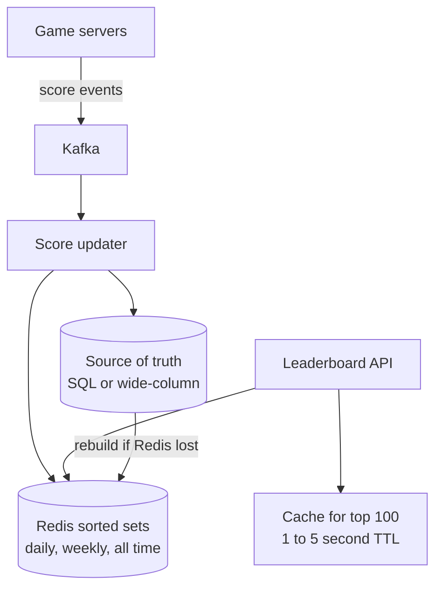

### 10.3 Deep Dive

- **Memory:** 100M members at roughly 50 to 100 bytes each is around 5 to 10 GB for one board, which fits in one large node but not with replicas, many boards, and headroom. Plan sharding.
- **Sharding:** for top-K, split users across shards by hash and merge each shard's top K at read time (K-way merge). For global rank, keep per-shard counts by score bucket and sum them, or use approximate ranks for users far down the list ("top 5%").
- **Ties:** encode the tiebreaker into the score, for example `score * 1e6 + (max_time - timestamp)` so earlier achievers rank higher, mind floating point precision.
- **Time windows:** separate keys per day and per week with TTLs, and roll over on schedule.
- **Durability:** the sorted set is a derived view. Keep the source of truth in a database and be able to rebuild.
- **Friends leaderboard:** intersect a user's friend set with the board (`ZINTERSTORE`, or fetch scores for the friend list, sort in memory, cap friend counts).
- **Hot read:** cache the top 100 for a second or two, since everyone asks for the same thing.

### 10.4 Trade-offs

Exact rank for everyone is expensive at the tail. Most products show exact rank for the top few thousand and approximate percentile beyond.

---

## 11. Collaborative Editing

Design Google Docs style real-time editing with multiple cursors, offline edits and history.

### 11.1 Requirements

- Several users edit one document at once, see each other's changes within a fraction of a second, converge to the same text, keep history, work offline, control permissions.

### 11.2 The Core Problem

Two users type at the same time in the same document.
Applying their operations in different orders on different replicas gives different text.
Two families of solutions:

| | Operational Transformation (OT) | CRDT (for example Yjs, Automerge) |
| --- | --- | --- |
| Idea | Transform concurrent operations against each other so they commute | Data structure whose merge is always convergent, ops carry unique ids |
| Server role | Central server orders operations | Optional, peers can sync directly |
| Offline | Harder | Natural |
| Complexity | Transformation functions are notoriously hard to get right | Simple merge, higher metadata overhead |
| Used by | Google Docs (classic), Etherpad | Figma-like and newer editors, Yjs-based tools |

### 11.3 Architecture

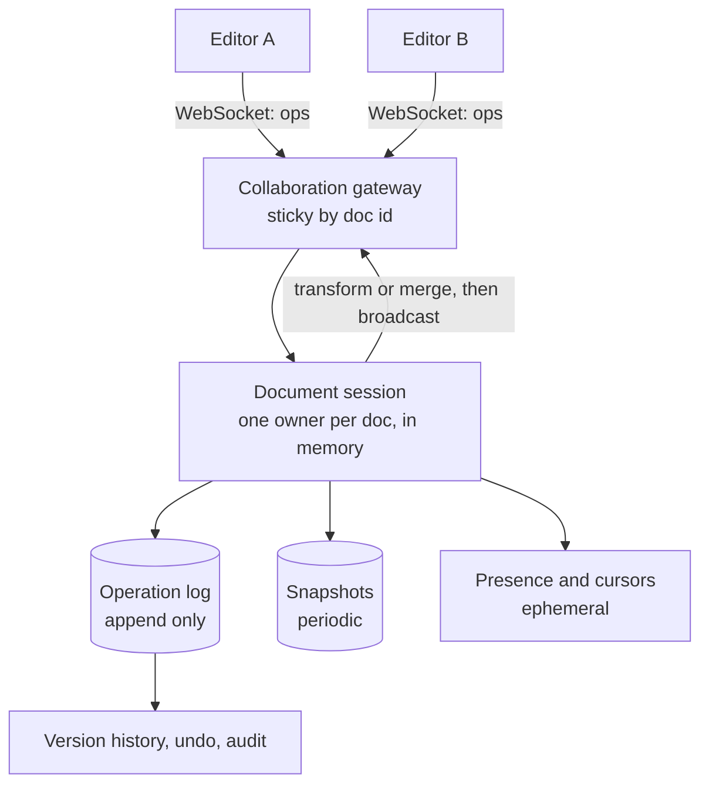

### 11.4 Deep Dive

- **Routing:** all editors of one document connect to the same session owner (route by `hash(doc_id)`), giving a single ordering point. If that server dies, reload the latest snapshot plus log tail on another.
- **Storage:** an append-only **operation log** plus periodic **snapshots** so loading does not replay the entire history.
- **Client model:** apply your own edits locally at once (optimistic), send them, and rebase over concurrent changes from the server. Acknowledgments tell the client which of its ops are confirmed.
- **Presence and cursors:** ephemeral, broadcast without persistence, throttled.
- **Offline:** queue local operations, merge on reconnect (natural with CRDTs, needs a rebase with OT).
- **Permissions:** view, comment, edit, checked on every connection and op.
- **Scale:** many documents, few editors each. Shard by document, and cap the number of concurrent editors on one document.
- **History:** every op is stored, so time travel and per-user attribution are possible.

### 11.5 Trade-offs

OT depends on a central server and complex transforms, CRDTs trade memory (tombstones and ids) for simplicity and offline support.
Garbage collection of CRDT metadata is a practical concern.

---

## 12. Monitoring and Metrics System

Design a platform like Prometheus, Datadog or an internal metrics system: collect, store, query and alert on time-series data.

### 12.1 Requirements and Numbers

- Collect metrics from thousands of hosts and services, dashboards, alert rules, retention of months to years.

```text
10M active series, one sample every 10 s = 1M samples per second
Compressed at roughly 1 to 2 bytes per sample = about 100 to 170 GB per day
```

Time-series compression (delta-of-delta on timestamps, XOR on values, popularized by Facebook's Gorilla) is why samples cost so little.

### 12.2 Architecture

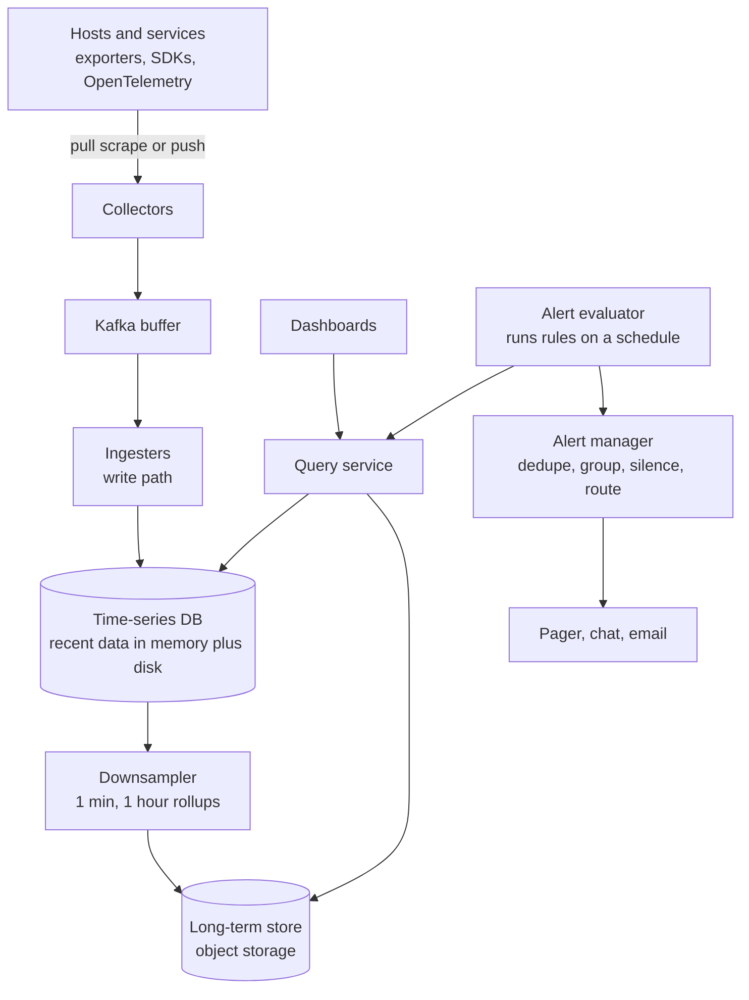

### 12.3 Deep Dive

- **Pull vs push:**

| | Pull (Prometheus style) | Push (StatsD, agents, OTLP) |
| --- | --- | --- |
| Discovery | Needs service discovery | Sources find the collector |
| Health signal | A failed scrape shows the target is down | Silence is ambiguous |
| Short-lived jobs | Needs a push gateway | Natural |
| Firewalls | Collector must reach targets | Only outbound from targets |

- **Data model:** a series is a metric name plus labels (`http_requests_total{service="api",status="500"}`), values are samples (timestamp, value).
- **Cardinality is the main scaling limit.** Every unique label combination is a new series. A label like `user_id` or `request_id` explodes the count and can take the system down. Enforce label policies and limits.
- **Storage:** write to memory and a write-ahead log, flush to compressed blocks, index labels with an inverted index, shard by series hash, replicate.
- **Downsampling and retention:** keep raw resolution briefly, roll up to coarser resolution for older data, drop or tier to object storage.
- **Queries:** aggregations over many series and time ranges, so use caching of recent results, pre-aggregated recording rules for expensive dashboard queries, and query sharding.
- **Alerting:** evaluate rules on a schedule, use a `for` duration to avoid flapping, deduplicate and group notifications, support silences and escalation. **The alerting path should not depend on the system it monitors.** Run a separate "watchdog" check that alerts if alerting itself stops.
- **Alert quality:** alert on symptoms (SLO burn rate, error rate, latency), not on every cause. See [Reliability and Operations](/docs/system-design/hld/reliability-and-operations).
- **Logs and traces:** different shapes (high volume text, request-scoped graphs), stored in systems built for them (Loki, Elasticsearch, Tempo, Jaeger) and correlated by trace id.

### 12.4 Trade-offs

Resolution vs cost, cardinality vs usefulness, push vs pull operational model, and building vs buying (observability is expensive to run at scale).

---

## 13. Pattern Map

| Design | Core problem | The pattern to remember |
| --- | --- | --- |
| News feed | Read-heavy fan-out | Hybrid push and pull, cache ids not objects |
| Chat | Low latency, ordering, offline | WebSocket gateways, connection registry, per-chat order, ack and retry |
| Video streaming | Bandwidth and processing | Chunked transcoding DAG, ABR, CDN |
| Ride hailing | Real-time geo lookup | Cell index in memory, batched matching, CAS on assignment |
| File sync | Big files, many devices | Content-addressed chunks, delta sync, metadata vs blocks |
| Ticket booking | Contention on inventory | Atomic hold with TTL, waiting room, DB as truth |
| Payment | Never double charge | Idempotency, state machine, ledger, reconciliation |
| Ad click aggregation | Accurate stream counts | Event-time windows, dedupe, batch reconciliation |
| Job scheduler | Reliable timed execution | Leases, SKIP LOCKED polling, idempotent at-least-once |
| Leaderboard | Fast ranking | Sorted set, shard and merge, approximate tail |
| Collaborative editing | Concurrent edits converge | OT or CRDT, single session owner, op log plus snapshots |
| Monitoring | High cardinality time series | Compression, downsampling, cardinality control |

Practice: pick any design, set a 30 minute timer, and present it out loud using the [seven-step framework](/docs/system-design/fundamentals).
Then check yourself with the question bank in the [Interview Playbook](/docs/system-design/interview-playbook).
