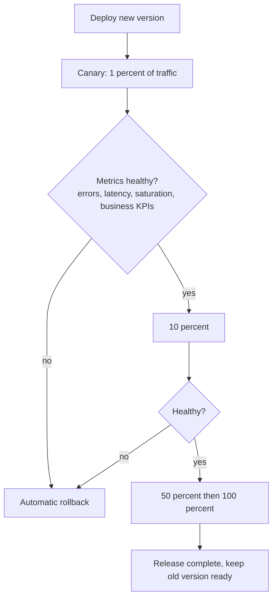
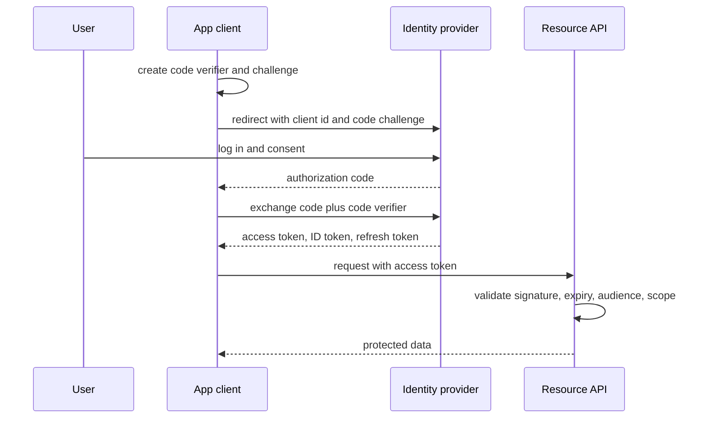
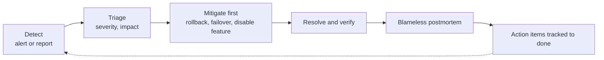
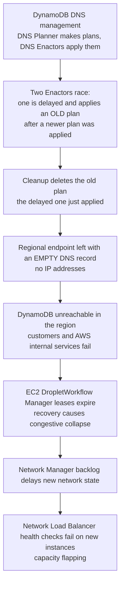
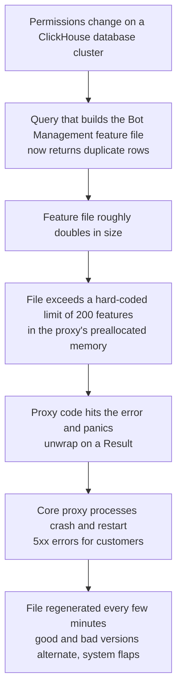

# 📘 Reliability and Operations

A design that works on the whiteboard but cannot be deployed, observed, secured or recovered is unfinished.
Senior and staff interviews grade this explicitly, and it is where most real outages come from.
This page covers the operational half of system design, and ends with two recent, well-documented outages as case studies.

## Table of Contents

1. [SLIs, SLOs and Error Budgets](#1-slis-slos-and-error-budgets)
2. [Observability](#2-observability)
3. [Deployment Strategies](#3-deployment-strategies)
4. [Backups and Disaster Recovery](#4-backups-and-disaster-recovery)
5. [Capacity, Load Testing and Cost](#5-capacity-load-testing-and-cost)
6. [Security Architecture](#6-security-architecture)
7. [Incident Response](#7-incident-response)
8. [Case Study: AWS US-EAST-1, October 2025](#8-case-study-aws-us-east-1-october-2025)
9. [Case Study: Cloudflare, November 2025](#9-case-study-cloudflare-november-2025)
10. [Lessons You Can Reuse](#10-lessons-you-can-reuse)
11. [Production Readiness Checklist](#11-production-readiness-checklist)
12. [Questions and Answers](#12-questions-and-answers)
13. [Sources](#13-sources)

---

## 1. SLIs, SLOs and Error Budgets

| Term | Meaning | Example |
| --- | --- | --- |
| **SLI** | A measurement of service behavior | Fraction of requests that return non-5xx in under 300 ms |
| **SLO** | The target for an SLI over a window | 99.9% over 30 days |
| **SLA** | A contract with consequences | Refunds if monthly availability drops below 99.5% |
| **Error budget** | 1 minus the SLO, the failure you may spend | 0.1% of requests, about 43 minutes of full outage in 30 days |

```text
Budget in time = 30 days x 24 h x 60 min x (1 - 0.999) = 43.2 minutes
```

### 1.1 Choosing SLIs

- Measure from the **user's point of view**: request success rate and latency at the load balancer or client, not CPU.
- Use request-based SLIs (good requests over total requests) for services, and freshness or correctness SLIs for pipelines.
- Set SLOs from what users need, not from what you currently achieve. 100% is the wrong target, it is unreachable and stops all change.

### 1.2 Error Budget Policy

The budget turns reliability into a shared, measurable currency.

- Budget left: ship features, run experiments.
- Budget burning fast: slow releases, focus on reliability work.
- Budget exhausted: freeze non-critical changes until it recovers.

### 1.3 Burn-Rate Alerts

Alert on how fast the budget is being consumed, not on raw error spikes.
The Google SRE workbook recommends multiple windows for a 30-day SLO:

| Severity | Burn rate | Long window | Short window | Budget consumed |
| --- | --- | --- | --- | --- |
| Page | 14.4x | 1 hour | 5 minutes | 2% in 1 hour |
| Page | 6x | 6 hours | 30 minutes | 5% in 6 hours |
| Ticket | 1x | 3 days | 6 hours | 10% in 3 days |

The short window makes the alert reset quickly once the problem is fixed.
This gives fast detection of large incidents and slow detection of chronic ones, with few false pages.

---

## 2. Observability

Observability is the ability to understand internal state from external outputs.
You need it before the incident, because you cannot add it during one.

### 2.1 Signals

| Signal | Shape | Answers | Tools |
| --- | --- | --- | --- |
| **Metrics** | Numeric time series, low cost | Is something wrong? How bad? | Prometheus, Datadog, CloudWatch |
| **Logs** | Discrete events, high volume | What exactly happened? | Loki, Elasticsearch, Splunk |
| **Traces** | Request paths across services | Where is the time or error? | Jaeger, Tempo, Honeycomb |
| **Profiles** | CPU and memory over code | Why is it slow or expensive? | Pyroscope, continuous profilers |

**OpenTelemetry (OTel)** is the vendor-neutral CNCF standard for instrumentation (APIs, SDKs, the OTLP protocol and the Collector) for traces, metrics and logs.
Instrument once, send to any backend.

### 2.2 What to Measure

- **Four golden signals** (Google SRE): latency, traffic, errors, saturation.
- **RED** for services: Rate, Errors, Duration.
- **USE** for resources: Utilization, Saturation, Errors.
- **Business metrics:** orders per minute, signups, payments completed. Technical health with no business impact signal misses silent failures.

### 2.3 Practices

- **Structured logs** (JSON) with a **correlation id** propagated across services, and trace ids in log lines.
- **Sampling:** head-based (decide at the start) is cheap, tail-based (keep slow and errored traces) is more useful and needs buffering.
- **Cardinality control:** never label metrics with unbounded values like user id.
- **Alert on symptoms** (SLO burn, error rate, latency), and use causes for dashboards and diagnosis.
- Every page has a **runbook** and an owner. Delete alerts nobody acts on.
- **Dependency maps** and dashboards per service, so hidden dependencies are visible before they surprise you.

---

## 3. Deployment Strategies

| Strategy | How | Rollback speed | Risk | Cost |
| --- | --- | --- | --- | --- |
| **Recreate** | Stop old, start new | Slow | Downtime | Low |
| **Rolling** | Replace instances gradually | Medium | Mixed versions run together | Low |
| **Blue-green** | Two full environments, switch traffic | Instant switch back | Needs double capacity, data compatibility | High |
| **Canary** | Send a small share to the new version, watch, expand | Fast | Needs good metrics | Medium |
| **Shadow (dark launch)** | Copy real traffic to the new version, discard responses | n/a | Safe for reads, side effects must be disabled | Medium |
| **Feature flags** | Deploy code dark, enable per user or percent | Instant (flip flag) | Flag debt, combinatorial states | Low |



### 3.1 Safe Database Changes

Code and schema deploy at different times, so every change must work with both old and new code.
Use **expand, migrate, contract**:

1. **Expand:** add the new column or table (nullable, additive). Old code ignores it.
2. **Dual write and backfill:** new code writes both, backfill old rows in batches.
3. **Switch reads** to the new structure.
4. **Contract:** after all code is updated and verified, drop the old column.

Never rename or drop in one step, and avoid long locking migrations on big tables (use online schema change tools).

### 3.2 Config and Data Are Deploys Too

Many large outages come from configuration or data pushes, not code.
Treat config, feature files, ML models, certificates and DNS changes with the same rigor: review, validate, staged rollout, monitoring, rollback.

---

## 4. Backups and Disaster Recovery

- **3-2-1 rule:** three copies, two media types, one offsite (different account and region).
- **Point-in-time recovery** for databases (base backup plus continuous log archive).
- **Immutable and access-separated backups** so ransomware or a compromised admin cannot delete them.
- **Test restores.** A backup you have not restored is a hypothesis. Measure actual RTO and RPO.
- Match strategy to targets (backup and restore, pilot light, warm standby, active-active) as in [Distributed Systems](/docs/system-design/hld/distributed-systems).
- **Chaos engineering and game days:** deliberately kill instances, add latency, fail a zone, and confirm alerts, failover and runbooks work.
- **Region evacuation** runbooks, including DNS, secrets, config, data residency, and who decides to fail over.

---

## 5. Capacity, Load Testing and Cost

- **Load test** with realistic traffic shapes (peak, spike, soak) and find the knee where latency rises. Test dependencies too.
- **Headroom:** run below the knee, at least N+1 (ideally N+2), and enough to absorb a zone loss without overload.
- **Autoscaling** on the right signal (queue depth, concurrency, requests per instance), with scale-out fast and scale-in slow, and warm-up time accounted for.
- **Quotas and limits:** know cloud service limits (connections, IOPS, API rate limits) before they surprise you.
- **Cost as a design constraint:** right-size, use reserved or committed capacity for steady load, spot for tolerant batch work, tier storage, watch data transfer costs (cross-AZ and egress can dominate), and tag spend by team and feature.
- Do not over-engineer: multi-region active-active for a small internal tool is a design flaw, not a strength.

---

## 6. Security Architecture

### 6.1 Authentication and Authorization

- **Authentication:** who are you. **Authorization:** what may you do.
- **OAuth 2.0** delegates access, **OpenID Connect (OIDC)** adds identity on top. For browser and mobile apps use the **authorization code flow with PKCE**.



- **JWT** pitfalls: cannot be revoked before expiry, so keep access tokens short-lived and rotate refresh tokens. Validate the signature, algorithm, issuer, audience and expiry every time. Never accept `alg: none`. Do not put sensitive data in the payload, it is only encoded.
- **Authorization models:** RBAC (roles), ABAC (attributes and policy), ReBAC (relationships, as in Google Zanzibar style systems). Enforce in a central policy layer and again at the data layer.
- Check permissions on the server for every request. Client checks are only UX.

### 6.2 Defense in Depth

| Layer | Controls |
| --- | --- |
| Edge | DDoS protection, WAF, rate limiting, bot management, TLS |
| Network | Private subnets, security groups, zero-trust between services |
| Service to service | **mTLS** with short-lived certs (service mesh or SPIFFE), service identities, least-privilege IAM |
| Data | Encryption in transit and at rest, **envelope encryption** with a KMS, field-level encryption for sensitive data, tokenization |
| Secrets | Vault or cloud secret manager, rotation, never in code or images |
| Application | Input validation, parameterized queries, output encoding, dependency scanning |
| Audit | Immutable audit logs for sensitive actions, alerting on anomalies |
| Privacy | Data classification, minimization, retention limits, GDPR rights (access, delete), data residency |

### 6.3 Threat Modeling Prompts

Use STRIDE: spoofing, tampering, repudiation, information disclosure, denial of service, elevation of privilege.
For each entry point and data store ask which applies and what control exists.

---

## 7. Incident Response



- **Mitigate before diagnosing.** Roll back, shed load, flip a flag. Root cause can wait.
- **Roles:** incident commander, communications lead, operations, scribe. One person drives.
- **Communicate** on a fixed cadence to stakeholders and customers, even to say "no change".
- **Blameless postmortems:** timeline, impact, contributing factors (plural), what went well, what was lucky, action items with owners. Focus on systems, not people.
- **Track time to detect, time to mitigate, time to recover.** Detection is often the biggest gap.

---

## 8. Case Study: AWS US-EAST-1, October 2025

On October 19 and 20, 2025 a disruption in the US-EAST-1 (N. Virginia) region caused widespread failures across many internet services.
AWS published a summary of the DynamoDB event.

### 8.1 What Happened



Timeline reported by AWS (Pacific time):

- Oct 19, about 11:48 PM: DynamoDB DNS failures begin.
- Oct 20, 12:38 AM: root cause identified.
- 2:25 AM: DNS restored, EC2 lease recovery starts.
- Throughout the morning: EC2 instance launches and network configuration propagation recover in stages, NLB health checks cause further impact.
- About 2:20 PM: all services back to normal operation.

### 8.2 Why It Matters

- A **latent race condition** in automation had existed unnoticed. Automation that edits critical control data needs correctness checks that hold under delays and concurrency.
- A **hidden dependency**: many other AWS services, and customers, depended on DynamoDB in one region for their own control paths, so one failure fanned out.
- **Recovery was harder than failure.** Re-establishing leases and state for a huge fleet at once overloaded the recovery path (congestive collapse), so restoration took much longer than the trigger.
- The fix AWS listed included disabling the DNS automation worldwide until safeguards are added, adding protections against applying incorrect plans, **velocity control** on NLB capacity removal driven by health checks, better scale testing of the EC2 recovery workflow, and improved throttling.

### 8.3 What You Would Do in Your Own Designs

- Map hard dependencies of your control paths, and remove single-region ones for critical functions.
- Make automation **idempotent and monotonic** (never let an older plan overwrite a newer one, use versions and compare-and-set), and add a guard that refuses to delete the last known-good state.
- Rate limit and **ramp** recovery, throttle reconnection storms, and load test the recovery path, not only steady state.
- Have a multi-region or degraded-mode plan for critical paths, and practice it.
- Cache DNS answers and use safe fallbacks for critical endpoints where appropriate.

---

## 9. Case Study: Cloudflare, November 2025

On November 18, 2025 Cloudflare's network began failing to deliver core traffic, producing errors across a large part of the web.
The cause was internal, not an attack.

### 9.1 What Happened



- The bad file was regenerated and pushed to the whole fleet frequently, so the system alternated between healthy and failing, which made it look at first like an external attack.
- Recovery: stop propagation of the bad file, deploy a known-good file, and restart the proxies. Core traffic was largely restored about three hours after onset, with full recovery reported after roughly six hours in total.

### 9.2 Why It Matters

- **Internally generated data is untrusted input.** A config or feature file must be validated for size, shape and sanity before it reaches the data plane, exactly like user input.
- **Fail safely.** A parsing error in one module should degrade that module (skip bot scoring, use the last good file), not crash the whole proxy.
- **Hard limits need alarms and graceful behavior** at the limit, not a panic.
- **Global, instant propagation of config is a global blast radius.** Cloudflare described a response plan named "Code Orange: Fail Small" focused on gradual rollout of configuration, health-gated deploys, and stronger failure isolation.
- **Kill switches and known-good rollback** for every generated artifact.
- **Ambiguous symptoms** (flapping) delay diagnosis. Good observability and clear ownership shorten it.

---

## 10. Lessons You Can Reuse

| Failure pattern | Design response |
| --- | --- |
| A single shared dependency (DNS, config store, regional service) | Dependency mapping, redundancy, static stability, fallbacks |
| Automation with a race condition or missing safety check | Versioned, compare-and-set updates, guardrails against destructive or empty results, canary the automation itself |
| Bad config or data pushed globally | Staged rollout, validation, size and schema limits, kill switch, rollback |
| Crash on unexpected input in the hot path | Defensive parsing, isolate optional modules, fail open or use last known good |
| Recovery causes a second outage | Ramp, throttle, backoff with jitter, capacity reserved for recovery, test recovery |
| Retry storms | Retry budgets, circuit breakers, load shedding |
| Ambiguous symptoms and slow detection | SLO-based alerting, dependency dashboards, tracing, good runbooks |
| Large blast radius | Cells, shuffle sharding, regional independence, fail small |

---

## 11. Production Readiness Checklist

```text
Reliability   SLOs defined, alerts on burn rate, timeouts and retries with budgets, circuit breakers,
              graceful degradation, load shedding, no single point of failure, N+1 capacity
Data          Backups tested by restore, PITR, migrations are expand and contract, retention defined
Deploy        Automated pipeline, canary or blue-green, rollback tested, feature flags, config staged
Observability Metrics, structured logs with correlation ids, traces, dashboards, runbooks, on-call owner
Security      Authn and authz on every path, least privilege, secrets managed, encryption, audit logs
Capacity      Load tested, autoscaling tuned, limits known, cost tracked
Operations    Incident process, postmortem template, game day done, dependency map current
```

---

## 12. Questions and Answers

**Q1. How do you decide an SLO?**
From user expectations and business impact, using measured baselines, and verify with the team that owns it.
Pick an SLI users feel, a target achievable and worth the cost, and use the error budget to balance releases against reliability.

**Q2. What would you alert on?**
User-facing symptoms: SLO burn rate, error rate, latency, and saturation approaching limits.
Do not page on CPU or on a single failed instance, since redundancy handles it.

**Q3. Design a safe rollout for a risky change.**
Feature flag plus canary at 1 percent with automated analysis of errors, latency and business metrics, staged expansion, instant rollback, and a shadow phase if it has side effects.

**Q4. How do you change a database column type with zero downtime?**
Expand, migrate, contract: add a new column, dual write, backfill in batches, switch reads, then drop the old column later.
Avoid locking DDL on big tables.

**Q5. What did the October 2025 AWS outage teach about DNS?**
DNS is a control plane dependency.
Automation that writes DNS needs versioning and safeguards against applying stale plans or leaving empty records, and dependents need fallbacks and caching.

**Q6. What did the November 2025 Cloudflare outage teach about configuration?**
Generated config is untrusted input.
Validate size and shape, roll out gradually, fail safe to the last good version, and never let an optional module crash the core path.

**Q7. How do you prove a DR plan works?**
Regular restore tests and game days that actually fail over, with measured RTO and RPO compared with targets, and runbooks updated from what you learn.

**Q8. How would you secure service-to-service calls?**
mTLS with short-lived workload identities, authorization policy per service and method, least privilege, network segmentation, and audit logs.

**Q9. Why is 100 percent availability the wrong goal?**
It is unreachable, its cost grows without bound, and it blocks change.
An SLO with an error budget gives a rational amount of risk to spend on delivery.

**Q10. What is static stability?**
The data plane keeps serving when the control plane is down, because it does not depend on it at request time.
Cache configuration and credentials, degrade gracefully, and make scaling and failover work without new control-plane calls where possible.

---

## 13. Sources

- [AWS: Summary of the Amazon DynamoDB Service Disruption in the Northern Virginia (US-EAST-1) Region, October 2025](https://aws.amazon.com/message/101925/)
- [Cloudflare: Cloudflare outage on November 18, 2025](https://blog.cloudflare.com/18-november-2025-outage/)
- [Cloudflare: Code Orange, Fail Small (resilience plan)](https://blog.cloudflare.com/fail-small-resilience-plan/)
- [Google SRE Book and Workbook](https://sre.google/sre-book/table-of-contents/) for SLOs, burn-rate alerting and incident management.
- [OpenTelemetry](https://opentelemetry.io/) for the observability standard.
- [Amazon Builders' Library](https://aws.amazon.com/builders-library/) for static stability, retries with backoff and jitter, and cell-based architecture.
