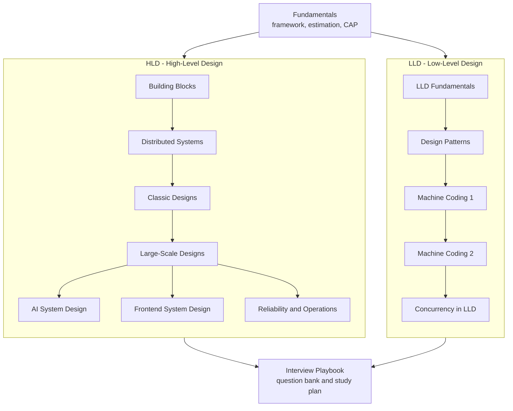

Start here for system design prep.
The section is split the way interviews are split: **HLD** (architecture, scale, data, trade-offs) and **LLD** (classes, interfaces, patterns, machine coding).
Every page has flowcharts, worked examples, and interview questions.
Facts that changed recently (Kafka 4.0, Redis licensing and Valkey, LLM serving, the 2025 AWS and Cloudflare outages, UUIDv7) are folded into the pages where they matter.

## Contents

<SectionHub path="system-design" />

## Reading Path

## Pick Your Level

| You are | Read in this order |
| --- | --- |
| Complete beginner | [Fundamentals](/docs/system-design/fundamentals), [Building Blocks](/docs/system-design/hld/building-blocks), [Classic Designs](/docs/system-design/hld/classic-designs) |
| Preparing for a mid-level loop | Add [Large-Scale Designs](/docs/system-design/hld/large-scale-designs), [LLD Fundamentals](/docs/system-design/lld/lld-fundamentals), both machine coding pages |
| Preparing for senior or staff | Add [Distributed Systems](/docs/system-design/hld/distributed-systems), [Reliability and Operations](/docs/system-design/hld/reliability-and-operations), [AI System Design](/docs/system-design/hld/ai-system-design) |
| Frontend or full-stack engineer | [Frontend System Design](/docs/system-design/hld/frontend-system-design), then [Server-Driven UI](/docs/sdui) |
| One week left | [Interview Playbook](/docs/system-design/interview-playbook) study plan, then the case studies it points at |

## Related Sections

- [OOPS](/docs/oops) has the four pillars, SOLID, UML and five core patterns that LLD builds on.
- [Java](/docs/java) has the concurrency and collections notes used by the LLD solutions.
- [Server-Driven UI](/docs/sdui) is a real frontend architecture case study.
- [DSA Patterns](/docs/dsa) covers the algorithms that appear inside designs (heaps, tries, intervals, graphs).
- [Backend](/docs/backend) covers the service layer: APIs, auth, caching, queues, testing and deployment.
- [Databases](/docs/databases) covers the data layer: SQL, indexing, transactions, replication and NoSQL.

## Sources

The notes are original write-ups, cross-checked against primary sources where a fact is time sensitive.
Recurring references:

- [Designing Data-Intensive Applications](https://dataintensive.net/) by Martin Kleppmann (the best single book for the HLD theory).
- [Google SRE Book](https://sre.google/sre-book/table-of-contents/) and [Amazon Builders' Library](https://aws.amazon.com/builders-library/).
- [System Design Primer](https://github.com/donnemartin/system-design-primer).
- [The Raft paper and visualization](https://raft.github.io/), [Jepsen](https://jepsen.io/) for consistency analyses.
- [Apache Kafka 4.0 release notes](https://kafka.apache.org/blog/2025/03/18/apache-kafka-4.0.0-release-announcement/), [vLLM: Anatomy of a High-Throughput LLM Inference System](https://vllm.ai/blog/2025-09-05-anatomy-of-vllm), [AWS DynamoDB disruption summary (Oct 2025)](https://aws.amazon.com/message/101925/), [Cloudflare outage on November 18, 2025](https://blog.cloudflare.com/18-november-2025-outage/).
