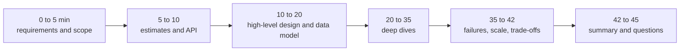

# 📘 System Design Interview Playbook

The other pages teach the material.
This page is about performing under interview conditions: what is graded at each level, how to spend 45 minutes, what to say, which questions to practice, and how to schedule your preparation.

## Table of Contents

1. [What Is Graded at Each Level](#1-what-is-graded-at-each-level)
2. [The 45-Minute HLD Timeline](#2-the-45-minute-hld-timeline)
3. [The LLD and Machine Coding Timeline](#3-the-lld-and-machine-coding-timeline)
4. [What to Say](#4-what-to-say)
5. [Common Mistakes](#5-common-mistakes)
6. [Question Bank](#6-question-bank)
7. [Design Prompt Index](#7-design-prompt-index)
8. [Study Plans](#8-study-plans)
9. [Final Checklist](#9-final-checklist)

---

## 1. What Is Graded at Each Level

The same prompt is used across levels, and the bar rises.

| Level | Expected behavior |
| --- | --- |
| **Junior** | Understand the problem, propose a workable design with basic components (LB, app tier, DB, cache), explain choices when asked, accept guidance |
| **Mid (SDE 2)** | Drive the conversation, gather requirements, estimate scale, choose data stores with reasons, identify bottlenecks and fix them, discuss basic failure cases |
| **Senior** | Own the whole design. Present alternatives and pick one with trade-offs. Deep dive two components at implementation level. Cover failure modes, consistency, observability, deployment, cost. |
| **Staff and above** | Handle ambiguity and organizational constraints, define the problem before solving it, phase the roadmap (build now, evolve later), migration and rollout, cross-team impact, build vs buy, long-term operability, risk |

Signals that raise your rating at any level:

- You ask sharp clarifying questions and the answers change your design.
- Numbers drive decisions (you say "so we need sharding" because of an estimate).
- You name what you give up with each choice.
- You spot failure modes before the interviewer does.
- You can go deeper on any box on request.

---

## 2. The 45-Minute HLD Timeline

| Phase | Do | Avoid |
| --- | --- | --- |
| Requirements | 3 to 5 functional, 3 to 5 non-functional with numbers, list what you exclude | Starting to draw immediately |
| Estimates | QPS, storage, bandwidth, peak factor, one design decision from them | Ten minutes of arithmetic |
| API and data | Endpoints, main entities, keys, indexes, read and write paths | Vague "a database" boxes |
| High level | One diagram, trace one write and one read end to end | Twenty components with no flow |
| Deep dive | The interviewer's choice, or your riskiest component: alternatives, algorithms, failure behavior | Skimming everything equally |
| Failures and scale | SPOFs, hot spots, what if 10x traffic, what if a region fails, monitoring | Ending without discussing failure |
| Wrap up | Recap, what you would build next, what you would monitor | Trailing off |

Use the [seven-step framework](/docs/system-design/fundamentals) as the backbone.

---

## 3. The LLD and Machine Coding Timeline

For a 60 to 90 minute coding round, see the detailed plan in [LLD Fundamentals](/docs/system-design/lld/lld-fundamentals).

| Minutes (of 60) | Activity |
| --- | --- |
| 0 to 8 | Clarify, write scope, list entities and use cases |
| 8 to 15 | Class diagram, entry-point API, extension points |
| 15 to 45 | Code the core flow end to end, then the rest |
| 45 to 55 | Demo main, edge cases, fix bugs |
| 55 to 60 | Discuss extensions and concurrency |

Priorities: working and clean beats clever and unfinished.
Say aloud where you would add a pattern, even if you do not have time to code it.

---

## 4. What to Say

### 4.1 Useful Phrases

| Situation | Say |
| --- | --- |
| Starting | "Before I design, I want to confirm scope and scale." |
| Making an assumption | "I will assume 100M DAU and a 100 to 1 read to write ratio, tell me if that is off." |
| Choosing a technology | "I need X property, so I will use Y. The trade-off is Z." |
| Comparing options | "There are two approaches, A and B. I would pick A because..., B wins if..." |
| Handling a bottleneck | "The database write rate is the first thing to break, so..." |
| Admitting uncertainty | "I have not run this at that scale. My reasoning is..., and I would validate it with a load test." |
| Interviewer pushes back | "Good point, that changes X. If we need Y, I would switch to..." |
| Running low on time | "I will go deep on the write path and sketch the rest." |

### 4.2 Trade-off Vocabulary

Make trade-offs explicit with these pairs:

| Pair | Typical sentence |
| --- | --- |
| Consistency and availability | "For the feed I choose availability, a slightly stale view is fine. For payments I choose consistency." |
| Latency and cost | "A cache tier costs money, and it takes p99 from 80 ms to 10 ms." |
| Read cost and write cost | "Precomputing the feed makes writes heavy and reads cheap." |
| Simplicity and scalability | "One Postgres primary is enough until roughly this size, so I start there." |
| Sync and async | "Emailing does not need to block the request, so it goes through a queue." |
| Build and buy | "Auth is commodity, I would use a managed identity provider." |
| Accuracy and speed | "Approximate counts with HyperLogLog are fine for analytics." |

### 4.3 Structure Every Deep Dive

1. State the problem the component solves.
2. Give two or three options.
3. Pick one with reasons tied to requirements.
4. Say how it fails and what you do about it.
5. Say how you would observe it.

---

## 5. Common Mistakes

| Mistake | Why it hurts | Fix |
| --- | --- | --- |
| No clarification | You solve the wrong problem | Spend 5 minutes on scope and numbers |
| Buzzword architecture (Kafka, Redis, Kubernetes everywhere) | No reasons, no fit | Justify each component by a requirement |
| Over-engineering | Multi-region microservices for 1,000 users | Right-size and state the growth path |
| Ignoring numbers | No basis for decisions | Two or three key estimates |
| Silent thinking | Interviewer cannot help or grade | Think aloud, structure as you go |
| One happy path | No failure handling | Walk each component: slow, down, wrong |
| Single point of failure left in | Immediate red flag | Name and remove SPOFs |
| Hand-waving the data model | Data is the design | Tables or documents, keys, indexes, access patterns |
| Not listening to hints | Interviewer is steering you | Treat hints as instructions |
| Defensive on feedback | Signals poor collaboration | Adjust the design and explain the effect |
| Skipping security and observability at senior level | Missing half the job | Add auth, rate limits, metrics, alerts, rollout |
| LLD: coding before modeling | Tangled classes | Entities and interfaces first |
| LLD: patterns for show | Extra indirection | Only at stated variation points |

---

## 6. Question Bank

Sixty questions grouped by level.
The "Strong answer includes" column is a checklist, not a script.

### 6.1 Beginner (15)

| # | Question | Strong answer includes | Read |
| --- | --- | --- | --- |
| 1 | Vertical or horizontal scaling? | Vertical first for simplicity, horizontal for redundancy and limits, stateless tier | [Fundamentals](/docs/system-design/fundamentals) |
| 2 | What is a load balancer, and which algorithms exist? | L4 vs L7, round robin, least connections, consistent hash, health checks | [Building Blocks](/docs/system-design/hld/building-blocks) |
| 3 | Cache-aside vs write-through? | Read and write paths, staleness, write cost, delete on write | [Building Blocks](/docs/system-design/hld/building-blocks) |
| 4 | SQL or NoSQL? | Access patterns, transactions, scale, schema flexibility, start with SQL | [Building Blocks](/docs/system-design/hld/building-blocks) |
| 5 | What is an index and what does it cost? | B-tree, faster reads, slower writes, space, leftmost prefix | [Building Blocks](/docs/system-design/hld/building-blocks) |
| 6 | What does a CDN do? | Edge caching, latency, offload, cache keys, invalidation by versioned URLs | [Building Blocks](/docs/system-design/hld/building-blocks) |
| 7 | Replication vs sharding? | Copies for availability and reads, partitions for write and size scale | [Building Blocks](/docs/system-design/hld/building-blocks) |
| 8 | Explain CAP. | Partition forces C or A, PACELC else latency vs consistency, examples | [Fundamentals](/docs/system-design/fundamentals) |
| 9 | Latency vs throughput? | Definitions, batching trade-off, percentiles | [Fundamentals](/docs/system-design/fundamentals) |
| 10 | What is idempotency and why does it matter? | Safe retries, idempotency keys, PUT vs POST | [Building Blocks](/docs/system-design/hld/building-blocks) |
| 11 | REST, GraphQL or gRPC? | Public vs client-driven vs internal, trade-offs | [Building Blocks](/docs/system-design/hld/building-blocks) |
| 12 | Why use a message queue? | Decoupling, spikes, retries, async work, at-least-once | [Building Blocks](/docs/system-design/hld/building-blocks) |
| 13 | Stateless vs stateful services? | Any instance serves any request, sessions in shared store, state moves to data tier | [Fundamentals](/docs/system-design/fundamentals) |
| 14 | What does DNS TTL control? | Caching duration, failover speed vs load | [Building Blocks](/docs/system-design/hld/building-blocks) |
| 15 | Estimate QPS for 10M DAU with 20 requests each. | 200M per day, about 2,300 per second average, peak 3x | [Fundamentals](/docs/system-design/fundamentals) |

### 6.2 Intermediate (15)

| # | Question | Strong answer includes | Read |
| --- | --- | --- | --- |
| 16 | How do you invalidate and evict a cache? | TTL, delete on write, LRU or LFU, CDC-driven invalidation | [Building Blocks](/docs/system-design/hld/building-blocks) |
| 17 | How do you handle a hot key? | Local cache, replicate, key splitting, shard-aware limits | [Building Blocks](/docs/system-design/hld/building-blocks) |
| 18 | Why consistent hashing? | Minimal remapping on resize, virtual nodes, examples | [Building Blocks](/docs/system-design/hld/building-blocks) |
| 19 | Fan-out on write vs read for a feed? | Write amplification, celebrities, hybrid | [Large-Scale Designs](/docs/system-design/hld/large-scale-designs) |
| 20 | Can you get exactly-once delivery? | At-least-once plus idempotent consumers, Kafka transactions | [Building Blocks](/docs/system-design/hld/building-blocks) |
| 21 | How do you pick a shard key? | Cardinality, even load, query alignment, hot spots | [Building Blocks](/docs/system-design/hld/building-blocks) |
| 22 | How do you provide read-your-writes with replicas? | Route to primary after write, log position, sticky replica | [Fundamentals](/docs/system-design/fundamentals) |
| 23 | WebSocket, SSE or polling? | Direction, cost, reconnect, fit by use case | [Building Blocks](/docs/system-design/hld/building-blocks) |
| 24 | Compare rate limiting algorithms. | Token bucket, fixed window edge burst, sliding window, Redis atomicity | [Classic Designs](/docs/system-design/hld/classic-designs) |
| 25 | How do Kafka partitions, groups and ordering work? | Ordering per partition, parallelism bounded by partitions, offsets | [Building Blocks](/docs/system-design/hld/building-blocks) |
| 26 | Offset or cursor pagination? | Depth cost, shifting data, keyset, stability | [Building Blocks](/docs/system-design/hld/building-blocks) |
| 27 | What is a cache stampede and how do you stop it? | Single-flight, jittered TTL, stale-while-revalidate, locks | [Building Blocks](/docs/system-design/hld/building-blocks) |
| 28 | Design an idempotent payment API. | Idempotency key stored atomically, state machine, unknown outcome, reconciliation | [Large-Scale Designs](/docs/system-design/hld/large-scale-designs) |
| 29 | Keep a search index in sync with the DB. | CDC or outbox, idempotent updates, rebuild path | [Building Blocks](/docs/system-design/hld/building-blocks) |
| 30 | Blue-green or canary? | Cost, rollback speed, metric-gated rollout, DB compatibility | [Reliability and Operations](/docs/system-design/hld/reliability-and-operations) |

### 6.3 Advanced (15)

| # | Question | Strong answer includes | Read |
| --- | --- | --- | --- |
| 31 | Explain Raft leader election and commit. | Terms, majority votes, log replication, up-to-date log rule | [Distributed Systems](/docs/system-design/hld/distributed-systems) |
| 32 | 2PC or saga? | Blocking coordinator, compensations, isolation loss, idempotency | [Distributed Systems](/docs/system-design/hld/distributed-systems) |
| 33 | What is split brain and how do you prevent it? | Epochs, majority, fencing tokens, STONITH | [Distributed Systems](/docs/system-design/hld/distributed-systems) |
| 34 | Isolation levels and write skew? | Anomaly table, snapshot isolation, serializable, fixes | [Distributed Systems](/docs/system-design/hld/distributed-systems) |
| 35 | Does W + R > N guarantee linearizability? | No: sloppy quorums, concurrent writes, clocks, read repair | [Distributed Systems](/docs/system-design/hld/distributed-systems) |
| 36 | How do you order events across machines? | Not wall clocks, Lamport and vector clocks, HLC, per-partition sequence | [Distributed Systems](/docs/system-design/hld/distributed-systems) |
| 37 | Design multi-region active-active data. | Home region, multi-leader conflicts, CRDTs, global consensus cost, RPO and RTO | [Distributed Systems](/docs/system-design/hld/distributed-systems) |
| 38 | Design for 99.99% availability. | Error budget math, redundancy, no shared fate, deploy safety, tested failover | [Reliability and Operations](/docs/system-design/hld/reliability-and-operations) |
| 39 | Why do retries cause outages? | Amplification, metastable state, budgets, backoff with jitter, shedding | [Distributed Systems](/docs/system-design/hld/distributed-systems) |
| 40 | What is a cell-based architecture? | Independent cells, router, blast radius, shuffle sharding | [Distributed Systems](/docs/system-design/hld/distributed-systems) |
| 41 | Explain the transactional outbox. | Same-transaction event row, relay, at-least-once, inbox dedupe | [Distributed Systems](/docs/system-design/hld/distributed-systems) |
| 42 | When would you use CRDTs? | Convergent merge, offline, collaboration, counters and sets, limits | [Distributed Systems](/docs/system-design/hld/distributed-systems) |
| 43 | Exactly-once in stream processing? | Checkpoints, idempotent sinks, event time, watermarks, dedupe | [Large-Scale Designs](/docs/system-design/hld/large-scale-designs) |
| 44 | Zero-downtime schema migration? | Expand, dual write, backfill, switch, contract | [Reliability and Operations](/docs/system-design/hld/reliability-and-operations) |
| 45 | What did the October 2025 AWS outage teach? | DNS race condition, hidden dependency, recovery collapse, guardrails | [Reliability and Operations](/docs/system-design/hld/reliability-and-operations) |

### 6.4 AI and Frontend (8)

| # | Question | Strong answer includes | Read |
| --- | --- | --- | --- |
| 46 | How do LLM serving engines get throughput? | Continuous batching, PagedAttention, prefix caching, chunked prefill, quantization | [AI System Design](/docs/system-design/hld/ai-system-design) |
| 47 | A RAG bot gives wrong answers. Debug it. | Eval set, retrieval first, chunking, hybrid, rerank, grounding | [AI System Design](/docs/system-design/hld/ai-system-design) |
| 48 | Enforce document permissions in RAG. | ACL metadata, filter inside retrieval, propagate deletes | [AI System Design](/docs/system-design/hld/ai-system-design) |
| 49 | Defend an agent against prompt injection. | Untrusted content, least privilege, confirmations, isolation, monitoring | [AI System Design](/docs/system-design/hld/ai-system-design) |
| 50 | Halve an LLM bill. | Measure tokens, trim prompts, prefix cache, route to smaller models, batch | [AI System Design](/docs/system-design/hld/ai-system-design) |
| 51 | SSR, CSR, SSG or ISR? | Chooser flow, SEO, personalization, hydration cost | [Frontend System Design](/docs/system-design/hld/frontend-system-design) |
| 52 | Improve LCP and INP. | Image priority and CDN, split bundles, break long tasks, transitions | [Frontend System Design](/docs/system-design/hld/frontend-system-design) |
| 53 | Design a real-time dashboard UI. | Batching, bounded buffers, downsampling, worker, backpressure | [Frontend System Design](/docs/system-design/hld/frontend-system-design) |

### 6.5 LLD (7)

| # | Question | Strong answer includes | Read |
| --- | --- | --- | --- |
| 54 | Make a parking lot extensible for new pricing and allocation. | Strategy interfaces at the variation points, injected clock | [Machine Coding 1](/docs/system-design/lld/machine-coding-problems-1) |
| 55 | Strategy or State? | Who chooses, lifecycle, transitions, examples | [Design Patterns](/docs/system-design/lld/design-patterns) |
| 56 | Make an LRU cache thread safe. | Lock, striping, atomic compute, library alternatives | [Machine Coding 1](/docs/system-design/lld/machine-coding-problems-1) |
| 57 | Prevent double booking under concurrency. | Atomic check and act, lock per show, hold with expiry, DB CAS | [Machine Coding 2](/docs/system-design/lld/machine-coding-problems-2) |
| 58 | Refactor a class full of type switches. | Polymorphism, Open/Closed, injected policies | [LLD Fundamentals](/docs/system-design/lld/lld-fundamentals) |
| 59 | How do you avoid deadlock? | Lock ordering, tryLock timeout, fewer locks, confinement | [Concurrency in LLD](/docs/system-design/lld/concurrency-in-lld) |
| 60 | Design elevator scheduling. | SCAN with sorted stops, cost-based dispatch strategy, state machine | [Machine Coding 1](/docs/system-design/lld/machine-coding-problems-1) |

---

## 7. Design Prompt Index

Practice by saying the design out loud with a timer.

### 7.1 HLD Prompts

| Prompt | Level | Where |
| --- | --- | --- |
| URL shortener | Beginner | [Classic Designs](/docs/system-design/hld/classic-designs) |
| Rate limiter | Beginner | [Classic Designs](/docs/system-design/hld/classic-designs) |
| Unique ID generator | Beginner | [Classic Designs](/docs/system-design/hld/classic-designs) |
| Distributed key-value store | Mid | [Classic Designs](/docs/system-design/hld/classic-designs) |
| Notification system | Mid | [Classic Designs](/docs/system-design/hld/classic-designs) |
| Web crawler | Mid | [Classic Designs](/docs/system-design/hld/classic-designs) |
| Typeahead | Mid | [Classic Designs](/docs/system-design/hld/classic-designs) |
| Distributed cache | Mid | [Classic Designs](/docs/system-design/hld/classic-designs) |
| News feed | Mid to senior | [Large-Scale Designs](/docs/system-design/hld/large-scale-designs) |
| Chat system | Mid to senior | [Large-Scale Designs](/docs/system-design/hld/large-scale-designs) |
| Video streaming | Mid to senior | [Large-Scale Designs](/docs/system-design/hld/large-scale-designs) |
| Ride hailing | Senior | [Large-Scale Designs](/docs/system-design/hld/large-scale-designs) |
| File sync (Dropbox) | Senior | [Large-Scale Designs](/docs/system-design/hld/large-scale-designs) |
| Ticket booking | Senior | [Large-Scale Designs](/docs/system-design/hld/large-scale-designs) |
| Payment system | Senior | [Large-Scale Designs](/docs/system-design/hld/large-scale-designs) |
| Ad click aggregation | Senior | [Large-Scale Designs](/docs/system-design/hld/large-scale-designs) |
| Job scheduler | Senior | [Large-Scale Designs](/docs/system-design/hld/large-scale-designs) |
| Leaderboard | Mid | [Large-Scale Designs](/docs/system-design/hld/large-scale-designs) |
| Collaborative editing | Senior | [Large-Scale Designs](/docs/system-design/hld/large-scale-designs) |
| Monitoring system | Senior | [Large-Scale Designs](/docs/system-design/hld/large-scale-designs) |
| ChatGPT-style assistant, RAG, agents | Mid to senior | [AI System Design](/docs/system-design/hld/ai-system-design) |
| News feed UI, typeahead component, chat UI | Mid to senior | [Frontend System Design](/docs/system-design/hld/frontend-system-design) |

### 7.2 LLD Prompts

| Prompt | Where |
| --- | --- |
| Parking lot, LRU cache, elevator, vending machine, tic-tac-toe, logger | [Machine Coding 1](/docs/system-design/lld/machine-coding-problems-1) |
| Movie ticket booking, Splitwise, pub/sub, rate limiter, ATM, file system | [Machine Coding 2](/docs/system-design/lld/machine-coding-problems-2) |
| Extra practice with the same patterns | Library management (Strategy fines, Observer reservations), chess (Strategy per piece, Command undo), snake and ladder (Strategy dice), ride booking (State, Strategy), food delivery (Observer, State), Twitter-lite (Observer, Facade), hotel booking (like movie booking with date ranges) |

---

## 8. Study Plans

### 8.1 Four Weeks

| Week | Learn | Practice (out loud, timed) |
| --- | --- | --- |
| **1: Foundations** | [Fundamentals](/docs/system-design/fundamentals), [Building Blocks](/docs/system-design/hld/building-blocks), [LLD Fundamentals](/docs/system-design/lld/lld-fundamentals), [Design Patterns](/docs/system-design/lld/design-patterns) | Estimation drills (5 a day), URL shortener, rate limiter, LRU cache, parking lot |
| **2: Classic designs** | [Classic Designs](/docs/system-design/hld/classic-designs), [Machine Coding 1](/docs/system-design/lld/machine-coding-problems-1) | Key-value store, notification system, typeahead, code elevator and vending machine |
| **3: Depth** | [Distributed Systems](/docs/system-design/hld/distributed-systems), [Large-Scale Designs](/docs/system-design/hld/large-scale-designs), [Machine Coding 2](/docs/system-design/lld/machine-coding-problems-2), [Concurrency in LLD](/docs/system-design/lld/concurrency-in-lld) | News feed, chat, payments, ticket booking, movie booking with concurrency, Splitwise |
| **4: Modern and mocks** | [AI System Design](/docs/system-design/hld/ai-system-design), [Frontend System Design](/docs/system-design/hld/frontend-system-design), [Reliability and Operations](/docs/system-design/hld/reliability-and-operations) | Two full mock interviews per week (HLD and LLD), question bank review, record and critique yourself |

Daily rhythm: 45 minutes reading, 45 minutes practicing a design out loud or coding an LLD problem, 15 minutes reviewing gaps.

### 8.2 Seven-Day Crash Plan

| Day | Focus |
| --- | --- |
| 1 | [Fundamentals](/docs/system-design/fundamentals) sections 2, 4, 8 and the [Building Blocks](/docs/system-design/hld/building-blocks) tables. Estimate drills. |
| 2 | URL shortener, rate limiter, ID generator, key-value store. Say each in 30 minutes. |
| 3 | News feed, chat, notification system. Focus on fan-out, ordering, delivery. |
| 4 | Payments, ticket booking, distributed transactions and idempotency from [Distributed Systems](/docs/system-design/hld/distributed-systems). |
| 5 | [LLD Fundamentals](/docs/system-design/lld/lld-fundamentals), then code parking lot and LRU. Review the pattern chooser. |
| 6 | One more LLD (movie booking or Splitwise) plus [Concurrency in LLD](/docs/system-design/lld/concurrency-in-lld) answers. Skim the AI and reliability pages. |
| 7 | Mock: one HLD and one LLD with a friend. Review the question bank rows you missed. Sleep. |

---

## 9. Final Checklist

Before the interview:

- [ ] I can do QPS, storage and bandwidth math in two minutes.
- [ ] I can draw the request path and name each component's failure mode.
- [ ] I know when to choose SQL, key-value, wide-column, search, and object storage, with reasons.
- [ ] I can explain replication, sharding, consistent hashing, quorums, and CAP without notes.
- [ ] I can design idempotent writes and explain at-least-once plus dedupe.
- [ ] I have a standard opening (requirements, numbers, API, data, diagram) and closing (failures, scale, monitoring).
- [ ] For LLD I follow model, interface, code, demo, extend, and I inject time and dependencies.
- [ ] I can say what I would monitor and how I would roll it out.

Senior summary in one line: **clarify, size it, design the simplest thing that meets the numbers, then find where it breaks and say what you would do about it.**
