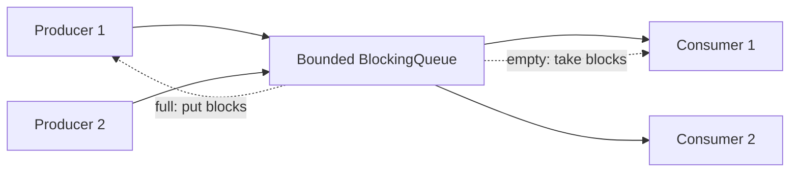
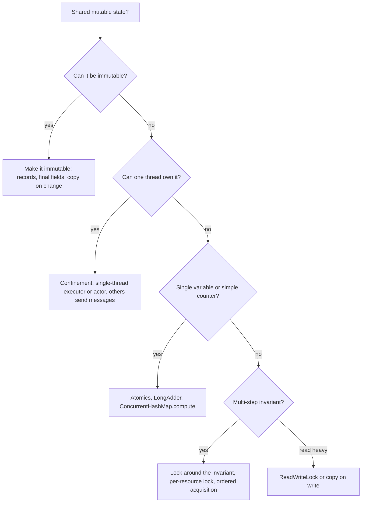

# 📘 Concurrency in LLD

Almost every LLD interview ends with "now make it thread safe" or "what if two users do this at the same time?".
This page gives you the vocabulary, the tools and the runnable patterns to answer that well.
For JVM internals (memory model, thread pools) see the [Java concurrency notes](/docs/java/java-concurrency-jvm).

## Table of Contents

1. [The Three Problems](#1-the-three-problems)
2. [The Java Toolbox](#2-the-java-toolbox)
3. [Lost Updates and Atomic Counters](#3-lost-updates-and-atomic-counters)
4. [Check-Then-Act and Lock Granularity](#4-check-then-act-and-lock-granularity)
5. [Deadlock](#5-deadlock)
6. [Producer-Consumer](#6-producer-consumer)
7. [Thread-Safe Singletons and Safe Publication](#7-thread-safe-singletons-and-safe-publication)
8. [Optimistic Concurrency](#8-optimistic-concurrency)
9. [Design Strategies](#9-design-strategies)
10. [Testing Concurrent Code](#10-testing-concurrent-code)
11. [JavaScript: Async Races](#11-javascript-async-races)
12. [Where Earlier Designs Need Care](#12-where-earlier-designs-need-care)
13. [Questions and Answers](#13-questions-and-answers)

---

## 1. The Three Problems

Concurrency bugs come from three properties that single-threaded code gets for free.

| Property | Question | Failure |
| --- | --- | --- |
| **Atomicity** | Can another thread see or interleave with the middle of my operation? | Two `count++` both read 5 and both write 6 (lost update) |
| **Visibility** | Will another thread see my write? | A thread spins forever on a flag another thread already set, because each cached its own copy |
| **Ordering** | Do operations happen in the order I wrote them? | The compiler or CPU reorders, so another thread sees a half-built object |

Typical patterns that create races:

- **Read-modify-write:** `balance = balance - x`, `count++`.
- **Check-then-act:** `if (seat.isFree()) seat.book()`, `if (!map.containsKey(k)) map.put(k, v)`.
- **Unsafe publication:** handing a reference to another thread before the object is fully constructed.
- **Iteration during modification:** `ConcurrentModificationException`, or silent wrong results.

The rule for every shared mutable variable: **guard all access with the same lock, or make it atomic, or make it immutable, or do not share it.**

---

## 2. The Java Toolbox

| Tool | Gives you | Use when |
| --- | --- | --- |
| `synchronized` | Mutual exclusion plus visibility | Simple critical sections, small classes |
| `ReentrantLock` | `tryLock` with timeout, interruptible, fair option, multiple `Condition`s | You need timeouts, non-block-structured locking, several wait sets |
| `ReentrantReadWriteLock`, `StampedLock` | Many readers or one writer | Read-heavy shared state |
| `volatile` | Visibility and ordering for one variable, not atomicity of `x++` | Flags, safe publication of immutable references |
| `AtomicInteger`, `AtomicLong`, `AtomicReference` | Lock-free atomic operations via compare-and-set | Counters, single-variable state, optimistic updates |
| `LongAdder` | Striped counter with much less contention | Hot counters where you only need the sum |
| `ConcurrentHashMap` | Thread-safe map with atomic `compute`, `merge`, `putIfAbsent` | Shared maps. Use its atomic methods, not check-then-put |
| `CopyOnWriteArrayList` | Snapshot iteration, writes copy the array | Listener lists, few writes many reads |
| `BlockingQueue` (`ArrayBlockingQueue`, `LinkedBlockingQueue`) | Blocking `put` and `take` with capacity | Producer-consumer, work queues |
| `ExecutorService` | Thread pools, task submission, shutdown | Never create raw threads per task |
| `CompletableFuture` | Composable async pipelines | Async orchestration |
| `CountDownLatch`, `CyclicBarrier`, `Semaphore` | Coordination | Start gates, limiting concurrency, rendezvous |
| `ThreadLocal` | Per-thread state | Request context, non-thread-safe formatters (with care) |
| Immutability (`final`, `record`, `List.copyOf`) | No synchronization needed at all | Default choice for value objects |

Rule of thumb order of preference:

1. Immutable objects and confinement (each thread owns its data).
2. Concurrent collections and atomics.
3. `synchronized` or `ReentrantLock` around small critical sections.
4. Lock-free algorithms only when measured necessary.

---

## 3. Lost Updates and Atomic Counters

`n++` is three steps: read, add, write.
Two threads can interleave and lose an increment.
The fixes are a lock or an atomic.

```java
// runnable
import java.util.*;
import java.util.concurrent.*;
import java.util.concurrent.atomic.*;

class UnsafeCounter {
    int n;
    void inc() { n++; }                                    // not atomic
}

class SyncCounter {
    private int n;
    synchronized void inc() { n++; }
    synchronized int get() { return n; }
}

public class Main {
    static void hammer(int threads, int perThread, Runnable task) throws Exception {
        ExecutorService pool = Executors.newFixedThreadPool(threads);
        CountDownLatch start = new CountDownLatch(1);      // release every thread at the same moment
        List<Future<Void>> futures = new ArrayList<>();
        for (int i = 0; i < threads; i++) {
            futures.add(pool.submit((Callable<Void>) () -> {
                start.await();
                for (int j = 0; j < perThread; j++) task.run();
                return null;
            }));
        }
        start.countDown();
        for (Future<Void> f : futures) f.get();
        pool.shutdown();
    }

    public static void main(String[] args) throws Exception {
        int threads = 4, per = 50_000, expected = threads * per;

        UnsafeCounter unsafe = new UnsafeCounter();
        SyncCounter sync = new SyncCounter();
        AtomicInteger atomic = new AtomicInteger();
        LongAdder adder = new LongAdder();

        hammer(threads, per, unsafe::inc);
        hammer(threads, per, sync::inc);
        hammer(threads, per, atomic::incrementAndGet);
        hammer(threads, per, adder::increment);

        System.out.println("expected     " + expected);
        System.out.println("unsafe       " + unsafe.n + " (varies, at most " + expected + ")");
        System.out.println("synchronized " + sync.get());
        System.out.println("atomic       " + atomic.get());
        System.out.println("LongAdder    " + adder.sum());
    }
}
```

Run it and the unsafe count is usually well below the expected value, while the other three are exact.
The `CountDownLatch` start gate is a useful trick: it maximizes contention so races show up.

---

## 4. Check-Then-Act and Lock Granularity

The most common LLD race: check a condition, then act on it, with a gap in between.

```text
if (seat.isFree())      // thread A and thread B both see true
    seat.book(user);    // both book the same seat
```

The check and the action must be **one atomic step** under one lock, or one atomic compare-and-set.

```java
// runnable
import java.util.*;
import java.util.concurrent.*;
import java.util.concurrent.atomic.*;

class LockedSeat {
    private String owner;
    synchronized boolean tryBook(String user) {            // check and act are one critical section
        if (owner != null) return false;
        owner = user;
        return true;
    }
}

class CasSeat {
    private final AtomicReference<String> owner = new AtomicReference<>();
    boolean tryBook(String user) { return owner.compareAndSet(null, user); }   // one atomic step, no lock
}

public class Main {
    interface Seat { boolean tryBook(String user); }

    static int race(Seat seat, int users) throws Exception {
        ExecutorService pool = Executors.newFixedThreadPool(16);
        CountDownLatch start = new CountDownLatch(1);
        AtomicInteger winners = new AtomicInteger();
        List<Future<?>> fs = new ArrayList<>();
        for (int i = 0; i < users; i++) {
            String user = "u" + i;
            fs.add(pool.submit(() -> {
                try { start.await(); } catch (InterruptedException e) { return; }
                if (seat.tryBook(user)) winners.incrementAndGet();
            }));
        }
        start.countDown();
        for (Future<?> f : fs) f.get();
        pool.shutdown();
        return winners.get();
    }

    public static void main(String[] args) throws Exception {
        System.out.println("winners with lock: " + race(new LockedSeat()::tryBook, 100));   // always 1
        System.out.println("winners with CAS:  " + race(new CasSeat()::tryBook, 100));      // always 1
    }
}
```

### 4.1 Choosing Lock Granularity

| Granularity | Example | Pros | Cons |
| --- | --- | --- | --- |
| **One global lock** | `synchronized` on the whole `ParkingLot` | Trivially correct | Serializes everything |
| **Per resource** | A lock per `Show`, per `Account`, per cache segment | Independent resources run in parallel | Multi-resource operations need lock ordering |
| **Per key (striping)** | N locks chosen by `hash(key) mod N` | Bounded memory, less contention | Collisions share a lock |
| **Lock-free** | Atomics, CAS loops | No blocking | Harder to reason about, retry storms |

Guidance:

- Start with the coarsest lock that is correct, then refine where you can argue contention.
- Keep critical sections **short**: compute outside the lock, mutate inside. Never call unknown code (callbacks, network, I/O) while holding a lock.
- In the ticket booking problem the natural unit is the **show**: booking seats in one show never affects another show.

### 4.2 Map Operations Must Be Atomic Too

```java
// broken: another thread can put between the two calls
if (!map.containsKey(k)) map.put(k, new Value());

// correct with ConcurrentHashMap: one atomic operation
map.computeIfAbsent(k, key -> new Value());
map.merge(k, 1, Integer::sum);          // atomic counter per key
```

`ConcurrentHashMap` makes each method atomic, not sequences of methods.

---

## 5. Deadlock

A deadlock needs all four conditions: mutual exclusion, hold and wait, no preemption, and a **circular wait**.
Break any one and it cannot happen.
The practical fix is to break circular wait by acquiring locks in a **global order**.

Classic case: transfer money between two accounts.

```text
Thread 1: transfer(A, B)   locks A, then waits for B
Thread 2: transfer(B, A)   locks B, then waits for A     -> deadlock
```

```java
// runnable
import java.util.*;
import java.util.concurrent.*;
import java.util.concurrent.locks.ReentrantLock;

class Account {
    final int id;
    long balance;
    final ReentrantLock lock = new ReentrantLock();
    Account(int id, long balance) { this.id = id; this.balance = balance; }
}

class Bank {
    void transfer(Account from, Account to, long amount) {
        // always lock the lower id first, so every thread uses the same order
        Account first = from.id < to.id ? from : to;
        Account second = first == from ? to : from;
        first.lock.lock();
        try {
            second.lock.lock();
            try {
                if (from.balance < amount) throw new IllegalStateException("insufficient funds");
                from.balance -= amount;
                to.balance += amount;
            } finally {
                second.lock.unlock();
            }
        } finally {
            first.lock.unlock();
        }
    }
}

public class Main {
    public static void main(String[] args) throws Exception {
        Account a = new Account(1, 100_000), b = new Account(2, 100_000);
        Bank bank = new Bank();
        ExecutorService pool = Executors.newFixedThreadPool(2);

        Future<?> t1 = pool.submit(() -> { for (int i = 0; i < 20_000; i++) bank.transfer(a, b, 1); });
        Future<?> t2 = pool.submit(() -> { for (int i = 0; i < 20_000; i++) bank.transfer(b, a, 1); });
        t1.get(10, TimeUnit.SECONDS);                          // a deadlock would time out here
        t2.get(10, TimeUnit.SECONDS);
        pool.shutdown();

        System.out.println("a=" + a.balance + " b=" + b.balance + " total=" + (a.balance + b.balance));
    }
}
```

Other defenses:

- **`tryLock(timeout)`:** if you cannot get the second lock in time, release the first and retry with backoff. Prevents indefinite blocking, but can livelock without jitter.
- **A single lock** around the whole multi-resource operation (coarser, always safe).
- **Avoid nested locks:** restructure so one thread owns each account (actor style, see below).
- **Never call alien code under a lock.**
- Diagnose with `jstack` thread dumps or `ThreadMXBean.findDeadlockedThreads()`.

Related hazards: **livelock** (threads keep reacting to each other without progress), **starvation** (a thread never gets the lock, fair locks and bounded queues help).

---

## 6. Producer-Consumer

Decouple the thread that produces work from the threads that process it, with a bounded queue in the middle for backpressure.



```java
// runnable
import java.util.*;
import java.util.concurrent.*;
import java.util.concurrent.atomic.AtomicLong;

public class Main {
    static final int POISON = -1;                                   // signals a consumer to stop

    public static void main(String[] args) throws Exception {
        BlockingQueue<Integer> queue = new ArrayBlockingQueue<>(10);   // bounded: producers block when full
        AtomicLong consumed = new AtomicLong();
        int producers = 2, consumers = 2, itemsPerProducer = 1_000;

        ExecutorService pool = Executors.newFixedThreadPool(producers + consumers);
        List<Future<?>> producerFutures = new ArrayList<>();
        List<Future<?>> consumerFutures = new ArrayList<>();

        for (int p = 0; p < producers; p++) {
            producerFutures.add(pool.submit(() -> {
                try { for (int i = 1; i <= itemsPerProducer; i++) queue.put(i); }
                catch (InterruptedException e) { Thread.currentThread().interrupt(); }
            }));
        }
        for (int c = 0; c < consumers; c++) {
            consumerFutures.add(pool.submit(() -> {
                try {
                    while (true) {
                        int item = queue.take();
                        if (item == POISON) return;
                        consumed.addAndGet(item);
                    }
                } catch (InterruptedException e) { Thread.currentThread().interrupt(); }
            }));
        }

        for (Future<?> f : producerFutures) f.get();                // all real work enqueued
        for (int c = 0; c < consumers; c++) queue.put(POISON);      // one pill per consumer
        for (Future<?> f : consumerFutures) f.get();
        pool.shutdown();

        long expected = (long) producers * itemsPerProducer * (itemsPerProducer + 1) / 2;
        System.out.println("consumed " + consumed.get() + ", expected " + expected);
    }
}
```

### 6.1 Building the Blocking Queue Yourself

A common LLD question. Use one lock and two conditions.

```java
// runnable
import java.util.*;
import java.util.concurrent.locks.*;

class BoundedBuffer<T> {
    private final Object[] items;
    private int head, tail, count;
    private final ReentrantLock lock = new ReentrantLock();
    private final Condition notFull = lock.newCondition();
    private final Condition notEmpty = lock.newCondition();

    BoundedBuffer(int capacity) { items = new Object[capacity]; }

    void put(T item) throws InterruptedException {
        lock.lock();
        try {
            while (count == items.length) notFull.await();          // loop: guards against spurious wakeups
            items[tail] = item;
            tail = (tail + 1) % items.length;
            count++;
            notEmpty.signal();
        } finally {
            lock.unlock();
        }
    }

    @SuppressWarnings("unchecked")
    T take() throws InterruptedException {
        lock.lock();
        try {
            while (count == 0) notEmpty.await();
            T item = (T) items[head];
            items[head] = null;
            head = (head + 1) % items.length;
            count--;
            notFull.signal();
            return item;
        } finally {
            lock.unlock();
        }
    }
}

public class Main {
    public static void main(String[] args) throws Exception {
        BoundedBuffer<Integer> buf = new BoundedBuffer<>(2);         // tiny capacity forces blocking
        List<Integer> received = new ArrayList<>();

        Thread producer = new Thread(() -> {
            try { for (int i = 1; i <= 5; i++) buf.put(i); } catch (InterruptedException ignored) {}
        });
        Thread consumer = new Thread(() -> {
            try { for (int i = 0; i < 5; i++) received.add(buf.take()); } catch (InterruptedException ignored) {}
        });
        producer.start(); consumer.start();
        producer.join(); consumer.join();
        System.out.println(received);                                // [1, 2, 3, 4, 5]
    }
}
```

Points to state: `while` not `if` around `await`, `signal` after changing state, unlock in `finally`, and separate conditions so producers wake consumers and vice versa.

---

## 7. Thread-Safe Singletons and Safe Publication

Three correct forms in Java:

```java
// 1. Enum: simplest, serialization and reflection safe
public enum Registry { INSTANCE; /* state and methods */ }

// 2. Initialization-on-demand holder: lazy and thread safe through class loading
public final class Config {
    private Config() {}
    private static final class Holder { static final Config INSTANCE = new Config(); }
    public static Config get() { return Holder.INSTANCE; }
}

// 3. Double-checked locking: correct only with volatile
public final class Cache {
    private static volatile Cache instance;
    private Cache() {}
    public static Cache get() {
        Cache c = instance;
        if (c == null) {
            synchronized (Cache.class) {
                c = instance;
                if (c == null) instance = c = new Cache();
            }
        }
        return c;
    }
}
```

Without `volatile`, another thread can see a non-null reference to an object whose fields are not yet visible (the ordering problem).

**Safe publication** of any object: publish through a `final` field, a `volatile` field, a lock, or a concurrent collection.
Immutable objects (all fields `final`, no escaping `this`) are always safely shared.

Also remember that singletons are global state: prefer creating one instance and injecting it, see [Design Patterns](/docs/system-design/lld/design-patterns).

---

## 8. Optimistic Concurrency

Instead of locking, read a version, compute, and commit only if the version is unchanged, retrying otherwise.
It suits low contention and long computations.

```java
// runnable
import java.util.concurrent.*;
import java.util.concurrent.atomic.*;

class Inventory {
    private record State(int stock, int version) {}
    private final AtomicReference<State> state = new AtomicReference<>(new State(100, 0));

    /** Returns true if it reserved qty units. Retries on conflict. */
    boolean reserve(int qty) {
        while (true) {
            State cur = state.get();                              // read
            if (cur.stock() < qty) return false;                  // business rule
            State next = new State(cur.stock() - qty, cur.version() + 1);
            if (state.compareAndSet(cur, next)) return true;      // commit only if nobody changed it
            // else another thread won: loop and try again with fresh data
        }
    }
    int stock() { return state.get().stock(); }
}

public class Main {
    public static void main(String[] args) throws Exception {
        Inventory inv = new Inventory();
        ExecutorService pool = Executors.newFixedThreadPool(8);
        AtomicInteger ok = new AtomicInteger();
        CountDownLatch done = new CountDownLatch(150);
        for (int i = 0; i < 150; i++) {
            pool.submit(() -> { if (inv.reserve(1)) ok.incrementAndGet(); done.countDown(); });
        }
        done.await();
        pool.shutdown();
        System.out.println("reserved " + ok.get() + ", stock left " + inv.stock());   // reserved 100, stock left 0
    }
}
```

The same idea in a database is a `version` column: `UPDATE ... SET stock = ?, version = version + 1 WHERE id = ? AND version = ?`, and zero rows updated means retry.
Under high contention optimistic retries waste work, so use a lock or partition the hot resource.

---

## 9. Design Strategies



**Thread confinement (actor style)** deserves a special mention.
Give each resource (an elevator, an account, a chat room) its own single-thread executor or queue.
Every operation on it is a task submitted to that queue, so there are no locks and no races on its state.
The Pub/Sub broker in [Machine Coding 2](/docs/system-design/lld/machine-coding-problems-2) uses this: one worker thread per subscription owns its offset.

Other principles:

- Prefer **immutable messages** between threads.
- **Do not leak `this`** from constructors (starting threads or registering listeners inside a constructor).
- Return **defensive copies** or unmodifiable views of internal collections.
- **Shut down executors** and handle interruption properly (restore the interrupt flag).
- Give threads names, and never swallow `InterruptedException` silently.
- Document the locking policy: which lock guards which field.

---

## 10. Testing Concurrent Code

Concurrency bugs are probabilistic, so tests must push hard and assert **invariants**, not exact interleavings.

- **Start gate:** a `CountDownLatch` releases all threads at once, maximizing contention (used above).
- **Many threads, many iterations:** run the scenario thousands of times.
- **Assert invariants:** exactly one winner, total money conserved, count equals expected, no duplicates.
- **Timeouts on `Future.get`:** a hang means a deadlock, fail the test instead of freezing the build.
- **Inject the scheduler and the clock:** make time deterministic (`Clock`, a fake scheduler) so most logic is testable without threads.
- **Stress on multi-core CI** and run repeatedly, since a single pass proves little.
- **Tools:** JCStress for memory-model level tests, thread dumps and `ThreadMXBean` for deadlock detection, static analyzers (SpotBugs, Error Prone) for common lock misuse.
- **Design for testability:** confine state to one thread where possible, and keep the concurrent part small and isolated.

---

## 11. JavaScript: Async Races

JavaScript runs your code on one thread, so plain variables cannot be torn by two threads.
But the event loop interleaves **async functions at every `await`**, and the same check-then-act race appears.

```js
// runnable
const sleep = (ms) => new Promise((r) => setTimeout(r, ms));

const seats = { A1: null };

async function book(user) {
  if (seats.A1 === null) {       // check
    await sleep(10);             // any await: payment call, DB call, network
    seats.A1 = user;             // act, but someone else may have passed the check meanwhile
    return true;
  }
  return false;
}

// A tiny promise-based mutex: runs tasks one at a time, in order
class Mutex {
  #tail = Promise.resolve();
  run(fn) {
    const result = this.#tail.then(fn);
    this.#tail = result.catch(() => {});      // a failed task must not block the queue
    return result;
  }
}

(async () => {
  const unsafe = await Promise.all([book('u1'), book('u2')]);
  console.log('without mutex:', unsafe, 'owner', seats.A1);          // [ true, true ] double booked

  seats.A1 = null;
  const mutex = new Mutex();
  const safe = await Promise.all([
    mutex.run(() => book('u1')),
    mutex.run(() => book('u2')),
  ]);
  console.log('with mutex:   ', safe, 'owner', seats.A1);            // [ true, false ]
})();
```

Rules for JavaScript:

- Any `await` between a check and the action is a race window. Re-check after the await, or serialize with a mutex or queue.
- Across processes (several Node instances, several tabs, a database) an in-process mutex does nothing. Use database constraints, compare-and-set, or a distributed lock with fencing, see [Distributed Systems](/docs/system-design/hld/distributed-systems).
- **Worker threads** and `SharedArrayBuffer` bring real parallelism and `Atomics`, which behave like the Java atomics above.
- Front-end analog: two rapid clicks trigger two requests. Disable the button, use an idempotency key, and cancel stale requests.

---

## 12. Where Earlier Designs Need Care

| Design | Shared state | Suggested protection |
| --- | --- | --- |
| Parking Lot | Spot occupancy, ticket map | One lock, or per-size free-spot queues with atomic poll |
| LRU Cache | Map and linked list | One lock (`synchronized`), or striped segments, or Caffeine |
| Elevator | Stop sets per elevator | Confine each elevator to one thread, requests go through a queue |
| Vending Machine | Credit, inventory, state | One machine lock, or a single-thread executor |
| Tic-Tac-Toe | Board, turn | Lock per game |
| Logger | Appenders, output stream | `CopyOnWriteArrayList` for appenders, an async queue for I/O |
| Movie Booking | Seat status | Lock per show, or DB compare-and-set |
| Splitwise | Ledger maps | Lock per group |
| Pub/Sub | Topic log, offsets | Synchronized log, single-thread per subscription |
| Rate Limiter | Per-key counters | `ConcurrentHashMap` plus a lock per state, or atomics |
| ATM | Cash bin, account balance | Bank debit must be atomic, dispenser guarded by a lock |
| File System | Directory tree | `ReadWriteLock`, or per-directory locks in fixed order |

---

## 13. Questions and Answers

**Q1. What is the difference between `synchronized` and `volatile`?**
`synchronized` gives mutual exclusion and visibility for a block of code.
`volatile` gives visibility and ordering for one variable but no atomicity for compound actions like `x++`.

**Q2. What is a race condition versus a data race?**
A data race is unsynchronized access to shared memory where at least one access is a write.
A race condition is a wrong outcome that depends on timing, including logical races (check-then-act) even when every single access is synchronized.

**Q3. How do you avoid deadlock?**
Acquire locks in a global order, hold locks briefly, avoid calling foreign code under a lock, use `tryLock` with timeouts, or reduce to one lock or one owning thread.

**Q4. `ReentrantLock` or `synchronized`?**
`synchronized` is simpler and hard to misuse.
Use `ReentrantLock` for timeouts, interruptible acquisition, fairness, multiple conditions, or non-block-structured locking.

**Q5. Why use `while` around `await()`?**
Threads can wake spuriously, and another thread may consume the state change first.
Always recheck the condition in a loop.

**Q6. How do you make a cache thread safe and fast?**
Start with one lock and measure.
Then stripe by key hash, use a concurrent map with atomic compute for loading, use a read-write lock for read-heavy data, or use a proven library such as Caffeine.

**Q7. What is compare-and-swap?**
An atomic hardware-supported operation: set the variable to a new value only if it currently equals the expected value.
It underpins lock-free structures and optimistic concurrency.

**Q8. How do you handle 1000 concurrent bookings for one seat?**
Make hold or booking an atomic check-and-set on that seat (lock per show, CAS, or a conditional database update), all-or-nothing for multiple seats, and add an expiry on holds.
Only one request wins and the rest get a clear "unavailable" answer.

**Q9. What is thread confinement and why is it good?**
Keeping each piece of mutable state owned by one thread, communicating through immutable messages.
No locks are needed for that state, and reasoning is simple.

**Q10. How do you shut down a thread pool safely?**
`shutdown()` to stop accepting tasks, `awaitTermination(timeout)`, then `shutdownNow()` if needed, and make tasks respond to interruption.

**Q11. What breaks if you call `HashMap` from many threads?**
Lost updates, infinite loops in older versions during resize, and stale reads.
Use `ConcurrentHashMap` or external synchronization.

**Q12. Is JavaScript free of race conditions?**
No.
Single-threaded execution prevents data races on memory, but interleaving at `await` creates logical races, and multiple processes, tabs and servers create real concurrency on shared storage.

Back to: [LLD overview](/docs/system-design/lld) or the [Interview Playbook](/docs/system-design/interview-playbook).
