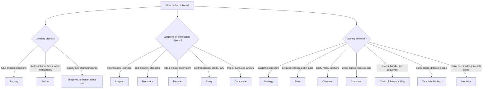

# 📘 Design Patterns for LLD

Patterns are named solutions to recurring design problems.
In an interview the goal is not to use as many as possible.
The goal is to recognize the requirement that says "this part will vary" and reach for the pattern that isolates it.

The [OOPS](/docs/oops) page already covers **Singleton, Factory, Strategy, Observer and Decorator** with JavaScript and Java examples.
This page gives the wider catalog, a way to choose, and runnable Java for ten more patterns.
Every Java block here compiles and runs as a single file.

## Table of Contents

1. [Catalog and Chooser](#1-catalog-and-chooser)
2. [Creational Patterns](#2-creational-patterns)
3. [Structural Patterns](#3-structural-patterns)
4. [Behavioral Patterns](#4-behavioral-patterns)
5. [TypeScript Versions](#5-typescript-versions)
6. [Anti-Patterns and Misuse](#6-anti-patterns-and-misuse)
7. [Patterns in the Machine Coding Problems](#7-patterns-in-the-machine-coding-problems)
8. [Questions and Answers](#8-questions-and-answers)

---

## 1. Catalog and Chooser

| Pattern | Category | Intent | Reach for it when | Typical LLD use |
| --- | --- | --- | --- | --- |
| **Singleton** | Creational | One instance, global access | Truly one shared resource | Logger registry, config (prefer injection) |
| **Factory Method / Simple Factory** | Creational | Create objects without naming the class | Type chosen at runtime | Vehicle, notification channel, shape |
| **Abstract Factory** | Creational | Create families of related objects | Swap a whole family (UI theme, database vendor) | Cross-platform widgets |
| **Builder** | Creational | Construct complex objects step by step | Many optional parameters, immutability | Request, query, report, pizza |
| **Prototype** | Creational | Clone existing objects | Costly creation, copies with tweaks | Game units, document templates |
| **Adapter** | Structural | Make one interface look like another | Wrap legacy or third-party API | Payment gateways, SDKs |
| **Decorator** | Structural | Add behavior dynamically by wrapping | Stackable optional features | Coffee toppings, logging or caching wrappers |
| **Facade** | Structural | One simple entry to a subsystem | Hide a complex workflow | Order placement, video converter |
| **Proxy** | Structural | Stand-in that controls access | Lazy load, cache, auth, remote | Caching proxy, rate-limit proxy |
| **Composite** | Structural | Treat a tree of objects uniformly | Part-whole hierarchies | File system, org chart, menu |
| **Strategy** | Behavioral | Swap algorithms at runtime | Several ways to do one thing | Pricing, allocation, sorting, payment |
| **Observer** | Behavioral | Notify dependents of changes | One-to-many updates | Pub/sub, event listeners, notifications |
| **State** | Behavioral | Behavior depends on state | Lifecycle with different rules per state | Vending machine, order, ATM, elevator |
| **Command** | Behavioral | Encapsulate a request as an object | Undo, queue, log, macro | Text editor, job queue, remote control |
| **Chain of Responsibility** | Behavioral | Pass a request along handlers | Multiple potential handlers, pipeline | Middleware, approval, cash dispenser |
| **Template Method** | Behavioral | Fixed skeleton, variable steps | Same algorithm, different details | Data import or export, game turns |
| **Mediator** | Behavioral | Central object coordinates peers | Many-to-many interactions | Chat room, air traffic control |
| **Iterator** | Behavioral | Traverse without exposing internals | Custom collections | Built into most languages |



Strategy, State and Command look alike structurally.
The difference is intent:

- **Strategy:** the client chooses an algorithm, and it stays until the client changes it.
- **State:** the object changes its own behavior as its state changes, and the states know the transitions.
- **Command:** a request is turned into an object so it can be stored, queued, undone.

---

## 2. Creational Patterns

### 2.1 Builder

Use when a constructor would have many parameters, many optional, or when you want an immutable object validated at creation.

```java
// runnable
import java.util.*;

final class HttpRequest {
    private final String method;
    private final String url;
    private final Map<String, String> headers;
    private final String body;
    private final int timeoutMs;

    private HttpRequest(Builder b) {
        this.method = b.method;
        this.url = b.url;
        this.headers = Map.copyOf(b.headers);
        this.body = b.body;
        this.timeoutMs = b.timeoutMs;
    }

    static Builder builder(String method, String url) {
        return new Builder(method, url);
    }

    static final class Builder {
        private final String method;
        private final String url;
        private final Map<String, String> headers = new LinkedHashMap<>();
        private String body;
        private int timeoutMs = 30_000;

        private Builder(String method, String url) {
            this.method = method;
            this.url = url;
        }
        Builder header(String k, String v) { headers.put(k, v); return this; }
        Builder body(String body) { this.body = body; return this; }
        Builder timeoutMs(int ms) { this.timeoutMs = ms; return this; }

        HttpRequest build() {
            if (url == null || url.isBlank()) throw new IllegalStateException("url required");
            if (method.equals("GET") && body != null) throw new IllegalStateException("GET cannot have a body");
            return new HttpRequest(this);
        }
    }

    @Override public String toString() {
        return method + " " + url + " headers=" + new TreeMap<>(headers) + " body=" + body + " timeout=" + timeoutMs;
    }
}

public class Main {
    public static void main(String[] args) {
        HttpRequest req = HttpRequest.builder("POST", "https://api.example.com/orders")
            .header("Content-Type", "application/json")
            .body("{\"item\":1}")
            .timeoutMs(5_000)
            .build();
        System.out.println(req);
        try {
            HttpRequest.builder("GET", "https://x.io").body("oops").build();
        } catch (IllegalStateException e) {
            System.out.println("rejected: " + e.getMessage());
        }
    }
}
```

The builder validates once in `build()`, and the result has only `final` fields.
In Java, a `record` covers simple immutable data, use a builder when there are many optional fields or cross-field validation.

### 2.2 Singleton, Without the Trap

Singletons hide dependencies and make tests hard.
Prefer creating one instance in `main` and **injecting** it.
If you must, the safest Java forms are an `enum` or the holder idiom:

```java
public enum AppConfig {
    INSTANCE;
    private final java.util.Map<String, String> values = new java.util.concurrent.ConcurrentHashMap<>();
    public String get(String key) { return values.get(key); }
    public void set(String key, String value) { values.put(key, value); }
}
```

Thread safety and the double-checked locking pitfalls are in [Concurrency in LLD](/docs/system-design/lld/concurrency-in-lld).

---

## 3. Structural Patterns

### 3.1 Adapter

Wrap a class whose interface does not match what your code expects.

```java
// runnable
interface PaymentProcessor {
    boolean charge(String customerId, long amountCents);
}

// Third-party or legacy class you cannot change
class LegacyGateway {
    String makePayment(String card, double dollars) {
        return dollars > 0 ? "OK" : "DECLINED";
    }
}

class LegacyGatewayAdapter implements PaymentProcessor {
    private final LegacyGateway gateway;
    LegacyGatewayAdapter(LegacyGateway gateway) { this.gateway = gateway; }

    @Override public boolean charge(String customerId, long amountCents) {
        String result = gateway.makePayment(customerId, amountCents / 100.0);
        return "OK".equals(result);
    }
}

public class Main {
    public static void main(String[] args) {
        PaymentProcessor p = new LegacyGatewayAdapter(new LegacyGateway());
        System.out.println(p.charge("cust-1", 2599));  // true
        System.out.println(p.charge("cust-1", 0));     // false
    }
}
```

### 3.2 Facade

Give callers one simple method that coordinates several subsystems.

```java
// runnable
class Inventory { boolean reserve(String sku, int qty) { System.out.println("reserved " + qty + " x " + sku); return true; } }
class Payments  { boolean charge(String user, long cents) { System.out.println("charged " + user + " " + cents); return true; } }
class Shipping  { String schedule(String user) { System.out.println("shipping scheduled"); return "TRACK-42"; } }

class OrderFacade {
    private final Inventory inventory = new Inventory();
    private final Payments payments = new Payments();
    private final Shipping shipping = new Shipping();

    String placeOrder(String user, String sku, int qty, long cents) {
        if (!inventory.reserve(sku, qty)) throw new IllegalStateException("out of stock");
        if (!payments.charge(user, cents)) throw new IllegalStateException("payment failed");
        return shipping.schedule(user);
    }
}

public class Main {
    public static void main(String[] args) {
        System.out.println(new OrderFacade().placeOrder("alice", "SKU-1", 2, 4999));
    }
}
```

A facade does not forbid direct use of the subsystems.
It is a convenience and a decoupling point.

### 3.3 Proxy

Same interface as the real object, but adds control: caching, lazy creation, access checks, rate limiting.

```java
// runnable
import java.util.*;

interface WeatherService {
    String forecast(String city);
}

class RealWeatherService implements WeatherService {
    int calls = 0;
    @Override public String forecast(String city) {
        calls++;                                    // pretend this is a slow network call
        return "Sunny in " + city;
    }
}

class CachingWeatherProxy implements WeatherService {
    private final WeatherService target;
    private final Map<String, String> cache = new HashMap<>();
    CachingWeatherProxy(WeatherService target) { this.target = target; }

    @Override public String forecast(String city) {
        return cache.computeIfAbsent(city, target::forecast);
    }
}

public class Main {
    public static void main(String[] args) {
        RealWeatherService real = new RealWeatherService();
        WeatherService svc = new CachingWeatherProxy(real);
        svc.forecast("Pune"); svc.forecast("Pune"); svc.forecast("Delhi");
        System.out.println("real calls: " + real.calls);   // 2
    }
}
```

Adapter changes the interface, Decorator adds behavior with the same interface, Proxy controls access with the same interface.

### 3.4 Composite

Treat a single object and a group of objects the same way.

```java
// runnable
import java.util.*;

interface OrgUnit {
    String name();
    long totalSalary();
}

record Employee(String name, long salary) implements OrgUnit {
    public long totalSalary() { return salary; }
}

class Team implements OrgUnit {
    private final String name;
    private final List<OrgUnit> members = new ArrayList<>();
    Team(String name) { this.name = name; }
    Team add(OrgUnit u) { members.add(u); return this; }
    public String name() { return name; }
    public long totalSalary() {
        return members.stream().mapToLong(OrgUnit::totalSalary).sum();
    }
}

public class Main {
    public static void main(String[] args) {
        Team backend = new Team("backend").add(new Employee("A", 100)).add(new Employee("B", 120));
        Team eng = new Team("eng").add(backend).add(new Employee("CTO", 300));
        System.out.println(eng.name() + " total = " + eng.totalSalary());   // 520
    }
}
```

The in-memory file system in [Machine Coding 2](/docs/system-design/lld/machine-coding-problems-2) is the classic composite.

---

## 4. Behavioral Patterns

### 4.1 State

The object delegates behavior to a state object, and states trigger transitions.
It replaces big `switch (state)` blocks that appear in every method.

```java
// runnable
interface DocState {
    void submit(Document d);
    void approve(Document d);
    void reject(Document d);
    String name();
}

class Draft implements DocState {
    public void submit(Document d) { d.setState(new InReview()); }
    public void approve(Document d) { throw new IllegalStateException("cannot approve a draft"); }
    public void reject(Document d)  { throw new IllegalStateException("cannot reject a draft"); }
    public String name() { return "DRAFT"; }
}
class InReview implements DocState {
    public void submit(Document d) { throw new IllegalStateException("already in review"); }
    public void approve(Document d) { d.setState(new Published()); }
    public void reject(Document d)  { d.setState(new Draft()); }
    public String name() { return "IN_REVIEW"; }
}
class Published implements DocState {
    public void submit(Document d) { throw new IllegalStateException("already published"); }
    public void approve(Document d) { throw new IllegalStateException("already published"); }
    public void reject(Document d)  { throw new IllegalStateException("already published"); }
    public String name() { return "PUBLISHED"; }
}

class Document {
    private DocState state = new Draft();
    void setState(DocState s) { this.state = s; }
    void submit()  { state.submit(this); }
    void approve() { state.approve(this); }
    void reject()  { state.reject(this); }
    String status() { return state.name(); }
}

public class Main {
    public static void main(String[] args) {
        Document doc = new Document();
        System.out.println(doc.status());          // DRAFT
        doc.submit();   System.out.println(doc.status());   // IN_REVIEW
        doc.reject();   System.out.println(doc.status());   // DRAFT
        doc.submit(); doc.approve();
        System.out.println(doc.status());          // PUBLISHED
        try { doc.submit(); } catch (IllegalStateException e) { System.out.println("error: " + e.getMessage()); }
    }
}
```

For very simple lifecycles an `enum` with an allowed-transition map is enough.
Use the State pattern when each state has meaningfully different behavior, as in the vending machine in [Machine Coding 1](/docs/system-design/lld/machine-coding-problems-1).

### 4.2 Command

Turn an action into an object with `execute` and `undo`.
Enables undo and redo, queues, logs and macros.

```java
// runnable
import java.util.*;

interface Command {
    void execute();
    void undo();
}

class Editor {
    final StringBuilder text = new StringBuilder();
}

class InsertCommand implements Command {
    private final Editor editor; private final int pos; private final String s;
    InsertCommand(Editor e, int pos, String s) { this.editor = e; this.pos = pos; this.s = s; }
    public void execute() { editor.text.insert(pos, s); }
    public void undo()    { editor.text.delete(pos, pos + s.length()); }
}

class DeleteCommand implements Command {
    private final Editor editor; private final int from, to; private String removed;
    DeleteCommand(Editor e, int from, int to) { this.editor = e; this.from = from; this.to = to; }
    public void execute() { removed = editor.text.substring(from, to); editor.text.delete(from, to); }
    public void undo()    { editor.text.insert(from, removed); }
}

class History {
    private final Deque<Command> done = new ArrayDeque<>();
    private final Deque<Command> undone = new ArrayDeque<>();
    void run(Command c) { c.execute(); done.push(c); undone.clear(); }
    void undo() { if (!done.isEmpty()) { Command c = done.pop(); c.undo(); undone.push(c); } }
    void redo() { if (!undone.isEmpty()) { Command c = undone.pop(); c.execute(); done.push(c); } }
}

public class Main {
    public static void main(String[] args) {
        Editor ed = new Editor();
        History h = new History();
        h.run(new InsertCommand(ed, 0, "Hello"));
        h.run(new InsertCommand(ed, 5, " World"));
        System.out.println(ed.text);      // Hello World
        h.run(new DeleteCommand(ed, 0, 6));
        System.out.println(ed.text);      // World
        h.undo(); System.out.println(ed.text);   // Hello World
        h.undo(); System.out.println(ed.text);   // Hello
        h.redo(); System.out.println(ed.text);   // Hello World
    }
}
```

### 4.3 Chain of Responsibility

A request passes along a chain of handlers, and each handles it or forwards it.
Middleware pipelines, approval workflows and the ATM cash dispenser are all chains.

```java
// runnable
abstract class Approver {
    private Approver next;
    Approver linkWith(Approver next) { this.next = next; return next; }

    final String approve(long amount) {
        if (canApprove(amount)) return name() + " approved " + amount;
        if (next == null) return "nobody can approve " + amount;
        return next.approve(amount);
    }
    protected abstract boolean canApprove(long amount);
    protected abstract String name();
}

class TeamLead extends Approver {
    protected boolean canApprove(long a) { return a <= 1_000; }
    protected String name() { return "TeamLead"; }
}
class Director extends Approver {
    protected boolean canApprove(long a) { return a <= 10_000; }
    protected String name() { return "Director"; }
}
class Vp extends Approver {
    protected boolean canApprove(long a) { return a <= 100_000; }
    protected String name() { return "VP"; }
}

public class Main {
    public static void main(String[] args) {
        Approver chain = new TeamLead();
        chain.linkWith(new Director()).linkWith(new Vp());
        System.out.println(chain.approve(500));        // TeamLead approved 500
        System.out.println(chain.approve(7_500));      // Director approved 7500
        System.out.println(chain.approve(50_000));     // VP approved 50000
        System.out.println(chain.approve(500_000));    // nobody can approve 500000
    }
}
```

### 4.4 Template Method

The base class fixes the algorithm skeleton, and subclasses fill in the steps.

```java
// runnable
import java.util.*;

abstract class Exporter {
    // the template: final so subclasses cannot reorder the steps
    public final String export(List<Map<String, Object>> rows) {
        StringBuilder out = new StringBuilder(header(rows));
        for (Map<String, Object> row : rows) out.append(formatRow(row));
        return out.append(footer()).toString();
    }
    protected abstract String header(List<Map<String, Object>> rows);
    protected abstract String formatRow(Map<String, Object> row);
    protected String footer() { return ""; }          // optional hook
}

class CsvExporter extends Exporter {
    protected String header(List<Map<String, Object>> rows) { return "id,name\n"; }
    protected String formatRow(Map<String, Object> r) { return r.get("id") + "," + r.get("name") + "\n"; }
}

class JsonLinesExporter extends Exporter {
    protected String header(List<Map<String, Object>> rows) { return ""; }
    protected String formatRow(Map<String, Object> r) {
        return "{\"id\":" + r.get("id") + ",\"name\":\"" + r.get("name") + "\"}\n";
    }
}

public class Main {
    public static void main(String[] args) {
        List<Map<String, Object>> rows = List.of(Map.of("id", 1, "name", "Ana"), Map.of("id", 2, "name", "Ben"));
        System.out.print(new CsvExporter().export(rows));
        System.out.print(new JsonLinesExporter().export(rows));
    }
}
```

Template Method uses inheritance.
If the variation should be swappable at runtime, use Strategy instead.

### 4.5 Mediator

Peers talk to a mediator instead of to each other, which removes many-to-many coupling.

```java
// runnable
import java.util.*;

class ChatRoom {
    private final Map<String, User> users = new LinkedHashMap<>();
    void join(User u) { users.put(u.name(), u); u.room = this; }
    void send(String from, String to, String msg) {
        if (to == null) {                                   // broadcast
            users.values().stream().filter(u -> !u.name().equals(from)).forEach(u -> u.receive(from, msg));
        } else {
            User target = users.get(to);
            if (target != null) target.receive(from, msg);
        }
    }
}

class User {
    private final String name;
    ChatRoom room;
    User(String name) { this.name = name; }
    String name() { return name; }
    void say(String msg) { room.send(name, null, msg); }
    void whisper(String to, String msg) { room.send(name, to, msg); }
    void receive(String from, String msg) { System.out.println(name + " got from " + from + ": " + msg); }
}

public class Main {
    public static void main(String[] args) {
        ChatRoom room = new ChatRoom();
        User a = new User("Ana"), b = new User("Ben"), c = new User("Cy");
        room.join(a); room.join(b); room.join(c);
        a.say("hello all");
        b.whisper("Cy", "psst");
    }
}
```

---

## 5. TypeScript Versions

Two patterns in TypeScript, runnable with Node's type stripping.
They use interfaces and closures instead of classes where that is idiomatic.

### 5.1 Command With Undo

```ts
// runnable
interface Command {
  execute(): void;
  undo(): void;
}

class Counter {
  value = 0;
}

const add = (c: Counter, n: number): Command => ({
  execute: () => { c.value += n; },
  undo: () => { c.value -= n; },
});

class History {
  private done: Command[] = [];
  run(cmd: Command) { cmd.execute(); this.done.push(cmd); }
  undo() { this.done.pop()?.undo(); }
}

const counter = new Counter();
const history = new History();
history.run(add(counter, 5));
history.run(add(counter, 3));
console.log(counter.value); // 8
history.undo();
console.log(counter.value); // 5
```

### 5.2 Chain of Responsibility as Middleware

```ts
// runnable
type Ctx = { user?: string; path: string; log: string[] };
type Next = () => void;
type Middleware = (ctx: Ctx, next: Next) => void;

function compose(chain: Middleware[]) {
  return (ctx: Ctx) => {
    const dispatch = (i: number): void => {
      if (i >= chain.length) return;
      chain[i](ctx, () => dispatch(i + 1));
    };
    dispatch(0);
  };
}

const logger: Middleware = (ctx, next) => { ctx.log.push('log ' + ctx.path); next(); };
const auth: Middleware = (ctx, next) => {
  if (!ctx.user) { ctx.log.push('401 stop'); return; }   // short-circuit the chain
  next();
};
const handler: Middleware = (ctx) => { ctx.log.push('200 ok for ' + ctx.user); };

const app = compose([logger, auth, handler]);
const a: Ctx = { path: '/a', log: [] };
const b: Ctx = { path: '/b', user: 'sam', log: [] };
app(a); app(b);
console.log(a.log); // [ 'log /a', '401 stop' ]
console.log(b.log); // [ 'log /b', '200 ok for sam' ]
```

This is the shape of Express, Koa and Redux middleware.

---

## 6. Anti-Patterns and Misuse

| Misuse | Why it hurts | Instead |
| --- | --- | --- |
| **Singleton everywhere** | Hidden global state, hard to test, concurrency hazards | Create once, inject |
| **Factory for one class** | Ceremony with no variation | `new` it |
| **Strategy for a constant** | Indirection with one implementation | Add the interface when a second one appears |
| **Deep inheritance to share code** | Fragile base class | Composition, Template Method with few levels |
| **God facade** | Facade grows into a manager with all logic | Facade delegates only |
| **Observer without unsubscribe** | Memory leaks, callbacks on dead objects | Explicit unsubscribe, weak references |
| **State pattern for two states** | Many classes for a boolean | Enum plus check |
| **Pattern names in class names** | `UserFactoryStrategyManager` says nothing | Name by domain meaning |

---

## 7. Patterns in the Machine Coding Problems

| Problem | Patterns used |
| --- | --- |
| Parking Lot | Strategy (allocation, fee), Factory |
| LRU Cache | Doubly linked list plus map, Strategy for eviction |
| Elevator | State, Strategy (dispatch) |
| Vending Machine | State, Chain (change making) |
| Tic-Tac-Toe | Strategy for players, State for game status |
| Logger | Singleton or registry, Chain or Observer for appenders, Strategy for formatters |
| Movie Booking | State (seat), Strategy (payment), Observer |
| Splitwise | Strategy (split types) |
| Pub/Sub Broker | Observer, Mediator |
| Rate Limiter | Strategy, Factory |
| ATM | State, Chain of Responsibility, Facade |
| File System | Composite, Iterator, Visitor for traversal |

---

## 8. Questions and Answers

**Q1. Strategy or State?**
Strategy: the caller picks an interchangeable algorithm.
State: the object switches its own behavior as it moves through a lifecycle, and the states usually know the next state.

**Q2. Decorator or inheritance?**
Decorator when features combine in many ways and should be added at runtime (compression plus encryption plus logging).
Inheritance would need a class for every combination.

**Q3. What is wrong with Singleton?**
It is global mutable state in disguise: hidden dependencies, order-of-initialization problems, difficult testing and thread-safety risk.
Prefer dependency injection with a single instance created at the composition root.

**Q4. When is Builder better than a constructor?**
With many optional parameters, when you want immutability with validation across fields, or when construction is stepwise.
For three required fields a constructor is fine.

**Q5. How does Observer differ from Pub/Sub?**
Observer is direct: the subject holds references to observers and calls them.
Pub/Sub adds a broker between publishers and subscribers, so they do not know each other and can be decoupled in time and space.

**Q6. Where do you see Chain of Responsibility in real systems?**
Servlet filters, Express and Koa middleware, logging levels and appenders, exception handler chains, and approval workflows.

**Q7. Command vs Strategy?**
Command represents a request (with a receiver and parameters) that can be stored, queued and undone.
Strategy represents an algorithm choice, with no need to store the invocation.

**Q8. How do you keep a State-pattern design from exploding in class count?**
Only introduce it when behavior per state differs meaningfully, let states share a base class for default behavior, and keep transitions in one place.

Next: [Machine Coding 1](/docs/system-design/lld/machine-coding-problems-1) applies these patterns to complete problems.
