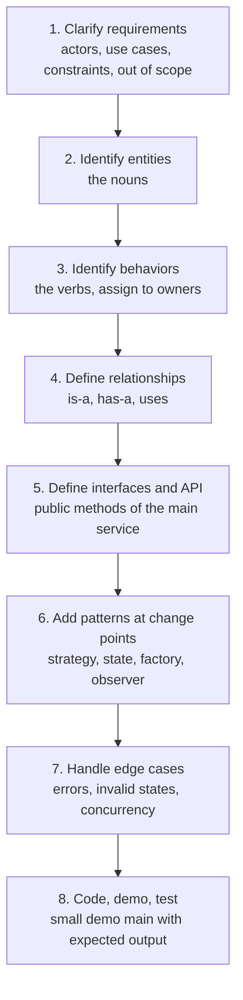
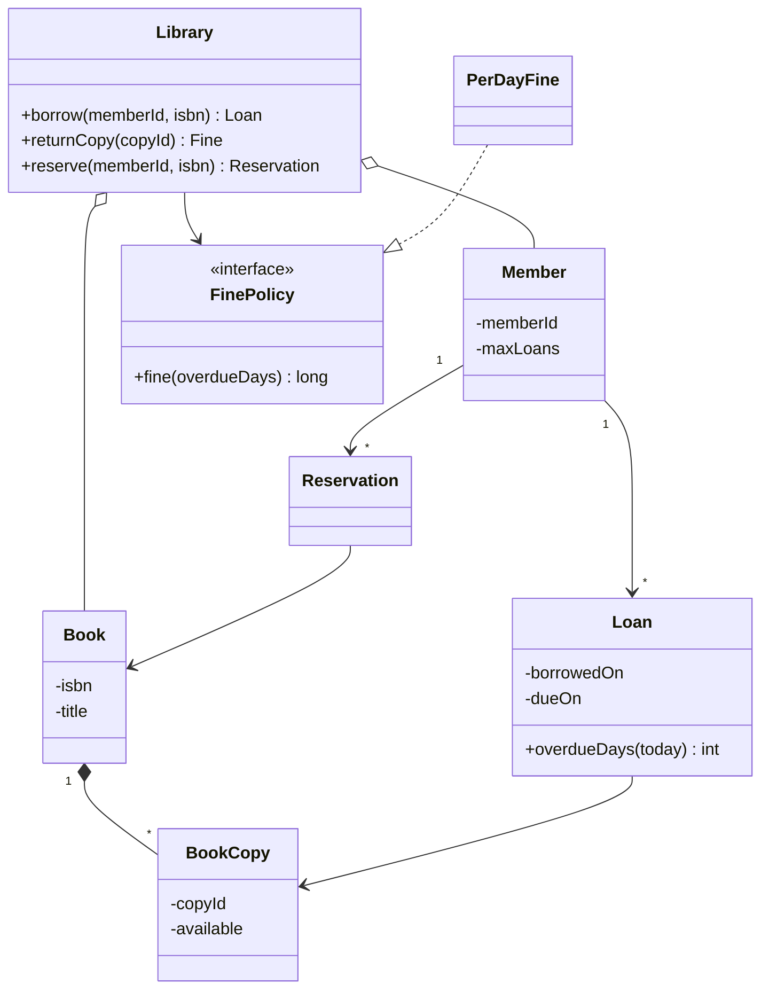
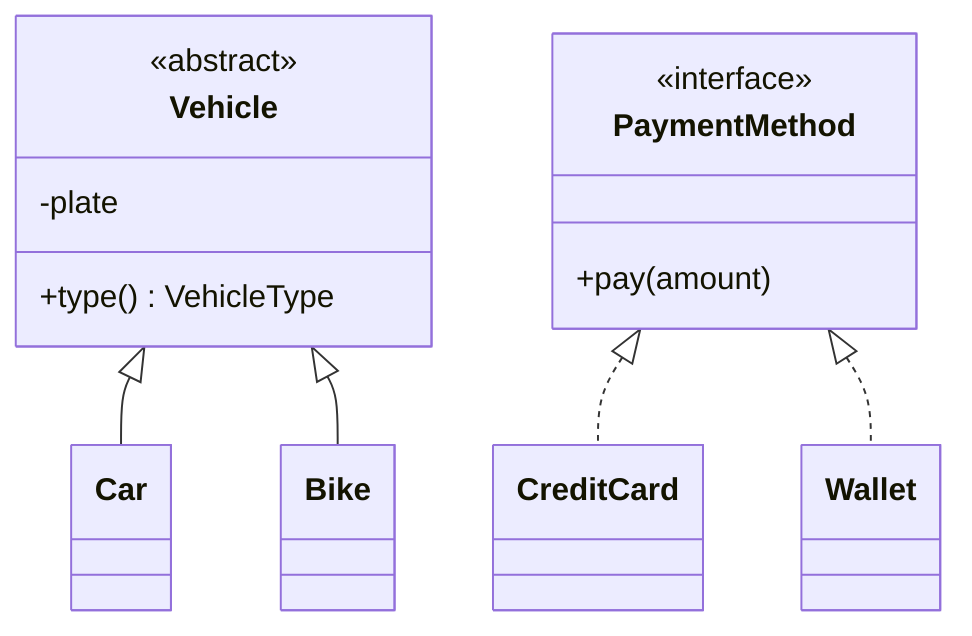
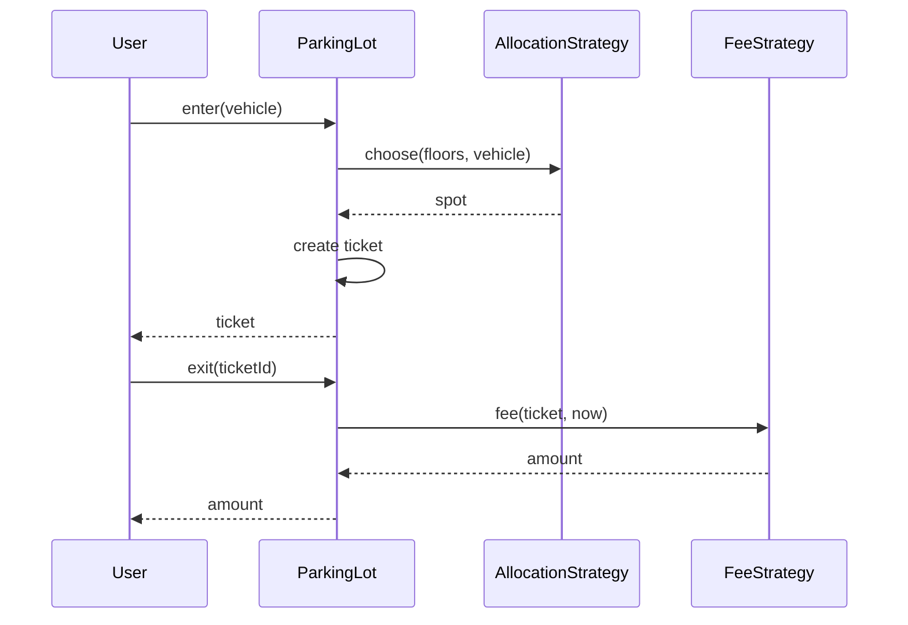
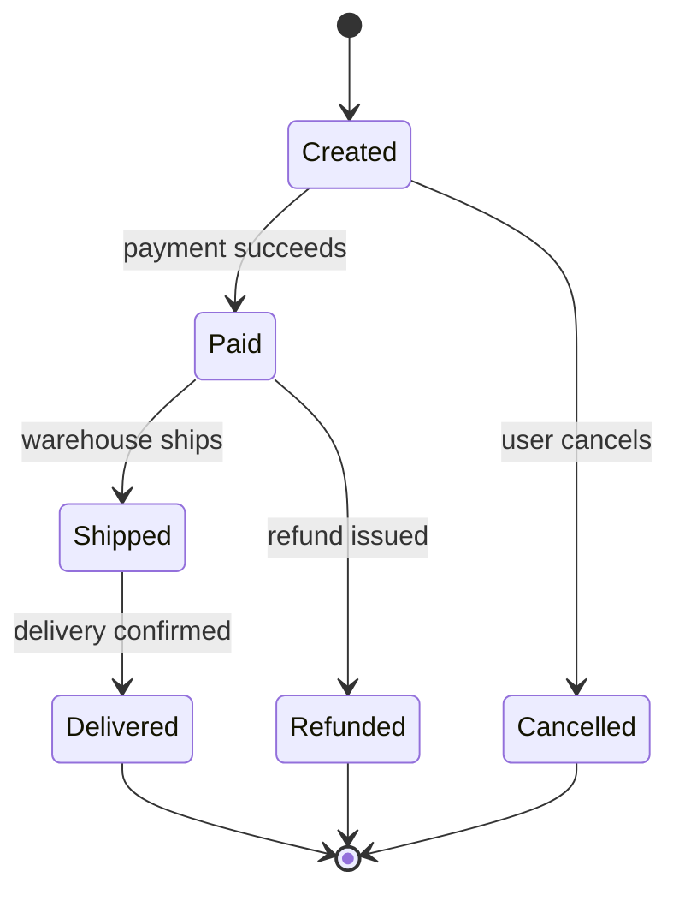

# 📘 LLD Fundamentals

Low-level design turns a vague product description into a set of classes and interfaces that are correct today and easy to extend tomorrow.
In a machine coding round you also have to make it run, usually in 60 to 90 minutes, with clean code and a demo.
This page gives a repeatable method, the diagram vocabulary, and the principles interviewers look for.

## Table of Contents

1. [What LLD Interviews Test](#1-what-lld-interviews-test)
2. [The 8-Step Method](#2-the-8-step-method)
3. [From Requirements to Classes](#3-from-requirements-to-classes)
4. [UML With Mermaid](#4-uml-with-mermaid)
5. [Principles in Practice](#5-principles-in-practice)
6. [Code Quality Checklist](#6-code-quality-checklist)
7. [Common Mistakes](#7-common-mistakes)
8. [A 60-Minute Plan](#8-a-60-minute-plan)
9. [Questions and Answers](#9-questions-and-answers)

---

## 1. What LLD Interviews Test

| Skill | What the interviewer looks for |
| --- | --- |
| **Requirement handling** | You ask about scope, actors, edge cases before designing |
| **Object modeling** | Sensible classes with single responsibilities, not one giant class or a class per verb |
| **Abstraction** | Interfaces at the points that will change (pricing, allocation, notification) |
| **Extensibility** | Adding a new vehicle type or payment method touches one place |
| **Correctness** | State transitions, invalid input, boundary cases, concurrency where relevant |
| **Working code** | Compiles, runs a demo, small readable methods |
| **Communication** | You explain trade-offs and why you did not use a pattern |

Difference from HLD: no networks, shards or queues (unless a component is one).
The unit of design is the class, the dependency, and the object lifecycle.

---

## 2. The 8-Step Method



1. **Clarify.** "Single or multi-floor? Which vehicle types? Fees by hour or flat? Concurrent users? Persistence needed?" Write the agreed scope at the top of your notes.
2. **Entities.** Underline nouns in the requirements. Keep those that hold state or behavior. Ignore those that are just fields.
3. **Behaviors.** For each verb decide which object should own it. Put behavior with the data it needs (information expert).
4. **Relationships.** Inheritance only for true is-a with shared behavior, otherwise composition. Draw a small class diagram.
5. **API.** Write the entry-point class first (`ParkingLot.enter`, `Cache.get`) as it will be used. Then fill in the internals.
6. **Patterns.** Add an abstraction only where a requirement says "different rules" or "may change". If nothing varies, do not add a pattern.
7. **Edge cases.** Invalid input, full capacity, double actions, expired state, thread safety if multiple actors are mentioned.
8. **Run it.** A `main` that exercises the happy path and two failure cases, printing results.

---

## 3. From Requirements to Classes

Example requirement:

> A library lets members borrow books. Each book can have several copies. A member can hold at most 5 books for 14 days. Late returns are charged a fine per day. Members can reserve a book that is out.

**Nouns:** library, member, book, copy, loan, reservation, fine.
**Verbs:** borrow, return, reserve, calculate fine.
**Decisions:**

- `Book` (title, isbn) is a catalog entry, `BookCopy` is a physical item that can be loaned. Separating them avoids a `count` field that hides identity.
- `Loan` links a `Member` and a `BookCopy` with dates. It owns `dueDate` and can compute `overdueDays(now)`.
- Fine rules may change (per day, capped, per member type), so put them behind a `FinePolicy` interface.
- `Reservation` queue per book with notification when a copy returns (Observer).
- `Library` is the facade with `borrow(memberId, isbn)`, `returnCopy(copyId)`, `reserve(memberId, isbn)`.



Heuristics:

- A class with the word "Manager", "Handler" or "Util" and ten unrelated methods is a smell.
- A field that is only ever a string of a fixed set of values wants an `enum`.
- A number with a unit (money, distance) wants a small value type or at least a clear naming convention (cents as `long`).
- If two classes always change together, they may be one class.

---

## 4. UML With Mermaid

You will be asked to sketch diagrams, and Mermaid is a fast way to keep them in your notes.
The OOPS page explains the relationships in prose: [UML Relationships](/docs/oops).

### 4.1 Class Diagram Relationships

| Relationship | Meaning | Mermaid | Example |
| --- | --- | --- | --- |
| Association | A uses or knows B | `A --> B` | Order to Customer |
| Aggregation | A has B, B can exist alone | `A o-- B` | Team has Players |
| Composition | A owns B, B dies with A | `A *-- B` | House has Rooms |
| Inheritance | A is a kind of B | `B <\|-- A` | Car extends Vehicle |
| Realization | A implements interface B | `A ..\|> B` | CreditCard implements PaymentMethod |
| Dependency | A uses B temporarily | `A ..> B` | Service uses a Validator in one method |

Visibility markers: `+` public, `-` private, `#` protected.
Multiplicity: `"1"`, `"*"`, `"0..1"`.



### 4.2 Sequence Diagram

Shows the order of calls for one use case.
Use it to check that responsibilities make sense.



### 4.3 State Diagram

Use for objects with a lifecycle: order, vending machine, elevator, booking.



When a lifecycle appears, list the valid transitions and reject the invalid ones explicitly.

---

## 5. Principles in Practice

### 5.1 SOLID, Applied

| Principle | LLD meaning | Smell it fixes |
| --- | --- | --- |
| **S** Single Responsibility | A class has one reason to change: `Ticket` holds data, `FeeStrategy` computes fees | God class that parks, bills and prints |
| **O** Open/Closed | Add behavior by adding a class, not editing a switch | Growing `if type == ...` chains |
| **L** Liskov Substitution | Subclasses honor the parent's contract | `Penguin extends Bird` with `fly()` throwing |
| **I** Interface Segregation | Small role-based interfaces | An interface where implementers leave methods empty |
| **D** Dependency Inversion | Depend on abstractions, inject them | `new MySqlRepo()` inside the service, impossible to test |

Full explanations with JavaScript and Java examples are in [OOPS](/docs/oops).

The runnable example below removes a type switch (Open/Closed) and injects the rule (Dependency Inversion):

```java
// runnable
import java.util.*;

interface DiscountPolicy {
    double apply(double amount);
}

class Checkout {
    private final Map<String, DiscountPolicy> policies;

    Checkout(Map<String, DiscountPolicy> policies) {
        this.policies = policies;
    }

    double total(String customerTier, double amount) {
        DiscountPolicy policy = policies.getOrDefault(customerTier, a -> a);
        return policy.apply(amount);
    }
}

public class Main {
    public static void main(String[] args) {
        Checkout checkout = new Checkout(Map.of(
            "GOLD", a -> a * 0.90,
            "PLATINUM", a -> a * 0.80
        ));
        System.out.println(checkout.total("REGULAR", 100));   // 100.0
        System.out.println(checkout.total("GOLD", 100));      // 90.0
        System.out.println(checkout.total("PLATINUM", 100));  // 80.0
        // A new tier is a new map entry. Checkout never changes.
    }
}
```

### 5.2 Other Principles

| Principle | One line |
| --- | --- |
| **Composition over inheritance** | Assemble behavior from parts (`has-a`) instead of deep class trees |
| **Program to an interface** | Declare variables as `List`, `PaymentMethod`, not the concrete type |
| **DRY** | One authoritative place for each rule |
| **KISS and YAGNI** | Do not build for requirements nobody stated. Add the seam, not the feature |
| **Law of Demeter** | Talk to friends, not strangers: `a.getB().getC().doIt()` means a is coupled to C |
| **Tell, do not ask** | Call `account.withdraw(x)` rather than reading the balance and deciding outside |
| **Immutability** | Immutable value objects (`record`) are simpler and thread safe |
| **High cohesion, low coupling** | Related things together, few dependencies between modules |
| **Fail fast** | Validate in constructors and at boundaries, throw clear exceptions |

---

## 6. Code Quality Checklist

- Names say intent: `findAvailableSpot`, not `process`.
- Methods do one thing and fit on a screen.
- No primitives for domain concepts when it matters (`VehicleType` enum, `Money` as cents).
- Constructors establish valid objects. Prefer `final` fields.
- Dependencies injected through constructors, time (`Clock`) and randomness injected for testability.
- Return `Optional` for "may not exist", exceptions for real errors, and never return null collections.
- Public API small, everything else `private` or package-private.
- No global mutable state. If you must have a singleton, justify it.
- Errors have meaningful types (`ParkingFullException`), not generic `RuntimeException("error")`.
- A demo `main` or a few tests prove the behavior.

---

## 7. Common Mistakes

| Mistake | Better |
| --- | --- |
| Starting to code before clarifying | Spend the first 5 to 8 minutes on scope |
| Pattern name-dropping | Use a pattern only for a stated variation, and say why |
| Deep inheritance trees | Interfaces plus composition |
| Anemic classes (all getters, logic in a manager) | Move behavior next to data |
| Ignoring invalid states | Model states and reject illegal transitions |
| Forgetting concurrency when actors are concurrent | Say what is shared, add a lock at the right granularity |
| Overbuilding (databases, REST layers) | Keep it in memory unless asked |
| Silent failure | Throw or return a result type, never swallow |
| Untestable time and randomness | Inject `Clock` and `Random` |

---

## 8. A 60-Minute Plan

| Minutes | Activity |
| --- | --- |
| 0 to 8 | Clarify requirements, write the scope, list entities and use cases |
| 8 to 15 | Class diagram, main API, identify the two or three extension points |
| 15 to 45 | Code: enums and value types, core entities, strategy interfaces, the service class |
| 45 to 55 | Demo `main`, edge cases, fix bugs |
| 55 to 60 | Discuss extensions: concurrency, persistence, new requirements |

If time is short, code the core flow end to end first and describe the rest.
A small working solution beats a large unfinished one.

---

## 9. Questions and Answers

**Q1. When do you use an interface and when an abstract class?**
An interface defines a capability or contract with no shared state, and a class can implement several.
An abstract class shares state or partial implementation among closely related subclasses.
Prefer interfaces, and use default methods or composition for shared code.

**Q2. How do you decide between inheritance and composition?**
Use inheritance only for a true is-a relationship where the subclass honors the parent's contract.
Use composition when you want to reuse behavior or vary it at runtime, which is most cases.

**Q3. How do you make a design extensible without overengineering?**
Identify what is likely to vary from the requirements (pricing, allocation, notification), put an interface exactly there, and write the simplest implementation now.
Do not abstract things that have one obvious implementation.

**Q4. How do you handle time in a design?**
Inject a `Clock` or a time supplier so tests can control it.
Store instants in UTC, compute durations from instants, and never call `now()` deep inside logic.

**Q5. Where does validation belong?**
At the boundary (public methods of the service) for external input, and in constructors for invariants of domain objects.
Inner code can then trust its inputs.

**Q6. How do you show state machines in code?**
An `enum` state with a transition check for simple cases, or the State pattern with one class per state when each state has different behavior, see [Design Patterns](/docs/system-design/lld/design-patterns).

**Q7. What do you do if requirements are ambiguous?**
Ask, state your assumption out loud, write it down, and design so that changing the assumption is cheap.

Next: [Design Patterns](/docs/system-design/lld/design-patterns).
