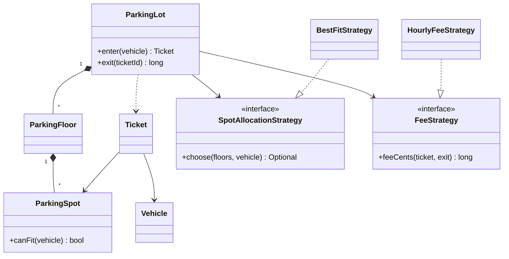
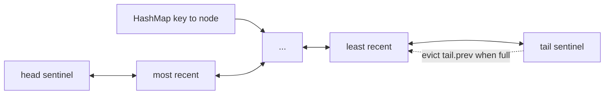
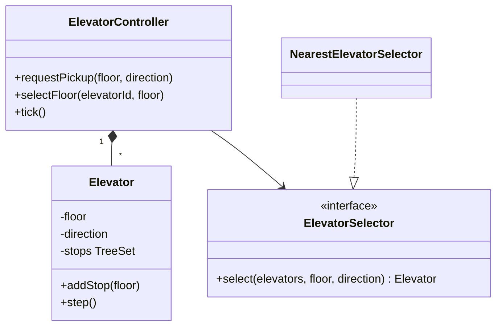
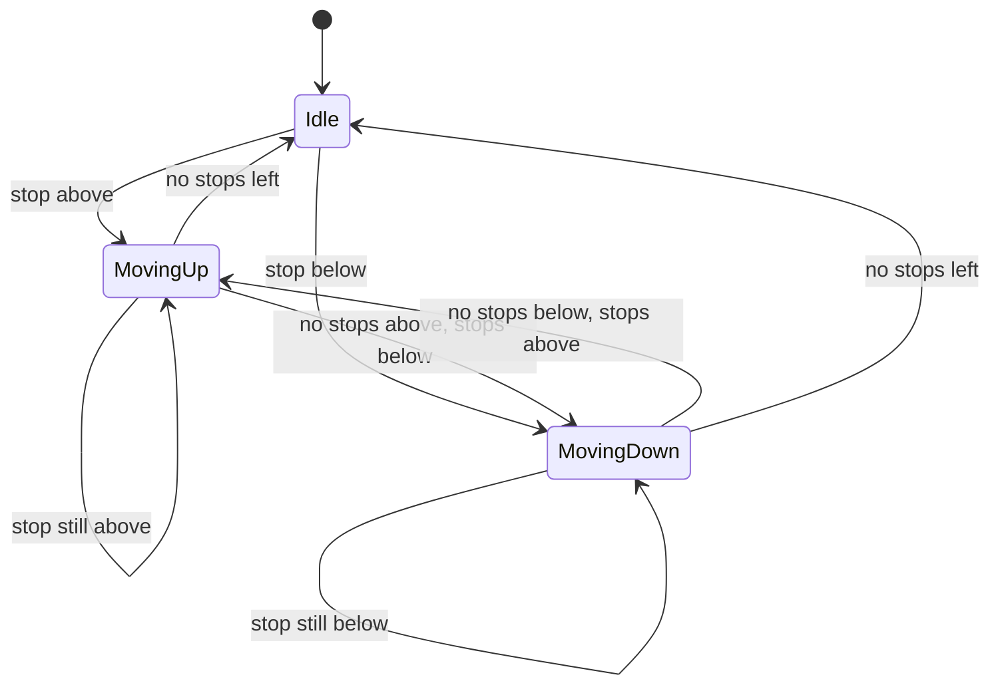
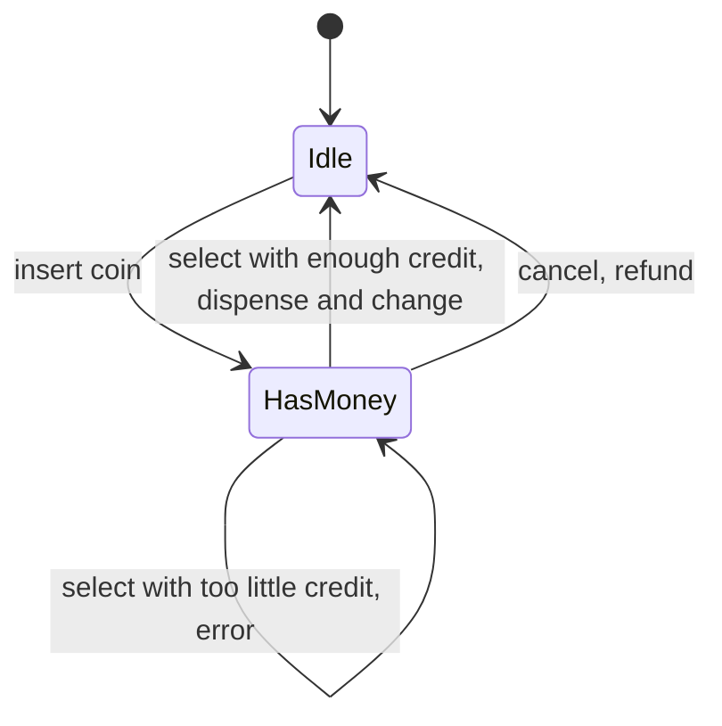
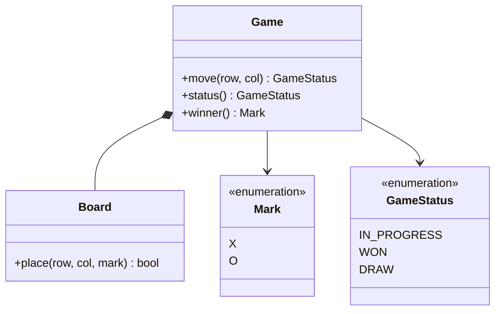
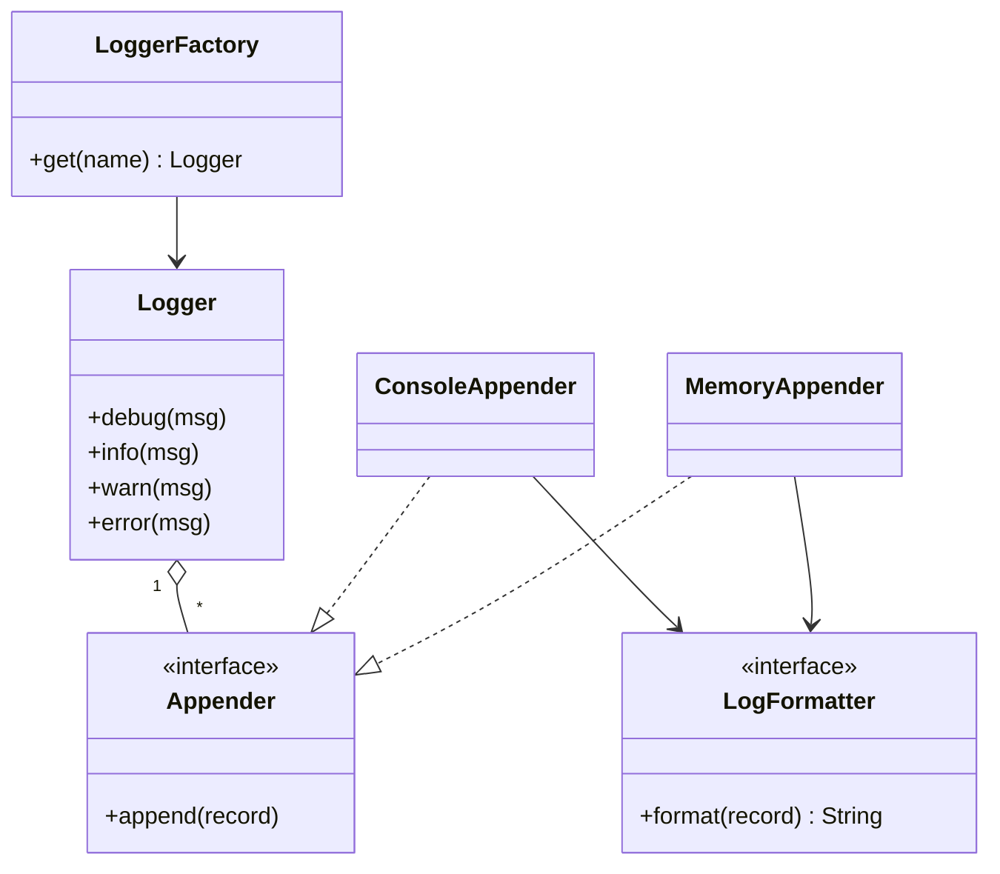

# 📘 Machine Coding Problems, Part 1

Each problem follows the same shape: requirements and scope, a class diagram, the design decisions, complete Java that compiles and runs, and extensions an interviewer is likely to ask.
Times are injected and randomness is avoided so the demo output is deterministic.
Java 17 is assumed (records, `var`, switch expressions).

## Table of Contents

1. [Parking Lot](#1-parking-lot)
2. [LRU Cache](#2-lru-cache)
3. [Elevator System](#3-elevator-system)
4. [Vending Machine](#4-vending-machine)
5. [Tic-Tac-Toe](#5-tic-tac-toe)
6. [Logger Framework](#6-logger-framework)

---

## 1. Parking Lot

### 1.1 Requirements

- Multiple floors, each with spots of size bike, car or truck.
- A vehicle enters and gets a ticket with an assigned spot. On exit the fee is computed from the time spent.
- A larger spot can fit a smaller vehicle, but prefer the smallest that fits.
- Reject a vehicle when nothing fits, and reject the same plate entering twice.
- Out of scope: payment integration, persistence, multiple entry gates (ask if needed).

### 1.2 Design



Decisions:

- **Strategy** for spot allocation and for fees, since both are the likely variations (nearest to entrance, cheapest, per-minute pricing, weekend rates).
- Size is an enum, and its ordinal expresses "fits", so adding a size is one line.
- Time and money are explicit: the clock is injected, money is `long` cents.
- The lot's public methods are `synchronized` because two gates can call it concurrently. Finer locking is discussed in [Concurrency in LLD](/docs/system-design/lld/concurrency-in-lld).

### 1.3 Code

```java
// runnable
import java.time.*;
import java.util.*;
import java.util.function.Supplier;

enum VehicleType { BIKE, CAR, TRUCK }        // ordinal doubles as size order

record Vehicle(String plate, VehicleType type) {}

class ParkingFullException extends RuntimeException {
    ParkingFullException(String msg) { super(msg); }
}

class ParkingSpot {
    private final String id;
    private final VehicleType size;
    private Vehicle parked;

    ParkingSpot(String id, VehicleType size) { this.id = id; this.size = size; }
    boolean canFit(Vehicle v) { return parked == null && size.ordinal() >= v.type().ordinal(); }
    void park(Vehicle v) {
        if (!canFit(v)) throw new IllegalStateException("spot " + id + " cannot fit " + v.plate());
        parked = v;
    }
    void vacate() { parked = null; }
    String id() { return id; }
    VehicleType size() { return size; }
}

class ParkingFloor {
    private final int number;
    private final List<ParkingSpot> spots = new ArrayList<>();
    ParkingFloor(int number) { this.number = number; }
    ParkingFloor addSpot(VehicleType size) {
        spots.add(new ParkingSpot("F" + number + "-" + (spots.size() + 1), size));
        return this;
    }
    List<ParkingSpot> spots() { return spots; }
}

record Ticket(String id, Vehicle vehicle, ParkingSpot spot, Instant entry) {}

interface SpotAllocationStrategy {
    Optional<ParkingSpot> choose(List<ParkingFloor> floors, Vehicle v);
}

/** Smallest spot that fits, lowest floor first. Keeps big spots free for big vehicles. */
class BestFitStrategy implements SpotAllocationStrategy {
    public Optional<ParkingSpot> choose(List<ParkingFloor> floors, Vehicle v) {
        ParkingSpot best = null;
        for (ParkingFloor f : floors)
            for (ParkingSpot s : f.spots())
                if (s.canFit(v) && (best == null || s.size().ordinal() < best.size().ordinal())) best = s;
        return Optional.ofNullable(best);
    }
}

interface FeeStrategy {
    long feeCents(Ticket t, Instant exit);
}

class HourlyFeeStrategy implements FeeStrategy {
    private final Map<VehicleType, Long> centsPerHour;
    HourlyFeeStrategy(Map<VehicleType, Long> centsPerHour) { this.centsPerHour = centsPerHour; }
    public long feeCents(Ticket t, Instant exit) {
        long minutes = Math.max(1, Duration.between(t.entry(), exit).toMinutes());
        long hours = (minutes + 59) / 60;                       // round up, minimum one hour
        return hours * centsPerHour.get(t.vehicle().type());
    }
}

class ParkingLot {
    private final List<ParkingFloor> floors;
    private final SpotAllocationStrategy allocation;
    private final FeeStrategy fees;
    private final Supplier<Instant> clock;
    private final Map<String, Ticket> active = new HashMap<>();
    private final Set<String> platesInside = new HashSet<>();
    private int nextTicket = 1;

    ParkingLot(List<ParkingFloor> floors, SpotAllocationStrategy allocation, FeeStrategy fees, Supplier<Instant> clock) {
        this.floors = floors; this.allocation = allocation; this.fees = fees; this.clock = clock;
    }

    synchronized Ticket enter(Vehicle v) {
        if (!platesInside.add(v.plate())) throw new IllegalStateException(v.plate() + " is already inside");
        Optional<ParkingSpot> spot = allocation.choose(floors, v);
        if (spot.isEmpty()) {
            platesInside.remove(v.plate());
            throw new ParkingFullException("no spot for " + v.type());
        }
        spot.get().park(v);
        Ticket t = new Ticket("T" + nextTicket++, v, spot.get(), clock.get());
        active.put(t.id(), t);
        return t;
    }

    synchronized long exit(String ticketId) {
        Ticket t = active.remove(ticketId);
        if (t == null) throw new IllegalArgumentException("unknown ticket " + ticketId);
        t.spot().vacate();
        platesInside.remove(t.vehicle().plate());
        return fees.feeCents(t, clock.get());
    }
}

public class Main {
    public static void main(String[] args) {
        Instant[] now = { Instant.parse("2026-01-01T10:00:00Z") };
        List<ParkingFloor> floors = List.of(
            new ParkingFloor(1).addSpot(VehicleType.BIKE).addSpot(VehicleType.CAR).addSpot(VehicleType.CAR),
            new ParkingFloor(2).addSpot(VehicleType.TRUCK));
        ParkingLot lot = new ParkingLot(floors, new BestFitStrategy(),
            new HourlyFeeStrategy(Map.of(VehicleType.BIKE, 50L, VehicleType.CAR, 100L, VehicleType.TRUCK, 200L)),
            () -> now[0]);

        Ticket bike = lot.enter(new Vehicle("B-1", VehicleType.BIKE));
        Ticket car1 = lot.enter(new Vehicle("C-1", VehicleType.CAR));
        Ticket car2 = lot.enter(new Vehicle("C-2", VehicleType.CAR));
        Ticket car3 = lot.enter(new Vehicle("C-3", VehicleType.CAR));   // car spots full, takes the truck spot
        System.out.println(bike.spot().id() + " " + car1.spot().id() + " " + car2.spot().id() + " " + car3.spot().id());
        try { lot.enter(new Vehicle("C-4", VehicleType.CAR)); }
        catch (ParkingFullException e) { System.out.println("full: " + e.getMessage()); }

        now[0] = now[0].plus(Duration.ofMinutes(150));                  // 2h30
        System.out.println("fee car1 cents: " + lot.exit(car1.id()));   // 3 hours x 100
        Ticket car4 = lot.enter(new Vehicle("C-4", VehicleType.CAR));   // freed spot is reused
        System.out.println("C-4 parked at " + car4.spot().id());
    }
}
```

### 1.4 Extensions

- **Nearest to entrance:** a different `SpotAllocationStrategy` using spot coordinates. No other class changes.
- **Reserved or EV spots:** add a `SpotType` and a filter in the strategy.
- **Multiple gates and concurrency:** lock per spot size or use a concurrent set of free spots per size for O(1) allocation instead of scanning.
- **Free-spot indexing:** keep `Map<VehicleType, Deque<ParkingSpot>>` of free spots so `enter` is O(1).
- **Payment and receipts:** a `PaymentService` interface called from `exit`. Surge pricing is another `FeeStrategy`.
- **Lost ticket:** fee policy by vehicle plate lookup.

---

## 2. LRU Cache

### 2.1 Requirements

- `get(key)` and `put(key, value)` in O(1).
- Fixed capacity. When full, evict the **least recently used** entry.
- Both `get` and `put` count as a use.
- Optionally thread safe.

### 2.2 Design

A hash map gives O(1) lookup, a **doubly linked list** gives O(1) reordering and eviction.
The map points to list nodes.
The head side holds the most recent, the tail side the least recent.



Sentinel nodes avoid null checks at the ends.
A simpler Java answer uses `LinkedHashMap` in access order, and you should mention it, then show you can build the primitive yourself.

### 2.3 Code

```java
// runnable
import java.util.*;

class LRUCache<K, V> {
    private static final class Node<K, V> {
        final K key; V value; Node<K, V> prev, next;
        Node(K key, V value) { this.key = key; this.value = value; }
    }

    private final int capacity;
    private final Map<K, Node<K, V>> map = new HashMap<>();
    private final Node<K, V> head = new Node<>(null, null);   // sentinel, most recent is head.next
    private final Node<K, V> tail = new Node<>(null, null);   // sentinel, least recent is tail.prev

    LRUCache(int capacity) {
        if (capacity <= 0) throw new IllegalArgumentException("capacity must be positive");
        this.capacity = capacity;
        head.next = tail;
        tail.prev = head;
    }

    public synchronized V get(K key) {
        Node<K, V> n = map.get(key);
        if (n == null) return null;
        unlink(n);
        addFirst(n);
        return n.value;
    }

    public synchronized void put(K key, V value) {
        Node<K, V> n = map.get(key);
        if (n != null) {
            n.value = value;
            unlink(n);
            addFirst(n);
            return;
        }
        if (map.size() == capacity) {
            Node<K, V> lru = tail.prev;
            unlink(lru);
            map.remove(lru.key);
        }
        n = new Node<>(key, value);
        map.put(key, n);
        addFirst(n);
    }

    public synchronized int size() { return map.size(); }

    private void unlink(Node<K, V> n) { n.prev.next = n.next; n.next.prev = n.prev; }
    private void addFirst(Node<K, V> n) {
        n.next = head.next; n.prev = head;
        head.next.prev = n; head.next = n;
    }

    @Override public synchronized String toString() {
        StringBuilder sb = new StringBuilder("[");
        for (Node<K, V> n = head.next; n != tail; n = n.next) {
            sb.append(n.key).append('=').append(n.value);
            if (n.next != tail) sb.append(", ");
        }
        return sb.append(']').toString();
    }
}

/** The one-liner version using the JDK. */
class SimpleLru<K, V> extends LinkedHashMap<K, V> {
    private final int capacity;
    SimpleLru(int capacity) { super(16, 0.75f, true); this.capacity = capacity; }   // true = access order
    @Override protected boolean removeEldestEntry(Map.Entry<K, V> eldest) { return size() > capacity; }
}

public class Main {
    public static void main(String[] args) {
        LRUCache<String, Integer> c = new LRUCache<>(2);
        c.put("a", 1); c.put("b", 2);
        System.out.println(c);                 // [b=2, a=1]
        c.get("a");
        System.out.println(c);                 // [a=1, b=2]
        c.put("c", 3);                         // evicts b, the least recently used
        System.out.println(c + " b=" + c.get("b"));   // [c=3, a=1] b=null

        SimpleLru<String, Integer> s = new SimpleLru<>(2);
        s.put("x", 1); s.put("y", 2); s.get("x"); s.put("z", 3);
        System.out.println(s.keySet());        // [x, z]
    }
}
```

### 2.4 Extensions

- **Thread safety:** the `synchronized` methods are correct and serialize all access. For throughput, stripe the cache into N segments by key hash (each its own LRU and lock), or use a library such as Caffeine.
- **TTL:** store an expiry in each node, treat expired entries as misses on read, and purge lazily or by a background sweeper.
- **Pluggable eviction:** introduce `EvictionPolicy` with `onAccess(key)`, `onInsert(key)`, `evict()` and implement LRU, LFU, FIFO. LFU in O(1) uses a map from frequency to an ordered set of keys plus a `minFreq` counter.
- **Loading cache:** `get(key, loader)` computes on miss with single-flight so concurrent misses trigger one load.
- **Metrics:** hit ratio, evictions, size.

---

## 3. Elevator System

### 3.1 Requirements

- N elevators serving M floors.
- **Hall calls:** a person on a floor presses up or down. **Car calls:** a passenger inside presses a destination floor.
- Assign hall calls to the most suitable elevator.
- Each elevator serves stops in its direction of travel before reversing (the SCAN or "elevator" algorithm).
- Simulate with a `tick()` that advances time by one step.

### 3.2 Design





Decisions:

- Each elevator keeps its pending stops in a **sorted set**. `higher(floor)` and `lower(floor)` give the next stop up or down in O(log n), which makes SCAN trivial.
- Dispatch is a **Strategy**. The default picks the lowest cost: distance, with a penalty if the elevator is moving away from the caller.
- The simulation is step based, so the design is deterministic and testable without threads. A real system would run each elevator in its own thread or event loop, see [Concurrency in LLD](/docs/system-design/lld/concurrency-in-lld).

### 3.3 Code

```java
// runnable
import java.util.*;

enum Direction { UP, DOWN, IDLE }

class Elevator {
    private final int id;
    private int floor = 0;
    private Direction dir = Direction.IDLE;
    private final TreeSet<Integer> stops = new TreeSet<>();

    Elevator(int id) { this.id = id; }
    int id() { return id; }
    int floor() { return floor; }
    Direction direction() { return dir; }
    boolean idle() { return stops.isEmpty(); }
    void addStop(int f) { stops.add(f); }

    void step() {
        if (stops.remove(floor)) System.out.println("E" + id + " opens door at floor " + floor);
        if (stops.isEmpty()) { dir = Direction.IDLE; return; }
        if (dir == Direction.IDLE) dir = stops.first() > floor ? Direction.UP : Direction.DOWN;
        if (dir == Direction.UP && stops.higher(floor) == null) dir = Direction.DOWN;
        else if (dir == Direction.DOWN && stops.lower(floor) == null) dir = Direction.UP;
        floor += dir == Direction.UP ? 1 : -1;
    }
}

interface ElevatorSelector {
    Elevator select(List<Elevator> elevators, int floor, Direction wanted);
}

class NearestElevatorSelector implements ElevatorSelector {
    public Elevator select(List<Elevator> elevators, int floor, Direction wanted) {
        return elevators.stream().min(Comparator.comparingInt(e -> cost(e, floor))).orElseThrow();
    }
    private int cost(Elevator e, int floor) {
        int distance = Math.abs(e.floor() - floor);
        if (e.direction() == Direction.IDLE) return distance;
        boolean approaching = (e.direction() == Direction.UP && floor >= e.floor())
                           || (e.direction() == Direction.DOWN && floor <= e.floor());
        return approaching ? distance : distance + 100;     // penalty for moving away
    }
}

class ElevatorController {
    private final List<Elevator> elevators = new ArrayList<>();
    private final ElevatorSelector selector;

    ElevatorController(int count, ElevatorSelector selector) {
        for (int i = 0; i < count; i++) elevators.add(new Elevator(i));
        this.selector = selector;
    }
    void requestPickup(int floor, Direction wanted) {
        Elevator e = selector.select(elevators, floor, wanted);
        System.out.println("pickup at " + floor + " " + wanted + " -> E" + e.id());
        e.addStop(floor);
    }
    void selectFloor(int elevatorId, int floor) { elevators.get(elevatorId).addStop(floor); }
    void tick() { elevators.forEach(Elevator::step); }
    boolean allIdle() { return elevators.stream().allMatch(Elevator::idle); }
}

public class Main {
    public static void main(String[] args) {
        ElevatorController ctl = new ElevatorController(2, new NearestElevatorSelector());
        ctl.requestPickup(3, Direction.UP);
        ctl.tick();                                   // E0 heads up
        ctl.requestPickup(6, Direction.DOWN);         // E0 is approaching, cheaper than idle E1
        for (int i = 2; i <= 3; i++) ctl.tick();      // E0 reaches floor 3
        ctl.selectFloor(0, 5);                        // passenger boards and presses 5
        while (!ctl.allIdle()) ctl.tick();
        ctl.tick();
    }
}
```

Expected output:

```text
pickup at 3 UP -> E0
pickup at 6 DOWN -> E0
E0 opens door at floor 3
E0 opens door at floor 5
E0 opens door at floor 6
```

### 3.4 Extensions

- **Capacity and overload:** add `load` and refuse hall calls when full.
- **Priority and modes:** fire mode, express elevators, VIP floors as strategies.
- **Real timing:** door open duration, speed per floor, an event loop with a scheduler.
- **Destination dispatch:** passengers enter the destination at the lobby and the controller groups them.
- **Concurrency:** requests arrive from many threads, so the controller queues requests and a single thread per elevator owns its state.

---

## 4. Vending Machine

### 4.1 Requirements

- Slots hold products with a price and quantity.
- A user inserts coins, selects a product, gets the product and change.
- The user can cancel and get a refund.
- Reject: selecting before inserting money, unknown or sold-out product, insufficient credit.

### 4.2 Design

The behavior of every action depends on the state (idle, has money), which is what the **State pattern** models.



- `VendingState` has `insert`, `select`, `cancel`. `IdleState` and `HasMoneyState` implement them and switch the machine's state.
- `Coin` is an enum with its value in cents. Money is an integer.
- Change is made greedily from the largest coin. This is correct for canonical coin systems like these. With a limited coin inventory a greedy approach can fail and you need dynamic programming.

### 4.3 Code

```java
// runnable
import java.util.*;

enum Coin {
    NICKEL(5), DIME(10), QUARTER(25), DOLLAR(100);
    final int cents;
    Coin(int cents) { this.cents = cents; }
}

record Product(String name, int priceCents) {
    Product {
        if (priceCents <= 0 || priceCents % 5 != 0) throw new IllegalArgumentException("price must be a positive multiple of 5");
    }
}

record Sale(Product product, List<Coin> change) {}

class Inventory {
    private final Map<String, Product> products = new HashMap<>();
    private final Map<String, Integer> stock = new HashMap<>();
    void load(String slot, Product p, int qty) { products.put(slot, p); stock.merge(slot, qty, Integer::sum); }
    boolean exists(String slot) { return products.containsKey(slot); }
    boolean inStock(String slot) { return stock.getOrDefault(slot, 0) > 0; }
    Product take(String slot) { stock.merge(slot, -1, Integer::sum); return products.get(slot); }
    Product peek(String slot) { return products.get(slot); }
}

interface VendingState {
    void insert(VendingMachine m, Coin c);
    Sale select(VendingMachine m, String slot);
    List<Coin> cancel(VendingMachine m);
}

class IdleState implements VendingState {
    public void insert(VendingMachine m, Coin c) { m.addCredit(c.cents); m.setState(new HasMoneyState()); }
    public Sale select(VendingMachine m, String slot) { throw new IllegalStateException("insert money first"); }
    public List<Coin> cancel(VendingMachine m) { return List.of(); }
}

class HasMoneyState implements VendingState {
    public void insert(VendingMachine m, Coin c) { m.addCredit(c.cents); }

    public Sale select(VendingMachine m, String slot) {
        if (!m.inventory().exists(slot)) throw new IllegalArgumentException("unknown slot " + slot);
        if (!m.inventory().inStock(slot)) throw new IllegalStateException("sold out: " + slot);
        int price = m.inventory().peek(slot).priceCents();
        if (m.credit() < price) throw new IllegalStateException("need " + (price - m.credit()) + " more cents");
        Product p = m.inventory().take(slot);
        List<Coin> change = m.makeChange(m.credit() - price);
        m.clearCredit();
        m.setState(new IdleState());
        return new Sale(p, change);
    }

    public List<Coin> cancel(VendingMachine m) {
        List<Coin> refund = m.makeChange(m.credit());
        m.clearCredit();
        m.setState(new IdleState());
        return refund;
    }
}

class VendingMachine {
    private VendingState state = new IdleState();
    private int credit;
    private final Inventory inventory = new Inventory();

    Inventory inventory() { return inventory; }
    int credit() { return credit; }
    void addCredit(int cents) { credit += cents; }
    void clearCredit() { credit = 0; }
    void setState(VendingState s) { this.state = s; }

    void insert(Coin c) { state.insert(this, c); }
    Sale select(String slot) { return state.select(this, slot); }
    List<Coin> cancel() { return state.cancel(this); }

    List<Coin> makeChange(int cents) {
        List<Coin> coins = new ArrayList<>();
        Coin[] byValueDesc = Coin.values();
        for (int i = byValueDesc.length - 1; i >= 0; i--)
            while (cents >= byValueDesc[i].cents) { coins.add(byValueDesc[i]); cents -= byValueDesc[i].cents; }
        return coins;
    }
}

public class Main {
    public static void main(String[] args) {
        VendingMachine vm = new VendingMachine();
        vm.inventory().load("A1", new Product("Cola", 65), 2);
        vm.inventory().load("B2", new Product("Chips", 40), 1);

        vm.insert(Coin.DOLLAR);
        Sale s = vm.select("A1");
        System.out.println(s.product().name() + " change " + s.change());     // Cola change [QUARTER, DIME]

        vm.insert(Coin.QUARTER);
        try { vm.select("B2"); } catch (IllegalStateException e) { System.out.println("error: " + e.getMessage()); }
        System.out.println("refund " + vm.cancel());                          // refund [QUARTER]

        try { vm.select("A1"); } catch (IllegalStateException e) { System.out.println("error: " + e.getMessage()); }

        vm.insert(Coin.DOLLAR); vm.select("B2");                              // last chips
        vm.insert(Coin.DOLLAR);
        try { vm.select("B2"); } catch (IllegalStateException e) { System.out.println("error: " + e.getMessage()); }
    }
}
```

### 4.4 Extensions

- **Limited coin inventory:** track coins, and when making change use DP or fail with "exact change only".
- **Payment types:** a `PaymentMethod` strategy (card, wallet) beside coins.
- **Maintenance state:** `OutOfServiceState` and `RefillState` with restricted operations.
- **Concurrency:** one user at a time physically, but remote monitoring and restocking need safe access.
- **Timeouts:** an inactivity timer returning the credit, driven by an injected clock.

---

## 5. Tic-Tac-Toe

### 5.1 Requirements

- Two players alternate on an N by N board (default 3). First to fill a row, column or diagonal wins.
- Reject moves out of bounds, on an occupied cell, or after the game ends.
- Report in progress, win or draw.
- Make win detection O(1) per move, not O(N squared).

### 5.2 Design

Keep a counter per row, per column and for each diagonal.
X adds 1, O adds minus 1.
A player wins when an absolute counter reaches N.
The board array is kept for occupancy and display.



### 5.3 Code

```java
// runnable
enum Mark { X, O }
enum GameStatus { IN_PROGRESS, WON, DRAW }

class Board {
    private final int n;
    private final Mark[][] cells;
    private final int[] rowSum, colSum;
    private int diagSum, antiSum, moves;

    Board(int n) {
        this.n = n;
        this.cells = new Mark[n][n];
        this.rowSum = new int[n];
        this.colSum = new int[n];
    }

    /** Places the mark and returns true if it completes a line. */
    boolean place(int r, int c, Mark m) {
        if (r < 0 || r >= n || c < 0 || c >= n) throw new IllegalArgumentException("out of bounds");
        if (cells[r][c] != null) throw new IllegalStateException("cell already taken");
        cells[r][c] = m;
        moves++;
        int delta = m == Mark.X ? 1 : -1;
        rowSum[r] += delta;
        colSum[c] += delta;
        if (r == c) diagSum += delta;
        if (r + c == n - 1) antiSum += delta;
        return Math.abs(rowSum[r]) == n || Math.abs(colSum[c]) == n
            || Math.abs(diagSum) == n || Math.abs(antiSum) == n;
    }

    boolean full() { return moves == n * n; }

    @Override public String toString() {
        StringBuilder sb = new StringBuilder();
        for (Mark[] row : cells) {
            for (Mark m : row) sb.append(m == null ? '.' : m.name().charAt(0)).append(' ');
            sb.append('\n');
        }
        return sb.toString();
    }
}

class Game {
    private final Board board;
    private Mark turn = Mark.X;
    private GameStatus status = GameStatus.IN_PROGRESS;
    private Mark winner;

    Game(int n) { this.board = new Board(n); }

    GameStatus move(int r, int c) {
        if (status != GameStatus.IN_PROGRESS) throw new IllegalStateException("game is over");
        boolean won = board.place(r, c, turn);
        if (won) { status = GameStatus.WON; winner = turn; }
        else if (board.full()) status = GameStatus.DRAW;
        else turn = turn == Mark.X ? Mark.O : Mark.X;
        return status;
    }

    Mark winner() { return winner; }
    Board board() { return board; }
}

public class Main {
    public static void main(String[] args) {
        Game g = new Game(3);
        int[][] moves = { {0, 0}, {0, 1}, {1, 1}, {0, 2}, {2, 2} };
        for (int[] m : moves) System.out.println(g.move(m[0], m[1]));
        System.out.print(g.board());
        System.out.println("winner: " + g.winner());
        try { g.move(2, 0); } catch (IllegalStateException e) { System.out.println("error: " + e.getMessage()); }

        Game g2 = new Game(3);
        try { g2.move(1, 1); g2.move(1, 1); } catch (IllegalStateException e) { System.out.println("error: " + e.getMessage()); }
    }
}
```

### 5.4 Extensions

- **Players and AI:** a `Player` interface with `nextMove(board)`. Human, random and minimax implementations are strategies.
- **K in a row on a larger board:** replace the counters by scanning four directions from the last move, O(K).
- **More than two players:** a list of marks and a turn index. Counters keyed by player.
- **Undo:** the Command pattern from [Design Patterns](/docs/system-design/lld/design-patterns), decrement counters on undo.
- **Networked play:** the `Game` is the authoritative state, moves validated server side.

---

## 6. Logger Framework

### 6.1 Requirements

- Levels: DEBUG, INFO, WARN, ERROR. A logger has a threshold, messages below it are dropped.
- Multiple destinations (console, memory or file), each with its own minimum level and format.
- Named loggers obtained from a factory, one instance per name.
- Extensible: adding a destination or a format should not modify the logger.

### 6.2 Design



- **Appender** is the extension point for destinations, **LogFormatter** for format (Strategy).
- The factory keeps a registry of named loggers (a controlled singleton), created with `computeIfAbsent` so it is thread safe.
- Each appender applies its own level filter, so console can show INFO and above while a file keeps everything.

### 6.3 Code

```java
// runnable
import java.util.*;
import java.util.concurrent.ConcurrentHashMap;
import java.util.function.LongSupplier;

enum Level { DEBUG, INFO, WARN, ERROR }

record LogRecord(Level level, String logger, String message, long timeMillis) {}

interface LogFormatter { String format(LogRecord r); }

class PlainFormatter implements LogFormatter {
    public String format(LogRecord r) { return "[" + r.level() + "] " + r.logger() + " - " + r.message(); }
}

class TimedFormatter implements LogFormatter {
    public String format(LogRecord r) { return r.timeMillis() + " " + r.level() + " " + r.message(); }
}

interface Appender { void append(LogRecord r); }

abstract class LevelFilteredAppender implements Appender {
    private final Level min;
    private final LogFormatter formatter;
    LevelFilteredAppender(Level min, LogFormatter formatter) { this.min = min; this.formatter = formatter; }
    public final void append(LogRecord r) {
        if (r.level().compareTo(min) >= 0) write(formatter.format(r));
    }
    protected abstract void write(String line);
}

class ConsoleAppender extends LevelFilteredAppender {
    ConsoleAppender(Level min, LogFormatter f) { super(min, f); }
    protected void write(String line) { System.out.println("console: " + line); }
}

class MemoryAppender extends LevelFilteredAppender {
    final List<String> lines = new ArrayList<>();
    MemoryAppender(Level min, LogFormatter f) { super(min, f); }
    protected synchronized void write(String line) { lines.add(line); }
}

class Logger {
    private final String name;
    private volatile Level threshold = Level.INFO;
    private final List<Appender> appenders = new java.util.concurrent.CopyOnWriteArrayList<>();
    private final LongSupplier clock;

    Logger(String name, LongSupplier clock) { this.name = name; this.clock = clock; }
    Logger level(Level l) { this.threshold = l; return this; }
    Logger addAppender(Appender a) { appenders.add(a); return this; }

    void log(Level level, String msg) {
        if (level.compareTo(threshold) < 0) return;
        LogRecord rec = new LogRecord(level, name, msg, clock.getAsLong());
        for (Appender a : appenders) a.append(rec);
    }
    void debug(String m) { log(Level.DEBUG, m); }
    void info(String m)  { log(Level.INFO, m); }
    void warn(String m)  { log(Level.WARN, m); }
    void error(String m) { log(Level.ERROR, m); }
}

class LoggerFactory {
    private static final Map<String, Logger> loggers = new ConcurrentHashMap<>();
    static Logger get(String name) {
        return loggers.computeIfAbsent(name, n -> new Logger(n, () -> 1_700_000_000_000L));   // fixed clock for a stable demo
    }
}

public class Main {
    public static void main(String[] args) {
        MemoryAppender memory = new MemoryAppender(Level.WARN, new TimedFormatter());
        Logger log = LoggerFactory.get("checkout")
            .level(Level.INFO)
            .addAppender(new ConsoleAppender(Level.INFO, new PlainFormatter()))
            .addAppender(memory);

        log.debug("cart loaded");               // below threshold, dropped
        log.info("order created");              // console only
        log.warn("payment slow");               // console and memory
        log.error("payment failed");            // console and memory

        System.out.println("memory: " + memory.lines);
        System.out.println("same instance: " + (LoggerFactory.get("checkout") == log));
    }
}
```

### 6.4 Extensions

- **Async logging:** `AsyncAppender` wraps another appender, puts records in a bounded `BlockingQueue`, and a background thread drains it. Decide the overflow policy (block, drop oldest, drop new). See [Concurrency in LLD](/docs/system-design/lld/concurrency-in-lld).
- **File appender:** rolling by size or date, flush policy, close on shutdown.
- **Hierarchical loggers:** `com.shop.checkout` inherits from `com.shop`, as in Log4j.
- **Context (MDC):** attach request id or user id per thread and include in the record.
- **Structured logging:** a JSON formatter and key-value fields.
- **Chain of Responsibility variant:** handlers per level, each forwards to the next, the original GoF example.

Next: [Machine Coding 2](/docs/system-design/lld/machine-coding-problems-2).
