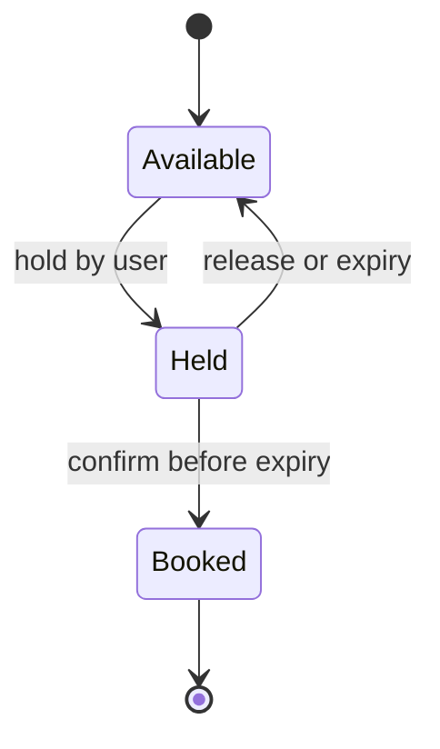
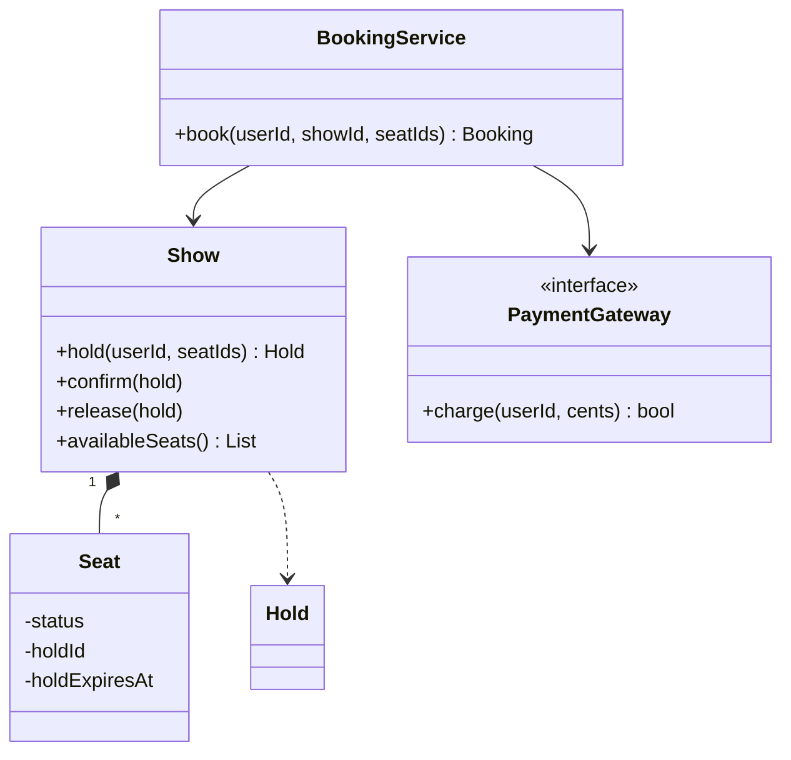
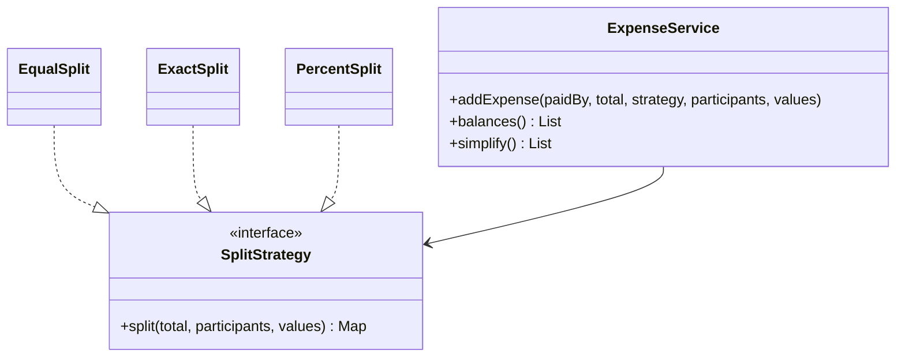
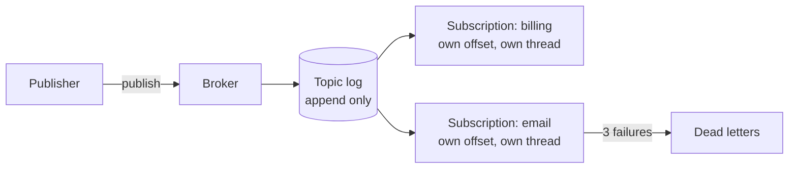
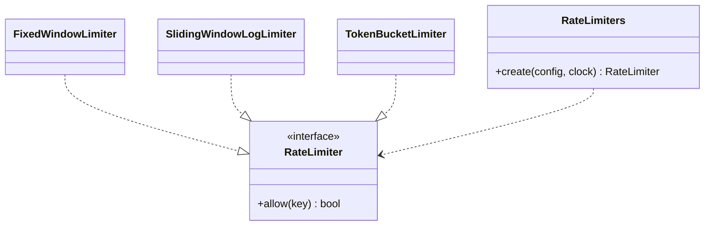
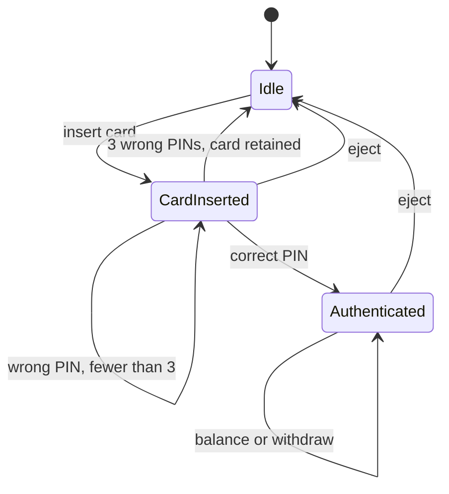
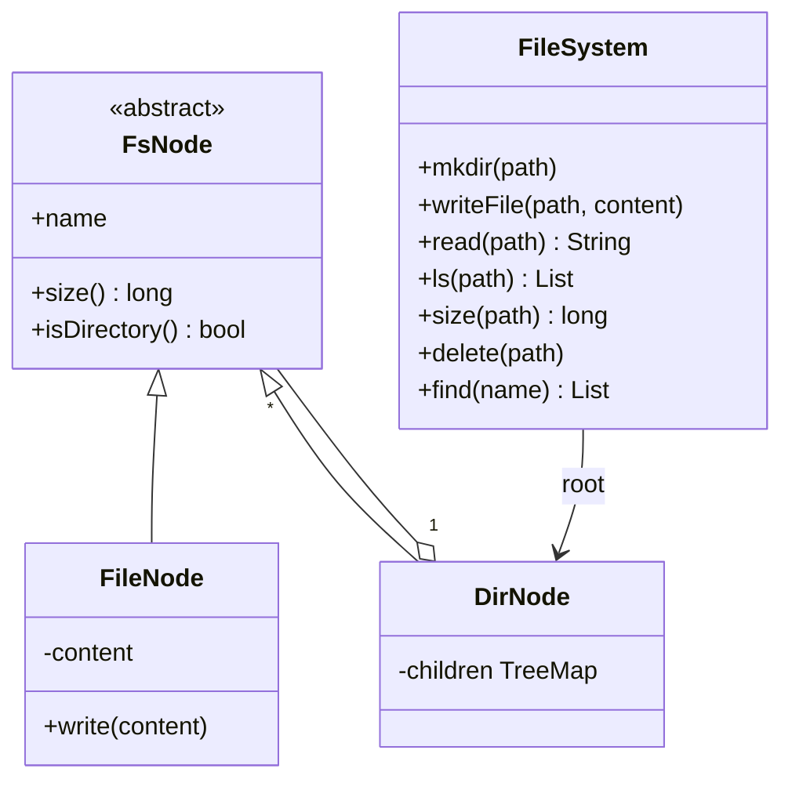

# 📘 Machine Coding Problems, Part 2

These problems are a step up: they involve concurrency, money, time, and richer object graphs.
The format is the same as [Part 1](/docs/system-design/lld/machine-coding-problems-1): requirements, design, complete code that compiles and runs, and extensions.
Money is always integer cents, and time is injected.

## Table of Contents

1. [Movie Ticket Booking](#1-movie-ticket-booking)
2. [Splitwise](#2-splitwise)
3. [Pub/Sub Broker](#3-pubsub-broker)
4. [Rate Limiter](#4-rate-limiter)
5. [ATM](#5-atm)
6. [In-Memory File System](#6-in-memory-file-system)

---

## 1. Movie Ticket Booking

### 1.1 Requirements

- A show has a grid of seats and a price per seat.
- A user selects seats, the system **holds** them for a few minutes, the user pays, and the booking is **confirmed**.
- No two users can ever book the same seat, even concurrently.
- A hold that expires releases the seats. A failed payment releases the seats.
- A multi-seat request is all-or-nothing.

This is the seat-hold half of the [ticket booking HLD](/docs/system-design/hld/large-scale-designs), at object level.

### 1.2 Design





Decisions:

- **Each `Show` guards its own seats with one lock.** Different shows never contend, and within a show the hold is atomic: check all seats, then mark all. This is the simplest correct design. Finer locking per seat needs ordered acquisition to avoid deadlock, see [Concurrency in LLD](/docs/system-design/lld/concurrency-in-lld).
- **Expiry is lazy.** A seat whose hold expired is treated as available when read or requested. No background thread is required for correctness, though one can clean up.
- The booking flow is hold, pay, confirm, and release on any failure. Payment is an interface so tests can decline.
- Confirming re-checks expiry, so a slow payment cannot book seats after the hold lapsed (a real system would refund or extend).

### 1.3 Code

```java
// runnable
import java.time.*;
import java.util.*;
import java.util.concurrent.atomic.AtomicInteger;
import java.util.function.Supplier;

enum SeatStatus { AVAILABLE, HELD, BOOKED }

class SeatUnavailableException extends RuntimeException {
    SeatUnavailableException(String msg) { super(msg); }
}

class Seat {
    final String id;
    SeatStatus status = SeatStatus.AVAILABLE;
    String holdId;
    Instant holdExpiresAt;
    Seat(String id) { this.id = id; }
}

record Hold(String id, String userId, List<String> seatIds, Instant expiresAt) {}
record Booking(String id, String userId, String showId, List<String> seatIds, long amountCents) {}

class Show {
    private final String id;
    private final long priceCents;
    private final Duration holdTtl;
    private final Supplier<Instant> clock;
    private final Map<String, Seat> seats = new LinkedHashMap<>();
    private final Map<String, Hold> holds = new HashMap<>();
    private final AtomicInteger holdCounter = new AtomicInteger(1);

    Show(String id, int rows, int cols, long priceCents, Duration holdTtl, Supplier<Instant> clock) {
        this.id = id; this.priceCents = priceCents; this.holdTtl = holdTtl; this.clock = clock;
        for (int r = 0; r < rows; r++)
            for (int c = 1; c <= cols; c++) {
                String sid = "" + (char) ('A' + r) + c;
                seats.put(sid, new Seat(sid));
            }
    }

    String id() { return id; }
    long priceCents() { return priceCents; }

    private boolean isFree(Seat s) {
        return s.status == SeatStatus.AVAILABLE
            || (s.status == SeatStatus.HELD && !clock.get().isBefore(s.holdExpiresAt));
    }

    synchronized Hold hold(String userId, List<String> seatIds) {
        for (String sid : seatIds) {                                   // check everything first: all or nothing
            Seat s = seats.get(sid);
            if (s == null) throw new IllegalArgumentException("no such seat " + sid);
            if (!isFree(s)) throw new SeatUnavailableException("seat " + sid + " is not available");
        }
        Instant expires = clock.get().plus(holdTtl);
        Hold h = new Hold("H" + holdCounter.getAndIncrement(), userId, List.copyOf(seatIds), expires);
        for (String sid : seatIds) {
            Seat s = seats.get(sid);
            s.status = SeatStatus.HELD; s.holdId = h.id(); s.holdExpiresAt = expires;
        }
        holds.put(h.id(), h);
        return h;
    }

    synchronized void confirm(Hold h) {
        Hold current = holds.get(h.id());
        if (current == null) throw new IllegalStateException("hold not found or already released");
        if (!clock.get().isBefore(current.expiresAt())) {
            release(h);
            throw new IllegalStateException("hold expired");
        }
        for (String sid : current.seatIds()) {
            Seat s = seats.get(sid);
            s.status = SeatStatus.BOOKED; s.holdId = null; s.holdExpiresAt = null;
        }
        holds.remove(h.id());
    }

    synchronized void release(Hold h) {
        Hold current = holds.remove(h.id());
        if (current == null) return;
        for (String sid : current.seatIds()) {
            Seat s = seats.get(sid);
            if (s.status == SeatStatus.HELD && h.id().equals(s.holdId)) {     // do not free seats re-held by someone else
                s.status = SeatStatus.AVAILABLE; s.holdId = null; s.holdExpiresAt = null;
            }
        }
    }

    synchronized List<String> availableSeats() {
        return seats.values().stream().filter(this::isFree).map(s -> s.id).toList();
    }
}

interface PaymentGateway {
    boolean charge(String userId, long cents);
}

class BookingService {
    private final Map<String, Show> shows = new HashMap<>();
    private final PaymentGateway payments;
    private final AtomicInteger bookingCounter = new AtomicInteger(1);

    BookingService(PaymentGateway payments) { this.payments = payments; }
    void addShow(Show s) { shows.put(s.id(), s); }

    Booking book(String userId, String showId, List<String> seatIds) {
        Show show = shows.get(showId);
        if (show == null) throw new IllegalArgumentException("no such show " + showId);
        Hold hold = show.hold(userId, seatIds);
        long amount = show.priceCents() * seatIds.size();
        boolean paid;
        try {
            paid = payments.charge(userId, amount);
        } catch (RuntimeException e) {
            show.release(hold);
            throw e;
        }
        if (!paid) {
            show.release(hold);
            throw new IllegalStateException("payment declined");
        }
        show.confirm(hold);       // a real system would refund here if the hold had lapsed
        return new Booking("BK" + bookingCounter.getAndIncrement(), userId, showId, seatIds, amount);
    }
}

public class Main {
    public static void main(String[] args) {
        Instant[] now = { Instant.parse("2026-03-01T18:00:00Z") };
        Show show = new Show("S1", 2, 3, 250, Duration.ofMinutes(5), () -> now[0]);
        BookingService svc = new BookingService((user, cents) -> !user.equals("poor"));
        svc.addShow(show);

        Booking b = svc.book("u1", "S1", List.of("A1", "A2"));
        System.out.println("u1 booked " + b.seatIds() + " for " + b.amountCents());

        try { svc.book("u2", "S1", List.of("A2", "A3")); }
        catch (SeatUnavailableException e) { System.out.println("u2 failed: " + e.getMessage()); }
        System.out.println("available: " + show.availableSeats());               // A3 untouched: all or nothing

        try { svc.book("poor", "S1", List.of("B1")); }
        catch (IllegalStateException e) { System.out.println("poor failed: " + e.getMessage()); }
        System.out.println("available: " + show.availableSeats());               // B1 released

        Hold h3 = show.hold("u3", List.of("B1"));
        try { show.hold("u4", List.of("B1")); }
        catch (SeatUnavailableException e) { System.out.println("u4 blocked while u3 holds B1"); }
        now[0] = now[0].plus(Duration.ofMinutes(6));                              // u3's hold expires
        show.hold("u4", List.of("B1"));
        System.out.println("u4 got B1 after expiry");
        try { show.confirm(h3); }
        catch (IllegalStateException e) { System.out.println("u3 confirm failed: " + e.getMessage()); }
    }
}
```

### 1.4 Extensions

- **Concurrency test:** hammer one seat from 100 threads, exactly one must win, see [Concurrency in LLD](/docs/system-design/lld/concurrency-in-lld).
- **Seat types and pricing:** a `PricingStrategy` (regular, premium, weekend surge).
- **Multiple theaters and search:** `Theater`, `Screen`, `Movie`, and an index by city and movie.
- **Notifications:** an observer that emails the ticket after confirmation.
- **Cancellation and refunds:** a `Booking` state machine and a refund policy.
- **Persistence:** move the lock to the database with `UPDATE ... WHERE status='AVAILABLE'` compare-and-set.

---

## 2. Splitwise

### 2.1 Requirements

- Users record shared expenses: who paid, the total, who shares it, and how (equal, exact amounts, percentages).
- Show who owes whom.
- **Simplify debts** to the smallest reasonable number of payments.
- Amounts are exact: no floating point, and rounding must not lose or invent cents.

### 2.2 Design



- **Strategy** for split types. Each returns a share per participant in cents and guarantees they sum to the total. Rounding leftovers go to the first participants one cent at a time.
- The ledger stores `owes[a][b]` = cents that a owes b, always positive. Adding a debt first **cancels the opposite direction**, so a pair never has debts both ways.
- **Simplification:** compute each user's net position (owed to them minus owed by them). Then repeatedly match the largest debtor with the largest creditor using two priority queues. This gives at most n minus 1 transfers. Finding the true minimum is NP-hard, and this greedy is the standard interview answer.

### 2.3 Code

```java
// runnable
import java.util.*;

interface SplitStrategy {
    /** Returns each participant's share in cents. Shares add up to the total. */
    Map<String, Long> split(long totalCents, List<String> participants, List<Long> values);
}

class EqualSplit implements SplitStrategy {
    public Map<String, Long> split(long total, List<String> ps, List<Long> values) {
        Map<String, Long> out = new LinkedHashMap<>();
        long base = total / ps.size(), rem = total % ps.size();
        for (int i = 0; i < ps.size(); i++) out.put(ps.get(i), base + (i < rem ? 1 : 0));
        return out;
    }
}

class ExactSplit implements SplitStrategy {
    public Map<String, Long> split(long total, List<String> ps, List<Long> values) {
        if (values.size() != ps.size()) throw new IllegalArgumentException("one amount per participant");
        long sum = values.stream().mapToLong(Long::longValue).sum();
        if (sum != total) throw new IllegalArgumentException("amounts add up to " + sum + ", expected " + total);
        Map<String, Long> out = new LinkedHashMap<>();
        for (int i = 0; i < ps.size(); i++) out.put(ps.get(i), values.get(i));
        return out;
    }
}

class PercentSplit implements SplitStrategy {
    public Map<String, Long> split(long total, List<String> ps, List<Long> values) {
        if (values.size() != ps.size()) throw new IllegalArgumentException("one percentage per participant");
        if (values.stream().mapToLong(Long::longValue).sum() != 100) throw new IllegalArgumentException("percentages must add up to 100");
        Map<String, Long> out = new LinkedHashMap<>();
        long assigned = 0;
        for (int i = 0; i < ps.size(); i++) {
            long share = total * values.get(i) / 100;
            out.put(ps.get(i), share);
            assigned += share;
        }
        long leftover = total - assigned;                             // rounding cents go to the first participants
        for (int i = 0; leftover > 0; i = (i + 1) % ps.size(), leftover--) out.merge(ps.get(i), 1L, Long::sum);
        return out;
    }
}

record Transfer(String from, String to, long cents) {
    @Override public String toString() { return from + " pays " + to + " " + Money.fmt(cents); }
}

class Money {
    static String fmt(long cents) { return String.format("%d.%02d", cents / 100, cents % 100); }
}

class ExpenseService {
    private final Map<String, Map<String, Long>> owes = new TreeMap<>();   // owes.get(a).get(b) = cents a owes b

    void addExpense(String paidBy, long total, SplitStrategy strategy, List<String> participants, List<Long> values) {
        Map<String, Long> shares = strategy.split(total, participants, values);
        long sum = shares.values().stream().mapToLong(Long::longValue).sum();
        if (sum != total) throw new IllegalStateException("shares do not add up to the total");
        shares.forEach((user, share) -> {
            if (!user.equals(paidBy) && share > 0) addDebt(user, paidBy, share);
        });
    }

    private void addDebt(String from, String to, long cents) {
        long reverse = owes.getOrDefault(to, new TreeMap<>()).getOrDefault(from, 0L);
        if (reverse > 0) {                                             // cancel the opposite direction first
            long cancel = Math.min(reverse, cents);
            adjust(to, from, -cancel);
            cents -= cancel;
        }
        if (cents > 0) adjust(from, to, cents);
    }

    private void adjust(String a, String b, long delta) {
        Map<String, Long> m = owes.computeIfAbsent(a, k -> new TreeMap<>());
        long v = m.getOrDefault(b, 0L) + delta;
        if (v == 0) m.remove(b); else m.put(b, v);
    }

    List<String> balances() {
        List<String> out = new ArrayList<>();
        owes.forEach((a, m) -> m.forEach((b, c) -> out.add(a + " owes " + b + " " + Money.fmt(c))));
        return out;
    }

    List<Transfer> simplify() {
        Map<String, Long> net = new TreeMap<>();                       // positive: is owed, negative: owes
        owes.forEach((a, m) -> m.forEach((b, c) -> { net.merge(a, -c, Long::sum); net.merge(b, c, Long::sum); }));

        Comparator<Map.Entry<String, Long>> byAmountDesc = (x, y) -> Long.compare(y.getValue(), x.getValue());
        PriorityQueue<Map.Entry<String, Long>> creditors = new PriorityQueue<>(byAmountDesc);
        PriorityQueue<Map.Entry<String, Long>> debtors = new PriorityQueue<>(byAmountDesc);
        net.forEach((u, v) -> {
            if (v > 0) creditors.add(new AbstractMap.SimpleEntry<>(u, v));
            else if (v < 0) debtors.add(new AbstractMap.SimpleEntry<>(u, -v));
        });

        List<Transfer> out = new ArrayList<>();
        while (!creditors.isEmpty() && !debtors.isEmpty()) {
            var c = creditors.poll();
            var d = debtors.poll();
            long pay = Math.min(c.getValue(), d.getValue());
            out.add(new Transfer(d.getKey(), c.getKey(), pay));
            if (c.getValue() > pay) creditors.add(new AbstractMap.SimpleEntry<>(c.getKey(), c.getValue() - pay));
            if (d.getValue() > pay) debtors.add(new AbstractMap.SimpleEntry<>(d.getKey(), d.getValue() - pay));
        }
        return out;
    }
}

public class Main {
    public static void main(String[] args) {
        System.out.println(new EqualSplit().split(1000, List.of("A", "B", "C"), List.of()));   // {A=334, B=333, C=333}

        ExpenseService svc = new ExpenseService();
        List<String> all = List.of("A", "B", "C", "D");
        svc.addExpense("A", 4000, new EqualSplit(), all, List.of());                                      // A paid 40.00 for everyone
        svc.addExpense("B", 3000, new EqualSplit(), List.of("B", "C", "D"), List.of());                   // B paid 30.00 for B, C, D
        svc.addExpense("D", 600, new ExactSplit(), List.of("A", "C"), List.of(200L, 400L));               // D paid 6.00, A 2.00 and C 4.00

        svc.balances().forEach(System.out::println);
        System.out.println("simplified:");
        svc.simplify().forEach(t -> System.out.println("  " + t));

        try { svc.addExpense("A", 1000, new PercentSplit(), List.of("A", "B"), List.of(60L, 30L)); }
        catch (IllegalArgumentException e) { System.out.println("error: " + e.getMessage()); }
    }
}
```

### 2.4 Extensions

- **Groups and currencies:** a `Group` with members, an exchange-rate service, store the original currency.
- **Settle up:** recording a payment is just an expense in the opposite direction.
- **Audit and edits:** store expenses as immutable events and derive balances, so deletion or edit recomputes.
- **Concurrency:** balances are shared mutable state, guard `addExpense` with a lock per group.
- **Better simplification:** exploit cycles and zero-sum subgroups to reduce transfers below the greedy count.

---

## 3. Pub/Sub Broker

### 3.1 Requirements

- Topics with publishers and subscribers. Messages on a topic are ordered.
- Subscribers belong to **consumer groups**. Each group receives every message, and processes them in order.
- A slow subscriber must not block publishers or other groups.
- A message that keeps failing is retried a few times, then moved to a dead-letter list.

This is a miniature of the ideas in [Building Blocks](/docs/system-design/hld/building-blocks): an append-only log, offsets per consumer group, retries and a DLQ.

### 3.2 Design



- The **topic** is an append-only list, and messages have offsets.
- A **subscription** is one consumer group with its own offset and a **single-thread executor**. One thread means ordered delivery and no locking of the offset.
- `publish` appends, then signals every subscription. The signal submits a `drain` task that reads from the subscription's offset until caught up. Extra signals are harmless.
- Delivery is **at least once** per group: a failing handler is retried, and after `maxAttempts` the message goes to `deadLetters` and processing continues.

### 3.3 Code

```java
// runnable
import java.util.*;
import java.util.concurrent.*;
import java.util.function.Consumer;

record Message(long offset, String topic, String payload) {}

class Topic {
    private final String name;
    private final List<Message> log = new ArrayList<>();
    Topic(String name) { this.name = name; }

    synchronized Message append(String payload) {
        Message m = new Message(log.size(), name, payload);
        log.add(m);
        return m;
    }
    synchronized Optional<Message> at(long offset) {
        return offset < log.size() ? Optional.of(log.get((int) offset)) : Optional.empty();
    }
}

class Subscription {
    private final Topic topic;
    private final Consumer<Message> handler;
    private final int maxAttempts;
    private long offset = 0;                                   // only touched by the single worker thread
    private final ExecutorService worker = Executors.newSingleThreadExecutor();
    final String group;
    final List<Message> deadLetters = new CopyOnWriteArrayList<>();

    Subscription(String group, Topic topic, Consumer<Message> handler, int maxAttempts) {
        this.group = group; this.topic = topic; this.handler = handler; this.maxAttempts = maxAttempts;
    }

    void signal() { worker.submit(this::drain); }

    private void drain() {
        Optional<Message> next;
        while ((next = topic.at(offset)).isPresent()) {
            Message m = next.get();
            boolean ok = false;
            for (int attempt = 1; attempt <= maxAttempts && !ok; attempt++) {
                try { handler.accept(m); ok = true; }
                catch (RuntimeException e) { /* retry, a real broker would back off here */ }
            }
            if (!ok) deadLetters.add(m);
            offset++;                                          // move on even after a dead letter
        }
    }

    void close() throws InterruptedException {
        worker.shutdown();                                     // lets already queued drain tasks finish
        worker.awaitTermination(5, TimeUnit.SECONDS);
    }
}

class Broker {
    private final Map<String, Topic> topics = new ConcurrentHashMap<>();
    private final Map<String, List<Subscription>> subs = new ConcurrentHashMap<>();

    void createTopic(String name) { topics.putIfAbsent(name, new Topic(name)); }

    Subscription subscribe(String topic, String group, Consumer<Message> handler) {
        Topic t = topics.get(topic);
        if (t == null) throw new IllegalArgumentException("no such topic " + topic);
        Subscription s = new Subscription(group, t, handler, 3);      // starts from offset 0, replaying history
        subs.computeIfAbsent(topic, k -> new CopyOnWriteArrayList<>()).add(s);
        s.signal();
        return s;
    }

    void publish(String topic, String payload) {
        Topic t = topics.get(topic);
        if (t == null) throw new IllegalArgumentException("no such topic " + topic);
        t.append(payload);
        subs.getOrDefault(topic, List.of()).forEach(Subscription::signal);
    }

    void shutdown() throws InterruptedException {
        for (List<Subscription> list : subs.values()) for (Subscription s : list) s.close();
    }
}

public class Main {
    public static void main(String[] args) throws InterruptedException {
        List<String> billing = Collections.synchronizedList(new ArrayList<>());
        List<String> email = Collections.synchronizedList(new ArrayList<>());

        Broker broker = new Broker();
        broker.createTopic("orders");
        broker.subscribe("orders", "billing", m -> billing.add(m.payload()));
        Subscription emailSub = broker.subscribe("orders", "email", m -> {
            if (m.payload().equals("bad")) throw new RuntimeException("cannot render template");
            email.add(m.payload());
        });

        for (String p : List.of("o1", "o2", "bad", "o3")) broker.publish("orders", p);
        broker.shutdown();

        System.out.println("billing: " + billing);
        System.out.println("email:   " + email);
        System.out.println("email dead letters: " + emailSub.deadLetters.stream().map(Message::payload).toList());
    }
}
```

### 3.4 Extensions

- **Multiple consumers per group:** partition the topic, assign each partition to one consumer in the group (Kafka model). Offsets are per partition.
- **Acknowledgments and redelivery:** an in-flight set with visibility timeout (SQS model).
- **Backpressure:** bounded queues per subscription and a policy when full.
- **Retention:** trim the log by size or age, and handle offsets that point to trimmed data.
- **Persistence:** append the log to disk, commit offsets to a store, recover on restart.
- **Ordering keys and filtering:** route by key hash, subscribe with predicates.

---

## 4. Rate Limiter

### 4.1 Requirements

- `allow(key)` returns whether the request is within the limit for that client key.
- Support several algorithms behind one interface: fixed window, sliding window log, token bucket.
- Thread safe, independent state per key.
- Time is injected so behavior is testable.

The HLD version is in [Classic Designs](/docs/system-design/hld/classic-designs), the algorithm comparison is in [Distributed Systems](/docs/system-design/hld/distributed-systems).

### 4.2 Design



- **Strategy** behind `RateLimiter`, a **Factory** chooses by config.
- State per key lives in a `ConcurrentHashMap`, created with `computeIfAbsent`. Each state object is locked on its own, so different keys never contend.
- The demo shows the well-known boundary problem: a fixed window allows a burst of double the limit across the boundary, while the sliding log and token bucket do not.

### 4.3 Code

```java
// runnable
import java.util.*;
import java.util.concurrent.ConcurrentHashMap;
import java.util.function.LongSupplier;

interface RateLimiter {
    boolean allow(String key);
}

class FixedWindowLimiter implements RateLimiter {
    private static final class State { long window = -1; int count; }
    private final int limit;
    private final long windowMs;
    private final LongSupplier clock;
    private final Map<String, State> states = new ConcurrentHashMap<>();

    FixedWindowLimiter(int limit, long windowMs, LongSupplier clock) {
        this.limit = limit; this.windowMs = windowMs; this.clock = clock;
    }
    public boolean allow(String key) {
        State s = states.computeIfAbsent(key, k -> new State());
        long window = clock.getAsLong() / windowMs;
        synchronized (s) {
            if (s.window != window) { s.window = window; s.count = 0; }
            if (s.count < limit) { s.count++; return true; }
            return false;
        }
    }
}

class SlidingWindowLogLimiter implements RateLimiter {
    private final int limit;
    private final long windowMs;
    private final LongSupplier clock;
    private final Map<String, ArrayDeque<Long>> logs = new ConcurrentHashMap<>();

    SlidingWindowLogLimiter(int limit, long windowMs, LongSupplier clock) {
        this.limit = limit; this.windowMs = windowMs; this.clock = clock;
    }
    public boolean allow(String key) {
        ArrayDeque<Long> q = logs.computeIfAbsent(key, k -> new ArrayDeque<>());
        long now = clock.getAsLong();
        synchronized (q) {
            while (!q.isEmpty() && q.peekFirst() <= now - windowMs) q.pollFirst();   // forget old requests
            if (q.size() < limit) { q.addLast(now); return true; }
            return false;
        }
    }
}

class TokenBucketLimiter implements RateLimiter {
    private static final class State { double tokens; long last; boolean started; }
    private final int capacity;
    private final double refillPerMs;
    private final LongSupplier clock;
    private final Map<String, State> states = new ConcurrentHashMap<>();

    TokenBucketLimiter(int limit, long windowMs, LongSupplier clock) {
        this.capacity = limit; this.refillPerMs = (double) limit / windowMs; this.clock = clock;
    }
    public boolean allow(String key) {
        State s = states.computeIfAbsent(key, k -> new State());
        long now = clock.getAsLong();
        synchronized (s) {
            if (!s.started) { s.tokens = capacity; s.last = now; s.started = true; }
            s.tokens = Math.min(capacity, s.tokens + (now - s.last) * refillPerMs);
            s.last = now;
            if (s.tokens >= 1) { s.tokens -= 1; return true; }
            return false;
        }
    }
}

enum Algorithm { FIXED_WINDOW, SLIDING_LOG, TOKEN_BUCKET }

record LimitConfig(Algorithm algorithm, int limit, long windowMs) {}

class RateLimiters {
    static RateLimiter create(LimitConfig c, LongSupplier clock) {
        return switch (c.algorithm()) {
            case FIXED_WINDOW -> new FixedWindowLimiter(c.limit(), c.windowMs(), clock);
            case SLIDING_LOG -> new SlidingWindowLogLimiter(c.limit(), c.windowMs(), clock);
            case TOKEN_BUCKET -> new TokenBucketLimiter(c.limit(), c.windowMs(), clock);
        };
    }
}

public class Main {
    /** 3 requests just before a window boundary and 3 just after. */
    static int boundaryBurst(Algorithm algo) {
        long[] t = { 0 };
        RateLimiter rl = RateLimiters.create(new LimitConfig(algo, 3, 1000), () -> t[0]);
        int allowed = 0;
        t[0] = 900;
        for (int i = 0; i < 3; i++) if (rl.allow("u")) allowed++;
        t[0] = 1000;
        for (int i = 0; i < 3; i++) if (rl.allow("u")) allowed++;
        return allowed;
    }

    public static void main(String[] args) {
        System.out.println("allowed across boundary: fixed=" + boundaryBurst(Algorithm.FIXED_WINDOW)
            + " sliding=" + boundaryBurst(Algorithm.SLIDING_LOG)
            + " bucket=" + boundaryBurst(Algorithm.TOKEN_BUCKET));

        long[] t = { 0 };
        RateLimiter rl = RateLimiters.create(new LimitConfig(Algorithm.TOKEN_BUCKET, 2, 1000), () -> t[0]);
        System.out.println("alice: " + rl.allow("alice") + " " + rl.allow("alice") + " " + rl.allow("alice"));   // true true false
        System.out.println("bob:   " + rl.allow("bob"));                                                        // independent key
        t[0] = 500;                                                                                             // half a second refills one token
        System.out.println("alice after 500ms: " + rl.allow("alice"));
    }
}
```

### 4.4 Extensions

- **Per-endpoint and per-tier limits:** a `Map<String, LimitConfig>` and a composite limiter that must satisfy all applicable limits.
- **Response metadata:** return a `Decision(allowed, remaining, retryAfterMs)` instead of a boolean.
- **Memory hygiene:** evict idle keys (a scheduled sweep or Caffeine with expiry) to avoid unbounded maps.
- **Distributed version:** move state to Redis with a Lua script, see [Classic Designs](/docs/system-design/hld/classic-designs).
- **Sliding window counter:** the cheaper approximation that keeps two counters per key.

---

## 5. ATM

### 5.1 Requirements

- Insert card, enter PIN, then check balance or withdraw cash, then eject.
- After three wrong PINs the card is retained.
- Withdrawals must be multiples of the smallest note, within the account balance, and dispensable from the notes available.
- Dispense with the fewest notes (largest denominations first).
- Never debit the account if the cash cannot be dispensed, and never dispense without debiting.

### 5.2 Design



- The ATM is a **facade** over a `BankService` (verify PIN, balance, debit) and a `CashDispenser`.
- The state here is an `enum` with a guard per operation. It is enough because the behavior per state is mostly "allowed or not". The [vending machine](/docs/system-design/lld/machine-coding-problems-1) uses the full State pattern, which is the right choice when each state does different work. Being able to say why you picked each is a good signal.
- The dispenser is a **Chain of Responsibility** over denominations: each handler takes as many notes of its denomination as it can, then passes the remainder on.
- Withdrawal is **plan, debit, commit**. Planning does not change any state. If the plan fails, nothing has happened. If the debit fails, the notes were never removed. Real ATMs also reverse a debit if the hardware fails after it.

### 5.3 Code

```java
// runnable
import java.util.*;

interface BankService {
    boolean verifyPin(String card, String pin);
    long balance(String card);
    void debit(String card, long amount);
}

class InMemoryBank implements BankService {
    private final Map<String, String> pins = new HashMap<>();
    private final Map<String, Long> balances = new HashMap<>();
    void addAccount(String card, String pin, long balance) { pins.put(card, pin); balances.put(card, balance); }
    public boolean verifyPin(String card, String pin) { return pin.equals(pins.get(card)); }
    public long balance(String card) { return balances.get(card); }
    public void debit(String card, long amount) {
        if (balances.get(card) < amount) throw new IllegalStateException("insufficient funds");
        balances.merge(card, -amount, Long::sum);
    }
}

/** One link per denomination. Plans without changing any state. */
class NoteHandler {
    private final int denomination;
    private NoteHandler next;
    NoteHandler(int denomination) { this.denomination = denomination; }
    NoteHandler then(NoteHandler n) { this.next = n; return n; }

    boolean plan(long remaining, Map<Integer, Integer> available, Map<Integer, Integer> out) {
        int use = (int) Math.min(remaining / denomination, available.getOrDefault(denomination, 0));
        if (use > 0) out.put(denomination, use);
        long left = remaining - (long) use * denomination;
        if (left == 0) return true;
        return next != null && next.plan(left, available, out);
    }
}

class CashDispenser {
    private final Map<Integer, Integer> notes = new TreeMap<>(Comparator.reverseOrder());
    private final NoteHandler chain;
    private final int smallest;

    CashDispenser(Map<Integer, Integer> initial) {
        notes.putAll(initial);
        NoteHandler head = null, tail = null;
        for (int denom : notes.keySet()) {                           // largest first
            NoteHandler h = new NoteHandler(denom);
            if (head == null) head = h; else tail.then(h);
            tail = h;
        }
        this.chain = head;
        this.smallest = Collections.min(notes.keySet());
    }

    int smallestNote() { return smallest; }

    Map<Integer, Integer> plan(long amount) {
        Map<Integer, Integer> out = new TreeMap<>(Comparator.reverseOrder());
        if (!chain.plan(amount, notes, out)) throw new IllegalStateException("ATM cannot dispense " + amount + " with the notes it has");
        return out;
    }

    void commit(Map<Integer, Integer> plan) { plan.forEach((d, n) -> notes.merge(d, -n, Integer::sum)); }
}

enum AtmState { IDLE, CARD_INSERTED, AUTHENTICATED }

class Atm {
    private AtmState state = AtmState.IDLE;
    private String card;
    private int badPins;
    private final BankService bank;
    private final CashDispenser dispenser;

    Atm(BankService bank, CashDispenser dispenser) { this.bank = bank; this.dispenser = dispenser; }

    private void require(AtmState expected) {
        if (state != expected) throw new IllegalStateException("not allowed in state " + state);
    }
    private void reset() { state = AtmState.IDLE; card = null; badPins = 0; }

    void insertCard(String card) { require(AtmState.IDLE); this.card = card; this.badPins = 0; state = AtmState.CARD_INSERTED; }

    void enterPin(String pin) {
        require(AtmState.CARD_INSERTED);
        if (bank.verifyPin(card, pin)) { state = AtmState.AUTHENTICATED; return; }
        if (++badPins >= 3) { reset(); throw new IllegalStateException("card retained after 3 wrong PINs"); }
        throw new IllegalArgumentException("wrong PIN, attempt " + badPins + " of 3");
    }

    long balance() { require(AtmState.AUTHENTICATED); return bank.balance(card); }

    Map<Integer, Integer> withdraw(long amount) {
        require(AtmState.AUTHENTICATED);
        if (amount <= 0 || amount % dispenser.smallestNote() != 0)
            throw new IllegalArgumentException("amount must be a positive multiple of " + dispenser.smallestNote());
        if (bank.balance(card) < amount) throw new IllegalStateException("insufficient balance");
        Map<Integer, Integer> plan = dispenser.plan(amount);      // 1. can we dispense it? (no side effects)
        bank.debit(card, amount);                                 // 2. authorize and debit
        dispenser.commit(plan);                                   // 3. remove the notes and hand them out
        return plan;
    }

    void eject() { reset(); }
}

public class Main {
    public static void main(String[] args) {
        InMemoryBank bank = new InMemoryBank();
        bank.addAccount("C1", "1234", 1000);
        CashDispenser cash = new CashDispenser(Map.of(100, 2, 50, 2, 20, 5, 10, 5));
        Atm atm = new Atm(bank, cash);

        try { atm.withdraw(50); } catch (IllegalStateException e) { System.out.println("error: " + e.getMessage()); }

        atm.insertCard("C1");
        try { atm.enterPin("0000"); } catch (IllegalArgumentException e) { System.out.println("error: " + e.getMessage()); }
        atm.enterPin("1234");
        System.out.println("withdraw 280 -> " + atm.withdraw(280) + ", balance " + atm.balance());

        try { atm.withdraw(5); } catch (IllegalArgumentException e) { System.out.println("error: " + e.getMessage()); }
        try { atm.withdraw(5000); } catch (IllegalStateException e) { System.out.println("error: " + e.getMessage()); }
        try { atm.withdraw(200); } catch (IllegalStateException e) { System.out.println("error: " + e.getMessage()); }
        System.out.println("balance unchanged after failed withdrawals: " + atm.balance());
        atm.eject();

        atm.insertCard("C1");
        for (int i = 0; i < 3; i++) {
            try { atm.enterPin("9999"); } catch (RuntimeException e) { System.out.println("error: " + e.getMessage()); }
        }
    }
}
```

### 5.4 Extensions

- **Real State pattern:** classes `IdleState`, `CardInsertedState`, `AuthenticatedState`, useful once states carry different behavior such as timeouts and maintenance.
- **Transactions and receipts:** a `Transaction` log, deposits, transfers, mini statements.
- **Better cash planning:** with limited notes greedy can fail when a solution exists (for example 60 with one 50 and three 20s), so use DP over denominations.
- **Session timeout:** an injected clock ends the session after inactivity.
- **Security:** hash PINs, lock cards after repeated failures at the bank, and log every attempt.
- **Concurrency:** one session per ATM physically, but the bank service is shared, so debits must be atomic there.

---

## 6. In-Memory File System

### 6.1 Requirements

- Absolute paths like `/docs/work/plan.txt`.
- `mkdir` (creating missing parents), write a file, read a file, `ls`, `size` of a file or directory (recursive), `delete`, and `find` by name.
- A directory and a file cannot share a name in the same directory.
- Clear errors for missing paths and wrong types.

### 6.2 Design

This is the textbook **Composite** pattern: files and directories are both nodes, and a directory's size is the sum of its children's sizes.



- Children live in a `TreeMap` so listings are sorted and deterministic.
- A private `parts(path)` splits and validates the path once, and `resolve` walks the tree.
- Type checks use pattern matching (`instanceof DirNode d`), which is the pragmatic Java 17 alternative to a Visitor for a small operation set.

### 6.3 Code

```java
// runnable
import java.util.*;

abstract class FsNode {
    final String name;
    FsNode(String name) { this.name = name; }
    abstract long size();
    abstract boolean isDirectory();
}

class FileNode extends FsNode {
    private String content;
    FileNode(String name, String content) { super(name); this.content = content; }
    String content() { return content; }
    void write(String c) { content = c; }
    long size() { return content.length(); }
    boolean isDirectory() { return false; }
}

class DirNode extends FsNode {
    final Map<String, FsNode> children = new TreeMap<>();
    DirNode(String name) { super(name); }
    long size() { return children.values().stream().mapToLong(FsNode::size).sum(); }
    boolean isDirectory() { return true; }
}

class FileSystem {
    private final DirNode root = new DirNode("");

    private static List<String> parts(String path) {
        if (path == null || !path.startsWith("/")) throw new IllegalArgumentException("path must be absolute: " + path);
        return Arrays.stream(path.split("/")).filter(s -> !s.isEmpty()).toList();
    }

    private FsNode resolve(String path) {
        FsNode cur = root;
        for (String p : parts(path)) {
            if (!(cur instanceof DirNode d) || !d.children.containsKey(p)) throw new NoSuchElementException("not found: " + path);
            cur = d.children.get(p);
        }
        return cur;
    }

    DirNode mkdir(String path) {
        DirNode cur = root;
        for (String p : parts(path)) {
            FsNode child = cur.children.get(p);
            if (child == null) {
                DirNode d = new DirNode(p);
                cur.children.put(p, d);
                cur = d;
            } else if (child instanceof DirNode d) {
                cur = d;
            } else {
                throw new IllegalArgumentException(p + " is a file, not a directory");
            }
        }
        return cur;
    }

    void writeFile(String path, String content) {
        List<String> ps = parts(path);
        if (ps.isEmpty()) throw new IllegalArgumentException("cannot write to root");
        String name = ps.get(ps.size() - 1);
        DirNode parent = mkdir("/" + String.join("/", ps.subList(0, ps.size() - 1)));
        FsNode existing = parent.children.get(name);
        if (existing instanceof DirNode) throw new IllegalArgumentException(path + " is a directory");
        if (existing instanceof FileNode f) f.write(content);
        else parent.children.put(name, new FileNode(name, content));
    }

    String read(String path) {
        if (resolve(path) instanceof FileNode f) return f.content();
        throw new IllegalArgumentException(path + " is a directory");
    }

    List<String> ls(String path) {
        FsNode n = resolve(path);
        if (n instanceof DirNode d)
            return d.children.values().stream().map(c -> c.isDirectory() ? c.name + "/" : c.name).toList();
        return List.of(n.name);
    }

    long size(String path) { return resolve(path).size(); }

    void delete(String path) {
        List<String> ps = parts(path);
        if (ps.isEmpty()) throw new IllegalArgumentException("cannot delete root");
        FsNode parent = resolve("/" + String.join("/", ps.subList(0, ps.size() - 1)));
        if (!(parent instanceof DirNode d) || d.children.remove(ps.get(ps.size() - 1)) == null)
            throw new NoSuchElementException("not found: " + path);
    }

    List<String> find(String name) {
        List<String> out = new ArrayList<>();
        walk(root, "", name, out);
        return out;
    }

    private void walk(DirNode dir, String prefix, String name, List<String> out) {
        for (FsNode c : dir.children.values()) {
            String p = prefix + "/" + c.name;
            if (c.name.equals(name)) out.add(p);
            if (c instanceof DirNode d) walk(d, p, name, out);
        }
    }
}

public class Main {
    public static void main(String[] args) {
        FileSystem fs = new FileSystem();
        fs.mkdir("/docs/work");
        fs.writeFile("/docs/work/plan.txt", "ship it");
        fs.writeFile("/docs/readme.md", "hello world");
        fs.writeFile("/readme.md", "root");

        System.out.println(fs.ls("/"));                       // [docs/, readme.md]
        System.out.println(fs.ls("/docs"));                   // [readme.md, work/]
        System.out.println(fs.read("/docs/work/plan.txt"));   // ship it
        System.out.println(fs.size("/docs"));                 // 18
        System.out.println(fs.find("readme.md"));             // [/docs/readme.md, /readme.md]

        fs.delete("/docs/work");
        System.out.println(fs.size("/docs"));                 // 11

        try { fs.read("/docs"); } catch (IllegalArgumentException e) { System.out.println("error: " + e.getMessage()); }
        try { fs.read("/nope/x"); } catch (NoSuchElementException e) { System.out.println("error: " + e.getMessage()); }
        try { fs.mkdir("/readme.md/sub"); } catch (IllegalArgumentException e) { System.out.println("error: " + e.getMessage()); }
    }
}
```

### 6.4 Extensions

- **`mv` and `cp`:** copying a directory deep-copies the composite. Moving must prevent moving a directory into its own subtree.
- **Path normalization:** support `.` and `..`, relative paths with a current directory.
- **Metadata and permissions:** owner, mode bits, timestamps on `FsNode`, checked in operations.
- **Visitor:** add operations (disk usage report, search, export) without changing the node classes.
- **Symlinks and hard links:** graph instead of a tree, cycle checks.
- **Concurrency:** a `ReadWriteLock` on the whole tree for simplicity, or per-directory locks with a fixed lock order.
- **Faster lookup:** a trie of path segments, and an inverted index for `find`.

Next: [Concurrency in LLD](/docs/system-design/lld/concurrency-in-lld) explains the locking used above and where it breaks.
