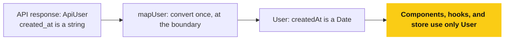
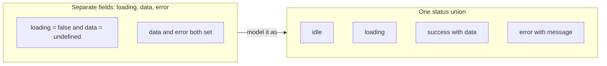
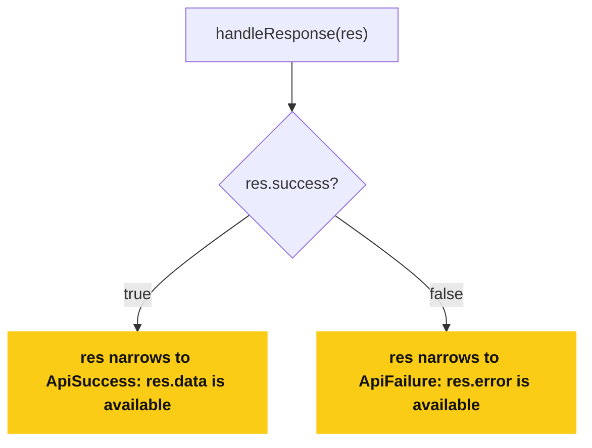
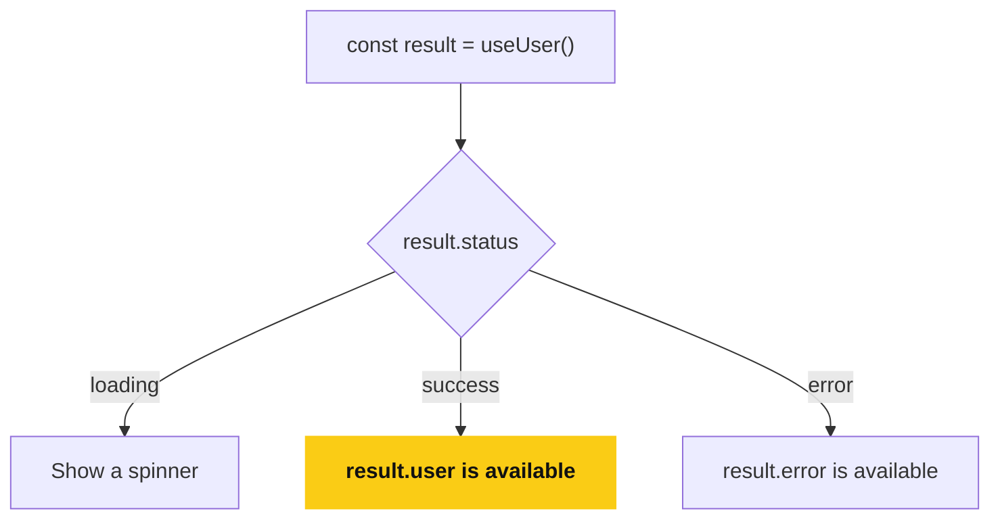
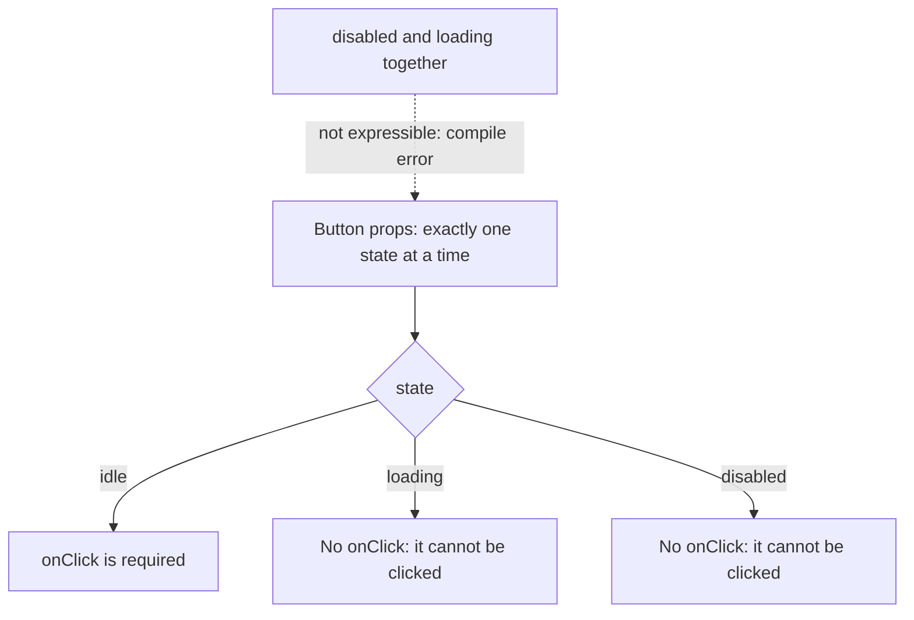
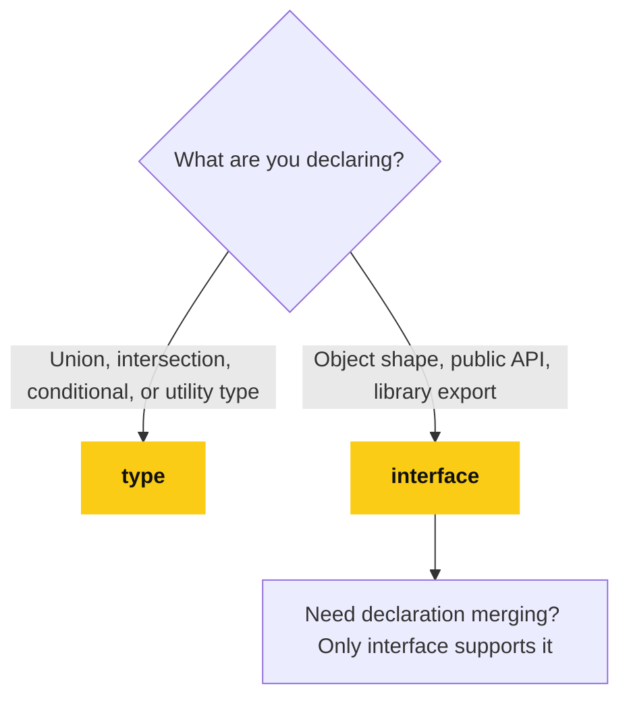
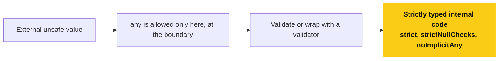
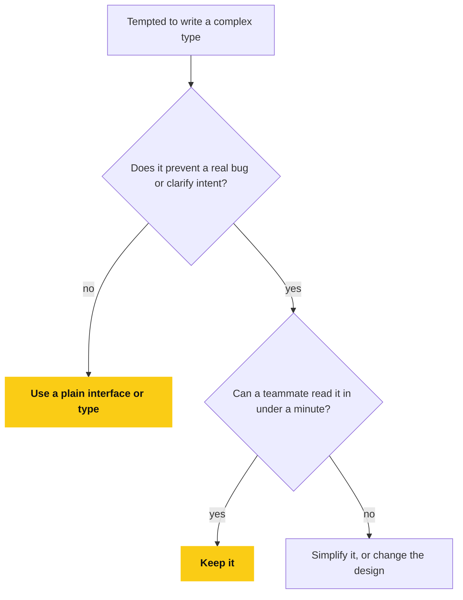

# 📘 TypeScript System Design Decisions (Frontend – Senior Level)

## Table of Contents

### Part 1: System Design Principles

1. [What "System Design" Means in Frontend + TypeScript](#1-what-system-design-means-in-frontend--typescript)
2. [Core Principle: Types at Boundaries](#2-core-principle-types-at-boundaries)
3. [Preventing Impossible States](#3-preventing-impossible-states-most-important)
4. [API Layer Design in TypeScript](#4-api-layer-design-in-typescript)
5. [Designing Reusable Hooks](#5-designing-reusable-hooks-typed-correctly)
6. [Designing Component APIs](#6-designing-component-apis-senior-signal)
7. [Type Organization Strategy](#7-type-organization-strategy-large-codebases)
8. [When to Use interface vs type](#8-when-to-use-interface-vs-type-system-level-decision)
9. [Strictness Strategy](#9-strictness-strategy)
10. [Avoiding Over-Engineering](#10-avoiding-over-engineering-very-important)

### Part 2: Real Frontend Interview Coding Problems

- [Problem 1: Type-Safe API Fetcher](#problem-1-type-safe-api-fetcher)
- [Problem 2: Event System with Type Safety](#problem-2-event-system-with-type-safety)
- [Problem 3: Discriminated Reducer](#problem-3-discriminated-reducer)
- [Problem 4: Generic List Component](#problem-4-generic-list-component)
- [Problem 5: Safe Object Access](#problem-5-safe-object-access)
- [Problem 6: Form Validation Result](#problem-6-form-validation-result)
- [What Interviewers Evaluate](#11-what-interviewers-evaluate-in-these-problems)
- [Final Senior-Level Summary](#12-final-senior-level-summary)

---

## 1. What "System Design" Means in Frontend + TypeScript

In frontend interviews, **TypeScript system design** does **not** mean backend architecture.

It means:

- How you **model data and state**
- How you **prevent invalid states**
- How you **scale types with app growth**
- How you **design APIs between components, hooks, services**
- How you **balance safety vs complexity**

Interviewers evaluate:

- Thought process
- Trade-offs
- Maintainability

---

## 2. Core Principle: Types at Boundaries

### Boundaries are:

- API responses
- Component props
- Hook return values
- Redux / store slices
- Form schemas

### Rule

> Be strict at boundaries, flexible internally.

### Example: API Boundary

```ts
type ApiUser = {
  id: string;
  name: string;
  created_at: string;
};
```

Convert once:

```ts
type User = {
  id: string;
  name: string;
  createdAt: Date;
};

function mapUser(api: ApiUser): User {
  return {
    id: api.id,
    name: api.name,
    createdAt: new Date(api.created_at),
  };
}
```

Why this matters:

- Prevents date bugs everywhere
- Centralized conversion
- Cleaner UI code

**Flowchart: Convert Once at the Boundary**

Be strict at the boundary and convert there, so the rest of the app never sees the raw API shape.



---

## 3. Preventing Impossible States (Most Important)

### ❌ Bad State Design

```ts
type State = {
  loading: boolean;
  data?: User[];
  error?: string;
};
```

Problem:

- `loading = false` and `data = undefined`
- `data` and `error` can exist together

**Flowchart: Impossible States**

Independent fields allow combinations that make no sense, while a status union only has the states you meant.



---

### ✅ Correct State Design (Discriminated Union)

```ts
type State =
  | { status: "idle" }
  | { status: "loading" }
  | { status: "success"; data: User[] }
  | { status: "error"; error: string };
```

Benefits:

- Impossible states eliminated
- Compiler enforces correctness
- Cleaner UI logic

---

## 4. API Layer Design in TypeScript

### API Response Pattern

```ts
type ApiSuccess<T> = {
  success: true;
  data: T;
};

type ApiFailure = {
  success: false;
  error: string;
};

type ApiResponse<T> = ApiSuccess<T> | ApiFailure;
```

Usage:

```ts
function handleResponse(res: ApiResponse<User>) {
  if (res.success) {
    res.data.name;
  } else {
    res.error;
  }
}
```

Why interviewers like this:

- Forces error handling
- No `try/catch` abuse
- Clear control flow

**Flowchart: Handling an ApiResponse**

The `success` flag narrows the union, so you cannot read `data` on a failure or `error` on a success.



---

## 5. Designing Reusable Hooks (Typed Correctly)

### Bad Hook Design

```ts
function useUser() {
  return { data: null, loading: false };
}
```

### Good Hook Design

```ts
type UseUserResult =
  | { status: "loading" }
  | { status: "success"; user: User }
  | { status: "error"; error: string };

function useUser(): UseUserResult {
  // implementation
}
```

Why:

- Consumer must handle all cases
- No undefined checks
- Scales well

**Flowchart: Consuming a Typed Hook**

The consumer is forced to handle every case, and never needs an undefined check.



---

## 6. Designing Component APIs (Senior Signal)

### Bad Component API

```ts
<Button disabled={true} loading={true} />
```

Ambiguous:

- Can be disabled AND loading

**Flowchart: A Component API With States**

One `state` prop replaces two booleans, so the ambiguous combination cannot be written.



---

### Good Component API

```ts
type ButtonProps =
  | { state: "idle"; onClick: () => void }
  | { state: "loading" }
  | { state: "disabled" };

function Button(props: ButtonProps) {}
```

Result:

- Invalid combinations impossible
- Better UX guarantees

---

## 7. Type Organization Strategy (Large Codebases)

### Recommended Structure

```
/types
  api.ts
  domain.ts
  ui.ts
```

- `api.ts` → server contracts
- `domain.ts` → business models
- `ui.ts` → component-level types

Why:

- Clear ownership
- Easier refactors
- Faster onboarding

---

## 8. When to Use `interface` vs `type` (System-Level Decision)

### Use `interface` when:

- Public APIs
- Object shapes
- Library exports

### Use `type` when:

- Unions
- Intersections
- Conditional types
- Utility types

Interview one-liner:

> Interfaces describe shapes, types describe logic.

**Flowchart: interface or type?**

Interfaces describe shapes, types describe logic.



---

## 9. Strictness Strategy

### Always Enable

```json
{
  "strict": true,
  "strictNullChecks": true,
  "noImplicitAny": true
}
```

### Exception Handling

- Allow `any` only at **external boundaries**
- Wrap unsafe values with validators

**Flowchart: Where any Is Allowed**

`any` is acceptable only at the outer edge, and it is wrapped by a validator before it reaches typed code.



---

## 10. Avoiding Over-Engineering (Very Important)

Senior engineers know when **not** to use complex types.

Bad:

```ts
type DeepMapped<T> = {
  [K in keyof T]: T[K] extends object ? DeepMapped<T[K]> : T[K];
};
```

Good:

```ts
interface User {
  id: string;
  name: string;
}
```

Rule:

> Types should help humans first, compiler second.

**Flowchart: Is This Type Worth It?**

Types should help humans first, and the compiler second.



---

# 📘 Real Frontend Interview Coding Problems (TypeScript)

---

## Problem 1: Type-Safe API Fetcher

### Question

Create a typed `fetcher` that:

- Returns data on success
- Returns error on failure
- Is generic

### Solution

```ts
type FetchSuccess<T> = {
  ok: true;
  data: T;
};

type FetchError = {
  ok: false;
  error: string;
};

type FetchResult<T> = FetchSuccess<T> | FetchError;

async function fetcher<T>(url: string): Promise<FetchResult<T>> {
  try {
    const res = await fetch(url);
    if (!res.ok) {
      return { ok: false, error: "Request failed" };
    }
    const data = await res.json();
    return { ok: true, data };
  } catch {
    return { ok: false, error: "Network error" };
  }
}
```

---

## Problem 2: Event System with Type Safety

### Question

Implement a typed event emitter.

### Solution

```ts
type Events = {
  login: { userId: string };
  logout: undefined;
};

function emit<K extends keyof Events>(event: K, payload: Events[K]) {}
```

Usage:

```ts
emit("login", { userId: "123" });
emit("logout", undefined);
```

---

## Problem 3: Discriminated Reducer

### Question

Write a reducer with exhaustive checks.

### Solution

```ts
type Action =
  | { type: "ADD"; value: number }
  | { type: "REMOVE"; value: number };

function reducer(state: number, action: Action): number {
  switch (action.type) {
    case "ADD":
      return state + action.value;
    case "REMOVE":
      return state - action.value;
    default:
      const _exhaustive: never = action;
      return state;
  }
}
```

---

## Problem 4: Generic List Component

### Question

Create a reusable typed list component.

### Solution

```ts
type ListProps<T> = {
  items: T[];
  renderItem: (item: T) => string;
};

function List<T>({ items, renderItem }: ListProps<T>) {
  return items.map(renderItem).join(",");
}
```

---

## Problem 5: Safe Object Access

### Question

Create a function to safely access object keys.

### Solution

```ts
function getValue<T, K extends keyof T>(obj: T, key: K): T[K] {
  return obj[key];
}
```

Usage:

```ts
getValue({ name: "Sayan" }, "name"); // string
```

---

## Problem 6: Form Validation Result

### Question

Model a form validation response.

### Solution

```ts
type ValidationResult =
  | { valid: true }
  | { valid: false; errors: Record<string, string> };
```

Usage:

```ts
function submit(result: ValidationResult) {
  if (!result.valid) {
    result.errors.email;
  }
}
```

---

## 11. What Interviewers Evaluate in These Problems

They look for:

- Correct type modeling
- No `any`
- Exhaustive handling
- Clean APIs
- Readability

Not:

- Clever tricks
- Over-engineered generics
- Complex conditional types without need

---

## 12. Final Senior-Level Summary

> Strong frontend engineers use TypeScript to **design correct systems**, not just to fix errors.
